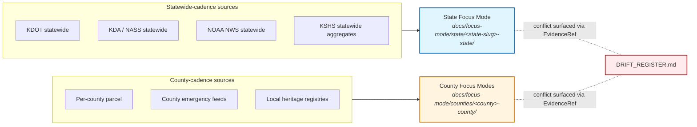
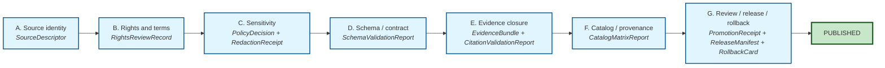

<!--
STATE BUILD PLAN TEMPLATE — KFM Focus Mode Control Plane

Copy this file to:
  docs/focus-mode/state/<state-slug>-state/build-plan.md
  (example: docs/focus-mode/state/kansas-state/build-plan.md)

Replace every <PLACEHOLDER> and fill the YAML front-matter exactly per the spec
in the front-matter block. The validator at
tools/validators/validate_focus_mode_index.py (state extension PROPOSED with
ADR-0028) will REJECT this template while placeholders are present and ACCEPT
a fully-filled instance.

Validator rejection contract (what is checked):
  - kfm_artifact == "focus_mode_build_plan"
  - schema_version == "1"
  - area.lane matches the parent folder name exactly (kebab-case + "-state")
  - area.scope == "state" (PROPOSED; permitted only after ADR-0028 accepted)
  - owner is not an unresolved <PLACEHOLDER>
  - last_reviewed is a valid ISO date, not "YYYY-MM-DD"
  - adr_dependency resolves to an accepted ADR file
  - sensitivity_lanes defaults present; any override carries justification,
    deny-fixture path, and additional_reviewer
  - domain_state_coverage covers all 13 KFM domains
  - canonical_paths.* point inside the responsibility roots named in
    directory-rules.md §6.7

PROPOSED. The "-state" scope suffix is not yet enumerated in
directory-rules.md §6.7. This template MUST NOT be filled out and merged until
ADR-0028-state-scale-focus-mode-scope.md is accepted.

This template is also the spec: do not change required keys or field types
without an ADR (see docs/focus-mode/README.md §20).
-->

---
# === KFM Focus Mode Build Plan front-matter (REQUIRED) ===
# Schema authority: contracts/focus_mode/focus_mode_payload.md §3 (plan→payload crosswalk)
# Validator:        tools/validators/validate_focus_mode_index.py
#                   (state extension PROPOSED with ADR-0028)
schema_version: "1"                        # bump only via ADR
kfm_artifact: "focus_mode_build_plan"      # MUST equal this literal
area:
  state: "<State Name>"                    # human-readable, e.g., "Kansas"
  lane: "<state-slug>-state"               # kebab-case slug + "-state"; MUST match folder name
  scope: "state"                           # PROPOSED (pending ADR-0028); not yet in directory-rules.md §6.7
status: "planned"                          # planned | draft | validated | payload-ready | released | rolled-back | deprecated
owner: "<OWNER:state-lane-steward>"        # GitHub handle or steward role; do not leave blank
priority: "P1"                             # P1 for the canonical state lane
last_reviewed: "YYYY-MM-DD"                # ISO date; updated each substantive revision
plan_anchors:                              # CONFIRMED doctrine citations the plan rests on
  - "directory-rules.md#67"                # Focus Modes placement contract (state suffix PROPOSED)
  - "kfm_unified_doctrine_synthesis.md#8"  # CONFIRMED: Promotion gates A–G (canonical labels)
  - "kfm_unified_doctrine_synthesis.md#11" # cite-or-abstain + finite outcome envelope
  - "docs/focus-mode/README.md#3"          # scales: state, county, region, corridor
adr_dependency: "ADR-0028-state-scale-focus-mode-scope.md"  # REQUIRED before this lane can be merged
ui_shell: "apps/explorer-web"              # MUST be apps/explorer-web
canonical_paths:                           # where artifacts from this plan land
  ui_lane: "apps/explorer-web/src/focus-modes/<state-slug>-state/"
  fixtures: "fixtures/focus_modes/<state-slug>-state/{valid,invalid}/"
  source_descriptors: "data/catalog/sources/<state-slug>-state/source_descriptors.yaml"
  published_payload: "data/published/api_payloads/focus-modes/<state-slug>-state.json"
  release_manifest: "release/manifests/focus_modes/<state-slug>-state-v1.json"
sensitivity_lanes:                         # per-lane outcome; defaults from docs/focus-mode/README.md §15
  parcel_title: "ABSTAIN"                  # state-scale aggregation does NOT lower sensitivity
  exact_archaeology: "DENY"
  burial_sacred: "DENY"
  rare_species_exact: "DENY"
  critical_infrastructure_exact: "DENY"
  living_person_identifiers: "DENY"
  dna_genomic: "DENY"
  emergency_alert: "ABSTAIN"
sensitivity_overrides: []                  # any override at state scale requires extra scrutiny:
#  - lane: "parcel_title"
#    new_outcome: "ANSWER"
#    justification: "..."
#    deny_fixture_path: "fixtures/focus_modes/<state-slug>-state/invalid/..."
#    additional_reviewer: "<OWNER:sensitivity-steward>"
source_seed_families:                      # short list; full ledger in source-seed-list.md
  - "KDOT statewide road & project network"
  - "KDA / NASS statewide agriculture aggregates"
  - "USGS NHD & NWIS (statewide hydrology)"
  - "KGS statewide geology"
  - "KSHS statewide heritage register"
  - "FEMA NFHL statewide floodplain"
  - "NOAA NWS statewide weather & climate"
domain_state_coverage:                     # 13 KFM domains × state scale (see STATE_INDEX.md §5)
  hydrology: "full"
  soil: "full"
  atmosphere: "full"
  geology: "full"
  fauna: "full"
  flora: "full"
  habitat: "full"
  archaeology: "aggregates-only"           # no exact locations at any scale
  settlements_infrastructure: "full"
  hazards: "full"
  agriculture: "full"
  people_dna_land_genealogy: "aggregates-only"
  roads_railroads: "full"
required_layers_min: 0                     # set when layer-registry.md is populated
required_layers_with_policy_decision: 0    # MUST equal required_layers_min before validated
evidence_refs_resolved: 0                  # claims with EvidenceRef that resolves to EvidenceBundle
evidence_refs_total: 0                     # all claims in evidence-model.md; resolved/total MUST be 1.0 to advance past draft
release:
  promotion_gates_passed: []               # subset of [A, B, C, D, E, F, G]; must be all seven to reach released
  release_manifest_id: null                # set when MapReleaseManifest is signed
  rollback_target_id: null                 # set when rollback target is recorded
  correction_path: null                    # how a correction is filed for this slice
adr_open_questions:                        # any ADR triggers raised by this plan
  - "ADR-0028 (state scope) — REQUIRED before merge"
# === end front-matter ===
---

# `<State Name>` State Focus Mode — Build Plan

> *Per-slice planning and acceptance artifact for one state-scale Focus Mode. Becomes a `FocusModePayload` only through the crosswalk in `contracts/focus_mode/focus_mode_payload.md §3` after all seven promotion gates pass.*

> **Status:** see front-matter `status` · **Lane:** `docs/focus-mode/state/<state-slug>-state/` · **Owner:** see front-matter `owner` · **Priority:** see front-matter `priority`

-orange)

-lightgrey)

> [!IMPORTANT]
> This file is one of **seven required files** per area lane (§13 of `docs/focus-mode/README.md`). It is a **planning + acceptance** artifact, **not a publication target**. The slice becomes a `FocusModePayload` only through the crosswalk in `contracts/focus_mode/focus_mode_payload.md` §3, and only after gates A–G (§9) all pass.

> [!CAUTION]
> **This template MUST NOT be filled out and merged until `ADR-0028-state-scale-focus-mode-scope.md` is accepted.** Until then, the `-state` scope suffix has no authority in `directory-rules.md` §6.7, and any state-scale lane will be rejected by `tools/validators/validate_focus_mode_index.py`.

> [!NOTE]
> **How to use this template.** Copy this file to `docs/focus-mode/state/<state-slug>-state/build-plan.md`, then (1) fill every `<PLACEHOLDER>` in the YAML front-matter, (2) fill every `PROPOSED. <prompt>.` narrative under §§1–11 with slice-specific content, and (3) keep section anchor IDs unchanged so the validator's anchor checks pass. The validator's rejection contract is listed in the HTML comment at the top of this file.

---

## Contents

- [1. Slice scope](#1-slice-scope)
- [2. Geographic and temporal frame (statewide)](#2-geographic-and-temporal-frame-statewide)
- [3. Domains in scope (13 × state)](#3-domains-in-scope-13--state)
- [4. Source-seed signals (statewide summary)](#4-source-seed-signals-statewide-summary)
- [5. Layer plan (statewide summary)](#5-layer-plan-statewide-summary)
- [6. Evidence model (statewide summary)](#6-evidence-model-statewide-summary)
- [7. Public-safety posture (state-scale)](#7-public-safety-posture-state-scale)
- [8. State ↔ county composition](#8-state--county-composition)
- [9. Promotion path](#9-promotion-path)
- [10. Acceptance criteria reference](#10-acceptance-criteria-reference)
- [11. Open questions](#11-open-questions)
- [12. Cross-references](#12-cross-references)
- [Appendix — glossary and template legend](#appendix--glossary-and-template-legend)

---

## 1. Slice scope

PROPOSED. State, in one paragraph, what a public user can ask of this state-scale Focus Mode and what they will get back. Statewide answers compose from statewide-cadence sources; questions whose answer requires *exact* parcel / archaeological / critical-infrastructure detail are answered with the default sensitivity posture (DENY/ABSTAIN per §7), **not** by upscaling a county-scale answer.

> [!TIP]
> When filling: keep it to one paragraph. Lead with what the slice **does** answer; close with one sentence on what it **refuses** to answer at state scale.

[↑ Back to top](#top)

---

## 2. Geographic and temporal frame (statewide)

PROPOSED. Bounding geometry (state boundary plus tolerance), CRS, time window for layers (earliest/latest source observation at statewide cadence), refresh cadence per source family. The `MapContextEnvelope` schema at `schemas/contracts/v1/ui/map_context_envelope.schema.json` defines acceptable bounds/time fields; state bounds use the canonical Kansas envelope.

| Frame attribute | Required content | Example (illustrative) |
|---|---|---|
| Bounding geometry | State polygon + buffer tolerance (m) | Kansas polygon, 1 km buffer |
| CRS | EPSG code; document any reprojection at slice boundary | EPSG:4326 (display); EPSG:5070 (analysis) |
| Time window | `earliest` / `latest` ISO timestamps spanning published layers | `1850-01-01T00:00:00Z` → `2026-05-21T00:00:00Z` |
| Refresh cadence | Per source family (daily / weekly / monthly / annual / on-event) | NOAA NWS: minutes-to-hours; KSHS: annual |
| Temporal-role separation | One column per role: `source_time`, `observed_time`, `valid_time`, `retrieval_time`, `release_time`, `correction_time` | (kept distinct where material) |

[↑ Back to top](#top)

---

## 3. Domains in scope (13 × state)

PROPOSED. The 13 KFM domains, each represented at state scale. The body below **narrates** the coverage label that the front-matter `domain_state_coverage` already declares. Two domains (archaeology, people/DNA/land/genealogy) are **aggregates-only** at state scale by default (see §7).

> [!NOTE]
> The table below mirrors front-matter `domain_state_coverage`. If you edit the table, edit the front-matter; the validator compares both.

| # | Domain | Front-matter coverage | Narrative note (fill at slice time) |
|---|---|---|---|
| 1 | Hydrology | `full` | PROPOSED. |
| 2 | Soil | `full` | PROPOSED. |
| 3 | Atmosphere | `full` | PROPOSED. |
| 4 | Geology | `full` | PROPOSED. |
| 5 | Fauna | `full` | PROPOSED. |
| 6 | Flora | `full` | PROPOSED. |
| 7 | Habitat | `full` | PROPOSED. |
| 8 | Archaeology | **`aggregates-only`** | PROPOSED — no exact locations at any scale (see §7). |
| 9 | Settlements / Infrastructure | `full` | PROPOSED — note any sensitive critical-infrastructure carve-outs. |
| 10 | Hazards | `full` | PROPOSED. |
| 11 | Agriculture | `full` | PROPOSED. |
| 12 | People / DNA / Land / Genealogy | **`aggregates-only`** | PROPOSED — living-person, DNA, and parcel-title fail-closed per §7. |
| 13 | Roads / Railroads | `full` | PROPOSED. |

[↑ Back to top](#top)

---

## 4. Source-seed signals (statewide summary)

PROPOSED. Bulleted summary; full ledger in `source-seed-list.md`. State-scale sources are the **statewide-cadence feeds** (e.g., KDOT statewide network, KDA/NASS statewide aggregates, NOAA NWS statewide); avoid county-cadence sources here — those belong in `docs/focus-mode/counties/<county>-county/`.

| Source-seed family (from front-matter) | Role at state scale | Notes (fill at slice time) |
|---|---|---|
| KDOT statewide road & project network | Statewide roads / projects | PROPOSED. |
| KDA / NASS statewide agriculture aggregates | Statewide ag aggregates | PROPOSED. |
| USGS NHD & NWIS (statewide hydrology) | Statewide hydrology | PROPOSED. |
| KGS statewide geology | Statewide geology | PROPOSED. |
| KSHS statewide heritage register | Statewide heritage (aggregates-only) | PROPOSED. |
| FEMA NFHL statewide floodplain | Statewide floodplain | PROPOSED. |
| NOAA NWS statewide weather & climate | Statewide weather/climate | PROPOSED. |

> [!IMPORTANT]
> Every source family enumerated here MUST appear as a `SourceDescriptor` under `data/catalog/sources/<state-slug>-state/source_descriptors.yaml` before this slice can advance past `draft`.

[↑ Back to top](#top)

---

## 5. Layer plan (statewide summary)

PROPOSED. Bulleted summary; per-layer detail (source, policy, evidence ref, style ref, sensitivity tier) lives in `layer-registry.md`. Each entry MUST have a `SourceDescriptor`, a `LayerManifest`, a `PolicyDecision`, and a sensitivity label.

> [!CAUTION]
> The front-matter counters `required_layers_min` and `required_layers_with_policy_decision` MUST be equal before `status` advances to `validated`. The validator enforces this.

| Layer-plan column | Required value at slice time |
|---|---|
| `layer_id` | Stable identifier; appears in `LayerManifest` |
| `source_descriptor` | Path under `data/catalog/sources/<state-slug>-state/` |
| `policy_decision` | `ALLOW` / `DENY` / `HOLD` per layer |
| `style_ref` | Style file under `apps/explorer-web/src/focus-modes/<state-slug>-state/` |
| `sensitivity_tier` | `T0` – `T4` per `kfm_unified_doctrine_synthesis.md` §15 |
| `evidence_ref` | Resolves to `EvidenceBundle` under `data/published/.../<state-slug>-state/` |

[↑ Back to top](#top)

---

## 6. Evidence model (statewide summary)

PROPOSED. What claims the state slice will display, each tied to an `EvidenceRef` ID. Full model in `evidence-model.md`. **Cite-or-abstain is the default truth posture.**

The front-matter counters `evidence_refs_resolved` and `evidence_refs_total` track closure. The ratio MUST be `1.0` (every claim resolves to an `EvidenceBundle`) before the slice advances past `draft`. A claim whose `EvidenceRef` does not resolve **MUST** be removed from the model or marked `ABSTAIN`-only — it does not pass through silently.

[↑ Back to top](#top)

---

## 7. Public-safety posture (state-scale)

PROPOSED. **State-scale aggregation does NOT lower sensitivity.** The default fail-closed lanes (from front-matter `sensitivity_lanes`) carry the same outcomes at state scale as at county scale.

| Sensitivity lane | Default outcome (state scale) | Why fail-closed |
|---|---|---|
| `parcel_title` | **ABSTAIN** | Living-person + private-land collision; even aggregated, exact title implication risks reidentification. |
| `exact_archaeology` | **DENY** | Looting risk; KSHS / federal protections; aggregates-only at every scale. |
| `burial_sacred` | **DENY** | Tribal-sovereignty and cultural-sensitivity floor; no exact public exposure. |
| `rare_species_exact` | **DENY** | Poaching / collection risk; exact occurrence denied for sensitive taxa. |
| `critical_infrastructure_exact` | **DENY** | Security; aggregates only. |
| `living_person_identifiers` | **DENY** | Privacy floor. |
| `dna_genomic` | **DENY** | Consent + revocation discipline. |
| `emergency_alert` | **ABSTAIN** | KFM is not an emergency-broadcast surface; defer to authoritative NWS / state EOC. |

Any override requires:

- a written **justification**;
- a **deny-fixture** under `fixtures/focus_modes/<state-slug>-state/invalid/` exercising the exact outcome the override changes;
- an **additional reviewer** (`additional_reviewer:` in the override entry) — state-scale overrides require sensitivity-steward sign-off, not just lane-owner sign-off.

> [!WARNING]
> Empty `sensitivity_overrides: []` is the expected default. A non-empty override list triggers Gate C (Sensitivity) re-review on every revision and changes the gate evidence requirements.

[↑ Back to top](#top)

---

## 8. State ↔ county composition

PROPOSED. The state lane is **NOT** a sum of all 105 county lanes. It composes from **statewide-cadence sources independently**. Where a county-scale answer disagrees with the state-scale answer for the same claim, both are surfaced via `EvidenceRef`s; the conflict is recorded in `docs/registers/DRIFT_REGISTER.md`, **not silently reconciled**.

> [!NOTE]
> **Anti-collapse rule.** The state slice does not "upscale" a county answer, and the county slice does not "downscale" a state answer. They are independent compositions over different source cadences; their relationship is governed by `EvidenceRef` and the drift register, not by aggregation arithmetic.

[↑ Back to top](#top)

---

## 9. Promotion path

PROPOSED. The seven promotion gates A–G (per `kfm_unified_doctrine_synthesis.md §8`, CONFIRMED canonical labels) this slice must clear before `released`. **Per-slice promotion is a governed state transition, not a file move.**

> [!IMPORTANT]
> **Canonical gate labels.** The labels below match `kfm_unified_doctrine_synthesis.md §8` (CONFIRMED). Pass 10 C5-01 notes that the corpus has used slightly different labels in different sections; ADR-S-08 (PROPOSED) would finalize them. Use these labels in front-matter `release.promotion_gates_passed[]` and in CI workflow names.

| Gate | Canonical purpose (synthesis §8) | What this slice checks at state scale | Required artifact | Status |
|---|---|---|---|---|
| **A — Source identity** | `SourceDescriptor` exists; source role + authority class known. | Every statewide source family in §4 has a `SourceDescriptor` under `canonical_paths.source_descriptors`. | `SourceDescriptor` validation report. | not-run |
| **B — Rights and terms** | License / terms / contact / attribution obligations resolved. | Every source's SPDX license is on the allowlist; attribution carried forward into `LayerManifest`. | `RightsReviewRecord`. | not-run |
| **C — Sensitivity** | Living-person, DNA, archaeology, rare species, infrastructure, cultural sensitivity, private land, or sovereignty risks resolved. | §7 sensitivity-lane defaults applied; any override has fixture + additional reviewer. | `PolicyDecision` + `RedactionReceipt` (where transformed). | not-run |
| **D — Schema / contract** | Artifacts match schemas and API contracts. | Every layer-registry entry validates against `schemas/contracts/v1/focus_mode/`; payload validates against `focus_mode_payload.schema.json`. | `SchemaValidationReport`. | not-run |
| **E — Evidence closure** | `EvidenceRef` resolves to `EvidenceBundle`; citations valid. | `evidence_refs_resolved == evidence_refs_total`; every §6 claim has a resolving bundle. | `EvidenceBundle` + `CitationValidationReport`. | not-run |
| **F — Catalog / provenance** | STAC / DCAT / PROV and `CatalogMatrix` closed. | Catalog entries published under `data/catalog/sources/<state-slug>-state/` and `data/catalog/stac/<state-slug>-state/`. | `CatalogMatrixReport`. | not-run |
| **G — Review / release / rollback** | `PromotionDecision`, release manifest, proof pack, rollback target, correction path. | `release.release_manifest_id` and `release.rollback_target_id` set; reviewer ≠ author; correction path declared. | `PromotionReceipt` + `ReleaseManifest` + `RollbackCard`. | not-run |

> [!CAUTION]
> **A gate that did not run is a gate that failed.** Empty `release.promotion_gates_passed[]` does not mean "all green" — it means **zero**. The validator and Conftest/OPA bundle default-deny when evidence is missing (Pass 10 C5-02, CONFIRMED).

[↑ Back to top](#top)

---

## 10. Acceptance criteria reference

The state-scale acceptance items **(a)–(h)**, modelled on COUNTY-01 with state-scale wording, live in `acceptance-checklist.md`. The validator checks that file for the eight literal items and verifies each item is marked `pass`, `fail`, or `not-run` (no other values accepted).

| Acceptance item | What it asserts (paraphrased; see `acceptance-checklist.md` for canonical text) |
|---|---|
| (a) | Front-matter validates against the schema in this template. |
| (b) | All 13 domains have a coverage label in `domain_state_coverage`. |
| (c) | Every source family in §4 has a `SourceDescriptor`. |
| (d) | Every layer in `layer-registry.md` has a `PolicyDecision`. |
| (e) | `evidence_refs_resolved == evidence_refs_total > 0`. |
| (f) | Sensitivity lanes match §7 defaults or carry compliant overrides. |
| (g) | Promotion gates A–G all `pass`. |
| (h) | Release manifest + rollback target + correction path declared. |

[↑ Back to top](#top)

---

## 11. Open questions

PROPOSED. Open `NEEDS VERIFICATION` / `UNKNOWN` items specific to this slice. The ADR-0028 dependency is already declared in front-matter `adr_open_questions[]` and is **not** a per-slice question.

| # | Question / item | Class | Resolves when |
|---|---|---|---|
| 1 | `PROPOSED — fill at slice time` | `NEEDS VERIFICATION` | `<evidence that would settle>` |

[↑ Back to top](#top)

---

## 12. Cross-references

| Reference | Role | Status |
|---|---|---|
| `docs/focus-mode/README.md` | Control plane (state + county scales) | PROPOSED |
| `docs/focus-mode/state/STATE_INDEX.md` | Master index (state scale) | PROPOSED |
| `docs/focus-mode/counties/COUNTY_INDEX.md` | Companion index (county scale) | PROPOSED |
| `contracts/focus_mode/focus_mode_payload.md` §3 | Plan → payload crosswalk | PROPOSED |
| `schemas/contracts/v1/focus_mode/focus_mode_payload.schema.json` | Payload machine schema | PROPOSED |
| `schemas/contracts/v1/ui/map_context_envelope.schema.json` | `MapContextEnvelope` schema | PROPOSED |
| `tools/validators/validate_focus_mode_index.py` | Validator (state extension PROPOSED with ADR-0028) | PROPOSED |
| `directory-rules.md` §6.7 | Focus Mode placement contract | CONFIRMED doctrine |
| `kfm_unified_doctrine_synthesis.md` §8 | Promotion gates A–G (canonical labels) | CONFIRMED doctrine |
| `kfm_unified_doctrine_synthesis.md` §11 | Finite outcome envelope vocabulary | CONFIRMED doctrine |
| `docs/adr/ADR-0028-state-scale-focus-mode-scope.md` | REQUIRED scope-extension ADR | PROPOSED |

[↑ Back to top](#top)

---

## Appendix — glossary and template legend

<strong>A.1 Key objects referenced by this template</strong>

| Object | One-line role *(per `kfm_unified_doctrine_synthesis.md §10`, CONFIRMED)* |
|---|---|
| `SourceDescriptor` | Identity, role, authority class, rights, sensitivity precheck of a source. |
| `RightsReviewRecord` | Resolved license / terms / contact / attribution obligations. |
| `PolicyDecision` | `ALLOW` / `DENY` / `HOLD` with reason codes and obligations. |
| `RedactionReceipt` | Record of a public-safe field or geometry transformation. |
| `SchemaValidationReport` | PASS/FAIL across schema and API contract checks. |
| `EvidenceRef` / `EvidenceBundle` | Reference that must resolve to a closed evidence package before public claim authority. |
| `CitationValidationReport` | Pass/fail citation closure for the slice. |
| `CatalogMatrixReport` | STAC / DCAT / PROV / graph closure across the slice. |
| `PromotionReceipt` | Signed record of a `PromotionDecision`. |
| `ReleaseManifest` | Authoritative record of what is `PUBLISHED`. |
| `RollbackCard` | Rollback target preserving history while repointing current release state. |
| `FocusModePayload` | The bounded, released, citation-closed evidence projection this plan ultimately produces. |
| `MapContextEnvelope` | Bounded context (camera + layer IDs + feature IDs + temporal snapshot + release refs + selected evidence refs). |

<strong>A.2 Placeholder legend</strong>

| Token in this template | Meaning | Replace with |
|---|---|---|
| `<State Name>` | Human-readable state name | e.g., `Kansas` |
| `<state-slug>` | Kebab-case slug | e.g., `kansas` |
| `<state-slug>-state` | Lane folder name | e.g., `kansas-state` |
| `<OWNER:state-lane-steward>` | GitHub handle or steward role | e.g., `@<handle>` or `state-lane-steward` |
| `<OWNER:sensitivity-steward>` | Additional reviewer role | e.g., `sensitivity-steward` |
| `YYYY-MM-DD` | ISO date | e.g., `2026-05-24` |
| `PROPOSED.` lines under §§1–11 | Author prompt | Slice-specific narrative; remove the `PROPOSED.` prefix only when the underlying claim is verified. |

<strong>A.3 Validator rejection signals (quick reference)</strong>

The validator at `tools/validators/validate_focus_mode_index.py` (state extension PROPOSED with ADR-0028) returns a `DecisionEnvelope` with `outcome ∈ {PASS, FAIL, ERROR}`. Common reject reasons:

| Reason code (PROPOSED) | Likely cause |
|---|---|
| `placeholder_unresolved` | `<State Name>`, `<state-slug>`, `<OWNER:...>`, or `YYYY-MM-DD` still present. |
| `lane_folder_mismatch` | `area.lane` does not match the parent folder name. |
| `scope_not_accepted` | `area.scope == "state"` but ADR-0028 not accepted. |
| `domain_coverage_incomplete` | `domain_state_coverage` is missing one or more of the 13 domains. |
| `sensitivity_override_unsupported` | `sensitivity_overrides[]` entry missing `justification`, `deny_fixture_path`, or `additional_reviewer`. |
| `evidence_closure_open` | `evidence_refs_resolved != evidence_refs_total` while `status` ≥ `validated`. |
| `gate_letter_unknown` | `release.promotion_gates_passed[]` contains a value outside `[A, B, C, D, E, F, G]`. |

---

**Related (mini)** · [`docs/focus-mode/README.md`](../../README.md) · [`docs/focus-mode/state/STATE_INDEX.md`](../STATE_INDEX.md) · [`directory-rules.md` §6.7](../../../../directory-rules.md) · [`kfm_unified_doctrine_synthesis.md` §8](../../../../kfm_unified_doctrine_synthesis.md) · [`contracts/focus_mode/focus_mode_payload.md`](../../../../contracts/focus_mode/focus_mode_payload.md)

**Last updated:** see front-matter `last_reviewed` · **Template version:** front-matter `schema_version: "1"` · **Path status:** PROPOSED *(pending ADR-0028)*

[↑ Back to top](#top)
