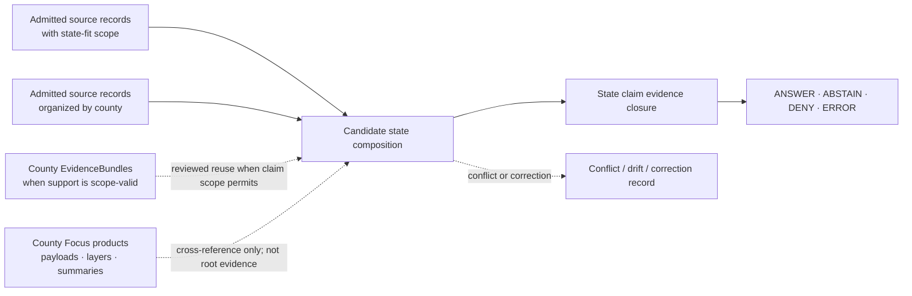

<!-- [KFM_META_BLOCK_V2]
doc_id: kfm://doc/focus-mode/state/template/state-build-plan
title: State-Scale Focus Mode Build-Plan Template
type: standard; authoring-template; geographic-state-composition; compatibility-lane
version: v2.0
status: draft; repository-grounded; template; proposed-scope; placement-hold; non-executable; non-release; non-publication
owner: "@bartytime4life via CODEOWNERS; geographic-scope, Focus Mode, domain-profile, evidence, sensitivity, validation, runtime, release, correction, and rollback stewardship NEEDS VERIFICATION"
created: 2026-05-24
updated: 2026-08-22
policy_label: public; documentation; focus-mode; geographic-state; template; cite-or-abstain; fail-closed; no-release; no-publication
owning_root: docs/
responsibility: >-
  Provide a reusable human authoring scaffold for a possible geographic
  state-scale Focus composition while keeping scope acceptance, placement,
  machine shape, source admission, evidence closure, policy, validation,
  runtime behavior, review, release, correction, and rollback visibly outside
  this document's authority.
authority: >-
  Human-readable planning prompts, candidate-record structure, compatibility
  anchors, and maintenance guidance only. This file is not a scope registry,
  semantic contract, schema, validator input accepted by current tooling,
  PolicyDecision, lifecycle object, release record, deployment instruction, or
  publication surface.
current_path: docs/focus-mode/state/_template/state-build-plan.md
canonical_relationship: >-
  Same-path documentation replacement inside the repository-present singular
  Focus compatibility lane. Accepted Directory Rules v2 permits maintenance at
  this existing docs path but does not accept ADR-0028, register kansas-state,
  choose a future state-composition lane, or authorize the mixed state tree's
  split or migration.
truth_posture: >-
  CONFIRMED the current path and prior v1 bytes, the repository-grounded sibling
  template boundary and state planning index, accepted ADR-0029 and adopted
  Directory Rules v2, proposed ADR-0028, the county-only Focus index validator,
  its absence from the validator registry, the proposed county-oriented
  FocusModePayload contract, the mixed Focus schema family, and the four
  runtime-envelope outcomes ANSWER, ABSTAIN, DENY, and ERROR / LINEAGE the prior
  thirteen-domain list, source-seed examples, A-G promotion shorthand, candidate
  sensitivity lanes, and section-13 plan-data concept / PROPOSED the state
  scope, scope identity, domain profile, candidate record, cross-scale rule,
  future schema/validator binding, and implementation sequence / CONFLICTED the
  prior copy target, schema path, data/catalog source home, canonical-gate, and
  current-validator claims versus present repository evidence / UNKNOWN live
  state-scale sources, EvidenceBundles, policy results, accountable reviews,
  state payloads, governed API behavior, map rendering, release, correction
  propagation, rollback execution, deployment, and public parity / NEEDS
  VERIFICATION final owners, accepted identity, path decision, domain-profile
  authority, contract/schema/fixture closure, validator registration, exact-head
  hosted checks, and every public-use claim.
evidence_snapshot:
  repository: bartytime4life/Kansas-Frontier-Matrix
  base_ref: main
  inspected_commit: d31fb8d39bc4f1672d331d9496ff428293419fa3
  target_prior_blob: e7d2f2542ddcfee416c4d3fd709e972ff193d446
  sibling_template_readme_blob: d7ee33a09216b1eaf043132d5b5afbff2a8095cd
  state_parent_readme_blob: d425796ba953f55684b77fe6dcadeff2a86b1f39
  state_index_blob: 10ad49892773c17d05faeb3ffccbf09dc306bf4b
  parent_focus_readme_blob: 8600c0ac09452b4b03e5f60b94f1eb27c072b5db
  directory_rules_blob: fd49a0b83e55cef52c1124281f093e263526898d
  adr_0028_blob: d14ea2b4ad57294ab52da643c954a7f83d5e24e9
  adr_0029_blob: a4de0d7a96b78da59cfc499d1025e1508afd8dd9
  focus_index_validator_blob: 89391d75680e859dddf3696b9b782369f364c73e
  validator_registry_blob: 86aeadabe7104114c3f1efe60a8708ec11563bb1
  focus_mode_payload_contract_blob: 7fe687d587cd60dafd6e3fa34306cd58fd125c73
  focus_schema_family_readme_blob: 2b75990b53dea2841c28410f0d9dc9fb10a60f33
  runtime_response_schema_blob: 8b86e7db8b18b65a56a4e639dfc54e1b2db93155
  codeowners_blob: dd2a84aa514d8ecd9208bc347f90f9a2ed37dd61
inspection_boundary: >-
  Current-session GitHub reads covered the complete prior template, its sibling
  boundary, the parent state and Focus boundaries, the state planning index,
  ADR-0028, accepted ADR-0029, adopted Directory Rules v2, the FocusModePayload
  semantic contract, Focus schema-family index, runtime response schema, Focus
  index validator, validator registry, CODEOWNERS, open pull-request overlap,
  and the existing task branch. No mounted checkout, source admission,
  EvidenceRef resolution, policy evaluation, state schema or validator
  execution, governed request, UI render, release packet, correction cascade,
  rollback drill, deployment, or public endpoint was exercised.
related:
  - ./README.md
  - ../README.md
  - ../STATE_INDEX.md
  - ../../README.md
  - ../../../doctrine/directory-rules.md
  - "../../../adr/ADR-0028 — State-scale Focus Mode scope.md"
  - ../../../adr/ADR-0029-adopt-directory-governance-standard-v2.md
  - ../../../../contracts/focus_mode/focus_mode_payload.md
  - ../../../../contracts/ui/map_context_envelope.md
  - ../../../../contracts/runtime/runtime_response_envelope.md
  - ../../../../schemas/contracts/v1/focus/README.md
  - ../../../../schemas/contracts/v1/runtime/runtime_response_envelope.schema.json
  - ../../../../tools/validators/validate_focus_mode_index.py
  - ../../../../tools/validators/validator_registry.json
  - ../../../../.github/CODEOWNERS
tags: [kfm, focus-mode, state-scale, template, authoring, evidence, sensitivity, validation, compatibility, rollback, non-publication]
notes:
  - "v2.0 replaces behavior-assertive v1 prose with a repository-grounded authoring boundary while preserving the numbered section anchors and one structured candidate-data block."
  - "The prior destination path, state-validator binding, focus_mode schema path, data/catalog source-home claim, and canonical A-G gate claim are no longer presented as current authority."
  - "ADR-0028 remains proposed; no state scope, state lane, state payload, or state-aware validator is established by this file."
  - "Section 13 is a non-executable candidate record until an accepted contract, schema, validator, fixtures, registry entry, and path decision explicitly bind it."
  - "No source, evidence, policy, lifecycle, review, release, correction, rollback, deployment, publication, or repository-setting transition is performed by this document."
[/KFM_META_BLOCK_V2] -->

<a id="top"></a>
<a id="state-name-state-focus-mode--build-plan"></a>

# State-Scale Focus Mode Build-Plan Template

> **Purpose.** Help a future author describe one bounded geographic state
> composition without turning a planning document into scope authority,
> implementation evidence, a public payload, or a release decision.

[](#status-and-authority-boundary)
[](#1-slice-scope)
[](#status-and-authority-boundary)
[](#13-plan-data-block-validator-input)
[](#6-evidence-model-statewide-summary)
[](#9-promotion-path)

> [!IMPORTANT]
> **This file is an authoring template, not an executable specification.**
> Completing its prompts or structured block does not accept a scope, establish
> placement, admit a source, resolve evidence, issue policy, pass validation,
> create lifecycle state, authorize release, deploy a service, or publish.

> [!CAUTION]
> **Do not copy this template to a new state lane yet.** ADR-0028 remains
> `proposed`; `kansas-state` is not verified as a registered scope; the parent
> state tree mixes geographic and system-state material; and accepted Directory
> Rules v2 does not select an exact future instance path. The placement outcome
> for a new state lane is therefore `HOLD`.

> [!WARNING]
> **The current Focus index validator does not parse this template.**
> `tools/validators/validate_focus_mode_index.py` is county-oriented, admits
> `county`, `region`, and `corridor`, expects a different tree and record
> grammar, and is absent from the validator registry. Section 13 below is
> structured planning lineage only until an accepted machine binding exists.

> [!NOTE]
> **Template maturity and governed maturity are separate.** Markdown structure,
> resolved placeholders, a valid-looking YAML block, a commit, a pull request,
> a merge, or a green check cannot substitute for evidence, policy, review,
> release, correction, or rollback.

**Quick navigation:** [Boundary](#status-and-authority-boundary) ·
[Use](#safe-authoring-sequence) ·
[Scope](#1-slice-scope) ·
[Space/time](#2-geographic-and-temporal-frame-statewide) ·
[Domains](#3-domains-in-scope-13--state) ·
[Sources](#4-source-seed-signals-statewide-summary) ·
[Layers](#5-layer-plan-statewide-summary) ·
[Evidence](#6-evidence-model-statewide-summary) ·
[Safety](#7-public-safety-posture-state-scale) ·
[State/county](#8-state--county-composition) ·
[Promotion](#9-promotion-path) ·
[Acceptance](#10-acceptance-criteria-reference) ·
[Open work](#11-open-questions) ·
[References](#12-cross-references) ·
[Candidate data](#13-plan-data-block-validator-input) ·
[Appendix](#appendix--glossary-and-template-legend)

---

<a id="status-and-authority-boundary"></a>

## Status and authority boundary

| Question | Current bounded answer | Truth label |
|---|---|---|
| Does this template exist at the requested path? | Yes. The prior v1 file is tracked at blob `e7d2f2542ddcfee416c4d3fd709e972ff193d446`. | `CONFIRMED` |
| What owns this file? | `docs/` owns human-readable authoring guidance. CODEOWNERS routes review to `@bartytime4life`; routing is not specialist or release authority. | `CONFIRMED` |
| Is geographic state scope accepted? | No. ADR-0028 remains proposed. | `CONFIRMED` proposed status |
| Is `kansas-state` registered? | No accepted machine registration was verified. | `UNKNOWN / NOT ESTABLISHED` |
| Is an instance path approved? | No. Same-path maintenance is allowed; a new state lane remains `HOLD`. | `CONFIRMED` current disposition |
| Does the current Focus validator support `state` or this section-13 grammar? | No. It is county-oriented, excludes `state`, and is not registered in the current validator registry. | `CONFIRMED` |
| Is a state `FocusModePayload` schema present at the prior asserted `schemas/contracts/v1/focus_mode/` path? | No such accepted state payload family was verified; the present `focus/` family is mixed and proposed. | `CONFIRMED` checked boundary; maturity `NOT ESTABLISHED` |
| What is the current client runtime outcome enum? | `ANSWER`, `ABSTAIN`, `DENY`, and `ERROR`. | `CONFIRMED` machine shape; schema status remains proposed |
| Does this template authorize release, deployment, or publication? | No. | `CONFIRMED` |
| Is state-scale runtime behavior implemented? | No end-to-end state source, evidence, policy, payload, API, map, release, correction, or rollback flow was verified in this work. | `UNKNOWN`; do not infer |

### Truth and work labels

| Label | Use in this template |
|---|---|
| `CONFIRMED` | Verified from current repository bytes or remote state. |
| `PROPOSED` | Design or decision not accepted or implemented. |
| `LINEAGE` | Retained prior planning content; not current authority by itself. |
| `CONFLICTED` | Current sources or writable surfaces make incompatible claims. |
| `UNKNOWN` | Evidence does not establish the material claim. |
| `NEEDS VERIFICATION` | A concrete check can settle the question but has not. |
| `NOT_RUN` | A named executable or external check was not performed. |
| `HOLD` | Authority, identity, placement, sensitivity, review, or release is unresolved; do not advance. |
| `DENY` | The action would create parallel authority, expose protected state, or bypass a control. |

### Directory Rules basis

Accepted Directory Rules v2 supplies the placement law for this same-path edit:

- `docs/` owns human explanation and reusable authoring guidance.
- Geography and Focus Mode are composition scopes, not roots or domains.
- Scope is added only after one owning responsibility root and a registered
  `scope_id` are known.
- Mixed authority returns `SPLIT`; unresolved ownership or targets return `HOLD`.
- Documentation may describe adjacent authority but cannot create semantic,
  schema, policy, data, release, or runtime authority.
- Same-path revision of this tracked template is `PLACE`; copying it to an
  unapproved new lane is not.

### Material reconciliation from v1

| Prior v1 assertion or pattern | Current evidence | v2 treatment |
|---|---|---|
| Copy to `docs/focus-mode/state/<state-slug>-state/build-plan.md` | ADR-0028 is proposed; exact future placement is unresolved. | Destination removed as current instruction; instance path remains `HOLD`. |
| Current validator parses the section-13 YAML and admits `state` | Validator permits only `county`, `region`, and `corridor` and is absent from the registry. | Section 13 is explicitly non-executable candidate data. |
| `schemas/contracts/v1/focus_mode/focus_mode_payload.schema.json` is the active state schema | That path/family is not established; `schemas/contracts/v1/focus/` is a mixed proposed family. | No state schema binding is claimed. |
| Source descriptors belong under `data/catalog/sources/...` | Directory Rules v2 places source identity under `data/registry/sources/`; catalog is a projection. | Source candidates refer to admitted registry identity; no path is created here. |
| Promotion gates A–G are canonical and complete | Gate vocabulary and binding remain decision-sensitive; repository objects and implementations are uneven. | Functional closure areas are retained; letter labels remain lineage until accepted. |
| Thirteen domains are fully or aggregate-covered by default | Current 13-entry machine projection is proposed; no accepted state profile or digest is bound. | Thirteen rows remain planning lineage and start at `hold`. |
| A filled template becomes a payload after prose-declared gates | The semantic contract is proposed and county-oriented; state schema, fixtures, validator, runtime, and release are absent. | Template, candidate, validated payload, and released product remain separate transitions. |

Repository presence proves bytes exist. It does not prove semantic acceptance,
machine conformance, evidence sufficiency, policy permission, review approval,
release eligibility, deployment, or public parity.

[Back to top](#top)

---

<a id="safe-authoring-sequence"></a>

## Safe authoring sequence

Do not instantiate this file until the first four prerequisites below are
confirmed. When future authority closes, use the remaining steps in order.

1. **Accept or supersede the scope decision.** Confirm the effective status and
   exact decision text for state composition.
2. **Register identity.** Record one stable `scope_id`, aliases, owner, status,
   compatibility rules, and correction route in the accepted machine authority.
3. **Resolve placement.** Produce a reviewed path decision for the mixed state
   tree, exact instance home, links, consumers, migration, and rollback.
4. **Bind the template.** Accept the semantic contract, machine schema, fixtures,
   validator, registry entry, and finite outcomes that govern a state plan.
5. **Create the candidate at the approved path.** Do not infer the path from this
   compatibility template.
6. **Update all three authoring surfaces.** Complete document metadata, human
   narrative, and section-13 candidate data without collapsing their roles.
7. **Keep unknowns explicit.** Leave evidence, policy, review, release,
   correction, and rollback references null or held until their owning objects
   exist and were inspected.
8. **Run repository-native checks.** Record exact commands, commit, fixtures,
   results, and known limitations; do not hand-author a pass receipt.
9. **Request accountable review.** CODEOWNERS routing alone does not satisfy
   domain, sensitivity, evidence, security, or release review.
10. **Promote separately.** A released state product requires its own governed
    decision, public-safe carriers, correction path, and rollback target.

[Back to top](#top)

---

<a id="1-slice-scope"></a>

## 1. Slice scope

Replace this guidance with one bounded paragraph plus the table below.

**Authoring prompt.** Describe what a public or steward user may ask of the
candidate state composition, what spatial and temporal scope the response covers,
which released carriers may be shown, and which questions must abstain, deny, or
narrow. Do not promise a route, layer, source, answer, or public product that has
not been verified.

| Scope field | Required candidate statement |
|---|---|
| User question class | `<bounded questions this composition is intended to support>` |
| Intended output | `<map context, evidence drawer projection, bounded explanation, review-only output, or other verified carrier>` |
| Geographic scope | `<registered scope ref after acceptance; otherwise NEEDS VERIFICATION>` |
| Temporal scope | `<valid/observed/source/retrieval/release interval supported by evidence>` |
| Evidence threshold | `<what must resolve before ANSWER is eligible>` |
| Policy threshold | `<what must be allowed or transformed before exposure>` |
| Explicit non-goals | `<questions, precision, actions, or source roles outside scope>` |
| Runtime posture | `ANSWER`, `ABSTAIN`, `DENY`, or `ERROR`; `HOLD` is not a client runtime outcome |
| Public state | `<review-only, candidate, or released; never infer from this document>` |

> [!IMPORTANT]
> **A state-scale question is not automatically a statewide answer.** Evidence
> must support the requested geography, time, semantics, precision, rights, and
> source role. Broad scope never repairs narrow or incomplete support.

[Back to top](#top)

---

<a id="2-geographic-and-temporal-frame-statewide"></a>

## 2. Geographic and temporal frame (statewide)

Complete the frame with stable references, not copied geometry or approximate
dates. Record every material transform and the precision actually supported.

| Frame attribute | Required candidate content | Closure evidence |
|---|---|---|
| Scope identity | Accepted `scope_id` and registry reference | Scope registration |
| Boundary identity | Versioned boundary or geometry reference and digest | Dataset/version or registry record |
| Display CRS | CRS used by the public carrier | Layer or map-context contract |
| Analysis CRS | CRS used for measurements or transforms | Transform receipt and method |
| Spatial precision | Resolution, accuracy, generalization, and withheld detail | Evidence plus policy/transform records |
| Source time | Time stated by the source | Source snapshot or descriptor |
| Observed time | When the represented condition was observed | Evidence record |
| Valid time | Interval for which the assertion applies | Domain record or claim support |
| Retrieval time | When KFM acquired the source | Retrieval or ingest receipt |
| Release time | When the public-safe carrier became effective | Release record |
| Correction time | When a correction, withdrawal, or supersession changed current use | Correction/withdrawal lineage |
| Freshness rule | Cadence, stale threshold, and fallback outcome | Accepted contract/policy and tests |
| Scale fitness | Why the support is valid for state-scale use | Evidence review, not map appearance |

> [!CAUTION]
> Do not encode a “canonical Kansas envelope” here unless the exact owning
> registry, version, digest, transform, and release state were verified. A map
> camera extent is a viewing state, not state-boundary authority.

[Back to top](#top)

---

<a id="3-domains-in-scope-13--state"></a>

## 3. Domains in scope (13 × state)

The thirteen rows below are retained as **planning lineage** from the current
proposed machine projection and state materials. Before use, bind the plan to one
accepted, versioned domain profile with an immutable reference or digest.

For candidate work, `hold` is the safe default. ADR-0028 proposes release
dispositions of `populated`, `abstain`, or `deny`; those values remain proposed
until the decision and machine contracts become effective.

| # | Candidate domain ID | State-scale question | Candidate disposition | Required support | Sensitivity or anti-collapse note |
|---:|---|---|---|---|---|
| 1 | `hydrology` | `<fill>` | `hold` | `<fill>` | Observation, forecast, model, regulation, and hazard roles stay distinct. |
| 2 | `soil` | `<fill>` | `hold` | `<fill>` | Static survey, station observation, gridded derivative, and interpretation do not collapse. |
| 3 | `atmosphere` | `<fill>` | `hold` | `<fill>` | Observation, forecast, advisory, and modeled surface retain source role and time. |
| 4 | `geology` | `<fill>` | `hold` | `<fill>` | Physical geology, interpretation, resource administration, and extraction records remain distinct. |
| 5 | `fauna` | `<fill>` | `hold` | `<fill>` | Sensitive occurrence precision may require generalization or denial. |
| 6 | `flora` | `<fill>` | `hold` | `<fill>` | Rare-plant occurrences and cultural knowledge remain policy-bound. |
| 7 | `habitat` | `<fill>` | `hold` | `<fill>` | Suitability or connectivity models are interpretive derivatives. |
| 8 | `archaeology` | `<fill>` | `hold` | `<fill>` | Exact sites, burials, sacred places, and restricted records fail closed. |
| 9 | `settlements_infrastructure` | `<fill>` | `hold` | `<fill>` | Public service context must not expose protected infrastructure precision. |
| 10 | `hazards` | `<fill>` | `hold` | `<fill>` | KFM is not an emergency-alert authority; official operational channels control action. |
| 11 | `agriculture` | `<fill>` | `hold` | `<fill>` | Observation, estimate, classification, and forecast retain distinct support roles. |
| 12 | `people_dna_land_genealogy` | `<fill>` | `hold` | `<fill>` | Living persons, DNA/genomics, private land/title, consent, and sovereignty default deny or abstain. |
| 13 | `roads_railroads` | `<fill>` | `hold` | `<fill>` | Historic route, current network, project, restriction, and model are not interchangeable. |

### Domain-profile closure

A candidate may advance only when it records:

- accepted profile identity and version;
- profile digest or equivalent immutable reference;
- exactly one disposition per registered domain in that profile;
- evidence and policy support for every `populated` disposition;
- reason code and user-facing posture for every `abstain` or `deny`;
- no missing, duplicate, or alias-only entries;
- reviewer identities appropriate to affected domains and sensitivity;
- correction and rollback behavior when the profile or evidence changes.

[Back to top](#top)

---

<a id="4-source-seed-signals-statewide-summary"></a>

## 4. Source-seed signals (statewide summary)

This section records **source candidates for investigation**, not admitted
sources. Do not fetch, activate, cite, or publish a candidate merely because it
appears here.

| Candidate source ID | Issuer / provider | Proposed source role | Geography and time fitness | Rights / terms status | Sensitivity status | Admission evidence | Current disposition |
|---|---|---|---|---|---|---|---|
| `<source-candidate-id>` | `<fill>` | `<registered role or NEEDS VERIFICATION>` | `<fill>` | `NEEDS VERIFICATION` | `NEEDS VERIFICATION` | `<SourceDescriptor / review refs when present>` | `HOLD` |

### Source authoring rules

- Use the accepted source registry identity. Directory Rules v2 places canonical
  source identity under `data/registry/sources/`; catalog records are derived
  projections, not source authority.
- Preserve issuer identity, native identifiers, source role, access method,
  version, retrieval time, validity, update cadence, rights, attribution,
  sensitivity, and correction behavior.
- Separate authoritative, observed, modeled, forecast, regulatory, aggregate,
  contextual, synthetic, and community-contributed roles according to the
  accepted vocabulary; do not improvise aliases.
- Prefer immutable snapshots or pinned source heads where reproducibility and
  correction require them.
- A source may support several domains without duplicating RAW capture or
  laundering one domain's interpretation into another.
- Unknown rights, terms, sovereignty, precision, or authority return `HOLD`,
  `ABSTAIN`, or `DENY` as appropriate; they do not default to allow.
- Watchers may propose a candidate or change record. They do not admit a source,
  create evidence, or publish.

[Back to top](#top)

---

<a id="5-layer-plan-statewide-summary"></a>

## 5. Layer plan (statewide summary)

A layer is a downstream carrier. Its visual presence cannot establish evidence,
policy, release, freshness, or correction state.

| Candidate layer ID | Claim(s) carried | Released artifact / dataset version | Evidence refs | Policy / sensitivity refs | Temporal support | Render hints | Release / correction state | Disposition |
|---|---|---|---|---|---|---|---|---|
| `<layer-id>` | `<claim IDs>` | `<ref or null>` | `<refs or unresolved>` | `<refs or unresolved>` | `<fill>` | `<PROPOSED; renderer-only>` | `<refs or null>` | `HOLD` |

### Layer admission questions

1. What bounded claim does the layer carry?
2. Which source and dataset versions support that claim?
3. Which `EvidenceRef` values resolve to current `EvidenceBundle` support?
4. Which policy decision governs fields, geometry, precision, role, and caller?
5. Which public-safe transform was applied, and where is its receipt?
6. Which temporal interval and freshness rule apply?
7. Which released artifact and manifest authorize public delivery?
8. How are stale, corrected, withdrawn, superseded, denied, and degraded states
   shown?
9. What is the rollback target?
10. Can the layer be rebuilt deterministically from admitted inputs?

Do not place style JSON, tile archives, schema files, source descriptors, policy
source, evidence objects, or release records in this documentation directory.
Reference their owning objects only after verifying them.

[Back to top](#top)

---

<a id="6-evidence-model-statewide-summary"></a>

## 6. Evidence model (statewide summary)

Cite-or-abstain is the default. Every consequential candidate claim needs
support whose spatial, temporal, semantic, source-role, rights, and precision
scope matches the claim.

| Claim ID | Candidate statement | Spatial / temporal scope | Evidence refs | Bundle closure | Policy state | Conflict / stale state | Eligible client outcome | Correction lineage |
|---|---|---|---|---|---|---|---|---|
| `<claim-id>` | `<fill>` | `<fill>` | `<refs or unresolved>` | `OPEN` | `UNKNOWN` | `<none or fill>` | `ABSTAIN` | `<ref or null>` |

### Outcome rules

| Outcome | Eligible when | Template obligation |
|---|---|---|
| `ANSWER` | At least one required evidence reference resolves; evidence supports the precision actually used; policy permits; freshness and correction state are acceptable. | Record evidence refs, policy state, freshness, correction state, and the precision actually used. |
| `ABSTAIN` | Evidence is missing, unresolved, stale beyond accepted use, conflicted, out of geographic/temporal scope, or too weak for the requested precision. | Record a bounded reason code and the evidence gap; do not fabricate an answer. |
| `DENY` | Rights, sensitivity, sovereignty, access, role, release, or caller policy prohibits exposure. | Record only public-safe reason detail and policy reference appropriate to the caller. |
| `ERROR` | Resolver, schema, policy, validator, dependency, or runtime execution fails. | Fail closed; do not convert an operational failure into `ANSWER`. |

The current runtime schema requires evidence and precision details for `ANSWER`
and prohibits `precision_actually_used` on non-answer outcomes. This template
must not create a fifth client outcome. `HOLD` remains a planning, review,
placement, correction, or promotion posture.

### Evidence conflict and correction

- Preserve competing evidence and source roles; do not silently average,
  overwrite, or select by fluency.
- Record which support was current at issue time and which correction,
  withdrawal, or supersession changed later use.
- Treat a later response as a new traceable event; do not mutate an earlier
  response envelope in place.
- Map pixels, tiles, graph edges, indexes, summaries, model output, and generated
  prose are not EvidenceBundles by themselves.

[Back to top](#top)

---

<a id="7-public-safety-posture-state-scale"></a>

## 7. Public-safety posture (state-scale)

Statewide aggregation does not automatically lower sensitivity. The table below
is a **fail-closed authoring floor**, not a machine `PolicyDecision`.

| Sensitive class | Default authoring posture | Required before any narrower posture |
|---|---|---|
| Exact archaeology, burials, sacred or culturally restricted places | `DENY / HOLD` | Qualified cultural, legal, sovereignty, policy, and release review; public-safe transform evidence |
| Rare-species or collection-sensitive exact occurrences | `DENY / HOLD` | Taxon- and context-specific sensitivity decision plus generalization receipt |
| Exact critical-infrastructure detail | `DENY / HOLD` | Security review, least-precision release decision, and threat-model evidence |
| Living-person identifiers or linkable records | `DENY / HOLD` | Lawful basis, minimization, role controls, consent/notice where applicable, review, and correction path |
| DNA or genomic information | `DENY / HOLD` | Explicit authority, consent and revocation discipline, sovereignty review, restricted access, and audit |
| Private land, parcel, title, or ownership implications | `ABSTAIN / HOLD` | Verified lawful source role, public-use authority, minimization, and reidentification review |
| Emergency alerts or action directives | `ABSTAIN` | KFM does not become the alert authority; direct users to official operational channels |
| Unknown rights, terms, sovereignty, or harmful precision | `HOLD / DENY` | Current authoritative decision and documented obligations |

Any proposed exception must identify:

- exact class and requested change;
- accountable policy and sensitivity reviewers;
- rights and authority basis;
- threat and reidentification assessment;
- public-safe transform and transform receipt;
- valid and invalid fixtures, including the prior deny/abstain behavior;
- expiry, re-review, correction, withdrawal, and rollback behavior;
- public reason-code disclosure appropriate to the caller;
- proof that a broad state view cannot be used to recover protected precision.

No real sensitive example belongs in this template.

[Back to top](#top)

---

<a id="8-state--county-composition"></a>

## 8. State ↔ county composition

ADR-0028 proposes the following cross-scale rule; it remains `PROPOSED` until
accepted and implemented:

> A state composition resolves its own evidence, policy, review, release,
> correction, and rollback chain. Authoritative records organized by county may
> support a statewide claim when their native coverage and evidence are fit for
> that claim. County **FocusModePayloads, layers, summaries, candidates, and
> release records** do not become the root evidence for the state composition.


```mermaid
flowchart LR
  S["Admitted source records<br/>with state-fit scope"]
  C["Admitted source records<br/>organized by county"]
  CE["County EvidenceBundles<br/>when support is scope-valid"]
  CP["County Focus products<br/>payloads · layers · summaries"]
  ST["Candidate state composition"]
  EV["State claim evidence closure"]
  OUT["ANSWER · ABSTAIN · DENY · ERROR"]
  DR["Conflict / drift / correction record"]

  S --> ST
  C --> ST
  CE -. reviewed reuse when claim scope permits .-> ST
  CP -. "cross-reference only; not root evidence" .-> ST
  ST --> EV --> OUT
  ST -. conflict or correction .-> DR
```

### Composition rules

- Do not sum 105 county Focus products and call the result a state product.
- Do not downscale a state answer into a county answer without county-fit
  evidence.
- Reuse an EvidenceBundle only when its support scope, source role, rights,
  sensitivity, freshness, and release state fit the new claim.
- Give state and county claims separate stable identities and release lineage.
- Surface conflicts rather than silently choosing one scale.
- Record unresolved cross-scale disagreement in the governed drift or correction
  surface; documentation alone cannot adjudicate it.
- Preserve shared canonical records by reference; do not duplicate them into a
  scope directory.

[Back to top](#top)

---

<a id="9-promotion-path"></a>

## 9. Promotion path

The prior template treated letters A–G as settled canonical gates. This edition
retains the underlying **functional closure areas** without asserting that one
letter sequence, validator, workflow, or object binding is currently accepted for
state scope.

| Closure area | Minimum evidence before public release | Candidate status |
|---|---|---|
| Scope and identity | Accepted decision, registered scope ID, owner, aliases, path decision, and compatibility plan | `HOLD` |
| Source identity and authority | Admitted source identities, roles, versions, retrieval records, and source-correction behavior | `HOLD` |
| Rights and terms | Current terms/license/attribution/redistribution review and obligations | `HOLD` |
| Sensitivity and policy | Policy results, public-safe transforms, reviewer separation where required, and negative fixtures | `HOLD` |
| Contract, schema, and validation | Accepted semantics, machine shape, valid/invalid fixtures, deterministic validator, registry/CI binding, and exact results | `HOLD` |
| Evidence and citation closure | Every public claim resolves to admissible support; conflicts, freshness, and precision are bounded | `HOLD` |
| Catalog, provenance, and integrity | Rebuildable catalog/provenance projections, digests, receipts, and proof support | `HOLD` |
| Review and release | Accountable review, promotion decision, release manifest, public-safe carrier inventory, and effective time | `HOLD` |
| Correction, withdrawal, and rollback | Visible correction path, withdrawal behavior, cache/client propagation, rollback target, and tested recovery | `HOLD` |

> [!IMPORTANT]
> **Not run is not pass.** Empty fields, unchecked boxes, prose assertions, a
> successful docs build, or a merge cannot close any area above.

### Separate transitions

1. **Authoring-ready** — this document is complete and internally reviewable.
2. **Scope-ready** — scope identity and placement are accepted and registered.
3. **Implementation-ready** — contracts, schemas, fixtures, validators, policy
   integration, runtime boundaries, and ownership are available.
4. **Candidate-ready** — sources, claims, layers, evidence, and negative states
   can be built and replayed in a non-public profile.
5. **Review-ready** — evidence, policy, security, sensitivity, and release
   reviewers have the required packet.
6. **Release-eligible** — all governing decisions and artifacts close.
7. **Published** — a separately authorized release transition makes specific
   public-safe carriers effective.
8. **Corrected / withdrawn / rolled back** — later governed events preserve
   history and update current public use.

This template performs only the first transition, and only after its placeholders
and open questions are honestly completed.

[Back to top](#top)

---

<a id="10-acceptance-criteria-reference"></a>

## 10. Acceptance criteria reference

Use the matrix below for a future candidate. Do not mark an item `pass` unless
the exact evidence named in the final column was inspected or executed.

| ID | Acceptance question | Allowed result | Required evidence |
|---|---|---|---|
| T01 | Document metadata, narrative, and candidate data agree without inventing authority. | `pass / fail / not-run` | Source review and consistency check |
| T02 | No unresolved placeholder is represented as a closed claim. | `pass / fail / not-run` | Placeholder scan plus human review |
| T03 | Scope decision is effective, scope identity is registered, and cardinality is enforced. | `pass / fail / not-run` | Accepted ADR and machine registry |
| T04 | Exact instance placement, consumers, migration, and rollback are approved. | `pass / fail / not-run` | Path decision and migration packet |
| T05 | Versioned domain profile is bound; every domain has exactly one valid disposition. | `pass / fail / not-run` | Profile ref/digest and validator |
| T06 | Every used source is admitted with current role, rights, sensitivity, version, and correction behavior. | `pass / fail / not-run` | Source registry and review evidence |
| T07 | Every public claim resolves to fit-for-purpose evidence or yields a finite negative outcome. | `pass / fail / not-run` | Evidence resolver and fixtures |
| T08 | Every public layer is policy-allowed, public-safe, time-bounded, release-bound, and correctable. | `pass / fail / not-run` | Policy, transform, manifest, and correction refs |
| T09 | State-specific semantic contract and machine schema are accepted and synchronized. | `pass / fail / not-run` | Contract/schema review and tests |
| T10 | State-aware validator, invalid fixtures, registry entry, and hosted workflow binding exist. | `pass / fail / not-run` | Code, fixtures, registry, and exact-head logs |
| T11 | Governed API and UI preserve evidence, policy, finite outcomes, precision, freshness, and correction state. | `pass / fail / not-run` | Integration and negative-path tests |
| T12 | Accountable review, release, correction, withdrawal, and rollback duties are assigned and separated where required. | `pass / fail / not-run` | Review and release records |
| T13 | Public release has a manifest, integrity/proof support, correction path, rollback target, and tested recovery. | `pass / fail / not-run` | Release packet and drill evidence |
| T14 | Documentation links, anchors, supersession, and maintenance instructions match the released behavior. | `pass / fail / not-run` | Markdown/link checks and behavior crosswalk |

### Acceptance posture

- Any `fail` blocks the affected transition.
- Any required `not-run` remains open; it is not neutral.
- An inherited repository warning may be disclosed separately, but it must not be
  mislabeled as introduced or harmless without evidence.
- A schema-valid object may still be denied by policy, unsupported by evidence,
  unreleased, stale, or unsafe.
- Human review is evidence only for the decision it actually records.

[Back to top](#top)

---

<a id="11-open-questions"></a>

## 11. Open questions

Replace or extend this seed register. Do not delete an unresolved item merely to
make the plan look complete.

| ID | Question | Class | Owner role | Evidence that resolves it | Current status |
|---|---|---|---|---|---|
| OQ-01 | Will ADR-0028 be accepted, superseded, narrowed, or rejected? | Decision | Architecture / Focus scope | Effective ADR status and decision text | `NEEDS VERIFICATION` |
| OQ-02 | What registry owns geographic composition identities and `kansas-state` cardinality? | Authority | Control-plane / scope steward | Accepted machine registry and validator | `UNKNOWN` |
| OQ-03 | Where will geographic state plans live after the mixed state tree is split? | Placement | Docs governance | Path decision, consumer inventory, migration, rollback | `HOLD` |
| OQ-04 | Which versioned domain profile controls state coverage and aliases? | Contract / registry | Domain-profile steward | Profile ID, digest, owner, fixtures | `UNKNOWN` |
| OQ-05 | Which semantic contract and machine schema govern state candidate data and payloads? | Contract / schema | Contract and schema stewards | Accepted paired artifacts and conformance tests | `UNKNOWN` |
| OQ-06 | Which executable validates state scope, section-13 data, links, domain coverage, and negative paths? | Validation | Validator / CI steward | Registered validator, fixtures, tests, exact-head run | `NOT ESTABLISHED` |
| OQ-07 | Which source, evidence, policy, sensitivity, security, and release reviewers are accountable? | Stewardship | Project owner / governance | Verified assignments and review requirements | `NEEDS VERIFICATION` |
| OQ-08 | Which first state claim is small enough for a no-network, public-safe proof slice? | Scope | Domain and evidence stewards | Reviewed scope packet and fixtures | `PROPOSED` |
| OQ-09 | How do correction, withdrawal, cache invalidation, client notice, and rollback propagate? | Runtime / release | Correction and release stewards | Contracts, implementation, tests, and drill | `UNKNOWN` |
| OQ-10 | Which prior paths, anchors, prompts, or external consumers require compatibility? | Migration | Docs / repository governance | Complete consumer and link inventory | `NEEDS VERIFICATION` |

[Back to top](#top)

---

<a id="12-cross-references"></a>

## 12. Cross-references

| Repository surface | Current role | Authority / maturity |
|---|---|---|
| [`./README.md`](./README.md) | Local template-lane boundary and authoring constraints | Repository-grounded documentation |
| [`../README.md`](../README.md) | Parent mixed state-tree boundary | Repository-grounded documentation; structural split held |
| [`../STATE_INDEX.md`](../STATE_INDEX.md) | One proposed state identity and current absence of a geographic lane | Planning inventory; not registry or validator input |
| [`../../README.md`](../../README.md) | Parent Focus compatibility boundary | Documentation and navigation only |
| [Directory Rules v2](../../../doctrine/directory-rules.md) | Accepted placement law through ADR-0029 | Adopted exact bytes |
| [ADR-0028](../../../adr/ADR-0028%20%E2%80%94%20State-scale%20Focus%20Mode%20scope.md) | Proposed state identity, profile closure, cross-scale rule, and split requirement | `proposed`; no implementation effect |
| [ADR-0029](../../../adr/ADR-0029-adopt-directory-governance-standard-v2.md) | Adoption record for Directory Rules v2 | `accepted` |
| [`FocusModePayload` contract](../../../../contracts/focus_mode/focus_mode_payload.md) | Proposed county-oriented semantic contract and plan-to-payload lineage | Useful meaning; stale paths and state binding unresolved |
| [`MapContextEnvelope` contract](../../../../contracts/ui/map_context_envelope.md) | Proposed bounded map-context meaning | Does not establish a state payload or runtime |
| [`RuntimeResponseEnvelope` contract](../../../../contracts/runtime/runtime_response_envelope.md) | Client response semantics | Proposed semantic contract |
| [Focus schema-family index](../../../../schemas/contracts/v1/focus/README.md) | Mixed Focus scaffolds and runtime compatibility alias | Proposed; machine authority overlap visible |
| [Runtime response schema](../../../../schemas/contracts/v1/runtime/runtime_response_envelope.schema.json) | Four-outcome machine shape and conditional evidence/precision rules | Present; `x-kfm.status` is `PROPOSED` |
| [Focus index validator](../../../../tools/validators/validate_focus_mode_index.py) | County-oriented validator | Excludes `state`; does not parse this template |
| [Validator registry](../../../../tools/validators/validator_registry.json) | Current deterministic validator orchestration registry | No Focus index validator entry |
| [CODEOWNERS](../../../../.github/CODEOWNERS) | GitHub review routing | Routing only; not stewardship or approval |

[Back to top](#top)

---

<a id="13-plan-data-block-validator-input"></a>

## 13. Plan data block (validator input)

The old heading and anchor are retained for inbound-link compatibility.
**Current validator input is not established.** The single YAML block below is a
non-executable, proposed candidate record that keeps future authoring structured
without claiming an accepted schema or parser.

> [!IMPORTANT]
> **Do not hand-author a validator result.** `schema_binding`,
> `validator_binding`, and `validation.result` remain `null` or `NOT_RUN` until
> accepted machine artifacts and an exact execution prove otherwise.

> [!NOTE]
> Keep exactly one fenced YAML block in this template. A future accepted schema
> may replace or migrate this record through a reviewed compatibility change; it
> must not silently treat these proposed fields as current machine authority.

```yaml
# === KFM state Focus build-plan candidate data (NON-EXECUTABLE) ===
record_format: "kfm.focus-mode-state-build-plan.candidate.v2"
record_authority: "PROPOSED"
template:
  source_path: "docs/focus-mode/state/_template/state-build-plan.md"
  template_version: "2.0"
  instantiated_at: null
  prior_template_blob: "e7d2f2542ddcfee416c4d3fd709e972ff193d446"
decision_state:
  adr_0028_status: "proposed"
  scope_registration: "UNREGISTERED"
  instance_path_decision: "HOLD"
  schema_binding: null
  validator_binding: null
area:
  display_name: "<State Name>"
  scope_kind: "state"
  scope_id: "<state-slug>-state"
  registry_ref: null
  boundary_ref: null
  geography_version_ref: null
ownership:
  document_author: "<OWNER:document-author>"
  scope_steward: "<NEEDS VERIFICATION>"
  domain_profile_steward: "<NEEDS VERIFICATION>"
  evidence_reviewer: "<NEEDS VERIFICATION>"
  policy_sensitivity_reviewer: "<NEEDS VERIFICATION>"
  release_authority: "<NEEDS VERIFICATION>"
review:
  candidate_status: "HOLD"
  last_reviewed: null
  review_record_refs: []
scope:
  user_question_classes: []
  explicit_non_goals: []
  temporal_scope:
    source_time: null
    observed_time: null
    valid_time: null
    retrieval_time: null
    release_time: null
    correction_time: null
  precision_requirements:
    spatial: null
    temporal: null
    attribute: null
domain_profile:
  profile_ref: null
  profile_digest: null
  candidate_dispositions:
    hydrology: "hold"
    soil: "hold"
    atmosphere: "hold"
    geology: "hold"
    fauna: "hold"
    flora: "hold"
    habitat: "hold"
    archaeology: "hold"
    settlements_infrastructure: "hold"
    hazards: "hold"
    agriculture: "hold"
    people_dna_land_genealogy: "hold"
    roads_railroads: "hold"
source_candidates: []
layer_candidates: []
claim_candidates: []
sensitivity:
  baseline_ref: null
  unresolved_classes:
    - "exact_archaeology_burial_sacred"
    - "rare_species_exact"
    - "critical_infrastructure_exact"
    - "living_person_identifiers"
    - "dna_genomic"
    - "private_land_parcel_title"
    - "emergency_alert_authority"
  proposed_exceptions: []
evidence:
  evidence_refs_total: 0
  evidence_refs_resolved: 0
  conflicts: []
  stale_support: []
runtime:
  response_contract_ref: "schemas/contracts/v1/runtime/runtime_response_envelope.schema.json"
  eligible_outcomes:
    - "ANSWER"
    - "ABSTAIN"
    - "DENY"
    - "ERROR"
  candidate_default: "ABSTAIN"
validation:
  schema_ref: null
  validator_ref: null
  fixture_profile_ref: null
  result: "NOT_RUN"
  exact_commit: null
  checks: []
release:
  lifecycle_stage: null
  promotion_decision_ref: null
  release_manifest_ref: null
  proof_refs: []
  correction_notice_ref: null
  withdrawal_notice_ref: null
  rollback_target_ref: null
open_questions:
  - "ADR-0028 effective decision status"
  - "state scope registry and cardinality enforcement"
  - "mixed state-tree path decision and migration"
  - "state semantic contract, schema, fixtures, and validator"
  - "accountable stewardship and separation of duties"
# === end candidate data ===
```

### Candidate-record rules

- Keep `record_authority: "PROPOSED"` until a successor contract explicitly
  changes it.
- Do not set `scope_registration` to a closed state without a verified registry
  record.
- Do not fill `schema_binding` or `validator_binding` with proposed filenames.
- Do not set a domain to `populated` without admissible evidence and policy
  support.
- Do not set `validation.result` to `pass` from prose review.
- Do not set a release reference merely because a similarly named file exists.
- Keep actual sensitive examples and restricted locators out of this document.
- Preserve nulls and open questions rather than fabricating closure.
- Treat a future field-shape change as a contract/schema migration, not a casual
  template edit.

[Back to top](#top)

---

<a id="appendix--glossary-and-template-legend"></a>

## Appendix — glossary and template legend

<details>
<summary><strong>A.1 Authority boundaries</strong></summary>

| Surface | May describe | Cannot create |
|---|---|---|
| This template | Candidate scope, questions, domain dispositions, source/layer/claim candidates, risks, prerequisites, and open work | Scope registration, semantic or schema authority, policy, evidence, review, release, deployment, or publication |
| Semantic contract | Meaning and invariants | Machine conformance or runtime execution by itself |
| Schema | Machine-checkable shape | Evidence truth, policy permission, or release |
| Validator | Finite conformance result for named inputs | Source authority, human approval, or publication |
| EvidenceBundle | Admissible support for bounded claims | Policy permission or release by itself |
| PolicyDecision | Allow, deny, hold, abstain, or obligations within its scope | Evidence truth or release by itself |
| Review record | Accountable decision for the reviewed packet | A different review class or release by implication |
| Release manifest / decision | What specific public-safe version is effective | Permission to bypass correction, withdrawal, or rollback |
| Runtime envelope | One client-facing response event | Canonical truth or mutation of prior history |

</details>

<details>
<summary><strong>A.2 Placeholder legend</strong></summary>

| Token | Replace with |
|---|---|
| `<State Name>` | Human-readable state name only after the scope decision applies |
| `<state-slug>-state` | Registered scope ID, not a guessed folder name |
| `<OWNER:document-author>` | Verified author identity or role |
| `<NEEDS VERIFICATION>` | Leave visible until an accountable assignment is verified |
| `<fill>` | Evidence-bounded candidate content or a labeled unresolved item |
| `null` | Keep null until the owning object exists and was inspected |
| `hold` | Candidate disposition; not a client runtime outcome |

</details>

<details>
<summary><strong>A.3 Candidate, payload, and release distinction</strong></summary>

| State | What exists | What remains prohibited |
|---|---|---|
| Template | Reusable authoring prompts and proposed candidate record | Claiming an active state scope or implementation |
| Authored candidate | Completed planning packet at an approved path | Public use, unless all machine and governance prerequisites close |
| Schema-valid candidate | Shape conforms to an accepted schema | Treating shape as evidence, policy, review, or release |
| Validated implementation candidate | Executable checks and negative fixtures pass at a pinned commit | Treating checks as source authority or publication |
| Review-approved candidate | Required accountable reviewers approve their decision classes | Inferring release from review |
| Release-eligible packet | Evidence, policy, integrity, review, correction, and rollback close | Public exposure before the release transition |
| Published state product | Specific public-safe carriers are effective under a release record | Rewriting history or hiding correction/withdrawal state |

</details>

<details>
<summary><strong>A.4 Future negative tests</strong></summary>

A future state validator should fail or hold at least these cases:

- ADR-0028 is not effective but `scope_kind: state` is claimed active.
- Scope ID is missing, duplicated, aliased without registration, or mismatched.
- Candidate is placed at an unapproved or parallel writable path.
- Domain profile ref/digest is absent, a domain is missing, or an alias is
  duplicated.
- County Focus products are cited as root evidence for a statewide claim.
- A populated claim has no resolving EvidenceBundle.
- A layer has no policy decision, public-safe transform, or release binding.
- Exact archaeology, rare species, living-person, DNA, private-land, or
  infrastructure detail escapes the deny/generalization boundary.
- An emergency directive is presented as KFM operational authority.
- `ANSWER` has no evidence or precision record.
- `ABSTAIN`, `DENY`, or `ERROR` carries answer-only precision.
- A required check is `NOT_RUN` but promotion proceeds.
- A release has no correction path or rollback target.
- The template contains real restricted data, credentials, or secret locators.
- Metadata, narrative, and candidate data disagree.
- A proposed path or object filename is represented as current implementation.

These are proposed acceptance tests, not evidence that a validator currently
implements them.

</details>

<details>
<summary><strong>A.5 Maintenance, correction, and documentation rollback</strong></summary>

When repository evidence changes:

1. Re-read the target, sibling boundary, parent state/index pages, applicable
   ADRs, Directory Rules, contracts, schemas, validators, registry, fixtures,
   workflows, and CODEOWNERS.
2. Update claims only to the level supported by the new evidence.
3. Preserve stable anchors when inbound links exist.
4. Record conflicts rather than silently harmonizing independent authorities.
5. Keep placement, implementation, validation, release, and publication states
   separate.
6. Use a bounded forward correction or transparent Git revert; do not rewrite
   shared history.

Before merge, rollback is closing the draft PR and abandoning the task branch;
branch deletion is separate. After an authorized merge, restore prior blob
`e7d2f2542ddcfee416c4d3fd709e972ff193d446` or issue a bounded forward
correction. That changes documentation bytes only. It is not a scope rollback,
release withdrawal, public correction, deployment rollback, or KFM publication
transition.

</details>

---

## Change history

| Version | Date | Change |
|---|---|---|
| v1 | 2026-05-24 lineage | Initial state-scale template with proposed copy path, validator relationship, thirteen-domain defaults, source examples, A–G gates, and section-13 data. |
| v2.0 | 2026-08-22 | Reconciles the template with current repository evidence, accepted Directory Rules v2, proposed ADR-0028, the county-only unregistered Focus validator, mixed Focus schema family, current runtime outcomes, and explicit non-release boundaries. |

**Related (mini)** · [Template boundary](./README.md) ·
[State boundary](../README.md) ·
[State planning index](../STATE_INDEX.md) ·
[Directory Rules v2](../../../doctrine/directory-rules.md) ·
[ADR-0028](../../../adr/ADR-0028%20%E2%80%94%20State-scale%20Focus%20Mode%20scope.md) ·
[Runtime response schema](../../../../schemas/contracts/v1/runtime/runtime_response_envelope.schema.json)

**Last updated:** 2026-08-22 · **Current path:** `docs/focus-mode/state/_template/state-build-plan.md` · **Publication effect:** none

[Back to top](#top)
