<!-- [KFM_META_BLOCK_V2]
doc_id: kfm://doc/focus-mode-state-lifecycle-states
title: Focus Mode — Lifecycle State (RAW → PUBLISHED)
type: standard
version: v0.1
status: draft
owners: <FOCUS-MODE-DOCTRINE-OWNER> · NEEDS VERIFICATION
created: 2026-05-24
updated: 2026-05-24
policy_label: public
related:
  - docs/focus-mode/state/README.md §8
  - docs/focus-mode/state/review-state.md
  - docs/focus-mode/state/payload-state.md
  - docs/focus-mode/state/transitions/candidate-to-hold.md
  - docs/focus-mode/state/transitions/published-to-revoked.md
  - directory-rules.md §9
tags: [kfm, focus-mode, state, lifecycle, promotion-gates, default-deny, trust-membrane]
notes:
  - Path placement diverges from Directory Rules v1.2 §6.7.2; tracked as OPEN-DR-09.
  - Pipeline gates A–G are CONFIRMED doctrine; repo implementation is PROPOSED / UNKNOWN until mounted.
[/KFM_META_BLOCK_V2] -->

# Focus Mode — Lifecycle State

> *The five-stage default-deny promotion pipeline (`RAW → WORK/QUARANTINE → PROCESSED → CATALOG/TRIPLET → PUBLISHED`) — gate semantics, required artifacts at each transition, and the trust-membrane rule that separates internal stages from public Focus Mode surfaces.*

**Status:** draft · **Owners:** `<FOCUS-MODE-DOCTRINE-OWNER>` *(NEEDS VERIFICATION)* · **Last updated:** 2026-05-24

> [!IMPORTANT]
> **Default-deny pipeline.** Each stage holds an explicit gate. Promotion is a *governed state transition*, not a file move. An artifact that has not passed the gate stays in its current stage — silence is **not** promotion. *(CONFIRMED — Atlas v1.1 Part I.H; Doctrine Synthesis Part X; directory-rules.md §9.)*

> [!CAUTION]
> **Path placement diverges from Directory Rules v1.2 §6.7.2** — see [README §2.1](./README.md#21-path-divergence-must-be-resolved). The doctrine in this file is CONFIRMED; the file's location is PROPOSED pending OPEN-DR-09.

---

## Contents

1. [Scope](#1-scope)
2. [The five lifecycle stages](#2-the-five-lifecycle-stages)
3. [Promotion gates A–G](#3-promotion-gates-ag)
4. [Required artifacts at each stage exit](#4-required-artifacts-at-each-stage-exit)
5. [Trust-membrane rule](#5-trust-membrane-rule)
6. [Lifecycle state × outcome state — orthogonality](#6-lifecycle-state--outcome-state--orthogonality)
7. [Promotion flow diagram](#7-promotion-flow-diagram)
8. [Anti-patterns](#8-anti-patterns)
9. [Open questions](#9-open-questions)
10. [Cross-references](#10-cross-references)

---

## 1. Scope

This file defines **lifecycle state** — the stage an artifact occupies inside the KFM promotion pipeline. Each stage holds the artifact under a default-deny gate until validators, policy checks, and review records combine to authorize the next stage.

Lifecycle state is **orthogonal to outcome state** *(finite outcomes — [`finite-outcomes.md`](./finite-outcomes.md))* and **orthogonal to review state** *(`ReviewRecord` lifecycle — [`review-state.md`](./review-state.md))*. An artifact can simultaneously be `PROCESSED` *(lifecycle)*, `pending` *(review)*, and contribute to an `ABSTAIN` outcome on a public surface. Collapsing the three is the canonical state-family-collapse anti-pattern.

[↑ Back to top](#top)

---

## 2. The five lifecycle stages

> **CONFIRMED enum.** Renaming, splitting, or merging stages is ADR-class. *(directory-rules.md §2.4.)*

| Stage | Handling responsibility | Public-surface visibility |
|---|---|---|
| **`RAW`** | Capture immutable source payload or reference *(with source role, rights, sensitivity, citation, time, hash)*. | **Never** publicly served. Focus Mode UI MUST NOT read this stage. |
| **`WORK` / `QUARANTINE`** | Normalize schema, geometry, time, identity, evidence, rights, policy. Hold failures in `QUARANTINE` with a recorded reason. | **Never** publicly served. |
| **`PROCESSED`** | Emit validated normalized objects, receipts, public-safe candidates. | **Never** publicly served — exists only to feed `CATALOG/TRIPLET` and promotion gates. |
| **`CATALOG` / `TRIPLET`** | Emit catalog records, `EvidenceBundle`s, graph/triplet projections, release candidates. | **Never** publicly served — release candidate, not release. |
| **`PUBLISHED`** | Serve released public-safe artifacts through governed APIs and manifests. | **Only** stage public surfaces *(Focus Mode runtime, Evidence Drawer, Layer manifest resolver)* MAY consume. |

> [!CAUTION]
> **There is no half-published stage.** An artifact either has a current `ReleaseManifest` *(== `PUBLISHED`)* or it does not *(== not publishable)*. Any UI flow that renders pre-release content to a public role is a trust-membrane breach.

[↑ Back to top](#top)

---

## 3. Promotion gates A–G

> **Evidence basis:** Doctrine Synthesis Part X; CONFIRMED gate names; PROPOSED gate-by-gate implementation contract.

Each gate is a governed state transition. A gate either records `PASS` *(with `ValidationReport` + `PolicyDecision`)* and advances the artifact, or records `FAIL`/`HOLD` and keeps the artifact in place.

| Gate | Between | What it checks | Required artifacts to PASS |
|---|---|---|---|
| **A — Schema admission** | `RAW` → `WORK` | Source payload parses; mandatory fields present; identifiers well-formed. | `SourceIntakeRecord`, `ValidationReport (schema)`. |
| **B — Rights & policy admission** | `WORK` → `WORK`* *(internal)* | Source rights compatible with intended use; sensitivity class assigned; policy bundle applies. | `PolicyDecision (admission)`, rights record. |
| **C — Normalization** | `WORK` → `PROCESSED` | Geometry valid; time normalized; identity reconciled; digest computed. | `ValidationReport (normalization)`, digest. |
| **D — Evidence closure** | `PROCESSED` → `CATALOG/TRIPLET` | Every claim has an `EvidenceRef`; refs resolve; hash chain closes. | `EvidenceRef`, `EvidenceBundle (candidate)`, closure report. |
| **E — Catalog admission** | `CATALOG/TRIPLET` → release candidate | Catalog records consistent; triplet projection valid; cross-references resolve. | Catalog record, triplet projection. |
| **F — Review & sensitivity** | release candidate → release-eligible | `ReviewRecord` resolves to `approved`; separation-of-duties enforced on sensitive lanes. | `ReviewRecord (approved)`, reviewer identity ≠ author for sensitive lanes. |
| **G — Release & rollback** | release-eligible → `PUBLISHED` | `ReleaseManifest` issued; rollback target recorded; correction path declared. | `ReleaseManifest`, rollback target ref, `CorrectionNotice` slot. |

> [!NOTE]
> **`QUARANTINE` is a holding bay, not a gate.** An artifact lands in `QUARANTINE` when gate A, B, or C records a `FAIL` that is recoverable *(e.g., fixable schema error, pending rights clearance)*. It does not advance until the underlying issue resolves; if it never resolves, it terminates without promotion.

[↑ Back to top](#top)

---

## 4. Required artifacts at each stage exit

Restated and expanded from [README §8](./README.md#8-lifecycle-state). The artifacts below MUST exist before the stage transition is recorded; gates that pass without them are invalid.

| Stage exit | Required artifact | Where it lives *(canonical home)* |
|---|---|---|
| `RAW` → `WORK` | `SourceDescriptor`; `SourceIntakeRecord`; capture hash | `data/raw/<area>/` *(internal)*; `data/catalog/sources/<area>/source_descriptors.yaml` |
| `WORK` → `PROCESSED` | `ValidationReport (schema, geometry, identity)`; `PolicyDecision (admission)`; quarantine reason *(if held)* | `data/work/<area>/`; `data/quarantine/<area>/` *(if held)*; receipts in `data/receipts/` *(PROPOSED home)* |
| `PROCESSED` → `CATALOG/TRIPLET` | `EvidenceRef`; `EvidenceBundle (candidate)`; closure report; digest | `data/processed/<area>/`; bundle index in `data/catalog/` |
| `CATALOG/TRIPLET` → release candidate | Catalog record; triplet projection; release-candidate dossier | `data/catalog/`; `release/candidates/<area>-focus-mode/` |
| release candidate → `PUBLISHED` | `ReleaseManifest`; rollback target; `ReviewRecord (approved)`; correction path | `release/manifests/focus_modes/`; `data/published/layers/<area>/`; `data/published/api_payloads/focus-modes/<area>.json` |

> [!IMPORTANT]
> **Receipts are part of the contract, not nice-to-haves.** `ValidationReport`, `PolicyDecision`, `EvidenceBundle`, `ReleaseManifest`, and `RollbackCard` are not optional artifacts — they are the audit chain that lets a Focus Mode answer be replayed, challenged, or rolled back. A promotion without its receipt is a promotion that cannot be undone. *(Atlas v1.1 §24.12; CONFIRMED doctrine.)*

[↑ Back to top](#top)

---

## 5. Trust-membrane rule

> **CONFIRMED doctrine.** Public clients *(including Focus Mode UI under `apps/explorer-web/src/focus-modes/<area>/`)* read **only** `PUBLISHED` artifacts via governed APIs. *(directory-rules.md §6.7.5, §7.1.)*

| Direction | Allowed? | Notes |
|---|---|---|
| Focus Mode UI → `data/published/` *(via governed API)* | yes | Only path that survives review. |
| Focus Mode UI → `data/raw/` | **no** | Trust-membrane breach. |
| Focus Mode UI → `data/work/` | **no** | Trust-membrane breach. |
| Focus Mode UI → `data/quarantine/` | **no** | Trust-membrane breach. |
| Focus Mode UI → `data/processed/` | **no** | Pre-release; trust-membrane breach. |
| Focus Mode UI → `data/catalog/` *(directly)* | **no** | Catalog records are not release artifacts; reach them via governed API. |
| Governed API → all stages | yes *(role-scoped)* | Internal role only; public role sees only `PUBLISHED`. |
| Validator → all stages | yes *(read-only)* | Validators audit the chain; they do not serve. |
| AI runtime → `MapContextEnvelope` *(derived from `PUBLISHED`)* | yes | The AI never reads stages directly; it reads the envelope. |

> [!CAUTION]
> **A single read of `data/raw/` from a public client poisons the trust path.** It MUST be caught by `validate_focus_mode_payload.py` *(PROPOSED)* on every PR that touches `apps/explorer-web/src/focus-modes/`. Negative fixture `public_raw_access.invalid.json` *(see [README §18.3 in docs/focus-mode/README.md](../README.md#183-fixtures-both-directions))* is required.

[↑ Back to top](#top)

---

## 6. Lifecycle state × outcome state — orthogonality

> **CONFIRMED separation.** Collapsing lifecycle into outcome *(treating `PROCESSED` as `ANSWER`)* is the canonical anti-pattern. The two vocabularies share no values, no transitions, and no enforcement points.

| Lifecycle stage | Can produce a public outcome? | If so, which? |
|---|---|---|
| `RAW` | **no** | Internal only. |
| `WORK`/`QUARANTINE` | **no** | Internal only. |
| `PROCESSED` | **no** | Pre-release; surfaces MUST treat this as `not_yet_released` → `ABSTAIN`. |
| `CATALOG/TRIPLET` | **no** | Release candidate; surfaces MUST treat this as `not_yet_released` → `ABSTAIN`. |
| `PUBLISHED` | **yes** | Any of `ANSWER` / `ABSTAIN` / `DENY` / `ERROR` / `HOLD` — depending on the runtime decision evaluated over the released artifact. |

> [!IMPORTANT]
> **`PUBLISHED` does not equal `ANSWER`.** Released evidence is the *precondition* for `ANSWER`, not its substitute. Policy denials, sensitivity classifications, review holds, and freshness checks can still produce `DENY` / `HOLD` / `ABSTAIN` over a fully `PUBLISHED` artifact.

[↑ Back to top](#top)

---

## 7. Promotion flow diagram

```mermaid
flowchart LR
  RAW["RAW<br/><i>SourceDescriptor</i><br/><i>SourceIntakeRecord</i>"] -->|"Gate A: schema admission"| WQ["WORK<br/><i>ValidationReport (schema)</i>"]
  WQ -->|"Gate B: rights & policy"| WQ2["WORK<br/><i>PolicyDecision (admission)</i>"]
  WQ2 -->|"Gate C: normalization"| PROC["PROCESSED<br/><i>EvidenceRef · digest</i>"]
  WQ -. "Gate A/B/C FAIL (recoverable)" .-> QUAR["QUARANTINE<br/><i>reason recorded</i>"]
  QUAR -. "issue resolved" .-> WQ
  PROC -->|"Gate D: evidence closure"| CAT["CATALOG / TRIPLET<br/><i>EvidenceBundle (candidate)</i>"]
  CAT -->|"Gate E: catalog admission"| RC["release candidate<br/><i>dossier</i>"]
  RC -->|"Gate F: review & sensitivity"| RE["release-eligible<br/><i>ReviewRecord (approved)</i>"]
  RE -->|"Gate G: release & rollback"| PUB["PUBLISHED<br/><i>ReleaseManifest · rollback target</i>"]
  PUB -. "correction" .-> CORR["CorrectionNotice"]
  CORR -. "supersedes" .-> PUB
  PUB -. "revocation" .-> REV["REVOKED<br/><i>see revocation-state.md</i>"]
  classDef quarantine fill:#fff4e0,stroke:#d97706,color:#7c2d12;
  classDef published fill:#dcfce7,stroke:#14532d,color:#000;
  classDef revoked fill:#fee2e2,stroke:#7f1d1d,color:#000;
  class QUAR quarantine;
  class PUB published;
  class REV revoked;
```

> [!NOTE]
> Revocation and rollback live in [`revocation-state.md`](./revocation-state.md). `PUBLISHED → REVOKED` and `PUBLISHED → rolled-back` are first-class transitions, not stages within this pipeline.

[↑ Back to top](#top)

---

## 8. Anti-patterns

| Anti-pattern | Why it breaks doctrine | Mitigation |
|---|---|---|
| **Silent promotion** — moving a file from `data/work/` to `data/published/` without a gate decision. | Bypasses receipts; promotion cannot be replayed or rolled back. | Promotion is a state transition with a recorded `PolicyDecision`. No file moves outside the gate. |
| **`PROCESSED` served publicly** — surface reads `data/processed/` and renders. | Pre-release content reaches public role; cite-or-abstain collapses. | Trust-membrane rule *(§5)*. Public surface reads `PUBLISHED` only. |
| **`QUARANTINE` masked** — quarantined artifact silently absent from index. | Audit cannot tell "never existed" from "held". | `QUARANTINE` records carry a reason; index lists held items separately. |
| **No rollback target** — `PUBLISHED` artifact without prior `ReleaseManifest` ref. | Cannot roll back when a correction is needed. | Gate G blocks promotion until rollback target is recorded. |
| **Validator-as-promoter** — validator emits `PASS` and the artifact appears in `data/published/`. | Validators are not authoritative for release. | Validators emit `PASS`/`FAIL`; release is gated by `ReviewRecord` + `ReleaseManifest`. |
| **State-family collapse** — treating `PROCESSED` as `ANSWER`. | Two vocabularies merged; transitions lost. | Keep the two enums separate *(§6)*; surface returns finite outcome derived from released artifact. |

[↑ Back to top](#top)

---

## 9. Open questions

| ID | Question | Class |
|---|---|---|
| LC-Q1 | Are gate names A–G stable, or should they be renamed to schema/policy/normalization/etc.? | Vocabulary |
| LC-Q2 | Should `CATALOG` and `TRIPLET` split into two distinct stages? | Stage shape |
| LC-Q3 | Receipt storage — `data/receipts/` vs `data/published/receipts/` vs alongside artifact? | Storage layout |
| LC-Q4 | Is `QUARANTINE` a side-state of `WORK` or a distinct top-level stage? *(Currently rendered as a fork off `WORK`.)* | Stage shape |
| LC-Q5 | Should an artifact that exits `QUARANTINE` re-enter at `WORK` or carry forward its partial validation? | Promotion semantics |

[↑ Back to top](#top)

---

## 10. Cross-references

- [`docs/focus-mode/state/README.md`](./README.md) §8 — lifecycle state overview.
- [`docs/focus-mode/state/finite-outcomes.md`](./finite-outcomes.md) — the orthogonal outcome vocabulary.
- [`docs/focus-mode/state/review-state.md`](./review-state.md) — `ReviewRecord` lifecycle gating gate F.
- [`docs/focus-mode/state/payload-state.md`](./payload-state.md) — payload freshness over `PUBLISHED` artifacts.
- [`docs/focus-mode/state/revocation-state.md`](./revocation-state.md) — `PUBLISHED` → `REVOKED` / rolled-back transitions.
- [`docs/focus-mode/state/transitions/candidate-to-hold.md`](./transitions/candidate-to-hold.md) — release-candidate → `HOLD` transition under gate F.
- `directory-rules.md` §6.7.5, §7.1, §9 — trust-membrane rule; pipeline gates.
- `kfm_unified_doctrine_synthesis.md` Part X — pipeline gates A–G.
- `KFM_Domains_v1_1_plus_Pass23_Pass32_Consolidated_Atlas.md` Part I.H — lifecycle posture.

---

**Last updated:** 2026-05-24 · **Doc version:** v0.1 · **Doc status:** draft · **Path status:** PROPOSED *(OPEN-DR-09)*

[↑ Back to top](#top)
