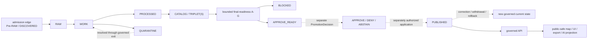

<!-- [KFM_META_BLOCK_V2]
doc_id: kfm://doc/focus-mode-state-lifecycle-states
title: Focus Mode Lifecycle State Documentation Boundary
type: standard; focus-mode; lifecycle; promotion-readiness; compatibility-lane
version: v1.0
status: draft; repository-grounded; mixed-authority; compatibility-lane; fixture-first; transition-application-hold; non-release; non-publication
owner: "@bartytime4life via CODEOWNERS; lifecycle, governance, evidence, policy, review, release, correction, rollback, and independent publication stewardship remain NEEDS VERIFICATION"
created: 2026-05-24
updated: 2026-08-22
policy_label: public; documentation; lifecycle; promotion-readiness; evidence; policy; review; release; correction; rollback; cite-or-abstain; fail-closed; non-publication
owning_root: docs/
responsibility: >-
  Explain the KFM lifecycle spine and the repository-present lifecycle,
  promotion-readiness, decision, correction, and rollback seams without becoming
  lifecycle, policy, review, release, transition, or publication authority.
authority: >-
  Human-readable reconciliation and maintenance guidance only. Machine shape,
  policy outcomes, evidence resolution, review authority, promotion decisions,
  receipts, manifests, transition application, correction, rollback, and public
  serving remain in their owning responsibility roots.
current_path: docs/focus-mode/state/lifecycle-states.md
canonical_relationship: >-
  Same-path documentation inside the repository-present singular Focus Mode
  compatibility lane. Accepted Directory Rules v2 permits this docs-root repair
  but does not make the mixed state tree canonical or authorize its split,
  migration, mirror, or deletion.
truth_posture: >-
  CONFIRMED current main, target bytes, state-tree README, accepted ADR-0029,
  the repository-present lifecycle law carrier, fixture-only lifecycle-gate
  contract/schema/validator/fixtures/tests/workflow, bounded final-readiness A-G
  validator, PromotionReceipt and PromotionDecision seams, and current
  publication architecture / PROPOSED universal lifecycle-gate authority,
  production policy, authenticated review, operational transition application,
  correction propagation, rollback execution, and public serving / CONFLICTED
  legacy lifecycle-wide A-G labels versus current executable final-readiness
  A-G, Pre-RAW versus DISCOVERED admission vocabulary, CATALOG/TRIPLET(S)
  spelling, and release-state vocabularies / UNKNOWN first governed production
  transition, public artifact, correction, rollback, deployment, and public
  parity / NEEDS VERIFICATION accepted gate vocabulary, steward authority,
  resolved evidence and policy, signer trust, required-check coupling, and every
  claimed lifecycle instance.
evidence_snapshot:
  repository: bartytime4life/Kansas-Frontier-Matrix
  base_ref: main
  base_commit: ec58517b74a02f5ce7dda3f407769c31d1393bb7
  target_prior_blob: 3826306d620de81840a8140a5645d64c7a630242
  state_readme_blob: 34e2c6c90006937ea00d432689a36bf83fa5a898
  transitions_readme_blob: e25f1814e51579d5f55c0f1fe0135ddb28a47f4a
  lifecycle_law_blob: 4eb1f0a38a31130bb9928867450709724bd4cacb
  promotion_gates_blob: a3126726a625b5a15712b1c3cc7dc2a317192dd9
  release_state_machine_blob: a5bc6d9cf5497315f63d33012363a1133214867e
  lifecycle_gate_contract_blob: dbc993ef7b24e12ef77ed38d7e474f5c210a194c
  lifecycle_gate_schema_blob: ca323db303cc14a069f697b084cf58b5f1342cb5
  lifecycle_gate_validator_blob: 7c64eabacb65132c31a8573bf94f79a51968f3ff
  lifecycle_gate_fixture_blob: d0a572255edd6a738a8e67b71e51fbdfe38bd59f
  lifecycle_gate_test_blob: 0bfb32fbccb9cc5c98b9d67f22c63a3efcbd0a52
  lifecycle_gate_workflow_blob: a85bbab5979a7adb56d8abcba37d5ae394ffe010
  promotion_readiness_readme_blob: e729df0cc007e8cf0d9811afc25ec1f5ffbdffdd
  promotion_receipt_contract_blob: ed432f8e3e02d170589c9e04d78087a69346909d
  promotion_decision_contract_blob: 42295bfc83a621cf125d33aa821912b426f70bd2
inspection_boundary: >-
  Current-session GitHub reads covered the complete prior target, the merged
  state-tree README, lifecycle doctrine, current publication gate and release
  state-machine documentation, proposed ADR-0018, accepted ADR-0029, the
  fixture-only lifecycle-gate contract/schema/validator/fixture/test/workflow
  family, bounded final-readiness A-G implementation, PromotionReceipt and
  PromotionDecision contracts, CODEOWNERS, the current one-character
  transitions README placeholder, and bounded branch/PR overlap.
  No mounted checkout, live source, EvidenceBundle resolver, accepted policy
  evaluator, trusted signer, authenticated independent reviewer, transition
  operator, lifecycle store mutation, release, correction propagation, rollback
  execution, deployment, or public endpoint was exercised.
related:
  - ./README.md
  - ./finite-outcomes.md
  - ./review-state.md
  - ./payload-state.md
  - ./revocation-state.md
  - ./transitions/
  - ../../doctrine/lifecycle-law.md
  - ../../doctrine/directory-rules.md
  - "../../adr/ADR-0018-promotion-gate-sequence.md"
  - ../../adr/ADR-0029-adopt-directory-governance-standard-v2.md
  - ../../architecture/publication/promotion-gates.md
  - ../../architecture/publication/release-state-machine.md
  - ../../../contracts/governance/lifecycle_gate_closure_assessment.md
  - ../../../schemas/contracts/v1/governance/lifecycle_gate_closure_assessment.schema.json
  - ../../../tools/validators/governance/validate_lifecycle_gate_closure_assessment.py
  - ../../../tools/validators/promotion_gate/README.md
  - ../../../contracts/release/promotion_receipt.md
  - ../../../contracts/release/promotion_decision.md
tags: [kfm, focus-mode, state, lifecycle, pre-raw, raw, work, quarantine, processed, catalog, triplet, published, promotion-readiness, correction, rollback, compatibility, non-publication]
notes:
  - "v1.0 replaces the stale v0.1 gate mapping and path assumptions with current repository evidence."
  - "The core RAW-to-PUBLISHED shorthand is preserved; admission-edge and TRIPLET(S) vocabulary conflicts remain visible rather than silently normalized."
  - "The current executable A-G profile is final promotion readiness only; it does not implement every lifecycle transition."
  - "No lifecycle write, promotion, release, deployment, publication, correction, rollback, or repository-settings transition occurs."
[/KFM_META_BLOCK_V2] -->

<a id="top"></a>
<a id="focus-mode--lifecycle-state"></a>

# Focus Mode Lifecycle State Documentation Boundary

> **Purpose.** Explain how KFM separates lifecycle stage, lifecycle-gate
> assessment, final promotion readiness, accountable decision, transition
> application, runtime outcome, correction, and rollback—without letting this
> Markdown file become any of those authorities.

> [!IMPORTANT]
> **The lifecycle is a governed meaning, not a folder name.** The durable KFM
> shorthand remains `RAW -> WORK / QUARANTINE -> PROCESSED -> CATALOG /
> TRIPLET(S) -> PUBLISHED`. A path, commit, workflow, fixture, validator result,
> pull request, merge, badge, or GitHub release cannot move an artifact through
> that lifecycle by itself.

> [!CAUTION]
> **A–G is overloaded in repository history.** The prior version of this page
> mapped A–G across the whole source-to-release journey. Current repository
> implementation uses A–G for one bounded final-readiness profile over a
> declared `CATALOG` or `TRIPLET` candidate. Use an exact profile and gate name,
> never a letter alone.

> [!WARNING]
> **Current evidence does not prove a production transition engine.** The
> repository contains deterministic fixture-only lifecycle-gate assessment and
> bounded final-readiness validation. Those surfaces do not resolve live
> evidence, execute accepted policy, authenticate release authority, apply a
> lifecycle write, publish a public artifact, propagate a correction, or perform
> operational rollback.

> [!NOTE]
> **Placement is bounded.** This is a same-path `docs/` repair under accepted
> Directory Rules v2. The surrounding state tree remains a mixed compatibility
> lane; split, move, rename, mirror, parallel-tree creation, and deletion remain
> `HOLD` unless accepted authority and a validated migration provide one writer,
> consumer closure, and rollback.

**Quick navigation:** [Status](#1-scope) · [Lifecycle](#2-the-five-lifecycle-stages) ·
[Controls](#3-promotion-gates-ag) · [Artifacts](#4-required-artifacts-at-each-stage-exit) ·
[Trust membrane](#5-trust-membrane-rule) · [Orthogonality](#6-lifecycle-state--outcome-state--orthogonality) ·
[Flow](#7-promotion-flow-diagram) · [Implementation](#8-current-repository-implementation-map) ·
[Validation](#9-validation-and-proof-boundary) · [Anti-patterns](#10-anti-patterns) ·
[Open work](#11-open-questions-and-adr-triggers) · [Maintenance](#12-maintenance-correction-and-rollback) ·
[References](#13-cross-references) · [Appendix](#14-appendix)

---

<a id="1-scope"></a>

## 1. Scope

This file owns a human-readable explanation of KFM lifecycle concepts as they
intersect Focus Mode. It does not own lifecycle instances, machine shape,
source admission, evidence, policy, review, release, correction, rollback, or
public-serving state.

### Current status and evidence boundary

| Question | Current bounded answer | Truth label |
|---|---|---|
| Does this file exist at the requested path? | Yes. The prior v0.1 document is tracked at blob `3826306d620de81840a8140a5645d64c7a630242`. | `CONFIRMED` |
| What owns this file? | `docs/` owns human explanation. CODEOWNERS routes review to `@bartytime4life`; routing is not lifecycle, review, release, or publication authority. | `CONFIRMED` |
| Is the core lifecycle shorthand still used? | Yes: `RAW -> WORK / QUARANTINE -> PROCESSED -> CATALOG / TRIPLET(S) -> PUBLISHED`. Exact singular/plural spelling varies across current documents and machine profiles. | `CONFIRMED` invariant; vocabulary drift visible |
| Is `Pre-RAW` universally accepted as a stage? | The draft lifecycle-law carrier adds `Pre-RAW`; the fixture-only gate profile uses `DISCOVERED -> RAW` for admission. The core operating shorthand still begins at `RAW`. | `CONFLICTED` / `NEEDS VERIFICATION` |
| Are the prior page's A–G names current executable names? | No. They are legacy lifecycle-wide labels. Current executable A–G is the bounded final-readiness profile documented below. | `SUPERSEDED` for executable mapping |
| Is lifecycle-wide gate assessment implemented? | A semantic contract, schema, validator, fixtures, tests, and workflow are repository-present and fixture-only. | `CONFIRMED` bounded implementation |
| Is final `CATALOG`/`TRIPLET` → `PUBLISHED` readiness implemented? | A deterministic, no-network A–G validator and fixtures are repository-present. | `CONFIRMED` bounded readiness only |
| Is production transition application implemented? | No inspected evidence establishes an authenticated, policy-bound, idempotent operator that applies KFM public state. | `UNKNOWN` / `HOLD` |
| Does this documentation change lifecycle or public state? | No. | `CONFIRMED` |

### What this file owns

- the current lifecycle vocabulary crosswalk;
- public/internal stage visibility rules;
- separation of lifecycle from readiness, decision, runtime, review, and
  correction vocabularies;
- current implementation and authority boundaries;
- stable compatibility anchors and repository-relative navigation;
- maintenance, validation, correction, and rollback guidance for this document.

### What this file does not own

| Responsibility | Current owning surface or decision class | Boundary here |
|---|---|---|
| Lifecycle doctrine | [`docs/doctrine/lifecycle-law.md`](../../doctrine/lifecycle-law.md) plus controlling adopted doctrine | This page explains and reconciles; it does not amend doctrine |
| Lifecycle-gate assessment meaning | [`contracts/governance/lifecycle_gate_closure_assessment.md`](../../../contracts/governance/lifecycle_gate_closure_assessment.md) | Current contract is proposed and fixture-only |
| Lifecycle-gate machine shape | [`schemas/contracts/v1/governance/lifecycle_gate_closure_assessment.schema.json`](../../../schemas/contracts/v1/governance/lifecycle_gate_closure_assessment.schema.json) | This page must not redefine its enum or fields |
| Final promotion readiness | [`tools/validators/promotion_gate/README.md`](../../../tools/validators/promotion_gate/README.md) and publication architecture | `PASS` means `APPROVE_READY`, not approval or publication |
| Promotion decision | [`contracts/release/promotion_decision.md`](../../../contracts/release/promotion_decision.md) | `APPROVE / DENY / ABSTAIN` remains separate from readiness |
| Promotion receipt | [`contracts/release/promotion_receipt.md`](../../../contracts/release/promotion_receipt.md) | Receipt records an attempt; it does not apply the transition |
| Evidence and source truth | Source/evidence responsibility roots | A stage label or valid packet cannot prove evidence truth |
| Policy and sensitivity | `policy/` plus accountable authority | Declared policy context is not accepted policy execution |
| Review authority | Review records and verified assignments | CODEOWNERS and synthetic actors do not prove independent approval |
| Release, correction, rollback | `release/` and governed accountability objects | Documentation creates none of these records or effects |
| Public API, map, export, search, or AI state | Governed runtime and application roots | Public carriers are downstream of an applied release |

### Directory Rules basis

| Proposed action | Placement outcome | Reason |
|---|---|---|
| Update this existing file in place | `PLACE` | Same human-documentation responsibility under `docs/` |
| Treat this file as the lifecycle authority | `DENY` | Would collapse docs into contract/policy/release authority |
| Move or split the mixed state tree now | `HOLD` | Final owners, target paths, consumers, anchors, and rollback are unresolved |
| Create a parallel plural Focus tree | `DENY` | Would create a second writable authority |
| Preserve legacy anchors while correcting content | `PLACE` | Compatibility without structural migration |

[Back to top](#top)

---

<a id="2-the-five-lifecycle-stages"></a>

## 2. The five lifecycle stages

The familiar shorthand contains five promotion groups after source admission:

```text
RAW -> WORK / QUARANTINE -> PROCESSED -> CATALOG / TRIPLET(S) -> PUBLISHED
```

The phrase **five stages** is shorthand: `WORK` and `QUARANTINE` are distinct
handling states, and `CATALOG` and `TRIPLET(S)` are distinct object families or
materializations. Current documentation does not establish one accepted
machine enum that collapses each slash-separated pair into a single value.

### Admission edge

The repository currently exposes two pre-admission terms:

- draft [`Lifecycle Law`](../../doctrine/lifecycle-law.md) uses `Pre-RAW` for
  watcher signals and source-change events before RAW admission;
- the fixture-only `LifecycleGateClosureAssessment` uses `DISCOVERED -> RAW`
  for its local `ADMISSION` gate.

This file does not select between them. Both remain subordinate to accepted
source-admission and lifecycle authority. A watcher signal is never evidence,
RAW material, promotion, release, or publication by itself.

### Stage responsibilities

| Stage or group | Bounded responsibility | Public posture | Minimum claim needed to describe an actual instance |
|---|---|---|---|
| admission edge (`Pre-RAW` / `DISCOVERED`) | Capture a signal or candidate before source admission | Internal; non-publisher | Identifiable event/candidate, source hint, policy precheck, and retained audit lineage under an accepted profile |
| `RAW` | Preserve source-native capture or reference with identity, source role, time, rights, sensitivity, and integrity | Internal; never a normal public source | Admitted source identity plus intake/capture evidence and immutable lineage |
| `WORK` | Transform, reconcile, normalize, join, inspect, and prepare candidates | Internal | Input refs, transform identity, parameters, validation state, and receipt |
| `QUARANTINE` | Hold unresolved or failed material with reason, owner, retention, and governed exit | Internal; fail closed | Structured reason, held subject, responsible review route, and exit/retention state |
| `PROCESSED` | Hold validated normalized candidates and supporting accountability material | Internal candidate; not public release | Validated output identity, input lineage, specification/hash, and bounded validation evidence |
| `CATALOG` / `TRIPLET(S)` | Index, relate, and assemble evidence/release candidates without becoming source truth | Derived candidate; not public release | Catalog/evidence/graph identity, source lineage, closure state, and release status |
| `PUBLISHED` | Represent an actually applied governed release through approved public-safe carriers | Public only through governed interfaces | Resolved evidence, policy, accountable decision/review, manifest, applied transition, correction path, rollback target, and carrier parity |

> [!IMPORTANT]
> **A stage is not inferred from a directory alone.** `data/processed/` may be the
> logical materialization of `PROCESSED`, but a path does not establish that the
> artifact satisfied the governing contract, receipts, policy, review, and state
> transition. The stage owns the path; the path does not own the stage.

> [!CAUTION]
> **`PUBLISHED` is not synonymous with `ANSWER`.** An actually released artifact
> may still yield `ABSTAIN`, `DENY`, or `ERROR` at runtime because evidence is
> stale, scope is unsupported, policy blocks exposure, or a service failed.

[Back to top](#top)

---

<a id="3-promotion-gates-ag"></a>

## 3. Promotion controls and the A–G collision

The prior version of this file described one A–G sequence from `RAW` to
`PUBLISHED`. That table is retained only as historical lineage; it is not the
current executable mapping.

### 3.1 Lifecycle-wide controls

Controls across the full lifecycle include source admission, rights/terms,
normalization, validation, quarantine exit, evidence closure, catalog/triplet
emission, policy, review, decision, release application, public-carrier update,
correction, withdrawal, and rollback. Current repository evidence does not show
that these controls are one accepted executable A–G chain.

### 3.2 Fixture-only lifecycle-gate closure assessment

The repository contains a proposed, inactive, fixture-only
`LifecycleGateClosureAssessment` contract/schema/validator/fixture/test/workflow
family. It maps seven named assessment gates:

| Local assessment gate | Declared prior → target | Minimum required roles in the current profile | Failure-closed disposition |
|---|---|---|---|
| `ADMISSION` | `DISCOVERED -> RAW` | `SOURCE_DESCRIPTOR`, `PAYLOAD_IDENTITY`, `POLICY_DECISION` | `NOT_ADMITTED` |
| `NORMALIZATION` | `RAW -> WORK` | `TRANSFORM_RECEIPT`, `VALIDATION_REPORT`, `POLICY_DECISION` | `QUARANTINE` |
| `VALIDATION` | `WORK -> PROCESSED` | `VALIDATION_REPORT`, `POLICY_DECISION`; conditional redaction/aggregation receipts | `STAY_WORK` |
| `CATALOG_CLOSURE` | `PROCESSED -> CATALOG` | `CATALOG_MATRIX`, `EVIDENCE_BUNDLE`, `POLICY_DECISION`; conditional graph/model artifacts | `HOLD_PROCESSED` |
| `RELEASE` | `CATALOG -> PUBLISHED` | `RELEASE_MANIFEST`, `ROLLBACK_TARGET`, `CORRECTION_PATH`, `POLICY_DECISION`; conditional review | `HOLD_CATALOG` |
| `CORRECTION` | `PUBLISHED -> PUBLISHED_SUPERSEDED` | `CORRECTION_NOTICE`, `REVIEW_RECORD`, `INVALIDATION_LIST`, `RELEASE_MANIFEST`, `POLICY_DECISION` | `STALE_STATE_ANNOUNCEMENT` |
| `ROLLBACK` | `PUBLISHED -> PRIOR_RELEASE` | `ROLLBACK_CARD`, `CORRECTION_NOTICE`, `INVALIDATION_LIST`, `RELEASE_MANIFEST`, `POLICY_DECISION` | `HOLD_CURRENT_RELEASE` |

Its decision outcome is local to that profile: `ALLOW`, `HOLD`, `DENY`, or
`ERROR`. Every governance flag in the paired schema denies operational effects;
a valid fixture cannot perform a state transition.

### 3.3 Current executable final promotion-readiness A–G

The implemented bounded profile begins only after a candidate declares that it
is at `CATALOG` or `TRIPLET` and targets `PUBLISHED`.

| Gate | Exact executable name | Bounded question | What a local `PASS` cannot prove |
|:---:|---|---|---|
| A | `identity_and_closure` | Are candidate/profile/spec/lifecycle and minimal manifest declarations internally complete? | Source admission, object existence, accepted contracts, or full release closure |
| B | `asset_integrity` | Do candidate, manifest, and receipt hashes/digest sets agree? | Actual bytes, immutability, producer authority, or signature validity |
| C | `geometry_and_crs` | Is declared geometry valid/deterministic with bounded CRS and bbox posture? | Domain topology, scientific fitness, authoritative geometry, or sensitivity transformation |
| D | `temporal_semantics` | Are declared UTC instants and interval ordering valid? | Source freshness policy, bitemporal authority, or a trusted external clock |
| E | `rights_and_sensitivity` | Is the supplied policy profile/label/result declaration locally admissible? | Execution of accepted policy, rights, consent, sovereignty, or sensitivity truth |
| F | `proof_and_catalog_support` | Are evidence, attestation, run-receipt, catalog, and conditional AI refs declared? | URI resolution, EvidenceBundle truth, signer trust, or catalog integrity |
| G | `review_and_rollback` | Are fixture-only review, binding, rollback, and correction declarations internally safe? | Authenticated identity, reviewer qualification, usable rollback, or correction propagation |

Gate statuses are `PASS`, `ABSTAIN`, `DENY`, or `ERROR`, with precedence:

```text
ERROR > DENY > ABSTAIN > PASS
```

Overall `PASS` maps to `APPROVE_READY`; every other result maps to `BLOCKED`.
`APPROVE_READY` is a handoff to separate decision processing—not approval,
transition application, release, or publication.

### 3.4 Governance status

ADR-0018 remains `proposed` with a recorded `REVISE` checkpoint. Its current
candidate names match the bounded final-readiness implementation, but that does
not make the sequence accepted architecture or silently rewrite lifecycle-wide
documentation.

> [!WARNING]
> **A letter without a profile is ambiguous.** Write `final-readiness Gate E:
> rights_and_sensitivity` or `LifecycleGateClosureAssessment RELEASE`, not
> “Gate E,” when the distinction matters.

[Back to top](#top)

---

<a id="4-required-artifacts-at-each-stage-exit"></a>

## 4. Artifact and decision responsibilities

The prior page asserted universal “required artifacts at each stage exit” and
specific canonical homes. Current repository evidence supports a more bounded
claim: each profile owns its exact required roles, while object meaning,
machine shape, policy, review, release, and stored instances remain separate.

### Current object-role map

| Object or role | Responsibility | What its presence does not prove |
|---|---|---|
| `SourceDescriptor` | Source identity, role, access, rights/terms, cadence, correction and activation posture | Source admission or permission to publish |
| payload identity / intake evidence | Bind captured material to an admitted source and immutable identity | Semantic correctness or public fitness |
| `TransformReceipt` | Record inputs, transformation, parameters, outputs, and deterministic identity where supported | Output truth, policy approval, or promotion |
| `ValidationReport` | Record bounded validation execution and findings | Evidence truth, review, or release |
| `PolicyDecision` | Record a policy/admissibility result under its own contract | Evidence truth, reviewer authority, or lifecycle application |
| `EvidenceRef` | Point from a claim to governed support | Successful resolution or sufficient support |
| `EvidenceBundle` | Assemble evidence, scope, limitations, authority, and lineage under its contract | Policy permission, review approval, or release by itself |
| catalog matrix / catalog record | Index a candidate and its relations | Canonical truth or public release |
| graph/triplet projection | Derived relation carrier | Sovereign truth or authority independent of evidence |
| `ReviewRecord` | Record accountable review state and obligations | Promotion or publication without decision/application |
| `PromotionDecision` | Proposed finite choice `APPROVE / DENY / ABSTAIN` about a governed transition | Authenticated authority, transition application, or public serving |
| `PromotionReceipt` | Record one declared promotion attempt, A–G results, support refs, and claimed effect | Decision authority, real effect, or release manifest |
| `ReleaseManifest` | Bind a released artifact inventory under its contract | Evidence truth or public carrier parity without application proof |
| correction notice / invalidation list | Declare affected scope, successor/withdrawal posture, and propagation obligations | Actual cache/API/map/search/AI correction |
| rollback target / `RollbackCard` | Identify eligible prior state and governed recovery instructions | Successful rollback execution |

### Decision and application sequence

```text
bounded lifecycle-gate assessment
  -> bounded final-readiness A-G
  -> APPROVE_READY or BLOCKED
  -> separately governed PromotionDecision
  -> separately authorized transition application
  -> release/application receipts and ReleaseManifest
  -> governed public carriers
  -> correction / withdrawal / supersession / rollback when needed
```

Each arrow is an authority boundary. Current repository evidence confirms
fixture-only assessment, bounded readiness, and proposed object shapes; it does
not confirm the production application arrows.

### Storage and path boundary

Do not infer one operational home from this document. Logical responsibility
roots are repository-present, but persisted instance paths, external object
storage, generated outputs, release records, and public materialization must
follow their owning contracts, accepted Directory Rules, current repository
evidence, and any required migration decision.

[Back to top](#top)

---

<a id="5-trust-membrane-rule"></a>

## 5. Trust-membrane rule

Public and ordinary Focus Mode clients consume governed APIs or released
public-safe artifacts. They must not read lifecycle/internal stores as their
normal path.

| Direction | Public posture | Reason |
|---|---|---|
| public client -> admission edge / `RAW` | `DENY` | Unadmitted or source-native material is internal |
| public client -> `WORK` / `QUARANTINE` | `DENY` | Transform and held material is not public |
| public client -> `PROCESSED` | `ABSTAIN` or `DENY` | Validated candidate is not release |
| public client -> `CATALOG` / `TRIPLET(S)` directly | `ABSTAIN` or `DENY` | Index/projection/candidate is not public authority |
| public client -> `PUBLISHED` path directly | `DENY` unless exposed through an approved governed interface | File placement is not access policy or carrier validation |
| public client -> governed API over an applied current release | eligible for `ANSWER / ABSTAIN / DENY / ERROR` | Runtime still applies evidence, policy, scope, currentness, and service checks |
| internal validator -> declared lifecycle packet | role-scoped read only | Validators check; they do not mutate or serve |
| AI runtime -> governed released evidence/context | role- and policy-scoped | Generated language remains interpretation, not evidence or release authority |

### Public-serving prerequisites

For a consequential public claim, evidence appropriate to significance should
show:

1. admitted source identity and role;
2. resolvable evidence and bounded support;
3. rights, sensitivity, consent/sovereignty, and access posture;
4. validation and integrity evidence;
5. accountable review and decision;
6. applied release state and manifest;
7. correction/withdrawal path and rollback target;
8. public-carrier parity across API, map, search, export, cache, and AI surfaces
   where those carriers exist.

If the chain is incomplete, the safe public result narrows to `ABSTAIN`, `DENY`,
or `ERROR`, or the prior governed release remains current.

> [!CAUTION]
> **Public availability of a source is not admission or permission.** A public
> webpage, API, repository, map, or downloadable file may still have role,
> rights, privacy, sensitivity, temporal, transform, attribution, and precision
> limits.

[Back to top](#top)

---

<a id="6-lifecycle-state--outcome-state--orthogonality"></a>

## 6. Lifecycle, readiness, decision, runtime, and review are orthogonal

| Axis | Current vocabulary or carrier | Governing meaning |
|---|---|---|
| lifecycle | `RAW`, `WORK`, `QUARANTINE`, `PROCESSED`, `CATALOG / TRIPLET(S)`, `PUBLISHED` | Where an object sits in governed data/release lineage |
| admission edge | `Pre-RAW` / `DISCOVERED` conflict | Candidate before RAW admission |
| lifecycle-gate assessment | `ALLOW`, `HOLD`, `DENY`, `ERROR` | Fixture-only local gate closure result |
| final-readiness gate | `PASS`, `ABSTAIN`, `DENY`, `ERROR` | Bounded A–G validation result |
| readiness | `APPROVE_READY`, `BLOCKED` | Whether the bounded packet may proceed to decision processing |
| promotion decision | `APPROVE`, `DENY`, `ABSTAIN` | Proposed accountable transition decision |
| transition application | applied / not applied under an accepted production profile | Whether governed lifecycle state actually changed |
| runtime response | `ANSWER`, `ABSTAIN`, `DENY`, `ERROR` | Client-facing finite result under the current runtime envelope shape |
| review | draft/pending/held/approved/rejected/superseded proposals | Accountable review posture; exact accepted carrier remains verification-sensitive |
| correction/release | candidate/released/corrected/superseded/withdrawn/revoked vocabularies conflict | Post-publication state/effects; no universal accepted enum established here |
| validator | `PASS` / `FAIL` or tool-specific finite result | Bounded check result, not truth or release authority |

One subject may simultaneously be:

```text
lifecycle:             CATALOG candidate
lifecycle assessment: ALLOW (fixture-only)
final readiness:       PASS / APPROVE_READY
promotion decision:    ABSTAIN
transition applied:    false
runtime outcome:       ABSTAIN
review posture:        held
```

No value may be substituted for another.

### Public outcome by lifecycle position

| Lifecycle position | Public outcome posture |
|---|---|
| admission edge, `RAW`, `WORK`, `QUARANTINE` | No normal public response from that material; `DENY` access |
| `PROCESSED` | `ABSTAIN`/`DENY`; candidate is not released |
| `CATALOG / TRIPLET(S)` | `ABSTAIN`/`DENY`; index or release candidate is not public state |
| applied current `PUBLISHED` | Runtime may produce `ANSWER`, `ABSTAIN`, `DENY`, or `ERROR` |
| correction/withdrawal/rollback in progress | Affected scope usually `ABSTAIN`/`DENY` or remains on the prior governed release until application completes |

[Back to top](#top)

---

<a id="7-promotion-flow-diagram"></a>

## 7. Reconciled lifecycle and release flow


```mermaid
flowchart LR
  PRE["admission edge<br/>Pre-RAW / DISCOVERED"] --> RAW["RAW"]
  RAW --> WORK["WORK"]
  WORK --> PROC["PROCESSED"]
  WORK --> QUAR["QUARANTINE"]
  QUAR -. "resolved through governed exit" .-> WORK
  PROC --> CAT["CATALOG / TRIPLET(S)"]
  CAT --> READY["bounded final-readiness A-G"]
  READY --> BLOCKED["BLOCKED"]
  READY --> HANDOFF["APPROVE_READY"]
  HANDOFF -. "separate PromotionDecision" .-> DECIDE["APPROVE / DENY / ABSTAIN"]
  DECIDE -. "separately authorized application" .-> PUB["PUBLISHED"]
  PUB -. "correction / withdrawal / rollback" .-> CURRENT["new governed current state"]
  PUB --> API["governed API"]
  API --> CLIENT["public-safe map / UI / export / AI projection"]
```

Solid edges express the lifecycle orientation and public delivery boundary.
Dotted edges mark separately governed transitions whose production application
is not established by the fixture-only validators or this document.

### Forbidden shortcuts

- direct admission-edge, `RAW`, `WORK`, `QUARANTINE`, `PROCESSED`, or
  `CATALOG` candidate to public serving;
- `QUARANTINE -> PUBLISHED`;
- treating `PASS`, `ALLOW`, `APPROVE_READY`, `APPROVE`, or
  `transition.applied: true` as publication proof;
- treating a file move, commit, PR, merge, workflow, tag, GitHub release,
  deployment, or rendered map as KFM promotion;
- deleting corrected, superseded, withdrawn, or rolled-back lineage;
- allowing a watcher, validator, model, or public client to become publisher.

[Back to top](#top)

---

<a id="8-current-repository-implementation-map"></a>

## 8. Current repository implementation map

| Surface | Current repository evidence | Bounded conclusion |
|---|---|---|
| [`docs/doctrine/lifecycle-law.md`](../../doctrine/lifecycle-law.md) | Draft doctrine carrier, includes `Pre-RAW` and the lifecycle spine | Doctrine lineage; concrete paths and implementation claims remain verification-sensitive |
| [`LifecycleGateClosureAssessment` contract](../../../contracts/governance/lifecycle_gate_closure_assessment.md) | Proposed, inactive, fixture-only semantic profile | Describes local gate closure; cannot execute a transition |
| paired lifecycle-gate schema | Closed draft-2020-12 shape with fixed gate/stage/outcome/governance enums | Confirms machine shape only |
| lifecycle-gate validator | Repository-present deterministic validator using the paired schema and canonical hashing | Confirms bounded local implementation |
| lifecycle-gate fixtures/tests/workflow | Repository-present synthetic cases, focused tests, and read-only CI orchestration | Confirms proof carriers; exact run state remains separate |
| [`promotion-gates.md`](../../architecture/publication/promotion-gates.md) | Repository-grounded compatibility crosswalk | Explains current A–G conflict; not architecture authority |
| final-readiness validator | Implemented, deterministic, no-network, non-publishing | `PASS` means `APPROVE_READY` only |
| `PromotionReceipt` family | Proposed contract/schema/validator/fixtures/tests/workflow | Records internal consistency of an attempt; does not apply it |
| `PromotionDecision` family | Proposed semantic contract and paired schema; finite `APPROVE / DENY / ABSTAIN` | Decision shape does not authenticate authority or apply state |
| [`release-state-machine.md`](../../architecture/publication/release-state-machine.md) | Current documentation separates lifecycle, readiness, decision, application, and public serving | Production application remains `HOLD` |
| release-state registers | Present draft/empty/conflicted carriers according to current publication documentation | No operational release state inferred |
| public transition operator | Not established in inspected evidence | `UNKNOWN` / `HOLD` |
| live evidence/policy/review/signing | Not exercised or established by this task | No production readiness or public truth claim |
| correction propagation/rollback | Fixture and architecture evidence only | No executed public correction or rollback |

### What current implementation proves

- deterministic fixture-only lifecycle-gate mapping exists;
- exact gate/stage combinations and local artifact roles are machine-checked;
- final promotion-readiness A–G is implemented as a bounded validator;
- finite results fail closed;
- validators and workflows declare no network and no lifecycle writes;
- release-facing object families are separated in repository structure.

### What it does not prove

- a source or EvidenceBundle exists, is authentic, or is current;
- rights, consent, sovereignty, sensitivity, or policy are resolved;
- reviewer identities and authority are authenticated or independent;
- signatures or actual release bytes are verified;
- a `PromotionDecision` was authorized;
- a transition was applied;
- a release is served through governed public interfaces;
- correction, invalidation, withdrawal, or rollback works in production;
- required-check coupling, deployment, or public parity.

[Back to top](#top)

---

<a id="9-validation-and-proof-boundary"></a>

## 9. Validation and proof boundary

### Repository-native checks for the current fixture profiles

The repository documents these commands:

```bash
python -m unittest -v tests.validators.governance.test_validate_lifecycle_gate_closure_assessment
python tools/validators/governance/validate_lifecycle_gate_closure_assessment.py --fixtures
make publish-check
```

This documentation-only change does not claim those commands were executed
locally unless the pull-request handoff records an actual run.

### Documentation checks for this file

- one complete `KFM_META_BLOCK_V2`;
- one H1;
- preserved compatibility anchors from v0.1;
- logical heading order;
- supported GitHub alerts;
- balanced fenced blocks and Mermaid fences;
- same-document fragments resolve;
- repository-relative links target inspected paths;
- tables have consistent columns;
- UTF-8, LF line endings, no tabs or trailing whitespace, and final newline;
- current gate names and finite vocabularies remain distinct;
- no claim that a validator, receipt, decision, workflow, commit, PR, merge, or
  release page establishes publication.

### Evidence classes must remain separate

| Evidence observed | What it may support | What it cannot support alone |
|---|---|---|
| file/path presence | Repository bytes and placement at a commit | Semantic acceptance or runtime behavior |
| schema validity | Machine-shape conformance | Evidence truth, policy permission, or release |
| validator/test pass | Bounded rule execution over defined inputs | Source authority, authenticated review, or lifecycle mutation |
| workflow success | Hosted orchestration result at an exact head | Required-check status, release, deployment, or publication |
| receipt validity | Internal consistency and declared lineage | Decision authority or applied effect |
| decision record | Declared accountable choice under its contract | Transition application or public carrier update |
| release manifest | Declared released artifact inventory | Evidence truth or public-serving parity without application evidence |
| runtime/public observation | Behavior at a time and environment | Universal correctness, source truth, or policy authority |

[Back to top](#top)

---

<a id="10-anti-patterns"></a>
<a id="8-anti-patterns"></a>

## 10. Anti-patterns

| Anti-pattern | Failure | Required posture |
|---|---|---|
| State-family collapse | One enum mixes lifecycle, readiness, decision, runtime, review, and correction | Preserve separate contracts and mappings |
| A–G by letter only | Historical and executable gates are confused | Name the exact profile and exact gate |
| Legacy A–G asserted as current | Old schema/rights/normalization/evidence mapping is called executable | Treat it as superseded implementation mapping and compatibility lineage |
| Path equals stage | A file location is treated as lifecycle truth | Require governed state/receipt/decision evidence |
| Fixture equals production | Synthetic closure is called operational readiness | Preserve fixture-only and non-effect flags |
| `PASS` equals `APPROVE` | Readiness becomes decision | `PASS -> APPROVE_READY` only |
| `APPROVE` equals `PUBLISHED` | Decision becomes applied public state | Require separately authorized transition and public-carrier evidence |
| Validator as publisher | A tool writes or authorizes `PUBLISHED` | Validators remain read-only and non-publishing |
| Watcher as publisher | Source-change signal triggers public release | Watchers emit candidates only |
| `PROCESSED` or `CATALOG` served publicly | Pre-release candidate crosses the trust membrane | `ABSTAIN`/`DENY`; use applied released projection only |
| Quarantine hidden | Held material becomes indistinguishable from absent material | Record reason, owner, exit evidence, and retention posture |
| Correction is overwrite | Public history is silently replaced | Emit governed successor/correction and preserve lineage |
| Rollback is Git revert | Repository bytes are mistaken for restored public state | Update release, carriers, caches, notices, and receipts |
| Proposed ADR as authority | ADR-0018 or another proposal silently settles gate vocabulary | Keep it proposed until accepted |
| Documentation as contract | This file changes machine or policy meaning | Use owning contract/schema/policy/ADR surfaces |

[Back to top](#top)

---

<a id="11-open-questions-and-adr-triggers"></a>
<a id="9-open-questions"></a>

## 11. Open questions and ADR triggers

| ID | Open item | Current status | Closure evidence or decision |
|---|---|---|---|
| LC-Q1 | Is the accepted admission-edge term `Pre-RAW`, `DISCOVERED`, or another value? | `CONFLICTED` | Accepted lifecycle/contract decision and migration crosswalk |
| LC-Q2 | Is canonical spelling `CATALOG / TRIPLET`, `TRIPLETS`, or a typed split? | `CONFLICTED` | Contract/schema/Directory Rules review and consumer inventory |
| LC-Q3 | Will ADR-0018's final-readiness A–G profile be accepted, revised, or replaced? | `PROPOSED` / checkpoint `REVISE` | Accountable ADR decision |
| LC-Q4 | How are lifecycle-wide controls named without colliding with final-readiness A–G? | `NEEDS VERIFICATION` | Published vocabulary crosswalk and stable identifiers |
| LC-Q5 | Which object authoritatively records an applied transition? | `UNKNOWN` | Accepted contract/schema, idempotent operator, append-only receipt, and tests |
| LC-Q6 | Which actors may issue `PromotionDecision`, apply release, correct, withdraw, and rollback? | `UNKNOWN` | Verified identities, assignments, separation, and policy |
| LC-Q7 | How are references resolved and authenticated during lifecycle-gate checks? | `UNKNOWN` | Governed resolver, offline/online profiles, negative fixtures, and receipts |
| LC-Q8 | What exact public-carrier and cache evidence proves `PUBLISHED` application? | `UNKNOWN` | API/map/search/export/AI parity and invalidation proof |
| LC-Q9 | What is the accepted release/correction/withdrawal/supersession enum? | `CONFLICTED` | Contract/schema/ADR convergence |
| LC-Q10 | What final path owns cross-cutting lifecycle state after the mixed state tree is split? | `HOLD` | Accepted placement decision, consumer/anchor migration, and rollback |
| LC-Q11 | Which workflows are required by repository settings? | `NEEDS VERIFICATION` | Current ruleset and exact-head required-check evidence |
| LC-Q12 | What qualifies as production-ready correction and rollback? | `UNKNOWN` | Rehearsed governed flow with public effects and recovery receipts |

### Changes that require more than this Markdown edit

- renaming, adding, splitting, or removing lifecycle stages;
- accepting an admission-edge vocabulary;
- settling `TRIPLET(S)` machine identity;
- accepting or changing the A–G final-readiness profile;
- changing gate, readiness, decision, runtime, or correction enums;
- activating policy or source/evidence resolution;
- creating a lifecycle transition operator;
- changing public-client access to lifecycle stores;
- moving or splitting the state documentation tree;
- changing release, correction, withdrawal, supersession, or rollback semantics.

[Back to top](#top)

---

<a id="12-maintenance-correction-and-rollback"></a>

## 12. Maintenance, correction, and rollback

### Update this file when

- lifecycle doctrine or the controlling operating contract changes;
- ADR-0018 or another lifecycle/release decision changes effective status;
- lifecycle-gate or final-readiness contracts, schemas, validators, fixtures,
  tests, workflows, or exact vocabularies change;
- an authenticated transition operator becomes repository-present;
- source/evidence/policy/review/signing integration becomes verifiable;
- a first governed release, correction, withdrawal, or rollback is executed;
- the mixed Focus state tree gains an accepted split/migration;
- an inbound anchor or external consumer changes compatibility risk.

### If this document is wrong

1. Pin the affected commit and blob.
2. Identify the stale or false statement and its claim class.
3. Cite the newer contract, schema, test, accepted decision, runtime, or public
   evidence.
4. Preserve compatibility anchors when feasible.
5. Update sibling state/publication documents through their own scoped changes.
6. Do not use prose to mutate machine, policy, review, or release authority.
7. Choose transparent revert or bounded forward correction.

### Rollback for this repository change

Before merge, close or abandon the draft pull request and branch. Branch
deletion is a separate action.

After merge, restore prior blob
`3826306d620de81840a8140a5645d64c7a630242` through a transparent revert, or
apply a bounded forward fix against the actual merged bytes. Do not rewrite
shared history.

A documentation rollback affects this file only. It cannot undo any future
lifecycle transition, public release, correction, cache state, or rollback
operation.

[Back to top](#top)

---

<a id="13-cross-references"></a>
<a id="10-cross-references"></a>

## 13. Cross-references

### Current lifecycle and publication boundaries

- [State-tree documentation boundary](./README.md)
- [Lifecycle Law doctrine carrier](../../doctrine/lifecycle-law.md)
- [Accepted Directory Rules v2](../../doctrine/directory-rules.md)
- [ADR-0018 — proposed promotion gate sequence](../../adr/ADR-0018-promotion-gate-sequence.md)
- [ADR-0029 — accepted Directory Rules adoption](../../adr/ADR-0029-adopt-directory-governance-standard-v2.md)
- [Promotion-gates compatibility and implementation crosswalk](../../architecture/publication/promotion-gates.md)
- [Release-state-machine boundary](../../architecture/publication/release-state-machine.md)

### Current contract, schema, validation, and release seams

- [`LifecycleGateClosureAssessment` semantic contract](../../../contracts/governance/lifecycle_gate_closure_assessment.md)
- [Lifecycle-gate machine schema](../../../schemas/contracts/v1/governance/lifecycle_gate_closure_assessment.schema.json)
- [Lifecycle-gate validator](../../../tools/validators/governance/validate_lifecycle_gate_closure_assessment.py)
- [Lifecycle-gate fixture matrix](../../../fixtures/contracts/v1/governance/lifecycle_gate_closure_assessment/cases.json)
- [Lifecycle-gate focused tests](../../../tests/validators/governance/test_validate_lifecycle_gate_closure_assessment.py)
- [Lifecycle-gate workflow](../../../.github/workflows/lifecycle-gate-closure-assessment.yml)
- [Final promotion-readiness validator boundary](../../../tools/validators/promotion_gate/README.md)
- [`PromotionReceipt` contract](../../../contracts/release/promotion_receipt.md)
- [`PromotionDecision` contract](../../../contracts/release/promotion_decision.md)

### State-tree lineage

- [Finite outcomes](./finite-outcomes.md)
- [Review state](./review-state.md)
- [Payload state](./payload-state.md)
- [Map-context state](./map-context-state.md)
- [Revocation state](./revocation-state.md)
- [Transition documents](./transitions/)

[Back to top](#top)

---

<a id="14-appendix"></a>

## 14. Appendix

### 14.1 Compatibility anchors retained

The v0.1 anchors remain valid:

- `#1-scope`
- `#2-the-five-lifecycle-stages`
- `#3-promotion-gates-ag`
- `#4-required-artifacts-at-each-stage-exit`
- `#5-trust-membrane-rule`
- `#6-lifecycle-state--outcome-state--orthogonality`
- `#7-promotion-flow-diagram`
- `#8-anti-patterns`
- `#9-open-questions`
- `#10-cross-references`

### 14.2 Vocabulary crosswalk

| Term | Current class | Current bounded meaning |
|---|---|---|
| `RAW` through `PUBLISHED` | lifecycle | Governed data/release lineage |
| `Pre-RAW` / `DISCOVERED` | admission edge | Conflicted/draft pre-admission vocabulary |
| `ALLOW / HOLD / DENY / ERROR` | lifecycle-gate assessment | Fixture-only local closure result |
| `PASS / ABSTAIN / DENY / ERROR` | final-readiness gate | Bounded readiness result |
| `APPROVE_READY / BLOCKED` | readiness | Handoff posture |
| `APPROVE / DENY / ABSTAIN` | promotion decision | Proposed accountable transition choice |
| `ANSWER / ABSTAIN / DENY / ERROR` | runtime | Current client-facing runtime envelope enum |
| `ReviewRecord` | review | Separate accountable review carrier |
| `PromotionReceipt` | receipt | Declared attempt record; not a decision or application |
| `ReleaseManifest` | release | Released artifact inventory under its contract |
| correction / withdrawal / supersession / rollback | accountability | Post-publication effects requiring governed application |

### 14.3 Self-check

| Check | Expected result |
|---|---|
| One H1 and one metadata block | yes |
| Current base and evidence blobs recorded | yes |
| Core lifecycle shorthand preserved | yes |
| Admission-edge conflict visible | yes |
| Current executable A–G names exact | yes |
| Legacy A–G treated as lineage | yes |
| Lifecycle/readiness/decision/runtime/review/correction separated | yes |
| Fixture-only and non-effect boundaries visible | yes |
| Trust membrane preserved | yes |
| No canonical operational storage path invented | yes |
| No transition, release, deployment, or publication claim | yes |
| Compatibility anchors preserved | yes |
| Correction and rollback visible | yes |

---

**Current document status:** repository-grounded draft · **Path posture:** same-path
`PLACE`; structural split/migration `HOLD` · **Lifecycle application:** not
established · **Release/publication effect:** none.

[Back to top](#top)
