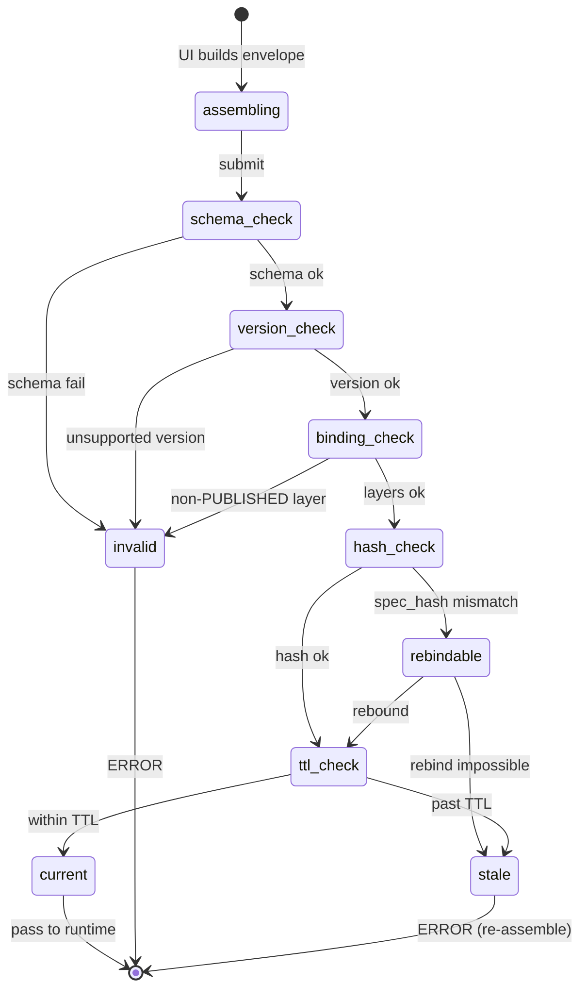

<!-- [KFM_META_BLOCK_V2]
doc_id: kfm://doc/focus-mode-state-map-context-state
title: Focus Mode — MapContextEnvelope Shape and Freshness Rules
type: standard
version: v0.1
status: draft
owners: <FOCUS-MODE-DOCTRINE-OWNER> · NEEDS VERIFICATION
created: 2026-05-24
updated: 2026-05-24
policy_label: public
related:
  - docs/focus-mode/state/README.md §10.2
  - docs/focus-mode/state/payload-state.md
  - docs/focus-mode/state/finite-outcomes.md §4.3 (ERROR codes)
  - contracts/focus_mode/map_context_envelope.md (PROPOSED)
  - schemas/contracts/v1/focus_mode/map_context_envelope.schema.json (PROPOSED)
tags: [kfm, focus-mode, state, map-context-envelope, freshness, admission-check, viewport, maplibre]
notes:
  - Path placement diverges from Directory Rules v1.2 §6.7.2; tracked as OPEN-DR-09.
  - MapContextEnvelope shape is CONFIRMED doctrine per MapLibre v2.1 ML-O-067/068/069; implementation contract is PROPOSED.
[/KFM_META_BLOCK_V2] -->

# Focus Mode — MapContextEnvelope State

> *Shape, required fields, admission-check rules, and freshness semantics for the `MapContextEnvelope` — the immutable request envelope a Focus Mode runtime sees of the map (camera, layers, features, time, releases, evidence refs).*

**Status:** draft · **Owners:** `<FOCUS-MODE-DOCTRINE-OWNER>` *(NEEDS VERIFICATION)* · **Last updated:** 2026-05-24

> [!IMPORTANT]
> **The `MapContextEnvelope` is the immutable contract between the map UI and the Focus Mode runtime.** The runtime never reads the map directly; it reads the envelope. An envelope that fails admission yields `ERROR`, not a best-effort answer. *(CONFIRMED — MapLibre v2.1 ML-O-067/068/069; Atlas v1.1 §24.11.4.)*

> [!CAUTION]
> **Path placement diverges from Directory Rules v1.2 §6.7.2** — see [README §2.1](./README.md#21-path-divergence-must-be-resolved). Doctrine CONFIRMED; file location PROPOSED pending OPEN-DR-09.

---

## Contents

1. [Scope](#1-scope)
2. [Required fields](#2-required-fields)
3. [Admission check](#3-admission-check)
4. [Freshness rules](#4-freshness-rules)
5. [Envelope state diagram](#5-envelope-state-diagram)
6. [Viewport-pull governance](#6-viewport-pull-governance)
7. [Envelope state vs payload state](#7-envelope-state-vs-payload-state)
8. [Anti-patterns](#8-anti-patterns)
9. [Open questions](#9-open-questions)
10. [Cross-references](#10-cross-references)

---

## 1. Scope

This file defines the **shape, freshness, and admission state** of the `MapContextEnvelope` — the bounded, validated, immutable snapshot of map UI state that a Focus Mode runtime consumes before producing a `FocusModeResponse`.

The envelope sits between two trust-membrane crossings:

1. **UI → runtime** — the UI assembles the envelope from its current state and submits it; the runtime admits or rejects.
2. **Runtime → resolvers** — the runtime resolves the envelope's refs against the governed evidence store; closure feeds payload state *(see [`payload-state.md`](./payload-state.md))*.

The runtime **MUST NOT** read the live UI store, raw layer data, or any state outside the envelope. Everything the runtime knows about the map comes through this envelope.

[↑ Back to top](#top)

---

## 2. Required fields

> **CONFIRMED minimum field set per MapLibre v2.1 ML-O-069.** Additional fields may be defined per area; removing or renaming any of the below is ADR-class.

| Field | Type | Purpose | Failure → outcome |
|---|---|---|---|
| `time_window` | `{start, end}` ISO-8601 | Temporal scope of the request. | Missing/malformed → `ERROR (envelope_malformed)` |
| `layer_ids[]` | array of `LayerID` | Which released layers the user has visible/selected. | Includes non-`PUBLISHED` layer → `ERROR (envelope_malformed)` or `DENY (release_state_deny)` |
| `feature_ids[]` | array of `FeatureID` | Which features the user has selected, if any. | IDs not in cited layers → `ERROR (envelope_malformed)` |
| `spec_hash` | content hash | Hash of the layer-style + filter spec under which the layers render. | Hash mismatch with current release → `ERROR (envelope_malformed)` *(or rebind)* |
| `release_refs[]` | array of `ReleaseManifest` refs | Which release the visible layers come from. | Ref does not resolve → `ERROR` |
| `evidence_refs[]` | array of `EvidenceRef` | Pre-selected evidence the user requested *(e.g., from Evidence Drawer)*. | Ref does not resolve → propagated to payload; `ABSTAIN` or `ERROR` per closure step |
| `area_scope` | area identifier + scope suffix | Which Focus Mode area the envelope addresses. | Unknown area → `ERROR (envelope_malformed)` |
| `assembled_at` | ISO-8601 | When the UI assembled the envelope. | Older than admission TTL → `ERROR (envelope_malformed)` or re-assembly requested |
| `spec_version` | semver | Envelope contract version. | Unsupported version → `ERROR (contract_violation)` |
| `request_id` | UUID | Idempotency and audit. | Required; missing → `ERROR (envelope_malformed)` |
| `caller_role` | enum | `public` / `internal` / `validator`. | Determines policy; required. |

> [!NOTE]
> **The envelope does NOT carry the user's query text.** Query text is a separate field in the `FocusModeRequest` that wraps the envelope. Keeping them separate means the envelope can be replayed against the same data without re-asking the question.

[↑ Back to top](#top)

---

## 3. Admission check

> **Default-deny.** The runtime evaluates the admission check **before** any resolver or policy step. A failing check yields `ERROR` immediately; no partial work is attempted.

| Check | Validates | On failure |
|---|---|---|
| **Schema admission** | Envelope parses against `schemas/contracts/v1/focus_mode/map_context_envelope.schema.json` *(PROPOSED)*. | `ERROR (schema_missing)` or `ERROR (envelope_malformed)` |
| **Version admission** | `spec_version` is supported by this runtime. | `ERROR (contract_violation)` |
| **Time-window sanity** | `time_window.start ≤ time_window.end`; window within configured bounds *(no future windows beyond +N days; no pre-history before configured floor)*. | `ERROR (envelope_malformed)` |
| **Layer/release binding** | Every `layer_ids[i]` resolves to a `PUBLISHED` layer whose `release_refs[]` entry is current. | `DENY (release_state_deny)` if a layer is not `PUBLISHED`; `ERROR` if a release ref dangles. |
| **Spec-hash match** | `spec_hash` matches the current spec for the cited layers/release. | If mismatch, runtime MAY reject or MAY rebind to a current spec and re-issue the envelope *(receipt records the rebinding)*. |
| **Feature membership** | Every `feature_ids[i]` belongs to one of `layer_ids[]`. | `ERROR (envelope_malformed)` |
| **Area scope match** | `area_scope` corresponds to a registered Focus Mode area *(via index — see [`docs/focus-mode/state/STATE_INDEX.md`](./STATE_INDEX.md) and `docs/focus-mode/counties/COUNTY_INDEX.md`)*. | `ERROR (envelope_malformed)` |
| **Caller-role admission** | `caller_role` is allowed for this surface. | `DENY (role_deny)` |
| **Citation closure** *(envelope-level)* | Every `evidence_refs[]` entry resolves; deferred closure for payload-level claims. | `ERROR` or downstream `ABSTAIN` per [`payload-state.md` §3](./payload-state.md#3-citation-closure). |
| **TTL** | `now - assembled_at < admission_ttl` *(default: 60 seconds)*. | Re-assembly requested; `ERROR (envelope_malformed)` if persistent. |

> [!IMPORTANT]
> **A failed admission check is `ERROR`, not `ABSTAIN`.** The runtime cannot evaluate the request as posed — that is a diagnostic failure, not an evidentiary one. *(See [`finite-outcomes.md` §4.3](./finite-outcomes.md#43-error-diagnostic-codes-proposed-enum) for the diagnostic codes.)*

[↑ Back to top](#top)

---

## 4. Freshness rules

Envelope freshness is **distinct from payload freshness**. The envelope describes the request scope at a moment; the payload describes what's citable inside that scope.

| Envelope freshness state | When | Effect |
|---|---|---|
| `current` | `assembled_at` within TTL; `spec_hash` matches; release refs current. | Accept; proceed to payload assembly. |
| `rebindable` | `spec_hash` mismatch but release refs still resolve; or release refs point to superseded but still-addressable manifests. | Runtime MAY rebind to current spec and re-issue the envelope; receipt records the rebinding. |
| `stale` | `assembled_at` past TTL; or release refs no longer resolve to current. | `ERROR (envelope_malformed)`; UI MUST reassemble. |
| `invalid` | Any admission check fails *(per §3)*. | `ERROR` with specific diagnostic code. |

> [!NOTE]
> **TTL is short on purpose.** A 60-second TTL means the envelope reflects the user's current map state within a tight window. Longer TTLs invite race conditions between the user's interaction and release changes.

[↑ Back to top](#top)

---

## 5. Envelope state diagram

[↑ Back to top](#top)

---

## 6. Viewport-pull governance

> **Evidence basis:** KFM-P21-FEAT-0002 *(HUC12 viewport pulls; PROPOSED)*; MapLibre v2.1 ML-O-068/069/070.

The envelope MAY include a `viewport_pull[]` field carrying scoped, on-demand fetches *(e.g., HUC12 boundaries clipped to the visible camera)*. These are **only admissible when**:

| Rule | Why |
|---|---|
| Each pull is **scoped** *(area + time + domain)*. | Unbounded "fetch what's on screen" breaks scope governance. |
| Each pull is **policy-aware** *(checks rights/sensitivity before serving)*. | Sensitivity defaults still apply at the viewport level. |
| Each pull is **tied to a `SourceDescriptor`**. | The pull is not a new source; it cites an existing one. |
| Each pull is **bounded by the envelope's `time_window`**. | A pull cannot expand the request's temporal scope. |
| Each pull returns a **deterministic clip** *(same query → same bytes)*. | Replay and audit. |

> [!CAUTION]
> **An unbounded viewport pull is `DENY`.** A request that says "fetch every layer intersecting the viewport, regardless of scope, rights, or release state" is doctrine-violating. The runtime emits `DENY (release_state_deny)` or `ERROR (contract_violation)`. *(KFM-P21-FEAT-0002, PROPOSED.)*

[↑ Back to top](#top)

---

## 7. Envelope state vs payload state

| Concern | Envelope state | Payload state |
|---|---|---|
| What it describes | The user's request scope *(at the moment of assembly)* | The released evidence available for that scope |
| Freshness driver | Time since assembly + release-ref currency | Bundle age + revocation |
| Failure outcome | `ERROR` *(scope undefined/invalid)* | `ABSTAIN` *(scope defined but evidence insufficient)* |
| Authority | UI assembles; runtime admits | Runtime assembles; policy evaluates |
| Hash binding | `spec_hash` *(layer/style/filter spec)* | bundle content hashes |
| Replayable? | yes — same envelope + same release = same admission decision | yes — same payload hashes = same closure verdict |

> [!IMPORTANT]
> **Both must align for `ANSWER`.** A `current` envelope with a `stale` payload still produces `ABSTAIN`. An `invalid` envelope short-circuits to `ERROR` and the payload is never assembled.

[↑ Back to top](#top)

---

## 8. Anti-patterns

| Anti-pattern | Why it breaks doctrine | Mitigation |
|---|---|---|
| **Runtime reads live UI store** — bypasses the envelope. | Removes the trust membrane; no audit. | Runtime accepts only the envelope; UI store invisible. |
| **Envelope mutable post-admission** — fields rewritten during evaluation. | Replay impossible; receipt no longer matches what was evaluated. | Envelope is immutable once admitted; re-assembly creates a new envelope with a new `request_id`. |
| **Layer not `PUBLISHED`** — envelope cites `WORK`/`PROCESSED`/`CATALOG` layer. | Pre-release content reaches the runtime. | Binding check rejects; `DENY` or `ERROR`. |
| **Unbounded viewport pull** — "give me everything on screen". | Breaks scope governance. | §6 admissibility rules. |
| **Missing `spec_hash`** — envelope omits the hash. | Silent spec drift; layer render desync from cited bundle. | Required field; admission rejects. |
| **Long TTL** — envelope reused for minutes/hours. | Race with release changes; envelope may cite a since-superseded release. | Short TTL *(default 60s)*; UI re-assembles. |
| **No `request_id`** — repeated requests collapse in audit. | Cannot distinguish replays from initial requests. | Required field. |
| **Stitched envelope** — UI assembles by joining cached fragments without re-checking release refs. | Stale release refs accepted. | UI MUST re-fetch release-ref currency on every assembly. |

[↑ Back to top](#top)

---

## 9. Open questions

| ID | Question | Class |
|---|---|---|
| MC-Q1 | Should `viewport_pull[]` be a separate envelope sibling or a field inside the existing envelope? | Schema shape |
| MC-Q2 | What is the canonical admission TTL — 60s, 30s, configurable per area? | Tuning |
| MC-Q3 | Should `spec_hash` mismatch always allow rebinding, or sometimes reject outright *(e.g., when style changed materially)*? | Rebinding semantics |
| MC-Q4 | Is `assembled_at` clock-skew-tolerant? *(UI clock can drift.)* | Time semantics |
| MC-Q5 | Does the envelope carry user identity *(for role-scoped policy)* or only `caller_role`? | Privacy/scope |
| MC-Q6 | Multi-layer envelopes with mixed sensitivity — single envelope-level outcome or per-layer? | Outcome shape |

[↑ Back to top](#top)

---

## 10. Cross-references

- [`docs/focus-mode/state/README.md`](./README.md) §10.2 — `MapContextEnvelope` overview.
- [`docs/focus-mode/state/payload-state.md`](./payload-state.md) — payload freshness *(distinct from envelope freshness)*.
- [`docs/focus-mode/state/finite-outcomes.md`](./finite-outcomes.md) §4.3 — `ERROR` diagnostic codes.
- `contracts/focus_mode/map_context_envelope.md` *(PROPOSED)* — semantic contract.
- `schemas/contracts/v1/focus_mode/map_context_envelope.schema.json` *(PROPOSED)* — machine schema.
- `Master_MapLibre_Components-Functions-Features_v2_1_FULL.md` ML-O-067/068/069/070 — envelope shape doctrine.
- `KFM_Domains_v1_1_plus_Pass23_Pass32_Consolidated_Atlas.md` §24.11.4 — AI surface health.
- KFM-P21-FEAT-0002 *(PROPOSED)* — HUC12 viewport pulls.

---

**Last updated:** 2026-05-24 · **Doc version:** v0.1 · **Doc status:** draft · **Path status:** PROPOSED *(OPEN-DR-09)*

[↑ Back to top](#top)
