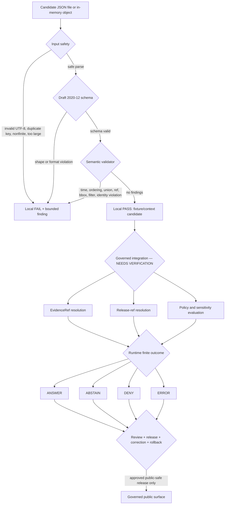

<!-- [KFM_META_BLOCK_V2]
doc_id: "kfm://doc/focus-mode-state-map-context-state"
title: "Focus Mode — MapContextEnvelope State"
type: "standard; focus-mode; ui-request-context; system-state-documentation"
version: "v1.1"
status: "draft; repository-grounded; current-contract-aligned; proposed-inactive-contract; fixture-first; validator-present; runtime-integration-unproven; non-release; non-publication"
owners:
  - "@bartytime4life — verified repository owner and current review route"
  - "NEEDS VERIFICATION — UI, map, evidence, runtime, policy, release, correction, and validation stewardship"
created: "2026-05-24"
updated: "2026-08-22"
policy_label: "public; documentation; map-context; renderer-neutral; released-reference-only; cite-or-abstain; no-authority; no-publication"
owning_root: "docs/"
responsibility: >-
  Explain the repository-present MapContextEnvelope semantic contract, machine
  schema, synthetic fixtures, validator, and test boundary; reconcile the older
  Focus Mode state proposal with current repository evidence; preserve the
  separation between request context, evidence, policy, runtime outcomes,
  release, correction, and publication; and identify unresolved integration and
  migration work without redefining machine shape in documentation.
authority: >-
  Human-readable orientation, reconciliation, and maintenance guidance only.
  Semantic meaning belongs to contracts/ui/map_context_envelope.md; machine
  shape belongs to schemas/contracts/v1/ui/map_context_envelope.schema.json;
  validation behavior belongs to the repository validator and tests. This file
  does not admit sources, resolve evidence, evaluate policy, authenticate
  release state, authorize public use, select a runtime outcome, mutate a map,
  or publish an artifact.
current_path: "docs/focus-mode/state/map-context-state.md"
canonical_relationship: >-
  Same-path documentation repair within the repository-present Focus Mode state
  compatibility lane. Accepted Directory Rules v2 permits this docs-root
  maintenance but does not settle the mixed state tree's final split or
  migration. Move, rename, mirror, split, or deletion remains HOLD pending an
  accepted decision, consumer closure, migration validation, and rollback.
truth_posture: >-
  CONFIRMED current target bytes, current UI semantic contract and schema,
  two valid synthetic fixture bases, a nineteen-case no-network fixture matrix,
  the deterministic validator, its focused unit test, accepted ADR-0029, and
  the current state-parent evidence snapshot / PROPOSED and INACTIVE the
  MapContextEnvelope object family as a runtime or public integration /
  CONFLICTED the older state document's Focus-runtime, 60-second TTL, spec
  rebinding, viewport-pull, and nonexistent focus_mode contract/schema claims
  with current UI contract, schema, and validator evidence / UNKNOWN governed
  API wiring, Focus request embedding, live evidence resolution, policy
  evaluation, release-reference authentication, accountable review, central
  validator-registry or required-check coupling, deployment, and public parity /
  NEEDS VERIFICATION every runtime, policy, release, currentness, rights,
  sensitivity, correction, and rollback claim beyond the bounded local
  contract/fixture validator seam.
evidence_snapshot:
  repository: "bartytime4life/Kansas-Frontier-Matrix"
  base_ref: "main"
  base_commit: "be8652410fa22499ac2ada43a26ed09bc3ab0514"
  target_prior_blob: "a5580fd67a0ef6a2c556bc14b5141d48b3f83bbe"
  parent_state_readme_blob: "3df63e3181264ee2ba9a5dad5a8e61d806005808"
  semantic_contract_path: "contracts/ui/map_context_envelope.md"
  semantic_contract_blob: "f0f7484b0d8d7f12bea5779ff55f61f13a75e6cd"
  schema_path: "schemas/contracts/v1/ui/map_context_envelope.schema.json"
  schema_blob: "178347eb846783989867cadbb74b6f0dd02fde4a"
  fixture_readme_blob: "22dfdc15d9b55a78a589b4af5ba037a1743f118f"
  base_viewport_fixture_blob: "6df7f360a8424f98125d8e0797e57c696eac1c2e"
  base_geography_fixture_blob: "03e3fedadb812455a65911ca9aa29d00cf9f8263"
  case_matrix_blob: "ba30d8b3794c125de41caf1379f5644e169904ab"
  validator_blob: "aa7c8db972290362d47d05f5c0bf368864f14ded"
  validator_test_blob: "b8c3e429c3771f792c4893029e32e621af3089e7"
  focus_request_schema_blob: "ab56ff852e30b36219156f513170d33b0f9996e1"
  validator_registry_blob: "71d347ce4cdd64bc498397312f904ad8136fcc32"
  directory_rules_adr_blob: "21a1d0c902ff90702aad990575b825c6ef5fc123"
inspection_boundary: >-
  Current-session GitHub reads covered the complete prior document, the current
  state-parent README, the complete UI semantic contract and machine schema,
  the compatibility object-folder README, both valid fixture bases, the full
  nineteen-case matrix, the validator including its CLI, the focused unit test,
  the Focus request schema scaffold, the central validator registry, accepted
  ADR-0029, current main, and bounded open-pull-request and task-branch overlap.
  No repository clone was mounted; no repository command, live map, governed
  API request, evidence resolver, policy evaluator, release-reference resolver,
  model call, deployment, public endpoint, correction propagation, or rollback
  drill was exercised.
related:
  - "./README.md"
  - "./payload-state.md"
  - "./finite-outcomes.md"
  - "../../../contracts/ui/map_context_envelope.md"
  - "../../../contracts/ui/map_context_envelope/README.md"
  - "../../../schemas/contracts/v1/ui/map_context_envelope.schema.json"
  - "../../../fixtures/ui/map_context_envelope/README.md"
  - "../../../fixtures/ui/map_context_envelope/base_viewport.json"
  - "../../../fixtures/ui/map_context_envelope/base_geography.json"
  - "../../../fixtures/ui/map_context_envelope/cases.json"
  - "../../../tools/validators/ui/validate_map_context_envelope.py"
  - "../../../tests/validators/test_validate_map_context_envelope.py"
  - "../../../tools/validators/validator_registry.json"
  - "../../../schemas/contracts/v1/focus/focus_request.schema.json"
  - "../../../contracts/runtime/runtime_response_envelope.md"
  - "../../doctrine/directory-rules.md"
  - "../../adr/ADR-0029-adopt-directory-governance-standard-v2.md"
tags: [kfm, focus-mode, state, map-context-envelope, ui, renderer-neutral, permalink-policy, deny-by-default, contract, schema, fixtures, validator, deterministic-identity, cite-or-abstain, non-publication]
notes:
  - "v1.0 replaces the stale v0.1 proposal with current repository evidence while retaining the existing H1 and numbered section anchors."
  - "v1.1 records the required fail-closed permalink declaration: the inactive profile permits no raw-envelope URL serialization, exact-location state, or restricted-context state."
  - "The MapContextEnvelope contract and schema remain proposed and inactive; tracked files and passing fixtures do not prove runtime integration or public use."
  - "The parent state README remains a pinned snapshot and is not rewritten in this single-target slice; a later cohort refresh should update its prior LINEAGE classification after all state documents are reconciled."
[/KFM_META_BLOCK_V2] -->

<a id="top"></a>

# Focus Mode — MapContextEnvelope State

> **Purpose.** Explain the current repository boundary for
> `MapContextEnvelope`: a deterministic, renderer-neutral projection of released
> map request context whose contract, schema, fixtures, validator, and tests are
> tracked, but whose governed API, Focus runtime, evidence, policy, release, and
> public integration remain unproven.

> [!IMPORTANT]
> **Tracked shape is not active runtime authority.** The semantic contract and
> schema identify themselves as proposed and inactive. Their presence proves
> reviewable repository bytes exist; it does not prove a deployed producer,
> consumer, resolver, policy gate, public endpoint, release decision, or answer.

> [!CAUTION]
> **Context is not evidence.** An envelope can name released-layer and evidence
> references, but it does not resolve those references, verify that a release
> actually exists, create citation closure, or authorize a response. Downstream
> evidence, policy, review, release, correction, and rollback controls remain
> mandatory.

> [!WARNING]
> **Renderer objects and internal lifecycle paths are outside the boundary.**
> MapLibre objects, style expressions, rendered feature blobs, feature-state,
> `RAW`, `WORK`, `QUARANTINE`, canonical/internal stores, proof stores, and
> direct-model references must not cross through this public-language object.

**Quick navigation:** [Status](#status-and-evidence-boundary) ·
[Scope](#1-scope) · [Fields](#2-required-fields) ·
[Admission](#3-admission-check) · [Freshness](#4-freshness-rules) ·
[State flow](#5-envelope-state-diagram) ·
[Viewport](#6-viewport-pull-governance) ·
[Payload boundary](#7-envelope-state-vs-payload-state) ·
[Anti-patterns](#8-anti-patterns) · [Open work](#9-open-questions) ·
[References](#10-cross-references)

---

<a id="status-and-evidence-boundary"></a>

## Status and evidence boundary

| Surface | Current repository evidence | Bounded status | What it does not prove |
|---|---|---|---|
| This document | Existing tracked path; prior blob `5707de7d264724dc6afc85eb397e3815f2a8cdf1` | Documentation reconciliation in progress | Machine shape, runtime behavior, policy, or release |
| Semantic contract | [`contracts/ui/map_context_envelope.md`](../../../contracts/ui/map_context_envelope.md), candidate blob `f0f7484b0d8d7f12bea5779ff55f61f13a75e6cd` | `proposed; inactive; no-network; no-authority` | Adoption, deployed producer/consumer, permalink serializer, or public use |
| Machine schema | [`schemas/contracts/v1/ui/map_context_envelope.schema.json`](../../../schemas/contracts/v1/ui/map_context_envelope.schema.json), candidate blob `178347eb846783989867cadbb74b6f0dd02fde4a` | Draft 2020-12 closed shape; `PROPOSED_INACTIVE`; permalink fixed to disabled/deny | Reference resolution, policy, URL-state serialization, or actual release state |
| Valid fixture bases | [`base_viewport.json`](../../../fixtures/ui/map_context_envelope/base_viewport.json) and [`base_geography.json`](../../../fixtures/ui/map_context_envelope/base_geography.json) | Two deterministic synthetic valid candidates | Real sources, current releases, or operational requests |
| Case matrix | [`cases.json`](../../../fixtures/ui/map_context_envelope/cases.json), candidate blob `ba30d8b3794c125de41caf1379f5644e169904ab` | Nineteen no-network cases: two valid, seven schema negatives, ten semantic negatives | Production coverage or complete adversarial coverage |
| Validator | [`validate_map_context_envelope.py`](../../../tools/validators/ui/validate_map_context_envelope.py), candidate blob `aa7c8db972290362d47d05f5c0bf368864f14ded` | Deterministic local shape and consistency validator with explicit permalink-deny scope | Evidence resolution, policy evaluation, URL-state serialization, review, release, or deployment |
| Focused test | [`test_validate_map_context_envelope.py`](../../../tests/validators/test_validate_map_context_envelope.py), candidate blob `b8c3e429c3771f792c4893029e32e621af3089e7` | Exercises schema closure, exact case polarity, permalink denial, identity, no-network replay, and CLI | Hosted exact-head status or end-to-end Focus behavior |
| Focus request schema | [`focus_request.schema.json`](../../../schemas/contracts/v1/focus/focus_request.schema.json), blob `a2f298f014fa299bdec03afbf14ba9937aa95ef8` | Empty `PROPOSED` scaffold with no field-level MapContextEnvelope binding | A wrapper relationship between question text and map context |
| Validator registry | [`validator_registry.json`](../../../tools/validators/validator_registry.json), blob `86aeadabe7104114c3f1efe60a8708ec11563bb1` | No `validate_map_context_envelope` entry found in the inspected registry | Central orchestration or required-check coupling |

### Truth labels used here

| Label | Meaning |
|---|---|
| `CONFIRMED` | Verified from pinned current repository bytes or remote state in this work session. |
| `PROPOSED` | Designed or tracked, but not accepted or proven as active implementation. |
| `INACTIVE` | Present as a fixture-first boundary without proven production wiring. |
| `CONFLICTED` | Current repository evidence contradicts an older statement in this document. |
| `UNKNOWN` | Evidence is insufficient to establish the claim. |
| `NEEDS VERIFICATION` | A concrete code, runtime, policy, evidence, review, CI, or release check remains. |
| `NOT_RUN` | The named command or external/runtime check was not executed in this documentation slice. |
| `HOLD` | Proceeding would cross an unresolved placement, authority, sensitivity, compatibility, or release boundary. |

A schema-valid record is a **candidate request-context declaration**. It is not an
`EvidenceBundle`, `PolicyDecision`, `ReviewRecord`, `ReleaseManifest`,
`RuntimeResponseEnvelope`, correction, rollback record, or published artifact.

[Back to top](#top)

---

<a id="1-scope"></a>

## 1. Scope

This file documents the current `MapContextEnvelope` object family as a
**renderer-neutral UI request-context projection**. The object is intended to
carry stable KFM identifiers and bounded declarations from a map shell toward a
governed API, Evidence Drawer, or Focus admission seam without exposing
renderer-specific or internal-store state.

### 1.1 Responsibility boundary

| Concern | Owning surface | Effect here |
|---|---|---|
| Semantic meaning | [`contracts/ui/map_context_envelope.md`](../../../contracts/ui/map_context_envelope.md) | Documentation summarizes; contract meaning wins |
| Machine shape | [`map_context_envelope.schema.json`](../../../schemas/contracts/v1/ui/map_context_envelope.schema.json) | Schema fields, enums, limits, and closure win |
| Synthetic examples | [`fixtures/ui/map_context_envelope/`](../../../fixtures/ui/map_context_envelope/README.md) | Examples prove bounded fixture behavior only |
| Deterministic validation | [`validate_map_context_envelope.py`](../../../tools/validators/ui/validate_map_context_envelope.py) | Validator findings and exit status own executable local checks |
| Focus request shape | [`focus_request.schema.json`](../../../schemas/contracts/v1/focus/focus_request.schema.json) | Current scaffold does not establish envelope embedding |
| Runtime outcomes | [`runtime_response_envelope.md`](../../../contracts/runtime/runtime_response_envelope.md) and its schema | `ANSWER`, `ABSTAIN`, `DENY`, and `ERROR` remain runtime-family outcomes |
| Evidence closure | `EvidenceRef` / `EvidenceBundle` authorities | Envelope references do not become resolved evidence |
| Policy and sensitivity | `policy/` plus accountable review | Caller role and governance declarations are not a policy decision |
| Release and public use | Release, review, correction, and rollback authorities | `release_state: PUBLISHED` is a declaration until independently resolved |

### 1.2 What crosses the boundary

The current shape can carry:

- object/profile/version identity;
- request and caller-role identifiers;
- assembly, expiry, and historical time-window declarations;
- either a viewport bounding box or a stable geography reference;
- released-layer declarations with release refs, spec hashes, and evidence refs;
- selected-feature identifiers tied to declared layers;
- finite renderer-neutral filters;
- canonical evidence- and release-reference unions;
- a fixed fail-closed permalink declaration that denies raw-envelope, exact-location, and restricted-context URL state;
- explicit non-authority governance flags; and
- deterministic `spec_hash` and `envelope_id` values.

It does **not** carry:

- query text under the current schema;
- MapLibre camera, source-layer, paint, layout, expression, feature-state, or
  `queryRenderedFeatures` objects;
- raw geometry or feature-property payloads from canonical/internal stores;
- an `EvidenceBundle`, citation validation, or resolved release object;
- a `PolicyDecision`, runtime outcome, answer, model output, or review approval;
- a permalink payload, URL-state codec, route, browser-history mutation, or share authorization;
- an access token, user profile, private source payload, or sensitive location;
- a release, promotion, correction, withdrawal, or rollback decision; or
- repository, map-store, or lifecycle mutation authority.

### 1.3 Reconciliation of the v0.1 proposal

| Prior statement or field | Current repository disposition |
|---|---|
| Semantic contract at `contracts/focus_mode/map_context_envelope.md` | **SUPERSEDED / absent at the inspected base.** Current semantic home is `contracts/ui/map_context_envelope.md`. |
| Schema at `schemas/contracts/v1/focus_mode/map_context_envelope.schema.json` | **SUPERSEDED / absent at the inspected base.** Current machine home is `schemas/contracts/v1/ui/map_context_envelope.schema.json`. |
| Envelope is an active immutable UI-to-Focus runtime contract | **UNKNOWN / overclaimed.** The tracked contract is proposed and inactive; no governed runtime wiring was verified. |
| `layer_ids[]` | Replaced by structured `layers[]` records. |
| `feature_ids[]` | Replaced by structured `selections[]` records. |
| `spec_version` | Current fields are `schema_version` and `profile`. |
| UUID-only `request_id` | Current schema accepts a bounded `safe_ref`, not only UUID syntax. |
| `caller_role` values `public`, `internal`, `validator` | Current enum is `PUBLIC_USER`, `AUTHENTICATED_USER`, `STEWARD`, `REVIEWER`, `SYSTEM_TEST`. |
| Fixed 60-second admission TTL | Current validator enforces a **maximum 15-minute declared lifetime**; it does not perform a wall-clock “now” comparison. |
| Runtime `current`, `rebindable`, `stale`, and `invalid` states | Not present as machine fields or proven runtime behavior. Local validator reports `PASS` or `FAIL`. |
| `spec_hash` as layer/style/filter binding only | Current hash binds the canonical envelope body excluding `envelope_id` and `spec_hash`. |
| Runtime may rebind a mismatched spec | No rebind implementation or receipt path was verified. Hash mismatch is a validator finding. |
| Optional `viewport_pull[]` | Not present in the closed schema; adding it is schema-invalid until a versioned contract change. |
| `permalink_policy` as an implementation-ready share-state control | **Narrowed.** The current field is a required fail-closed declaration fixed to `DISABLED` / `DENY`; no serializer or redacted projection is established. |
| Envelope-level evidence closure | Not performed. Evidence refs are syntax- and union-checked only. |
| Directory Rules v1.2 and `OPEN-DR-09` path claim | **SUPERSEDED as current authority.** Accepted ADR-0029 adopts Directory Rules v2; the existing path receives `PLACE` for this repair while structural convergence remains `HOLD`. |
| MapLibre v2.1, Atlas, and KFM-P21 citations | Retained as historical design lineage only; they were not verified as current repository implementation authority in this slice. |

[Back to top](#top)

---

<a id="2-required-fields"></a>

## 2. Required fields

The current schema is closed with `additionalProperties: false`. Every top-level
field below is required.

### 2.1 Top-level shape

| Field | Current schema rule | Current semantic role | Important limit |
|---|---|---|---|
| `object_type` | Constant `MapContextEnvelope` | Object-family discriminator | Not release or runtime authority |
| `schema_version` | Constant `1.0.0` | Machine-shape version | Contract status remains proposed/inactive |
| `profile` | Constant `kfm.ui.map-context-envelope.v1` | Bounded validation profile | Does not activate a service |
| `envelope_id` | `map-context-envelope:` plus 24 lowercase hex | Content-derived short identity | Must match recomputed envelope hash prefix |
| `request_id` | `safe_ref`, 1–320 characters | Request correlation | Syntax only; no authentication |
| `caller_role` | Five-value enum | Declared caller class | Enum validity is not policy permission |
| `assembled_at` | UTC second timestamp ending `Z` | Declared assembly time | Validator does not compare with wall-clock now |
| `expires_at` | UTC second timestamp ending `Z` | Declared context expiry | Must be after assembly and within 15 minutes |
| `time_window` | Closed `{start, end}` object | Historical/data scope | Ordered; end must not be after assembly |
| `area_scope` | `VIEWPORT` or `GEOGRAPHY` union | Spatial scope | Bounded shape; no access or jurisdiction claim |
| `layers` | 1–32 unique layer objects | Visible/relevant released-layer declarations | Each says `release_state: PUBLISHED` |
| `selections` | 0–64 unique feature-selection objects | Selected stable feature IDs | Every selection layer must be declared |
| `filters` | 0–32 unique renderer-neutral filters | Bounded request filtering | Only `EQ`, `IN`, `BETWEEN` |
| `evidence_refs` | 1–128 unique safe refs | Canonical evidence-ref union | References are not resolved here |
| `release_refs` | 1–128 unique safe refs | Canonical release-ref union | References are not authenticated here |
| `permalink_policy` | Closed fixed-denial object | Makes the absence of an admitted serializer explicit | Not a URL-state codec or redacted projection |
| `governance` | Closed object of eight constant-false declarations | Explicit non-effect record | Declarative, not independently attested |
| `spec_hash` | `sha256:` plus 64 lowercase hex | Deterministic identity binding | Recomputed from canonical content |

### 2.2 Area scope

Exactly one spatial scope form is admitted.

```json
{
  "scope_type": "VIEWPORT",
  "bbox": [-102, 36, -94, 40]
}
```

A viewport uses `[west, south, east, north]`. The schema bounds longitude and
latitude, while the validator additionally requires:

```text
west < east
south < north
```

The current validator therefore rejects an antimeridian-crossing box expressed
with `west > east`. It does not independently decide whether a very large but
ordered viewport is appropriate for a particular public request.

```json
{
  "scope_type": "GEOGRAPHY",
  "geography_ref": "geography:county:20169"
}
```

A geography scope carries a stable reference only. It does not embed geometry,
prove the referenced geography exists, establish legal boundaries, or grant
access.

### 2.3 Layer declaration

Each layer requires:

| Field | Rule | Boundary |
|---|---|---|
| `layer_id` | Bounded stable ID | No renderer source-layer or style object |
| `release_ref` | Bounded safe ref | Validator does not resolve the release |
| `layer_spec_hash` | SHA-256 value | Declared layer-spec identity |
| `release_state` | Constant `PUBLISHED` | Syntactic declaration, not authenticated release |
| `evidence_refs` | Non-empty canonical safe-ref array | References remain unresolved |

`layers[]` must be sorted by `layer_id` with no duplicate IDs. Top-level
`release_refs` must exactly equal the sorted set of layer `release_ref` values.

### 2.3.1 Deterministic identity

The semantic contract specifies RFC 8785 JSON Canonicalization Scheme plus
SHA-256 over the complete envelope **without** `envelope_id` and `spec_hash`.
The validator recomputes that hash through the repository hashing package.

```text
spec_hash  = "sha256:" + 64 lowercase hex
envelope_id = "map-context-envelope:" + first 24 digest hex
```

Identity proves byte-level canonical agreement under the inspected algorithm. It
does not prove the referenced evidence, release, caller, or governance
declarations are true.

### 2.4 Selection declaration

Each selection requires:

| Field | Rule | Boundary |
|---|---|---|
| `feature_id` | Bounded stable ID | No rendered feature blob or arbitrary properties |
| `layer_id` | Must name an entry in `layers[]` | Enforces local membership only |
| `evidence_refs` | Non-empty canonical safe-ref array | Does not prove evidence closure |

Selections must be canonical by `(layer_id, feature_id)`. Top-level
`evidence_refs` must exactly equal the sorted set of all evidence refs from
layers and selections.

### 2.5 Filter declaration

A filter is a renderer-neutral object:

```json
{
  "field": "support_type",
  "operator": "EQ",
  "values": ["authoritative_static_soil"]
}
```

| Operator | Required arity |
|---|---:|
| `EQ` | exactly 1 value |
| `IN` | at least 1 value |
| `BETWEEN` | exactly 2 values |

Filter fields are bounded names. Values may be strings, numbers, or booleans.
Filters must be unique and canonically sorted by compact JSON representation.
The contract does not admit MapLibre expressions, style operators, callbacks, or
arbitrary executable filter language.

### 2.6 Permalink policy

The inactive v1 profile requires a fixed fail-closed declaration:

```json
{
  "exact_location_state_allowed": false,
  "mode": "DISABLED",
  "outcome": "DENY",
  "raw_envelope_serialization": false,
  "reason_codes": ["PERMALINK_SERIALIZER_NOT_ADMITTED"],
  "restricted_context_allowed": false
}
```

This object prevents a consumer from treating a valid envelope as a shareable
URL payload. It does not redact state, encode a route, mutate browser history,
or authorize a permalink. A future safe-share implementation requires a
separate reviewed projection contract, serializer, policy checks, fixtures,
tests, consumer migration, correction behavior, and rollback proof.

### 2.7 Governance declarations

The current schema requires every field below to be `false`:

- `canonical_store_accessed`;
- `raw_work_quarantine_accessed`;
- `renderer_specific_state_included`;
- `evidence_closure_created`;
- `policy_authority_created`;
- `release_authority_created`;
- `public_use_authorized`; and
- `repository_mutated`.

These constants make prohibited effects explicit in the record shape. They do
not independently audit the producer. A dishonest producer could still submit a
shape-valid declaration; producer trust, code review, runtime isolation,
receipts, and external audit remain separate controls.

### 2.8 Tracked synthetic valid example

The following is the current geography-scoped synthetic fixture. It is a test
candidate, not evidence or a public request:

```json
{
  "area_scope": {
    "geography_ref": "geography:county:20169",
    "scope_type": "GEOGRAPHY"
  },
  "assembled_at": "2026-08-06T21:00:00Z",
  "caller_role": "SYSTEM_TEST",
  "envelope_id": "map-context-envelope:0068ff8417193c3fc09af303",
  "evidence_refs": [
    "evidence:soil:ssurgo"
  ],
  "expires_at": "2026-08-06T21:10:00Z",
  "filters": [],
  "governance": {
    "canonical_store_accessed": false,
    "evidence_closure_created": false,
    "policy_authority_created": false,
    "public_use_authorized": false,
    "raw_work_quarantine_accessed": false,
    "release_authority_created": false,
    "renderer_specific_state_included": false,
    "repository_mutated": false
  },
  "layers": [
    {
      "evidence_refs": [
        "evidence:soil:ssurgo"
      ],
      "layer_id": "soil-static",
      "layer_spec_hash": "sha256:1111111111111111111111111111111111111111111111111111111111111111",
      "release_ref": "release:soil-static:2026-08-01",
      "release_state": "PUBLISHED"
    }
  ],
  "object_type": "MapContextEnvelope",
  "permalink_policy": {
    "exact_location_state_allowed": false,
    "mode": "DISABLED",
    "outcome": "DENY",
    "raw_envelope_serialization": false,
    "reason_codes": [
      "PERMALINK_SERIALIZER_NOT_ADMITTED"
    ],
    "restricted_context_allowed": false
  },
  "profile": "kfm.ui.map-context-envelope.v1",
  "release_refs": [
    "release:soil-static:2026-08-01"
  ],
  "request_id": "request:fixture:geography-001",
  "schema_version": "1.0.0",
  "selections": [],
  "spec_hash": "sha256:0068ff8417193c3fc09af3031050bf508fa37ecf11ae5e43acd0fb53df83573f",
  "time_window": {
    "end": "2026-08-06T20:59:59Z",
    "start": "2026-08-01T00:00:00Z"
  }
}
```

The complete fixture remains authoritative for its own bytes at
[`base_geography.json`](../../../fixtures/ui/map_context_envelope/base_geography.json).

[Back to top](#top)

---

<a id="3-admission-check"></a>

## 3. Admission check

“Admission” in the current repository is a **bounded local validator result**,
not proof that a governed runtime accepted a request.

### 3.1 Validation sequence

| Stage | Current executable check | Example findings | Result class |
|---|---|---|---|
| Input safety | Regular file, not symlink, at most 1 MiB, UTF-8 JSON, unique keys, finite numbers, object root | `INPUT_SYMLINK_DENIED`, `INPUT_TOO_LARGE`, `JSON_DUPLICATE_KEY`, `JSON_NONFINITE_NUMBER` | Local `FAIL` |
| JSON Schema | Draft 2020-12 schema and format validation; findings capped at 64 | `SCHEMA_INVALID`, `SCHEMA_UNAVAILABLE` | Local `FAIL` |
| Context time | `assembled_at < expires_at`; TTL no more than 900 seconds | `CONTEXT_TIME_ORDER_INVALID`, `CONTEXT_TTL_EXCEEDED` | Local `FAIL` |
| Data time | `time_window.start <= time_window.end`; end not after assembly | `TIME_WINDOW_ORDER_INVALID`, `TIME_WINDOW_AFTER_ASSEMBLY` | Local `FAIL` |
| Canonical collections | Sorted unique layers, selections, filters, and ref arrays | `LAYERS_NOT_CANONICAL`, `SELECTIONS_NOT_CANONICAL`, `FILTERS_NOT_CANONICAL`, `REFS_NOT_CANONICAL` | Local `FAIL` |
| Local closure | Selection layer exists; top-level ref unions match nested declarations | `SELECTION_LAYER_UNRESOLVED`, `RELEASE_UNION_MISMATCH`, `EVIDENCE_UNION_MISMATCH` | Local `FAIL` |
| Trust membrane | Internal lifecycle, canonical, proof, or direct-model refs are absent | `INTERNAL_REFERENCE_DENIED` | Local `FAIL` |
| Spatial shape | Viewport uses ordered west/south/east/north values | `BBOX_ORDER_INVALID` | Local `FAIL` |
| Filter semantics | Operator arity is valid | `FILTER_ARITY_INVALID` | Local `FAIL` |
| Identity | Recompute canonical `spec_hash` and derived `envelope_id` | `SPEC_HASH_MISMATCH`, `ENVELOPE_ID_MISMATCH` | Local `FAIL` |

A record passes only when schema and semantic findings are empty.

### 3.2 What local PASS means

A local `PASS` supports only these bounded claims:

- the JSON parsed under the validator's input limits;
- it matched the current closed schema;
- local ordering, union, time, bounding-box, filter, and identity rules passed;
- prohibited internal-reference markers were not found by the implemented check;
- the result is deterministic for the same bytes and validator version.

### 3.3 What local PASS does not mean

It does **not** establish that:

- a `release_ref` resolves or its release is actually current or published;
- an `evidence_ref` resolves to an admissible `EvidenceBundle`;
- a layer spec hash matches a released renderer artifact;
- caller identity or role is authenticated;
- a producer truly avoided canonical or lifecycle-store access;
- policy allows the request;
- sensitivity, rights, sovereignty, or harmful precision were reviewed;
- a governed API or Focus runtime consumed the envelope;
- an `ANSWER`, `ABSTAIN`, `DENY`, or `ERROR` outcome was selected;
- a public artifact, deployment, release, correction, or rollback exists.

### 3.4 Validator outcome versus runtime outcome

| Family | Current finite result | Meaning |
|---|---|---|
| Map-context validator | `PASS` / `FAIL` plus findings | Local schema and semantic conformance |
| Runtime response envelope | `ANSWER` / `ABSTAIN` / `DENY` / `ERROR` | Governed response state after evidence, policy, and runtime processing |
| Review or placement | `HOLD`, `PLACE`, `MIGRATE`, and related governance postures | Change or placement control, not runtime response |
| Release/promotion | Separate decisions and receipts | Public-state transition, not validator success |

The old statement that every admission failure automatically becomes runtime
`ERROR` is therefore **PROPOSED / NEEDS VERIFICATION**. A future integration must
map validator findings into the current runtime contract without inventing
outcomes or leaking sensitive detail.

### 3.5 Repository-native commands

```bash
python tools/validators/ui/validate_map_context_envelope.py --fixtures

python -m unittest tests.validators.test_validate_map_context_envelope
```

The fixture CLI prints one compact result per case and exits `0` only when all
declared expectations match. Explicit-file validation accepts one or more JSON
paths and exits nonzero when any record fails. These commands were inspected but
were **NOT_RUN** in this connector-only documentation execution.

[Back to top](#top)

---

<a id="4-freshness-rules"></a>

## 4. Freshness rules

The current object carries three time concepts:

| Field | Meaning | Current validator rule |
|---|---|---|
| `assembled_at` | Declared time the context was assembled | Parseable UTC second |
| `expires_at` | Declared end of context lifetime | After assembly; no more than 15 minutes later |
| `time_window.start/end` | Historical or data-time scope | Ordered; end may not exceed assembly time |

### 4.1 Declared lifetime is not wall-clock freshness

The validator compares timestamps **inside the record**. It does not compare
`expires_at` with the machine's present clock. Consequently, an old synthetic
record can remain locally valid when its internal ordering and maximum lifetime
are correct.

A future online admission layer that needs currentness must separately define
and test:

- trusted clock source and skew tolerance;
- whether `now < expires_at` is mandatory;
- replay and idempotency behavior;
- release supersession or withdrawal handling;
- whether a stale record is rejected, reassembled, or safely narrowed; and
- the mapping to a runtime finite outcome.

### 4.2 Current bounded states

| Bounded state | Evidence available now | Effect |
|---|---|---|
| Schema-valid and semantically valid candidate | Local validator returns `PASS` | Eligible for further governed processing only |
| Expiry not after assembly | `CONTEXT_TIME_ORDER_INVALID` | Local `FAIL` |
| Declared lifetime exceeds 15 minutes | `CONTEXT_TTL_EXCEEDED` | Local `FAIL` |
| Time window reversed | `TIME_WINDOW_ORDER_INVALID` | Local `FAIL` |
| Time window ends after assembly | `TIME_WINDOW_AFTER_ASSEMBLY` | Local `FAIL` |
| Wall-clock expired | Not checked by this validator | `UNKNOWN`; requires runtime/currentness policy |
| Release ref superseded or withdrawn | Not resolved by this validator | `UNKNOWN`; requires release resolution |
| Evidence stale or revoked | Not resolved by this validator | `UNKNOWN`; requires evidence and policy processing |

### 4.3 Rebinding and mutation

No current field, fixture, validator path, or reviewed runtime implementation
establishes automatic spec rebinding. If context changes, the safer current
posture is to create a new canonical envelope with a new content-derived
identity rather than mutate an admitted record in place.

The previous `rebindable` state and receipt-backed runtime rewrite are retained
as design lineage only. Implementing them would require:

1. a versioned semantic decision;
2. machine-shape compatibility analysis;
3. deterministic pre- and post-rebind identities;
4. a bounded receipt or correction family in its proper responsibility root;
5. positive and negative fixtures;
6. policy and release-resolution behavior;
7. consumer migration; and
8. rollback proof.

[Back to top](#top)

---

<a id="5-envelope-state-diagram"></a>

## 5. Envelope state diagram

The current verified flow ends at local candidate conformance. Downstream
governed processing is a separate, unverified boundary.


```mermaid
flowchart TD
    A[Candidate JSON file or in-memory object] --> B{Input safety}
    B -->|invalid UTF-8, duplicate key, nonfinite, too large| F[Local FAIL + bounded finding]
    B -->|safe parse| C{Draft 2020-12 schema}
    C -->|shape or format violation| F
    C -->|schema valid| D{Semantic validator}
    D -->|time, ordering, union, ref, bbox, filter, identity violation| F
    D -->|no findings| P[Local PASS: fixture/context candidate]
    P --> G{Governed integration — NEEDS VERIFICATION}
    G --> E[EvidenceRef resolution]
    G --> R[Release-ref resolution]
    G --> Y[Policy and sensitivity evaluation]
    E --> O{Runtime finite outcome}
    R --> O
    Y --> O
    O --> A1[ANSWER]
    O --> A2[ABSTAIN]
    O --> A3[DENY]
    O --> A4[ERROR]
    A1 --> H{Review + release + correction + rollback}
    A2 --> H
    A3 --> H
    A4 --> H
    H -->|approved public-safe release only| U[Governed public surface]
```

> [!NOTE]
> The diagram distinguishes **implemented local validation** from **proposed or
> unknown runtime integration**. It does not claim that the downstream nodes are
> wired for MapContextEnvelope today.

[Back to top](#top)

---

<a id="6-viewport-pull-governance"></a>

## 6. Viewport-pull governance

The current schema supports a viewport only as a four-number
`area_scope.bbox`. It does **not** support `viewport_pull[]`, camera objects,
source queries, arbitrary layer discovery, renderer callbacks, or embedded
feature results.

Because the schema is closed, adding any of those fields currently produces
`SCHEMA_INVALID`.

### 6.1 Current viewport contract

| Rule | Current evidence |
|---|---|
| Spatial form | `scope_type: VIEWPORT` plus `bbox` |
| Coordinate ranges | Longitude `[-180, 180]`; latitude `[-90, 90]` |
| Ordering | `west < east` and `south < north` |
| Embedded geometry | Not admitted |
| Antimeridian crossing | Not expressible through `west > east` under current validator |
| Overbroad but ordered extent | Not independently policy-checked |
| Source retrieval | Not performed |
| Rights/sensitivity evaluation | Not performed |
| Current road, hazard, access, or emergency state | Not performed |

### 6.2 Future viewport retrieval

A future on-demand viewport retrieval mechanism must not be smuggled into this
object through an undocumented extension. At minimum it would need:

- explicit source and release identity;
- bounded area, time, domain, result count, byte size, and timeout;
- rights, sensitivity, sovereignty, geoprivacy, and harmful-precision checks;
- no direct `RAW`, `WORK`, `QUARANTINE`, canonical, proof, or model-store access;
- deterministic request identity and replay behavior;
- finite errors and non-disclosing denials;
- fixtures for global/antimeridian/empty/oversized/sensitive cases;
- evidence, policy, review, correction, and rollback relationships; and
- an accepted compatibility and versioning decision.

Until then, a viewport is **context only**, not authorization to “fetch
everything on screen.”

[Back to top](#top)

---

<a id="7-envelope-state-vs-payload-state"></a>

## 7. Envelope state vs payload state

| Concern | MapContextEnvelope | Focus payload/evidence/runtime |
|---|---|---|
| Primary role | Renderer-neutral request context | Governed claims, evidence, policy, and response |
| Current authority | Proposed UI semantic contract plus closed schema | Separate proposed contracts/schemas and runtime family |
| Layer data | Stable IDs, release refs, spec hashes, evidence refs | Resolved released artifacts and policy-safe projections |
| Evidence | References only | `EvidenceRef` must resolve to `EvidenceBundle` before consequential claims |
| Policy | No decision; caller role is declarative | Policy decides allow, deny, abstain, redaction, or generalization |
| Release | `PUBLISHED` string and refs are declarations | Release authority must be independently authenticated |
| Identity | Canonical envelope hash and derived ID | Separate payload, evidence, decision, receipt, and release identities |
| Validator result | `PASS` or `FAIL` | Runtime uses `ANSWER`, `ABSTAIN`, `DENY`, `ERROR` |
| Public effect | None | Only reviewed, released, correction-capable output may reach public surfaces |
| Mutation | Governance shape declares none | Any state transition remains separately governed |

### 7.1 Query and request wrapping

The old document asserted that query text sits in a `FocusModeRequest` wrapper.
The current inspected Focus request schema is an empty proposed scaffold with no
field-level contract. Therefore:

- query text is not part of the current MapContextEnvelope schema;
- no current schema binding between a question and this envelope was verified;
- no request-signature, authentication, idempotency, or replay contract was
  established by this documentation update; and
- a future wrapper must reference this object through a versioned, tested,
  deterministic relationship rather than duplicating its fields.

### 7.2 Evidence Drawer and selected feature

A selection may support a future Evidence Drawer request because it names a
stable `feature_id`, `layer_id`, and evidence refs. The envelope still does not:

- fetch the feature;
- verify that the feature exists in a released layer;
- resolve the evidence refs;
- determine whether the feature is sensitive;
- expose arbitrary feature properties;
- authorize a citation or answer; or
- preserve a renderer hover/popup state.

A future Evidence Drawer consumer should resolve the stable refs through governed
interfaces and display bounded negative states when evidence or policy closure
fails.

[Back to top](#top)

---

<a id="8-anti-patterns"></a>

## 8. Anti-patterns

| Anti-pattern | Why it is unsound | Current corrective posture |
|---|---|---|
| Documenting the nonexistent `contracts/focus_mode/...` or `schemas/.../focus_mode/...` homes | Creates false authority and broken navigation | Use the current `contracts/ui/` and `schemas/contracts/v1/ui/` homes |
| Treating the proposed/inactive contract as deployed runtime | Confuses repository bytes with operational maturity | Label runtime wiring `UNKNOWN` / `NEEDS VERIFICATION` |
| Passing MapLibre objects, style JSON, source-layer, paint/layout, expressions, or feature-state | Couples trust semantics to renderer internals and may leak data | Closed renderer-neutral schema rejects extra fields |
| Treating `release_state: PUBLISHED` as proof | The validator does not resolve releases | Independently resolve release identity and state |
| Treating evidence refs as evidence closure | The validator checks syntax, unions, and internal markers only | Resolve `EvidenceRef` to `EvidenceBundle` downstream |
| Treating governance flags as audited behavior | Constant-false declarations can be dishonest | Pair with trusted producer design, review, runtime controls, and receipts |
| Using `PASS` as an `ANSWER` | Validator and runtime outcome families are distinct | Preserve finite family boundaries |
| Reusing a declared envelope indefinitely | The validator checks internal lifetime, not wall-clock currentness | Add explicit online freshness policy before operational use |
| Mutating `spec_hash` or `envelope_id` by hand | Breaks deterministic identity | Recompute canonical content identity |
| Unsorted or duplicate arrays | Produces unstable bytes and ambiguous unions | Canonicalize and reject non-canonical records |
| Embedding `RAW`, `WORK`, `QUARANTINE`, internal, canonical, proof, or model refs | Bypasses the trust membrane | Validator denies recognized internal-reference forms |
| Adding `viewport_pull`, camera, query text, or ad hoc fields without versioning | Closed schema rejects them; hidden extensions create drift | Use a reviewed contract/schema migration |
| Assuming global or antimeridian behavior that is not tested | Spatial edge behavior can silently overselect or reject | Add explicit requirements and fixtures before relying on it |
| Claiming central validator/CI enforcement from file presence | The inspected validator registry does not list this validator | Record wiring as `NEEDS VERIFICATION` |

[Back to top](#top)

---

<a id="9-open-questions"></a>

## 9. Open questions

### 9.1 Contract and integration

- [ ] Which accepted owner and reviewer classes govern UI, map, runtime, evidence,
  policy, release, and compatibility decisions for this object?
- [ ] Is the proposed/inactive contract intended to become a governed API input,
  an Evidence Drawer request, a Focus request component, or multiple profiles?
- [ ] What versioned request contract binds query text, authentication,
  idempotency, and MapContextEnvelope identity?
- [ ] Which producer creates the envelope, and how is that producer prevented
  from accessing internal lifecycle or canonical stores?
- [ ] Which consumer validates it, and where is validation required rather than
  optional?
- [ ] Should the validator be registered in
  `tools/validators/validator_registry.json` and tied to a stable hosted check?
- [ ] What compatibility rule applies if the schema, canonicalization, or
  identity algorithm changes?

### 9.2 Evidence, release, policy, and sensitivity

- [ ] Which resolver authenticates `release_refs`, `evidence_refs`, and
  `layer_spec_hash` values?
- [ ] What happens when a release is superseded, withdrawn, or corrected after
  an envelope is assembled?
- [ ] Which policy decides whether `caller_role` may see a layer or feature?
- [ ] How are rights, cultural sensitivity, living-person data,
  infrastructure, archaeology, rare species, and harmful precision kept out of
  selections and references?
- [ ] Should governance declarations be externally attested or derived by a
  trusted producer rather than caller-supplied?
- [ ] How are safe denials emitted without echoing restricted identifiers?

### 9.3 Time and spatial behavior

- [ ] Is 15 minutes the final maximum, a fixture profile, or a configurable
  policy value?
- [ ] What trusted clock and skew tolerance govern online expiry?
- [ ] Are future time windows ever allowed, and under what domain-specific rule?
- [ ] How should antimeridian viewports be represented?
- [ ] Should a global or near-global ordered viewport be rejected or narrowed?
- [ ] What numeric precision and canonicalization apply to bounding boxes?
- [ ] Is a stable geography ref preferred over a viewport for replayable Focus
  questions?

### 9.4 Validation, review, and release evidence

- [ ] Are the fixture CLI and focused unit test passing on the exact PR head?
- [ ] Is the validator invoked by required CI, or only available for manual use?
- [ ] What integration test proves a public client cannot bypass the envelope?
- [ ] What negative tests prove invented release refs and evidence refs fail at
  downstream resolution?
- [ ] What review records are required before contract activation?
- [ ] What correction and rollback behavior applies to already-cached envelopes
  or responses?

### 9.5 Maintenance, correction, and rollback

When the object family changes materially:

1. update the semantic contract first or in the same coherent slice;
2. update the machine schema, fixture bases, case matrix, validator, and focused
   tests together;
3. preserve the relationship between `spec_hash`, `envelope_id`, and canonical
   content;
4. document compatibility, migration, deprecation, and consumer effects;
5. do not treat a branch, PR, passing test, or merge as activation or release;
6. update this explanatory document after current bytes are verified;
7. refresh the parent state README in a separately pinned state-document cohort
   when its snapshot classification becomes stale; and
8. retain correction and rollback lineage rather than rewriting shared history.

**Documentation rollback:** before merge, close or abandon the task PR and branch.
After merge, use a transparent revert or forward-fix PR against the actual merged
commit. Do not recreate an obsolete parallel contract or schema home.

**Runtime correction:** if a future public integration misstates release,
evidence, policy, sensitivity, or context, a documentation revert alone is not
sufficient. Withdraw or correct affected outputs, invalidate caches, preserve
supersession history, and use the recorded rollback target under the responsible
release process.

### 9.6 Acceptance checklist for this documentation boundary

- [ ] Current contract, schema, fixture, validator, and test paths are exact.
- [ ] Contract and schema status remain visibly proposed/inactive.
- [ ] Top-level fields and constraints match the current schema.
- [ ] Validator semantics are separated from schema declarations.
- [ ] `PASS` / `FAIL` are separated from runtime finite outcomes.
- [ ] Evidence and release refs are not represented as resolved.
- [ ] Governance flags are not represented as external attestation.
- [ ] The 15-minute maximum is not misstated as wall-clock freshness proof.
- [ ] `viewport_pull[]`, automatic rebinding, and nonexistent paths are not
  represented as current behavior.
- [ ] Renderer-specific and internal lifecycle state remain excluded.
- [ ] Runtime, CI wiring, review, release, deployment, and public parity remain
  bounded as `UNKNOWN` or `NEEDS VERIFICATION`.
- [ ] Stable existing section anchors remain available.
- [ ] Correction and rollback boundaries are explicit.

[Back to top](#top)

---

<a id="10-cross-references"></a>

## 10. Cross-references

### Current object-family surfaces

- [MapContextEnvelope semantic contract](../../../contracts/ui/map_context_envelope.md)
- [MapContextEnvelope compatibility object-folder README](../../../contracts/ui/map_context_envelope/README.md)
- [MapContextEnvelope JSON Schema](../../../schemas/contracts/v1/ui/map_context_envelope.schema.json)
- [Fixture-family README](../../../fixtures/ui/map_context_envelope/README.md)
- [Viewport-scoped valid fixture](../../../fixtures/ui/map_context_envelope/base_viewport.json)
- [Geography-scoped valid fixture](../../../fixtures/ui/map_context_envelope/base_geography.json)
- [Sixteen-case validation matrix](../../../fixtures/ui/map_context_envelope/cases.json)
- [Deterministic validator](../../../tools/validators/ui/validate_map_context_envelope.py)
- [Focused validator test](../../../tests/validators/test_validate_map_context_envelope.py)
- [Central validator registry](../../../tools/validators/validator_registry.json)

### Related Focus and runtime boundaries

- [Focus Mode state boundary](./README.md)
- [Payload-state lineage](./payload-state.md)
- [Finite-outcome lineage](./finite-outcomes.md)
- [Focus request schema scaffold](../../../schemas/contracts/v1/focus/focus_request.schema.json)
- [FocusModePayload semantic proposal](../../../contracts/focus_mode/focus_mode_payload.md)
- [Runtime response semantic contract](../../../contracts/runtime/runtime_response_envelope.md)
- [Runtime response machine schema](../../../schemas/contracts/v1/runtime/runtime_response_envelope.schema.json)

### Governance and review

- [Accepted Directory Rules decision](../../adr/ADR-0029-adopt-directory-governance-standard-v2.md)
- [Directory Rules v2 bytes](../../doctrine/directory-rules.md)
- [Generated-receipt lane](../../../data/receipts/generated/README.md)
- [Pull-request review template](../../../.github/PULL_REQUEST_TEMPLATE.md)

---

**Document status:** repository-grounded draft · **Contract status:** proposed and
inactive · **Runtime integration:** unknown · **Release/publication effect:** none

[Back to top](#top)
