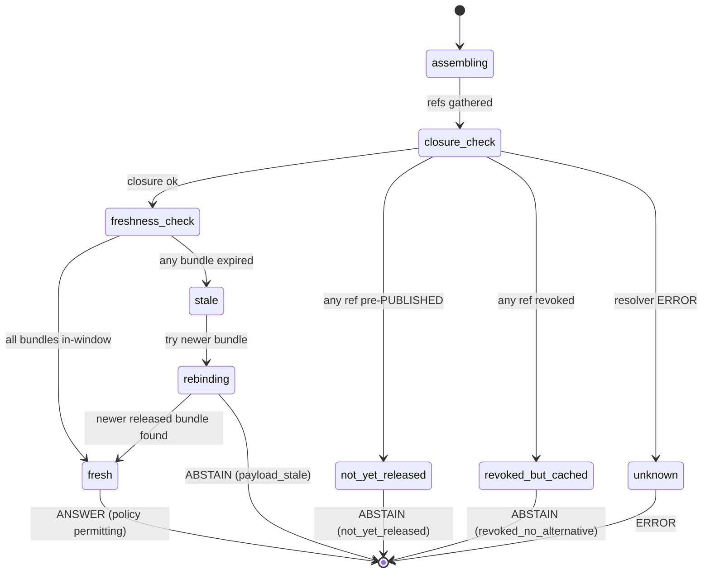

<!-- [KFM_META_BLOCK_V2]
doc_id: kfm://doc/focus-mode-state-payload-state
title: Focus Mode — Payload State (FocusModePayload freshness and citation closure)
type: standard
version: v0.1
status: draft
owners: <FOCUS-MODE-DOCTRINE-OWNER> · NEEDS VERIFICATION
created: 2026-05-24
updated: 2026-05-24
policy_label: public
related:
  - docs/focus-mode/state/README.md §10
  - docs/focus-mode/state/finite-outcomes.md §4.1 (ABSTAIN reason codes)
  - docs/focus-mode/state/map-context-state.md
  - docs/focus-mode/state/revocation-state.md
  - docs/focus-mode/state/transitions/answer-to-abstain.md
  - contracts/focus_mode/focus_mode_payload.md (PROPOSED)
  - schemas/contracts/v1/focus_mode/focus_mode_payload.schema.json (PROPOSED)
tags: [kfm, focus-mode, state, payload, freshness, citation-closure]
notes:
  - Path placement diverges from Directory Rules v1.2 §6.7.2; tracked as OPEN-DR-09.
  - Payload state is independent of the lifecycle stage of underlying artifacts; both states must align before ANSWER is allowed.
[/KFM_META_BLOCK_V2] -->

# Focus Mode — Payload State

> *`FocusModePayload` freshness states (`fresh` · `stale` · `not-yet-released` · `revoked-but-cached` · `unknown`), citation-closure rules, and the runtime checks that map each payload state to a finite outcome.*

**Status:** draft · **Owners:** `<FOCUS-MODE-DOCTRINE-OWNER>` *(NEEDS VERIFICATION)* · **Last updated:** 2026-05-24

> [!IMPORTANT]
> **A `FocusModePayload` is the bounded projection of released evidence a Focus Mode answer is built from.** It carries its own freshness state independent of the underlying artifacts' lifecycle stages. A payload that resolves cleanly is necessary but not sufficient for `ANSWER` — policy decision, review state, and revocation state must also align.

> [!CAUTION]
> **Path placement diverges from Directory Rules v1.2 §6.7.2** — see [README §2.1](./README.md#21-path-divergence-must-be-resolved). Doctrine CONFIRMED; file location PROPOSED pending OPEN-DR-09.

---

## Contents

1. [Scope](#1-scope)
2. [The five payload states](#2-the-five-payload-states)
3. [Citation closure — what counts as closed](#3-citation-closure)
4. [Freshness window — what counts as fresh](#4-freshness-window)
5. [Payload state × outcome state mapping](#5-payload-state--outcome-state-mapping)
6. [Payload composition rules](#6-payload-composition-rules)
7. [Lifecycle of a payload at runtime](#7-lifecycle-of-a-payload-at-runtime)
8. [Anti-patterns](#8-anti-patterns)
9. [Open questions](#9-open-questions)
10. [Cross-references](#10-cross-references)

---

## 1. Scope

This file defines **payload state** — the freshness, closure, and resolution state of the `FocusModePayload` a Focus Mode runtime evaluates when answering a request.

Payload state is **independent of**:

- **Lifecycle state** *(of the underlying artifacts; see [`lifecycle-states.md`](./lifecycle-states.md))* — a payload citing only `PUBLISHED` artifacts can still be `stale` if those artifacts were superseded.
- **Review state** *(of any single artifact; see [`review-state.md`](./review-state.md))* — a payload can resolve cleanly while a revision of one cited artifact sits at `pending`.
- **Map context state** *(of the request envelope; see [`map-context-state.md`](./map-context-state.md))* — payload freshness is about evidence age and revocation; envelope freshness is about request-scope validity.

[↑ Back to top](#top)

---

## 2. The five payload states

> **CONFIRMED envelope shape doctrine *(Atlas v1.1 §20.3, §24.11.4)*; PROPOSED per-state implementation contract.**

| State | When | Public effect |
|---|---|---|
| **`fresh`** | All cited evidence is `PUBLISHED`, in-window, and not revoked. Citation closure verified. | `ANSWER` allowed *(subject to policy)*. |
| **`stale`** | Underlying evidence has been superseded *(new `ReleaseManifest` exists)* or has aged past its freshness window. | `ABSTAIN (payload_stale)` unless a released alternative is found and re-bound. |
| **`not-yet-released`** | At least one referenced artifact is still `PROCESSED` or `CATALOG/TRIPLET`. | `ABSTAIN (not_yet_released)` — never `ANSWER`. |
| **`revoked-but-cached`** | Evidence has been revoked but UI still holds a cached payload locally. | `ABSTAIN (revoked_no_alternative)` and surface revocation reason — never `ANSWER`. |
| **`unknown`** | Payload is well-formed but evidence resolution returned `ERROR`. | `ERROR` envelope — never silently `ANSWER`. |

> [!NOTE]
> **`fresh` is the only state that permits `ANSWER`.** All four other states drive the runtime to `ABSTAIN`/`ERROR`. This is the single most important invariant of payload state.

[↑ Back to top](#top)

---

## 3. Citation closure

> **CONFIRMED doctrine — cite-or-abstain.** *(Doctrine Synthesis Part III; Atlas v1.1 §24.3.)*

A payload achieves **citation closure** when every claim it carries has at least one `EvidenceRef` that:

1. Resolves to a released `EvidenceBundle`.
2. The bundle is not revoked.
3. The bundle's content hash matches the digest in the `EvidenceRef`.
4. The bundle's covered subject, time window, and area intersect the claim.

| Closure check | Failure → payload state |
|---|---|
| `EvidenceRef` does not resolve | `unknown` *(→ `ERROR`)* or `stale` *(if a superseding ref exists)* |
| Bundle revoked | `revoked-but-cached` *(→ `ABSTAIN`)* |
| Hash mismatch | `unknown` *(→ `ERROR` — integrity break)* |
| Subject/time/area intersection fails | `stale` or "no claim binding" — emit `ABSTAIN (evidence_insufficient)` |
| Bundle not yet `PUBLISHED` | `not-yet-released` *(→ `ABSTAIN`)* |
| All claims pass | closure achieved → state moves to `fresh` *(pending freshness window check)* |

> [!IMPORTANT]
> **Closure is per-claim, not per-payload.** A payload with five claims where four close and one does not is **not** `fresh` — the runtime MUST either drop the failing claim *(if the remaining four still answer the request)* or emit `ABSTAIN` for the whole. Partial citation cannot pose as full citation. *(Anti-pattern — `partial-closure`, §8.)*

[↑ Back to top](#top)

---

## 4. Freshness window

A `fresh` payload requires every cited `EvidenceBundle` to be within its configured **freshness window**. The window is per-domain and per-evidence-type; it lives in the bundle's metadata, not the payload.

| Window family *(PROPOSED defaults)* | Typical bundle | Default window |
|---|---|---|
| Static reference *(boundaries, geology bedrock)* | Cadastral, geological survey | 1 year *(re-check; usually still fresh)* |
| Annual aggregate *(CDL, soils, climate normals)* | NRCS, NASS, NOAA normals | 1 year + grace period |
| Quarterly *(some hydrology, hazard summaries)* | USGS NWIS quarterly summaries | 90 days + grace period |
| Monthly *(some atmosphere, hazard event indexes)* | NOAA storm events, KDHE AQ | 30 days |
| Event-time *(declarations, advisories)* | FEMA declarations, NWS advisories | event-specific; expires at declared end |
| Real-time *(rare in KFM — generally not admissible at all)* | Live sensor feeds | not admissible without aggregation |

> [!NOTE]
> **Real-time data is generally not admissible** as Focus Mode evidence. KFM is not an alert authority. Real-time sources are admissible only after aggregation, validation, and release per the standard pipeline. *(See [`docs/focus-mode/README.md` §15](../README.md#15-sensitivity-defaults-fail-closed-lanes) — emergency-alert claims default to `ABSTAIN`.)*

A payload becomes `stale` when **any** cited bundle's window expires. The runtime MUST then either:

1. Re-bind to a newer released bundle covering the same subject *(payload returns to `fresh`)*, or
2. Demote the surface from `ANSWER` to `ABSTAIN` *(see [`transitions/answer-to-abstain.md`](./transitions/answer-to-abstain.md))*.

[↑ Back to top](#top)

---

## 5. Payload state × outcome state mapping

| Payload state | Allowed outcomes | Forbidden outcomes |
|---|---|---|
| `fresh` | `ANSWER` *(policy permitting)* · `DENY` *(policy denies)* · `HOLD` *(review pending)* · `ERROR` *(resolver fails on a non-payload concern)* | `ABSTAIN` solely on payload state — payload is fresh |
| `stale` | `ABSTAIN (payload_stale)` · `DENY` *(if policy also denies)* · `ERROR` | `ANSWER` — staleness disqualifies the payload |
| `not-yet-released` | `ABSTAIN (not_yet_released)` · `ERROR` | `ANSWER` · `DENY` *(can't deny a non-released artifact — policy never sees it)* |
| `revoked-but-cached` | `ABSTAIN (revoked_no_alternative)` · `ERROR` | `ANSWER` — silently rendering revoked evidence is the canonical anti-pattern |
| `unknown` | `ERROR` | `ANSWER` · `ABSTAIN` — `unknown` is not a quiet failure; the resolver errored |

> [!IMPORTANT]
> **A payload's freshness state alone never produces `DENY`.** `DENY` requires a policy/rights/sensitivity decision against the request — see [`finite-outcomes.md` §4.2](./finite-outcomes.md#42-deny-reason-codes-proposed-enum). Payload state can drive `ABSTAIN` but never substitutes for policy.

[↑ Back to top](#top)

---

## 6. Payload composition rules

| Rule | Why it matters |
|---|---|
| **Bounded** — payload covers exactly the area + time window of the request. | Out-of-scope evidence is not citable; including it widens the claim beyond what the request asked. |
| **Released-only** — every cited bundle is `PUBLISHED`. | Trust-membrane rule *(see [`lifecycle-states.md` §5](./lifecycle-states.md#5-trust-membrane-rule))*. |
| **Citation-closed** — every claim has at least one resolving `EvidenceRef` *(per §3)*. | Cite-or-abstain. |
| **Receipt-attached** — `AIReceipt` lists every bundle the runtime touched, even those it ultimately did not cite. | Replay and audit. |
| **Hash-bound** — payload carries the content hashes of cited bundles, not just IDs. | Detects in-flight tampering and silent revocation. |
| **Time-snapshot** — payload records the timestamp at which it was assembled. | Replay across releases requires knowing which release the payload reflects. |
| **No model output as evidence** — generated text or coordinates never appear in the evidence side-car. | Governed-AI rule; AI output is interpretive, not evidence. *(See [README §14](./README.md#14-anti-patterns) and `ai-build-operating-contract.md` §10.)* |

[↑ Back to top](#top)

---

## 7. Lifecycle of a payload at runtime

> [!NOTE]
> **Rebinding is allowed but governed.** If the payload finds a newer released bundle for the same subject *(area + time + domain)*, it MAY re-bind without emitting `ABSTAIN`. The receipt records the rebinding. If no newer bundle exists, the surface demotes to `ABSTAIN`. *(See [`transitions/answer-to-abstain.md`](./transitions/answer-to-abstain.md).)*

[↑ Back to top](#top)

---

## 8. Anti-patterns

| Anti-pattern | Why it breaks doctrine | Mitigation |
|---|---|---|
| **Partial closure** — payload renders `ANSWER` when 4 of 5 claims close and 1 does not. | Hides the uncited claim behind the cited ones. | Per-claim closure check; drop or `ABSTAIN`. |
| **Cached-but-revoked render** — UI continues rendering after revocation. | Violates revocation; serves denied content. | `revoked-but-cached` state → `ABSTAIN`; see [`revocation-state.md`](./revocation-state.md). |
| **Stale rendered as fresh** — payload assembled with last-known-good cache, never re-checked. | Surface diverges from current release; user sees outdated claim. | Freshness check on every request; window per bundle. |
| **`not-yet-released` rendered as `ANSWER`** — release candidate mistaken for release. | Pre-release content reaches public surface. | `PUBLISHED` check in closure step; gate G enforces. |
| **Model output as evidence** — generated coordinates or summaries land in the evidence side-car. | Governed-AI rule violated; AI promoted to truth source. | `AIReceipt` records model output as interpretation, not evidence; payload evidence side-car carries only released bundles. |
| **Hash-less payload** — payload references bundle IDs but not content hashes. | Silent revocation or tamper invisible. | Hash-bound payload contract; reject on missing hash. |
| **Receipt omitted on `ANSWER`** — `AIReceipt` not attached to a substantive answer. | Audit impossible; replay impossible. | Every `ANSWER` carries `AIReceipt` *(see [`finite-outcomes.md` §3](./finite-outcomes.md#3-per-outcome-required-artifacts))*. |

[↑ Back to top](#top)

---

## 9. Open questions

| ID | Question | Class |
|---|---|---|
| PY-Q1 | Should the payload schema include a per-claim closure flag, or is closure an envelope-level property? | Schema shape |
| PY-Q2 | Freshness window — encoded on the bundle or on the payload-binding metadata? | Authority placement |
| PY-Q3 | Rebinding receipts — separate `RebindingNotice` or appended to `AIReceipt`? | Receipt shape |
| PY-Q4 | Should `revoked-but-cached` and `stale` collapse into a single `obsolete` state with a reason field? | Vocabulary |
| PY-Q5 | Per-claim TTL inside the payload vs per-bundle TTL — single source of truth? | Storage location |

[↑ Back to top](#top)

---

## 10. Cross-references

- [`docs/focus-mode/state/README.md`](./README.md) §10 — payload state and `MapContextEnvelope` state overview.
- [`docs/focus-mode/state/finite-outcomes.md`](./finite-outcomes.md) §4.1 — `ABSTAIN` reason codes driven by payload state.
- [`docs/focus-mode/state/lifecycle-states.md`](./lifecycle-states.md) §5 — trust-membrane rule (payload reads `PUBLISHED` only).
- [`docs/focus-mode/state/map-context-state.md`](./map-context-state.md) — request envelope freshness *(distinct from payload freshness)*.
- [`docs/focus-mode/state/revocation-state.md`](./revocation-state.md) — `revoked-but-cached` deep dive.
- [`docs/focus-mode/state/transitions/answer-to-abstain.md`](./transitions/answer-to-abstain.md) — demotion path on staleness.
- `contracts/focus_mode/focus_mode_payload.md` *(PROPOSED)* — semantic contract for `FocusModePayload`.
- `schemas/contracts/v1/focus_mode/focus_mode_payload.schema.json` *(PROPOSED)* — machine schema.
- `kfm_unified_doctrine_synthesis.md` Part III — cite-or-abstain.

---

**Last updated:** 2026-05-24 · **Doc version:** v0.1 · **Doc status:** draft · **Path status:** PROPOSED *(OPEN-DR-09)*

[↑ Back to top](#top)
