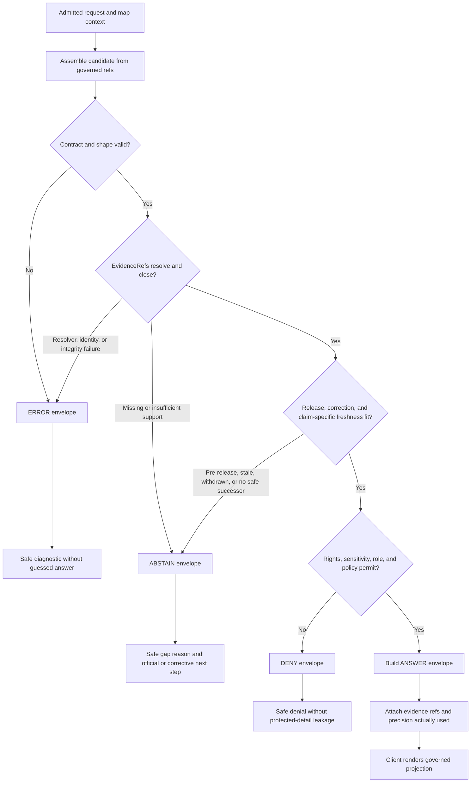

<!-- [KFM_META_BLOCK_V2]
doc_id: kfm://doc/focus-mode-state-payload-state
title: Focus Mode — Payload State
type: standard
version: v0.2
status: draft
owners: OWNER_TBD — Focus Mode steward · Runtime steward · Evidence steward · Policy steward · Release/correction steward
created: 2026-05-24
updated: 2026-08-22
policy_label: public
owning_root: docs/
responsibility: Document the proposed payload-eligibility, evidence-closure, freshness, correction, and runtime-outcome relationship without creating machine, policy, release, or publication authority.
truth_posture: CONFIRMED repository evidence · PROPOSED payload-state vocabulary · NEEDS VERIFICATION runtime integration
evidence_checkpoint: main@ec58517b74a02f5ce7dda3f407769c31d1393bb7
related:
  - ./README.md
  - ./finite-outcomes.md
  - ./lifecycle-states.md
  - ./map-context-state.md
  - ./revocation-state.md
  - ./transitions/answer-to-abstain.md
  - ../../../contracts/focus_mode/focus_mode_payload.md
  - ../../../contracts/runtime/runtime_response_envelope.md
  - ../../../contracts/ui/focus_response.md
  - ../../../schemas/contracts/v1/runtime/runtime_response_envelope.schema.json
  - ../../../schemas/contracts/v1/evidence/evidence_ref.schema.json
  - ../../../schemas/contracts/v1/evidence/evidence_bundle.schema.json
  - ../../../tools/validators/validate_runtime_response_envelope.py
  - ../../../tests/runtime_proof/test_envelope_finite_outcomes.py
  - ../../adr/ADR-0027-county-focus-mode-control-plane.md
  - ../../adr/ADR-0029-adopt-directory-governance-standard-v2.md
tags: [kfm, focus-mode, state, payload, freshness, citation-closure, evidence-ref, runtime-response-envelope, correction]
notes:
  - Same-path modernization of an existing tracked documentation file.
  - The five payload-state names remain a PROPOSED semantic profile; no current FocusModePayload machine schema or accepted state enum was verified.
  - The current RuntimeResponseEnvelope machine shape has four client-facing outcomes and a required but unconstrained freshness string.
  - This document records adjacent state-doc drift without accepting an ADR, migrating the lane, changing runtime behavior, or publishing anything.
[/KFM_META_BLOCK_V2] -->

<a id="top"></a>

# Focus Mode — Payload State

> **Purpose.** Define the proposed eligibility state of a Focus Mode payload—evidence closure, release fitness, freshness, correction posture, and safe mapping into the governed runtime envelope—without treating this Markdown as a schema, resolver, policy engine, release decision, or proof of implementation.

> [!IMPORTANT]
> A `FocusModePayload` is a downstream governed composition, not sovereign truth. An `ANSWER` requires more than a payload that looks complete: the request context must be admitted, the relevant `EvidenceRef` objects must resolve to admissible support, policy and sensitivity must permit the response, release and correction state must allow use, and the client-facing `RuntimeResponseEnvelope` must satisfy its current four-outcome machine contract.

> [!CAUTION]
> **Current repository evidence does not establish a machine-enforced five-state payload enum.** The semantic `FocusModePayload` contract exists and remains `PROPOSED`; the exact machine-schema path named by the older edition, `schemas/contracts/v1/focus_mode/focus_mode_payload.schema.json`, is absent at this edition's checkpoint. The five states below are therefore a **PROPOSED evaluation profile**, not current runtime law.

## Status and evidence boundary

| Surface | Current-session evidence | Truth state |
|---|---|---|
| This document | Tracked at `docs/focus-mode/state/payload-state.md`; prior edition was `v0.1`, dated 2026-05-24. | `CONFIRMED` |
| Payload meaning | [`contracts/focus_mode/focus_mode_payload.md`](../../../contracts/focus_mode/focus_mode_payload.md) exists and describes a proposed semantic payload shape. | `CONFIRMED` presence / `PROPOSED` semantics |
| Payload machine shape | The exact path `schemas/contracts/v1/focus_mode/focus_mode_payload.schema.json` is absent; bounded search surfaced references to it, not an exact schema file. | `CONFIRMED` exact-path absence / `NEEDS VERIFICATION` final home |
| Runtime response shape | [`RuntimeResponseEnvelope`](../../../contracts/runtime/runtime_response_envelope.md), its paired schema, validator, fixtures, and bounded proof tests exist. The schema closes the outward enum to `ANSWER`, `ABSTAIN`, `DENY`, and `ERROR`. | `CONFIRMED` current machine surface / schema status `PROPOSED` |
| Runtime freshness field | The runtime schema requires a top-level `freshness` string but does not enumerate its values. | `CONFIRMED` |
| Answer temporal class | `precision_actually_used.temporal.freshness_class` is machine-enumerated as `current`, `stale-accepted`, `historical`, or `unknown`. | `CONFIRMED` |
| Evidence shapes | Proposed `EvidenceRef` and `EvidenceBundle` schemas exist; shape validation alone does not resolve evidence, prove release, or authorize a claim. | `CONFIRMED` shape / `NEEDS VERIFICATION` resolution |
| Runtime implementation | A complete FocusModePayload builder, five-state evaluator, evidence-resolution flow, policy integration, release/correction propagation, and public-client behavior were not verified in this run. | `UNKNOWN` / `NEEDS VERIFICATION` |
| Publication | No source admission, promotion, release, deployment, or publication is created by this document or its pull request. | `CONFIRMED` non-effect |

> [!WARNING]
> **Adjacent vocabulary is conflicted.** [`finite-outcomes.md`](./finite-outcomes.md) still proposes seven outcomes, including public `HOLD` and validator `PASS`/`FAIL`. The current client-facing runtime schema permits only four outcomes. This document follows the current machine evidence when describing outward responses, marks the older seven-outcome framing as `CONFLICTED / NEEDS VERIFICATION`, and does not modify the adjacent file.

> [!NOTE]
> **Placement posture.** [ADR-0029](../../adr/ADR-0029-adopt-directory-governance-standard-v2.md) is accepted and makes `docs/doctrine/directory-rules.md` the writable human Directory Rules authority. [ADR-0027](../../adr/ADR-0027-county-focus-mode-control-plane.md) remains proposed and records unresolved singular/plural Focus Mode convergence. This edition is a same-path documentation update; it performs no lane migration and creates no parallel authority.

## Contents

1. [Scope](#1-scope)
2. [The five payload states](#2-the-five-payload-states)
3. [Citation closure](#3-citation-closure)
4. [Freshness window](#4-freshness-window)
5. [Payload state × outcome state mapping](#5-payload-state--outcome-state-mapping)
6. [Payload composition rules](#6-payload-composition-rules)
7. [Lifecycle of a payload at runtime](#7-lifecycle-of-a-payload-at-runtime)
8. [Anti-patterns](#8-anti-patterns)
9. [Open questions](#9-open-questions)
10. [Cross-references](#10-cross-references)

---

## 1. Scope

This file documents a **proposed payload-eligibility profile**: the state derived after a candidate Focus Mode composition is checked for evidence closure, request fit, release eligibility, temporal fitness, correction or withdrawal posture, and integrity.

It does not own or replace any neighboring authority:

| Concern | Current responsibility surface | Boundary |
|---|---|---|
| Payload semantic meaning | [`contracts/focus_mode/focus_mode_payload.md`](../../../contracts/focus_mode/focus_mode_payload.md) | Semantic proposal; not a machine schema or runtime implementation. |
| Client-facing outcome and response shape | [`contracts/runtime/runtime_response_envelope.md`](../../../contracts/runtime/runtime_response_envelope.md) and its paired schema | Four-outcome runtime envelope; this document must not add an outward outcome. |
| Evidence pointer shape | [`evidence_ref.schema.json`](../../../schemas/contracts/v1/evidence/evidence_ref.schema.json) | Shape only; a valid ref is not resolved evidence. |
| Evidence bundle shape | [`evidence_bundle.schema.json`](../../../schemas/contracts/v1/evidence/evidence_bundle.schema.json) | Shape only; a valid bundle is not release or policy approval. |
| Policy, rights, and sensitivity | `policy/` and policy decision objects | Executable or authoritative decision logic does not belong in this file. |
| Release, correction, withdrawal, rollback | `release/`, release contracts, and governed records | Git state and payload state do not create publication state. |
| Runtime and API behavior | Application/runtime roots and governed API | Not verified by prose. |
| UI projection | [`contracts/ui/focus_response.md`](../../../contracts/ui/focus_response.md) and UI implementation | Must preserve the runtime envelope; cannot reinterpret negative outcomes as answers. |

Payload state is related to, but distinct from:

- **lifecycle state**—where underlying artifacts sit in `RAW -> WORK / QUARANTINE -> PROCESSED -> CATALOG / TRIPLET -> PUBLISHED`;
- **request or map-context state**—whether the submitted context is valid and current enough to evaluate;
- **policy state**—whether rights, sensitivity, caller role, and obligations permit use;
- **correction state**—whether support is current, corrected, superseded, withdrawn, or rollback-affected;
- **runtime outcome**—the single `ANSWER | ABSTAIN | DENY | ERROR` value delivered to the client;
- **temporal precision class**—the current schema's `current | stale-accepted | historical | unknown` disclosure for an `ANSWER`.

> [!IMPORTANT]
> This document owns no machine enum. A future payload schema may adopt, rename, or replace the five-state profile only through the appropriate contract, schema, policy, migration, fixture, validator, and review path.

[Back to top](#top)

---

## 2. The five payload states

The names below are retained as a **PROPOSED semantic vocabulary** so existing state-document links remain understandable. They are not enumerated by the current `RuntimeResponseEnvelope` schema.

| State | Proposed determination | Runtime posture | Current machine status |
|---|---|---|---|
| **`fresh`** | Every claim retained for the response closes against admissible evidence; request scope, release, correction, rights, sensitivity, integrity, and claim-specific temporal fitness all pass. “Fresh” means **fit for the requested use**, not merely recent. | `ANSWER` becomes possible, never automatic. Other gates can still produce `ABSTAIN`, `DENY`, or `ERROR`. | Not an accepted payload enum. A free-form top-level runtime `freshness` string exists. |
| **`stale`** | The candidate support is no longer fit for the requested use because of expiry, supersession, changed source state, correction, or a claim-time mismatch. Age alone is not enough: historical evidence may remain fit for a historical question. | Normally `ABSTAIN` until a new eligible composition is built. Policy can still `DENY`; evaluation failure can `ERROR`. | Not an accepted payload enum. |
| **`not-yet-released`** | At least one required component is pre-release, has no applicable release record, or would cross the public trust membrane from an internal lifecycle stage. | Never `ANSWER`. Public handling is usually `ABSTAIN`; an attempted internal-store bypass or malformed route can be `ERROR`, and access policy can `DENY`. | Not an accepted payload enum. |
| **`revoked-but-cached`** | A client or cache still holds previously usable bytes, but correction, withdrawal, revocation, or supersession state now blocks continued use. | Never `ANSWER`. Return a safe `ABSTAIN` when no replacement is available, `DENY` when policy or rights require refusal, or `ERROR` when integrity cannot be established. | Not an accepted payload enum; correction state is a separate required runtime string. |
| **`unknown`** | Eligibility cannot be determined. This can mean support is simply unresolved, or it can mean the resolver, schema, identity, digest, or service failed. | Missing or insufficient support normally yields `ABSTAIN`; structural, integrity, or service failure yields `ERROR`; known policy prohibition can still yield `DENY`. | Not an accepted payload enum. |

> [!IMPORTANT]
> Under this proposed profile, only `fresh` is **payload-eligible** for `ANSWER`, but `fresh` is not sufficient for `ANSWER`. The governed runtime must still satisfy the current envelope schema and every evidence, policy, release, correction, and precision obligation.

> [!NOTE]
> Do not equate payload `stale` with the runtime answer precision class `stale-accepted`. The current runtime schema permits `stale-accepted` as a temporal precision disclosure for an `ANSWER`. Such evidence can be payload-eligible only when the question, policy, release, limitations, and evidence support make that older observation fit for the specific use. If it is not fit, the payload remains `stale` and cannot answer.

[Back to top](#top)

---

## 3. Citation closure

Citation closure is more than the presence of an `EvidenceRef`.

### 3.1 Current machine evidence

| Surface | What the current shape proves | What it does not prove |
|---|---|---|
| `EvidenceRef` schema | Requires `ref` and `kind`; permits optional `bundle_ref`; closes additional properties. | It has no required digest, time window, area, release, policy, or correction field. |
| `EvidenceBundle` schema | Requires `bundle_id`, `claim_scope`, evidence refs, source records, citations, rights, sensitivity, transforms, checksums, and `spec_hash`. | It does not itself prove public release, currentness, policy allowance, correction state, or runtime resolution. |
| `RuntimeResponseEnvelope` schema | Requires `evidence_refs` for every outcome and at least one for `ANSWER`; requires answer-only precision disclosure. | It does not resolve refs or establish EvidenceBundle closure. |
| Runtime envelope validator | Validates schema and bounded precision semantics. | Its own module boundary explicitly excludes EvidenceRef resolution, policy evaluation, release establishment, and answer authorization. |

The older statement that an `EvidenceRef` necessarily carries the bundle's content digest is therefore not current schema fact. Integrity may be checked through bundle `checksums`, `spec_hash`, resolver records, and future binding fields, but the exact binding contract remains `NEEDS VERIFICATION`.

### 3.2 Proposed closure procedure

A claim is closure-eligible only after all applicable checks pass:

1. **Shape admission**—the `EvidenceRef`, candidate bundle, payload candidate, and outward envelope conform to their current schemas or accepted successors.
2. **Resolution**—the ref resolves through a governed resolver to the intended evidence object or bundle; optional `bundle_ref` or repository mapping is not treated as self-authenticating.
3. **Identity and integrity**—stable identity, checksums, `spec_hash`, and any required transform or acquisition receipts agree.
4. **Claim fit**—the bundle's `claim_scope`, subject, area, observation interval, scale, and precision support the exact claim being retained.
5. **Source and citation fit**—source records and citations actually support the claim; citation abundance does not substitute for authority or relevance.
6. **Rights and sensitivity**—rights, sovereignty, privacy, cultural, ecological, geospatial, and infrastructure constraints permit the proposed use and precision.
7. **Release and correction fit**—the evidence and derived composition are available through the governed public or role-appropriate release path and are not blocked by correction, withdrawal, or supersession.
8. **Runtime binding**—the supporting refs appear in the client-facing envelope; for `ANSWER`, the precision-level evidence refs remain a subset of the envelope's top-level support set.
9. **Auditability**—required build, transform, policy, citation, AI, correction, or release receipts are available to the appropriate audience.

### 3.3 Failure classification

| Failure class | Safe outward posture |
|---|---|
| Evidence is absent, unresolved, out of scope, too weak, or not temporally fit while the system is otherwise functioning | `ABSTAIN` |
| Rights, policy, sensitivity, role, geofence, or protected-detail rules prohibit delivery | `DENY` |
| Schema, identity, digest, contract, resolver, or infrastructure evaluation fails | `ERROR` |
| Required support is pre-release or accessible only through an internal lifecycle store | No `ANSWER`; normally `ABSTAIN`, or `ERROR` when the trust membrane itself was violated |
| Previously usable support is withdrawn or correction-blocked | No `ANSWER`; `ABSTAIN`, `DENY`, or `ERROR` according to the governing correction and policy decision |

Exact reason-code vocabulary is not established by the current runtime schema and remains `NEEDS VERIFICATION`.

> [!IMPORTANT]
> **Closure is per retained claim.** A response may narrow its claim set only by building a new candidate, recording the omitted scope, re-running closure and policy checks, and issuing a new envelope. It must not silently hide one unsupported claim behind several supported claims. If the narrowed result no longer answers the request, return `ABSTAIN`.

[Back to top](#top)

---

## 4. Freshness window

Freshness is **fitness for the requested claim and use**, not a universal age test.

### 4.1 Current time-state surfaces

| Surface | Current shape | Meaning |
|---|---|---|
| `RuntimeResponseEnvelope.freshness` | Required string; no enum in the current schema | Client-facing summary whose accepted vocabulary is still `NEEDS VERIFICATION`. |
| `precision_actually_used.temporal.freshness_class` | `current`, `stale-accepted`, `historical`, or `unknown` | Answer-only disclosure about the temporal character of the evidence-supported precision. |
| Payload five-state profile | `fresh`, `stale`, `not-yet-released`, `revoked-but-cached`, `unknown` | Proposed eligibility summary in this document; not machine-enforced. |
| `MapContextEnvelope` freshness | Documented separately in [`map-context-state.md`](./map-context-state.md) | Request-context validity; it must not be collapsed into evidence freshness. |
| Correction state | Required top-level runtime string; vocabulary not schema-enumerated | Whether correction, supersession, withdrawal, or rollback constrains display. |

### 4.2 Freshness inputs

A governed evaluator should consider, as applicable:

- observation or event interval;
- source publication, retrieval, checked, and effective dates;
- source cadence and domain-specific fitness;
- release version and supersession chain;
- correction, withdrawal, or rollback state;
- claim type and requested time window;
- spatial and attribute precision actually used;
- transform and aggregation dates;
- explicit expiry or event-end state;
- policy obligations for current-condition, legal, health, safety, access, or operational claims.

The current repository evidence inspected for this edition does **not** establish an accepted cross-domain TTL registry or a FocusModePayload schema field that owns freshness windows. The older one-year, ninety-day, thirty-day, and similar values are therefore not repeated as normative defaults.

| Evidence family | Required reasoning posture |
|---|---|
| Static or historical reference | Age alone does not invalidate it; verify identity, edition, supersession, claim fit, and whether the question is historical. |
| Periodic aggregate | Preserve reporting period, vintage, revision, release, and limitations; do not present an older aggregate as current operations. |
| Event or operational information | Require authoritative effective/end times, checked time, expiry, and official-current routing; KFM does not become an alert authority. |
| Derived or modeled evidence | Preserve input windows, model/spec version, transforms, uncertainty, release, and correction lineage. |
| Corrected, withdrawn, or superseded evidence | Correction state overrides a last-known-good cache; re-evaluate before any render. |

### 4.3 Rebinding

Rebinding to newer support is **PROPOSED** and must be governed:

1. locate a released, rights-compatible, sensitivity-safe successor covering the same retained claim;
2. verify identity, integrity, scope, temporal and precision fitness;
3. re-run policy, citation, release, correction, and runtime-envelope checks;
4. construct a new payload identity or version and a new outward envelope;
5. record supersession, transform, and run/AI receipts where applicable;
6. preserve the prior composition for audit rather than mutating it invisibly.

No complete rebinding implementation was verified in this run.

[Back to top](#top)

---

## 5. Payload state × outcome state mapping

The current client-facing machine enum is:

```text
ANSWER | ABSTAIN | DENY | ERROR
```

`HOLD`, `PASS`, and `FAIL` are not valid `RuntimeResponseEnvelope.outcome` values. Review holds and validator results may exist in their own object families, but they must be projected to one of the four outward outcomes when a client response is emitted.

| Proposed payload state | Possible outward outcomes | Forbidden or constrained behavior |
|---|---|---|
| `fresh` | `ANSWER` when every other gate passes; `ABSTAIN`, `DENY`, or `ERROR` can still arise from context, policy, or system concerns outside payload eligibility. | Payload freshness alone must not force `ANSWER`. |
| `stale` | Usually `ABSTAIN`; `DENY` if policy independently prohibits the request; `ERROR` if evaluation fails. | No `ANSWER` until the composition is rebuilt and reclassified as eligible. |
| `not-yet-released` | `ABSTAIN`, `DENY`, or `ERROR`, depending on whether the problem is evidence availability, access policy, or a trust-membrane/contract failure. | Never `ANSWER`; never expose internal lifecycle paths or candidate content. |
| `revoked-but-cached` | `ABSTAIN` when no safe replacement exists; `DENY` when rights/policy require refusal; `ERROR` on integrity or correction-state failure. | Never continue the prior `ANSWER`; never silently keep rendering cached bytes. |
| `unknown` | `ABSTAIN` for unresolved or insufficient evidence; `ERROR` for structural, integrity, resolver, or service failure; `DENY` if a known policy boundary controls. | Never guess an `ANSWER`. |

### Outcome selection order

A mature evaluator should preserve the following distinctions rather than forcing every failure into one bucket:

1. **Malformed or non-deterministically evaluable request/contract/integrity state** → `ERROR`.
2. **Known rights, sensitivity, role, or policy prohibition** → `DENY`.
3. **Valid request but insufficient, unreleased, stale, corrected, or unresolved support** → `ABSTAIN`.
4. **All context, evidence, policy, release, correction, freshness, and precision obligations pass** → `ANSWER`.

This is a proposed semantic order. Current runtime selection behavior remains `NEEDS VERIFICATION`.

[Back to top](#top)

---

## 6. Payload composition rules

| Rule | Required posture | Current evidence |
|---|---|---|
| **Bounded** | Retained claims, area, time, layers, and precision must not exceed the request and admitted evidence. | Doctrine-supported; exact payload fields remain proposed. |
| **Governed-input only** | Public payloads reference governed, role-appropriate released projections—not `RAW`, `WORK`, `QUARANTINE`, candidate, or canonical/internal stores. | Core KFM invariant; runtime/client proof incomplete. |
| **Evidence-ref valid and resolvable** | Every retained consequential claim needs refs that resolve to admissible support. | Ref and bundle schemas exist; runtime closure not verified. |
| **Release and correction bound** | Composition must retain release, supersession, correction, withdrawal, and rollback posture sufficient for safe rendering. | Semantic contracts exist; final payload machine shape absent. |
| **Policy-visible** | Rights, sensitivity, caller role, obligations, redaction, and denial posture must remain inspectable and enforceable. | Exact field and runtime integration `NEEDS VERIFICATION`. |
| **Outcome separate from payload** | The payload supplies governed composition; `RuntimeResponseEnvelope` supplies the client-facing finite outcome. | Current contract/schema split is repository evidence. |
| **Answer precision disclosed** | Every runtime `ANSWER` carries `precision_actually_used`; its evidence refs are a subset of top-level refs, and generalization has transform receipts. | Schema, validator, fixtures, and bounded tests confirm this shape. |
| **Deterministically identifiable** | Payload ID/version and spec or content hashes should bind the exact composition and support replay/correction. | Proposed by semantic contract; machine payload fields not verified. |
| **No model output as evidence** | AI text, inferred coordinates, confidence, and map styling remain interpretation, never evidence. | KFM invariant; AI linkage implementation incomplete. |
| **Receipts are role-appropriate** | Run, transform, citation, policy, AI, correction, and release receipts are required where the governed flow depends on them. | Object families exist unevenly; exact mandatory payload links remain open. |

> [!CAUTION]
> The current `RuntimeResponseEnvelope` schema does **not** include an `ai_receipt_ref` field. AIReceipt may be a required companion in an AI-mediated flow, but this document must not claim it is a schema-confirmed envelope field. The final linkage remains `NEEDS VERIFICATION`.

> [!NOTE]
> The proposed semantic payload contract describes `release`, `layers`, `claims`, `ai_context`, `trust_visible_state`, and `audit` families. Until a paired machine schema, fixtures, validator, and runtime implementation are verified, those fields are design guidance rather than current payload bytes.

[Back to top](#top)

---

## 7. Lifecycle of a payload at runtime

The following is a **PROPOSED evaluation sequence**, not a claim that the current runtime executes these exact steps:


```mermaid
flowchart TD
    A[Admitted request and map context] --> B[Assemble candidate from governed refs]
    B --> C{Contract and shape valid?}
    C -->|No| ER[ERROR envelope]
    C -->|Yes| D{EvidenceRefs resolve and close?}
    D -->|Resolver, identity, or integrity failure| ER
    D -->|Missing or insufficient support| AB[ABSTAIN envelope]
    D -->|Yes| E{Release, correction, and claim-specific freshness fit?}
    E -->|Pre-release, stale, withdrawn, or no safe successor| AB
    E -->|Yes| F{Rights, sensitivity, role, and policy permit?}
    F -->|No| DE[DENY envelope]
    F -->|Yes| G[Build ANSWER envelope]
    G --> H[Attach evidence refs and precision actually used]
    H --> I[Client renders governed projection]
    AB --> J[Safe gap reason and official or corrective next step]
    DE --> K[Safe denial without protected-detail leakage]
    ER --> L[Safe diagnostic without guessed answer]
```

A cache hit does not skip evaluation. A cached candidate still needs current release, correction, freshness, policy, and evidence checks before serving. A replacement candidate is rebuilt and reissued; it is not an in-place mutation of the previously audited composition.

The current repository proves the bounded runtime-envelope shape and validator behavior described above. It does not prove a complete FocusModePayload assembler, five-state evaluator, resolver-to-policy orchestration, cache invalidation path, or public UI implementation.

[Back to top](#top)

---

## 8. Anti-patterns

| Anti-pattern | Why it breaks the boundary | Required correction |
|---|---|---|
| **Prose enum becomes machine law** | The five state names are not currently schema-enforced. | Mark them proposed until contract/schema/policy/test adoption. |
| **Seven-outcome leakage** | `HOLD`, `PASS`, or `FAIL` in a client envelope violates the current four-outcome schema. | Keep review and validator states in their own objects; project a valid outward outcome. |
| **EvidenceRef presence equals closure** | A shape-valid pointer may not resolve or support the claim. | Resolve through governed interfaces and verify bundle, claim fit, release, and policy. |
| **Digest invented on EvidenceRef** | The current ref schema does not require a digest field. | Use actual schema fields and verified integrity carriers; propose changes through schema governance. |
| **Fixed TTL presented as universal fact** | No accepted cross-domain freshness registry was verified. | Use claim- and domain-specific governed fitness rules with explicit authority. |
| **Recent equals fit** | New evidence can be irrelevant; old evidence can be valid historical support. | Evaluate subject, interval, scale, claim, release, and correction fit. |
| **`stale-accepted` equals payload stale** | Precision disclosure and payload eligibility are different state families. | Keep temporal precision class separate from payload-state evaluation. |
| **Partial closure hidden inside an answer** | Unsupported claims ride behind supported ones. | Rebuild a narrower claim set and re-run all gates, or `ABSTAIN`. |
| **Cached-but-revoked render** | A prior release continues despite correction or withdrawal. | Stop rendering, evaluate replacement, and emit a governed negative outcome if none is safe. |
| **Pre-release candidate shown publicly** | Lifecycle and publication collapse. | Use governed released projections only; fail closed. |
| **AIReceipt field invented in the envelope** | The current runtime schema has no such field. | Treat AIReceipt as a companion until an accepted schema revision says otherwise. |
| **Schema pass claimed as truth or release** | Shape validation does not establish evidence, policy, review, release, or publication. | Report exactly what each validator proves and what remains unverified. |
| **Direct UI/internal-store access** | Bypasses the trust membrane and makes closure unauditable. | Public clients use governed APIs and released public-safe artifacts. |

[Back to top](#top)

---

## 9. Open questions

| ID | Open decision or verification | Required evidence |
|---|---|---|
| PS-Q1 | What is the canonical machine-schema home and field shape for `FocusModePayload`? | Directory Rules/ADR disposition, schema steward review, contract-schema alignment, fixtures, validator. |
| PS-Q2 | Should the five payload states become a closed enum, a derived evaluator result, or remain documentation-only? | Runtime, policy, client, compatibility, and migration analysis. |
| PS-Q3 | What accepted vocabulary populates top-level runtime `freshness` and `correction_state`? | Schema or registry, policy rules, fixtures, client tests. |
| PS-Q4 | How does payload `fresh` relate to temporal `current`, `stale-accepted`, `historical`, and `unknown`? | Claim-specific fitness policy and positive/negative examples. |
| PS-Q5 | Is closure recorded per claim, per payload, or both? | Payload schema, resolver output, citation report, partial-answer behavior. |
| PS-Q6 | Where do freshness windows, checked times, expiry, and supersession authority live? | Source/evidence/release contracts and domain policy. |
| PS-Q7 | How is EvidenceRef-to-EvidenceBundle integrity bound when the current ref shape has no required digest? | Resolver contract, bundle checksums/spec hash, migration-safe schema decision. |
| PS-Q8 | What accepted reason-code registry distinguishes evidentiary abstention, policy denial, and system error? | Runtime/policy contract alignment and client-safe fixtures. |
| PS-Q9 | How are release, correction, withdrawal, and rollback refs represented without overloading free-form state strings? | Release/correction contracts, schema revision, propagation tests. |
| PS-Q10 | When are RunReceipt, AIReceipt, transform receipts, and citation reports mandatory, and where are their refs carried? | End-to-end governed-flow contract and fixture matrix. |
| PS-Q11 | How should adjacent seven-outcome state docs be reconciled with the four-outcome runtime schema? | Maintainer decision, migration note or ADR, link and consumer audit. |
| PS-Q12 | What is the migration plan for the current singular Focus Mode documentation lane? | ADR-0027 disposition, Directory Rules consumer inventory, compatibility and rollback plan. |

[Back to top](#top)

---

## 10. Cross-references

### Documentation and decisions

- [Focus Mode state doctrine](./README.md)—adjacent state-family overview; parts remain stale or proposed.
- [Finite outcomes](./finite-outcomes.md)—older seven-outcome proposal; currently conflicted with the four-outcome runtime schema.
- [Lifecycle states](./lifecycle-states.md)—artifact lifecycle and trust-membrane concepts.
- [Map-context state](./map-context-state.md)—request-context admission and freshness proposal.
- [Revocation state](./revocation-state.md)—older cached-revocation proposal; correction/withdrawal implementation remains unverified.
- [Answer-to-abstain transition](./transitions/answer-to-abstain.md)—proposed demotion path.
- [ADR-0027](../../adr/ADR-0027-county-focus-mode-control-plane.md)—proposed Focus Mode control-plane convergence.
- [ADR-0029](../../adr/ADR-0029-adopt-directory-governance-standard-v2.md)—accepted Directory Rules v2 decision.

### Contracts, schemas, validation, and proofs

- [`FocusModePayload` semantic contract](../../../contracts/focus_mode/focus_mode_payload.md)
- [`RuntimeResponseEnvelope` contract](../../../contracts/runtime/runtime_response_envelope.md)
- [`FocusResponse` UI projection contract](../../../contracts/ui/focus_response.md)
- [`RuntimeResponseEnvelope` schema](../../../schemas/contracts/v1/runtime/runtime_response_envelope.schema.json)
- [`EvidenceRef` schema](../../../schemas/contracts/v1/evidence/evidence_ref.schema.json)
- [`EvidenceBundle` schema](../../../schemas/contracts/v1/evidence/evidence_bundle.schema.json)
- [Runtime envelope validator](../../../tools/validators/validate_runtime_response_envelope.py)
- [Finite-outcome bounded proof](../../../tests/runtime_proof/test_envelope_finite_outcomes.py)

> [!NOTE]
> Cross-references document relationships; they do not imply that every proposed contract, schema, policy, resolver, or state transition is accepted, integrated, released, or deployed.

---

**Edition:** `v0.2` · **Updated:** 2026-08-22 · **Status:** `draft / PROPOSED` · **Path:** tracked same-path documentation; structural migration unresolved

[Back to top](#top)
