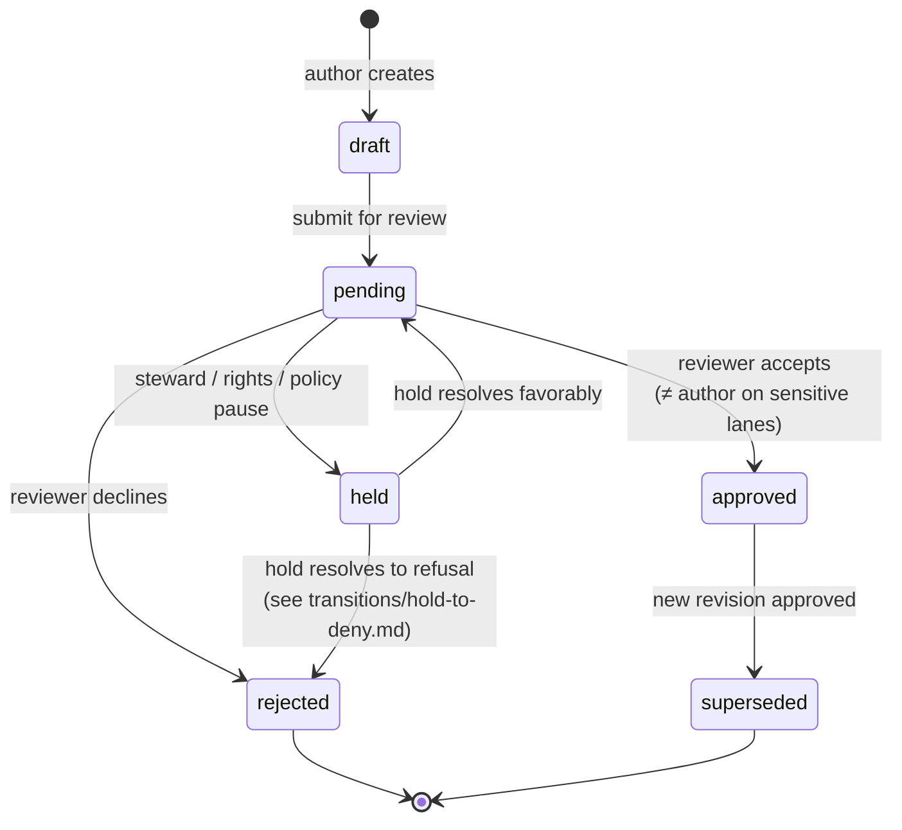

<!-- [KFM_META_BLOCK_V2]
doc_id: kfm://doc/focus-mode-state-review-state
title: Focus Mode — Review State and HOLD Semantics
type: standard
version: v0.1
status: draft
owners: <FOCUS-MODE-DOCTRINE-OWNER> · NEEDS VERIFICATION
created: 2026-05-24
updated: 2026-05-24
policy_label: public
related:
  - docs/focus-mode/state/README.md §9
  - docs/focus-mode/state/finite-outcomes.md §2 (HOLD outcome)
  - docs/focus-mode/state/lifecycle-states.md §3 (Gate F — review & sensitivity)
  - docs/focus-mode/state/transitions/candidate-to-hold.md
  - docs/focus-mode/state/transitions/hold-to-deny.md
  - schemas/contracts/v1/runtime/review_record.schema.json (PROPOSED)
  - schemas/contracts/v1/runtime/policy_decision.schema.json (PROPOSED)
tags: [kfm, focus-mode, state, review, hold, separation-of-duties, governance]
notes:
  - Path placement diverges from Directory Rules v1.2 §6.7.2; tracked as OPEN-DR-09.
  - HOLD currently exists as both an outcome (finite-outcomes.md) and a review state (this file); collision tracked in README §15.
[/KFM_META_BLOCK_V2] -->

# Focus Mode — Review State and HOLD Semantics

> *`ReviewRecord` lifecycle (`draft → pending → held / approved / rejected → superseded`), `HOLD` semantics, separation-of-duties enforcement for sensitive lanes, and the orthogonality between review state and lifecycle state.*

**Status:** draft · **Owners:** `<FOCUS-MODE-DOCTRINE-OWNER>` *(NEEDS VERIFICATION)* · **Last updated:** 2026-05-24

> [!IMPORTANT]
> **Review state is orthogonal to lifecycle state.** A `PROCESSED` artifact *(lifecycle)* may be `pending` *(review)*, `held` *(review)*, or `approved` *(review)* simultaneously. Review state gates **gate F** of the lifecycle promotion pipeline but does not replace it. *(CONFIRMED — Atlas v1.1 §24.3, §24.11; Doctrine Synthesis §11.)*

> [!CAUTION]
> **Path placement diverges from Directory Rules v1.2 §6.7.2** — see [README §2.1](./README.md#21-path-divergence-must-be-resolved). The doctrine here is CONFIRMED; the file's location is PROPOSED pending OPEN-DR-09.

---

## Contents

1. [Scope](#1-scope)
2. [The six review states](#2-the-six-review-states)
3. [Forward transitions and required artifacts](#3-forward-transitions-and-required-artifacts)
4. [HOLD semantics — review state vs outcome](#4-hold-semantics--review-state-vs-outcome)
5. [Separation of duties](#5-separation-of-duties)
6. [Sensitive-lane review rules](#6-sensitive-lane-review-rules)
7. [Review × lifecycle × outcome — the three-axis matrix](#7-review--lifecycle--outcome--the-three-axis-matrix)
8. [Review-state diagram](#8-review-state-diagram)
9. [Anti-patterns](#9-anti-patterns)
10. [Open questions](#10-open-questions)
11. [Cross-references](#11-cross-references)

---

## 1. Scope

This file defines **review state** — the lifecycle of a `ReviewRecord` that gates whether a candidate artifact is allowed to advance through gate F of the promotion pipeline *(see [`lifecycle-states.md` §3](./lifecycle-states.md#3-promotion-gates-ag))*.

Review state is **independent of lifecycle state**. A single artifact may carry:

- a lifecycle stage *(`RAW` / `WORK` / ... / `PUBLISHED`)*,
- a review state *(`draft` / `pending` / `held` / `approved` / `rejected` / `superseded`)*,
- and produce a finite outcome *(`ANSWER` / `ABSTAIN` / `DENY` / `ERROR` / `HOLD`)* on a public surface.

The three vocabularies interlock at well-defined points but never substitute for each other. See [§7](#7-review--lifecycle--outcome--the-three-axis-matrix) for the joint table.

[↑ Back to top](#top)

---

## 2. The six review states

> **CONFIRMED enum.** Renames or additions are ADR-class. *(directory-rules.md §2.4.)*

| State | Meaning | Carrier |
|---|---|---|
| `draft` | Authored; not yet submitted for review. | `ReviewRecord` *(state=draft)* |
| `pending` | Submitted; awaiting reviewer decision. | `ReviewRecord` *(state=pending)* |
| `held` | Paused by steward, rights-holder, or policy review. | `ReviewRecord` *(state=held)* + `PolicyDecision = HOLD` |
| `approved` | Reviewer accepted; release gate may now evaluate. | `ReviewRecord` *(state=approved)* + reviewer identity |
| `rejected` | Reviewer declined; artifact does not advance. | `ReviewRecord` *(state=rejected)* + reason |
| `superseded` | Later approved revision exists; this one no longer current. | `ReviewRecord` *(state=superseded)* + `supersession_chain` entry |

> [!NOTE]
> **Review state is per-artifact-version, not per-area.** A new revision of the same artifact creates a new `ReviewRecord` whose `state` starts at `draft`. The prior `ReviewRecord` moves to `superseded` only after the new one reaches `approved`.

[↑ Back to top](#top)

---

## 3. Forward transitions and required artifacts

| From | To | Trigger | Required artifact to record the transition |
|---|---|---|---|
| `draft` | `pending` | Author submits for review. | `ReviewRecord (pending)` with author identity, submission timestamp. |
| `pending` | `approved` | Reviewer (≠ author for sensitive lanes) accepts. | `ReviewRecord (approved)` + reviewer identity; on sensitive lanes, separation-of-duties check recorded. |
| `pending` | `rejected` | Reviewer declines. | `ReviewRecord (rejected)` + reason code. |
| `pending` | `held` | Reviewer pauses pending external input *(steward, rights holder, policy)*. | `ReviewRecord (held)` + `PolicyDecision (HOLD)` + hold reason from [`finite-outcomes.md` §4.4](./finite-outcomes.md#44-hold-reason-codes-proposed-enum). |
| `held` | `pending` | Hold reason resolves; review resumes. | `ReviewRecord (pending)` *(re-enter)* + hold-resolution note. |
| `held` | `rejected` | Hold resolves to refusal — see [`transitions/hold-to-deny.md`](./transitions/hold-to-deny.md). | `ReviewRecord (rejected)` + `PolicyDecision (DENY)` + reason. |
| `approved` | `superseded` | New revision reaches `approved`. | `supersession_chain` entry on the prior record; new `ReleaseManifest` *(if applicable)*. |
| `rejected` | *(terminal)* | — | Re-authoring creates a new `ReviewRecord` at `draft`. |
| `superseded` | *(terminal)* | — | Successor record carries forward. |

> [!IMPORTANT]
> **`approved` does NOT imply `PUBLISHED`.** Review approval satisfies gate F; gate G (release & rollback) still requires a `ReleaseManifest` with a rollback target. Conflating the two is the *review-as-release* anti-pattern. *(See [README §14](./README.md#14-anti-patterns).)*

[↑ Back to top](#top)

---

## 4. HOLD semantics — review state vs outcome

> **Open collision — tracked in [README §15](./README.md#15-open-questions-and-adr-triggers).** `HOLD` currently exists as both a **review state** *(this file)* and a **finite outcome** *(see [`finite-outcomes.md` §2](./finite-outcomes.md#2-the-seven-outcomes))*. The two senses interlock as follows:

| Sense | Carrier | What it gates |
|---|---|---|
| **Review-state `HOLD`** | `ReviewRecord (held)` | Whether the artifact can advance through gate F *(promotion)*. |
| **Outcome-state `HOLD`** | `DecisionEnvelope (outcome=HOLD)` | Whether a runtime request returns `ANSWER` / `ABSTAIN` / `DENY` *(decision)*. |

A runtime `DecisionEnvelope (outcome=HOLD)` typically appears when:

- The underlying `ReviewRecord` is in state `held`, **and**
- The requested surface depends on the held artifact being `approved` to render an `ANSWER`.

When that condition resolves, the next request may receive a different outcome — `ANSWER` if review resolves to `approved` *and* the released artifact remains fresh, or `DENY` / `ABSTAIN` otherwise.

> [!CAUTION]
> **`HOLD` preserves the prior surface state.** A `HOLD` envelope does **not** strip the previously-rendered claim. It signals "no change yet" — the prior `ANSWER` continues to render until the hold resolves to a new outcome. Silently rolling back the surface on `HOLD` is a doctrine violation. *(See [`finite-outcomes.md` §7](./finite-outcomes.md#7-composition-rules).)*

### 4.1 Hold reason codes *(restated from [`finite-outcomes.md` §4.4](./finite-outcomes.md#44-hold-reason-codes-proposed-enum))*

| Code | Used by review-state `HOLD`? | Used by outcome-state `HOLD`? |
|---|---|---|
| `steward_review_pending` | yes | yes |
| `rights_holder_review_pending` | yes | yes |
| `policy_review_pending` | yes | yes |
| `correction_pending` | yes | yes |
| `release_gate_pending` | no *(post-review)* | yes |

[↑ Back to top](#top)

---

## 5. Separation of duties

> **CONFIRMED doctrine.** Where maturity justifies it, the author of a Focus Mode artifact and the approver of its release **MUST** be different identities. Enforced at the `pending → approved` transition for sensitive-lane content. *(Atlas v1.1 §24; Doctrine Synthesis §11.)*

| Rule | Enforcement point | Validator |
|---|---|---|
| **Sensitive-lane author ≠ approver.** | `pending → approved` transition. | `validate_review_record.py` *(PROPOSED)* — emits `FAIL` if the same identity appears as both. |
| **Approver role check.** | `pending → approved` transition. | `validate_review_record.py` — approver MUST hold a role in the lane's approver allowlist. |
| **Reviewer attribution recorded.** | At every state transition. | `ReviewRecord` carries reviewer identity for every state change. |
| **Audit chain immutable.** | Post-transition. | `ReviewRecord` revisions are append-only; a rejected record is never overwritten. |

> [!IMPORTANT]
> **Sensitive lanes** for separation-of-duties purposes include: archaeology coordinates, rare-species exact locations, burial/sacred sites, living-person identifiers, DNA/genomic data, and critical-infrastructure exact details. *(See [`docs/focus-mode/README.md` §15](../README.md#15-sensitivity-defaults-fail-closed-lanes) for the full table at both county and state scales.)*

[↑ Back to top](#top)

---

## 6. Sensitive-lane review rules

| Lane | Required additional reviewer | Default approval threshold |
|---|---|---|
| Archaeology coordinates | Sovereignty reviewer + sensitivity steward | unanimous *(both required)* |
| Burial / sacred locations | Sovereignty reviewer + sensitivity steward | unanimous |
| Rare-species exact | Sensitivity steward + species steward *(if available)* | unanimous |
| Critical-infrastructure detail | Sensitivity steward + infra steward | unanimous |
| Living-person identifiers | Privacy steward | required |
| DNA / genomic | Privacy steward + CARE/FAIR reviewer | unanimous |

> [!NOTE]
> The lane-specific reviewer requirements are tracked per-area in `docs/focus-mode/<area>/<area>-county/public-safety-notes.md` *(or `kansas-state/public-safety-notes.md`)*. Cross-cutting defaults live here; per-area overrides require policy bundle entries in `policy/sensitivity/<area>/`.

[↑ Back to top](#top)

---

## 7. Review × lifecycle × outcome — the three-axis matrix

Joint table showing how the three vocabularies co-vary on a single artifact at a single moment.

| Lifecycle | Review | Outcome on public surface |
|---|---|---|
| `RAW` | `draft` *(implicit — no record yet)* | n/a *(never publicly served)* |
| `WORK` | `draft` | n/a |
| `WORK` | `pending` | n/a *(internal review, no public surface)* |
| `QUARANTINE` | any | n/a; held for resolution |
| `PROCESSED` | `pending` | `ABSTAIN (not_yet_released)` if queried |
| `PROCESSED` | `held` | `ABSTAIN (not_yet_released)` if queried; review-state `held` does not itself produce outcome-state `HOLD` *(no prior release to hold against)* |
| `CATALOG/TRIPLET` | `pending` | `ABSTAIN (not_yet_released)` if queried |
| `CATALOG/TRIPLET` | `approved` | `ABSTAIN (not_yet_released)` — review approval alone does not release |
| release candidate | `approved` | `ABSTAIN (not_yet_released)` until gate G issues `ReleaseManifest` |
| `PUBLISHED` | `approved` | `ANSWER` / `ABSTAIN` / `DENY` / `ERROR` based on runtime decision |
| `PUBLISHED` | `held` *(revision pending review)* | `HOLD` *(outcome)* — prior claim continues to render; new revision not yet authoritative |
| `PUBLISHED` | `superseded` | `ANSWER` redirects to successor; old version remains addressable |
| `PUBLISHED` | `rejected` *(rare — revision rejected)* | prior `PUBLISHED` continues until revoked/rolled back |

> [!IMPORTANT]
> **Read the table as "and", not "or".** Every row is a combination that can actually occur. The orthogonality is what lets the system audit each axis independently.

[↑ Back to top](#top)

---

## 8. Review-state diagram

[↑ Back to top](#top)

---

## 9. Anti-patterns

| Anti-pattern | Why it breaks doctrine | Mitigation |
|---|---|---|
| **Review = Release** — treating `approved` as `PUBLISHED`. | Skips gate G; release manifest, rollback target, correction path absent. | Lifecycle gate G is separate; `approved` enables release evaluation, not release itself. |
| **Author == Approver on sensitive lanes.** | Separation-of-duties violated; audit trail compromised. | `validate_review_record.py` *(PROPOSED)* emits `FAIL`. |
| **Held = silent rollback.** | UI strips prior claim on `HOLD`; users see flicker; audit loses prior state. | `HOLD` preserves prior surface state; new revision not authoritative until `approved` + released. |
| **Review record overwritten** — `rejected` flipped to `approved` in place. | Audit chain destroyed; bad decision becomes invisible. | `ReviewRecord` revisions append-only; new decision creates new record. |
| **Implicit `draft`** — artifact exists without a `ReviewRecord` entry. | Pre-submission state untracked; pipeline cannot enforce gate F. | Every artifact past `WORK` carries a `ReviewRecord`, even at `draft`. |
| **Sensitivity reviewer skipped** — lane requires sovereignty reviewer but only steward signs. | Sensitive-lane gate bypassed; sovereignty/privacy violation possible. | Per-lane reviewer requirements *(§6)* enforced at `pending → approved`. |

[↑ Back to top](#top)

---

## 10. Open questions

| ID | Question | Class |
|---|---|---|
| RV-Q1 | Should `HOLD` collapse into review-state only *(removing outcome-state `HOLD`)* or vice versa? | Vocabulary collision *(tracked in README §15)* |
| RV-Q2 | Is the approver allowlist per-lane *(in `public-safety-notes.md`)* or per-role *(in `policy/`)*? | Authority placement |
| RV-Q3 | Should `superseded` carry the successor `ReviewRecord` reference or only a `supersession_chain` entry? | Schema shape |
| RV-Q4 | Does a re-authored artifact after `rejected` start a new `ReviewRecord` or chain off the prior? | Audit chain |
| RV-Q5 | Multi-reviewer threshold — explicit unanimous vs N-of-M? | Approval semantics |

[↑ Back to top](#top)

---

## 11. Cross-references

- [`docs/focus-mode/state/README.md`](./README.md) §9 — review and release state overview.
- [`docs/focus-mode/state/finite-outcomes.md`](./finite-outcomes.md) §2, §4.4 — `HOLD` as a finite outcome, hold reason codes.
- [`docs/focus-mode/state/lifecycle-states.md`](./lifecycle-states.md) §3 — gate F (review & sensitivity).
- [`docs/focus-mode/state/transitions/candidate-to-hold.md`](./transitions/candidate-to-hold.md) — release-candidate → `held` transition.
- [`docs/focus-mode/state/transitions/hold-to-deny.md`](./transitions/hold-to-deny.md) — `held` → `rejected/DENY` transition.
- [`docs/focus-mode/README.md`](../README.md) §15 — sensitivity defaults at county and state scale.
- `schemas/contracts/v1/runtime/review_record.schema.json` *(PROPOSED)*.
- `schemas/contracts/v1/runtime/policy_decision.schema.json` *(PROPOSED)*.
- `tools/validators/validate_review_record.py` *(PROPOSED)*.

---

**Last updated:** 2026-05-24 · **Doc version:** v0.1 · **Doc status:** draft · **Path status:** PROPOSED *(OPEN-DR-09)*

[↑ Back to top](#top)
