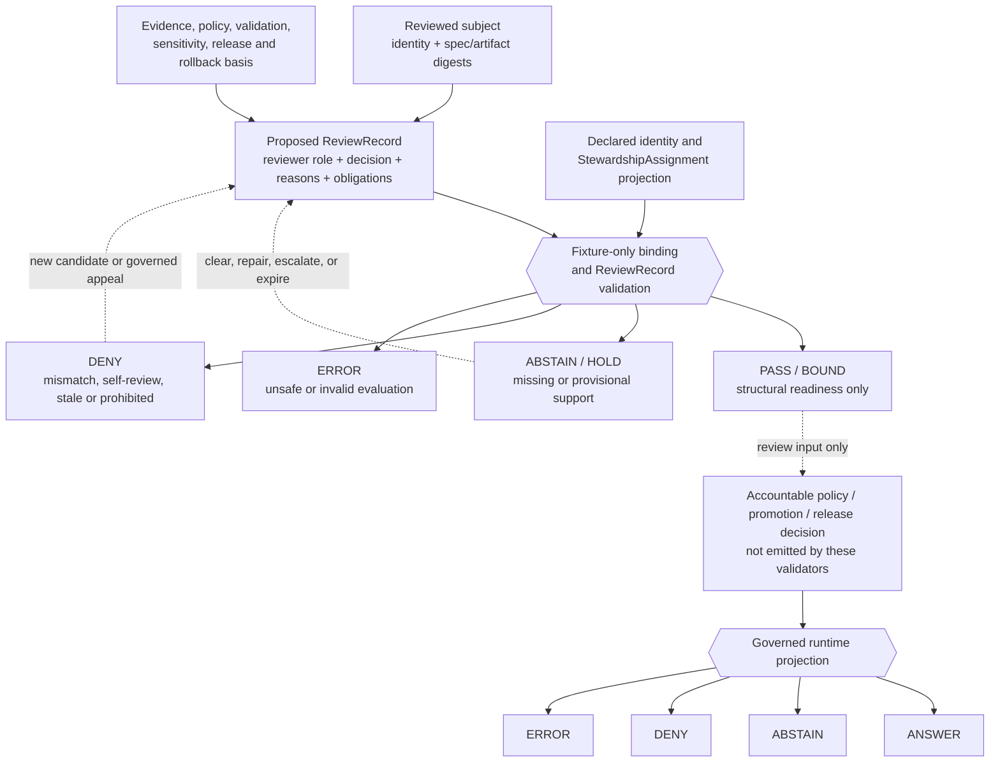

<!-- [KFM_META_BLOCK_V2]
doc_id: kfm://doc/focus-mode-state-review-state
title: Focus Mode Review-State Documentation Boundary
type: standard; review-state; governance-boundary; compatibility-document
version: v1.0
status: draft; repository-grounded; current-path; mixed-vocabulary; fixture-only-validation-present; non-authoritative; non-release; non-publication
owners:
  - "@bartytime4life — verified CODEOWNERS route only; accountable governance, policy, sensitivity, release, and independent review assignments remain separate and NEEDS VERIFICATION"
created: 2026-05-24
updated: 2026-08-22
policy_label: public; documentation; focus-mode; review; governance; hold; separation-of-duties; release-gated; cite-or-abstain; fail-closed
owning_root: docs/
responsibility: >-
  Explain and reconcile the review-related concepts currently visible around
  Focus Mode without redefining ReviewRecord semantics or shape, authenticating
  reviewers, evaluating policy, satisfying promotion gates, issuing release
  records, changing runtime outcomes, or publishing any artifact.
authority: >-
  Human-readable compatibility and maintenance guidance only. Review semantics
  belong to the accepted contract authority when one is adopted; machine shape,
  policy, reviewer authority, release review, proofs, workflow orchestration,
  and public runtime behavior remain in their own responsibility roots.
current_path: docs/focus-mode/state/review-state.md
canonical_relationship: >-
  Same-path documentation repair inside the repository-present Focus Mode state
  compatibility lane. Accepted Directory Rules v2 permits this docs-root update
  but does not settle the mixed state tree's final split or migration.
truth_posture: >-
  CONFIRMED current target and neighboring state-tree bytes, the parent state
  README, accepted ADR-0029 and Directory Rules v2, draft ReviewRecord semantic
  contract, strict proposed governance schema, conflicting permissive review
  schema scaffold, synthetic ReviewRecord fixtures and validator, fixture-only
  ReviewAuthorityBinding, read-only promotion workflows, CODEOWNERS routing, and
  the four current RuntimeResponseEnvelope outcomes ANSWER, ABSTAIN, DENY, ERROR /
  PROPOSED ReviewRecord disposition and lifecycle vocabularies, review-state
  transitions, HOLD record profile, steward roles, release-review outcomes, and
  future canonical migration / CONFLICTED legacy six-state lifecycle, multiple
  review disposition vocabularies, governance-versus-review schema homes,
  schema-to-contract filename casing, and legacy runtime-HOLD prose versus the
  current four-outcome runtime schema / UNKNOWN governed ReviewRecord producer,
  authenticated reviewer and stewardship registry, complete policy enforcement,
  accountable independent review, release-review instances, end-to-end promotion,
  correction propagation, rollback execution, deployment, and public parity /
  NEEDS VERIFICATION final review object authority, accepted state vocabulary,
  HOLD carrier, policy and release integration, platform enforcement, migration
  consumers, and all public-use effects.
evidence_snapshot:
  repository: bartytime4life/Kansas-Frontier-Matrix
  base_ref: main
  base_commit: ec58517b74a02f5ce7dda3f407769c31d1393bb7
  target_prior_blob: 0dd5a1089455f560975057c6b5e7ef9e5b1f333d
  parent_state_readme_blob: 34e2c6c90006937ea00d432689a36bf83fa5a898
  directory_rules_blob: fd49a0b83e55cef52c1124281f093e263526898d
  adr_0029_blob: a4de0d7a96b78da59cfc499d1025e1508afd8dd9
  review_record_contract_blob: 9641345d1e5d939dc59687a900e60a563d92c4f0
  governance_review_schema_blob: fe2f2223af46481e7fb19b0baa94f62ce9c6c855
  alternate_review_schema_blob: a053448d68e8379b92b12a16e6528275b975433c
  review_contract_boundary_blob: a9abbafbd15d611b8cc44fffe21ece63992d8607
  review_schema_boundary_blob: 0f22e32d50823767235f2e51fca453a8f2efaa21
  review_fixture_readme_blob: cf55ae8fbc0a79450fea85803eb8a4490e51aabe
  review_validator_blob: a26f10fa18edaf7b2d2e3bf499e233c05f3007cd
  review_authority_contract_blob: f156e100660e9fd97ca95e90092143a3cd6d62ee
  review_authority_schema_blob: 9407b357120537230aa4ef80a844ecf5149acc70
  promotion_gate_readme_blob: e729df0cc007e8cf0d9811afc25ec1f5ffbdffdd
  promotion_workflow_blob: 9b567aad17de2a7419a2a0238386745c1cb5c11c
  release_dry_run_workflow_blob: 8f76d1011b80769952a0a6561ed7e5cd963bf8c9
  release_reviews_readme_blob: bf3058a5af8fc85aa04a25a36ed03541cd9eb657
  review_proof_readme_blob: 071a507bf1f9e2ff3e94d4a3618341ea004898b3
  runtime_response_schema_blob: 8b86e7db8b18b65a56a4e639dfc54e1b2db93155
  codeowners_blob: dd2a84aa514d8ecd9208bc347f90f9a2ed37dd61
inspection_boundary: >-
  Current-session GitHub reads covered the complete prior review-state document,
  the current state-tree README and inventory, the newly tracked one-byte
  transitions/README.md placeholder, current ReviewRecord semantic and
  schema surfaces, review/release compatibility lanes, synthetic fixtures and
  validators, ReviewAuthorityBinding, promotion-gate documentation and workflows,
  release-review and review-proof guidance, separation-of-duties guidance,
  CODEOWNERS, and open branch/pull-request overlap. No mounted checkout, live
  reviewer registry, actor authentication, policy evaluation, governed
  ReviewRecord write, promotion decision, release review, release manifest,
  correction propagation, rollback drill, deployment, or public endpoint was
  exercised.
related:
  - ./README.md
  - ./finite-outcomes.md
  - ./lifecycle-states.md
  - ./transitions/candidate-to-hold.md
  - ./transitions/hold-to-deny.md
  - ../../doctrine/directory-rules.md
  - ../../adr/ADR-0029-adopt-directory-governance-standard-v2.md
  - ../../governance/SEPARATION_OF_DUTIES.md
  - ../../../contracts/governance/ReviewRecord.md
  - ../../../contracts/governance/review_authority_binding.md
  - ../../../contracts/review/README.md
  - ../../../schemas/contracts/v1/governance/review_record.schema.json
  - ../../../schemas/contracts/v1/governance/review_authority_binding.schema.json
  - ../../../schemas/contracts/v1/review/review_record.schema.json
  - ../../../fixtures/contracts/v1/governance/review_record/README.md
  - ../../../tools/validators/validate_review_record.py
  - ../../../tools/validators/promotion_gate/README.md
  - ../../../release/reviews/README.md
  - ../../../data/proofs/review/README.md
  - ../../../.github/workflows/promotion-gate.yml
  - ../../../.github/workflows/release-dry-run.yml
  - ../../../.github/CODEOWNERS
tags: [kfm, focus-mode, state, review, ReviewRecord, governance, hold, separation-of-duties, promotion-gate, release-review, compatibility, non-publication]
notes:
  - "v1.0 replaces stale May 2026 assertions with current repository evidence and preserves legacy section anchors for inbound-link compatibility."
  - "The six-state draft/pending/held/approved/rejected/superseded sequence is retained as LINEAGE, not a confirmed machine enum."
  - "HOLD is not a current RuntimeResponseEnvelope outcome. Current machine outcomes remain ANSWER, ABSTAIN, DENY, and ERROR."
  - "Fixture-only validation and binding prove declared synthetic relationships only; they do not authenticate reviewers or authorize promotion, release, or publication."
[/KFM_META_BLOCK_V2] -->

# Focus Mode Review-State Documentation Boundary

> **Purpose.** Explain how review-related concepts currently fit into KFM's
> evidence, policy, promotion, release, correction, and runtime boundaries
> without turning this Markdown file into a review contract, reviewer registry,
> policy engine, approval record, release decision, or public state machine.

> [!IMPORTANT]
> **Review is support for a governed decision, not the decision itself.**
> A `ReviewRecord` can document who reviewed what, under which role and basis,
> and with what disposition. It does not by itself admit evidence, evaluate
> policy, promote an artifact, issue a release, publish a claim, or prove that
> a platform account had authority.

> [!CAUTION]
> **The old six-state sequence is not a confirmed current machine enum.**
> The current strict governance schema has a `decision` field with
> `approve`, `reject`, and `request_changes`; it has no review-lifecycle
> `state` field. The broader lifecycle and disposition vocabularies in this
> document and nearby files remain draft lineage until contracts, schemas,
> policy, fixtures, validators, and migration decisions converge.

> [!WARNING]
> **`HOLD` is not a current client-facing runtime outcome.** The repository's
> current `RuntimeResponseEnvelope` machine shape permits `ANSWER`, `ABSTAIN`,
> `DENY`, and `ERROR`. A held review, provisional authority binding, workflow
> hold, or promotion pause must project through the governing four-outcome
> runtime contract rather than inventing a fifth response value.

**Quick navigation:** [Status](#1-current-status-and-evidence-boundary) ·
[Authority](#2-responsibility-and-authority-boundary) ·
[Surfaces](#3-current-review-surfaces) ·
[Vocabularies](#4-review-vocabularies-and-legacy-state-mapping) ·
[HOLD](#5-hold-semantics) ·
[Separation](#6-separation-of-duties-and-sensitive-review) ·
[Axes](#7-review-lifecycle-runtime-and-release-axes) ·
[Flow](#8-current-bounded-review-flow) ·
[Transitions](#9-transition-document-boundary) ·
[Validation](#10-validation-and-enforcement-evidence) ·
[Anti-patterns](#11-anti-patterns) ·
[Open work](#12-open-questions-and-decision-triggers) ·
[Maintenance](#13-maintenance-correction-and-rollback) ·
[References](#14-related-documents) · [Appendix](#15-appendix)

---

## 1. Current status and evidence boundary

| Question | Current repository-grounded answer | Truth label |
|---|---|---|
| Does this document exist at the requested path? | Yes. The prior v0.1 document is tracked at `docs/focus-mode/state/review-state.md`. | `CONFIRMED` |
| Is this path the semantic or machine authority for review? | No. It is a human-facing compatibility document under `docs/`. | `CONFIRMED` boundary |
| What is the current semantic ReviewRecord surface? | [`contracts/governance/ReviewRecord.md`](../../../contracts/governance/ReviewRecord.md), a draft semantic contract. | `CONFIRMED` path; contract remains draft |
| What is the current strict machine surface? | [`schemas/contracts/v1/governance/review_record.schema.json`](../../../schemas/contracts/v1/governance/review_record.schema.json), marked `PROPOSED`. | `CONFIRMED` shape and status |
| Is there a second review schema? | Yes. [`schemas/contracts/v1/review/review_record.schema.json`](../../../schemas/contracts/v1/review/review_record.schema.json) is a separate permissive scaffold. | `CONFIRMED`; `CONFLICTED` authority |
| Is executable ReviewRecord validation present? | Yes, but only for repository-owned synthetic promotion packets and schema fixtures. | `CONFIRMED` bounded implementation |
| Is there a governed ReviewRecord producer or live authority resolver? | No such end-to-end producer or resolver was established by the inspected evidence. | `UNKNOWN` / `NEEDS VERIFICATION` |
| Does CODEOWNERS prove accountable review? | No. It routes GitHub review to `@bartytime4life`; it is not a `ReviewRecord`, `StewardshipAssignment`, or release approval. | `CONFIRMED` boundary |
| Does this update change policy, runtime, promotion, or release state? | No. It changes documentation only. | `CONFIRMED` |
| Is the state tree's final placement settled? | No. Same-path maintenance is permitted; move, split, rename, mirror, or deletion remains `HOLD`. | `CONFIRMED` disposition |

### Truth labels

| Label | Meaning in this document |
|---|---|
| `CONFIRMED` | Verified from current repository bytes, current remote state, or bounded executable evidence inspected in this session. |
| `PROPOSED` | Design, vocabulary, role, field, path, or behavior not accepted or proven as current authority. |
| `CONFLICTED` | Two or more current surfaces make incompatible authority, shape, or vocabulary claims. |
| `LINEAGE` | Retained historical design material that may inform migration but does not control current behavior. |
| `UNKNOWN` | The available evidence does not establish the claim. |
| `NEEDS VERIFICATION` | A concrete repository, platform, policy, identity, review, release, or migration check remains. |
| `NOT_RUN` | The named executable or external check was not performed in this documentation slice. |
| `HOLD` | Proceeding would cross an unresolved authority, review, sensitivity, migration, or release boundary. |

Repository presence proves that bytes exist. A schema-valid or fixture-valid record
proves only the bounded shape or declared relationship that was checked. Neither
fact proves reviewer identity, authority, evidence sufficiency, policy permission,
promotion eligibility, release, deployment, or publication.

[Back to top](#top)

---

## 2. Responsibility and authority boundary

### This document owns

- orientation to the repository-present review-related surfaces;
- reconciliation of legacy review-state prose with current contracts, schemas,
  validators, workflows, and parent state guidance;
- explicit separation among review, evidence, policy, promotion, release,
  correction, runtime, and GitHub collaboration;
- compatibility anchors for inbound links to the v0.1 document;
- maintenance, correction, and rollback guidance for this Markdown file.

### This document does not own

| Responsibility | Current owning surface or decision class | Boundary |
|---|---|---|
| ReviewRecord meaning | [`contracts/governance/ReviewRecord.md`](../../../contracts/governance/ReviewRecord.md) | This document must not redefine the object contract. |
| ReviewRecord machine shape | Accepted schema home; currently conflicted between governance and review families | This document may report the conflict but cannot settle it. |
| Reviewer identity and authority | Governed actor/stewardship assignments and platform evidence | Names in prose or CODEOWNERS are not authenticated authority. |
| Evidence support | `EvidenceRef`, `EvidenceBundle`, citation, and proof owners | Review can cite evidence; it cannot replace evidence. |
| Policy outcomes | `policy/` and `PolicyDecision` owners | Review disposition is not a policy decision. |
| Promotion eligibility | Promotion contracts, policy, validators, and accountable decisions | A review pass can support a gate; it cannot promote. |
| Release review and release records | [`release/reviews/`](../../../release/reviews/README.md), release decisions, manifests, corrections, and rollback objects | Review is not release. |
| Review proof/support | [`data/proofs/review/`](../../../data/proofs/review/README.md) | Proof support is not the review event or approval. |
| Runtime outcome | `RuntimeResponseEnvelope` contract and schema | Review posture must not add an ad hoc runtime enum value. |
| GitHub collaboration | Pull-request reviews, CODEOWNERS, rulesets, and checks | Platform signals are evidence about repository process, not KFM review authority by themselves. |

### Directory Rules basis

Accepted Directory Rules v2 treats a path as an authority claim and assigns
artifacts by responsibility. This task keeps the existing human documentation
under `docs/` and changes no object-family authority.

| Proposed action | Outcome | Basis |
|---|---|---|
| Update this existing document in place | `PLACE` | Same `docs/` responsibility; no lifecycle or authority transfer |
| Treat `docs/focus-mode/state/` as final review authority | `DENY` | Documentation cannot become semantic, schema, policy, or release authority by drift |
| Move or split review documentation now | `HOLD` | Final targets, consumers, anchors, and rollback are unresolved |
| Create another writable review contract or schema home | `DENY` | Would deepen existing parallel-authority conflict |
| Reconcile the governance/review schema split later | `PROPOSED` / `HOLD` | Requires accepted authority and migration decision |

[Back to top](#top)

---

## 3. Current review surfaces

The repository currently contains several review-related surfaces with different
responsibilities and maturity. They must not be flattened into one “review
state” authority.

| Surface | Current role | Current evidence-backed posture |
|---|---|---|
| [`contracts/governance/ReviewRecord.md`](../../../contracts/governance/ReviewRecord.md) | Semantic meaning for an inspectable review event | Draft contract; field roster and disposition vocabulary remain proposed |
| [`contracts/governance/README.md`](../../../contracts/governance/README.md) | Governance contract-family boundary | Confirms governance owns the inspected ReviewRecord semantic surface |
| [`contracts/review/README.md`](../../../contracts/review/README.md) | Review-family compatibility pointer | Must not duplicate the governance ReviewRecord authority |
| [`schemas/contracts/v1/governance/review_record.schema.json`](../../../schemas/contracts/v1/governance/review_record.schema.json) | Strict proposed machine shape | Fielded, closed schema with three decisions; does not model the legacy six states |
| [`schemas/contracts/v1/review/review_record.schema.json`](../../../schemas/contracts/v1/review/review_record.schema.json) | Alternate proposed review schema | Empty permissive scaffold; authority conflict remains |
| [`fixtures/contracts/v1/governance/review_record/`](../../../fixtures/contracts/v1/governance/review_record/README.md) | Minimal valid/invalid schema examples | Fixture evidence only; one positive and one negative family documented |
| [`tools/validators/validate_review_record.py`](../../../tools/validators/validate_review_record.py) | Synthetic promotion-packet ReviewRecord validator | Implemented, deterministic, no-network, no-write, fixture-only |
| [`contracts/governance/review_authority_binding.md`](../../../contracts/governance/review_authority_binding.md) | Structural review/assignment/subject binding proposal | `PROPOSED_INACTIVE`, fixture-only, authority `NONE` |
| [`schemas/contracts/v1/governance/review_authority_binding.schema.json`](../../../schemas/contracts/v1/governance/review_authority_binding.schema.json) | Strict fixture-only binding shape | Outcomes `BOUND`, `HOLD`, `DENY`; none authorizes a write or release |
| [`tools/validators/promotion_gate/`](../../../tools/validators/promotion_gate/README.md) | Bounded A–G readiness checks | `PASS` means `APPROVE_READY` for accountable review only |
| [`release/reviews/`](../../../release/reviews/README.md) | Release-review guidance and future record lane | Guidance-only parent; no parent-level governed ReviewRecord established |
| [`data/proofs/review/`](../../../data/proofs/review/README.md) | Review-support proof lane | README-only at its recorded inventory; no review-proof payload family established |
| [Promotion workflow](../../../.github/workflows/promotion-gate.yml) | Read-only CI orchestration | Executes synthetic checks and retains explicit holds; emits no review or release record |
| [Release dry-run workflow](../../../.github/workflows/release-dry-run.yml) | Read-only synthetic publication-denial proof | Emits test summaries only; no release object or public effect |
| [CODEOWNERS](../../../.github/CODEOWNERS) | GitHub reviewer routing | Routes to `@bartytime4life`; not independent approval or semantic review evidence |

### Confirmed overlap and drift

| Conflict | Current evidence | Required posture |
|---|---|---|
| Governance vs review schema home | Both schema families contain a `review_record.schema.json`; only the governance version is fielded | Do not create or treat both as writable authority; migration decision required |
| Schema-to-contract casing | Governance schema metadata names lowercase `contracts/governance/review_record.md`; tracked contract is `ReviewRecord.md` | Preserve and report the case-sensitive conflict |
| Contract vs schema vocabulary | Semantic contract proposes seven dispositions; strict schema permits three decisions | Treat neither prose expansion nor schema narrowing as silently superseding the other |
| Legacy six-state lifecycle vs current schema | v0.1 described six states; strict schema has no state field | Six-state sequence is `LINEAGE` / `PROPOSED` |
| HOLD vs current runtime outcomes | Legacy docs used runtime `HOLD`; current runtime machine shape has four outcomes | Keep HOLD outside the runtime enum unless an accepted contract changes it |
| Release-review vocabulary | `release/reviews/README.md` defines guidance statuses and outcomes different from both ReviewRecord surfaces | Keep release-review guidance separate from ReviewRecord machine shape |

[Back to top](#top)

---

## 4. Review vocabularies and legacy state mapping

There is no single accepted review-state enum established by the inspected
repository evidence. The current vocabularies answer different questions.

### 4.1 Strict proposed governance schema

The fielded governance schema requires:

| Field | Current machine constraint |
|---|---|
| `review_id` | Canonical lowercase identifier pattern |
| `subject_ref` | String reference to reviewed subject |
| `reviewer_role` | `steward`, `reviewer`, or `auditor` |
| `decision` | `approve`, `reject`, or `request_changes` |
| `reasons` | Array of strings |
| `obligations` | Array of strings |
| `reviewed_at` | Date-time |
| Unknown fields | Rejected because `additionalProperties` is `false` |

The schema is marked `PROPOSED`. Shape compatibility does not prove reviewer
identity, authority, evidence basis, policy closure, independence, release
eligibility, or public effect.

### 4.2 Draft semantic contract dispositions

The draft semantic contract proposes a broader vocabulary:

| Proposed disposition | Intended semantic effect | Current machine support |
|---|---|---|
| `approve` | Scoped review acceptance; does not publish | Directly represented in strict schema |
| `approve_with_conditions` | Acceptance only after listed conditions close | Not represented as a strict-schema decision |
| `request_changes` | Blocks the next trust-bearing step pending repair | Directly represented |
| `abstain` | Reviewer lacks evidence, scope, authority, or context | Not represented in strict schema |
| `deny` | Reviewer finds the action unsafe or impermissible | Strict schema uses `reject`, not `deny` |
| `escalate` | Higher or alternate authority is required | Not represented in strict schema |
| `informational` | Records context without approval effect | Not represented in strict schema |

This table reports the draft contract. It does not select a migration mapping.

### 4.3 Legacy six-state sequence

The v0.1 document used
`draft → pending → held / approved / rejected → superseded`. That sequence is
retained as lineage for transition analysis, not as a confirmed current enum.

| Legacy state | Current bounded interpretation | Machine status |
|---|---|---|
| `draft` | Pre-submission process posture | No corresponding field in strict governance schema |
| `pending` | Awaiting review or missing required reviewer action | No corresponding field in strict governance schema |
| `held` | Fail-closed pause requiring explicit owner, reason, and resolution path | Not a strict-schema state; may appear in other fixture/workflow vocabularies |
| `approved` | Closest legacy term to `decision=approve`, but approval scope and obligations still matter | Partial semantic correspondence only |
| `rejected` | Closest legacy term to `decision=reject` | Partial semantic correspondence only |
| `superseded` | Prior review no longer current because a successor exists | Core strict schema has no supersession field; synthetic promotion wrapper declares a supersession marker |

> [!IMPORTANT]
> Do not serialize the legacy six-state sequence into a new schema, registry, or
> public API merely because it appears in this document. First resolve the
> semantic contract, machine schema, authority home, migration, fixtures,
> validator, and consumer compatibility.

### 4.4 Other bounded outcomes

| Vocabulary | Values | Scope |
|---|---|---|
| ReviewAuthorityBinding | `BOUND`, `HOLD`, `DENY` | Structural agreement over synthetic declared projections; no authentication or write authority |
| ReviewRecord fixture validator | `PASS`, `ABSTAIN`, `DENY`, `ERROR` | Validation/readiness result over synthetic promotion packets |
| Promotion gate | `PASS`, `ABSTAIN`, `DENY`, `ERROR` | Bounded A–G readiness, not lifecycle or runtime truth |
| Release-review guidance | `READY_FOR_DECISION`, `READY_FOR_MANIFEST`, hold/repair/supersession variants | Human release-review lane guidance |
| RuntimeResponseEnvelope | `ANSWER`, `ABSTAIN`, `DENY`, `ERROR` | Current client-facing runtime machine outcomes |

The repeated words `HOLD`, `DENY`, `ABSTAIN`, and `PASS` do not imply identical
carrier, semantics, authority, or effect.

[Back to top](#top)

---

## 5. HOLD semantics

### 5.1 Current bounded meaning

`HOLD` currently means a fail-closed pause or non-readiness posture outside the
client-facing runtime enum. Depending on the owning surface, it may describe:

- unresolved placement or migration;
- incomplete review or missing accountable reviewer;
- provisional or conditional review-authority binding;
- unresolved evidence, rights, policy, sensitivity, correction, or rollback;
- a workflow summary that proves the repository remains blocked;
- a promotion candidate that is not ready for an accountable decision.

It does not mean:

- approval;
- denial of the underlying claim;
- publication;
- automatic withdrawal of an existing release;
- a fifth `RuntimeResponseEnvelope.outcome`;
- permission to preserve stale or unsafe public content;
- permission to hide an unresolved decision without owner or reason.

### 5.2 Minimum hold record

Until an accepted object profile exists, any consequential hold should at least
make the following information inspectable. These are documentation
requirements, not invented schema fields.

| Required information | Why it matters |
|---|---|
| Exact held object or transition | Prevents area-wide or repository-wide ambiguity |
| Hold scope | Separates review, placement, evidence, policy, sensitivity, release, correction, and workflow concerns |
| Reason category and bounded explanation | Makes routing and later correction possible without exposing protected details |
| Decision owner or required reviewer role | Identifies who can resolve the hold |
| Basis references | Shows which evidence, policy, issue, record, or missing prerequisite supports the hold |
| Clearance conditions | States what must become true before reevaluation |
| Start time and review-by/expiry posture | Prevents indefinite, silently stale holds |
| Current public behavior | States whether the public surface must `ABSTAIN`, `DENY`, return `ERROR`, keep an independently valid prior release, or withdraw |
| Correction, supersession, and rollback implications | Prevents review pause from silently changing public state |
| Resolution reference | Links the later approval, request for changes, denial, escalation, correction, or supersession |

### 5.3 Runtime projection

When a request depends on held or unresolved support, the runtime must use the
current four-outcome contract:

| Condition | Bounded runtime projection |
|---|---|
| Support is incomplete, pending, stale, or not yet released | `ABSTAIN` |
| Policy, sensitivity, rights, role, or access prohibits delivery | `DENY` |
| Evaluation cannot complete safely or deterministically | `ERROR` |
| An independently valid, current, released prior artifact still supports the request | Evaluate that artifact normally; do not infer that HOLD automatically preserves it |
| The prior release is implicated by the same defect | Use the separate correction, withdrawal, revocation, or rollback process; do not hide behind HOLD |

The legacy rule that a HOLD always preserves the prior rendered answer is too
broad. The prior release may remain usable only when its own evidence, policy,
review, currentness, release, and correction posture remain valid.

### 5.4 Hold resolution

A hold can resolve into several distinct events:

- review continues after missing context arrives;
- conditions close and a scoped approving decision is recorded;
- changes are requested;
- the reviewer abstains or escalates;
- policy or sensitivity blocks the action;
- the candidate is rejected;
- an existing release is corrected, withdrawn, superseded, or rolled back;
- the hold expires and is reevaluated rather than silently renewed.

Each resolution needs its own accountable carrier. Do not overwrite the hold
history or retroactively change a rejected record into approval.

[Back to top](#top)

---

## 6. Separation of duties and sensitive review

### 6.1 Current posture

The KFM operating principle is that policy-significant release duties should be
separated when maturity and materiality justify it. The exact role matrix,
thresholds, and platform enforcement remain proposed or need verification.

| Surface | What is confirmed | What remains unproven |
|---|---|---|
| Separation-of-duties guidance | Authorship and approval are distinct acts; high-consequence work should not rely on unqualified self-review | Accepted role matrix, thresholds, and universal enforcement |
| Synthetic ReviewRecord validator | Detects declared self-review and checks declared reviewer identity/authority/time relationships in fixture packets | Live actor authentication, platform account binding, accepted reviewer qualification |
| ReviewAuthorityBinding | Structurally compares review, assignment, subject, role, timing, and separation declarations | Authentication, policy permission, write authority, promotion, or release |
| CODEOWNERS | Routes repository paths to `@bartytime4life` | Independent reviewer identity, completed review, or release authority |
| GitHub pull-request review | Platform collaboration evidence | KFM `ReviewRecord`, evidence closure, policy decision, or publication approval |
| Promotion workflow | Read-only synthetic validation with explicit holds | Governed reviewer registry, live release review, or required-check coupling |

### 6.2 When independent review is required by default

Independent accountable review should fail closed for material such as:

- rights, sovereignty, consent, or culturally restricted content;
- living-person data, DNA/genomic data, or reidentification risk;
- exact archaeology, burial, sacred-place, or rare-species locations;
- critical-infrastructure exact details or vulnerability-relevant analysis;
- policy-significant public exposure;
- public AI or generated-language surfaces that can influence consequential claims;
- release, correction, withdrawal, revocation, or rollback of public artifacts;
- trust-membrane, lifecycle, authority, or Directory Rules changes.

The exact reviewer role and threshold must come from accepted policy,
stewardship assignments, and release rules. This document does not invent
“unanimous” thresholds or claim that placeholder roles are staffed.

### 6.3 Fail-closed conditions

A trust-bearing action should remain blocked or narrowed when:

- reviewer identity cannot be authenticated;
- reviewer authority or scope cannot be resolved;
- author and reviewer are not distinct where independence is required;
- required partner reviewers are missing;
- evidence or policy basis references do not resolve;
- approving conditions or obligations remain open;
- the review is stale, expired, or superseded;
- subject, specification, or artifact hashes do not bind;
- correction and rollback requirements are absent for release-significant work.

The bounded validator currently maps some of these cases to `ABSTAIN`, `DENY`,
or `ERROR` over synthetic packets. That implementation does not settle the
accepted semantic vocabulary or create a real approval.

[Back to top](#top)

---

## 7. Review, lifecycle, runtime, and release axes

Review is not one axis but a set of related, independently governed dimensions.

| Axis | Example values | Carrier | Anti-collapse rule |
|---|---|---|---|
| Artifact lifecycle | `RAW`, `WORK/QUARANTINE`, `PROCESSED`, `CATALOG/TRIPLETS`, `PUBLISHED` | Governed lifecycle records and stores | Lifecycle location does not equal review or runtime outcome |
| Review event decision | `approve`, `reject`, `request_changes` in current strict schema | Proposed `ReviewRecord` | Decision does not equal promotion or release |
| Broader semantic disposition | approve-with-conditions, abstain, deny, escalate, informational | Draft semantic contract | Proposed terms do not silently extend machine shape |
| Reviewer authority binding | `BOUND`, `HOLD`, `DENY` | Fixture-only ReviewAuthorityBinding | Structural binding does not authenticate or authorize |
| Validator/readiness result | `PASS`, `ABSTAIN`, `DENY`, `ERROR` | Validator output | Test status is not public truth or release |
| Promotion decision | Accepted release/promotion object vocabulary | Promotion/release authority | `APPROVE_READY` is not `APPROVE` or `PUBLISHED` |
| Runtime outcome | `ANSWER`, `ABSTAIN`, `DENY`, `ERROR` | RuntimeResponseEnvelope | Review HOLD or validator PASS is not a runtime outcome |
| Release state | candidate, released, corrected, withdrawn, superseded, rolled back | Release manifests and accountability objects | GitHub state and review state do not publish |

### Example combinations

| Situation | Lifecycle | Review evidence | Readiness | Runtime projection | Release effect |
|---|---|---|---|---|---|
| Draft internal artifact | `WORK` | None or incomplete | Blocked | No public route; otherwise `ABSTAIN` | None |
| Processed candidate awaiting review | `PROCESSED` or `CATALOG/TRIPLETS` | Missing or pending | `ABSTAIN` / blocked | `ABSTAIN` if queried through a governed route | None |
| Synthetic packet passes ReviewRecord validator | Synthetic candidate | Declared approving review and authority interval | `PASS` / `APPROVE_READY` | No runtime effect | None |
| Review has open obligations | Candidate | Approving decision with unresolved obligations | `ABSTAIN` | `ABSTAIN` if support is required | None |
| Reviewer is author where independence is required | Candidate | Self-review finding | `DENY` | `DENY` or `ABSTAIN` according to policy; no answer | None |
| Released artifact remains independently valid while successor review is held | `PUBLISHED` prior + candidate successor | Prior review/release valid; successor unresolved | Successor blocked | Evaluate prior released artifact under current evidence/policy | No automatic change |
| Defect also implicates prior release | `PUBLISHED` | Review/correction defect | Blocked | `ABSTAIN`, `DENY`, or `ERROR` as governed | Separate correction/withdrawal/rollback required |

> [!IMPORTANT]
> Read every row as a combination of distinct carriers. Do not derive one axis
> from another without an explicit, validated mapping.

[Back to top](#top)

---

## 8. Current bounded review flow

The repository has enough fixture-only implementation to describe a bounded
readiness flow. It does not prove a live review service.

```mermaid
flowchart TD
    SUBJECT["Reviewed subject<br/>identity + spec/artifact digests"]
    BASIS["Evidence, policy, validation,<br/>sensitivity, release and rollback basis"]
    REVIEW["Proposed ReviewRecord<br/>reviewer role + decision + reasons + obligations"]
    AUTH["Declared identity and<br/>StewardshipAssignment projection"]
    BIND{{"Fixture-only binding<br/>and ReviewRecord validation"}}
    PASS["PASS / BOUND<br/>structural readiness only"]
    HOLD["ABSTAIN / HOLD<br/>missing or provisional support"]
    DENY["DENY<br/>mismatch, self-review, stale or prohibited"]
    ERROR["ERROR<br/>unsafe or invalid evaluation"]
    DECIDE["Accountable policy / promotion / release decision<br/>not emitted by these validators"]
    RUNTIME{{"Governed runtime projection"}}
    ANSWER["ANSWER"]
    ABSTAIN["ABSTAIN"]
    RUNTIME_DENY["DENY"]
    RUNTIME_ERROR["ERROR"]

    SUBJECT --> REVIEW
    BASIS --> REVIEW
    REVIEW --> BIND
    AUTH --> BIND
    BIND --> PASS
    BIND --> HOLD
    BIND --> DENY
    BIND --> ERROR
    PASS -. "review input only" .-> DECIDE
    HOLD -. "clear, repair, escalate, or expire" .-> REVIEW
    DENY -. "new candidate or governed appeal" .-> REVIEW
    DECIDE --> RUNTIME
    RUNTIME --> ANSWER
    RUNTIME --> ABSTAIN
    RUNTIME --> RUNTIME_DENY
    RUNTIME --> RUNTIME_ERROR
```

### Bounded current checks

The implemented synthetic validator checks, among other declared properties:

- strict ReviewRecord fields and canonical identifiers;
- an approving decision for the promotion fixture profile;
- empty approving-review obligations;
- author and reviewer identity separation;
- identity issuance no later than review;
- declared reviewer authority and effective intervals;
- review validity and supersession markers;
- review scope and subject agreement;
- specification and artifact digest binding;
- deterministic finite findings with no network and no writes.

A pass proves only that the synthetic declaration satisfied that validator
profile. It does not resolve a real `EvidenceBundle`, execute policy, authenticate
an actor, establish reviewer qualification, issue a `ReviewRecord`, mutate
lifecycle state, or authorize release.

[Back to top](#top)

---

## 9. Transition-document boundary

The tracked transition documents are useful lineage but currently contain stale
runtime-HOLD and ReviewRecord-state assumptions.

| Document | Useful retained concept | Current conflict | Disposition |
|---|---|---|---|
| [`candidate-to-hold.md`](./transitions/candidate-to-hold.md) | Promotion should pause with an explicit reason, owner, and auditable resolution | Assumes `ReviewRecord.state=held`, `PolicyDecision=HOLD`, and a runtime `HOLD` envelope | `LINEAGE` / `PROPOSED`; migrate after vocabulary decision |
| [`hold-to-deny.md`](./transitions/hold-to-deny.md) | Rejection should be append-only and should not silently revoke an unrelated prior release | Assumes a public runtime `HOLD → DENY` transition and fields not established in current machine shape | `LINEAGE` / `PROPOSED`; migrate after contract/policy review |
| [`published-to-revoked.md`](./transitions/published-to-revoked.md) | Public withdrawal requires its own governed transition | Exact manifest, policy, cache, and runtime behavior remain proposal-sensitive | `LINEAGE` / `PROPOSED` |
| [`rollback-to-prior.md`](./transitions/rollback-to-prior.md) | Public rollback is not merely a Git revert | End-to-end execution remains unverified | `LINEAGE` / `PROPOSED` |
| [`answer-to-abstain.md`](./transitions/answer-to-abstain.md) | A response should narrow when support no longer suffices | Must align to current four-outcome runtime contract and correction state | `LINEAGE` / `PROPOSED` |

### Transition migration requirements

Before treating any transition as current contract or implementation:

1. select the semantic authority and machine schema;
2. define accepted review and HOLD vocabularies;
3. reconcile policy, review, promotion, release, and runtime carriers;
4. preserve current four-outcome runtime compatibility or adopt a versioned change;
5. add deterministic positive, negative, stale, superseded, self-review, and
   unresolved-authority fixtures;
6. prove correction, withdrawal, cache, supersession, and rollback effects;
7. inventory all inbound links and consumers;
8. retain transparent migration and rollback records.

This README does not update those transition files because their reconciliation
is a separate dependency-closed semantic and machine change.

[Back to top](#top)

---

## 10. Validation and enforcement evidence

### Current implementation inventory

| Surface | Current bounded result | What it does not prove |
|---|---|---|
| Governance ReviewRecord schema | Strict proposed shape with seven required fields and closed additional properties | Accepted authority, review occurrence, or reviewer authenticity |
| Governance fixtures | One documented minimal valid and one required-field-invalid fixture family | Complete semantic coverage |
| Generic schema tests | Repository docs report local replay over governance schemas and fixtures | Current hosted exact-head execution in this task |
| ReviewRecord validator | Deterministic fixture-only promotion profile | Governed ReviewRecord producer, policy, or release |
| ReviewAuthorityBinding | Strict fixture-only binding with `BOUND/HOLD/DENY` | Authentication, write authority, promotion, or public use |
| Promotion-gate validator | Bounded A–G readiness matrix | Actual promotion or release |
| Promotion workflow | Read-only PR/push/dispatch orchestration with explicit holds | Required-check coupling or reviewer authority |
| Release dry run | Read-only synthetic publication-denial and rollback-card checks | Real candidate, manifest, release, or rollback execution |
| CODEOWNERS | Current path routing to one verified GitHub account | Independent approval or separation-of-duties completion |
| Release reviews lane | Guidance and sublane index | Governed parent review record or release decision |
| Review proof lane | Review-support boundary | Operational proof payload, producer, or public consumer |

### Validation expected for this documentation update

- one H1 and one complete `KFM_META_BLOCK_V2`;
- unique explicit anchors, including preserved v0.1 compatibility anchors;
- balanced fenced blocks and renderable Mermaid syntax;
- consistent tables and heading order;
- all same-document fragments resolve;
- all repository-relative links resolve at the pinned base;
- UTF-8, LF line endings, and final newline;
- no tabs, trailing whitespace, conflict markers, or unsupported badge claims;
- exact current runtime outcome boundary preserved;
- no claim that a contract, schema, fixture, validator, workflow, CODEOWNERS entry,
  commit, pull request, or green check creates review or release authority;
- generated authoring receipt with pending human review;
- exact remote byte, diff, branch, and pull-request read-back.

### What passing checks do not prove

A green Markdown, schema, fixture, validator, security, promotion, or release
dry-run check does not establish:

- source truth, rights, or sensitivity fitness;
- EvidenceRef-to-EvidenceBundle closure;
- authenticated reviewer identity or accepted role;
- policy permission;
- independent human review;
- promotion or release authority;
- correction propagation or rollback readiness;
- deployed runtime or public parity.

[Back to top](#top)

---

## 11. Anti-patterns

| Anti-pattern | Failure | Required posture |
|---|---|---|
| Six-state enum presented as current machine truth | Converts v0.1 lineage into a false contract | Mark as lineage until authority, schema, fixtures, and migration converge |
| HOLD added to RuntimeResponseEnvelope | Breaks the current four-outcome contract without versioned adoption | Project held support through `ABSTAIN`, `DENY`, or `ERROR` as governed |
| Review equals release | Skips promotion, manifest, correction, and rollback controls | Treat review as one input to a distinct release decision |
| CODEOWNERS equals ReviewRecord | Confuses GitHub routing with semantic review | Preserve platform evidence as bounded basis only |
| Validator PASS equals approval | Converts synthetic structural checks into authority | Report `APPROVE_READY` only within validator scope |
| BOUND equals authenticated | Treats declared binding as verified actor authority | Keep ReviewAuthorityBinding fixture-only and authority `NONE` |
| Self-review on high-consequence work | Defeats independent challenge | Fail closed until an accountable independent reviewer is bound |
| Open obligations treated as approval | Conditions remain unresolved | Abstain/block until obligations close and reevaluation is recorded |
| Held review silently keeps stale public content | Masks evidence, policy, or correction failure | Reevaluate prior release independently; correct or withdraw when implicated |
| Held review silently withdraws valid prior content | Collapses candidate review into public revocation | Require a separate correction/withdrawal/rollback decision |
| Review record overwritten | Erases rejected, stale, superseded, or conditional history | Append a successor and preserve lineage |
| Parallel review schemas both treated canonical | Creates incompatible writable shape authority | Hold promotion and resolve by accepted migration |
| Schema-valid equals reviewed | Shape validity is not a human or governed event | Require actual reviewer, authority, basis, and audit record |
| GitHub merge equals publication | Repository state is not KFM lifecycle state | Require governed release and public-state evidence |
| Sensitive details copied into a hold reason | Hold record becomes a leakage path | Use bounded reason categories and governed references |

[Back to top](#top)

---

## 12. Open questions and decision triggers

| Open item | Current status | Decision or evidence needed |
|---|---|---|
| Canonical ReviewRecord semantic home | Draft governance contract; review lane is compatibility-only | Accepted authority and migration decision |
| Canonical ReviewRecord schema home | `CONFLICTED` governance vs review paths | ADR or migration note, `$id` and `$ref` plan, consumer closure |
| Contract/schema vocabulary | `CONFLICTED` seven semantic dispositions vs three schema decisions | Versioned mapping or schema/contract reconciliation |
| Legacy six-state lifecycle | `LINEAGE` / `PROPOSED` | Decide whether a state machine is needed and where it belongs |
| HOLD carrier | `NEEDS VERIFICATION` | Accepted review/promotion carrier and current runtime projection |
| Reviewer/steward identity | `UNKNOWN` end-to-end | Governed actor registry, assignment lifecycle, authentication, scope |
| Independent-review thresholds | `PROPOSED` | Accepted policy and stewardship matrix by materiality/sensitivity |
| Release-review record profile | Guidance-only | Contract/schema/instance lane, producer, validator, retention, correction |
| Review-proof profile | README-only guidance | Accepted contract/schema, producer, validator, access and release linkage |
| Platform enforcement | `NEEDS VERIFICATION` | Rulesets, required reviews/checks, actor mapping, branch evidence |
| Transition-doc migration | `HOLD` | Contract/runtime decision plus backlink and anchor inventory |
| Correction and rollback | `UNKNOWN` operationally | Executable governed flow and public-state drill evidence |

### Changes requiring more than a Markdown edit

- adding or removing a runtime outcome;
- defining a canonical review-state enum;
- changing ReviewRecord semantic or machine authority;
- moving or deleting either review schema;
- changing reviewer-role or disposition vocabularies;
- authenticating a reviewer or stewardship assignment;
- changing separation-of-duties thresholds;
- creating review, promotion, or release records;
- changing public HOLD, correction, withdrawal, or rollback behavior;
- moving or splitting the mixed state documentation tree.

[Back to top](#top)

---

## 13. Maintenance, correction, and rollback

### Update this document when

- the ReviewRecord contract or schema changes;
- one review schema is migrated, deprecated, or removed;
- the casing conflict is resolved;
- the synthetic ReviewRecord validator changes scope or graduates;
- ReviewAuthorityBinding changes profile or authority;
- a governed reviewer/assignment registry becomes verifiable;
- promotion or release-review integration changes;
- HOLD gains an accepted carrier or runtime projection;
- transition documents are migrated;
- a real review record, correction, withdrawal, or rollback flow is exercised;
- the state tree's final ownership or placement changes.

### Documentation correction

A correction should:

1. pin the affected document version and repository commit;
2. identify the false, stale, or conflicted statement;
3. cite the newer contract, schema, policy, test, workflow, decision, or runtime evidence;
4. preserve compatibility anchors where feasible;
5. state which sibling documents and consumers also require correction;
6. avoid changing machine or policy authority through prose;
7. define a transparent revert or bounded forward-fix path.

### Rollback

Before merge, close or abandon the draft pull request and branch. Branch deletion
is a separate operation.

After merge, restore prior blob
`0dd5a1089455f560975057c6b5e7ef9e5b1f333d` through a transparent revert, or
apply a bounded forward correction against the actual merged bytes. Do not
rewrite shared history.

This documentation rollback would affect only the README and its generated
authoring receipt. It would not reverse policy, review, promotion, release,
deployment, or publication state because this change creates none.

[Back to top](#top)

---

## 14. Related documents

### State and placement boundaries

- [State documentation boundary](./README.md)
- [Finite-outcome lineage](./finite-outcomes.md)
- [Lifecycle-state lineage](./lifecycle-states.md)
- [Candidate-to-HOLD transition lineage](./transitions/candidate-to-hold.md)
- [HOLD-to-DENY transition lineage](./transitions/hold-to-deny.md)
- [Accepted Directory Rules v2 bytes](../../doctrine/directory-rules.md)
- [ADR-0029 — accepted Directory Rules adoption](../../adr/ADR-0029-adopt-directory-governance-standard-v2.md)

### Review meaning, shape, fixtures, and validation

- [`ReviewRecord` semantic contract](../../../contracts/governance/ReviewRecord.md)
- [Governance contract-family README](../../../contracts/governance/README.md)
- [Review compatibility contract boundary](../../../contracts/review/README.md)
- [Strict proposed governance ReviewRecord schema](../../../schemas/contracts/v1/governance/review_record.schema.json)
- [Alternate review schema scaffold](../../../schemas/contracts/v1/review/review_record.schema.json)
- [Review schema-family boundary](../../../schemas/contracts/v1/review/README.md)
- [ReviewRecord fixture family](../../../fixtures/contracts/v1/governance/review_record/README.md)
- [Fixture-only ReviewRecord validator](../../../tools/validators/validate_review_record.py)

### Authority binding, promotion, release, and proof

- [`ReviewAuthorityBinding` contract](../../../contracts/governance/review_authority_binding.md)
- [ReviewAuthorityBinding schema](../../../schemas/contracts/v1/governance/review_authority_binding.schema.json)
- [Promotion-gate validator boundary](../../../tools/validators/promotion_gate/README.md)
- [Release-review lane](../../../release/reviews/README.md)
- [Review-proof support lane](../../../data/proofs/review/README.md)
- [Promotion-gate workflow](../../../.github/workflows/promotion-gate.yml)
- [Release dry-run workflow](../../../.github/workflows/release-dry-run.yml)
- [Separation of Duties guidance](../../governance/SEPARATION_OF_DUTIES.md)
- [CODEOWNERS routing](../../../.github/CODEOWNERS)

[Back to top](#top)

---

## 15. Appendix

### 15.1 Compatibility anchors retained

The following v0.1 anchors remain available for inbound links:

- `#1-scope`
- `#2-the-six-review-states`
- `#3-forward-transitions-and-required-artifacts`
- `#4-hold-semantics--review-state-vs-outcome`
- `#5-separation-of-duties`
- `#6-sensitive-lane-review-rules`
- `#7-review--lifecycle--outcome--the-three-axis-matrix`
- `#8-review-state-diagram`
- `#9-anti-patterns`
- `#10-open-questions`
- `#11-cross-references`

### 15.2 Legacy-to-current reconciliation summary

| v0.1 claim | v1.0 disposition |
|---|---|
| Six review states are a confirmed enum | `NARROWED`: preserved as lineage, not current machine authority |
| HOLD is a runtime outcome | `CORRECTED`: current runtime machine outcomes are four values |
| Separation of duties is enforced | `NARROWED`: doctrine and synthetic checks exist; live/platform enforcement needs verification |
| `validate_review_record.py` is proposed | `UPDATED`: implemented for fixture-only promotion packets |
| Runtime review-record schema path is proposed | `CORRECTED`: current fielded schema is under governance, with a conflicting review scaffold |
| Path diverges from old Directory Rules v1.2 | `UPDATED`: ADR-0029 accepted Directory Rules v2; same-path docs repair is `PLACE`, structural migration remains `HOLD` |
| Held review always preserves prior answer | `CORRECTED`: prior release must remain independently valid or enter correction/withdrawal/rollback |
| Review approval satisfies publication | `REJECTED`: review, promotion, release, and publication remain separate |

### 15.3 Self-check

| Check | Expected result |
|---|---|
| One H1 | yes |
| One complete metadata block | yes |
| Current base and material blobs recorded | yes |
| Parent state README reconciled | yes |
| Review surfaces inventoried | yes |
| Schema and vocabulary conflicts explicit | yes |
| Four runtime outcomes preserved | yes |
| HOLD kept outside runtime enum | yes |
| Six-state lineage preserved without overclaim | yes |
| SoD doctrine separated from enforcement proof | yes |
| No contract, schema, policy, workflow, or structural mutation | yes |
| Correction and rollback visible | yes |
| Legacy anchors preserved | yes |
| Release/publication effect | none |

---

**Current document status:** repository-grounded draft · **Path posture:**
same-path `PLACE`; structural split or migration `HOLD` · **Current runtime
outcomes:** `ANSWER`, `ABSTAIN`, `DENY`, `ERROR` · **Review authority effect:**
none · **Release/publication effect:** none.

[Back to top](#top)
