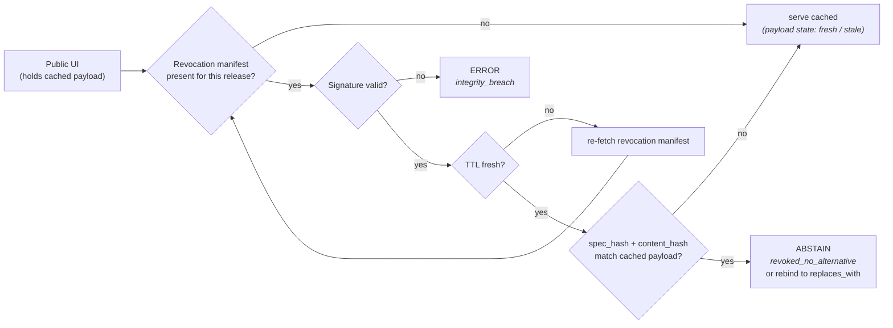

<!-- [KFM_META_BLOCK_V2]
doc_id: kfm://doc/focus-mode-state-revocation-state
title: Focus Mode — Revocation and Rollback State
type: standard
version: v0.1
status: draft
owners: <FOCUS-MODE-DOCTRINE-OWNER> · NEEDS VERIFICATION
created: 2026-05-24
updated: 2026-05-24
policy_label: public
related:
  - docs/focus-mode/state/README.md §11
  - docs/focus-mode/state/finite-outcomes.md §4.1 (revoked_no_alternative)
  - docs/focus-mode/state/payload-state.md
  - docs/focus-mode/state/transitions/published-to-revoked.md
  - docs/focus-mode/state/transitions/rollback-to-prior.md
  - schemas/contracts/v1/release/revocation_manifest.schema.json (PROPOSED)
  - schemas/contracts/v1/release/rollback_card.schema.json (PROPOSED)
tags: [kfm, focus-mode, state, revocation, rollback, ttl, spec-hash, KFM-P19-FEAT-0002]
notes:
  - Path placement diverges from Directory Rules v1.2 §6.7.2; tracked as OPEN-DR-09.
  - Revocation verifier KFM-P19-FEAT-0002 is PROPOSED; signed manifest + TTL + spec_hash binding are CONFIRMED doctrine pattern.
[/KFM_META_BLOCK_V2] -->

# Focus Mode — Revocation and Rollback State

> *Revocation manifest shape, TTL semantics, `spec_hash` binding, rollback-card contract, and the cached-but-revoked boundary that drives `revoked-but-cached` → `ABSTAIN`.*

**Status:** draft · **Owners:** `<FOCUS-MODE-DOCTRINE-OWNER>` *(NEEDS VERIFICATION)* · **Last updated:** 2026-05-24

> [!CAUTION]
> **Cached-but-revoked is a doctrine boundary.** If a Focus Mode UI holds a payload locally and the underlying evidence is revoked mid-session, the runtime MUST transition the answer to `ABSTAIN` with a revocation reason. Silently continuing to render the cached payload violates cite-or-abstain. *(KFM-P19-FEAT-0002, PROPOSED; CONFIRMED policy intent.)*

> [!IMPORTANT]
> **Path placement diverges from Directory Rules v1.2 §6.7.2** — see [README §2.1](./README.md#21-path-divergence-must-be-resolved). Doctrine CONFIRMED; file location PROPOSED pending OPEN-DR-09.

---

## Contents

1. [Scope](#1-scope)
2. [The four revocation/rollback states](#2-the-four-revocationrollback-states)
3. [Revocation manifest contract](#3-revocation-manifest-contract)
4. [TTL semantics](#4-ttl-semantics)
5. [`spec_hash` binding](#5-spec_hash-binding)
6. [Rollback card contract](#6-rollback-card-contract)
7. [Verifier pipeline](#7-verifier-pipeline)
8. [Cached-but-revoked enforcement](#8-cached-but-revoked-enforcement)
9. [Anti-patterns](#9-anti-patterns)
10. [Open questions](#10-open-questions)
11. [Cross-references](#11-cross-references)

---

## 1. Scope

This file defines **revocation and rollback state** — the lifecycle a `PUBLISHED` artifact follows when it is withdrawn *(revocation)* or replaced by a prior release *(rollback)*. Both transitions are first-class: they are not "delete" or "undo" operations but governed state changes with required receipts.

Revocation state is **distinct from**:

- **Lifecycle state** *(an artifact in `PUBLISHED` is the precondition for revocation; revocation does not move the artifact back to `PROCESSED`)*.
- **Review state** *(revocation can happen even on `approved` artifacts when post-release evidence emerges)*.
- **Payload state** *(payload state `revoked-but-cached` is the runtime manifestation of revocation in the UI)*.

[↑ Back to top](#top)

---

## 2. The four revocation/rollback states

| State | Meaning | Required artifact | Required check before serving |
|---|---|---|---|
| `live` | Artifact is the current released form. | Current `ReleaseManifest`. | Standard release-state check. |
| `revoked` | Issuer published a revocation; artifact MUST NOT serve. | Signed revocation manifest, TTL, `spec_hash` binding. | Revocation manifest signature + TTL freshness + `spec_hash` match + run-receipt attestations *(PROPOSED — KFM-P19-FEAT-0002)*. |
| `rolled-back` | A prior `ReleaseManifest` has been re-promoted as current. | `RollbackCard` + prior release-manifest reference. | Rollback receipt + supersession chain. |
| `superseded-by` | A newer release replaces this one; old version remains addressable. | `supersession_chain` entry; new `ReleaseManifest`. | Surface "superseded — see <new>" message; do not silently swap. |

> [!NOTE]
> **`revoked` and `rolled-back` are not the same.** Revocation withdraws an artifact entirely *(it cannot serve)*. Rollback re-promotes a prior release as current *(an earlier `PUBLISHED` is current again; the newer release becomes `rolled-back` or `superseded-by`)*.

[↑ Back to top](#top)

---

## 3. Revocation manifest contract

> **CONFIRMED pattern shape** *(Atlas v1.1 §20.3)*; **PROPOSED schema home** at `schemas/contracts/v1/release/revocation_manifest.schema.json`.

Required fields *(PROPOSED enum; ADR-class on any field removal)*:

| Field | Type | Purpose |
|---|---|---|
| `revocation_id` | UUID | Unique identifier; used by clients to dedupe. |
| `revoked_artifact_ref` | `ReleaseManifest` ref | Which release is being revoked. |
| `revoked_content_hash` | content hash | Hash of the artifact's content; clients verify they hold this exact form. |
| `spec_hash` | content hash | Spec under which the artifact was released *(see §5)*. |
| `issuer` | identity | Who issued the revocation *(role + signing identity)*. |
| `signature` | signed-blob | Detached signature over the manifest body. |
| `issued_at` | ISO-8601 | When the revocation was issued. |
| `ttl_seconds` | integer | How long clients MAY cache this manifest before re-fetching *(see §4)*. |
| `reason_code` | enum | Revocation reason *(see §3.1)*. |
| `replaces_with` | `ReleaseManifest` ref \| `null` | Optional pointer to a successor release. If `null`, no replacement exists. |
| `applies_to_scope` | area + time window | Which Focus Mode area + time window the revocation applies to. |
| `run_receipt_refs[]` | receipt refs | Attestations linking the revocation to its review/audit chain. |

### 3.1 Revocation reason codes *(PROPOSED enum)*

| Code | Meaning |
|---|---|
| `evidence_invalidated` | Post-release review found the evidence does not support the claim. |
| `rights_withdrawn` | Rights holder revoked the license to publish. |
| `sensitivity_escalation` | New sensitivity classification forbids further publication. |
| `legal_order` | Court order, takedown notice, regulatory action. |
| `integrity_breach` | Hash mismatch detected post-release *(tamper or pipeline bug)*. |
| `superseded_with_replacement` | Newer release available; see `replaces_with`. |
| `policy_change` | Policy bundle revision forbids previously-allowed publication. |

[↑ Back to top](#top)

---

## 4. TTL semantics

> **CONFIRMED pattern; PROPOSED default values.**

The revocation manifest carries a `ttl_seconds` field that controls how long clients may rely on a cached fetch before re-checking.

| TTL setting | Use case | Default |
|---|---|---|
| `ttl_seconds: 0` | "Hard revocation" — clients MUST re-check on every serve. | Used for legal-order or rights-withdrawn cases. |
| `ttl_seconds: 60` | Default — short-lived caching to absorb burst traffic. | **PROPOSED default** for most revocations. |
| `ttl_seconds: 300` | Lower-urgency revocations where bandwidth concerns dominate. | Used for `superseded_with_replacement` when the replacement is announced. |
| `ttl_seconds: > 300` | Discouraged — invites stale-revocation rendering. | Requires explicit reviewer sign-off. |

### 4.1 Client TTL rules

| Rule | Why |
|---|---|
| Client MUST re-fetch revocation manifest when TTL expires. | Prevents indefinite stale rendering. |
| Client MUST NOT serve the revoked artifact even if TTL has not expired *(the revocation is in effect immediately)*. | TTL is a re-fetch hint, not a grace period for serving. |
| Client MUST honor `Cache-Control: no-store` if attached. | Override for hard revocations. |
| Client MUST surface the revocation reason in the UI when the user requests the revoked artifact. | Audit transparency. |

> [!CAUTION]
> **TTL is for re-fetch cadence, not for grace-period serving.** A revocation with `ttl_seconds: 60` means "re-check at least every 60 seconds" — it does **not** mean "you may serve the revoked artifact for 60 more seconds". Once the revocation is fetched, the revoked artifact stops serving immediately.

[↑ Back to top](#top)

---

## 5. `spec_hash` binding

> **CONFIRMED pattern.** Every release carries a `spec_hash` *(hash of the layer/style/filter spec under which the layer renders)*. Revocations bind to a specific `spec_hash` so that:

| Binding case | Behavior |
|---|---|
| Revocation `spec_hash` == current release `spec_hash` | Revocation applies; artifact stops serving. |
| Revocation `spec_hash` == prior release `spec_hash` | Revocation applies to that prior release only; current release continues serving unless separately revoked. |
| Revocation `spec_hash` does not match any known release | Verifier emits `ERROR (integrity_breach)`; revocation is invalid; clients reject it. |

> [!NOTE]
> **`spec_hash` binding lets you revoke one release without nuking the family.** Without it, revoking "the hydrology layer" would be ambiguous across release versions. With it, the revocation says "the hydrology layer **as released under spec_hash X** is revoked" — a later corrected release under spec_hash Y is unaffected.

A `spec_hash` mismatch between the revocation manifest and any known release is itself a **doctrine violation** — either the revocation is forged, or the release record is corrupt. Either way, the verifier emits `ERROR` and refuses to apply the revocation.

[↑ Back to top](#top)

---

## 6. Rollback card contract

> **CONFIRMED pattern shape** *(directory-rules.md §6.7; Atlas v1.1 §20.3)*; **PROPOSED schema home** at `schemas/contracts/v1/release/rollback_card.schema.json`.

A `RollbackCard` is the receipt of a rollback transition. Required fields:

| Field | Type | Purpose |
|---|---|---|
| `rollback_id` | UUID | Unique identifier. |
| `rolled_back_release_ref` | `ReleaseManifest` ref | The release being rolled back. |
| `restored_release_ref` | `ReleaseManifest` ref | The prior release being re-promoted as current. |
| `reason_code` | enum | Why rollback was performed *(see §6.1)*. |
| `issuer` | identity | Who authorized the rollback. |
| `signature` | signed-blob | Detached signature. |
| `issued_at` | ISO-8601 | When rollback took effect. |
| `applies_to_scope` | area + time window | Where the rollback applies. |
| `correction_notice_ref` | `CorrectionNotice` ref \| `null` | Public-facing notice paired with the rollback *(usually required)*. |
| `supersession_chain` | array of release refs | Chronological chain showing prior releases. |

### 6.1 Rollback reason codes *(PROPOSED enum)*

| Code | Meaning |
|---|---|
| `evidence_invalidated_post_release` | New release retracted; prior release more accurate. |
| `regression` | New release broke a working behavior; revert. |
| `policy_revert` | Policy bundle change reverted; matching release reverted. |
| `correction_pending_rebuild` | Temporary rollback while a fix is built; expected to be re-rolled-forward later. |
| `emergency` | Urgent rollback for safety/legal reasons; correction notice required. |

> [!IMPORTANT]
> **A `RollbackCard` does NOT delete the rolled-back release.** The rolled-back release remains addressable for replay and audit; it simply is no longer the *current* release. Clients fetching the current release receive the restored prior release.

[↑ Back to top](#top)

---

## 7. Verifier pipeline

> **PROPOSED — KFM-P19-FEAT-0002 *(Focus Mode revocation verifier)*.**

| Verifier check | Tool | On failure |
|---|---|---|
| Manifest signature | `validate_revocation_manifest.py` *(PROPOSED)* | `ERROR (integrity_breach)` |
| TTL freshness | runtime check | re-fetch |
| `spec_hash` + `content_hash` match | runtime check | If mismatch: serve cached *(revocation does not apply to this payload)*. |
| `replaces_with` resolves to `PUBLISHED` | resolver | If `null` or unresolved: surface stays at `ABSTAIN`. If resolved: rebind and re-evaluate. |

[↑ Back to top](#top)

---

## 8. Cached-but-revoked enforcement

> **CONFIRMED doctrine boundary.** A cached payload that becomes revoked mid-session MUST transition the answer to `ABSTAIN (revoked_no_alternative)` *(or rebind to a `replaces_with` if available)*.

### 8.1 Enforcement points

| Surface | Check cadence | On revocation |
|---|---|---|
| Focus Mode runtime | Per-request | Re-resolve revocation manifest; if revoked, payload state moves to `revoked-but-cached` → `ABSTAIN`. |
| Evidence Drawer | Per-render | Same; drawer shows revocation reason in place of evidence. |
| Layer manifest resolver | Per-release-ref lookup | Revoked layer returns `DENY (release_state_deny)` with revocation reason. |
| Cached client *(offline mode)* | On reconnect | Verifier runs; revoked payloads stop rendering even though the client cached them. |

### 8.2 What the user sees

| State | UI surface |
|---|---|
| Cached payload, no revocation | Renders normally. |
| Cached payload, revocation arrived, `replaces_with` available | UI rebinds *(possibly with a "updated to latest release" badge)*. |
| Cached payload, revocation arrived, no replacement | UI strips the claim; shows "this evidence has been revoked: \<reason>"; the surface is at `ABSTAIN (revoked_no_alternative)`. |
| Revocation invalid *(signature/spec_hash failure)* | UI keeps cached rendering; verifier emits `ERROR` for the revocation channel; alert raised internally. |

> [!CAUTION]
> **Silent rendering of revoked evidence is the single most damaging anti-pattern in this state family.** The verifier exists to prevent it. Negative fixture `cached_revoked_served_as_answer.invalid.json` *(PROPOSED)* MUST be present.

[↑ Back to top](#top)

---

## 9. Anti-patterns

| Anti-pattern | Why it breaks doctrine | Mitigation |
|---|---|---|
| **Silent revoked render** — UI keeps rendering after revocation. | Serves denied content; cite-or-abstain collapsed. | KFM-P19-FEAT-0002 verifier; negative fixture required. |
| **Unsigned revocation accepted** — verifier skips signature check. | Anyone can forge a revocation; or no one can issue a real one. | Signature is required; bad signature → `ERROR`. |
| **TTL as grace period** — UI serves revoked artifact "until TTL expires". | Revocation does not have a grace period; immediate effect. | §4 rules. |
| **`spec_hash` ignored** — revocation applied to all releases of "the hydrology layer". | Over-broad revocation; collateral damage. | `spec_hash` binding; mismatch → revocation does not apply. |
| **Rollback deletes prior release** — rolled-back release no longer addressable. | Audit chain broken; replay impossible. | Prior release remains addressable; `supersession_chain` records the order. |
| **No `CorrectionNotice` on rollback** — rollback happens silently. | Users see content change without explanation. | `RollbackCard.correction_notice_ref` required for non-trivial rollbacks. |
| **Revocation channel down → fail-open** — when the verifier can't reach the revocation store, it serves anyway. | Stale-revoke rendering. | Fail-closed: if revocation channel is unreachable past TTL, surface degrades to `ABSTAIN (revoked_no_alternative)` or `ERROR (resolver_failure)`. |
| **Mixing revocation and rollback** — using `RollbackCard` to revoke or revocation manifest to rollback. | Two distinct semantics conflated. | Distinct contracts; distinct schemas; distinct verifier paths. |

[↑ Back to top](#top)

---

## 10. Open questions

| ID | Question | Class |
|---|---|---|
| RV-Q1 | Should revocation manifests be served from a single store *(one per Focus Mode area)* or fanned-out per release? | Storage layout |
| RV-Q2 | Is `ttl_seconds: 0` always allowed, or is there a minimum to absorb client-side jitter? | Tuning |
| RV-Q3 | Does a rollback automatically issue a revocation for the rolled-back release, or are they independent records? | Receipt linkage |
| RV-Q4 | Multi-signature revocations — should sensitive lanes require multiple issuer signatures? | Authority threshold |
| RV-Q5 | Should the revocation reason be a free-form blob or strictly enumerated? *(Current proposal: enum + optional free-form note.)* | Schema shape |
| RV-Q6 | How does the verifier behave under network partition — fail-closed by default, but is there ever a justified fail-open? | Resilience |

[↑ Back to top](#top)

---

## 11. Cross-references

- [`docs/focus-mode/state/README.md`](./README.md) §11 — revocation and rollback overview.
- [`docs/focus-mode/state/finite-outcomes.md`](./finite-outcomes.md) §4.1 — `revoked_no_alternative` `ABSTAIN` reason.
- [`docs/focus-mode/state/payload-state.md`](./payload-state.md) §2 — `revoked-but-cached` payload state.
- [`docs/focus-mode/state/transitions/published-to-revoked.md`](./transitions/published-to-revoked.md) — `PUBLISHED` → `revoked` transition.
- [`docs/focus-mode/state/transitions/rollback-to-prior.md`](./transitions/rollback-to-prior.md) — `PUBLISHED` → `rolled-back` transition.
- `schemas/contracts/v1/release/revocation_manifest.schema.json` *(PROPOSED)*.
- `schemas/contracts/v1/release/rollback_card.schema.json` *(PROPOSED)*.
- `tools/validators/validate_revocation_manifest.py` *(PROPOSED)*.
- KFM-P19-FEAT-0002 *(PROPOSED — Focus Mode revocation verifier)*.
- `KFM_Domains_v1_1_plus_Pass23_Pass32_Consolidated_Atlas.md` §20.3 — Correction/Rollback capability matrix.

---

**Last updated:** 2026-05-24 · **Doc version:** v0.1 · **Doc status:** draft · **Path status:** PROPOSED *(OPEN-DR-09)*

[↑ Back to top](#top)
