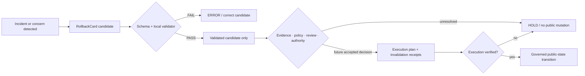
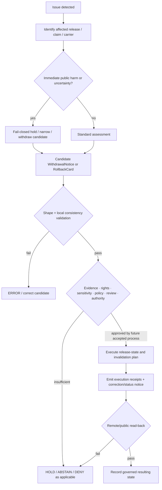

<!-- [KFM_META_BLOCK_V2]
doc_id: kfm://doc/focus-mode-state-revocation-state
title: Focus Mode — Revocation, Withdrawal, and Rollback State Boundary
type: standard; focus-mode; system-state; correction-and-release-boundary; compatibility-lane
version: v1.0
status: draft; repository-grounded; mixed-authority; compatibility-lane; candidate-only rollback; generic-revocation-contract-gap; non-executing; non-release; non-publication
owner: "@bartytime4life via CODEOWNERS; Focus Mode, release, withdrawal, correction, rollback, runtime, cache-invalidation, and independent approval authority NEEDS VERIFICATION"
created: 2026-05-24
updated: 2026-08-22
policy_label: public; documentation; focus-mode; revocation; withdrawal; rollback; correction; release-state; cache-invalidation; cite-or-abstain; fail-closed; no-silent-mutation
owning_root: docs/
responsibility: >-
  Explain the repository-present revocation, withdrawal, correction, and
  rollback design lineage; reconcile it with the current release contracts,
  schemas, fixtures, validators, runtime envelope, and release-root holds; and
  preserve a fail-closed public-use boundary without creating machine shape,
  policy, review, release, execution, deployment, or publication authority.
authority: >-
  Human-readable reconciliation and maintenance guidance only. Release-object
  meaning belongs under contracts/release/, machine shape under
  schemas/contracts/v1/release/, policy under policy/, decision records under
  release/, runtime behavior under accepted runtime interfaces, and execution
  receipts or proofs under their governed roots.
current_path: docs/focus-mode/state/revocation-state.md
canonical_relationship: >-
  Same-path documentation repair within the repository-present singular Focus
  compatibility lane. Accepted Directory Rules v2 permits this docs-root update
  but does not settle the mixed state tree's final split or migration. Moves,
  aliases, mirrors, or deletion remain HOLD pending accepted authority,
  consumer and anchor closure, validated migration, and rollback.
truth_posture: >-
  CONFIRMED current target and parent-state bytes, accepted ADR-0029 and
  Directory Rules v2, the canonical release/ decision root, the proposed
  fixture-first RollbackCard contract/schema/validator/fixtures, the thin
  proposed WithdrawalNotice contract/schema, the absent generic
  schemas/contracts/v1/release/revocation_manifest.schema.json path, the empty
  proposed release-state scaffold, and the four-outcome RuntimeResponseEnvelope
  schema / PROPOSED generic revocation-manifest fields, signatures, TTL
  protocol, revocation reason codes, cached-but-revoked vocabulary, client
  rebinding, invalidation execution, and runtime mapping / CONFLICTED prior
  statements that marked those proposals CONFIRMED and sibling transition
  documents that describe unimplemented execution as required behavior /
  UNKNOWN authenticated withdrawal or rollback authority, production release
  registry, signature custody, operational invalidation, public correction
  propagation, runtime cache behavior, deployment, and public parity / NEEDS
  VERIFICATION accepted object ownership, reason-code registry, policy profile,
  reviewer separation, execution receipts, current-state service, and every
  public-use transition.
evidence_snapshot:
  repository: bartytime4life/Kansas-Frontier-Matrix
  base_ref: main
  base_commit: ec58517b74a02f5ce7dda3f407769c31d1393bb7
  target_prior_blob: 89c032bb7e8e08dbfbf9b6c9e73f4ea97acdbcea
  parent_state_readme_blob: 34e2c6c90006937ea00d432689a36bf83fa5a898
  finite_outcomes_blob: 22df8e44b31cad5899339f665f205757d70ab47c
  payload_state_blob: 9556743d908b1a5c92579fb3adfb318e0037529c
  published_to_revoked_blob: 54280a501a9f4a937354345bf6f957e17d8cf47c
  rollback_to_prior_blob: f0e8327f3bfe65ad95a58a1a507e8323c3395d72
  release_root_readme_blob: 60b6a656f8f2b765616bba7223f51c25863c7172
  rollback_contract_blob: c6d3c35c56b064e04c3a2532f4709d938d7b0c1a
  rollback_schema_blob: e0a9edf02dd5d6997eda60a054a5bf19636c3dd4
  rollback_validator_blob: 9e9ed5a92851935b41a36698e4bead13ef4edf57
  rollback_valid_fixture_tree: 651daff61cf763c85d85ee8a0d20511497bf2f68
  rollback_invalid_fixture_tree: 93edb093fa3297c932ea48786fcd47124852d2fe
  rollback_tests_blob: c8aeac6348127fb768981e2b5b5588c6a7bdeb78
  withdrawal_contract_blob: 3cb27571de43e49d3a9f9c1bee0b347f6f3e7753
  withdrawal_schema_blob: 17f41df03a00f98bda7a08261506fab3bc56b231
  release_state_schema_blob: 2911be7873f0bf42a7cec073437b71f16748e5a3
  runtime_response_schema_blob: 8b86e7db8b18b65a56a4e639dfc54e1b2db93155
  directory_rules_blob: fd49a0b83e55cef52c1124281f093e263526898d
  adr_0029_blob: a4de0d7a96b78da59cfc499d1025e1508afd8dd9
  codeowners_blob: dd2a84aa514d8ecd9208bc347f90f9a2ed37dd61
inspection_boundary: >-
  Current-session GitHub reads covered the complete prior target in bounded
  ranges, the current state-tree inventory and parent README, both linked
  transition documents, the release root, current RollbackCard semantic
  contract, schema, validator, valid and invalid fixture inventories, focused
  validator tests, current
  WithdrawalNotice contract and schema, the release-state scaffold, the runtime
  response schema, Directory Rules adoption evidence, CODEOWNERS, and exact
  open-pull-request and task-branch overlap. The repository-native validators,
  policy engine, release operators, cache invalidators, evidence resolver,
  authenticated runtime, signing system, correction propagation, rollback
  execution, deployment, and public endpoint were not exercised. Main advanced
  from 8924c2c526cf to the pinned base only through an unrelated one-byte
  transitions/README.md addition; the target and governing blobs remained
  unchanged.
related:
  - ./README.md
  - ./finite-outcomes.md
  - ./payload-state.md
  - ./lifecycle-states.md
  - ./transitions/published-to-revoked.md
  - ./transitions/rollback-to-prior.md
  - ../../doctrine/directory-rules.md
  - ../../adr/ADR-0029-adopt-directory-governance-standard-v2.md
  - ../../../release/README.md
  - ../../../contracts/release/rollback_card.md
  - ../../../contracts/release/withdrawal_notice.md
  - ../../../schemas/contracts/v1/release/rollback_card.schema.json
  - ../../../schemas/contracts/v1/release/withdrawal_notice.schema.json
  - ../../../schemas/contracts/v1/release/release_state.schema.json
  - ../../../tools/validators/release/validate_rollback_card.py
  - ../../../tests/validators/test_validate_rollback_card.py
  - ../../../fixtures/release/rollback_card/
  - ../../../schemas/contracts/v1/runtime/runtime_response_envelope.schema.json
tags: [kfm, focus-mode, state, revocation, withdrawal, rollback, correction, release-state, cache-invalidation, runtime-envelope, compatibility, non-publication]
notes:
  - "v1.0 replaces stale no-repository-evidence and Directory Rules v1.2 assumptions with current repository evidence and accepted Directory Rules v2."
  - "The old signed generic revocation manifest, TTL defaults, spec-hash matching protocol, and client-verifier pipeline are retained as PROPOSED design lineage, not represented as implemented or accepted behavior."
  - "The current RollbackCard stack is fixture-first and deliberately non-executing; every governance flag remains false and release_ref remains null."
  - "No generic release RevocationManifest schema exists at the previously claimed path on the pinned base."
  - "This change does not modify contracts, schemas, policy, fixtures, validators, workflows, transition docs, release records, caches, aliases, published artifacts, or runtime behavior."
[/KFM_META_BLOCK_V2] -->

<a id="top"></a>
<a id="focus-mode--revocation-and-rollback-state"></a>

# Focus Mode — Revocation and Rollback State

> **Purpose.** Reconcile the state lane's revocation and rollback design with the
> release objects that actually exist in the repository, keep candidate shape
> separate from operational authority, and make post-release correction,
> withdrawal, cache invalidation, runtime response, and rollback limits
> inspectable.

> [!IMPORTANT]
> **This document cannot revoke or restore anything.** It does not issue a
> `WithdrawalNotice`, approve a `RollbackCard`, mutate a release alias, invalidate
> a cache, withdraw evidence, change a public API, or publish a correction. It
> describes boundaries and current implementation evidence only.

> [!CAUTION]
> **The old generic revocation protocol is not current machine authority.** The
> exact path `schemas/contracts/v1/release/revocation_manifest.schema.json` is
> absent at the pinned base. Signature fields, TTL defaults, `replaces_with`,
> revocation reason enums, and the cached-client verifier remain **PROPOSED**
> design lineage until accepted contracts, schemas, policy, fixtures, tests, and
> runtime evidence establish them.

> [!WARNING]
> **A schema-valid rollback candidate is not an executed rollback.** The current
> closed `RollbackCard` profile deliberately requires `authority_created`,
> `policy_evaluated`, `review_completed`, `rollback_executed`, and
> `public_state_mutated` to be `false`, with `release_ref: null`.

> [!NOTE]
> **The path remains a compatibility surface.** Accepted Directory Rules v2
> supports this same-path documentation repair under `docs/`; it does not select
> the final home or split for the mixed Focus state tree. Structural convergence
> remains **HOLD**.

**Quick navigation:** [Status](#1-status-and-evidence-boundary) ·
[Responsibilities](#2-responsibility-and-authority-boundary) ·
[Implementation map](#3-current-repository-implementation-map) ·
[Vocabulary](#4-state-and-object-family-separation) ·
[Revocation proposal](#5-generic-revocation-and-withdrawal-boundary) ·
[RollbackCard](#6-current-rollbackcard-candidate-contract) ·
[WithdrawalNotice](#7-current-withdrawalnotice-boundary) ·
[Runtime](#8-runtime-cache-and-finite-outcome-boundary) ·
[Identity and TTL](#9-identity-signature-ttl-and-invalidation-posture) ·
[Transition](#10-governed-transition-sequence) ·
[Validation](#11-validation-and-proof-boundary) ·
[Anti-patterns](#12-anti-patterns) ·
[Next slice](#13-smallest-safe-follow-up) ·
[Open questions](#14-open-questions-and-adr-triggers) ·
[Maintenance](#15-maintenance-correction-and-rollback) ·
[References](#16-cross-references)

---

<a id="1-scope"></a>

<a id="1-status-and-evidence-boundary"></a>

## 1. Status and evidence boundary

| Question | Current repository-grounded answer | Truth label |
|---|---|---|
| Does this target exist? | Yes. The prior v0.1 document is blob `89c032bb7e8e08dbfbf9b6c9e73f4ea97acdbcea`. | `CONFIRMED` |
| What owns the document? | `docs/` owns human-readable explanation. CODEOWNERS routes review to `@bartytime4life`; that route is not release or rollback approval. | `CONFIRMED` |
| Is the final state-tree placement settled? | No. Same-path repair is allowed; move, split, mirror, alias, or deletion remains `HOLD`. | `CONFIRMED` disposition |
| Does a generic release `RevocationManifest` schema exist at the path named by v0.1? | No. Direct current-base lookup returned no file at `schemas/contracts/v1/release/revocation_manifest.schema.json`. | `CONFIRMED` absence at pinned base |
| Does a generic withdrawal surface exist? | Yes. `WithdrawalNotice` has a semantic contract and a proposed thin schema requiring only `id`; `spec_hash` and `version` are optional and additional properties are allowed. | `CONFIRMED` current shape; operational maturity `UNKNOWN` |
| Does a generic rollback surface exist? | Yes. `RollbackCard` has a proposed closed 1.0.0 schema, candidate-only validator, three valid fixture candidates, invalid fixtures, and focused tests named by the contract. | `CONFIRMED` repository presence; authority remains `PROPOSED` |
| Can the current rollback stack execute public rollback? | No evidence supports that. The candidate schema requires all execution and authority flags to remain false. The release root records rollback execution as held. | `CONFIRMED` non-execution boundary |
| Is there a machine release-state enum for `live`, `revoked`, `rolled-back`, and `superseded-by`? | No. The current generic release-state schema is an empty proposed scaffold with no fields or enum. | `CONFIRMED` |
| What runtime outcomes are machine-enumerated? | `ANSWER`, `ABSTAIN`, `DENY`, and `ERROR` in the proposed `RuntimeResponseEnvelope` schema. | `CONFIRMED` machine shape |
| Are `revoked-but-cached` and `revoked_no_alternative` current machine enums? | No current schema inspected here enumerates either value. They remain state-document design lineage and possible future reason vocabulary. | `CONFIRMED` gap |
| Was any revocation, withdrawal, correction, cache invalidation, rollback, release, or public mutation performed by this update? | No. | `CONFIRMED` |

### Truth labels used here

| Label | Meaning |
|---|---|
| `CONFIRMED` | Verified from current-session repository bytes or remote state. |
| `PROPOSED` | Design, field, enum, path, policy, or behavior not accepted or proven operational. |
| `CONFLICTED` | Current documents or surfaces make incompatible claims. |
| `LINEAGE` | Retained earlier design useful for migration or comparison, but not current authority. |
| `UNKNOWN` | Evidence does not establish the claim. |
| `NEEDS VERIFICATION` | A concrete contract, policy, review, reference-resolution, execution, or runtime check remains. |
| `HOLD` | The next transition would cross an unresolved authority, safety, placement, or release boundary. |
| `NOT_RUN` | The named executable or external check was not performed in this documentation slice. |

Repository presence proves that bytes exist. A contract, schema, validator, fixture,
workflow, pull request, merge, or signature-shaped field does not by itself prove
policy approval, actor authority, reference resolution, execution, release, or
publication.

[Back to top](#top)

---

<a id="2-responsibility-and-authority-boundary"></a>

## 2. Responsibility and authority boundary

### This document owns

- reconciliation of the prior revocation and rollback prose against current
  repository evidence;
- separation of revocation, withdrawal, correction, supersession, rollback,
  runtime outcome, release state, and cache state;
- a current navigation map to semantic contracts, schemas, validators, fixtures,
  release records, and state-transition lineage;
- explicit status of old signatures, TTLs, `spec_hash` behavior, reason codes,
  and client-verifier claims;
- bounded validation and maintenance guidance; and
- compatibility anchors for references into v0.1.

### This document does not own

- release-object semantic meaning;
- machine schemas or controlled vocabularies;
- evidence, policy, rights, sensitivity, or review decisions;
- release manifests, withdrawal notices, correction notices, rollback cards, or
  execution receipts as emitted records;
- signing keys, signature verification, actor authentication, or separation of
  duties;
- cache, CDN, tile, catalog, triplet, search, vector, or AI-cache invalidation;
- current-release alias mutation;
- governed API, UI, MapLibre, model-runtime, or offline-client behavior;
- public correction, withdrawal, rollback, release, deployment, or publication;
  or
- acceptance of sibling transition documents as executable contracts.

### Responsibility-root map

| Responsibility | Current owner/root | Relationship to this document |
|---|---|---|
| Human explanation | `docs/` | This document. |
| Semantic release meaning | `contracts/release/` | Referenced; never redefined here. |
| Machine release shape | `schemas/contracts/v1/release/` | Referenced; shape authority remains separate. |
| Runtime response shape | `contracts/runtime/` and `schemas/contracts/v1/runtime/` | Determines current finite envelope fields, not this prose. |
| Policy and sensitivity | `policy/` | Determines admissibility and deny/abstain posture where active. |
| Release decisions | `release/` | Canonical append-only decision plane; records, not payloads. |
| Published carriers | `data/published/` | Public-safe outputs only after governed release. |
| Receipts and proofs | governed receipt/proof roots | Evidence of execution; not replaced by a state document. |
| Validators and operators | `tools/validators/`, `tools/release/` | Bounded checks or future operations outside docs. |
| Fixtures and tests | `fixtures/`, `tests/` | Deterministic proof of declared behavior, not operational authority. |

> [!IMPORTANT]
> A release-state document may explain how objects relate. It must not become a
> parallel contract, schema, policy registry, release ledger, or operator.

[Back to top](#top)

---

<a id="3-current-repository-implementation-map"></a>

## 3. Current repository implementation map

| Surface | Pinned current evidence | Current bounded conclusion |
|---|---|---|
| [`release/README.md`](../../../release/README.md) | Canonical append-only release decision root; mixed maturity; operational release, candidate assembly, promotion execution, and rollback execution held. | Release decisions have a governed root, but production execution is unproven. |
| [`contracts/release/rollback_card.md`](../../../contracts/release/rollback_card.md) | Proposed semantic contract synchronized with the closed 1.0.0 candidate schema and validator. | Defines candidate meaning; does not authorize or execute rollback. |
| [`rollback_card.schema.json`](../../../schemas/contracts/v1/release/rollback_card.schema.json) | Closed object with finite dispositions, triggers, target modes, invalidation classes, timing, lineage, and all-false governance flags. | Strong candidate shape and local-boundary evidence. |
| [`validate_rollback_card.py`](../../../tools/validators/release/validate_rollback_card.py) | No-network parser, schema validation, and local semantic checks. | Passing proves bounded candidate shape and local consistency only. |
| [`fixtures/release/rollback_card/`](../../../fixtures/release/rollback_card/) | Three valid candidates: hold, prior-release candidate, and withdrawal candidate; invalid lane also exists. | Deterministic fixture proof exists; no live release is touched. |
| [`contracts/release/withdrawal_notice.md`](../../../contracts/release/withdrawal_notice.md) | Detailed proposed semantics paired to a thin schema. | Useful withdrawal meaning, but field completeness and execution remain unresolved. |
| [`withdrawal_notice.schema.json`](../../../schemas/contracts/v1/release/withdrawal_notice.schema.json) | Requires only `id`; optional string `spec_hash` and `version`; `additionalProperties: true`. | Schema validation alone cannot establish a complete withdrawal. |
| `revocation_manifest.schema.json` | Exact generic release path absent. | Prior generic manifest table is design lineage, not current schema. |
| [`release_state.schema.json`](../../../schemas/contracts/v1/release/release_state.schema.json) | Empty proposed scaffold; no properties or enum. | No current generic machine state vocabulary is established. |
| [`RuntimeResponseEnvelope` schema](../../../schemas/contracts/v1/runtime/runtime_response_envelope.schema.json) | Four outcomes; free-form string fields for `reason_code`, `policy_state`, `freshness`, and `correction_state`. | Runtime can carry correction context, but inspected shape does not define revocation semantics or reason enums. |
| [`published-to-revoked.md`](./transitions/published-to-revoked.md) | Draft prose asserting a signed manifest, TTL, `spec_hash`, cache behavior, and runtime transitions. | `LINEAGE`; execution and field claims exceed current generic schema evidence. |
| [`rollback-to-prior.md`](./transitions/rollback-to-prior.md) | Draft prose asserting signed cards, live release mutation, rebinding, and supersession updates. | `LINEAGE`; current RollbackCard profile is non-executing. |

### Current maturity summary

| Capability | Current state |
|---|---:|
| Human revocation/rollback design vocabulary | `CONFIRMED` repository presence |
| Generic release revocation schema | `ABSENT` at claimed path |
| Generic withdrawal semantics | `PROPOSED` contract |
| Generic withdrawal machine shape | `PROPOSED` thin/permissive |
| Rollback candidate semantics | `PROPOSED` and schema-paired |
| Rollback candidate validation | `CONFIRMED` bounded implementation |
| Rollback fixture families | `CONFIRMED` |
| Authenticated authority and signatures | `UNKNOWN` |
| Reference resolution and policy execution | `UNKNOWN` / `NOT_RUN` |
| Cache/alias/public-state mutation | `HOLD` / not established |
| Operational revocation or rollback | `HOLD` |
| Public parity | `UNKNOWN` |

[Back to top](#top)

---

<a id="2-the-four-revocationrollback-states"></a>

<a id="4-state-and-object-family-separation"></a>

## 4. State and object-family separation

The v0.1 document used `live`, `revoked`, `rolled-back`, and `superseded-by` as
four revocation/rollback states. They remain useful design words, but the current
generic `release_state.schema.json` does not enumerate them.

| Concept | Correct bounded class today | Current authority |
|---|---|---|
| current/live release | Release registry or manifest relationship | Semantics present elsewhere; operational registry `UNKNOWN` |
| revoked/withdrawn | Post-release reliance or serving posture | `WithdrawalNotice` semantics `PROPOSED`; exact revocation object unresolved |
| rollback candidate | Candidate recovery decision object | `RollbackCard` schema/validator/fixtures `CONFIRMED`; authority `PROPOSED` |
| rolled back | Executed public-state transition | `UNKNOWN`; not represented by a completed execution record inspected here |
| superseded | Correction/release lineage relationship | Principle present; exact generic machine contract `NEEDS VERIFICATION` |
| correction | Public trust and lineage change | Separate correction object family; not this document |
| runtime outcome | `ANSWER`, `ABSTAIN`, `DENY`, `ERROR` | Current proposed runtime schema |
| payload freshness/correction | `freshness` and `correction_state` strings in runtime envelope; sibling payload vocabulary | Shape present, controlled revocation vocabulary absent |
| validator result | `PASS` or `FAIL` | Check outcome only |
| workflow or placement posture | `HOLD` | Not a current runtime outcome |

### Why the separation matters

One incident may involve all of these dimensions:

```text
affected release:          release:v4
withdrawal posture:        proposed / awaiting authority
rollback card disposition: ROLLBACK_CANDIDATE
target mode:               PRIOR_RELEASE
candidate validation:      PASS
policy evaluation:         not executed
review completion:         false
public state mutation:     false
runtime outcome:           ABSTAIN, DENY, or ERROR under a later accepted mapping
```

A green candidate validator must never be rewritten as “rollback succeeded.”
A runtime `ABSTAIN` must never be rewritten as “release was revoked.” A
withdrawal notice must never imply cache invalidation completed.

[Back to top](#top)

---

<a id="3-revocation-manifest-contract"></a>

<a id="5-generic-revocation-and-withdrawal-boundary"></a>

## 5. Generic revocation and withdrawal boundary

### What is confirmed

KFM's governing posture requires post-release problems to be explicit,
auditable, correction-aware, and reversible. A harmful or unsupported released
form must not be silently retained, silently edited, or silently deleted.
Affected public surfaces require a governed withdrawal, correction,
supersession, rollback, or denial path appropriate to the incident.

### What remains proposed

The v0.1 generic revocation manifest described:

- a revocation identifier;
- affected release and content hashes;
- a `spec_hash`;
- an issuer and detached signature;
- issue time and TTL;
- a reason code;
- optional replacement;
- scope; and
- receipt references.

No current generic release schema establishes that field set. The exact schema
path named by v0.1 is absent. The table below preserves the design without
misstating its status.

| v0.1 proposed field family | Current repository support | Disposition |
|---|---|---|
| stable revocation identity | `WithdrawalNotice.id` exists; mature identifier semantics are proposed | `PROPOSED` |
| affected release/artifact reference | Detailed in WithdrawalNotice semantics, not required by its current schema | `PROPOSED` |
| content hash and revocation `spec_hash` | Withdrawal schema permits optional string `spec_hash`; RollbackCard requires a SHA-256 candidate hash | `CONFLICTED semantics`; do not conflate |
| issuer and signature | Not fields in the current generic WithdrawalNotice or RollbackCard schemas | `PROPOSED` |
| issued/effective times | Detailed by WithdrawalNotice semantics; RollbackCard has candidate timing fields | Partial candidate support |
| TTL and cache headers | No current generic release schema inspected here defines them | `PROPOSED` |
| reason code | Withdrawal semantics propose reasons; RollbackCard has a finite trigger enum | Object-specific; no generic revocation enum |
| replacement/successor | Withdrawal semantics propose successor/rollback references; RollbackCard target/restoration fields exist | Candidate support only |
| scope | Withdrawal semantics propose affected-object scope; RollbackCard binds affected release and target | Candidate support only |
| execution receipts | Release doctrine requires auditable records; no generic revocation execution receipt was verified | `NEEDS VERIFICATION` |

<a id="31-revocation-reason-codes-proposed-enum"></a>

### Prior reason-code lineage

The old lowercase reasons remain **PROPOSED lineage**, not a current generic
machine enum:

- `evidence_invalidated`;
- `rights_withdrawn`;
- `sensitivity_escalation`;
- `legal_order`;
- `integrity_breach`;
- `superseded_with_replacement`;
- `policy_change`.

The current RollbackCard trigger enum instead uses uppercase candidate reasons,
including `RELEASE_DEFECT`, `EVIDENCE_CONTRADICTION`, `RIGHTS_CHANGE`,
`SENSITIVITY_DISCOVERY`, `VALIDATION_FAILURE`, `SOURCE_WITHDRAWAL`,
`POLICY_FAILURE`, `SECURITY_ISSUE`, `OPERATIONAL_FAILURE`, `EMERGENCY_HOLD`,
`INSUFFICIENT_EVIDENCE`, and `INPUT_INVALID`.

Do not map one vocabulary to the other by guesswork. A shared reason registry or
explicit adapter requires accepted ownership, versioning, tests, and migration
guidance.

### Safe withdrawal invariants

Even before a mature generic schema exists, a future implementation should
preserve these governance invariants:

1. Name the affected release, artifact, claim, or surface.
2. Record a public-safe cause without leaking protected facts.
3. Preserve evidence, policy, rights, sensitivity, and review references.
4. State whether serving stops, narrows, generalizes, redirects, supersedes, or
   restores a prior release.
5. Record every intended cache, tile, catalog, index, API, and AI invalidation.
6. Preserve old addressable audit lineage unless a separate lawful removal
   process governs deletion.
7. Link public correction or status communication where users relied on the
   affected output.
8. Require a new reviewed transition to lift a withdrawal or restore serving.
9. Keep discovery, decision, execution, invalidation, and verification as
   separate events.
10. Fail closed when consequential authority or current state cannot be
    resolved.

Those are documentation requirements, not proof that an implementation exists.

[Back to top](#top)

---

<a id="6-rollback-card-contract"></a>

<a id="6-current-rollbackcard-candidate-contract"></a>

## 6. Current `RollbackCard` candidate contract

The repository's strongest generic post-release recovery implementation is the
fixture-first `RollbackCard` candidate profile.

### Current required field surface

| Field | Current machine role |
|---|---|
| `object_type` | Constant `RollbackCard`. |
| `schema_version` | Constant `1.0.0`. |
| `id` | Stable `rollback:...` candidate identifier. |
| `version` | Semantic version. |
| `spec_hash` | SHA-256 binding for the candidate profile. |
| `disposition` | Candidate outcome. |
| `trigger` | Finite reason and timezone-aware detection time. |
| `affected_release_ref` | Release under review. |
| `target` | Prior release, withdrawal, or hold target. |
| `evidence_bundle_refs` | Evidence support references. |
| `policy_decision_refs` | Policy references. |
| `review_record_refs` | Review references. |
| `correction_notice_ref` | Public correction link or `null`. |
| `invalidations` | Bounded invalidation classes. |
| `restoration` | Intended target, public-notice requirement, and mandatory validation. |
| `timing` | Decision and optional effective times. |
| `lineage` | `supersedes` and `superseded_by`. |
| `governance` | Explicit all-false authority/execution flags and `release_ref: null`. |

### Finite candidate vocabularies

| Family | Current values |
|---|---|
| `disposition` | `ROLLBACK_CANDIDATE`, `WITHDRAWAL_CANDIDATE`, `HOLD`, `ERROR` |
| `target.mode` | `PRIOR_RELEASE`, `WITHDRAWAL`, `HOLD` |
| invalidation class | `API_CACHE`, `CDN`, `TILES`, `CATALOG`, `TRIPLETS`, `SEARCH_INDEX`, `VECTOR_INDEX`, `AI_CACHE`, `DOWNSTREAM_DERIVATIVES` |

<a id="61-rollback-reason-codes-proposed-enum"></a>

### Current trigger reason codes

The schema currently enumerates:

```text
RELEASE_DEFECT
EVIDENCE_CONTRADICTION
RIGHTS_CHANGE
SENSITIVITY_DISCOVERY
VALIDATION_FAILURE
SOURCE_WITHDRAWAL
POLICY_FAILURE
SECURITY_ISSUE
OPERATIONAL_FAILURE
EMERGENCY_HOLD
INSUFFICIENT_EVIDENCE
INPUT_INVALID
```

### Bounded validator invariants

The validator checks, among other things:

- UTF-8, finite, duplicate-free JSON within its file budget;
- Draft 2020-12 schema validity;
- a non-placeholder `spec_hash`;
- sorted unique reference and invalidation arrays;
- disposition/target agreement;
- evidence and policy references for a prior-release rollback candidate;
- a distinct prior release;
- restoration target agreement;
- correction notice when public notice is required;
- ordered detection, decision, and effective times;
- non-self-referential lineage; and
- the explicit non-authority governance boundary.

It does **not** resolve references, authenticate actors, verify signatures,
evaluate policy, prove the prior release safe, mutate a release alias, invalidate
a cache, issue a correction, execute rollback, release, deploy, or publish.

### Candidate lifecycle


```mermaid
flowchart LR
    I["Incident or concern detected"] --> C["RollbackCard candidate"]
    C --> V{"Schema + local validator"}
    V -->|FAIL| E["ERROR / correct candidate"]
    V -->|PASS| H["Validated candidate only"]
    H --> R{"Evidence · policy · review · authority"}
    R -->|unresolved| HOLD["HOLD / no public mutation"]
    R -->|future accepted decision| X["Execution plan + invalidation receipts"]
    X --> Y{"Execution verified?"}
    Y -->|no| HOLD
    Y -->|yes| P["Governed public-state transition"]
```

Only the candidate and bounded validation portions are confirmed by the current
generic profile. The later decision and execution nodes remain future work.

[Back to top](#top)

---

<a id="7-current-withdrawalnotice-boundary"></a>

## 7. Current `WithdrawalNotice` boundary

`WithdrawalNotice` is the closest generic semantic object to the old
“revocation manifest,” but its current machine profile is intentionally thin.

### Schema-confirmed shape

| Field | Required? | Current shape |
|---|---:|---|
| `id` | yes | string |
| `spec_hash` | no | string |
| `version` | no | string |
| additional fields | allowed | `additionalProperties: true` |

That shape can prove only minimal syntactic presence. It cannot prove:

- the affected release or claim;
- withdrawal type or reason;
- evidence, rights, sensitivity, policy, or review support;
- public notice;
- successor or rollback target;
- cache and derivative invalidation;
- execution time;
- actor authority;
- signature validity;
- invalidation completion; or
- public-state mutation.

### Semantic target

The current semantic contract proposes a mature notice covering identity,
affected object, reason, withdrawal type, effective posture, evidence, policy,
correction, rollback or successor, invalidation, review, and time. Those
semantics are useful requirements, but they exceed the current schema and are
not yet a complete operational contract.

### Revocation versus withdrawal

This repository does not currently establish whether “revocation” should be:

1. an exact synonym or profile of `WithdrawalNotice`;
2. a separate release object;
3. a policy decision that causes a WithdrawalNotice;
4. a release-state value recorded elsewhere; or
5. a domain-specific profile layered over shared withdrawal semantics.

That is an object-family and authority decision. Creating a new generic
`RevocationManifest` beside `WithdrawalNotice` without resolving overlap would
risk parallel authority.

[Back to top](#top)

---

<a id="8-cached-but-revoked-enforcement"></a>

<a id="8-runtime-cache-and-finite-outcome-boundary"></a>

## 8. Runtime, cache, and finite-outcome boundary

The current proposed runtime envelope permits exactly:

```text
ANSWER
ABSTAIN
DENY
ERROR
```

It also carries free-form strings for `reason_code`, `policy_state`,
`freshness`, and `correction_state`. The schema does not enumerate
`revoked-but-cached`, `revoked_no_alternative`, `release_state_deny`, or a
replacement-rebinding protocol.

<a id="81-enforcement-points"></a>

### Proposed safe mapping

The mapping below is a **PROPOSED integration posture**, not current runtime
proof:

| Resolved post-release condition | Candidate runtime outcome | Required constraint |
|---|---|---|
| Authoritative withdrawal applies, no eligible replacement resolves | `ABSTAIN` | Do not emit answer precision; provide a public-safe reason or status route. |
| Policy or sensitivity prohibits disclosure | `DENY` | Do not reveal withdrawn or protected content in the denial. |
| State, signature, reference, resolver, or invalidation verification fails | `ERROR` or fail-closed `ABSTAIN`, per accepted policy | Never fabricate current release state. |
| Eligible successor or prior release is fully re-resolved and allowed | `ANSWER` may be possible | Must issue a new envelope from the newly resolved support; never reuse the old answer. |
| The question remains unsupported after rebinding | `ABSTAIN` | Replacement existence does not guarantee answer support. |

<a id="82-what-the-user-sees"></a>

### Public-surface requirements

A mature public implementation should:

- stop presenting a claim when the governed current-state service says its
  supporting release is withdrawn;
- avoid leaking the withdrawn content in an error, denial, tooltip, cached
  drawer, search snippet, AI response, or map label;
- show a public-safe correction, withdrawal, supersession, or status message;
- re-resolve evidence, policy, time, sensitivity, and release state before
  presenting a successor or restored release;
- invalidate or mark stale all dependent API, CDN, tile, catalog, graph, search,
  vector, and AI caches;
- preserve a correction path and audit lineage; and
- fail closed when the current state cannot be determined within the accepted
  freshness and availability contract.

No current-session runtime call, offline client, governed API, cache service, or
public UI was exercised. Therefore these remain requirements, not observed
behavior.

### Correction-state orthogonality

```text
release/withdrawal posture:  withdrawn or unresolved
cache posture:               stale / invalidation pending
runtime outcome:             ABSTAIN, DENY, or ERROR
public notice:               correction or withdrawal message
audit state:                 prior release remains addressable
```

Do not collapse those fields into one string or infer any of them from a Git
commit or file location.

[Back to top](#top)

---

<a id="4-ttl-semantics"></a>
<a id="41-client-ttl-rules"></a>
<a id="5-spec_hash-binding"></a>

<a id="9-identity-signature-ttl-and-invalidation-posture"></a>

## 9. Identity, signature, TTL, and invalidation posture

### `spec_hash`

`spec_hash` exists in multiple current schemas, but its semantics are
object-specific:

- `RollbackCard.spec_hash` binds the candidate profile.
- `RuntimeResponseEnvelope.spec_hash` binds the runtime envelope proposal.
- `WithdrawalNotice.spec_hash` is an optional unconstrained string in the thin
  schema.

The repository evidence inspected here does **not** establish that one
`spec_hash` value binds a revocation manifest to a layer/style/filter release,
nor that a mismatch means “serve cached.” Cross-object binding needs a canonical
hashing profile, identifiers, reference-resolution rules, fixtures, and tests.

### Signature

The current generic RollbackCard and WithdrawalNotice schemas do not contain a
signature field. The old requirement for detached signatures and multi-signature
revocation is **PROPOSED**. Any future signing profile must define:

- canonical bytes;
- key identity and custody;
- issuer authority and scope;
- algorithm and envelope;
- trust roots and rotation;
- expiry and revocation of signing credentials;
- verification failure behavior;
- replay protection;
- separation of duties; and
- signed decision versus signed execution receipt.

A signature can attest bytes or an actor statement. It cannot by itself prove
evidence sufficiency, policy permission, review completion, or execution.

### TTL and freshness

The old values `0`, `60`, and `300` seconds are **PROPOSED lineage**. No current
generic release schema inspected here establishes those defaults.

A future current-state protocol should distinguish:

| Time concept | Meaning |
|---|---|
| observation time | When evidence or an incident was observed |
| decision time | When withdrawal or rollback was decided |
| effective time | When public reliance must change |
| cache freshness | How long a current-state response may be reused |
| invalidation completion time | When a named cache or derivative confirmed removal |
| public notice time | When users were informed |
| verification time | When the resulting public state was checked |
| supersession time | When a replacement became current |

A cache TTL is never evidence that withdrawn content remains safe. Once an
authoritative, applicable withdrawal is known, accepted policy must govern
serving immediately. When the current-state channel is unavailable or stale,
the public path should fail closed rather than assuming the last release remains
eligible.

### Invalidation

The current RollbackCard shape can *declare* invalidation classes. Its
`governance.rollback_executed` and `public_state_mutated` flags must remain
`false`, so candidate validation does not prove invalidation happened.

Operational closure requires per-target execution receipts or equivalent
evidence for every affected cache, tile set, catalog, index, API, derivative,
and public surface, plus an end-to-end read-back that proves the withdrawn form
is no longer served.

[Back to top](#top)

---

<a id="7-verifier-pipeline"></a>

<a id="10-governed-transition-sequence"></a>

## 10. Governed transition sequence

The sibling transition documents are draft design aids. The sequence below
narrows their useful intent to a governed, non-implied transition.


```mermaid
flowchart TD
    D["Issue detected"] --> S["Identify affected release / claim / carrier"]
    S --> E{"Immediate public harm or uncertainty?"}
    E -->|yes| H["Fail-closed hold / narrow / withdraw candidate"]
    E -->|no| A["Standard assessment"]
    H --> C["Candidate WithdrawalNotice or RollbackCard"]
    A --> C
    C --> V{"Shape + local consistency validation"}
    V -->|fail| ER["ERROR / correct candidate"]
    V -->|pass| G{"Evidence · rights · sensitivity · policy · review · authority"}
    G -->|insufficient| Q["HOLD / ABSTAIN / DENY as applicable"]
    G -->|approved by future accepted process| X["Execute release-state and invalidation plan"]
    X --> R["Emit execution receipts + correction/status notice"]
    R --> B{"Remote/public read-back"}
    B -->|fail| Q
    B -->|pass| P["Record governed resulting state"]
```

### Transition record requirements

A mature transition should keep these objects distinct:

1. incident or contradiction record;
2. affected release and evidence identity;
3. candidate withdrawal or rollback object;
4. evidence, policy, rights, sensitivity, and review records;
5. accountable decision;
6. execution plan;
7. per-surface invalidation receipts;
8. public correction or status notice;
9. resulting release/alias record;
10. remote/public read-back evidence; and
11. rollback or forward-correction target for the transition itself.

### Revocation and rollback are not automatically paired

A withdrawal may have no safe replacement. A rollback may restore an eligible
prior release without declaring the defective release legally erased. A
sensitive or rights-based incident may require both withdrawal and rollback.
Each transition needs explicit records; neither should imply the other.

The current candidate schema supports `WITHDRAWAL_CANDIDATE` and
`ROLLBACK_CANDIDATE` as separate dispositions. That does not prove either
transition was decided or executed.

[Back to top](#top)

---

<a id="11-validation-and-proof-boundary"></a>

## 11. Validation and proof boundary

### Repository-present focused commands

The current RollbackCard contract names these focused checks:

```bash
python tools/validators/release/validate_rollback_card.py --fixtures

python -m unittest discover \
  --start-directory tests/validators \
  --pattern 'test_validate_rollback_card.py' \
  --verbose
```

General change checks may also include:

```bash
git diff --check
python tools/validators/validate_generated_receipt.py \
  data/receipts/generated/<receipt>.json \
  --repo-root .
```

The exact applicable command set should be re-read from current repository
instructions and workflows before execution.

### What passing can prove

| Check | Bounded proof |
|---|---|
| Markdown structure and links | The documentation is structurally reviewable at the checked head. |
| Rollback schema validation | Candidate shape conforms to the proposed 1.0.0 schema. |
| Rollback semantic validator | Candidate passes declared local cross-field invariants. |
| Fixture tests | Known positive and negative synthetic cases behave as expected. |
| Generated-receipt validation | The AI-authorship record is schema-valid and hash-bound when its digest is recomputed. |
| Hosted workflow | The exact workflow's declared checks ran at the exact commit. |

### What passing cannot prove

- that evidence or policy references resolve;
- that a reviewer or issuer is authenticated or authorized;
- that a prior release is safe;
- that a withdrawal or rollback was approved;
- that a signature is valid;
- that an alias, cache, tile, catalog, or public API changed;
- that a correction notice reached users;
- that every derivative was invalidated;
- that rollback execution succeeded;
- that a release, deployment, or publication occurred; or
- that public runtime parity exists.

### Required negative proof families

A future dependency-closed slice should cover at least:

| Negative case | Expected bounded result |
|---|---|
| authority or execution flags set true in candidate fixture | validator `FAIL` |
| rollback target equals affected release | validator `FAIL` |
| prior-release rollback lacks evidence or policy refs | validator `FAIL` |
| public notice required but correction ref missing | validator `FAIL` |
| effective time precedes decision | validator `FAIL` |
| zero `spec_hash` placeholder | validator `FAIL` |
| withdrawal schema accepts semantically incomplete object | governance test exposes the gap; no operational use |
| cached withdrawn content presented as `ANSWER` | runtime integration test must fail closed |
| unavailable current-state service treated as live release | runtime integration test must fail closed |
| invalidation declared but no execution receipts exist | release transition must remain incomplete |
| successor used without re-resolving evidence and policy | runtime integration test must fail closed |

[Back to top](#top)

---

<a id="9-anti-patterns"></a>

<a id="12-anti-patterns"></a>

## 12. Anti-patterns

| Anti-pattern | Why it breaks KFM | Required correction |
|---|---|---|
| Treating v0.1 revocation fields as an implemented schema | The generic schema path is absent. | Label as proposal or create an authority-resolved contract/schema slice. |
| Calling a valid RollbackCard “rollback completed” | Candidate governance flags explicitly say no execution or public mutation. | Require decision and execution receipts plus read-back. |
| Treating `WithdrawalNotice.id` validation as a complete withdrawal | Current schema is thin and permissive. | Add governance checks or harden the schema under accepted ownership. |
| Using signatures as truth | A signature can bind bytes, not evidence or policy validity. | Verify authority, scope, evidence, policy, review, and execution separately. |
| TTL as a serving grace period | Cache age cannot override a known withdrawal. | Apply accepted fail-closed current-state policy. |
| `spec_hash` semantic collapse | Current schemas use the field for different object families. | Define explicit profile and cross-object binding tests. |
| Silent correction, withdrawal, or rollback | Users and auditors cannot reconstruct reliance or state changes. | Emit correction/status and append-only lineage records. |
| Deleting the affected release to “revoke” it | Audit and replay lineage disappear. | Withdraw serving while preserving governed audit history, except under separate lawful removal. |
| Partial invalidation | Search, tiles, AI caches, or derivatives continue serving old content. | Enumerate and verify every affected carrier. |
| Failing open when current state is unavailable | Stale public reliance is treated as safe without evidence. | Fail closed through accepted runtime policy. |
| Reusing a cached answer after rebinding | The new release may not support the old claim or precision. | Create a new runtime envelope after full re-resolution. |
| Using a Git revert as public rollback proof | Git changes bytes only; it does not invalidate public carriers or issue notices. | Use governed correction, release, invalidation, and read-back records. |
| Letting this document become a contract or release ledger | Parallel authority forms under `docs/`. | Keep meaning, shape, policy, records, execution, and proof in their owners. |

[Back to top](#top)

---

<a id="13-smallest-safe-follow-up"></a>

## 13. Smallest safe follow-up

The smallest useful implementation slice is a **generic withdrawal-to-runtime
fixture and contract reconciliation packet**, not operational revocation.

### Goal

Resolve whether generic revocation is a profile of `WithdrawalNotice` or a
separate object, then prove a no-network public response mapping without
mutating release state.

### Proposed bounded contents

1. **Decision note or accepted authority reference**
   - identify the owning object family;
   - prevent parallel `RevocationManifest` and `WithdrawalNotice` authority;
   - define whether revocation is a synonym, subtype, event, or state.

2. **Semantic and machine alignment**
   - harden `WithdrawalNotice` or add an explicitly versioned profile;
   - preserve affected object, reason, time, successor/rollback, correction,
     invalidation, review, and governance fields;
   - define deterministic identity and hash semantics.

3. **Synthetic fixtures**
   - complete withdrawal with no replacement;
   - withdrawal with reviewed successor;
   - rollback candidate to a distinct prior release;
   - invalid incomplete withdrawal;
   - invalid authority claim;
   - invalid stale current-state assumption;
   - invalid answer from withdrawn support.

4. **Validator and tests**
   - no network;
   - finite outputs;
   - duplicate-free and bounded parsing;
   - cross-field consistency;
   - no authority or execution claims;
   - explicit expected findings.

5. **Runtime-envelope adapter fixtures**
   - withdrawal/no replacement → candidate `ABSTAIN`;
   - policy-prohibited content → candidate `DENY`;
   - unresolved current state → candidate `ERROR` or fail-closed `ABSTAIN`
     according to an accepted policy;
   - eligible replacement → new independently validated envelope.

6. **Documentation closure**
   - update the sibling transition documents only after the contract and fixture
     vocabulary is real;
   - state exactly what validation proves and what remains operationally held.

### Explicit non-goals

- no live release mutation;
- no alias switch;
- no cache or tile invalidation;
- no source activation;
- no signing-key introduction;
- no networked integration;
- no public correction;
- no deployment or publication; and
- no acceptance of an ADR by implication.

[Back to top](#top)

---

<a id="10-open-questions"></a>

<a id="14-open-questions-and-adr-triggers"></a>

## 14. Open questions and ADR triggers

| ID | Question | Why it matters |
|---|---|---|
| RV-Q1 | Is revocation a `WithdrawalNotice` profile, a separate object, a policy decision, or a release-state value? | Prevents parallel authority and conflicting semantics. |
| RV-Q2 | Which accepted contract owns release-state vocabulary? | The current release-state schema is empty. |
| RV-Q3 | Which reason-code registry governs withdrawal, rollback, correction, and runtime reasons? | Existing lowercase and uppercase vocabularies conflict. |
| RV-Q4 | What does `spec_hash` bind for each object family, and how are cross-object references verified? | Prevents hash-semantic collapse. |
| RV-Q5 | Is signing required, and what actor, key, algorithm, custody, and threshold profile applies? | Signature fields are not currently generic schema authority. |
| RV-Q6 | What current-state freshness and outage policy applies to public clients? | Determines safe fail-closed behavior. |
| RV-Q7 | Which invalidation targets require receipts, and what proves completion? | Candidate invalidation lists do not execute. |
| RV-Q8 | What public notice is required for withdrawal, rollback, correction, and supersession? | Prevents silent trust changes. |
| RV-Q9 | Which release and runtime services are authoritative for current state? | No production parity was verified. |
| RV-Q10 | How is a withdrawal lifted or superseded? | Silent reactivation must be impossible. |
| RV-Q11 | Which reviewer separation is mandatory for rights, sensitivity, legal, security, archaeology, living-person, or infrastructure incidents? | Consequence-sensitive release duties need accountable separation. |
| RV-Q12 | How are domain-specific revocation profiles related to the generic release family? | Domain implementations must not silently define global semantics. |

An ADR or equivalent accepted authority is required when the resolution creates
a new object family, changes responsibility ownership, changes public-runtime
behavior, introduces signing trust roots, or creates a breaking persisted
contract.

[Back to top](#top)

---

<a id="15-maintenance-correction-and-rollback"></a>

## 15. Maintenance, correction, and rollback

### Review triggers

Re-review this document when any of these changes:

- a generic revocation or hardened withdrawal schema is added;
- `RollbackCard` schema version or governance boundary changes;
- release-state vocabulary becomes machine-enumerated;
- a reason-code registry is accepted;
- signature or DSSE profiles become active;
- current-state freshness or outage behavior is implemented;
- an operator can mutate release aliases or invalidate caches;
- execution receipts or public read-back tests appear;
- sibling transition documents are reconciled;
- the Focus state tree moves or splits; or
- a public release, withdrawal, correction, or rollback is actually exercised.

### Documentation rollback

Before merge, close or abandon the draft pull request and feature branch. After
merge, use a transparent revert or bounded forward-fix pull request against the
actual merged commit. Preserve the v0.1 file in Git history as design lineage.

### Public correction boundary

Reverting this Markdown would not reverse:

- an issued withdrawal or rollback decision;
- a release alias mutation;
- cache, tile, catalog, index, API, or AI invalidation;
- a public correction notice;
- a deployed runtime change; or
- public reliance.

Any real public-state incident requires its own governed correction,
withdrawal, rollback, invalidation, verification, and supersession records.
Shared history must not be rewritten to hide the event.

[Back to top](#top)

---

<a id="11-cross-references"></a>

<a id="16-cross-references"></a>

## 16. Cross-references

### State documentation

- [State documentation boundary](./README.md)
- [Finite outcomes lineage](./finite-outcomes.md)
- [Payload-state lineage](./payload-state.md)
- [Lifecycle-state lineage](./lifecycle-states.md)
- [`PUBLISHED` → `REVOKED` transition lineage](./transitions/published-to-revoked.md)
- [Rollback-to-prior transition lineage](./transitions/rollback-to-prior.md)

### Current release semantics and shape

- [Release governance root](../../../release/README.md)
- [`RollbackCard` semantic contract](../../../contracts/release/rollback_card.md)
- [`WithdrawalNotice` semantic contract](../../../contracts/release/withdrawal_notice.md)
- [`RollbackCard` schema](../../../schemas/contracts/v1/release/rollback_card.schema.json)
- [`WithdrawalNotice` schema](../../../schemas/contracts/v1/release/withdrawal_notice.schema.json)
- [Release-state scaffold](../../../schemas/contracts/v1/release/release_state.schema.json)
- [`RollbackCard` validator](../../../tools/validators/release/validate_rollback_card.py)
- [`RollbackCard` validator tests](../../../tests/validators/test_validate_rollback_card.py)
- [`RollbackCard` fixture family](../../../fixtures/release/rollback_card/)

### Runtime and governance

- [`RuntimeResponseEnvelope` schema](../../../schemas/contracts/v1/runtime/runtime_response_envelope.schema.json)
- [Accepted Directory Rules v2](../../doctrine/directory-rules.md)
- [ADR-0029 — adoption record](../../adr/ADR-0029-adopt-directory-governance-standard-v2.md)
- [CODEOWNERS](../../../.github/CODEOWNERS)

---

**Last reviewed:** 2026-08-22 against
`main@ec58517b74a02f5ce7dda3f407769c31d1393bb7` ·
**Document version:** v1.0 · **Status:** repository-grounded draft ·
**Operational revocation/rollback:** `HOLD`

[Back to top](#top)
