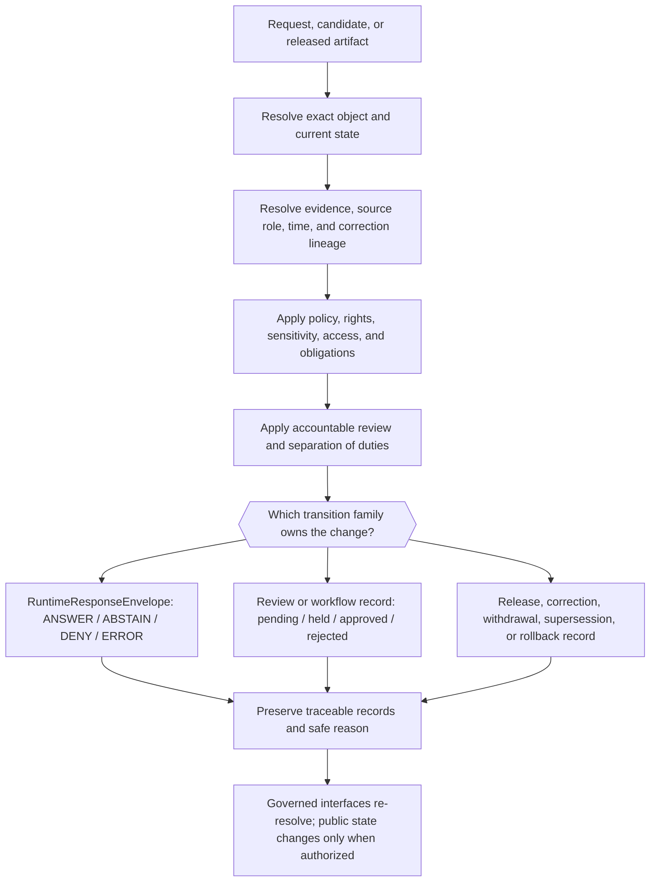

<!-- [KFM_META_BLOCK_V2]
doc_id: kfm://doc/focus-mode-state-transitions-readme
title: Focus Mode State Transition Documentation Boundary
type: readme; focus-mode; system-state; transitions; compatibility-lane
version: v1.0
status: draft; repository-grounded; compatibility-lane; mixed-authority; non-executable; non-release; non-publication
owner: "@bartytime4life via CODEOWNERS; runtime, evidence, policy, review, release, correction, rollback, and independent publication authority NEEDS VERIFICATION"
created: 2026-08-22
updated: 2026-08-22
policy_label: public; documentation; focus-mode; system-state; transitions; finite-outcomes; lifecycle; review; release; correction; rollback; cite-or-abstain; fail-closed
owning_root: docs/
responsibility: >-
  Orient maintainers to the repository-present Focus Mode transition
  specifications, distinguish runtime outcomes from review, lifecycle, release,
  correction, and rollback state changes, and expose current authority,
  validation, maintenance, and migration boundaries without executing or
  authorizing any transition.
authority: >-
  Human-readable navigation, reconciliation, and maintenance guidance only.
  Runtime outcomes belong to contracts and schemas; evidence, policy, review,
  lifecycle, release, correction, withdrawal, rollback, and public projection
  remain with their owning responsibility roots and accountable decisions.
current_path: docs/focus-mode/state/transitions/README.md
canonical_relationship: >-
  Same-path documentation repair inside the repository-present singular Focus
  compatibility lane. Accepted Directory Rules v2 supports PLACE for this README
  under docs/ but does not settle the mixed state tree's final split, migration,
  or transition-object homes. Structural convergence remains HOLD pending an
  accepted decision, consumer closure, validated migration, and rollback plan.
truth_posture: >-
  CONFIRMED current main, the prior one-byte target blob, all five sibling
  transition specifications, the parent state boundary, accepted ADR-0029 and
  adopted Directory Rules v2, proposed ADR-0028, CODEOWNERS, and the
  repository-present four-outcome RuntimeResponseEnvelope contract, schema, and
  validator / PROPOSED sibling transition triggers, reason-code vocabularies,
  receipt fields, review carriers, revocation manifests, rollback cards, client
  rebinding behavior, and future transition application / CONFLICTED sibling
  prose that sometimes treats HOLD as a client-facing outcome even though the
  current runtime schema enumerates only ANSWER, ABSTAIN, DENY, and ERROR /
  UNKNOWN end-to-end transition execution, live EvidenceRef-to-EvidenceBundle
  closure, policy evaluation, accountable review, release or revocation
  authority, cache invalidation, correction propagation, rollback execution,
  deployment, and public parity / NEEDS VERIFICATION final transition
  vocabulary, object-family ownership, authoritative reason-code registries,
  consumer mappings, independent review routes, and any public-use claim.
evidence_snapshot:
  repository: bartytime4life/Kansas-Frontier-Matrix
  base_ref: main
  base_commit: c3f85604a8792e6147e2006256019926880cb3ef
  target_prior_blob: e25f1814e51579d5f55c0f1fe0135ddb28a47f4a
  parent_state_readme_blob: 38c53a9a22ccaf5987630ec3a736a0fc551abbb7
  answer_to_abstain_blob: c6ef443ce463c8b327318193e61d98aa45225f09
  candidate_to_hold_blob: 9d47a70af7aa76ca518cf19b457b1b49d77c0cff
  hold_to_deny_blob: 15c97b5f672868753b430bc317125f9384c760d7
  published_to_revoked_blob: 54280a501a9f4a937354345bf6f957e17d8cf47c
  rollback_to_prior_blob: f0e8327f3bfe65ad95a58a1a507e8323c3395d72
  directory_rules_blob: fd49a0b83e55cef52c1124281f093e263526898d
  adr_0028_blob: d14ea2b4ad57294ab52da643c954a7f83d5e24e9
  adr_0029_blob: a4de0d7a96b78da59cfc499d1025e1508afd8dd9
  runtime_response_contract_blob: 9dfc286984b5b52b383753fe6215a2b31df8c876
  runtime_response_schema_blob: 8b86e7db8b18b65a56a4e639dfc54e1b2db93155
  runtime_response_validator_blob: 44ce7d51038a9adf9fcbdb18108cc27da8381e33
  codeowners_blob: dd2a84aa514d8ecd9208bc347f90f9a2ed37dd61
inspection_boundary: >-
  Current-session GitHub reads covered the complete target, all five direct
  sibling transition files, the parent state boundary, Directory Rules v2 and
  its accepted adoption ADR, proposed ADR-0028, the runtime response semantic
  contract, machine schema, validator, CODEOWNERS, applicable documentation
  workflow triggers, open pull-request overlap, active branch overlap, and
  current main. No source was admitted, no evidence or policy service was
  exercised, no review or release record was issued, no map or model call ran,
  and no revocation, correction, rollback, deployment, or public endpoint was
  exercised.
related:
  - ../README.md
  - ../finite-outcomes.md
  - ../lifecycle-states.md
  - ../review-state.md
  - ../payload-state.md
  - ../map-context-state.md
  - ../revocation-state.md
  - ./answer-to-abstain.md
  - ./candidate-to-hold.md
  - ./hold-to-deny.md
  - ./published-to-revoked.md
  - ./rollback-to-prior.md
  - ../../../doctrine/directory-rules.md
  - "../../../adr/ADR-0028 — State-scale Focus Mode scope.md"
  - ../../../adr/ADR-0029-adopt-directory-governance-standard-v2.md
  - ../../../../contracts/runtime/runtime_response_envelope.md
  - ../../../../schemas/contracts/v1/runtime/runtime_response_envelope.schema.json
  - ../../../../tools/validators/validate_runtime_response_envelope.py
  - ../../../../.github/CODEOWNERS
tags: [kfm, focus-mode, state, transitions, runtime-envelope, finite-outcomes, review, lifecycle, release, revocation, correction, rollback, compatibility, non-publication]
notes:
  - "v1.0 replaces a one-byte placeholder with a repository-grounded transition documentation boundary and navigation surface."
  - "This revision does not rewrite the five sibling transition specifications; their v0.1 fields and behavior claims remain proposal or lineage unless current authority verifies them."
  - "The current RuntimeResponseEnvelope schema enumerates ANSWER, ABSTAIN, DENY, and ERROR. HOLD remains a review, placement, promotion, correction, or workflow posture unless an accepted contract changes that boundary."
  - "Revocation, supersession, rollback, Git rollback, and runtime outcome changes remain distinct transition classes."
  - "No transition, release, revocation, correction, rollback, deployment, or publication is performed by this document."
[/KFM_META_BLOCK_V2] -->

<a id="top"></a>
<a id="focus-mode-state-transitions"></a>

# Focus Mode State Transition Documentation Boundary

> **Purpose.** Index the transition specifications currently tracked in this
> directory, keep their state families distinct, and show which contracts,
> schemas, evidence, policy, review, release, correction, and rollback records
> would be needed before any described transition can be treated as implemented.

> [!IMPORTANT]
> **This directory contains human-readable design and review aids, not an
> executable state machine.** A Markdown file cannot choose a runtime outcome,
> admit evidence, evaluate policy, approve review, publish a release, revoke an
> artifact, invalidate a cache, restore a prior release, or authorize public use.

> [!WARNING]
> **The current client-facing runtime machine has four enumerated outcomes:**
> `ANSWER`, `ABSTAIN`, `DENY`, and `ERROR`. `HOLD` is currently a review,
> placement, promotion, correction, or workflow posture; `PASS` and `FAIL` are
> validator results. Sibling prose that models `HOLD` as a fifth runtime outcome
> is retained lineage, not current machine authority.

> [!CAUTION]
> **Transition classes must not collapse.** Runtime outcome change, lifecycle
> promotion, review resolution, release withdrawal, supersession, correction,
> rollback, Git revert, and client cache behavior are related but distinct. Each
> needs its own authority owner and accountability record where applicable.

> [!NOTE]
> **Placement is bounded.** Accepted Directory Rules v2 supports this same-path
> `docs/` repair. It does not settle the final split or migration of the mixed
> `docs/focus-mode/state/` tree. Structural convergence remains `HOLD`.

**Quick navigation:** [Status](#1-status-and-evidence-boundary) ·
[Responsibilities](#2-responsibility-and-placement-boundary) ·
[State families](#3-transition-families) ·
[Inventory](#4-current-transition-inventory) ·
[Authority](#5-current-authority-and-implementation-map) ·
[Matrix](#6-transition-matrix) ·
[Protocol](#7-governed-transition-protocol) ·
[Use rules](#8-specification-use-rules) ·
[Validation](#9-validation-tests-and-receipts) ·
[Anti-patterns](#10-anti-patterns) ·
[Open work](#11-open-questions-and-adr-triggers) ·
[Maintenance](#12-maintenance-correction-and-rollback) ·
[References](#13-related-documents) ·
[Glossary](#14-appendix)

---

## 1. Status and evidence boundary

| Question | Current bounded answer | Truth label |
|---|---|---|
| Does this README exist at the requested path? | Yes. Current main contained a one-byte placeholder (`y`) at blob `e25f1814e51579d5f55c0f1fe0135ddb28a47f4a`; this revision replaces it in place. | `CONFIRMED` |
| Does the directory contain transition specifications? | Yes. Five Markdown specifications are tracked and linked below. | `CONFIRMED` |
| Are the specifications executable state-machine definitions? | No. They are prose documents with proposed triggers, conditions, receipts, and diagrams. | `CONFIRMED` repository form; implementation `UNKNOWN` |
| What is the current runtime outcome enum? | `ANSWER`, `ABSTAIN`, `DENY`, and `ERROR` in the paired runtime schema. | `CONFIRMED` machine shape; semantic contract remains `PROPOSED` |
| Is `HOLD` a current runtime outcome? | No. It is a review, placement, promotion, correction, or workflow posture unless a later accepted contract changes the enum. | `CONFIRMED` current machine boundary |
| Are release revocation and rollback implemented end to end? | No current-session service, release object, client, cache, correction, or rollback execution was exercised. | `UNKNOWN`; do not infer |
| Does this README change any contract, schema, policy, data, release, or runtime behavior? | No. It updates documentation and navigation only. | `CONFIRMED` |
| Is this path final canon? | Same-path maintenance is allowed. Final split, move, rename, mirror, or deletion of the mixed state tree remains held. | `CONFIRMED` current disposition |

### Truth labels used here

| Label | Meaning |
|---|---|
| `CONFIRMED` | Verified from current-session repository bytes or remote state. |
| `PROPOSED` | Design, vocabulary, path, behavior, or object not accepted or proven as current implementation. |
| `CONFLICTED` | Current sources or writable surfaces make incompatible claims. |
| `LINEAGE` | Retained prior design or history; not current authority by itself. |
| `UNKNOWN` | Evidence does not establish the claim. |
| `NEEDS VERIFICATION` | A concrete contract, schema, policy, review, release, runtime, migration, or consumer check remains. |
| `NOT_RUN` | The named executable or external check was not performed in this documentation slice. |
| `HOLD` | Proceeding would cross an unresolved authority, placement, review, sensitivity, or release boundary. |

Repository presence proves that bytes exist. It does not prove semantic
acceptance, evidence sufficiency, policy permission, review completion, release
eligibility, transition execution, deployment, or public parity.

[Back to top](#top)

---

## 2. Responsibility and placement boundary

### This README owns

- current navigation for the five tracked transition specifications;
- a repository-grounded inventory of their stated transition classes;
- separation of runtime outcomes from review, lifecycle, release, correction,
  revocation, supersession, and rollback state;
- links to current runtime contract, schema, validator, parent state guidance,
  accepted placement authority, and proposed state-scope decision;
- maintenance, validation, correction, and documentation rollback guidance;
- disclosure of conflicts and unverified implementation claims in sibling prose.

### This README does not own

| Responsibility | Owning surface or decision class | Effect here |
|---|---|---|
| Runtime outcome semantics | [`RuntimeResponseEnvelope` contract](../../../../contracts/runtime/runtime_response_envelope.md) | This README must not add, remove, or coerce outcomes |
| Runtime machine shape | [Paired JSON Schema](../../../../schemas/contracts/v1/runtime/runtime_response_envelope.schema.json) | Current four-value enum outranks stale transition prose for compatibility |
| Runtime envelope validation | [Runtime validator](../../../../tools/validators/validate_runtime_response_envelope.py) and fixtures | Proves bounded shape checks only when run |
| Evidence truth and citation closure | Source/evidence owners and governed `EvidenceRef -> EvidenceBundle` resolution | A transition spec cannot make a claim supported |
| Policy, rights, sensitivity, and access | `policy/` plus accountable evaluation | Documentation cannot allow, deny, redact, or disclose |
| Review state and separation of duties | Review contracts/records and verified reviewers | CODEOWNERS routing is not a ReviewRecord |
| Lifecycle and promotion | Governed lifecycle objects and promotion decisions | A file move, commit, or PR cannot promote an artifact |
| Release, revocation, correction, and rollback | `release/` plus governed accountability objects | This README issues no manifest, notice, or rollback card |
| Client cache invalidation or rebinding | Governed API, runtime, and application implementation | No public behavior is established here |
| Geographic state-scale identity | Accepted scope decision and machine registration | Proposed ADR-0028 does not register `kansas-state` |

### Directory Rules basis

Accepted ADR-0029 adopts the exact Directory Rules v2 bytes. Those rules place
human-readable explanation under `docs/`, require one authority owner per
artifact, return `SPLIT` for mixed independently writable authorities, and return
`HOLD` when ownership or target evidence is unresolved.

| Decision | Outcome | Basis |
|---|---|---|
| Replace the one-byte README in place | `PLACE` | Existing human-document responsibility under `docs/`; no authority or lifecycle change |
| Treat sibling prose as machine authority | `DENY` | Documentation cannot create runtime, policy, review, release, or data authority |
| Move or split the state tree in this change | `HOLD` | Final owners, targets, consumers, anchors, migration tests, and rollback remain unresolved |
| Create a parallel transition contract or schema home | `DENY` | Would create parallel authority without an accepted decision and migration |
| Correct sibling semantic conflicts later | `PROPOSED` / separate review slice | Each correction must reconcile current contracts, schemas, policy, consumers, and compatibility |

[Back to top](#top)

---

## 3. Transition families

The directory spans several orthogonal state families. A single event may touch
more than one family, but no value may silently stand in for another.

| Family | Representative values or records | Authority boundary |
|---|---|---|
| Runtime response | `ANSWER`, `ABSTAIN`, `DENY`, `ERROR` | Current client-facing schema and semantic contract |
| Review and workflow | draft, pending, held, approved, rejected, superseded | Review contracts, records, reviewer authority, and policy |
| Lifecycle | RAW, WORK, QUARANTINE, PROCESSED, CATALOG, TRIPLETS, PUBLISHED | Governed lifecycle and promotion decisions |
| Payload and evidence posture | current, stale, unresolved, superseded, revoked-but-cached | Evidence, payload, correction, and cache implementation; vocabularies remain proposal-sensitive |
| Release accountability | live, superseded, withdrawn/revoked, rolled-back | Release manifests, correction/withdrawal notices, revocation records, rollback records |
| Validator result | PASS, FAIL, ERROR, or tool-specific finite result | One bounded validator or test; never a public truth outcome |
| Repository delivery | branch, commit, pull request, merge, tag, GitHub release | Repository state only; not KFM lifecycle promotion or publication |

### Orthogonality example

```text
artifact lifecycle:     CATALOG / TRIPLETS
review posture:         held
payload freshness:      stale
release posture:        no current release
runtime outcome:        ABSTAIN
validator result:       PASS for one shape check
repository state:       draft pull request
```

None of these values upgrades another. In particular, a passing validator does
not turn a candidate into `PUBLISHED`, and a GitHub merge does not execute a
release, revocation, correction, or rollback.

[Back to top](#top)

---

## 4. Current transition inventory

```text
docs/focus-mode/state/transitions/
├── README.md
├── answer-to-abstain.md
├── candidate-to-hold.md
├── hold-to-deny.md
├── published-to-revoked.md
└── rollback-to-prior.md
```

| Document | Intended transition | Current evidence-backed disposition |
|---|---|---|
| [`answer-to-abstain.md`](./answer-to-abstain.md) | A prior client `ANSWER` can no longer be supported and narrows to `ABSTAIN` | Runtime endpoint values are schema-present; triggers, reason mapping, receipt chain, cache handling, and actual execution remain `PROPOSED` or `UNKNOWN` |
| [`candidate-to-hold.md`](./candidate-to-hold.md) | A release-eligible candidate pauses for rights, policy, sensitivity, correction, or steward review | Useful review/promotion lineage; `HOLD` is not a current runtime outcome and the named carrier fields remain `PROPOSED` |
| [`hold-to-deny.md`](./hold-to-deny.md) | A held candidate resolves to rejection, with a public projection that may be `DENY` | Review resolution and runtime projection must remain distinct; prior release impact requires separate authority and records |
| [`published-to-revoked.md`](./published-to-revoked.md) | A released artifact is withdrawn from serving | Release/accountability proposal; named manifest fields, signatures, TTL, client rebinding, and public correction behavior remain unverified |
| [`rollback-to-prior.md`](./rollback-to-prior.md) | An eligible prior release becomes current through a governed forward transition | Rollback/accountability proposal; not a Git revert, history rewrite, or implied revocation |

### Shared limitations of the sibling files

- All five are v0.1 draft prose authored on 2026-05-24.
- Their metadata still cites older Directory Rules v1.2 path divergence and
  `OPEN-DR-09`; accepted Directory Rules v2 and ADR-0029 now govern placement.
- Several named object fields, schema paths, validators, reason codes, signatures,
  TTLs, and runtime behaviors are proposed rather than current implementation
  evidence.
- `candidate-to-hold.md` and `hold-to-deny.md` contain older runtime-`HOLD`
  language that conflicts with the current four-outcome runtime schema.
- This README records those limitations without silently rewriting the sibling
  specifications. Their semantic reconciliation is separate reviewable work.

[Back to top](#top)

---

## 5. Current authority and implementation map

| Surface | What is confirmed now | What it cannot prove |
|---|---|---|
| Parent [state boundary](../README.md) | Mixed geographic/system state tree, four current runtime outcomes, HOLD separation, structural migration hold | Final canonical split or end-to-end runtime behavior |
| [`RuntimeResponseEnvelope` contract](../../../../contracts/runtime/runtime_response_envelope.md) | Tracked v0.4 semantic contract pairs to a runtime schema and documents four client outcomes | Evidence resolution, correct policy, active service, or public release |
| [Runtime schema](../../../../schemas/contracts/v1/runtime/runtime_response_envelope.schema.json) | Closed JSON object; enum is `ANSWER`, `ABSTAIN`, `DENY`, `ERROR`; `ANSWER` requires evidence refs and precision disclosure | Truth, rights, policy permission, review, release, or deployment |
| [Runtime validator](../../../../tools/validators/validate_runtime_response_envelope.py) | Deterministic local shape and answer-precision checks are implemented | Semantic outcome selection, evidence closure, policy, or public behavior |
| [`finite-outcomes.md`](../finite-outcomes.md) | Current four-outcome documentation boundary with retained reason-code lineage | Accepted global reason-code registry or runtime execution |
| [`review-state.md`](../review-state.md) | Draft review/HOLD vocabulary and transition lineage | Accepted review contract, verified reviewers, or a fifth runtime outcome |
| [`lifecycle-states.md`](../lifecycle-states.md) | Core lifecycle shorthand and promotion-boundary guidance | Active promotion gates or release eligibility |
| [`revocation-state.md`](../revocation-state.md) | Draft revocation, supersession, and rollback concepts | Issued manifests, verified signatures, cache behavior, or public correction |
| ADR-0028 | Proposed geographic state-scope decision and state-term split requirement | Acceptance, registration, migration, implementation, or release |
| ADR-0029 and Directory Rules v2 | Accepted placement authority and finite placement outcomes | Runtime truth, review approval, release, or publication |
| CODEOWNERS | Routes GitHub review to `@bartytime4life` | Independent review, policy approval, release approval, or publication authority |

### Maturity summary

| Capability | Current status |
|---|---|
| Transition-document bytes and sibling navigation | `CONFIRMED` |
| Runtime four-outcome machine shape | `CONFIRMED` repository shape; semantic contract remains proposed |
| Runtime shape validator | `CONFIRMED` repository implementation; execution results are separate evidence |
| Review/HOLD carrier | `PROPOSED` / `CONFLICTED` with older runtime-HOLD prose |
| Transition reason-code authority | `NEEDS VERIFICATION` |
| Evidence- and policy-backed transition evaluation | `UNKNOWN` |
| Accountable reviewer and separation-of-duties route | `UNKNOWN` |
| Release revocation, correction, cache invalidation, and rollback execution | `UNKNOWN` |
| Deployment and public parity | `UNKNOWN` |

[Back to top](#top)

---

## 6. Transition matrix

| Documented change | Source family | Target family | Minimum governing inputs | Bounded public projection | Current posture |
|---|---|---|---|---|---|
| `ANSWER -> ABSTAIN` | Runtime response | Runtime response | Prior response identity, current request context, evidence resolution, freshness/correction state, policy result, new envelope and audit link | `ABSTAIN` with a safe reason; prior answer must not continue to render as current | Both outcomes are schema-present; transition execution `UNKNOWN` |
| candidate -> `HOLD` | Review/promotion | Review/promotion | Candidate identity, review record, reason, accountable issuer, evidence needed to clear, prior release posture | Current runtime contract must still resolve to one of four outcomes; no ad hoc runtime `HOLD` | Review concept `PROPOSED`; runtime-HOLD language `CONFLICTED` |
| `HOLD` -> rejection / `DENY` projection | Review/promotion then runtime | Review/promotion and runtime | Held record, signed/verified review result, policy result, candidate/prior-release distinction, new runtime envelope when queried | `DENY` only where policy/release posture requires it; prior valid release is not implicitly revoked | Mapping `PROPOSED`; end-to-end execution `UNKNOWN` |
| `PUBLISHED` -> withdrawn/revoked | Release/accountability | Release/accountability | Current release identity, authority to withdraw, reason, affected hash/spec lineage, correction notice, client/cache obligations | Governed runtime may `ABSTAIN`, `DENY`, rebind, or error according to current contract and safe state | Contract and implementation closure `UNKNOWN` |
| current release -> prior release restored | Release/accountability | Release/accountability | Current and prior release identity, prior-release revalidation, authorized rollback decision, correction/public notice, supersession lineage | Clients re-resolve through governed interfaces; no direct Git-state shortcut | Rollback proposal `PROPOSED`; execution `UNKNOWN` |

### No implicit chaining

A transition may trigger evaluation of another transition, but one record must not
silently stand in for another:

- rejecting a candidate does not revoke an existing release;
- revoking a release does not restore a prior release;
- restoring a prior release does not automatically revoke the rolled-back release;
- a Git revert does not invalidate public caches or issue a correction notice;
- a runtime `ABSTAIN` does not itself change lifecycle or release state;
- a review approval does not itself publish.

[Back to top](#top)

---

## 7. Governed transition protocol

The following is a documentation-level review protocol, not a claim that one
unified transition engine exists.



Before relying on a transition claim, verify:

1. **Identity** — exact object, version, current state, scope, and prior state.
2. **Authority owner** — one responsibility owns the mutation; related concerns
   are referenced rather than duplicated.
3. **Evidence** — consequential claims resolve through governed evidence or
   narrow to `ABSTAIN`.
4. **Policy and sensitivity** — rights, access, precision, obligations, and
   disclosure are evaluated fail closed.
5. **Review** — accountable reviewer identity and separation of duties are
   recorded where consequence requires them.
6. **Finite result** — runtime, review, validator, lifecycle, and release values
   remain in their own vocabularies.
7. **Accountability records** — emitted receipts, decisions, notices, manifests,
   or rollback records are the right object family and remain auditable.
8. **Client effects** — governed interfaces, caches, indexes, maps, exports, and
   AI projections are updated or withdrawn deliberately.
9. **Correction and rollback** — successor, withdrawal, public notice, and
   restoration paths are explicit and independently reversible.

[Back to top](#top)

---

## 8. Specification use rules

### Use a transition specification to

- review preconditions and blocked states;
- identify the state family that should own the change;
- discover related evidence, policy, review, release, correction, and rollback
  questions;
- design deterministic fixtures and negative cases;
- compare implementation behavior with an explicitly labeled proposal;
- identify stale semantics that need a separate contract- or schema-backed
  correction.

### Do not use a transition specification to

- bypass the current runtime schema;
- emit `HOLD` as a fifth client outcome;
- infer that a named schema, validator, manifest, signature, TTL, receipt, or
  endpoint exists because prose names it;
- treat source or evidence pointers as resolved support;
- approve a candidate or release;
- expose restricted reasons, payloads, or precise locations;
- mutate RAW, WORK, QUARANTINE, PROCESSED, CATALOG, TRIPLETS, or PUBLISHED state;
- assume clients honor correction, revocation, or rollback without execution
  evidence;
- treat a commit, pull request, merge, GitHub release, badge, or test result as
  KFM publication.

### Safe interpretation of sibling terminology

| Sibling term | Current interpretation |
|---|---|
| `DecisionEnvelope(outcome=HOLD)` | Stale/proposed wording; map through the accepted review carrier and one of the four runtime outcomes before implementation |
| `ReviewRecord.state = held` | Proposed review posture; not current runtime machine authority |
| `PolicyDecision(HOLD)` | Proposed policy/workflow posture; exact current policy contract and enum require verification |
| revocation manifest | Proposed release-accountability object until contract/schema/issuer/client closure is verified |
| `RollbackCard` | Proposed rollback-accountability object until current contract/schema and execution evidence are verified |
| `AIReceipt` chain | Proposed or repository-present object depending on exact path/version; existence alone is not evidence closure or release authority |
| reason codes | Useful lineage; authoritative registry and compatibility remain `NEEDS VERIFICATION` |

[Back to top](#top)

---

## 9. Validation, tests, and receipts

### Validation expected for this README

- one H1 and one complete `KFM_META_BLOCK_V2`;
- unique explicit anchors and balanced fenced blocks;
- valid GFM tables and Mermaid source;
- all local file, directory, and fragment targets resolve;
- UTF-8, LF line endings, final newline, no conflict markers, no tabs, and no
  trailing whitespace;
- all five tracked transition specifications are indexed exactly once;
- four current runtime outcomes are preserved;
- `HOLD`, `PASS`, and `FAIL` remain outside the runtime enum;
- no claim that documentation, a schema, a validator, a commit, or a pull
  request creates evidence, policy, review, release, deployment, or publication
  authority;
- correction, withdrawal, supersession, and rollback remain distinguishable.

### Repository-native checks relevant to this change

| Check surface | Bounded role | Non-effect |
|---|---|---|
| Documentation metadata validation | Checks changed metadata structure, identity, dates, responsibility-root agreement, and related-path hygiene | Does not adopt semantics or mutate the document registry |
| Local changed-Markdown link check | Checks repository-local paths and fragments without requesting external URLs | Does not verify external sources or runtime behavior |
| Markdown source checks | Check headings, fences, whitespace, anchors, and parser-safe structure | Do not prove implementation or public rendering parity |
| Runtime envelope schema/validator tests | Protect the current four-outcome machine boundary when run | Do not select a truthful outcome, resolve evidence, or authorize a response |
| Repository topology validation | Detects bounded placement drift against the accepted projection | Does not turn current placement into canon or approve migration |

### What a green check does not prove

A passing README check, schema validation, unit test, security scan, workflow,
release dry run, revocation fixture, or rollback drill does not by itself prove:

- source truth, rights, sensitivity, or EvidenceBundle closure;
- policy correctness or accountable human review;
- release eligibility, public-safe transformation, or publication;
- an active service, client cache behavior, or deployed parity;
- correction propagation, public notice, withdrawal, or rollback execution.

No generated receipt, proof, catalog record, release object, or public artifact is
created by this documentation change.

[Back to top](#top)

---

## 10. Anti-patterns

| Anti-pattern | Failure | Required posture |
|---|---|---|
| Prose state machine | Treating the five Markdown files as executable transition authority | Require current contracts, schemas, code, fixtures, tests, and runtime/release evidence |
| Fifth runtime outcome | Emitting `HOLD` to a client despite the four-value schema | Keep HOLD in review/workflow state and project through the accepted runtime contract |
| State-family collapse | Combining review, lifecycle, payload, correction, validator, and runtime values in one enum | Preserve separate carriers and explicit mappings |
| Implicit transition chain | Candidate rejection silently revokes a release or revocation silently rolls back | Issue each authorized transition and accountability record separately |
| Review equals release | Treating approval or CODEOWNERS routing as publication | Require distinct release decision, correction path, and rollback target |
| Schema-valid equals supported | Treating valid JSON as evidence closure or policy permission | Resolve evidence and governing state |
| Git rollback equals public rollback | Treating `git revert` as cache invalidation, correction notice, or release restoration | Execute public accountability through governed release interfaces |
| Silent demotion or withdrawal | Removing an answer or artifact without a safe public state and correction context | Make changed public posture visible without leaking restricted reasons |
| Revocation deletes history | Erasing the withdrawn artifact or its decision chain | Stop serving while preserving addressable audit lineage according to policy |
| Restoring unverified prior state | Rolling back to a prior release without rechecking its eligibility | Revalidate current evidence, policy, correction, and revocation posture |
| Placeholder reason codes as canon | Treating v0.1 prose enums as adopted global vocabularies | Verify or adopt one authoritative registry with compatibility rules |
| Structural shortcut | Moving this tree to resolve semantic conflict without consumer and migration closure | Keep structural convergence held until accepted and reversible |

[Back to top](#top)

---

## 11. Open questions and ADR triggers

| Open item | Current status | Decision or evidence needed |
|---|---|---|
| Reconcile runtime-HOLD wording in sibling transition specs | `CONFLICTED` | Separate same-path corrections aligned to the current runtime contract/schema and review carrier |
| Define authoritative transition and reason-code vocabularies | `NEEDS VERIFICATION` | Accepted owner, contract/schema or policy home, compatibility versioning, validators, and fixtures |
| Establish review-state carrier and separation of duties | `UNKNOWN` | Current contract, verified reviewers, policy checks, negative tests, and audit records |
| Verify release revocation/withdrawal object family | `UNKNOWN` | Current semantic contract, schema, issuer authority, signatures/integrity, public notice, client behavior, and tests |
| Verify rollback object family and supersession lineage | `UNKNOWN` | Current contract/schema, eligible prior-state checks, receipts, client re-resolution, and drills |
| Define cache, map, search, export, and AI correction propagation | `UNKNOWN` | Executable governed flow with failure and replay evidence |
| Split geographic state scope from system/trust state | `HOLD` | Accepted decision naming each authority owner, target, consumer migration, validation, and rollback |
| Accept or reject `kansas-state` scope | `PROPOSED` under ADR-0028 | ADR acceptance and complete scope/evidence/policy/release consequences |
| Inventory all inbound links and external consumers | `NEEDS VERIFICATION` | Repository and external closure before any move or rename |
| Prove end-to-end Focus transition behavior | `UNKNOWN` | No-network fixtures first, then governed integration evidence and bounded public parity testing |

### Changes that require more than this README

- adding, removing, or renaming a runtime outcome;
- making `HOLD` client-facing;
- adopting a transition or reason-code registry;
- accepting a review, revocation, correction, or rollback object family;
- changing policy, rights, sensitivity, precision, or disclosure behavior;
- moving, splitting, renaming, mirroring, or deleting this directory;
- activating a live source, service, release, revocation channel, or public client;
- changing public correction, withdrawal, supersession, or rollback semantics.

[Back to top](#top)

---

## 12. Maintenance, correction, and rollback

### Update this README when

- a transition specification is added, removed, renamed, moved, or superseded;
- the runtime outcome enum changes through an accepted contract/schema process;
- HOLD gains an accepted review carrier or public projection;
- authoritative transition or reason-code registries are adopted;
- review, evidence, policy, revocation, correction, rollback, or cache behavior
  becomes verifiable;
- ADR-0028 or the state-tree placement decision changes status;
- structural migration gains consumer closure, validation, and rollback evidence;
- an inbound-link or external-consumer inventory changes migration risk.

### Documentation correction

A correction should:

1. pin the affected document version, blob, and repository commit;
2. identify the stale, false, conflicted, or overbroad claim;
3. cite the current contract, schema, policy, test, decision, release object, or
   runtime evidence that corrects it;
4. preserve stable anchors and sibling links where feasible;
5. state whether the correction changes prose only or requires contract, schema,
   policy, implementation, fixture, test, migration, or public-state work;
6. keep unsupported transition behavior labeled `PROPOSED`, `UNKNOWN`, or
   `NEEDS VERIFICATION`;
7. define a reversible repository change and any separate public correction path.

### Repository rollback

Before merge, close or abandon the draft pull request and branch. Branch deletion
is a separate action.

After merge, restore prior target blob
`e25f1814e51579d5f55c0f1fe0135ddb28a47f4a` through a transparent revert or
apply a bounded forward correction. Do not rewrite shared history.

Restoring the former one-byte placeholder would roll back repository bytes only.
It would not reverse any contract, policy, release, correction, revocation,
rollback, deployment, or publication state—none is changed by this README.

[Back to top](#top)

---

## 13. Related documents

### State-family documentation

- [Parent Focus Mode state boundary](../README.md)
- [Finite runtime outcomes](../finite-outcomes.md)
- [Lifecycle states](../lifecycle-states.md)
- [Review and HOLD state](../review-state.md)
- [Payload and evidence posture](../payload-state.md)
- [Map request-context state](../map-context-state.md)
- [Revocation, supersession, and rollback state](../revocation-state.md)

### Transition specifications

- [`ANSWER -> ABSTAIN`](./answer-to-abstain.md)
- [Candidate -> `HOLD`](./candidate-to-hold.md)
- [`HOLD` -> `DENY`](./hold-to-deny.md)
- [`PUBLISHED` -> withdrawn/revoked](./published-to-revoked.md)
- [Prior release restored through rollback](./rollback-to-prior.md)

### Placement and scope decisions

- [Accepted Directory Rules v2 bytes](../../../doctrine/directory-rules.md)
- [ADR-0029 — accepted Directory Rules adoption](../../../adr/ADR-0029-adopt-directory-governance-standard-v2.md)
- [ADR-0028 — proposed state-scale Focus scope](../../../adr/ADR-0028%20%E2%80%94%20State-scale%20Focus%20Mode%20scope.md)
- [CODEOWNERS review routing](../../../../.github/CODEOWNERS)

### Current runtime seams

- [`RuntimeResponseEnvelope` semantic contract](../../../../contracts/runtime/runtime_response_envelope.md)
- [Runtime response machine schema](../../../../schemas/contracts/v1/runtime/runtime_response_envelope.schema.json)
- [Runtime response validator](../../../../tools/validators/validate_runtime_response_envelope.py)
- [Runtime response fixture boundary](../../../../fixtures/contracts/v1/runtime/runtime_response_envelope/README.md)

[Back to top](#top)

---

## 14. Appendix

### 14.1 Glossary

| Term | Family | Bounded meaning |
|---|---|---|
| `ANSWER` | Runtime outcome | Client may render a governed response under the current proposed envelope shape |
| `ABSTAIN` | Runtime outcome | Support or another prerequisite is insufficient; do not infer or fill with model language |
| `DENY` | Runtime outcome | Policy, role, sensitivity, access, or release posture blocks delivery |
| `ERROR` | Runtime outcome | Runtime cannot complete safely or deterministically |
| `HOLD` | Review/placement/promotion posture | Decision is intentionally paused; not a current runtime enum value |
| `PASS` / `FAIL` | Validator result | One bounded check result; not public truth, review, release, or publication |
| Transition specification | Documentation | Human-readable proposal or review aid; not execution authority |
| `EvidenceRef` | Evidence pointer | Must resolve through governed interfaces before supporting a claim |
| `EvidenceBundle` | Evidence support | Outranks generated language for consequential claims |
| Review record | Review | Proposed or adopted carrier for accountable review state; exact current authority must be verified |
| Release manifest | Release | Distinct released-state record; not created by Git state or a passing check |
| Revocation/withdrawal record | Accountability | Stops serving an affected released form while preserving governed reason and lineage |
| Correction notice | Accountability | Public or steward-facing explanation of corrected, narrowed, superseded, or withdrawn state |
| Rollback record | Accountability | Forward decision restoring an eligible prior released state without deleting history |
| Git revert | Repository operation | Restores repository bytes; not public correction or release rollback by itself |

### 14.2 Self-check

| Check | Result expected for this revision |
|---|---|
| One H1 | yes |
| Metadata block | one complete `KFM_META_BLOCK_V2` |
| Current base and prior target blob recorded | yes |
| Five sibling transition files inventoried | yes |
| Current four runtime outcomes preserved | yes |
| HOLD and PASS/FAIL separated | yes |
| Review/lifecycle/release/correction/rollback classes separated | yes |
| Current authority links present | yes |
| Proposed and unknown behavior labeled | yes |
| No sibling semantic rewrite | yes |
| No structural migration | yes |
| No contract, schema, policy, runtime, release, deployment, or publication effect | yes |
| Correction and repository rollback visible | yes |

---

**Current document status:** repository-grounded draft · **Path posture:**
same-path `PLACE`; structural split/migration `HOLD` · **Runtime outcome shape:**
four machine-enumerated values, proposal status retained · **Release/publication
effect:** none.

[Back to top](#top)
