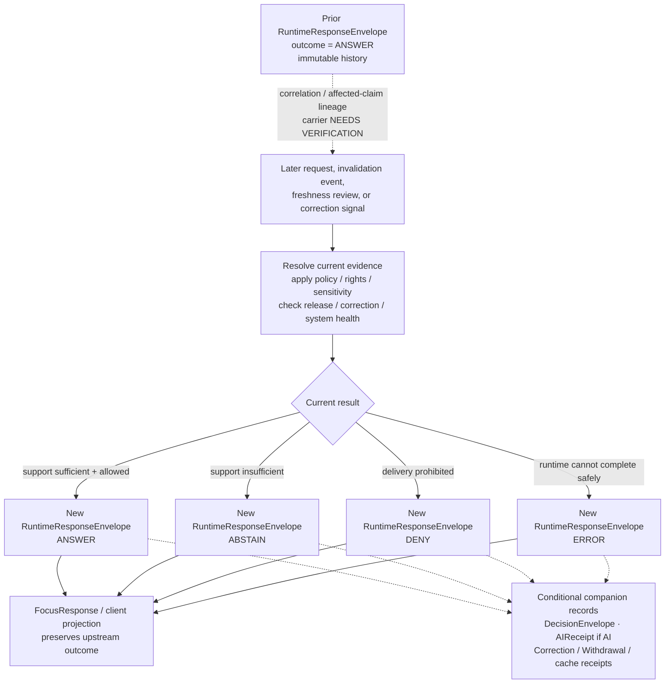

<!-- [KFM_META_BLOCK_V2]
doc_id: kfm://doc/focus-mode-state-transitions-answer-to-abstain
title: Runtime Outcome Transition Boundary — ANSWER to ABSTAIN
type: standard; focus-mode; runtime-outcome-transition; compatibility-lane
version: v1.0
status: draft; repository-grounded; documentation-only; non-executable; non-release; non-publication
owner: "@bartytime4life via CODEOWNERS; runtime, evidence, policy, correction, release, UI, cache, and independent review authority NEEDS VERIFICATION"
created: 2026-05-24
updated: 2026-08-22
policy_label: public; documentation; focus-mode; runtime-outcome; answer; abstain; evidence; freshness; correction; withdrawal; cite-or-abstain; fail-closed
owning_root: docs/
responsibility: >-
  Explain the bounded relationship between an earlier client-facing ANSWER and a
  later client-facing ABSTAIN, reconcile the v0.1 prose with current
  RuntimeResponseEnvelope, DecisionEnvelope, AIReceipt, FocusResponse,
  correction, withdrawal, schema, and validator evidence, preserve prior
  compatibility anchors, and expose implementation, reason-code, evidence,
  policy, release, cache, correction, and rollback gaps without executing or
  authorizing any runtime or publication transition.
authority: >-
  Human-readable reconciliation, review guidance, and maintenance documentation
  only. Runtime semantics belong to contracts; machine shape belongs to schemas;
  evidence, policy, review, release, correction, withdrawal, rollback, cache
  invalidation, API behavior, UI projection, and AI execution remain with their
  owning roots and accountable decisions.
current_path: docs/focus-mode/state/transitions/answer-to-abstain.md
canonical_relationship: >-
  Same-path documentation correction inside the repository-present singular
  Focus compatibility lane. Accepted Directory Rules v2 supports PLACE for this
  docs-root edit but does not settle the mixed state tree's final split,
  migration, transition-object homes, consumer aliases, or retirement.
truth_posture: >-
  CONFIRMED the current path and prior v0.1 bytes, the parent transition and
  state documentation boundaries, accepted ADR-0029 and adopted Directory Rules
  v2, the current four-outcome RuntimeResponseEnvelope contract/schema,
  required envelope fields, conditional ANSWER evidence and precision shape,
  prohibition of answer precision on ABSTAIN, the unenumerated reason_code
  string, the DecisionEnvelope and AIReceipt companion contracts, AIReceipt's
  conditional applicability when AI participates, the FocusResponse projection
  boundary, the runtime validator's bounded checks, and the current
  CorrectionNotice and WithdrawalNotice proposal/thin-schema posture /
  LINEAGE the v0.1 trigger list, reason-code names, cache behavior, rebinding
  behavior, receipt requirements, and no-rollback-artifact statement /
  PROPOSED the correlation model between prior and later envelopes, trigger
  evaluation timing, evidence re-resolution, client notice, cache invalidation,
  replacement selection, controlled reason-code vocabulary, and complete
  transition validation / CONFLICTED the v0.1 treatment of DecisionEnvelope as
  the caller response, AIReceipt as universal, reason codes as settled,
  revocation-manifest language as current authority, and ABSTAIN as the required
  result for every stale/revoked/resolver case / UNKNOWN live runtime behavior,
  evidence resolution, policy evaluation, release/correction propagation,
  cache invalidation, replacement rebinding, AI receipt persistence, client
  rendering, deployment, and public parity / NEEDS VERIFICATION every
  implementation claim beyond the inspected repository shape and documentation
  boundaries.
evidence_snapshot:
  repository: bartytime4life/Kansas-Frontier-Matrix
  base_ref: main
  inspected_commit: da90743a1f1ed29db8e372722e7789a7c0c1eb73
  target_prior_blob: c6ef443ce463c8b327318193e61d98aa45225f09
  transitions_readme_blob: 220f7d6b7c2cd486267490a986d943a509d54347
  state_readme_blob: 38c53a9a22ccaf5987630ec3a736a0fc551abbb7
  finite_outcomes_blob: bd188a69890f43698422b2bd27c76c74958c5feb
  runtime_response_contract_blob: 9dfc286984b5b52b383753fe6215a2b31df8c876
  runtime_response_schema_blob: 8b86e7db8b18b65a56a4e639dfc54e1b2db93155
  runtime_response_validator_blob: 44ce7d51038a9adf9fcbdb18108cc27da8381e33
  decision_envelope_contract_blob: b7e33c1351c9c28c5cfb3fc107d87204b3fdf455
  ai_receipt_contract_blob: 1e028525569b6032cd573e71d98df6b961fa70db
  focus_response_contract_blob: 5fe3e2763d2b3735e94a53a416114d9b37e7be64
  withdrawal_notice_contract_blob: 3cb27571de43e49d3a9f9c1bee0b347f6f3e7753
  correction_notice_contract_blob: 4716f2bc6e714ad2ab873d95144417d7855f5beb
  directory_rules_blob: fd49a0b83e55cef52c1124281f093e263526898d
  adr_0029_blob: a4de0d7a96b78da59cfc499d1025e1508afd8dd9
  codeowners_blob: dd2a84aa514d8ecd9208bc347f90f9a2ed37dd61
inspection_boundary: >-
  Current-session GitHub reads covered the complete target, current main, the
  parent transition and state boundaries, finite-outcome reconciliation,
  accepted Directory Rules evidence, RuntimeResponseEnvelope contract/schema/
  validator, DecisionEnvelope, AIReceipt, FocusResponse, WithdrawalNotice,
  CorrectionNotice, CODEOWNERS, and open pull-request and task-branch overlap.
  No source was admitted, no EvidenceRef was resolved, no policy evaluator,
  governed request, runtime adapter, UI, cache, release object, correction
  cascade, withdrawal, rollback, deployment, or public endpoint was exercised.
related:
  - ./README.md
  - ../README.md
  - ../finite-outcomes.md
  - ../payload-state.md
  - ../revocation-state.md
  - ../../../../contracts/runtime/runtime_response_envelope.md
  - ../../../../schemas/contracts/v1/runtime/runtime_response_envelope.schema.json
  - ../../../../tools/validators/validate_runtime_response_envelope.py
  - ../../../../contracts/runtime/decision_envelope.md
  - ../../../../contracts/runtime/ai_receipt.md
  - ../../../../contracts/ui/focus_response.md
  - ../../../../contracts/release/withdrawal_notice.md
  - ../../../../contracts/correction/correction_notice.md
  - ../../../doctrine/directory-rules.md
  - ../../../adr/ADR-0029-adopt-directory-governance-standard-v2.md
  - ../../../../.github/CODEOWNERS
tags: [kfm, focus-mode, state, transition, answer, abstain, runtime-response-envelope, evidence-ref, correction, withdrawal, cache, compatibility, non-publication]
notes:
  - "v1.0 replaces the behavior-assertive v0.1 transition prose with a repository-grounded documentation boundary."
  - "The current client-facing runtime enum remains ANSWER, ABSTAIN, DENY, and ERROR."
  - "This page describes two traceable response events; it does not mutate an earlier ANSWER envelope into an ABSTAIN envelope."
  - "Legacy reason-code names remain lineage candidates because the current schemas accept an unenumerated reason_code string."
  - "AIReceipt applies only when AI participated; DecisionEnvelope is companion decision detail, while RuntimeResponseEnvelope is the client-facing envelope."
  - "No transition, source decision, policy decision, release, correction, withdrawal, cache invalidation, rollback, deployment, or publication is performed by this document."
[/KFM_META_BLOCK_V2] -->

<a id="top"></a>
<a id="transition--answer--abstain"></a>

# Runtime Outcome Transition Boundary — `ANSWER` → `ABSTAIN`

> **Purpose.** Explain when a later governed response may be an `ABSTAIN` after
> an earlier response was an `ANSWER`, while preserving immutable history,
> current finite-outcome authority, evidence and policy boundaries, and visible
> correction or withdrawal posture.

[](#1-status-and-evidence-boundary)
[](#3-transition-semantics)
[](#4-trigger-conditions)
[](#13-validation-and-negative-tests)
[](#2-responsibility-and-placement-boundary)

> [!IMPORTANT]
> **This file is not an executable transition.** It cannot re-resolve evidence,
> evaluate policy, issue a response envelope, withdraw a release, invalidate a
> cache, update a client, or authorize public use. It documents the boundary
> that an implementation would need to prove.

> [!WARNING]
> **An earlier envelope is not rewritten.** `ANSWER → ABSTAIN` is shorthand for
> two separately issued, traceable response events: an earlier
> `RuntimeResponseEnvelope(outcome=ANSWER)` and a later
> `RuntimeResponseEnvelope(outcome=ABSTAIN)`. Silent mutation of the earlier
> record would destroy audit and correction lineage.

> [!CAUTION]
> **Not every loss of an answer maps to `ABSTAIN`.** A current prohibition maps
> to `DENY`; a runtime or resolver failure maps to `ERROR`; eligible replacement
> evidence may support a new `ANSWER`. `HOLD` remains a review, placement,
> promotion, correction, or workflow posture rather than a fifth client outcome.

> [!NOTE]
> **The v0.1 reason-code names are not current enums.** The paired runtime and
> decision schemas define `reason_code` as a string without enumerating
> `payload_stale`, `citation_closure_failed`, or the other legacy values. This
> edition preserves those names as lineage candidates only.

**Quick navigation:** [Status](#1-status-and-evidence-boundary) ·
[Authority](#2-responsibility-and-placement-boundary) ·
[Semantics](#3-transition-semantics) ·
[Triggers](#4-trigger-conditions) ·
[Preconditions](#5-pre-conditions) ·
[Decision matrix](#6-outcome-selection-matrix) ·
[Postconditions](#7-post-conditions) ·
[Records](#8-required-receipts) ·
[Client/cache](#9-client-cache-and-history-behavior) ·
[Correction](#10-correction-withdrawal-and-supersession) ·
[Rollback](#11-rollback-target) ·
[Diagram](#12-diagram) ·
[Validation](#13-validation-and-negative-tests) ·
[Anti-patterns](#14-anti-patterns) ·
[Open work](#15-open-verification-backlog) ·
[Maintenance](#16-maintenance-correction-and-documentation-rollback) ·
[References](#17-cross-references) · [History](#18-change-history)

---

## 1. Status and evidence boundary

| Question | Current bounded answer | Truth label |
|---|---|---|
| Does this document exist at the requested path? | Yes. The prior v0.1 file is tracked at blob `c6ef443ce463c8b327318193e61d98aa45225f09`. | `CONFIRMED` |
| What is the current client outcome enum? | `ANSWER`, `ABSTAIN`, `DENY`, and `ERROR`. | `CONFIRMED` machine shape; contracts remain `PROPOSED` |
| Is this transition executable? | No executable state-machine binding, service flow, invalidation worker, or public client behavior was exercised in this work. | `UNKNOWN`; do not infer |
| Is the prior `ANSWER` mutated? | Current runtime envelopes have stable identity and issue time; this document requires append-only interpretation rather than rewriting prior history. | Schema shape `CONFIRMED`; transition behavior `PROPOSED` |
| Does the runtime schema enumerate abstention reasons? | No. `reason_code` is a required string, not a closed enum. | `CONFIRMED` |
| Is `DecisionEnvelope` the client response? | No. It records companion runtime decision detail. `RuntimeResponseEnvelope` is the governed API/client-facing envelope. | `CONFIRMED` contract boundary |
| Is `AIReceipt` required for every transition? | No. It is the accountability receipt for an AI-mediated event and applies when AI participated. | `CONFIRMED` contract boundary |
| Are correction and withdrawal objects mature? | `CorrectionNotice` and `WithdrawalNotice` contracts exist, but their current paired schemas are thin/permissive proposals. | `CONFIRMED` repository posture |
| Does this page authorize release, correction, withdrawal, rollback, or publication? | No. | `CONFIRMED` |
| Is this path final canon? | Same-path documentation maintenance is allowed; structural convergence remains `HOLD`. | `CONFIRMED` current disposition |

### Truth labels used here

| Label | Meaning |
|---|---|
| `CONFIRMED` | Verified from current-session repository bytes or remote state. |
| `PROPOSED` | Design, vocabulary, behavior, correlation rule, or implementation not accepted or proved. |
| `LINEAGE` | Retained prior wording or vocabulary; not current authority by itself. |
| `CONFLICTED` | Current sources or artifact families make incompatible claims. |
| `UNKNOWN` | Evidence does not establish the claim. |
| `NEEDS VERIFICATION` | A concrete contract, schema, policy, runtime, client, release, cache, or review check remains. |
| `NOT_RUN` | The named executable or external check was not performed. |
| `HOLD` | Proceeding would cross an unresolved authority, placement, review, sensitivity, or release boundary. |

Repository presence proves that bytes and proposed shapes exist. It does not prove
semantic outcome correctness, EvidenceBundle closure, policy permission, release
eligibility, transition execution, cache invalidation, deployment, or public parity.

[Back to top](#top)

---

## 2. Responsibility and placement boundary

### This document owns

- a repository-grounded explanation of the `ANSWER` to `ABSTAIN` relationship;
- reconciliation of the v0.1 transition claims with current runtime contracts,
  schemas, validation, and companion-object boundaries;
- preservation of the old section anchors for compatibility;
- a proposed outcome-selection matrix that keeps `ABSTAIN`, `DENY`, and `ERROR`
  distinct;
- documentation of evidence, correction, withdrawal, cache, client, validation,
  and rollback gaps;
- maintenance and documentation rollback guidance.

### This document does not own

| Responsibility | Current owning surface or decision class | Effect here |
|---|---|---|
| Client response semantics | [`RuntimeResponseEnvelope` contract](../../../../contracts/runtime/runtime_response_envelope.md) | This file cannot add fields, outcomes, or normative reason codes |
| Client response machine shape | [Runtime response schema](../../../../schemas/contracts/v1/runtime/runtime_response_envelope.schema.json) | Current required fields and conditional precision rules outrank stale prose |
| Runtime decision detail | [`DecisionEnvelope` contract](../../../../contracts/runtime/decision_envelope.md) | Companion decision record; not the public response itself |
| AI accountability | [`AIReceipt` contract](../../../../contracts/runtime/ai_receipt.md) | Applies only when AI participates; not evidence or truth |
| UI projection | [`FocusResponse` contract](../../../../contracts/ui/focus_response.md) | Must preserve upstream outcome; current UI schema remains a permissive stub |
| Evidence support | `EvidenceRef`, `EvidenceBundle`, source, and evidence resolution owners | A pointer or old answer does not prove current closure |
| Policy, rights, sensitivity, and access | `policy/` plus accountable evaluation | Documentation cannot allow, restrict, deny, redact, or generalize |
| Release and withdrawal | `release/`, [`WithdrawalNotice`](../../../../contracts/release/withdrawal_notice.md), and accountable release decisions | This file cannot withdraw or reactivate a released object |
| Correction and supersession | [`CorrectionNotice`](../../../../contracts/correction/correction_notice.md) and correction governance | This file cannot correct a public claim or mutate lineage |
| Cache invalidation and client rebinding | Governed API, runtime, and application implementation | No invalidation behavior is proved here |
| Deployment and publication | Deployment and release systems | A Markdown edit, PR, merge, or green check is not publication |

### Directory Rules basis

Accepted ADR-0029 adopts the exact Directory Rules v2 bytes. For this change:

| Decision | Outcome | Basis |
|---|---|---|
| Revise this tracked document in place | `PLACE` | Existing human-readable responsibility under `docs/`; no authority or lifecycle change |
| Treat transition prose as executable authority | `DENY` | Documentation cannot create contract, schema, policy, release, data, or runtime authority |
| Add a new transition object family from this file | `DENY` | Contracts, schemas, policy, fixtures, tests, and instances belong in their owning roots |
| Move or split the mixed state tree now | `HOLD` | Final owners, consumers, aliases, migration tests, and rollback remain unresolved |
| Create a parallel transition documentation tree | `DENY` | Would create parallel writable authority without an accepted migration |

[Back to top](#top)

---

## 3. Transition semantics

### 3.1 The durable interpretation

`ANSWER → ABSTAIN` means:

1. a governed runtime previously issued an `ANSWER` envelope;
2. a later request, re-evaluation, or invalidation event observes materially
   different current support or eligibility;
3. the governed runtime issues a **new** envelope with `outcome=ABSTAIN`;
4. the prior answer remains addressable as history and is not overwritten;
5. correction, withdrawal, release, policy, and cache systems update through
   their own authority-bearing records where applicable.

The shorthand does **not** mean that one stored field is edited from `ANSWER` to
`ABSTAIN`.

### 3.2 Current envelope shape

Every current `RuntimeResponseEnvelope` requires:

```text
id
spec_hash
version
issued_at
outcome
reason_code
evidence_refs
policy_state
freshness
correction_state
```

For an `ANSWER`, the schema additionally requires:

- at least one top-level `EvidenceRef`; and
- a closed `precision_actually_used` object.

For an `ABSTAIN`, `precision_actually_used` is forbidden and
`evidence_refs` may be empty.

### 3.3 Correlation remains unresolved

The v0.1 file described the transition as applying to the same
`(area, time_window, query)`. Those fields are not part of the current
`RuntimeResponseEnvelope` schema.

A future implementation therefore needs an accepted correlation mechanism, such
as a request identifier, query digest, scope envelope reference, prior-response
reference, run receipt, or other deterministic relation. Until that carrier is
verified, “same request” and “same claim” remain `PROPOSED` implementation
concepts rather than current contract fields.

### 3.4 State-family separation

A later abstention may coincide with several other states:

```text
prior runtime outcome:   ANSWER
current evidence:        unresolved or stale
current review posture:  held
current release posture: withdrawn or superseded
validator result:        PASS for envelope shape
new runtime outcome:     ABSTAIN
```

None of those values may silently replace another.

[Back to top](#top)

---

<a id="1-trigger-conditions"></a>

## 4. Trigger conditions

The following table is a **proposed classification aid**, not an implemented
decision table.

| Current condition | Evidence needed before relying on it | Candidate runtime result | Current status |
|---|---|---|---|
| A prior answer's EvidenceRef no longer resolves to admissible current support. | Resolver result, EvidenceBundle status, source/release/correction context. | `ABSTAIN` when support is insufficient; `ERROR` if the resolver path itself failed. | Resolution behavior `UNKNOWN` |
| The evidence is outside its supported observation interval or accepted freshness posture. | Source/evidence time, freshness policy, requested scope, release state. | Usually `ABSTAIN`; a historical request may still support `ANSWER`. | Freshness vocabulary partly `PROPOSED` |
| A supporting release or claim was withdrawn or superseded and no eligible replacement supports the request. | Withdrawal/correction/release record plus dependency impact. | `ABSTAIN`, unless policy requires `DENY` or the runtime failed as `ERROR`. | Propagation `UNKNOWN` |
| A correction narrows or removes support for the prior answer. | CorrectionNotice or equivalent record, affected-claim mapping, current evidence. | `ABSTAIN` when the claim is no longer supportable. | Correction schema thin; behavior `UNKNOWN` |
| The later request asks for spatial, temporal, or attribute scope beyond current support. | Current request scope, prior/current evidence scope, precision policy. | `ABSTAIN` or a separately accepted narrowed response strategy. | Correlation and narrowing `PROPOSED` |
| A current fitness or confidence rule is not met. | Accepted policy/contract threshold, evidence quality record, evaluated decision. | `ABSTAIN` only when the accepted rule classifies the gap as insufficiency. | No accepted threshold verified |
| Eligible replacement evidence resolves and passes current checks. | Replacement evidence, policy, release, correction, and precision closure. | New `ANSWER`, not `ABSTAIN`. | Replacement behavior `UNKNOWN` |
| Current policy, rights, sensitivity, access, or consent prohibits delivery. | Current PolicyDecision and safe obligations. | `DENY`, not `ABSTAIN`. | Active evaluation `UNKNOWN` |
| Runtime, schema loading, resolver, policy service, or other dependency fails operationally. | Bounded error evidence and safe diagnostic mapping. | `ERROR`, not evidentiary `ABSTAIN`. | Production mapping `UNKNOWN` |

### 4.1 Legacy v0.1 abstention reason-code candidates

The current schemas do not enumerate these values.

| v0.1 name | Prior intended use | Current disposition |
|---|---|---|
| `payload_stale` | Support exceeded its freshness window. | `LINEAGE`; payload/freshness vocabulary unclosed |
| `revoked_no_alternative` | Supporting release or evidence was withdrawn without replacement. | `LINEAGE`; use current correction/withdrawal object terminology |
| `citation_closure_failed` | Evidence references did not resolve or close. | `LINEAGE`; distinguish insufficiency from operational resolver failure |
| `confidence_below_threshold` | Evidence did not meet a configured threshold. | `LINEAGE`; threshold authority not verified |
| `query_out_of_scope` | Request exceeded supported spatial or temporal scope. | `LINEAGE`; scope/correlation behavior not verified |
| `evidence_insufficient` | Available support did not justify an answer. | `LINEAGE`; useful concept, not a current enum |
| `not_yet_released` | Referenced material was not release-eligible. | `LINEAGE`; release state and runtime outcome remain separate |

A controlled reason-code vocabulary needs an owning semantic contract, schema or
registry projection, policy mapping, valid/invalid fixtures, validator coverage,
client behavior, compatibility rules, and migration plan. This file supplies none
of that authority.

### 4.2 Evaluation timing

The v0.1 file required trigger evaluation “on the next request.” Current
repository evidence does not prove that cadence.

A mature implementation may evaluate on:

- every request;
- evidence or source update;
- release withdrawal or correction event;
- policy-version change;
- cache revalidation;
- scheduled freshness review;
- manual steward action.

The accepted timing must prevent stale or withdrawn answers from being re-served
while avoiding undocumented background mutation. Exact behavior remains
`NEEDS VERIFICATION`.

[Back to top](#top)

---

<a id="2-pre-conditions"></a>

## 5. Pre-conditions

A claimed, observed `ANSWER → ABSTAIN` transition should establish the following.

| Pre-condition | Why it matters | Current posture |
|---|---|---|
| A prior `RuntimeResponseEnvelope(outcome=ANSWER)` exists with stable identity and issue time. | Establishes the prior public/runtime state without rewriting history. | Shape `CONFIRMED`; observed service event `UNKNOWN` |
| The prior envelope includes at least one EvidenceRef and `precision_actually_used`. | Required by the current schema for `ANSWER`. | `CONFIRMED` machine rule |
| A governed correlation relates the later evaluation to the earlier answer or affected claim. | Prevents unrelated requests from being labeled a transition. | Carrier `PROPOSED` |
| Current evidence, policy, rights, sensitivity, release, freshness, and correction posture are re-evaluated as applicable. | A prior decision cannot stand in for current eligibility. | End-to-end behavior `UNKNOWN` |
| The current condition is insufficient support rather than prohibition or system failure. | Preserves `ABSTAIN` versus `DENY` versus `ERROR`. | Selection behavior `PROPOSED` |
| Any affected public release or claim dependency is known. | Enables correction, withdrawal, client, cache, and export propagation. | Dependency map `UNKNOWN` |
| If AI participated, the AI-mediated event has or emits the accountability required by the AIReceipt contract. | Keeps AI activity inspectable without requiring an AI receipt for non-AI paths. | Contract boundary `CONFIRMED`; runtime `UNKNOWN` |

### What is not a pre-condition

- A prior `AIReceipt` is **not** universally required; the prior response may
  have been produced without AI.
- A `DecisionEnvelope` is not the client response and is not proof that the
  response was actually rendered.
- A passing envelope validator is not evidence closure, policy approval, release,
  or transition execution.
- A Markdown transition file, commit, pull request, merge, or badge is not a
  runtime event.

[Back to top](#top)

---

## 6. Outcome-selection matrix

This matrix narrows the v0.1 “must abstain” rule into the current four-outcome
boundary.

| Evidence support | Policy / release posture | Runtime health | Current client outcome |
|---|---|---|---|
| Resolved and sufficient | Eligible and allowed | Healthy | `ANSWER` |
| Missing, stale, out of scope, superseded, or otherwise insufficient | No prohibition requiring denial | Healthy | `ABSTAIN` |
| Any support state | Delivery prohibited by policy, rights, sensitivity, access, consent, or release rule | Healthy | `DENY` |
| Unknown because required runtime/resolver/policy/schema operation failed | Not safely determinable | Failed or non-deterministic | `ERROR` |

### Held work

A review, placement, promotion, correction, or workflow may be on `HOLD`.
Current machine shape still requires one of the four runtime outcomes when a
client response is emitted. Which one applies depends on evidence, policy,
release, and safe disclosure; this document does not define a universal HOLD
projection.

### Partial support

A compound request with partially supportable components requires an accepted
strategy such as decomposition, narrowing, or whole-request abstention. This
document does not authorize partial answer text, silent omission, or model-filled
gaps.

[Back to top](#top)

---

<a id="3-post-conditions"></a>

## 7. Post-conditions

When the later governed result is `ABSTAIN`, the following bounded conditions
should hold.

| Post-condition | Current authority or status |
|---|---|
| A new `RuntimeResponseEnvelope` is issued with a new or otherwise traceable identity and `outcome=ABSTAIN`. | Required client-envelope family; exact ID strategy `PROPOSED` |
| The ten unconditional runtime-envelope fields are present. | `CONFIRMED` schema rule |
| `precision_actually_used` is absent. | `CONFIRMED` schema rule |
| `reason_code` is public-safe and does not imply an accepted vocabulary unless one exists. | String shape `CONFIRMED`; vocabulary `NEEDS VERIFICATION` |
| `evidence_refs` may be empty or may identify safe relevant support, depending on the accepted semantic flow. | `CONFIRMED` schema permits empty on `ABSTAIN`; semantics `PROPOSED` |
| The earlier `ANSWER` envelope remains unchanged and addressable for audit/correction. | Append-only behavior `PROPOSED`; no persistence implementation verified |
| A companion `DecisionEnvelope` is emitted only when the runtime decision flow uses it. | Contract family `CONFIRMED`; emission `UNKNOWN` |
| An `AIReceipt` is emitted only when AI participated and can be recorded safely. | Contract boundary `CONFIRMED`; runtime `UNKNOWN` |
| The UI projection preserves `ABSTAIN` and does not reconstruct answer text. | FocusResponse semantic rule `PROPOSED`; UI schema/implementation unproved |
| Correction, withdrawal, release, and cache dependencies are updated through their owning systems when affected. | Required governance posture; execution `UNKNOWN` |

> [!IMPORTANT]
> A later `ABSTAIN` does not make the earlier answer disappear from history.
> Public reliance may need to change, but history, correction lineage, and the
> reason for that change remain inspectable at the appropriate access level.

[Back to top](#top)

---

<a id="4-required-receipts"></a>

## 8. Required receipts

The v0.1 heading is retained for compatibility. The current repository supports a
more precise split between required, conditional, and proposed accountability
objects.

| Object or evidence | Applicability | Current bounded role |
|---|---|---|
| `RuntimeResponseEnvelope` | Required for the current client-facing runtime response family | Carries the later `ABSTAIN`; not evidence, policy, or release authority |
| `DecisionEnvelope` | Conditional on the runtime decision implementation | Records finite decision detail, policy family, reasons, and obligations |
| `AIReceipt` | Required only when AI participated under its contract | Records adapter/model/digest/policy/citation accountability; not truth |
| Prior runtime envelope reference or correlation record | Needed to claim a transition rather than an unrelated response | Exact carrier and identity rule remain `PROPOSED` |
| Evidence resolution / EvidenceBundle status | Needed when evidence insufficiency is the reason | Exact resolver report and persistence contract remain `NEEDS VERIFICATION` |
| `PolicyDecision` or equivalent current policy result | Needed when policy posture affects selection or obligations | Active policy integration `UNKNOWN` |
| `CorrectionNotice` | Needed when a post-release correction changes public reliance, subject to accepted correction rules | Contract exists; current schema is thin and placement is conflicted |
| `WithdrawalNotice` | Needed when a released object or answer should no longer be served or relied upon as before | Contract exists; current schema is thin |
| Cache/invalidation receipt or run record | Needed when public caches, indexes, tiles, exports, or answer stores are affected | Exact object family and implementation `NEEDS VERIFICATION` |
| Release/supersession/rollback records | Needed when release state changes | Separate from runtime outcome and outside this document |

### Receipt limits

- A receipt records that a process or event occurred; it does not make the
  underlying evidence true.
- A validator result is not a receipt for evidence, policy, review, correction,
  release, or publication.
- A transition document is not a receipt.
- A prior AIReceipt cannot substitute for current evidence and policy evaluation.
- Public reason text must not expose restricted evidence, protected locations,
  private prompts, chain-of-thought, credentials, or sensitive policy detail.

[Back to top](#top)

---

## 9. Client, cache, and history behavior

### 9.1 Client projection

The current FocusResponse contract says a UI projection should preserve the
upstream finite outcome. Its paired UI schema is still a permissive stub, so the
following behavior is `PROPOSED` rather than implemented fact:

- replace answer-shaped presentation with a clear abstention state;
- show a public-safe reason and freshness/correction posture;
- preserve citations or evidence links only when they remain relevant and
  policy-safe;
- prevent copy, share, export, or map affordances from carrying the withdrawn
  answer forward;
- expose correction or withdrawal notices when public policy requires;
- provide accessible status text rather than color-only state change.

### 9.2 Cache behavior

A public or semi-public system should not re-serve a stale or withdrawn answer
from an unvalidated cache. A mature implementation needs:

- dependency-aware cache keys or indexes;
- current release, evidence, policy, and correction checks;
- explicit invalidation or supersession records;
- cache age and stale-state observability;
- negative tests for stale answer replay;
- public-client behavior during partial invalidation failure.

No current-session cache implementation or invalidation receipt was exercised.

### 9.3 History and replay

The prior and later envelopes should remain independently inspectable. A replay
should be able to answer:

1. what request or claim relation linked them;
2. which evidence and policy state supported the earlier answer;
3. what changed;
4. why the later response was an abstention rather than denial or error;
5. which correction, withdrawal, release, and cache effects followed;
6. whether AI participated in either event;
7. which objects were superseded without being silently erased.

The current contracts provide identity, issue-time, digest, and companion-object
hooks, but a complete replay protocol was not verified.

[Back to top](#top)

---

## 10. Correction, withdrawal, and supersession

Runtime outcome change and post-release accountability are related but distinct.

| Concept | Meaning | Relationship to later `ABSTAIN` |
|---|---|---|
| Correction | A published claim, artifact, answer, or release is trust-modified with visible lineage. | May remove or narrow support and cause a later abstention |
| Withdrawal | A released or candidate-released object should no longer be served or relied on as before. | May require abstention, denial, replacement answer, or error depending on current policy/runtime state |
| Supersession | A successor replaces an earlier object while preserving lineage. | May support a new answer if the successor closes; otherwise abstention may follow |
| Rollback | A governed prior eligible release or state is restored. | May change which evidence/release supports a future response |
| Runtime outcome | One of `ANSWER`, `ABSTAIN`, `DENY`, `ERROR` in a response envelope. | Public/client projection of the current request result |

### Current maturity boundary

- `CorrectionNotice` exists as a semantic contract with a placeholder schema and
  unresolved placement tension between correction and release families.
- `WithdrawalNotice` exists as a proposed contract with a thin permissive schema.
- Neither contract proves downstream invalidation, public notice, cache
  propagation, or runtime outcome selection.
- The sibling `revocation-state.md` remains proposal/lineage documentation and
  must not be treated as executable authority.

A correction or withdrawal record should not itself be coerced into
`outcome=ABSTAIN`. The governed runtime evaluates current evidence, policy,
release, correction, and system health, then emits the appropriate one of four
outcomes.

[Back to top](#top)

---

<a id="5-rollback-target"></a>

## 11. Rollback target

The v0.1 statement that “no rollback artifact is required” was too broad.

### 11.1 Runtime response reversal

A later request may return `ANSWER` again only after current evidence, policy,
rights, sensitivity, release, freshness, correction, and precision requirements
close. That is a **new response event**, not mutation or reversal of the
`ABSTAIN` envelope.

A new answer should:

- receive its own traceable envelope identity and issue time;
- include nonempty top-level EvidenceRefs;
- include `precision_actually_used`;
- bind replacement or restored evidence as applicable;
- preserve the intervening abstention and correction history;
- emit AI accountability only if AI participates.

### 11.2 Release or public-state rollback

When an answer changed because a released object was withdrawn, corrected,
superseded, or rolled back, a governed release/correction process may require a
`RollbackCard`, release manifest update, withdrawal/correction notice, cache
invalidation, proof, receipt, or public notice. This document cannot declare
those artifacts unnecessary.

### 11.3 Documentation rollback

Before merge, close the draft pull request and abandon the task branch. After an
authorized merge, restore prior blob
`c6ef443ce463c8b327318193e61d98aa45225f09` through a transparent revert, or
issue a bounded forward correction preserving the evidence trail. Do not rewrite
shared history.

[Back to top](#top)

---

<a id="6-diagram"></a>

## 12. Diagram

The diagram is a **proposed reference flow**, not evidence of current runtime
wiring.



The diagram does not establish request correlation, resolver timing, policy
evaluation, cache invalidation, replacement selection, or client implementation.

[Back to top](#top)

---

## 13. Validation and negative tests

### 13.1 Confirmed bounded validator behavior

The current runtime validator:

- loads bounded JSON and rejects symlinks, oversized files, duplicate keys,
  non-finite numbers, malformed JSON, and non-object roots;
- applies the paired runtime schema;
- for `ANSWER`, checks that precision-level evidence refs are a subset of the
  top-level refs;
- requires a transform receipt when generalization is declared;
- rejects inverted precision observation intervals.

A green result explicitly does **not**:

- resolve EvidenceRefs;
- evaluate policy;
- authenticate review;
- establish release or correction state;
- prove client or cache behavior;
- authorize an answer;
- execute this transition;
- publish.

### 13.2 Changed-area documentation checks

This revision should pass:

- one H1 and one complete `KFM_META_BLOCK_V2`;
- all retained v0.1 anchors exactly once;
- balanced fenced blocks and HTML comments;
- consistent Markdown tables;
- repository-relative links resolving at the pinned base;
- same-document fragment links resolving;
- UTF-8, LF line endings, final newline, no tabs, and no trailing whitespace;
- exact separation of RuntimeResponseEnvelope, DecisionEnvelope, AIReceipt,
  CorrectionNotice, WithdrawalNotice, FocusResponse, and validator results;
- no claim that file presence, a test, commit, PR, merge, or badge proves
  runtime execution, release, deployment, or publication.

### 13.3 Proposed no-network transition tests

| Test | Expected result |
|---|---|
| Valid prior `ANSWER` plus later insufficient evidence emits a separate valid `ABSTAIN` envelope. | Pass |
| Prior envelope bytes or digest change during transition processing. | Fail |
| `ABSTAIN` includes `precision_actually_used`. | Fail under current schema |
| Non-AI transition requires or fabricates an `AIReceipt`. | Fail |
| AI-mediated transition omits required AIReceipt linkage under the accepted AI flow. | Fail |
| Policy prohibits delivery but runtime emits `ABSTAIN`. | Fail; expect `DENY` |
| Resolver operation fails but runtime emits evidentiary `ABSTAIN`. | Fail; expect safe `ERROR` |
| Eligible replacement evidence closes and runtime still abstains without reason. | Fail or explicit reviewed abstention, depending accepted policy |
| Withdrawn answer remains available from cache after invalidation. | Fail |
| Public reason leaks restricted evidence or protected precision. | Fail |
| Later `ANSWER` reuses old evidence without new closure. | Fail |
| Transition is inferred only from two unrelated envelopes with no correlation. | Fail |
| A green envelope-shape check is represented as release or publication approval. | Fail |

### Execution status

Repository-native transition tests were **not run** in this connector-only
documentation slice. Hosted checks on the draft pull request are separate
evidence and may remain pending after delivery.

[Back to top](#top)

---

<a id="7-anti-patterns"></a>

## 14. Anti-patterns

| Anti-pattern | Failure | Required posture |
|---|---|---|
| Mutating the old `ANSWER` envelope in place | Destroys audit and correction lineage | Emit a new envelope |
| Returning `DecisionEnvelope` as the client response | Collapses companion decision detail with the trust-membrane response | Use RuntimeResponseEnvelope for client-facing state |
| Requiring `AIReceipt` for every path | Fabricates AI participation and misstates the contract | Emit only when AI participated |
| Treating v0.1 reason codes as canonical enums | Current schemas do not enumerate them | Label as lineage until governed adoption |
| Mapping every stale or withdrawn case to `ABSTAIN` | Some cases are `DENY`, `ERROR`, or new `ANSWER` | Apply current evidence/policy/runtime matrix |
| Calling an operational resolver failure “insufficient evidence” | Hides system failure as epistemic humility | Return safe `ERROR` |
| Silent client demotion | Users cannot see that reliance changed | Show a safe, accessible state change when policy requires |
| Re-serving cached answer after withdrawal or stale-state change | Public surface bypasses current governance | Invalidate or supersede through governed implementation |
| Rebinding to replacement evidence without new closure | Successor existence is mistaken for admissibility | Re-evaluate evidence, policy, release, and precision |
| Treating CorrectionNotice or WithdrawalNotice as the runtime outcome | Collapses post-release accountability with client response | Keep object families distinct |
| Treating a validator pass as transition execution | Shape validation is not runtime behavior | Require realistic flow evidence |
| Treating Git revert as public rollback | Repository bytes are not released/public state | Execute governed correction/rollback separately |
| Letting model prose fill the missing answer | AI replaces evidence | Cite or abstain |

[Back to top](#top)

---

## 15. Open verification backlog

| Priority | Verification item | Current status | Closure evidence |
|---|---|---|---|
| P0 | Define and assign the authoritative runtime reason-code vocabulary. | `NEEDS VERIFICATION` | Versioned contract/registry, schema projection, policy mapping, fixtures, validator, clients, migration |
| P0 | Define deterministic correlation between prior answer and later response. | `PROPOSED` | Contracted request/claim/run relation with replay and collision tests |
| P0 | Prove EvidenceRef-to-EvidenceBundle current-state resolution and safe failure mapping. | `UNKNOWN` | Resolver implementation, valid/invalid fixtures, policy integration, no-network tests, runtime evidence |
| P0 | Define current policy mapping for insufficiency versus prohibition versus failure. | `UNKNOWN` | Policy rules, DecisionEnvelope mapping, negative tests |
| P0 | Harden CorrectionNotice and WithdrawalNotice machine shapes and authority placement. | `CONFLICTED / PROPOSED` | Accepted authority decision, closed schemas, validators, fixtures, migration |
| P1 | Define freshness, correction_state, and policy_state controlled vocabularies. | `PROPOSED` | Contract/schema/registry/client convergence |
| P1 | Implement and prove dependency-aware cache invalidation and stale-answer rejection. | `UNKNOWN` | Cache contract, invalidation receipt, integration tests, failure drills |
| P1 | Define FocusResponse abstention, correction, accessibility, share, export, and copy behavior. | `PROPOSED` | Hardened UI schema, fixtures, validator, accessibility tests, app evidence |
| P1 | Define replacement-evidence selection and re-closure behavior. | `UNKNOWN` | Resolver/release policy, deterministic candidate selection, tests |
| P1 | Define AIReceipt persistence and correction/withdrawal invalidation for AI-mediated responses. | `UNKNOWN` | Runtime wiring, receipts, correction tests |
| P1 | Add no-network transition fixtures and tests without granting release authority. | `PROPOSED` | Focused tests plus validator-orchestrator wiring |
| P2 | Prove end-to-end correction, withdrawal, cache, API, UI, map, search, export, and AI propagation. | `UNKNOWN` | Governed drill with receipts and rollback target |
| P2 | Name accountable runtime, evidence, policy, correction, release, UI, cache, and independent reviewers. | `NEEDS VERIFICATION` | Verified stewardship assignments |

[Back to top](#top)

---

## 16. Maintenance, correction, and documentation rollback

### Update this document when

- the runtime outcome enum or required envelope fields change;
- a controlled reason-code vocabulary is adopted or migrated;
- a request/claim correlation contract is accepted;
- DecisionEnvelope or AIReceipt applicability changes;
- EvidenceRef resolution and failure mapping become verifiable;
- freshness, policy, or correction-state vocabularies are accepted;
- CorrectionNotice, WithdrawalNotice, or RollbackCard shapes mature;
- cache invalidation, replacement rebinding, UI projection, or replay behavior is
  implemented or corrected;
- the mixed state tree receives an accepted split or migration decision;
- a correction or incident proves this document's behavior guidance inaccurate.

### Correcting this document

A correction should:

1. pin the affected document version and repository commit;
2. identify the false, stale, or conflicted claim;
3. cite the current contract, schema, policy, test, runtime, release, or client
   evidence;
4. preserve compatibility anchors where feasible;
5. state whether sibling transition or state documents also require correction;
6. avoid creating machine, policy, release, or runtime authority through prose;
7. define transparent rollback to a prior blob or a bounded forward fix.

### Documentation rollback

Before merge, close or abandon the draft PR and task branch. After merge, restore
prior blob `c6ef443ce463c8b327318193e61d98aa45225f09` through a transparent revert or
apply a bounded forward correction. Branch deletion is separate. Do not rewrite
shared history.

A documentation rollback changes this Markdown file only. It does not reverse a
runtime response, reactivate withdrawn evidence, restore a release, invalidate a
cache, or correct public reliance.

[Back to top](#top)

---

<a id="8-cross-references"></a>

## 17. Cross-references

### Local state and transition documentation

- [Transition directory boundary](./README.md)
- [Parent state documentation boundary](../README.md)
- [Finite outcome documentation boundary](../finite-outcomes.md)
- [Payload-state lineage](../payload-state.md)
- [Revocation-state lineage](../revocation-state.md)

### Current runtime and UI contracts

- [`RuntimeResponseEnvelope` contract](../../../../contracts/runtime/runtime_response_envelope.md)
- [Runtime response schema](../../../../schemas/contracts/v1/runtime/runtime_response_envelope.schema.json)
- [Runtime response validator](../../../../tools/validators/validate_runtime_response_envelope.py)
- [`DecisionEnvelope` contract](../../../../contracts/runtime/decision_envelope.md)
- [`AIReceipt` contract](../../../../contracts/runtime/ai_receipt.md)
- [`FocusResponse` contract](../../../../contracts/ui/focus_response.md)

### Correction, withdrawal, placement, and review

- [`WithdrawalNotice` contract](../../../../contracts/release/withdrawal_notice.md)
- [`CorrectionNotice` contract](../../../../contracts/correction/correction_notice.md)
- [Accepted Directory Rules v2 bytes](../../../doctrine/directory-rules.md)
- [ADR-0029 — accepted Directory Rules adoption](../../../adr/ADR-0029-adopt-directory-governance-standard-v2.md)
- [CODEOWNERS review routing](../../../../.github/CODEOWNERS)

[Back to top](#top)

---

## 18. Change history

| Version | Date | Change | Authority effect |
|---|---|---|---|
| v0.1 | 2026-05-24 | Initial prose transition specification with fixed triggers, proposed reason codes, universal AIReceipt assumptions, and asserted cache/rebinding behavior. | Draft lineage only |
| v1.0 | 2026-08-22 | Reconciles current four-outcome runtime authority, immutable-envelope interpretation, conditional companion records, reason-code lineage, correction/withdrawal maturity, outcome-selection matrix, validation limits, and rollback distinctions. | Documentation only; no runtime, release, deployment, or publication effect |

### Compatibility anchors retained

- `#transition--answer--abstain`
- `#1-trigger-conditions`
- `#2-pre-conditions`
- `#3-post-conditions`
- `#4-required-receipts`
- `#5-rollback-target`
- `#6-diagram`
- `#7-anti-patterns`
- `#8-cross-references`

---

**Current document status:** repository-grounded draft · **Runtime outcome shape:**
`ANSWER | ABSTAIN | DENY | ERROR` · **Transition execution:** `UNKNOWN` ·
**Path posture:** same-path `PLACE`; structural convergence `HOLD` ·
**Release/publication effect:** none.

[Back to top](#top)
