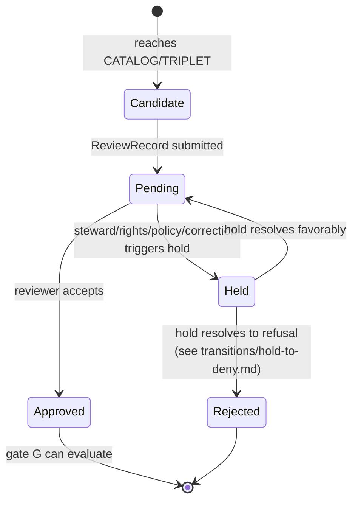

<!-- [KFM_META_BLOCK_V2]
doc_id: kfm://doc/focus-mode-state-transitions-candidate-to-hold
title: Transition — Release Candidate → HOLD
type: standard
version: v0.1
status: draft
owners: <FOCUS-MODE-DOCTRINE-OWNER> · NEEDS VERIFICATION
created: 2026-05-24
updated: 2026-05-24
policy_label: public
related:
  - docs/focus-mode/state/review-state.md
  - docs/focus-mode/state/lifecycle-states.md §3 (Gate F)
  - docs/focus-mode/state/finite-outcomes.md §4.4 (HOLD reason codes)
  - docs/focus-mode/state/README.md §9
tags: [kfm, focus-mode, state, transition, candidate, hold, review-gate, gate-F]
notes:
  - One of five prose transition specs under docs/focus-mode/state/transitions/.
  - Path placement diverges from Directory Rules v1.2 §6.7.2; tracked as OPEN-DR-09.
[/KFM_META_BLOCK_V2] -->

# Transition — Release Candidate → `HOLD`

> *Promotion paused: a release candidate at lifecycle stage `CATALOG/TRIPLET` (or release-eligible) is parked at review state `held` pending steward, rights-holder, or policy review. Promotion gate F does not pass while a hold is in effect.*

-orange)

**Status:** draft · **Owners:** `<FOCUS-MODE-DOCTRINE-OWNER>` *(NEEDS VERIFICATION)* · **Last updated:** 2026-05-24

> [!IMPORTANT]
> **This transition pauses promotion, not service.** A prior `PUBLISHED` release of the same artifact continues to serve while the new candidate is held. The held candidate produces neither `ANSWER` nor `DENY` — it is suspended in review. *(CONFIRMED — Atlas v1.1 §24.3; review-state doctrine.)*

---

## Contents

1. [Trigger conditions](#1-trigger-conditions)
2. [Pre-conditions](#2-pre-conditions)
3. [Post-conditions](#3-post-conditions)
4. [Required receipts](#4-required-receipts)
5. [Rollback target](#5-rollback-target)
6. [Diagram](#6-diagram)
7. [Resolution paths](#7-resolution-paths)
8. [Anti-patterns](#8-anti-patterns)
9. [Cross-references](#9-cross-references)

---

## 1. Trigger conditions

| Trigger | Driving state | `HOLD` reason code |
|---|---|---|
| Domain steward requested additional review before approving. | `ReviewRecord.state = pending → held` | `steward_review_pending` |
| Rights holder *(sovereignty, descendant community, license grantor)* requested review. | `ReviewRecord.state = pending → held` | `rights_holder_review_pending` |
| Policy bundle revision in flight; current evaluation deferred. | `PolicyDecision = HOLD` | `policy_review_pending` |
| Correction against a prior `PUBLISHED` release in flight; new candidate paused to keep state consistent. | `ReviewRecord.state = pending → held` | `correction_pending` |
| Gate G is blocked but recoverable *(missing rollback target, pending `CorrectionNotice` slot)*. | runtime gate signal | `release_gate_pending` |

[↑ Back to top](#top)

---

## 2. Pre-conditions

| Pre-condition | Source |
|---|---|
| Candidate exists at lifecycle stage `CATALOG/TRIPLET` or release-eligible. | `data/catalog/` / `release/candidates/<area>-focus-mode/`. |
| `ReviewRecord` for the candidate exists at state `pending`. | `ReviewRecord` carrier. |
| The held reason is documented and falls within the `HOLD` reason-code enum *(§1)*. | `PolicyDecision (HOLD)` with reason code. |
| Hold issuer's identity is recorded *(separation-of-duties applies: hold issuer ≠ author for sensitive lanes)*. | `ReviewRecord.held_by` field. |

[↑ Back to top](#top)

---

## 3. Post-conditions

| Post-condition | Carrier |
|---|---|
| `ReviewRecord.state` set to `held`. | `ReviewRecord` revision *(append-only — see [`review-state.md` §3](../review-state.md#3-forward-transitions-and-required-artifacts))*. |
| `PolicyDecision (outcome=HOLD)` issued referencing the held candidate and the reason code. | Receipt store. |
| Promotion gate F evaluation is **blocked** for this candidate until the hold resolves. | Gate runtime. |
| Prior `PUBLISHED` release of the same artifact *(if any)* continues to serve unchanged. | Public surface. |
| Runtime requests against the area surface continue to return `ANSWER` from the prior release; the new candidate is invisible to public surfaces while held. | UI state. |
| If a runtime evaluation depends specifically on the held candidate *(rare — e.g., a request that targets a not-yet-released revision)*, the runtime emits `DecisionEnvelope (outcome=HOLD)` with the same reason code. | Public surface. |

[↑ Back to top](#top)

---

## 4. Required receipts

| Receipt | Required? | Notes |
|---|---|---|
| `ReviewRecord (held)` | yes | Carries hold reason, hold issuer, timestamp. |
| `PolicyDecision (HOLD)` | yes | References the `ReviewRecord` and the candidate. |
| Linked steward/rights-holder/policy ticket | yes if applicable | Provides the external reviewer reference *(e.g., sovereignty review ticket ID)*. |
| Audit log entry | yes | Append-only entry recording the transition for replay. |
| `DecisionEnvelope (outcome=HOLD)` for runtime queries | only if a runtime request targets the held candidate | Most queries continue against the prior `PUBLISHED` release. |

[↑ Back to top](#top)

---

## 5. Rollback target

`HOLD` does not require a rollback target because it is **not a promotion** — the candidate has not moved into `PUBLISHED`. The rollback semantics:

- If the hold resolves to `approved` and gate G passes → candidate becomes `PUBLISHED`; standard rollback semantics apply via the new `ReleaseManifest`.
- If the hold resolves to `rejected` → candidate terminates; prior `PUBLISHED` release continues; no rollback artifact needed.

> [!NOTE]
> **`HOLD` is reversible by design.** A held candidate may return to `pending` *(hold resolved favorably)*, then to `approved`. The `ReviewRecord` records each state change as an append-only revision.

[↑ Back to top](#top)

---

## 6. Diagram

[↑ Back to top](#top)

---

## 7. Resolution paths

| Path | Condition | Next transition |
|---|---|---|
| `held` → `pending` | Hold reason resolved *(steward signed off, rights holder cleared, policy revision merged, correction completed)*. | Normal review continues; → `approved` or `rejected`. |
| `held` → `rejected` | Hold resolved to refusal *(rights holder denied, policy revision forbids, correction concluded that the candidate is invalid)*. | See [`hold-to-deny.md`](./hold-to-deny.md) for the resulting `DENY` path on public surfaces. |
| `held` → `held` *(self-loop, expected)* | Hold cycles through reviewers; `ReviewRecord` accumulates revisions with reason changes. | Continues until terminal. |

[↑ Back to top](#top)

---

## 8. Anti-patterns

| Anti-pattern | Why it breaks doctrine |
|---|---|
| **Hold strips prior release** — UI demotes the prior `PUBLISHED` claim when the new candidate enters `held`. | `HOLD` preserves prior surface state; the user should see no change. |
| **Hold without `PolicyDecision`** — `ReviewRecord (held)` exists but no policy receipt issued. | Promotion gate cannot enforce the hold; audit incomplete. |
| **Hold issuer = author on sensitive lane** — separation-of-duties bypassed. | Author can hold their own work indefinitely; review chain compromised. |
| **Hold reason free-form** — reason text outside the enum. | Downstream consumers can't route on the reason; metrics broken. |
| **Silent hold** — candidate disappears from the index without a held marker. | Audit cannot tell "never submitted" from "held". |

[↑ Back to top](#top)

---

## 9. Cross-references

- [`docs/focus-mode/state/review-state.md`](../review-state.md) §2–§4 — review-state lifecycle and `HOLD` semantics.
- [`docs/focus-mode/state/lifecycle-states.md`](../lifecycle-states.md) §3 — gate F (review & sensitivity).
- [`docs/focus-mode/state/finite-outcomes.md`](../finite-outcomes.md) §4.4 — `HOLD` reason codes.
- [`docs/focus-mode/state/transitions/hold-to-deny.md`](./hold-to-deny.md) — `held → rejected/DENY` resolution path.
- [`docs/focus-mode/README.md`](../../README.md) §15 — sensitivity defaults that drive most holds.

---

**Last updated:** 2026-05-24 · **Doc version:** v0.1 · **Doc status:** draft · **Path status:** PROPOSED *(OPEN-DR-09)*

[↑ Back to top](#top)
