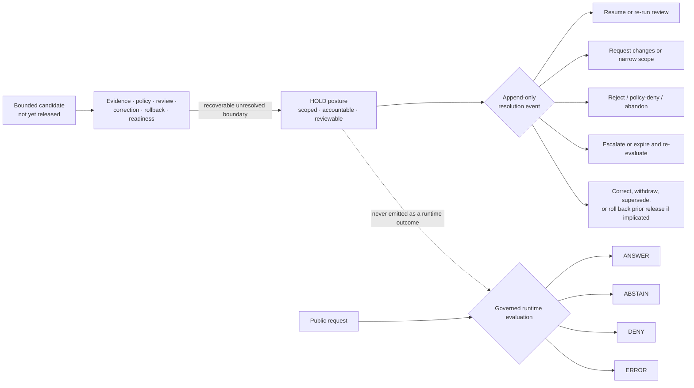

<!-- [KFM_META_BLOCK_V2]
doc_id: kfm://doc/focus-mode-state-transitions-candidate-to-hold
title: Candidate-to-HOLD Review and Promotion-Readiness Boundary
type: standard; focus-mode; system-state; review; promotion-readiness; transition; compatibility-document
version: v1.0
status: draft; repository-grounded; review-pause; non-runtime; non-executable; non-release; non-publication
owner: "@bartytime4life via CODEOWNERS; accountable review, policy, evidence, release, correction, rollback, and independent publication authority remain NEEDS VERIFICATION"
created: 2026-05-24
updated: 2026-08-22
policy_label: public; documentation; focus-mode; review; hold; promotion-readiness; lifecycle; evidence; policy; correction; rollback; cite-or-abstain; fail-closed
owning_root: docs/
responsibility: >-
  Explain the bounded candidate-to-HOLD review and promotion-readiness posture,
  its minimum accountability information, its public runtime projection, its
  relationship to final-readiness checks, and its correction and rollback
  implications without defining or applying a machine transition.
authority: >-
  Human-readable reconciliation and maintenance guidance only. Runtime outcomes,
  review semantics and shape, policy decisions, evidence resolution, promotion,
  release, correction, withdrawal, rollback, and public serving remain in their
  owning responsibility roots and accountable decision paths.
current_path: docs/focus-mode/state/transitions/candidate-to-hold.md
canonical_relationship: >-
  Same-path documentation correction inside the repository-present singular
  Focus compatibility lane. Accepted Directory Rules v2 supports PLACE for this
  human-readable document under docs/. It does not settle the mixed state tree's
  final split, migration, transition carrier, or executable state-machine home.
truth_posture: >-
  CONFIRMED current main, the prior v0.1 target blob, the repository-grounded
  parent transition boundary, current Focus Mode review, lifecycle, and finite
  outcome documents, accepted ADR-0029, adopted Directory Rules v2, the current
  RuntimeResponseEnvelope four-value outcome enum, and the current proposed
  ReviewRecord schema's three decision values / PROPOSED a candidate HOLD as a
  recoverable, fail-closed review or promotion-readiness pause with explicit
  scope, basis, accountable owner, clearance conditions, review timing, public
  projection, and append-only resolution lineage / CONFLICTED legacy v0.1
  claims that HOLD is a runtime outcome, that ReviewRecord has a held state, that
  PolicyDecision necessarily has a HOLD outcome, that one fixed reason-code enum
  exists, and that a prior release always continues to answer / UNKNOWN any
  production transition operator, authoritative hold carrier, accepted reason
  registry, end-to-end policy and evidence services, accountable reviewer
  assignments, release correction propagation, rollback execution, deployment,
  and public parity / NEEDS VERIFICATION exact candidate identity contract,
  review vocabulary convergence, policy outcome vocabulary, expiry and
  escalation rules, final gate authority, consumer mappings, and independent
  human review.
evidence_snapshot:
  repository: bartytime4life/Kansas-Frontier-Matrix
  base_ref: main
  base_commit: 4712e52f10a6c8f688cc1e158b7e010888fb4102
  target_prior_blob: 9d47a70af7aa76ca518cf19b457b1b49d77c0cff
  transitions_readme_blob: 220f7d6b7c2cd486267490a986d943a509d54347
  parent_state_readme_blob: f6eca0386c8cc6df249d85d15d33234ecbb81b34
  review_state_blob: 52aabf73e93a438a2116d5e28bc26a353da4c003
  lifecycle_states_blob: 8c39b4b5f211ef23c0ce51e2a83c1472dde82046
  finite_outcomes_blob: bd188a69890f43698422b2bd27c76c74958c5feb
  runtime_response_schema_blob: 8b86e7db8b18b65a56a4e639dfc54e1b2db93155
  review_record_schema_blob: fe2f2223af46481e7fb19b0baa94f62ce9c6c855
  directory_rules_blob: fd49a0b83e55cef52c1124281f093e263526898d
  adr_0029_blob: a4de0d7a96b78da59cfc499d1025e1508afd8dd9
inspection_boundary: >-
  Current-session GitHub reads covered the complete target, the parent transition
  and state boundaries, Focus Mode review, lifecycle, and finite-outcome
  guidance, the current runtime and review schemas, the ReviewRecord semantic
  contract, accepted Directory Rules authority, contribution requirements, open
  pull-request overlap, and current main. No evidence resolver, policy engine,
  reviewer authentication, promotion operator, release object, correction
  propagation, rollback mechanism, deployment, or public endpoint was exercised.
related:
  - ./README.md
  - ../README.md
  - ../review-state.md
  - ../lifecycle-states.md
  - ../finite-outcomes.md
  - ./hold-to-deny.md
  - ../../../doctrine/directory-rules.md
  - ../../../adr/ADR-0029-adopt-directory-governance-standard-v2.md
  - ../../../architecture/publication/promotion-gates.md
  - ../../../../contracts/governance/ReviewRecord.md
  - ../../../../schemas/contracts/v1/governance/review_record.schema.json
  - ../../../../contracts/runtime/runtime_response_envelope.md
  - ../../../../schemas/contracts/v1/runtime/runtime_response_envelope.schema.json
  - ../../../../tools/validators/validate_runtime_response_envelope.py
  - ../../../../CONTRIBUTING.md
tags: [kfm, focus-mode, state, transition, candidate, hold, review, promotion-readiness, runtime-projection, correction, rollback, compatibility, non-publication]
notes:
  - "v1.0 replaces the v0.1 runtime-HOLD model with a repository-grounded review and promotion-readiness boundary."
  - "The historical anchors for trigger conditions, pre-conditions, post-conditions, required receipts, rollback target, diagram, resolution paths, anti-patterns, and cross-references are retained."
  - "HOLD is not a current RuntimeResponseEnvelope outcome. Public projections remain ANSWER, ABSTAIN, DENY, or ERROR."
  - "The exact hold carrier, policy vocabulary, reason-code registry, review expiry, and executable transition remain proposed or unverified."
  - "No transition, review approval, policy decision, promotion, release, correction, rollback, deployment, or publication is performed by this document."
[/KFM_META_BLOCK_V2] -->

# Candidate → `HOLD` Review and Promotion-Readiness Boundary

> **Purpose.** Define the smallest safe documentation contract for pausing a
> not-yet-released candidate when a recoverable review, evidence, policy,
> sensitivity, correction, rollback, or promotion-readiness prerequisite remains
> unresolved.

> [!IMPORTANT]
> **`HOLD` is not a current client-facing runtime outcome.** The repository-present
> `RuntimeResponseEnvelope` schema enumerates exactly `ANSWER`, `ABSTAIN`,
> `DENY`, and `ERROR`. A held candidate must be projected through one of those
> four outcomes when a public request is evaluated.

> [!WARNING]
> **A candidate hold does not automatically preserve, withdraw, or validate a
> prior release.** Any already released artifact must be evaluated independently.
> When the hold's cause also implicates that release, use the governed correction,
> withdrawal, revocation, supersession, or rollback path rather than continuing to
> serve it by assumption.

> [!CAUTION]
> **This file is not an executable state machine or decision record.** It cannot
> create a hold, authenticate a reviewer, resolve evidence, evaluate policy, block
> promotion, expose a candidate, issue a release, or change public behavior.

> [!NOTE]
> **Placement is bounded.** Accepted Directory Rules v2 supports this same-path
> human-document correction under `docs/`. The mixed state tree's final split,
> move, transition carrier, and executable ownership remain `HOLD`.

**Quick navigation:** [Status](#status-and-evidence-boundary) ·
[Trigger conditions](#1-trigger-conditions) ·
[Pre-conditions](#2-pre-conditions) ·
[Post-conditions](#3-post-conditions) ·
[Accountability records](#4-required-receipts) ·
[Rollback](#5-rollback-target) ·
[Diagram](#6-diagram) ·
[Resolution paths](#7-resolution-paths) ·
[Anti-patterns](#8-anti-patterns) ·
[References](#9-cross-references) ·
[Validation](#10-validation-and-acceptance) ·
[Open work](#11-open-questions-and-adr-triggers) ·
[Maintenance](#12-maintenance-correction-and-documentation-rollback)

---

## Status and evidence boundary

| Question | Current bounded answer | Truth label |
|---|---|---|
| What state family does this transition belong to? | Review, workflow, and promotion-readiness. It may reference lifecycle and release state but does not itself change either. | `CONFIRMED` current documentation boundary |
| Is `HOLD` a current runtime outcome? | No. The current runtime schema permits only `ANSWER`, `ABSTAIN`, `DENY`, and `ERROR`. | `CONFIRMED` machine shape |
| Does the current ReviewRecord schema contain `state = held`? | No. Its proposed machine shape contains `decision = approve | reject | request_changes`; the broader semantic contract and legacy state model are not yet converged. | `CONFIRMED` schema; convergence `NEEDS VERIFICATION` |
| Does an authoritative `PolicyDecision(outcome=HOLD)` contract govern this file? | No such exact current contract or enum was verified in this slice. Policy may cause a pause, but the carrier and vocabulary remain separate decisions. | `UNKNOWN` / `NEEDS VERIFICATION` |
| Are the legacy hold reason codes authoritative? | No. They remain useful lineage candidates; the runtime schema currently leaves `reason_code` as a string and no accepted hold-reason registry was verified. | `LINEAGE` / `PROPOSED` |
| Does a hold prove that a candidate is otherwise release-ready? | No. A hold may coexist with other failed or unrun readiness checks. | `CONFIRMED` boundary |
| Does this document apply a hold? | No. It changes Markdown only. | `CONFIRMED` |
| Is end-to-end hold behavior implemented? | No production transition operator, policy service, review authority, release path, correction propagation, or public consumer was exercised here. | `UNKNOWN` |

Repository presence proves that bytes exist. It does not prove semantic
acceptance, policy permission, accountable review, transition execution, release
eligibility, deployment, or public parity.

### State-family separation

| Family | Representative values or records | Boundary for this document |
|---|---|---|
| Runtime response | `ANSWER`, `ABSTAIN`, `DENY`, `ERROR` | Current four-value schema controls client-facing compatibility |
| Review and workflow | review requested, changes requested, pending authority, held, escalated, resolved | Exact accepted carrier and vocabulary remain unverified |
| Lifecycle | `RAW`, `WORK`, `QUARANTINE`, `PROCESSED`, `CATALOG`, `TRIPLET(S)`, `PUBLISHED` | A hold does not move an object between lifecycle phases |
| Promotion readiness | check results, blocked state, ready-not-applied posture | Readiness is not approval, promotion, release, or publication |
| Policy and sensitivity | allow, deny, restrict, redact, generalize, stage, delay, or other governed decision | Policy authority remains outside this file |
| Release and correction | released, superseded, withdrawn/revoked, corrected, rolled back | A candidate hold does not silently alter an existing release |
| Repository delivery | branch, commit, pull request, merge, tag | Repository state is not a KFM lifecycle or release state |

[Back to top](#top)

---

## 1. Trigger conditions

A candidate may enter a documented `HOLD` posture only when the unresolved
condition is **bounded, recoverable or reviewable, attributable, and capable of
clearance or explicit disposition**. `HOLD` is not a substitute for indefinite
uncertainty, rejection, denial, or an operational error.

### Admission rule

All of the following should be true before recording a candidate hold:

1. The exact candidate and held scope can be identified.
2. Proceeding would cross an unresolved trust, review, or readiness boundary.
3. The unresolved condition is potentially remediable, reviewable, or
   dispositioned by an accountable role.
4. The basis for pausing can be referenced without exposing restricted material.
5. Clearance conditions or an escalation path can be stated.
6. Current public behavior and prior-release implications can be evaluated
   separately.
7. The hold can be revisited through a review-by, expiry, or event-driven posture.
8. Append-only resolution lineage can be preserved.

If those conditions cannot be met, narrow the candidate, quarantine the material,
request changes, reject it, deny exposure, abstain from the claim, or report an
error as the owning contract and policy require.

### Typical trigger classes

| Trigger class | Example unresolved condition | Why a hold may be appropriate | Boundary |
|---|---|---|---|
| Accountable review | Required reviewer role, authority, or separation-of-duties evidence is unresolved | Review can resume after an accountable assignment or decision | Do not invent a reviewer or treat CODEOWNERS as a ReviewRecord |
| Evidence and citation closure | EvidenceRef cannot yet resolve to the required EvidenceBundle, citation support is incomplete, or material evidence is conflicted | The candidate can remain non-public while support is repaired or narrowed | Public projection is normally `ABSTAIN`, not runtime `HOLD` |
| Rights, sovereignty, consent, or sensitivity | Terms, community authority, consent, exact-location exposure, or redaction posture is unresolved | Fail closed while qualified review determines a safe disposition | A confirmed prohibition should move toward policy denial, not an endless hold |
| Policy evaluation | Applicable policy is changing, unavailable, conflicted, or awaiting accountable interpretation | The candidate must not advance without an admissibility decision | Mechanism failure may project `ERROR`; prohibition may project `DENY` |
| Correction or supersession dependency | The candidate depends on an unresolved correction, supersession, withdrawal, or lineage decision | The candidate can be paused until the controlling lineage is settled | Re-evaluate any prior public release separately |
| Rollback or correction readiness | A release candidate lacks a credible correction or rollback path required for its risk | The candidate may be remediated before any promotion is applied | Do not claim that “not yet published” makes rollback irrelevant |
| Validation or proof closure | A recoverable identity, integrity, geometry, temporal, proof, catalog, or review check has not passed | Work can return to validation after the defect is fixed | Record the exact failed or unrun check; do not hide it behind “HOLD” |
| Workflow or placement authority | The owning authority, target path, migration, or consumer impact is unresolved | The repository change may be paused without asserting a machine transition | Directory-placement HOLD is not a runtime outcome |

### Legacy reason-code lineage

The prior v0.1 document named the following strings. They may inform a future
controlled vocabulary, but this revision does **not** present them as an accepted
enum:

| Legacy candidate | Bounded interpretation | Current status |
|---|---|---|
| `steward_review_pending` | Accountable domain or system review has not completed | `LINEAGE`; registry `NEEDS VERIFICATION` |
| `rights_holder_review_pending` | Rights, sovereignty, consent, or community-authority review has not completed | `LINEAGE`; terminology and reviewer authority `NEEDS VERIFICATION` |
| `policy_review_pending` | Applicable policy or accountable policy interpretation is unresolved | `LINEAGE`; exact policy carrier `NEEDS VERIFICATION` |
| `correction_pending` | A controlling correction or supersession decision remains open | `LINEAGE`; relation to prior release must be explicit |
| `release_gate_pending` | A named readiness prerequisite remains incomplete | `LINEAGE`; too broad unless the exact check and basis are recorded |

Reason text may be necessary for humans, but free-form prose alone is not enough
for durable routing, metrics, replay, or closure. A future registry should define
stable IDs, owners, allowed state families, required references, sensitivity
handling, expiry behavior, and compatibility rules.

[Back to top](#top)

---

## 2. Pre-conditions

The following are **minimum information requirements**, not claims about an
already accepted JSON shape.

| Requirement | Minimum question to answer | Failure behavior |
|---|---|---|
| Candidate identity | Which immutable candidate, revision, digest, or subject reference is paused? | Do not apply an unscoped or floating hold |
| Hold scope | Is the entire candidate held, or only a claim, asset, geography, time range, field, layer, or promotion attempt? | Narrow or reject an ambiguous hold |
| Current lifecycle posture | Which lifecycle phase and intended next transition are relevant? | Do not infer `CATALOG/TRIPLET` merely from the word “candidate” |
| Basis | Which evidence, validation, policy, review, rights, sensitivity, correction, or rollback issue requires the pause? | Cite the basis or abstain from asserting it |
| Accountable authority | Which role may issue, maintain, clear, escalate, or convert the hold? | Keep authority `NEEDS VERIFICATION`; do not invent identity |
| Clearance conditions | What evidence or decision would allow the hold to resolve? | An uncloseable hold is not an actionable transition |
| Timing posture | When did the hold begin, and when or on which event must it be reviewed again? | Escalate or re-evaluate stale holds; do not silently persist |
| Public projection | What can current public requests safely do while the candidate is held? | Use the four runtime outcomes; never expose the held candidate directly |
| Prior-release posture | Is there an independently valid current release, and does the hold's basis implicate it? | Do not assume continuation or withdrawal |
| Correction and rollback impact | What correction, supersession, withdrawal, rollback, or no-op condition applies? | Fail closed before a release-affecting transition |
| Resolution lineage | Where will the eventual resume, change request, escalation, rejection, correction, or expiry result be recorded? | Do not overwrite the original hold record |

### Candidate identity boundary

“Candidate” is used here as a **review and promotion-readiness role**, not as a
new lifecycle stage. A candidate may refer to a proposed release, claim set,
layer, artifact family, correction, or other bounded subject. Its authoritative
identity and schema remain `NEEDS VERIFICATION`.

A candidate that targets promotion from `CATALOG/TRIPLET(S)` to `PUBLISHED`
must still satisfy the normal lifecycle, evidence, policy, review, release,
correction, and rollback requirements. The hold neither skips nor satisfies those
requirements.

### Review vocabulary conflict

Current repository evidence exposes three different surfaces:

- the proposed machine ReviewRecord schema with
  `decision = approve | reject | request_changes`;
- the broader semantic ReviewRecord contract with additional proposed
  dispositions;
- the legacy sequence `draft → pending → held / approved / rejected →
  superseded`.

This file therefore does not assert `ReviewRecord.state = held`. A future
accepted contract, schema, migration, fixtures, validator, and consumer update
must resolve the vocabulary before “held” becomes machine-authoritative.

[Back to top](#top)

---

## 3. Post-conditions

A valid candidate-to-HOLD event should leave the repository or governed system in
the following bounded posture. These are semantic expectations, not proof that a
production operator exists.

| Post-condition | Required meaning | Non-effect |
|---|---|---|
| Candidate remains non-public | The held candidate is not exposed through ordinary public clients or treated as released truth | No lifecycle promotion is applied |
| Advancement is blocked | The exact review or readiness attempt cannot advance until the hold resolves or converts to another disposition | A Markdown label does not enforce the block |
| Hold accountability is visible to authorized maintainers | Scope, basis, authority, timing, clearance conditions, and references are inspectable at the permitted access level | Sensitive reasons are not disclosed publicly by default |
| Existing validation results remain truthful | Failed, skipped, stale, and passed checks retain their actual outcomes | `HOLD` must not turn failures into passes |
| Public runtime remains finite | Any client-facing evaluation emits `ANSWER`, `ABSTAIN`, `DENY`, or `ERROR` | No `DecisionEnvelope(outcome=HOLD)` or fifth runtime state |
| Prior release is independently evaluated | Any current release is retained, corrected, withdrawn, superseded, or rolled back according to its own evidence and policy state | Continuation is not automatic |
| Resolution remains append-only | Later events reference the hold and record how it closed or changed | Do not mutate history to make the hold disappear |
| Promotion remains unapplied | Readiness, approval, merge, or a green check does not itself publish | No release, deployment, or publication authority is created |

### Public runtime projection

When a request intersects a held candidate, the runtime must evaluate the
released and policy-permitted evidence actually available to that request.

| Situation at request time | Bounded public projection | Why |
|---|---|---|
| The request depends on the held, unreleased candidate and no independently sufficient released evidence exists | `ABSTAIN` | Support is incomplete, unresolved, stale, conflicted, or unreleased |
| Policy, rights, sensitivity, access, or precision rules prohibit the requested exposure | `DENY` | Exposure is disallowed, not merely pending |
| Evidence, policy, citation, or transition machinery fails | `ERROR` | Operational failure must not degrade to allow or invented truth |
| An independently valid current release still supports the request and is not implicated by the hold | `ANSWER`, after normal evidence, policy, freshness, correction, and citation checks | The answer comes from the valid release, not from the held candidate |
| The hold's basis also undermines the current release | Usually `ABSTAIN`, `DENY`, or `ERROR` while correction/withdrawal/rollback proceeds | Prior public state must not be preserved by assumption |

A UI may display a maintainer-facing “held” badge or workflow status when
authorized, but that display must not masquerade as a runtime outcome, policy
decision, release state, or public explanation of sensitive reasons.

### Relationship to final-readiness checks

The current Focus Mode lifecycle documentation names a fixture-first A–G
readiness sequence:

| Gate | Current documentation name | Hold relationship |
|---|---|---|
| A | `identity_and_closure` | A recoverable identity or closure defect may block advancement |
| B | `asset_integrity` | Integrity failure remains a failure; a hold may preserve the candidate for repair |
| C | `geometry_and_crs` | Geometry or CRS defects may require correction before review resumes |
| D | `temporal_semantics` | Missing or invalid time semantics may require repair or narrowing |
| E | `rights_and_sensitivity` | Unresolved rights or sensitivity commonly requires fail-closed review |
| F | `proof_and_catalog_support` | Missing proof or catalog support blocks readiness |
| G | `review_and_rollback` | Incomplete accountable review or rollback support blocks readiness |

Do not describe Gate F as “review and sensitivity,” as v0.1 did. Do not use a
letter alone when the name, version, or broader promotion-gate authority could
drift. Record the exact check, version, result, evidence, and owning authority.

A readiness result of `BLOCKED` is not itself a runtime `DENY`, a policy
decision, a candidate rejection, or a release withdrawal. Likewise,
`APPROVE_READY` is not review approval, transition application, promotion,
release, deployment, or publication.

[Back to top](#top)

---

## 4. Required accountability records

The v0.1 heading used “required receipts,” but current repository evidence does
not establish one accepted candidate-HOLD receipt schema. This section therefore
defines the **information and object-family responsibilities** that a governed
implementation must close. It does not invent mandatory fields.

| Accountability need | Likely owning object family | Minimum content | Status |
|---|---|---|---|
| Candidate reference | Candidate, release-candidate, claim, layer, or artifact identity | Stable subject reference, version or digest, intended transition, scope | Exact carrier `NEEDS VERIFICATION` |
| Hold event | Review, workflow, or transition event | Hold scope, basis, issuer role, start, review timing, clearance conditions | Semantic requirement `PROPOSED` |
| Review accountability | `ReviewRecord` or accepted successor | Reviewer role, disposition, reasons, obligations, subject, timestamp | Current schema does not encode `held` |
| Policy accountability | `PolicyDecision` or accepted successor | Applicable policy, evaluated subject, result, obligations, redaction/generalization, authority | Exact HOLD vocabulary `NEEDS VERIFICATION` |
| Evidence basis | `EvidenceRef` / `EvidenceBundle` and validation references | Support for the issue and any clearance evidence | Must not expose restricted evidence |
| Validation snapshot | Validator or promotion-readiness records | Exact gate/check name, version, outcome, inputs, and result | `PASS`, `FAIL`, and skipped state remain distinct |
| Audit and lineage | Append-only event or receipt family | Previous state/reference, event identity, actor role, time, next review, resolution reference | Production implementation `UNKNOWN` |
| Prior-release assessment | Release/correction accountability object | Whether a current release exists, whether it remains valid, and the basis | Required when prior public state exists |
| Correction or rollback reference | Correction notice, withdrawal/revocation record, rollback card, or explicit no-public-change finding | Public impact, target, action, owner, and verification | Required in proportion to consequence |
| Resolution event | Review, policy, correction, transition, or supersession record | How the hold ended, evidence added, decision made, remaining obligations | Append-only relationship required |

### Carrier rules

1. Keep receipts, reviews, policy decisions, proofs, release manifests,
   corrections, rollback records, and published artifacts as distinct object
   families.
2. Do not use the generated-work receipt for this Markdown edit as the operational
   candidate-HOLD record.
3. Do not let an issue, pull request, badge, comment, or CI check stand in for an
   accountable review or policy decision.
4. Do not place sensitive hold details in public metadata merely to make the
   transition inspectable; record a public-safe reason category and protect the
   underlying basis as policy requires.
5. Use deterministic identity and replayable references where the adopted
   contracts require them.
6. Preserve the original event and append a resolution; do not overwrite the
   historical reason or timestamp.

### Generated-work receipt boundary

This documentation update has its own AI generated-work receipt under
`data/receipts/generated/`, as required by `CONTRIBUTING.md`. That receipt proves
only authoring provenance and listed validation. It does not create a review
record, policy decision, hold event, promotion decision, release manifest,
correction notice, rollback card, or publication authority.

[Back to top](#top)

---

## 5. Rollback target

### Candidate and public-state semantics

A candidate-only hold may leave public bytes unchanged, but that fact must be
**demonstrated for the scoped candidate**, not assumed from the word “HOLD.”

| Condition | Required rollback or correction posture |
|---|---|
| Candidate was never released and the hold changes no public artifact, index, cache, search result, or API binding | Record the prior candidate state/reference and an explicit no-public-change finding; public release rollback may be not applicable |
| Candidate metadata was exposed to authorized review tooling only | Preserve the review/audit prior state and restore or supersede it through the governed workflow if the hold was erroneous |
| A current public release exists and remains independently valid | Continue only after normal evidence, policy, freshness, correction, and release evaluation; the candidate hold is not the justification |
| The hold's basis implicates a current public release | Enter correction, withdrawal/revocation, supersession, or rollback handling; do not continue serving by default |
| A held candidate later becomes ready | Re-run all applicable readiness, evidence, policy, review, correction, and rollback checks; do not resume from stale results |
| A hold was issued incorrectly | Append a correcting or superseding event, preserve lineage, and re-evaluate the candidate; do not delete history |

### What this transition must not do

- It must not copy or move the candidate into `PUBLISHED`.
- It must not silently rebind public clients to a different release.
- It must not erase a prior release or correction record.
- It must not claim that a rollback target is unnecessary merely because
  promotion has not yet been applied.
- It must not reuse a stale rollback target after the candidate, evidence,
  policy, review, or public surface changes.
- It must not convert repository rollback into KFM release rollback.

### Documentation rollback

Before merge, close the draft pull request and abandon the task branch; branch
deletion is a separate repository action. After an authorized merge, revert the
single documentation commit or restore the prior blob
`9d47a70af7aa76ca518cf19b457b1b49d77c0cff`, remove or supersede the paired
generated-work receipt consistently, re-run the same validation, and disclose why
the stale runtime-HOLD model was restored or replaced.

A Git revert changes repository bytes. It does not reverse a runtime transition,
release, correction, deployment, or publication event.

[Back to top](#top)

---

## 6. Diagram

This diagram separates the review/promotion pause from public runtime projection.
It is explanatory, not executable.

```mermaid
flowchart LR
  candidate["Bounded candidate<br/>not yet released"]
  checks["Evidence · policy · review ·<br/>correction · rollback · readiness"]
  hold["HOLD posture<br/>scoped · accountable · reviewable"]
  resolution{"Append-only<br/>resolution event"}
  resume["Resume or re-run review"]
  change["Request changes or narrow scope"]
  reject["Reject / policy-deny / abandon"]
  escalate["Escalate or expire and re-evaluate"]
  correct["Correct, withdraw, supersede,<br/>or roll back prior release if implicated"]
  public_request["Public request"]
  runtime{"Governed runtime evaluation"}
  answer["ANSWER"]
  abstain["ABSTAIN"]
  deny["DENY"]
  error["ERROR"]

  candidate --> checks
  checks -->|"recoverable unresolved boundary"| hold
  hold --> resolution
  resolution --> resume
  resolution --> change
  resolution --> reject
  resolution --> escalate
  resolution --> correct

  public_request --> runtime
  runtime --> answer
  runtime --> abstain
  runtime --> deny
  runtime --> error

  hold -. "never emitted as a runtime outcome" .-> runtime
```

The diagram intentionally contains no direct arrow from `HOLD` to `PUBLISHED`.
Any later promotion requires its own governed readiness, decision, release,
correction, and rollback path.

[Back to top](#top)

---

## 7. Resolution paths

A hold closes through a new, attributable event. The original hold record remains
part of lineage.

| Resolution | Minimum closure evidence | Resulting posture | Public implication |
|---|---|---|---|
| Resume review | Clearance conditions satisfied; evidence and decision references added; stale checks re-run | Candidate returns to the appropriate review or readiness step | No automatic public change |
| Request changes | Specific defects and obligations recorded with accountable owner and scope | Candidate returns to bounded work or quarantine | Public requests continue through normal four-outcome evaluation |
| Narrow candidate | Unsupported or sensitive scope removed or generalized with a transform record where required | New or revised candidate identity may be needed | Only released, public-safe scope may answer |
| Reviewer abstains or escalates | Reviewer limitation or authority gap recorded; next accountable route identified | Hold continues, converts, or expires under governed rules | Usually `ABSTAIN` for dependent requests |
| Policy permits with obligations | Policy basis and obligations recorded; required transforms and review complete | Candidate may re-enter readiness checks | No release until all other gates close |
| Policy prohibits | Policy basis and subject scope recorded | Candidate is denied, rejected, quarantined, or abandoned according to the owning contract | Dependent public request normally `DENY` |
| Evidence remains insufficient | Missing or conflicting support cannot be closed within scope | Candidate is narrowed, abandoned, or left unsupported | Dependent public request normally `ABSTAIN` |
| Operational mechanism fails | Resolver, policy, validator, review, or release machinery cannot complete | Hold may remain internally while the failure is remediated | Dependent public request normally `ERROR` |
| Candidate rejected or abandoned | Accountable disposition and unresolved obligations recorded | Candidate stops advancing; history retained | Does not by itself invalidate a prior release |
| Hold expires | Expiry or review-by condition reached; current evidence and policy re-evaluated | Renew with new basis, convert, or close; no silent rollover | Runtime remains one of the four finite outcomes |
| Prior release implicated | Correction, withdrawal/revocation, supersession, or rollback decision recorded | Separate public-state transition begins | Public behavior follows that governed transition |
| Candidate superseded | New candidate identity and lineage relation recorded | Old candidate remains historical and non-public | New candidate starts its own checks |

### Relationship to `hold-to-deny.md`

[`hold-to-deny.md`](./hold-to-deny.md) is retained as a sibling lineage
specification. Its current v0.1 wording may also treat `HOLD` as a runtime
outcome and must not be used to expand the runtime enum. A future bounded update
should reconcile it with the four-outcome runtime contract, accepted review and
policy vocabulary, and the distinction between candidate rejection and public
`DENY`.

### Self-loop rule

A hold may remain open across review events, but each material change in reason,
scope, owner, clearance conditions, evidence, policy, timing, or public
implication should produce a new attributable revision or linked event. “Still
held” is not permission to mutate the original record or reset the clock
silently.

[Back to top](#top)

---

## 8. Anti-patterns

| Anti-pattern | Why it breaks KFM boundaries | Safe correction |
|---|---|---|
| `DecisionEnvelope(outcome=HOLD)` | Adds a fifth runtime outcome not present in the current schema | Project through `ANSWER`, `ABSTAIN`, `DENY`, or `ERROR` |
| `ReviewRecord.state = held` presented as current machine fact | The current proposed schema has no `state` field and a different decision vocabulary | Label the legacy model as lineage and resolve contract/schema migration separately |
| `PolicyDecision(outcome=HOLD)` presented as verified | Exact policy carrier and enum were not verified | Cite the actual policy record when one exists; otherwise mark it proposed |
| “Gate F = review and sensitivity” | Current Focus Mode documentation maps rights/sensitivity to E, proof/catalog to F, review/rollback to G | Record gate letter, name, version, exact result, and authority |
| Automatic prior-release `ANSWER` | A hold may expose a defect that also invalidates the current release | Re-evaluate the release independently and enter correction handling when implicated |
| Automatic prior-release withdrawal | A candidate pause does not itself revoke a released artifact | Require the separate correction, withdrawal, revocation, supersession, or rollback decision |
| Hold reason as unrestricted prose only | Cannot support stable routing, compatibility, metrics, or closure | Use a controlled category plus bounded explanation and protected evidence |
| Hold without scope | Blocks unrelated claims, assets, geographies, or time ranges | Identify the smallest exact held subject |
| Hold without accountable owner or clearance conditions | Becomes indefinite backlog storage rather than a governed pause | Record responsible role, review timing, and closure conditions |
| Hold without public projection | Public clients may leak a candidate or invent a fifth state | Define the four-outcome projection and prior-release assessment |
| Hold hides failed checks | Converts `FAIL`, skipped, or stale evidence into ambiguous workflow status | Preserve every underlying result and reason |
| Hold equals approval-ready | A pause says nothing about other gates or review completion | Re-run all applicable checks after resolution |
| Pull request or issue equals hold decision | Repository collaboration is not review, policy, lifecycle, or release authority | Use the accepted accountability objects and reviewers |
| Delete the hold after resolution | Breaks replay, audit, correction, and accountability | Append a resolution or supersession reference |
| Publicly disclose sensitive hold details | Can expose protected locations, rights claims, personal data, or security information | Publish only a safe category and restrict the underlying basis |
| Treat generated-work receipt as operational hold receipt | Confuses AI authoring provenance with domain governance | Keep generated receipt, review record, policy decision, and release objects distinct |

[Back to top](#top)

---

## 9. Cross-references

### Current repository guidance

- [`transitions/README.md`](./README.md) — directory-level transition-family,
  runtime-envelope, validation, and migration boundary.
- [`state/README.md`](../README.md) — parent Focus Mode state compatibility and
  mixed-authority boundary.
- [`review-state.md`](../review-state.md) — current ReviewRecord conflict,
  review dispositions, HOLD semantics, runtime projection, and resolution
  guidance.
- [`lifecycle-states.md`](../lifecycle-states.md) — lifecycle spine,
  final-readiness checks, blocked versus ready-not-applied posture, and
  transition-application hold.
- [`finite-outcomes.md`](../finite-outcomes.md) — current four runtime outcomes
  and legacy reason-code lineage.
- [`hold-to-deny.md`](./hold-to-deny.md) — sibling lineage specification;
  runtime-HOLD wording remains conflicted and requires its own bounded update.

### Governing and machine surfaces

- [Accepted ADR-0029](../../../adr/ADR-0029-adopt-directory-governance-standard-v2.md)
  — adopts Directory Rules v2 and the writable doctrine path.
- [Directory Rules v2](../../../doctrine/directory-rules.md) — responsibility-root
  placement and finite placement outcomes.
- [ReviewRecord semantic contract](../../../../contracts/governance/ReviewRecord.md)
  — proposed review meaning and wider disposition vocabulary.
- [ReviewRecord JSON Schema](../../../../schemas/contracts/v1/governance/review_record.schema.json)
  — current proposed machine shape with three decisions and no held state.
- [RuntimeResponseEnvelope semantic contract](../../../../contracts/runtime/runtime_response_envelope.md)
  — finite client-facing response meaning.
- [RuntimeResponseEnvelope JSON Schema](../../../../schemas/contracts/v1/runtime/runtime_response_envelope.schema.json)
  — current machine enum `ANSWER | ABSTAIN | DENY | ERROR`.
- [Runtime response validator](../../../../tools/validators/validate_runtime_response_envelope.py)
  — bounded schema/semantic checks when executed.
- [Promotion-gates documentation](../../../architecture/publication/promotion-gates.md)
  — broader publication-gate guidance; authority and vocabulary must be
  reconciled before operational use.
- [`CONTRIBUTING.md`](../../../../CONTRIBUTING.md) — documentation validation,
  generated-work receipt, review, and rollback requirements.

### Authority order for a concrete transition

1. Enforced platform and repository controls.
2. Accepted ADRs and adopted doctrine applicable to the transition.
3. Accepted semantic contracts.
4. Current machine schemas and policy.
5. Current evidence, review, validation, release, correction, and rollback
   records for the exact subject.
6. Executable implementation and current runtime evidence.
7. This explanatory document.

When those sources conflict, do not flatten the disagreement. Preserve the
current safe boundary, label the conflict, and require the appropriate accepted
decision and migration.

[Back to top](#top)

---

## 10. Validation and acceptance

### Documentation acceptance checks

| Check | Expected result for this revision |
|---|---|
| One metadata block and one H1 | Required |
| Historical anchor compatibility | `top`, `1-trigger-conditions`, `2-pre-conditions`, `3-post-conditions`, `4-required-receipts`, `5-rollback-target`, `6-diagram`, `7-resolution-paths`, `8-anti-patterns`, and `9-cross-references` retained |
| Balanced Markdown fences and HTML anchors | Required |
| Repository-relative links | Resolve at proposed head |
| Runtime outcome vocabulary | Exactly `ANSWER`, `ABSTAIN`, `DENY`, `ERROR`; no runtime `HOLD` |
| Review vocabulary | Current schema conflict disclosed; no invented held field |
| Policy vocabulary | No unverified `PolicyDecision(HOLD)` claim |
| Reason codes | Legacy strings labeled lineage, not current enum |
| Prior release | Independently evaluated; no automatic answer or withdrawal |
| Lifecycle and readiness | HOLD does not promote; gate names not silently reassigned |
| Security and sensitivity | No secrets, private payloads, precise sensitive locations, or protected hold details introduced |
| Generated receipt | Present under `data/receipts/generated/`, hashes the final artifact, and keeps human review pending |
| Final newline and whitespace | Required |
| Exact branch diff | Limited to this document and its generated-work receipt |

### Semantic scenario matrix

| Scenario | Expected internal posture | Expected runtime projection | Acceptance statement |
|---|---|---|---|
| Missing accountable review for an unreleased candidate | Candidate may be held | `ABSTAIN` when the request depends on it | No runtime `HOLD` |
| Rights review unresolved | Fail closed and hold or quarantine internally | `ABSTAIN` or `DENY` according to current policy basis | Do not expose sensitive reason details |
| Policy explicitly prohibits exposure | Convert to policy-governed denial/rejection as applicable | `DENY` | Do not leave a prohibition in indefinite HOLD |
| Evidence resolver unavailable | Internal workflow may remain paused | `ERROR` | Never fall back to `ANSWER` |
| Candidate proof/catalog support fails | Preserve `FAIL` and block advancement | Usually `ABSTAIN` for dependent claims | HOLD must not mask the failed gate |
| Prior release remains current, supported, policy-safe, and unrelated to hold cause | Candidate remains held | `ANSWER` may continue after normal evaluation | Answer is supported by the release, not the hold |
| Hold cause also undermines prior release | Hold candidate and open correction handling | `ABSTAIN`, `DENY`, or `ERROR` as appropriate | No automatic continuation |
| Hold expires without resolution | Re-evaluate, escalate, convert, or renew with new basis | Four-outcome evaluation only | No silent self-renewal |
| Hold clears | Append resolution and re-run stale checks | No automatic public change | Readiness and release remain separate |
| Candidate is rejected | Preserve disposition and lineage | `DENY` only when policy/current request requires it; otherwise often `ABSTAIN` | Candidate rejection is not automatically a universal runtime denial |

### Executable validation boundary

A full repository checkout was not mounted in this authoring session. Local
repository-native commands, including `make validate` and `git diff --check`,
therefore remain `NOT_RUN` here. Hosted checks on the exact pull-request head and
human review are separate evidence and must be reported without inflation.

The generated receipt must distinguish static content checks from skipped
repository-native and hosted validation.

[Back to top](#top)

---

## 11. Open questions and ADR triggers

| Open item | Current status | Evidence or decision required |
|---|---|---|
| Authoritative candidate identity and carrier | `UNKNOWN` | Accepted semantic contract, schema, fixtures, validator, and consumer inventory |
| Authoritative HOLD event carrier | `UNKNOWN` | Decision whether HOLD is a review event, workflow event, transition event, policy result, or composed record |
| Review vocabulary convergence | `CONFLICTED` | Reconcile proposed ReviewRecord schema, semantic contract, legacy state model, fixtures, validators, and consumers |
| Policy outcome vocabulary | `NEEDS VERIFICATION` | Current policy contracts, schemas, evaluator outputs, and accountable policy decision |
| Hold-reason registry | `PROPOSED` | Stable IDs, owners, privacy class, allowed transitions, expiry, compatibility, and migration |
| Review-by, expiry, renewal, and escalation rules | `PROPOSED` | Risk-tiered policy and accountable review process |
| Separation-of-duties threshold | `NEEDS VERIFICATION` | Accepted role matrix and enforcement evidence; do not invent a universal issuer/author rule |
| Readiness gate authority and versioning | `NEEDS VERIFICATION` | Reconcile Focus Mode lifecycle guidance, broader publication gates, accepted ADRs, machine schemas, and workflows |
| Prior-release assessment carrier | `UNKNOWN` | Release/correction contract linking a candidate hold to independently evaluated public state |
| Transition execution service | `UNKNOWN` | Code, configuration, tests, logs, idempotency, authorization, and receipts |
| Public client mapping | `UNKNOWN` | API/UI tests proving no candidate leak and correct four-outcome projection |
| Sensitive reason disclosure | `NEEDS VERIFICATION` | Policy for public-safe categories, protected evidence, audit access, and redaction |
| State-tree final placement | `HOLD` | Accepted split/migration decision, consumer closure, link/anchor map, tests, and rollback |
| `hold-to-deny.md` reconciliation | `PROPOSED` separate slice | Current runtime, review, and policy authority plus backward-compatible anchor preservation |

### ADR triggers

An accepted decision and migration plan may be required before any change that:

- adds `HOLD` to a runtime outcome enum;
- changes ReviewRecord meaning or machine shape;
- defines a new cross-system transition object family;
- creates a canonical reason-code registry or changes compatibility semantics;
- changes promotion-gate count, order, name, or ownership;
- moves or splits the state or transition tree;
- creates a new authority root or parallel contract, schema, policy, receipt,
  release, or proof home;
- changes public prior-release behavior, correction propagation, or rollback
  semantics;
- introduces automated hold expiry, escalation, or transition application with
  policy-significant consequences.

Until those decisions close, prefer the smallest fail-closed posture and keep
the current four-outcome runtime contract stable.

[Back to top](#top)

---

## 12. Maintenance, correction, and documentation rollback

Update this file when current repository evidence changes any of the following:

- runtime outcome contract or schema;
- accepted review semantics or ReviewRecord shape;
- policy decision vocabulary;
- candidate or transition carrier;
- controlled hold-reason registry;
- readiness-gate authority;
- correction, withdrawal, revocation, supersession, or rollback contracts;
- public API/UI mapping;
- state-tree placement or migration;
- accountable owner or reviewer routing.

### Correction procedure

1. Pin the repository base and exact current blobs.
2. Identify which claim is stale, contradicted, or overbroad.
3. Inspect the governing contract, schema, policy, ADR, implementation, tests,
   and consumers.
4. Apply the smallest same-path correction unless an accepted migration requires
   otherwise.
5. Preserve public anchors or provide a tested migration map.
6. Update the generated-work receipt and hashes.
7. Run applicable documentation, schema, contract, and consumer checks.
8. Record skipped and unknown checks honestly.
9. Deliver through a draft pull request with a specific rollback.
10. Do not represent merge as review approval, transition application, release,
    deployment, or publication.

### Supersession rule

A future executable transition specification may supersede this document only
when its semantic owner, machine shape, policy boundary, fixtures, validator,
authorization, idempotency, audit, correction, rollback, consumer mapping, and
migration are all explicit and reviewed. Until then, this document remains a
human compatibility boundary, not machine authority.

---

**Document status:** `draft` · **Version:** `v1.0` · **Updated:** 2026-08-22 ·
**Path decision:** same-path `PLACE` · **Runtime `HOLD`:** denied by current
four-outcome schema · **Transition application:** `UNKNOWN` / `HOLD` ·
**Release, deployment, publication:** not performed

[Back to top](#top)
