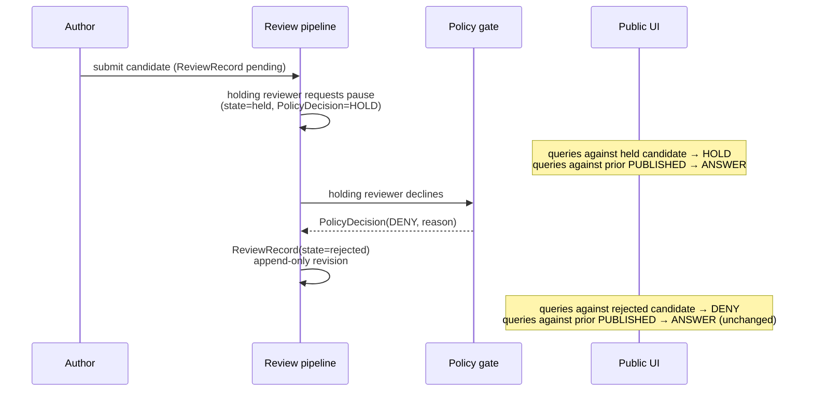

<!-- [KFM_META_BLOCK_V2]
doc_id: kfm://doc/focus-mode-state-transitions-hold-to-deny
title: Transition — HOLD → DENY
type: standard
version: v0.1
status: draft
owners: <FOCUS-MODE-DOCTRINE-OWNER> · NEEDS VERIFICATION
created: 2026-05-24
updated: 2026-05-24
policy_label: public
related:
  - docs/focus-mode/state/review-state.md
  - docs/focus-mode/state/finite-outcomes.md §4.2 (DENY reason codes)
  - docs/focus-mode/state/transitions/candidate-to-hold.md
  - docs/focus-mode/state/README.md §9
tags: [kfm, focus-mode, state, transition, hold, deny, rejected, sensitive-lane]
notes:
  - One of five prose transition specs under docs/focus-mode/state/transitions/.
  - Path placement diverges from Directory Rules v1.2 §6.7.2; tracked as OPEN-DR-09.
[/KFM_META_BLOCK_V2] -->

# Transition — `HOLD` → `DENY`

> *Hold resolved to refusal: a candidate in review state `held` becomes `rejected` after the holding reviewer (steward, rights holder, policy) declines. Public surface that previously rendered `HOLD` for queries against the held candidate now renders `DENY`.*

**Status:** draft · **Owners:** `<FOCUS-MODE-DOCTRINE-OWNER>` *(NEEDS VERIFICATION)* · **Last updated:** 2026-05-24

> [!IMPORTANT]
> **A `HOLD → DENY` resolution applies to the held candidate, not to the prior `PUBLISHED` release.** If a prior release of the same artifact exists, it continues to serve `ANSWER` *(subject to policy)* — the rejection is of the new revision, not the historical record. Conflating the two is the most common error in this transition.

---

## Contents

1. [Trigger conditions](#1-trigger-conditions)
2. [Pre-conditions](#2-pre-conditions)
3. [Post-conditions](#3-post-conditions)
4. [Required receipts](#4-required-receipts)
5. [Rollback target](#5-rollback-target)
6. [Diagram](#6-diagram)
7. [Effect on prior `PUBLISHED` release](#7-effect-on-prior-published-release)
8. [Anti-patterns](#8-anti-patterns)
9. [Cross-references](#9-cross-references)

---

## 1. Trigger conditions

| Trigger | Hold reason that drove the prior `HOLD` | Resulting `DENY` reason code |
|---|---|---|
| Rights holder declined the publication. | `rights_holder_review_pending` | `rights_deny` |
| Steward review concluded the artifact is unfit. | `steward_review_pending` | `sensitivity_deny` *(if steward is sensitivity reviewer)* or `policy_deny` |
| New policy bundle forbids the publication; held content remains forbidden under the new bundle. | `policy_review_pending` | `policy_deny` |
| Correction concluded the candidate is invalid. | `correction_pending` | `policy_deny` or `sensitivity_deny` per the correction's `CorrectionNotice` reasoning |
| Gate G failure that cannot recover *(missing rollback target permanently)*. | `release_gate_pending` | `release_state_deny` |

[↑ Back to top](#top)

---

## 2. Pre-conditions

| Pre-condition | Source |
|---|---|
| `ReviewRecord.state = held` exists for the candidate. | `ReviewRecord` carrier. |
| Holding reviewer's decision is documented and signed. | Reviewer signature on the new `ReviewRecord` revision. |
| Separation-of-duties enforced on sensitive lanes *(the reviewer issuing the refusal is not the author)*. | `validate_review_record.py` *(PROPOSED)*. |
| If a prior `PUBLISHED` release exists, its state is verified — the refusal applies to the candidate, not the prior release. | Audit step. |

[↑ Back to top](#top)

---

## 3. Post-conditions

| Post-condition | Carrier |
|---|---|
| `ReviewRecord.state` set to `rejected`; reason recorded. | `ReviewRecord` revision *(append-only)*. |
| `PolicyDecision (outcome=DENY)` issued, referencing the rejected `ReviewRecord` and reason code per §1. | Receipt store. |
| Candidate terminates — it is removed from the release-candidate pool and MUST NOT be promoted. | `release/candidates/<area>-focus-mode/` updated *(or candidate marked terminal)*. |
| Public surfaces that received `HOLD` for queries against this candidate now receive `DENY` with the resolved reason code. | `DecisionEnvelope (outcome=DENY)`. |
| Prior `PUBLISHED` release *(if any)* is **unaffected** — it continues to serve `ANSWER`. | No change. |
| Surface MAY offer an alternative *(prior release, generalized version, related un-denied artifact)* in the `DENY` envelope's `obligations[]` field *(PROPOSED — see [`finite-outcomes.md` open question FO-Q3](../finite-outcomes.md#9-open-questions))*. | Optional. |

[↑ Back to top](#top)

---

## 4. Required receipts

| Receipt | Required? | Notes |
|---|---|---|
| `ReviewRecord (rejected)` | yes | Carries refusal reason, reviewer identity, timestamp, references the prior `held` record. |
| `PolicyDecision (DENY)` | yes | References the `ReviewRecord` and emits the reason code from §1. |
| External reviewer ticket/record reference | yes if applicable | Sovereignty-review ID, rights-holder communication ref, policy bundle PR ref. |
| `DecisionEnvelope (DENY)` for runtime queries that arrive after the rejection | yes | Standard public refusal envelope. |
| `AIReceipt` for any `HOLD` envelopes that were re-evaluated after rejection | yes | Audit chain link: old `HOLD` → new `DENY` for the same query. |

[↑ Back to top](#top)

---

## 5. Rollback target

`DENY` itself is **not rolled back** as a state transition — a future re-authoring creates a new candidate with a new `ReviewRecord` starting at `draft`. The rejected `ReviewRecord` stays in the audit chain.

However, a rejection can be **revisited**:

- If new evidence emerges, the author may submit a new revision; the prior `ReviewRecord (rejected)` is referenced in the new submission's history.
- If the rights holder or steward later approves what they previously denied, that approval applies to the **new** submission, not by retroactively flipping the rejected one.

> [!NOTE]
> **A rejected `ReviewRecord` is never overwritten.** The audit chain shows that the candidate was rejected. A successor candidate is a new record. *(See [`review-state.md` §9 anti-pattern "Review record overwritten"](../review-state.md#9-anti-patterns).)*

[↑ Back to top](#top)

---

## 6. Diagram

[↑ Back to top](#top)

---

## 7. Effect on prior `PUBLISHED` release

| Scenario | Behavior |
|---|---|
| No prior `PUBLISHED` release exists. | Surface returns `DENY` for queries against the area/subject. User sees the denial reason; surface offers no substantive answer. |
| Prior `PUBLISHED` release exists and is unaffected by the rejection. | Surface continues to return `ANSWER` from the prior release. The rejection applies only to the candidate, not the historical record. |
| Prior `PUBLISHED` release is implicated by the same rights/policy issue. | A **separate** transition — see [`published-to-revoked.md`](./published-to-revoked.md) — applies. The rejection of the candidate does not automatically revoke the prior release; that requires its own revocation manifest. |

> [!CAUTION]
> **Do not chain transitions implicitly.** A `HOLD → DENY` on a candidate does not, by itself, revoke a prior `PUBLISHED` release. If both transitions are intended, both must be issued with their own receipts. Implicit chaining is anti-pattern #1 in this file.

[↑ Back to top](#top)

---

## 8. Anti-patterns

| Anti-pattern | Why it breaks doctrine |
|---|---|
| **Implicit revocation of prior release** — rejecting a candidate also strips the prior `PUBLISHED` release without a revocation manifest. | Two distinct transitions conflated; audit chain broken; user sees content disappear without a documented reason. |
| **`DENY` without reason code** — refusal envelope omits the reason code. | Reason routing broken; user cannot understand the denial; reviewer cannot answer "why was this denied?". |
| **`ReviewRecord` overwritten** — `rejected` flipped to `approved` in place. | Audit chain destroyed; bad decision becomes invisible. |
| **`DENY` leaks the held content** — refusal response embeds partial evidence. | Defeats the denial; reconstructable. |
| **Reviewer == author on sensitive-lane rejection** — separation-of-duties violated. | Self-rejection bypasses the review gate. |
| **Silent rejection** — candidate disappears with no envelope. | User waiting on `HOLD` never sees resolution. |

[↑ Back to top](#top)

---

## 9. Cross-references

- [`docs/focus-mode/state/review-state.md`](../review-state.md) §3 — `held → rejected` transition.
- [`docs/focus-mode/state/finite-outcomes.md`](../finite-outcomes.md) §4.2 — `DENY` reason codes.
- [`docs/focus-mode/state/transitions/candidate-to-hold.md`](./candidate-to-hold.md) — entry to `held` state.
- [`docs/focus-mode/state/transitions/published-to-revoked.md`](./published-to-revoked.md) — separate transition for the prior release if it is implicated.
- [`docs/focus-mode/README.md`](../../README.md) §15 — sensitivity defaults.

---

**Last updated:** 2026-05-24 · **Doc version:** v0.1 · **Doc status:** draft · **Path status:** PROPOSED *(OPEN-DR-09)*

[↑ Back to top](#top)
