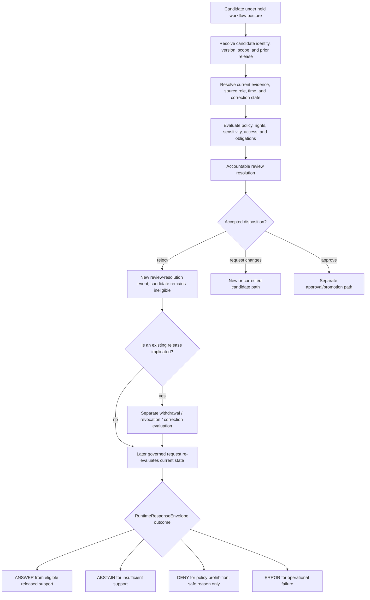

<!-- [KFM_META_BLOCK_V2]
doc_id: kfm://doc/focus-mode-state-transitions-hold-to-deny
title: Review Resolution and Runtime Projection Boundary — HOLD to Rejection / DENY
type: standard; focus-mode; review-resolution; runtime-projection; compatibility-lane
version: v1.0
status: draft; repository-grounded; documentation-only; non-executable; non-release; non-publication
owner: "@bartytime4life via CODEOWNERS; review, policy, evidence, runtime, release, correction, and independent approval authority NEEDS VERIFICATION"
created: 2026-05-24
updated: 2026-08-22
policy_label: public; documentation; focus-mode; review; hold; rejection; deny; policy; evidence; release; correction; cite-or-abstain; fail-closed
owning_root: docs/
responsibility: >-
  Explain the bounded relationship between a held candidate, an accountable
  rejection decision, and a possible later client-facing DENY; reconcile the
  v0.1 prose with current ReviewRecord, PolicyDecision, DecisionEnvelope, and
  RuntimeResponseEnvelope repository evidence; preserve legacy anchors; and
  expose authority, evidence, policy, release, correction, validation, and
  rollback gaps without executing or authorizing any transition.
authority: >-
  Human-readable reconciliation, review guidance, and maintenance documentation
  only. Review meaning belongs to an accepted review contract; machine shape
  belongs to schemas; policy rules belong to policy; runtime outcomes belong to
  runtime contracts and schemas; release, withdrawal, correction, rollback,
  cache, API, UI, and publication behavior remain with their owning roots and
  accountable decisions.
current_path: docs/focus-mode/state/transitions/hold-to-deny.md
canonical_relationship: >-
  Same-path documentation correction inside the repository-present singular
  Focus compatibility lane. Accepted Directory Rules v2 supports PLACE for this
  docs-root edit but does not settle the mixed state tree's final split,
  migration, transition-object homes, consumer aliases, or retirement.
truth_posture: >-
  CONFIRMED the current path and prior v0.1 bytes, the transition-directory and
  parent state boundaries, accepted ADR-0029 and adopted Directory Rules v2,
  the current four-outcome RuntimeResponseEnvelope contract/schema/validator,
  the proposed PolicyDecision contract/schema, the strict proposed governance
  ReviewRecord schema, the conflicting permissive review schema scaffold, the
  draft ReviewRecord semantic contract, and the DecisionEnvelope and AIReceipt
  companion boundaries / LINEAGE the v0.1 trigger names, reason-code names,
  state field names, release-candidate paths, receipt requirements, public-HOLD
  behavior, and overwrite/append-only assertions / PROPOSED a held-candidate
  carrier, review-resolution correlation, immutable review revisions, policy
  evaluation mapping, candidate terminality, safe DENY projection, client
  refresh behavior, reason-code registry, and complete transition validation /
  CONFLICTED the v0.1 treatment of HOLD as a public runtime outcome, the
  ReviewRecord.state held/rejected fields against current strict machine shape,
  PolicyDecision(HOLD) against the current four-outcome policy schema, universal
  AIReceipt requirements, and documentation-named release paths as current
  implementation / UNKNOWN live review authority, policy evaluation,
  EvidenceRef-to-EvidenceBundle closure, release-candidate mutation, prior
  release handling, runtime projection, client/cache propagation, deployment,
  and public parity / NEEDS VERIFICATION every implementation claim beyond the
  inspected repository shapes and documentation boundaries.
evidence_snapshot:
  repository: bartytime4life/Kansas-Frontier-Matrix
  base_ref: main
  inspected_commit: 4712e52f10a6c8f688cc1e158b7e010888fb4102
  target_prior_blob: 15c97b5f672868753b430bc317125f9384c760d7
  transitions_readme_blob: 220f7d6b7c2cd486267490a986d943a509d54347
  state_readme_blob: 38c53a9a22ccaf5987630ec3a736a0fc551abbb7
  finite_outcomes_blob: bd188a69890f43698422b2bd27c76c74958c5feb
  review_state_blob: 52aabf73e93a438a2116d5e28bc26a353da4c003
  candidate_to_hold_blob: 9d47a70af7aa76ca518cf19b457b1b49d77c0cff
  published_to_revoked_blob: 54280a501a9f4a937354345bf6f957e17d8cf47c
  review_record_contract_blob: 9641345d1e5d939dc59687a900e60a563d92c4f0
  strict_review_record_schema_blob: fe2f2223af46481e7fb19b0baa94f62ce9c6c855
  permissive_review_record_schema_blob: a053448d68e8379b92b12a16e6528275b975433c
  policy_decision_contract_blob: ebfe97f98263e6309db6d2772cb2c5e548819650
  policy_decision_schema_blob: 1472d26a42c73f17545b4464a275412ffa1d098e
  runtime_response_contract_blob: 9dfc286984b5b52b383753fe6215a2b31df8c876
  runtime_response_schema_blob: 8b86e7db8b18b65a56a4e639dfc54e1b2db93155
  runtime_response_validator_blob: 44ce7d51038a9adf9fcbdb18108cc27da8381e33
  decision_envelope_contract_blob: b7e33c1351c9c28c5cfb3fc107d87204b3fdf455
  ai_receipt_contract_blob: 1e028525569b6032cd573e71d98df6b961fa70db
  directory_rules_blob: fd49a0b83e55cef52c1124281f093e263526898d
  adr_0029_blob: a4de0d7a96b78da59cfc499d1025e1508afd8dd9
  codeowners_blob: dd2a84aa514d8ecd9208bc347f90f9a2ed37dd61
inspection_boundary: >-
  Current-session GitHub reads covered the complete target, current main, the
  transition-directory and parent state guidance, finite outcomes, review state,
  ReviewRecord contract and both repository-present machine-schema candidates,
  PolicyDecision contract/schema, RuntimeResponseEnvelope contract/schema/
  validator, DecisionEnvelope, AIReceipt, accepted Directory Rules evidence,
  CODEOWNERS, current open pull requests, and matching task branches. No source
  was admitted; no EvidenceRef was resolved; no reviewer was authenticated; no
  policy engine, release service, runtime adapter, API, UI, cache, correction
  cascade, rollback, deployment, or public endpoint was exercised.
related:
  - ./README.md
  - ./candidate-to-hold.md
  - ./published-to-revoked.md
  - ../README.md
  - ../finite-outcomes.md
  - ../review-state.md
  - ../revocation-state.md
  - ../../../../contracts/governance/ReviewRecord.md
  - ../../../../schemas/contracts/v1/governance/review_record.schema.json
  - ../../../../schemas/contracts/v1/review/review_record.schema.json
  - ../../../../contracts/policy/policy_decision.md
  - ../../../../schemas/contracts/v1/policy/policy_decision.schema.json
  - ../../../../contracts/runtime/decision_envelope.md
  - ../../../../contracts/runtime/runtime_response_envelope.md
  - ../../../../schemas/contracts/v1/runtime/runtime_response_envelope.schema.json
  - ../../../../tools/validators/validate_runtime_response_envelope.py
  - ../../../../contracts/runtime/ai_receipt.md
  - ../../../doctrine/directory-rules.md
  - ../../../adr/ADR-0029-adopt-directory-governance-standard-v2.md
  - ../../../../.github/CODEOWNERS
tags: [kfm, focus-mode, state, transition, hold, rejection, deny, review-record, policy-decision, runtime-response-envelope, evidence-ref, release, correction, compatibility, non-publication]
notes:
  - "v1.0 replaces the behavior-assertive v0.1 transition prose with a repository-grounded documentation boundary."
  - "The filename is retained for compatibility; HOLD to DENY is shorthand for a held workflow posture resolving to rejection plus a separately evaluated runtime projection."
  - "The current client-facing runtime enum remains ANSWER, ABSTAIN, DENY, and ERROR; HOLD is not a fifth runtime outcome."
  - "The strict proposed ReviewRecord schema currently uses decision=reject rather than state=held/rejected; a second permissive review schema creates unresolved authority conflict."
  - "A candidate rejection does not revoke, withdraw, supersede, or roll back a prior release."
  - "AIReceipt applies only when AI participated; documentation does not create a receipt, review decision, policy decision, runtime envelope, release record, or public effect."
[/KFM_META_BLOCK_V2] -->

<a id="top"></a>
<a id="transition--hold--deny"></a>

# Review Resolution and Runtime Projection Boundary — `HOLD` → Rejection / `DENY`

> **Purpose.** Explain how a held candidate may resolve to an accountable
> rejection and how a later governed request may separately project `DENY`,
> without treating `HOLD` as a client outcome, mutating prior history, or
> silently revoking an existing release.

[](#1-status-and-evidence-boundary)
[](#3-transition-semantics)
[](#6-outcome-selection-matrix)
[](#10-effect-on-prior-published-release)
[](#2-responsibility-and-placement-boundary)

> [!IMPORTANT]
> **This file is not an executable transition.** It cannot authenticate a
> reviewer, evaluate policy, resolve evidence, reject a candidate, remove
> anything from a release queue, issue a runtime envelope, revoke a release,
> invalidate a cache, or authorize public use.

> [!WARNING]
> **`HOLD` is not a fifth client-facing outcome.** In the current runtime machine,
> the only outcomes are `ANSWER`, `ABSTAIN`, `DENY`, and `ERROR`. Here, `HOLD`
> names a review, placement, promotion, correction, or workflow posture. The
> filename is retained as compatibility shorthand, not as one unified state enum.

> [!CAUTION]
> **Rejection and `DENY` are separate decisions.** A review record may reject a
> candidate. A policy-aware runtime request may later return `DENY`. The runtime
> result could instead be `ANSWER`, `ABSTAIN`, or `ERROR` when current evidence,
> policy, release, and operational context require a different outcome.

> [!NOTE]
> **A candidate rejection does not alter a prior release.** If an existing
> released artifact remains eligible, governed clients may continue to use it.
> Withdrawal, revocation, supersession, correction, and rollback require their
> own authority and accountability records.

**Quick navigation:** [Status](#1-status-and-evidence-boundary) ·
[Authority](#2-responsibility-and-placement-boundary) ·
[Semantics](#3-transition-semantics) ·
[Triggers](#4-trigger-conditions) ·
[Preconditions](#5-pre-conditions) ·
[Decision matrix](#6-outcome-selection-matrix) ·
[Postconditions](#7-post-conditions) ·
[Records](#8-required-receipts) ·
[Reason safety](#9-deny-reason-and-disclosure-boundary) ·
[Prior release](#10-effect-on-prior-published-release) ·
[Rollback](#11-rollback-target) ·
[Diagram](#12-diagram) ·
[Validation](#13-validation-and-negative-tests) ·
[Anti-patterns](#14-anti-patterns) ·
[Open work](#15-open-verification-backlog) ·
[Maintenance](#16-maintenance-correction-and-documentation-rollback) ·
[References](#17-cross-references) · [History](#18-change-history)

---

## 1. Status and evidence boundary

| Question | Current bounded answer | Truth label |
|---|---|---|
| Does this document exist at the requested path? | Yes. The prior v0.1 file is tracked at blob `15c97b5f672868753b430bc317125f9384c760d7`. | `CONFIRMED` |
| Is `HOLD` a current runtime outcome? | No. The current runtime schema enumerates `ANSWER`, `ABSTAIN`, `DENY`, and `ERROR`. | `CONFIRMED` machine shape |
| Is a held-candidate carrier accepted and implemented? | No accepted carrier or live producer was verified. Current review documentation treats it as a proposed workflow posture. | `PROPOSED` / `UNKNOWN` |
| What does the strict proposed ReviewRecord schema support? | Required `decision` values are `approve`, `reject`, and `request_changes`; it does not define `state=held` or `state=rejected`. | `CONFIRMED` repository shape; authority remains `PROPOSED` |
| Is ReviewRecord shape settled? | No. A second schema under `schemas/contracts/v1/review/` is permissive and conflicts with the strict governance schema. | `CONFLICTED` |
| Does PolicyDecision support `HOLD`? | The paired proposed schema uses only `ANSWER`, `ABSTAIN`, `DENY`, and `ERROR`; engine-native or workflow `HOLD` mapping remains an open design question. | `CONFIRMED` schema shape; mapping `NEEDS VERIFICATION` |
| Is `DENY` a current runtime outcome? | Yes. Runtime and policy schemas both include `DENY`; actual selection and delivery remain unproved. | Shape `CONFIRMED`; execution `UNKNOWN` |
| Does the runtime schema enumerate denial reasons? | No. `reason_code` is a required string rather than a closed enum. | `CONFIRMED` |
| Does candidate rejection revoke a prior release? | No such implicit authority is present. Revocation or withdrawal is a separate transition family. | `CONFIRMED` documentation boundary; execution `UNKNOWN` |
| Is AIReceipt universal? | No. The AIReceipt contract applies when AI participates; it is not required merely because a review or runtime transition exists. | `CONFIRMED` contract boundary |
| Does this page authorize review, policy, release, runtime, or public action? | No. | `CONFIRMED` |
| Is this path final canon? | Same-path documentation maintenance is allowed; structural convergence remains `HOLD`. | `CONFIRMED` current placement disposition |

### Truth labels used here

| Label | Meaning |
|---|---|
| `CONFIRMED` | Verified from current-session repository bytes or remote state. |
| `PROPOSED` | Design, vocabulary, behavior, mapping, or implementation not accepted or proved. |
| `LINEAGE` | Retained prior wording or vocabulary; not current authority by itself. |
| `CONFLICTED` | Current sources or writable surfaces make incompatible claims. |
| `UNKNOWN` | Evidence does not establish the claim. |
| `NEEDS VERIFICATION` | A concrete contract, schema, policy, review, runtime, release, client, or test check remains. |
| `NOT_RUN` | The named executable or external check was not performed. |
| `HOLD` | Proceeding would cross an unresolved authority, placement, review, sensitivity, or release boundary. |

Repository presence proves that bytes and proposed shapes exist. It does not prove
reviewer authority, evidence sufficiency, policy correctness, candidate mutation,
release state, runtime execution, deployment, or public parity.

[Back to top](#top)

---

## 2. Responsibility and placement boundary

### This document owns

- a repository-grounded explanation of held-candidate rejection and possible
  `DENY` projection;
- reconciliation of v0.1 claims with current review, policy, decision-envelope,
  and runtime-response repository shapes;
- preservation of the prior section anchors for compatibility;
- separation of candidate review from prior-release accountability;
- a proposed outcome-selection matrix that keeps `ANSWER`, `ABSTAIN`, `DENY`,
  and `ERROR` distinct;
- documentation of reason safety, records, validation gaps, maintenance, and
  repository rollback.

### This document does not own

| Responsibility | Current owning surface or decision class | Effect here |
|---|---|---|
| Review semantics | An accepted ReviewRecord semantic contract and accountable governance decision | This page cannot define reviewer authority or accepted dispositions |
| Review machine shape | The accepted machine schema, if and when one is settled | Current conflicting schema homes are disclosed, not resolved |
| Policy decision meaning | [`PolicyDecision` contract](../../../../contracts/policy/policy_decision.md) | This page cannot create policy outcomes or reason vocabularies |
| Executable policy | `policy/` and its evaluated bundles | Documentation cannot allow, restrict, deny, redact, or generalize |
| Runtime decision detail | [`DecisionEnvelope` contract](../../../../contracts/runtime/decision_envelope.md) | Companion decision record, not proof of execution |
| Client response semantics | [`RuntimeResponseEnvelope` contract](../../../../contracts/runtime/runtime_response_envelope.md) | This file cannot add fields, outcomes, or normative reason codes |
| Client response shape | [Runtime response schema](../../../../schemas/contracts/v1/runtime/runtime_response_envelope.schema.json) | Current four-value enum outranks stale prose |
| Runtime validation | [Runtime response validator](../../../../tools/validators/validate_runtime_response_envelope.py) and fixtures/tests | Bounded shape checks only when run |
| Evidence support | `EvidenceRef`, `EvidenceBundle`, source, and evidence-resolution owners | A review or policy pointer does not prove current evidence closure |
| AI accountability | [`AIReceipt` contract](../../../../contracts/runtime/ai_receipt.md) | Applies only when AI participates; not evidence, policy, or review authority |
| Candidate pool and lifecycle | Governed lifecycle/promotion owners and machine records | This page cannot mark a candidate terminal or remove it from any queue |
| Release, withdrawal, correction, and rollback | `release/` plus accountable decisions and records | Candidate rejection does not mutate released state |
| Cache, map, search, export, API, or UI behavior | Governed implementation roots | No public refresh or invalidation behavior is proved |
| Deployment and publication | Release/deployment systems and accountable authority | A Markdown edit, PR, merge, or green check is not publication |

### Directory Rules basis

Accepted ADR-0029 adopts the exact Directory Rules v2 bytes. The target is an
existing human-readable document under `docs/`, so the bounded same-path
correction is `PLACE`. The current change does not create, move, split, mirror,
rename, or delete an authority-bearing object.

| Decision | Outcome | Basis |
|---|---|---|
| Replace the tracked v0.1 document in place | `PLACE` | Existing docs-root responsibility; no authority or lifecycle change |
| Treat this document as ReviewRecord, PolicyDecision, runtime, release, or data authority | `DENY` | A path cannot grant another root's responsibility |
| Resolve the conflicting ReviewRecord schema homes here | `DENY` | Requires accepted authority and migration, not prose |
| Move or split the mixed state tree in this change | `HOLD` | Owners, targets, consumers, migration tests, and rollback remain unresolved |
| Add a parallel transition contract/schema/policy home | `DENY` | Would create parallel authority |
| Preserve old anchors while correcting semantics | `PLACE` | Compatibility-preserving documentation maintenance |

[Back to top](#top)

---

<a id="transition-summary"></a>

## 3. Transition semantics

`HOLD → DENY` is retained as a convenient filename and human shorthand. A
governed implementation must decompose it into independently attributable
events.

### 3.1 Review/workflow event

A candidate is already paused under a held posture. An accountable reviewer or
governance process resolves that posture. Under the current strict proposed
ReviewRecord schema, the closest machine disposition is:

```text
decision = reject
```

That schema does **not** define `state=held` or `state=rejected`. The semantic
ReviewRecord contract proposes a broader vocabulary, while the second permissive
review schema accepts arbitrary properties. Therefore:

- the exact held-state carrier is `PROPOSED`;
- the canonical ReviewRecord shape is `CONFLICTED`;
- a documentation example must not invent accepted fields;
- a live implementation must fail closed until one machine and semantic
  authority is accepted and wired.

### 3.2 Policy event

A policy evaluation may independently produce a proposed `PolicyDecision` with:

```text
outcome = DENY
```

The paired policy schema also permits `ANSWER`, `ABSTAIN`, and `ERROR`. It does
not permit `HOLD`. A workflow hold and a policy denial must not be collapsed into
one mutable field.

### 3.3 Runtime event

When a governed client later asks for access, rendering, export, explanation, or
another capability, the current request is evaluated against current evidence,
policy, release, freshness, correction, and operational state. The
client-facing `RuntimeResponseEnvelope` may be:

- `DENY` when an applicable policy blocks delivery;
- `ANSWER` when an eligible prior or replacement release supports the request;
- `ABSTAIN` when support is insufficient or unresolved;
- `ERROR` when the governed runtime cannot complete safely.

### 3.4 Release event

Rejecting a candidate does not:

- withdraw an existing release;
- revoke a prior release;
- supersede a released artifact;
- restore a prior release;
- invalidate public caches;
- issue a correction notice;
- change KFM lifecycle state.

Each release/accountability action requires its own authority, record, client
propagation, correction path, and rollback target.

### 3.5 Correlation requirement

A mature implementation should correlate, without merging:

| Event | Stable identity needed | Relationship |
|---|---|---|
| Held workflow record | candidate and hold-record identity | Establishes the paused candidate posture |
| Review resolution | new review-event identity | References the candidate and prior held posture |
| Policy evaluation | new policy-decision identity | References current policy inputs and review/evidence context |
| Runtime response | new response identity | References current request and applicable decision/evidence state |
| Release action, if any | release-accountability identity | Separate from candidate rejection and runtime response |

The exact reference fields, hash rules, and supersession grammar remain
`NEEDS VERIFICATION`.

[Back to top](#top)

---

<a id="1-trigger-conditions"></a>

## 4. Trigger conditions

The v0.1 trigger names are retained as `LINEAGE`, not as accepted reason-code
authority.

| Trigger family | What must be established before rejection | Likely governing family | Runtime result is not predetermined |
|---|---|---|---|
| Rights or license refusal | Applicable rights holder, scope, version, permitted uses, and current refusal are verified | consent / access / promotion | `DENY` only when the current requested operation is blocked |
| Sensitivity or sovereignty refusal | Qualified authority, sensitivity class, harmful precision, permitted transforms, and review duty are established | sensitivity / render / access | A generalized release could still support `ANSWER`; otherwise `DENY` or `ABSTAIN` may apply |
| Policy prohibition | Effective policy bundle, evaluation context, decision time, and affected operation are pinned | promotion / access / render / capability | `DENY` when the rule blocks the current request |
| Evidence or correction invalidates the candidate | Candidate evidence no longer supports the proposed artifact or claim | promotion plus evidence/correction | Usually candidate rejection; runtime could use an earlier supported release or `ABSTAIN` |
| Release-readiness failure | Candidate lacks a required rollback target, provenance, integrity, review, or other release support | promotion | Candidate remains ineligible; public runtime result depends on existing released support |
| Reviewer requests redesign rather than final rejection | Defect is remediable and a new candidate is expected | review/workflow | `request_changes` may be more accurate than `reject`; no automatic `DENY` |
| Runtime or resolver failure | Process failed rather than policy refusing content | runtime / operational | `ERROR`, not `DENY` |
| Missing or unresolved evidence | Support is absent or not resolvable | evidence / runtime | `ABSTAIN`, not `DENY`, unless a separate policy prohibition also applies |

### Trigger admission rule

A trigger is admissible only when:

1. the exact candidate and requested operation are identified;
2. current evidence and source role are resolved;
3. the relevant policy family and effective bundle are known;
4. reviewer authority is established;
5. public-safe reasons can be separated from restricted detail;
6. prior released state is inspected independently;
7. the intended record families and rollback implications are explicit.

Otherwise the transition remains `HOLD`, `ABSTAIN`, `ERROR`, or
`NEEDS VERIFICATION` as appropriate.

[Back to top](#top)

---

<a id="2-pre-conditions"></a>

## 5. Pre-conditions

| Pre-condition | Current evidence status | Failure posture |
|---|---|---|
| Exact candidate identity, version, scope, and content/spec hash are pinned | Not established by this document | `HOLD` |
| A held workflow posture is represented by an accepted carrier | No accepted carrier verified | `HOLD` |
| Review authority and role are authenticated | CODEOWNERS is routing only; accountable authority `UNKNOWN` | `HOLD` |
| Separation of duties is satisfied where consequence requires it | No live enforcement verified | `HOLD` |
| Current evidence resolves and is appropriate to the decision | No resolver exercised | `ABSTAIN` or `HOLD` |
| Current policy bundle and evaluation context are pinned | No policy engine exercised | `HOLD` or `ERROR` |
| Public-safe and steward-only denial reasons are separated | Vocabulary and redaction enforcement unverified | `DENY` exposure of unsafe reason; keep internal |
| Prior release posture is checked independently | No release service exercised | `HOLD` for any release-affecting action |
| Required correction, withdrawal, or rollback path is known | Object/runtime closure unverified | `HOLD` |
| The proposed machine records validate against the accepted schemas | Review schema authority is conflicted | `HOLD` |
| Idempotency and duplicate-event handling are defined | Not verified | `HOLD` |
| Client/cache behavior is bounded before any public change | Not verified | `HOLD` |

### Blocked shortcut

The following assertion is not currently supportable:

```text
ReviewRecord.state = held
  -> ReviewRecord.state = rejected
  -> public outcome = DENY
```

It collapses a proposed review-state vocabulary, a policy decision, and a runtime
response into one mutation. Current repository evidence supports only a
documentation-level mapping that keeps those events separate.

[Back to top](#top)

---

<a id="6-outcome-selection-matrix"></a>

## 6. Outcome-selection matrix

The later runtime outcome is selected from current request context; it is not
copied from the review disposition.

| Current request context after candidate rejection | Review/promotion posture | Runtime outcome candidate | Why |
|---|---|---|---|
| No eligible released support exists and current policy blocks the requested access/render/export/capability | Candidate rejected | `DENY` | Policy prohibition blocks the current operation |
| An eligible prior release remains supported and policy-safe | Candidate rejected; prior release unaffected | `ANSWER` | The request is answered from the current eligible release, not the rejected candidate |
| Evidence is missing, stale, unresolved, or citation closure fails, but no rule prohibits access | Candidate rejected or unresolved | `ABSTAIN` | Insufficient support is not the same as prohibition |
| Runtime, resolver, policy engine, or dependent service fails | Candidate review may already be resolved | `ERROR` | Operational failure must not masquerade as content denial |
| A generalized or redacted released derivative satisfies policy | Exact candidate rejected | `ANSWER` with enforced obligations | Policy may permit a safe alternative; exact denied material stays withheld |
| The same issue also makes a prior release unsafe | Candidate rejected | Separate release withdrawal/revocation evaluation, then runtime re-evaluation | Candidate rejection alone cannot change prior release |
| Reviewer requests changes rather than final rejection | Candidate remains non-releasable | Current runtime still evaluates independently | Review workflow does not create a client outcome |
| Policy decision is stale or superseded | Review result exists | Re-evaluate before selecting outcome | Old policy cannot be treated as current authority |

### Runtime-envelope boundary

The current runtime schema requires:

- `id`;
- `spec_hash`;
- `version`;
- `issued_at`;
- `outcome`;
- `reason_code`;
- `evidence_refs`;
- `policy_state`;
- `freshness`;
- `correction_state`.

For `ANSWER`, the schema also requires evidence and precision conditions. For
negative outcomes, precision disclosure is prohibited. This document does not
construct a complete instance because the referenced evidence, controlled
vocabularies, and current request context are not available.

[Back to top](#top)

---

<a id="3-post-conditions"></a>

## 7. Post-conditions

The following are minimum **proposed** post-conditions for a mature,
authority-backed implementation.

### 7.1 Review/promotion post-conditions

- a new review-resolution event records rejection or the accepted equivalent;
- the prior held event remains addressable;
- the candidate remains ineligible for promotion;
- no prior review record is overwritten;
- reasons and obligations are safe, scoped, and attributable;
- the decision is idempotent for the same candidate, review authority, and
  effective inputs;
- a corrected or materially new submission receives a new candidate/review
  identity rather than rewriting the rejected event.

### 7.2 Policy post-conditions

- a policy evaluation event is preserved separately from the review resolution;
- its policy family, reasons, obligations, evaluation time, and effective input
  lineage are inspectable;
- `ABSTAIN`, `DENY`, and `ERROR` remain distinguishable;
- internal reasons that would leak restricted facts are not copied to public
  envelopes;
- a superseding policy evaluation issues a new identity/time rather than
  mutating the old record.

### 7.3 Runtime post-conditions

- a later request receives one of the four current runtime outcomes;
- a `DENY` response contains no denied payload, exact protected geometry,
  private data, source internals, credentials, or tactical detail;
- any client-visible reason is safe and bounded;
- current evidence, policy, freshness, correction, and release posture are
  represented according to their accepted vocabularies;
- earlier responses and review decisions remain auditable;
- caches, maps, search, exports, and AI projections change only through
  explicitly implemented, verified propagation.

### 7.4 Release post-conditions

- no existing release changes unless a separate authorized release transition
  is issued;
- no implicit withdrawal, revocation, supersession, correction, or rollback
  occurs;
- if a release action is necessary, its record references the affected release
  and preserves correction and rollback lineage;
- repository delivery state is not represented as KFM publication state.

[Back to top](#top)

---

<a id="4-required-receipts"></a>
<a id="8-required-receipts"></a>

## 8. Required records and receipts

The v0.1 file called several objects universally required. Current evidence
supports a narrower, object-family-aware posture.

| Object or record | Applicability | Current bounded status |
|---|---|---|
| Held-workflow carrier | Needed only if a held posture is represented as a machine event | `PROPOSED`; accepted carrier not verified |
| `ReviewRecord` or accepted review-resolution record | Needed for accountable human/steward disposition | Semantic contract draft; strict and permissive schema homes `CONFLICTED` |
| `PolicyDecision` | Needed when policy evaluation contributes to the result | Contract/schema `PROPOSED`; live evaluation `UNKNOWN` |
| `DecisionEnvelope` | Optional/expected companion runtime decision detail when the implementation uses it | Contract/schema present and proposed; execution `UNKNOWN` |
| `RuntimeResponseEnvelope` | Needed for a governed client-facing response | Contract/schema/validator present; live response issuance `UNKNOWN` |
| `AIReceipt` | Needed only when AI participated in the evaluated event | Contract present; not universal; persistence `UNKNOWN` |
| Evidence references/bundle | Needed when the review, policy, or runtime claim depends on evidence | Resolver and live closure `UNKNOWN` |
| Release withdrawal/revocation/correction record | Needed only when an existing release is affected | Separate transition family; closure `UNKNOWN` |
| Rollback record/card | Needed only when a governed release rollback is authorized | Separate release/accountability family; execution `UNKNOWN` |
| Repository generated-work receipt | Required for this AI-authored documentation contribution | Provenance for authored bytes only; not review, policy, release, or truth |

### Record-family invariants

- A ReviewRecord is not a PolicyDecision.
- A PolicyDecision is not a RuntimeResponseEnvelope.
- A DecisionEnvelope is not a public answer by itself.
- An AIReceipt is not evidence, policy, or human approval.
- A release notice is not created by rejecting a candidate.
- A generated-work receipt proves authored bytes and declared checks only.
- A Git commit or pull request is not any of the above governance objects.

[Back to top](#top)

---

<a id="9-deny-reason-and-disclosure-boundary"></a>

## 9. `DENY` reason and disclosure boundary

### 9.1 Current reason-code status

The v0.1 names below are retained only as lineage candidates:

| v0.1 name | Lineage meaning | Current status |
|---|---|---|
| `rights_deny` | Rights or consent blocks the operation | Not a schema enum |
| `sensitivity_deny` | Sensitivity or harmful precision blocks the operation | Not a schema enum |
| `policy_deny` | Policy rule blocks the operation | Not a schema enum |
| `release_state_deny` | Release posture blocks the operation | Not a schema enum |

The current runtime schema requires a string `reason_code` but does not enumerate
values. The PolicyDecision schema uses an array of string `reasons`. A single
authoritative registry, public/internal reason split, compatibility rules, and
validators remain `NEEDS VERIFICATION`.

### 9.2 Public-safe denial rule

A public or ordinary-client `DENY` may communicate only what policy allows. It
must not disclose:

- the denied fact itself;
- exact protected coordinates or geometries;
- living-person private information;
- DNA/genomic or protected cultural information;
- private source content, credentials, tokens, or source internals;
- exploitable infrastructure detail;
- the content of restricted reviewer communications;
- detailed policy logic that would enable circumvention;
- partial evidence from which the protected value is reconstructable.

### 9.3 Internal audit rule

Steward-only records may need more detail, but access, retention, encryption,
logging, and disclosure posture must be governed independently. A public reason
string must not be reused as the complete audit record, and an internal reason
must not be copied to the public response without an approved transform.

### 9.4 Reason selection rule

- Missing support maps to `ABSTAIN`, not a policy-flavored `DENY`.
- Process failure maps to `ERROR`, not `DENY`.
- A prohibition maps to `DENY`.
- A safe permitted alternative may support `ANSWER` with obligations.
- When the public reason itself is sensitive, use a generic safe reason and
  preserve the detailed basis only in an authorized record.

[Back to top](#top)

---

<a id="7-effect-on-prior-published-release"></a>
<a id="10-effect-on-prior-published-release"></a>

## 10. Effect on a prior `PUBLISHED` release

| Scenario | Candidate effect | Prior release effect | Later client posture |
|---|---|---|---|
| No prior release exists | Candidate rejected or held out of promotion | None | `DENY`, `ABSTAIN`, or `ERROR` according to current policy/evidence/runtime |
| Prior release exists and remains eligible | New candidate rejected | No change | Existing release may continue to support `ANSWER` |
| Prior release is unaffected but candidate contained a restricted enhancement | Enhancement rejected | Prior release remains current | `ANSWER` from prior release; restricted enhancement is not exposed |
| Prior release is implicated by the same rights/sensitivity/policy problem | Candidate rejected | Separate withdrawal/revocation evaluation required | Runtime re-evaluates after authorized release action |
| Prior release is stale or unsupported but not prohibited | Candidate rejected | Separate correction/supersession/withdrawal process may be needed | Usually `ABSTAIN`, not automatic `DENY` |
| Prior release has an eligible predecessor | Candidate rejected | No automatic rollback | Rollback requires separate revalidation and authorization |
| Existing release status cannot be resolved | Candidate rejected or held | Unknown | Fail closed; do not infer revocation or continued eligibility |

> [!CAUTION]
> **Do not chain transitions implicitly.** Rejecting a candidate is neither
> withdrawal nor rollback. See [`published-to-revoked.md`](./published-to-revoked.md)
> and [revocation-state guidance](../revocation-state.md) for the separate
> accountability boundary.

[Back to top](#top)

---

<a id="5-rollback-target"></a>

## 11. Rollback target

### 11.1 Review-resolution reconsideration

A mature implementation should preserve the rejection event. New evidence,
changed rights, corrected content, or changed policy should produce a new
candidate and new review/policy events rather than rewriting the prior rejection.

This is a `PROPOSED` audit rule. The current strict ReviewRecord schema does not
itself encode supersession references or append-only storage behavior, so the
complete mechanism remains `NEEDS VERIFICATION`.

### 11.2 Release rollback

Candidate rejection does not create a release rollback. If an existing released
artifact must be replaced by an eligible prior release, use the separate governed
rollback path with:

- current and prior release identities;
- current evidence and policy revalidation;
- authorized decision;
- correction/public notice where required;
- cache, map, search, export, and AI re-resolution;
- rollback record and rollback-of-rollback path.

### 11.3 Documentation rollback

Before merge, close or abandon the draft pull request and branch. Branch deletion
is a separate action.

After an authorized merge, restore prior target blob
`15c97b5f672868753b430bc317125f9384c760d7` through a transparent revert, or
issue a bounded forward correction that preserves the v1.0 evidence boundary.
Do not rewrite shared history.

Restoring the old bytes would not reverse any review, policy, release, runtime,
cache, deployment, or publication state—none is changed by this document.

[Back to top](#top)

---

<a id="6-diagram"></a>

## 12. Diagram


```mermaid
flowchart TD
    CANDIDATE["Candidate under held workflow posture"] --> IDENTIFY["Resolve candidate identity, version, scope, and prior release"]
    IDENTIFY --> EVIDENCE["Resolve current evidence, source role, time, and correction state"]
    EVIDENCE --> POLICY["Evaluate policy, rights, sensitivity, access, and obligations"]
    POLICY --> REVIEW["Accountable review resolution"]
    REVIEW --> REJECT{"Accepted disposition?"}
    REJECT -->|"reject"| REVIEW_EVENT["New review-resolution event; candidate remains ineligible"]
    REJECT -->|"request changes"| REWORK["New or corrected candidate path"]
    REJECT -->|"approve"| OTHER["Separate approval/promotion path"]
    REVIEW_EVENT --> RELEASE_CHECK{"Is an existing release implicated?"}
    RELEASE_CHECK -->|"no"| RUNTIME["Later governed request re-evaluates current state"]
    RELEASE_CHECK -->|"yes"| RELEASE_FLOW["Separate withdrawal / revocation / correction evaluation"]
    RELEASE_FLOW --> RUNTIME
    RUNTIME --> OUTCOME{"RuntimeResponseEnvelope outcome"}
    OUTCOME --> ANSWER["ANSWER from eligible released support"]
    OUTCOME --> ABSTAIN["ABSTAIN for insufficient support"]
    OUTCOME --> DENY["DENY for policy prohibition; safe reason only"]
    OUTCOME --> ERROR["ERROR for operational failure"]
```

### Event-separation view

```text
held workflow posture
  -> review resolution: reject
  -> candidate remains ineligible

current request
  -> current evidence + policy + release + correction + runtime evaluation
  -> ANSWER | ABSTAIN | DENY | ERROR

existing release, if implicated
  -> separate withdrawal / revocation / correction / rollback decision
```

[Back to top](#top)

---

<a id="13-validation-and-negative-tests"></a>
<a id="validation"></a>

## 13. Validation and negative tests

### 13.1 Documentation validation for this file

- exactly one H1 and one complete `KFM_META_BLOCK_V2`;
- all legacy section anchors preserved exactly once;
- explicit anchors are unique and local fragments resolve;
- Markdown fences, tables, and HTML comments are balanced;
- current four runtime outcomes are preserved;
- `HOLD` is not presented as a client outcome;
- strict and permissive ReviewRecord schema conflict is visible;
- `PolicyDecision(HOLD)` is not presented as current machine-valid shape;
- AIReceipt is conditional rather than universal;
- candidate rejection and prior-release accountability remain separate;
- v0.1 reason names remain lineage rather than current enums;
- no credentials, private data, sensitive locations, or denied payload are
  introduced;
- UTF-8, LF line endings, final newline, no tabs, no trailing whitespace, and no
  conflict markers.

### 13.2 Minimum future machine tests

| Test | Expected result |
|---|---|
| Runtime envelope with `outcome=HOLD` | schema/validator failure |
| Strict ReviewRecord with `decision=reject` and all required fields | schema-valid under the strict proposed schema |
| Strict ReviewRecord with `state=held` or `state=rejected` | schema failure |
| PolicyDecision with `outcome=HOLD` | schema failure |
| PolicyDecision with `outcome=DENY` and required fields | schema-valid; policy truth still not proved |
| Candidate rejection with an unaffected eligible prior release | prior release remains current; no implicit withdrawal |
| Candidate rejection with missing evidence but no prohibition | later runtime `ABSTAIN` |
| Candidate rejection with current policy prohibition | later runtime `DENY` with safe reason |
| Resolver or policy-engine outage | later runtime `ERROR`, not `DENY` |
| Rejection of exact sensitive form with eligible generalized derivative | generalized `ANSWER` allowed only when obligations and release state support it |
| Public denial reason contains protected coordinates or restricted detail | fail closed / fixture rejected |
| Same rejection event replayed with identical effective inputs | idempotent result; no duplicate authority record |
| New evidence after rejection | new candidate/review event; prior rejection preserved |
| Prior release also becomes unsafe | separate withdrawal/revocation record required |
| AI did not participate | no AIReceipt required |
| AI participated | AIReceipt required by the applicable AI-accountability path, but still not evidence or approval |

### 13.3 What a green check would not prove

A passing Markdown check, JSON Schema validation, unit test, policy fixture,
workflow, or generated receipt would not by itself prove:

- the reviewer was authorized;
- evidence was sufficient or rights were current;
- policy evaluation was correct;
- the candidate pool changed;
- a prior release remained eligible or was withdrawn;
- a runtime response was issued;
- clients or caches propagated a change;
- deployment or public parity;
- release, promotion, correction, rollback, or publication.

[Back to top](#top)

---

<a id="8-anti-patterns"></a>

## 14. Anti-patterns

| Anti-pattern | Failure | Required posture |
|---|---|---|
| Fifth runtime outcome | Public client receives `HOLD` | Keep HOLD in review/workflow posture; runtime remains four-valued |
| One mutable status field | held, rejected, policy denied, and runtime denied overwrite one value | Preserve review, policy, runtime, and release records separately |
| Implicit prior-release revocation | Candidate rejection removes an existing release | Issue a separate authorized withdrawal/revocation transition |
| Missing evidence labeled denial | Evidence shortage is presented as policy refusal | Use `ABSTAIN` unless a separate policy rule prohibits the operation |
| Runtime failure labeled denial | Resolver/policy/service outage becomes `DENY` | Use `ERROR` and fail closed |
| ReviewRecord shape invented in prose | `state=held/rejected` is treated as current schema authority | Reconcile and accept one review contract/schema before implementation |
| Policy HOLD invented in current schema | `PolicyDecision(outcome=HOLD)` is emitted | Use only current schema outcomes or adopt a separate engine/workflow mapping |
| Universal AIReceipt | Every review or runtime event requires AIReceipt | Require it only when AI participates |
| `DENY` leaks denied content | Response includes restricted evidence or exact geometry | Safe generic reason; protected detail remains withheld |
| Public/internal reasons collapsed | Steward-only rationale is copied to ordinary clients | Separate reason visibility and enforce access |
| Review equals release | Reviewer rejection or approval directly mutates published state | Preserve release decision and accountability boundary |
| Git state equals KFM state | Commit, merge, tag, or GitHub release is treated as candidate rejection or publication | Repository delivery is not lifecycle/release execution |
| Overwritten rejection | Prior rejection is flipped to approval in place | Issue a successor candidate/review event |
| Unverified prior fallback | Client answers from an old release without current eligibility checks | Revalidate evidence, policy, correction, and release state |
| Silent client change | UI stops showing content without a safe finite outcome | Re-resolve through governed interfaces and preserve correction context |

[Back to top](#top)

---

<a id="15-open-verification-backlog"></a>
<a id="open-questions"></a>

## 15. Open verification backlog

| Open item | Current status | Evidence or decision needed |
|---|---|---|
| Select one ReviewRecord semantic and machine authority | `CONFLICTED` | Accepted contract/schema home, compatibility plan, migration, fixtures, validator, tests |
| Define a machine carrier for held workflow posture | `PROPOSED` | Object family, owner, fields, identity, supersession, retention, and policy mapping |
| Authenticate reviewer authority and separation of duties | `UNKNOWN` | Identity binding, role policy, negative tests, audit record, independent review route |
| Map engine/workflow outcomes to PolicyDecision runtime vocabulary | `NEEDS VERIFICATION` | Accepted mapping for allow/restrict/hold/deny/abstain/error without semantic loss |
| Adopt reason and obligation vocabularies | `NEEDS VERIFICATION` | Public/internal split, owner, versioning, redaction, compatibility, fixtures, validators |
| Define candidate terminality and resubmission identity | `UNKNOWN` | Lifecycle/promotion contract, append-only/supersession semantics, idempotency tests |
| Bind review, policy, evidence, and runtime events | `PROPOSED` | Stable references/hashes and replay/correction semantics |
| Verify prior-release lookup and eligibility | `UNKNOWN` | Governed release resolver and tests for unaffected, stale, revoked, and corrected releases |
| Verify withdrawal/revocation/correction behavior | `UNKNOWN` | Contracts/schemas, authority, signatures/integrity, public notice, client propagation, tests |
| Verify cache, map, search, export, and AI propagation | `UNKNOWN` | Executable governed flow with failure, replay, and public-safe tests |
| Establish DENY reason-safety enforcement | `UNKNOWN` | Policy rules, synthetic sensitive fixtures, validator, API/UI tests, logging controls |
| Implement complete transition evaluator | `UNKNOWN` | No-network fixtures first, then governed integration and bounded public parity |
| Resolve mixed state-tree structure | `HOLD` | Accepted decision, consumers, migration, validation, rollback, external-link closure |
| Reconcile transition-directory inventory after sibling modernization PRs | `NEEDS VERIFICATION` | Update parent README only after sibling changes settle; avoid overlapping semantic churn |
| Name accountable owners | `NEEDS VERIFICATION` | Current review, policy, evidence, runtime, release, correction, and publication roles |

### ADR or contract triggers

More than this documentation file is required to:

- add or rename a runtime outcome;
- make `HOLD` client-facing;
- select canonical ReviewRecord schema authority;
- adopt a held-workflow object family;
- change policy outcome vocabulary;
- adopt reason/obligation registries;
- change review, rights, sensitivity, disclosure, or separation-of-duties policy;
- define candidate terminality or release-queue mutation;
- change withdrawal, revocation, correction, or rollback semantics;
- move, split, rename, mirror, or delete the state tree;
- activate a live reviewer, policy engine, source, runtime, release path, or public
  client.

[Back to top](#top)

---

<a id="16-maintenance-correction-and-documentation-rollback"></a>
<a id="checklist"></a>

## 16. Maintenance, correction, and documentation rollback

### Update this file when

- one ReviewRecord authority is accepted;
- an accepted held-workflow carrier exists;
- PolicyDecision or runtime outcome vocabularies change;
- reason and obligation registries become authoritative;
- reviewer authority and separation-of-duties enforcement become verifiable;
- candidate terminality, resubmission, and supersession semantics are accepted;
- prior-release lookup and release eligibility become executable;
- withdrawal, correction, revocation, rollback, or cache propagation becomes
  verifiable;
- linked transition specifications are corrected or superseded;
- the path's placement or canonical relationship changes.

### Correction procedure

1. pin the affected file blob and repository commit;
2. identify the stale, false, conflicted, or overbroad claim;
3. cite the current contract, schema, policy, fixture, test, decision, release
   record, or runtime evidence that corrects it;
4. preserve legacy anchors and inbound links where feasible;
5. distinguish prose correction from contract, schema, policy, implementation,
   release, migration, or public-state work;
6. keep unproved behavior labeled `PROPOSED`, `UNKNOWN`, or
   `NEEDS VERIFICATION`;
7. update the generated-work receipt for AI-authored bytes;
8. define a reversible repository change and any separate public correction path.

### Reviewer checklist

- [ ] Exact candidate, version, scope, and prior release are identified.
- [ ] Held posture uses an accepted carrier rather than prose-only fields.
- [ ] Reviewer identity and role are authenticated.
- [ ] Separation of duties is satisfied where required.
- [ ] Evidence resolves and source roles are appropriate.
- [ ] Policy bundle, family, inputs, and evaluation time are pinned.
- [ ] Rejection, policy denial, runtime outcome, and release effect are separate.
- [ ] Public and steward-only reasons are separated.
- [ ] No denied payload or harmful precision is exposed.
- [ ] Prior release is not implicitly revoked.
- [ ] `ABSTAIN`, `DENY`, and `ERROR` are selected for the correct reason family.
- [ ] AIReceipt is required only when AI participated.
- [ ] Correction, supersession, withdrawal, and rollback paths are explicit.
- [ ] Idempotency, replay, and duplicate handling are tested.
- [ ] All claims beyond repository shape remain honestly labeled.

[Back to top](#top)

---

<a id="9-cross-references"></a>
<a id="related-documents"></a>

## 17. Cross-references

### Transition and state guidance

- [Transition directory boundary](./README.md)
- [Candidate to HOLD lineage](./candidate-to-hold.md)
- [Published to revoked boundary](./published-to-revoked.md)
- [Parent Focus Mode state boundary](../README.md)
- [Finite runtime outcomes](../finite-outcomes.md)
- [Review and HOLD state](../review-state.md)
- [Revocation, supersession, and rollback state](../revocation-state.md)

### Review, policy, and runtime contracts

- [`ReviewRecord` semantic contract](../../../../contracts/governance/ReviewRecord.md)
- [Strict proposed governance ReviewRecord schema](../../../../schemas/contracts/v1/governance/review_record.schema.json)
- [Conflicting permissive review schema](../../../../schemas/contracts/v1/review/review_record.schema.json)
- [`PolicyDecision` semantic contract](../../../../contracts/policy/policy_decision.md)
- [`PolicyDecision` schema](../../../../schemas/contracts/v1/policy/policy_decision.schema.json)
- [`DecisionEnvelope` semantic contract](../../../../contracts/runtime/decision_envelope.md)
- [`RuntimeResponseEnvelope` semantic contract](../../../../contracts/runtime/runtime_response_envelope.md)
- [`RuntimeResponseEnvelope` schema](../../../../schemas/contracts/v1/runtime/runtime_response_envelope.schema.json)
- [Runtime response validator](../../../../tools/validators/validate_runtime_response_envelope.py)
- [`AIReceipt` semantic contract](../../../../contracts/runtime/ai_receipt.md)

### Placement and review routing

- [Accepted Directory Rules v2 bytes](../../../doctrine/directory-rules.md)
- [ADR-0029 — accepted Directory Rules adoption](../../../adr/ADR-0029-adopt-directory-governance-standard-v2.md)
- [CODEOWNERS review routing](../../../../.github/CODEOWNERS)

[Back to top](#top)

---

<a id="18-change-history"></a>
<a id="non-effects"></a>

## 18. Change history and non-effects

| Version | Date | Change |
|---|---|---|
| v0.1 | 2026-05-24 | Initial behavior-assertive HOLD-to-DENY prose with proposed review/runtime/release fields and reason codes. |
| v1.0 | 2026-08-22 | Repository-grounded same-path reconciliation; separates held workflow posture, review rejection, policy decision, runtime projection, and release accountability; preserves legacy anchors. |

This documentation change does **not**:

- authenticate a reviewer;
- issue or mutate a ReviewRecord;
- evaluate policy or emit a PolicyDecision;
- resolve an EvidenceRef or EvidenceBundle;
- mark a candidate terminal or remove it from a queue;
- issue a DecisionEnvelope or RuntimeResponseEnvelope;
- create an AIReceipt for a runtime event;
- change a prior release;
- withdraw, revoke, supersede, correct, or roll back an artifact;
- invalidate a cache or update a map, search index, export, API, UI, or AI answer;
- migrate paths or settle ReviewRecord schema authority;
- merge itself;
- release, deploy, promote, publish, or change repository settings.

---

**Current document status:** repository-grounded draft · **Path posture:**
same-path `PLACE`; structural convergence `HOLD` · **Runtime outcome shape:**
`ANSWER | ABSTAIN | DENY | ERROR` · **Implementation/public state:** `UNKNOWN` /
unchanged

[Back to top](#top)
