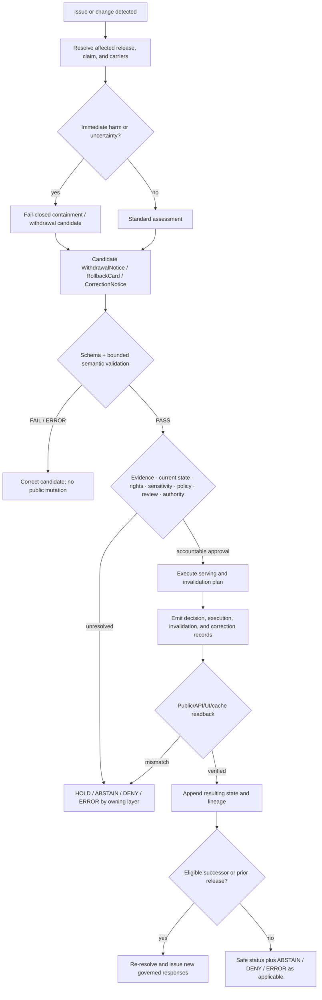

<!-- [KFM_META_BLOCK_V2]
doc_id: kfm://doc/focus-mode-state-transitions-published-to-revoked
title: Release Withdrawal Transition Boundary — PUBLISHED to REVOKED / withdrawn
type: standard; focus-mode; release-accountability-transition; compatibility-lane
version: v1.0
status: draft; repository-grounded; documentation-only; generic-revocation-contract-gap; non-executing; non-release; non-publication
owner: "@bartytime4life via CODEOWNERS; release, withdrawal, correction, rollback, evidence, policy, runtime, cache, and independent review authority NEEDS VERIFICATION"
created: 2026-05-24
updated: 2026-08-22
policy_label: public; documentation; focus-mode; release-accountability; published; revoked; withdrawn; correction; rollback; cite-or-abstain; fail-closed
owning_root: docs/
responsibility: >-
  Explain the bounded relationship between a previously released object and a
  later withdrawal or revocation posture, reconcile the v0.1 prose with current
  release, withdrawal, rollback, correction, runtime, schema, and validator
  evidence, and preserve compatibility anchors without executing a transition.
authority: >-
  Human-readable reconciliation and review guidance only. Contracts own semantic
  meaning; schemas own machine shape; release, policy, evidence, review,
  correction, rollback, runtime, cache, deployment, and publication remain with
  their accountable owners.
current_path: docs/focus-mode/state/transitions/published-to-revoked.md
canonical_relationship: >-
  Same-path documentation correction in the repository-present Focus compatibility
  lane. Structural migration or a new generic revocation object family remains HOLD.
truth_posture: >-
  CONFIRMED the tracked target and prior v0.1 blob, current release and runtime
  object surfaces inspected for this change, the absence of the formerly claimed
  generic revocation-manifest schema path at the pinned evidence snapshot, and the
  documentation-only non-effect / LINEAGE the old signed-manifest, reason-code,
  signature, TTL, replaces_with, cache, and receipt claims / PROPOSED a complete
  withdrawal decision, execution, invalidation, successor, and public-readback
  protocol / UNKNOWN production execution, authority, signing custody, cache
  invalidation, correction propagation, deployment, and public parity.
evidence_snapshot:
  repository: bartytime4life/Kansas-Frontier-Matrix
  authored_base_commit: d365545e1035907160a14c6068f0612bea195b11
  delivery_base_commit: 785606a6cc7d1f949eeb8c83799834c8b763d5a8
  target_prior_blob: 54280a501a9f4a937354345bf6f957e17d8cf47c
  note: >-
    The authored and delivery bases differ only through unrelated repository
    changes observed before delivery; the target prior blob remained unchanged.
related:
  - ./README.md
  - ../README.md
  - ../finite-outcomes.md
  - ../payload-state.md
  - ../revocation-state.md
  - ./answer-to-abstain.md
  - ./rollback-to-prior.md
  - ../../../../contracts/release/release_manifest.md
  - ../../../../contracts/release/withdrawal_notice.md
  - ../../../../contracts/release/rollback_card.md
  - ../../../../contracts/release/release_alias_verification.md
  - ../../../../contracts/correction/correction_notice.md
  - ../../../../contracts/runtime/runtime_response_envelope.md
  - ../../../../schemas/contracts/v1/release/release_manifest.schema.json
  - ../../../../schemas/contracts/v1/release/withdrawal_notice.schema.json
  - ../../../../schemas/contracts/v1/release/release_state.schema.json
  - ../../../../schemas/contracts/v1/release/release_alias_verification.schema.json
  - ../../../../schemas/contracts/v1/runtime/runtime_response_envelope.schema.json
  - ../../../../release/README.md
  - ../../../doctrine/directory-rules.md
  - ../../../adr/ADR-0029-adopt-directory-governance-standard-v2.md
  - ../../../../.github/CODEOWNERS
tags: [kfm, focus-mode, state, transition, published, revoked, withdrawn, correction, rollback, release-manifest, runtime-response-envelope, cache-invalidation, compatibility, non-publication]
notes:
  - "v1.0 replaces behavior-assertive v0.1 prose with a repository-grounded accountability boundary."
  - "PUBLISHED to REVOKED is retained as compatibility shorthand, not a proved generic machine enum."
  - "No release, withdrawal, correction, rollback, invalidation, deployment, or publication is performed by this document."
[/KFM_META_BLOCK_V2] -->

<a id="top"></a>
<a id="transition--published--revoked"></a>

# Release Withdrawal Transition Boundary — `PUBLISHED` → `REVOKED` / withdrawn

> **Purpose.** Explain how a previously released KFM object may later become
> ineligible for continued reliance without rewriting its release history or
> confusing documentation, validation, decision, execution, correction,
> rollback, runtime, and publication authority.

[](#1-status-and-evidence-boundary)
[](#1-status-and-evidence-boundary)
[](#9-runtime-client-and-cache-boundary)
[](#2-responsibility-and-placement-boundary)

> [!IMPORTANT]
> **This file cannot revoke, withdraw, correct, restore, or invalidate anything.**
> It cannot mutate a `ReleaseManifest`, issue a `WithdrawalNotice`, approve a
> `RollbackCard`, switch an alias, invalidate a cache, emit a runtime response,
> or authorize public use. It documents the proof boundary an implementation
> must satisfy.

> [!WARNING]
> **`PUBLISHED → REVOKED` is shorthand, not an in-place mutation.** The prior
> release record remains immutable and audit-addressable. A later withdrawal,
> correction, supersession, or rollback must be represented by new linked
> records and verified effects.

> [!CAUTION]
> **The v0.1 generic revocation manifest is not current machine authority.** The
> formerly named `schemas/contracts/v1/release/revocation_manifest.schema.json`
> path was absent at the pinned evidence snapshot. Its signature, TTL,
> `content_hash`, `spec_hash`, `replaces_with`, reason-code, and receipt claims
> are retained as lineage only.

> [!NOTE]
> **No one runtime outcome follows automatically.** Current client responses
> remain `ANSWER`, `ABSTAIN`, `DENY`, or `ERROR`, selected from current evidence,
> policy, release, freshness, and correction state—not from this filename.

**Quick navigation:** [Status](#1-status-and-evidence-boundary) ·
[Authority](#2-responsibility-and-placement-boundary) ·
[Semantics](#3-transition-semantics) · [Triggers](#4-trigger-conditions) ·
[Preconditions](#5-pre-conditions) · [Protocol](#6-decision-and-execution-protocol) ·
[Postconditions](#7-post-conditions-and-closure-evidence) ·
[Records](#8-required-records-and-receipts) ·
[Runtime/cache](#9-runtime-client-and-cache-boundary) ·
[Replacement](#10-replacement-supersession-and-no-replacement) ·
[Rollback](#11-rollback-target-and-restoration-boundary) ·
[Diagram](#12-diagram) · [Validation](#13-validation-and-negative-tests) ·
[Anti-patterns](#14-anti-patterns) · [Open work](#15-open-verification-backlog) ·
[Maintenance](#16-maintenance-correction-and-documentation-rollback) ·
[References](#17-cross-references) · [History](#18-change-history)

---

## 1. Status and evidence boundary

| Question | Repository-grounded answer | Truth label |
|---|---|---|
| Does this target exist? | Yes; the prior v0.1 target blob is `54280a501a9f4a937354345bf6f957e17d8cf47c`. | `CONFIRMED` |
| Is `REVOKED` a proved generic release-state enum? | No. The generic release-state schema inspected for this work is an empty proposed scaffold, not a closed state enum. | `CONFIRMED` gap |
| Does the v0.1 generic revocation schema exist at its claimed path? | No at the pinned evidence snapshot. | `CONFIRMED` absence |
| What is the nearest generic semantic object? | `WithdrawalNotice`; its semantic contract exists, while its paired schema remains thin and permissive. | `CONFIRMED` shape; maturity `UNKNOWN` |
| Can `RollbackCard` execute rollback? | No. The inspected candidate profile is fixture-first and keeps authority and execution flags false. | `CONFIRMED` non-execution boundary |
| Can alias verification mutate current state? | No. The inspected profile is fixture-only and non-mutating; `READY` is preflight coherence, not execution. | `CONFIRMED` |
| What client outcomes are machine-enumerated? | `ANSWER`, `ABSTAIN`, `DENY`, and `ERROR`. | `CONFIRMED` schema shape |
| Was a live withdrawal or cache invalidation exercised? | No. | `CONFIRMED` non-effect; behavior `UNKNOWN` |
| Is this path final canon? | Same-path maintenance is allowed; structural convergence remains `HOLD`. | `CONFIRMED` disposition |

Repository presence proves bytes and proposed shapes exist. It does not prove source
validity, actor authority, policy permission, review completion, signature validity,
release mutation, invalidation, deployment, or public parity.

[Back to top](#top)

---

## 2. Responsibility and placement boundary

### This document owns

- the human-readable `PUBLISHED` to withdrawn/revoked relationship;
- reconciliation of v0.1 claims with current repository evidence;
- preservation of the filename, document anchor, and legacy section anchors;
- separation of withdrawal, correction, supersession, rollback, runtime response,
  cache state, and repository delivery; and
- review, validation, maintenance, and rollback guidance.

### This document does not own

| Responsibility | Owning surface | Effect here |
|---|---|---|
| Release-object meaning | release contracts | This page cannot add fields or settle object-family ownership |
| Machine shape | release/runtime schemas | Current schemas outrank stale prose |
| Evidence and source authority | evidence/source owners | An old release ref does not prove current support |
| Rights, sensitivity, access, and policy | `policy/` plus accountable evaluation | This page cannot allow, deny, redact, or disclose |
| Release decisions and state | `release/` plus accountable actors | No decision or mutation occurs here |
| Correction and public notice | correction governance | No public claim is corrected by this edit |
| Cache, alias, API, UI, map, search, and AI effects | governed implementations | No invalidation or rebinding is proved here |
| Deployment and publication | deployment/release systems | A PR, merge, badge, or GitHub release is not KFM publication |

### Directory Rules basis

Accepted ADR-0029 adopts Directory Rules v2. The existing `docs/` path owns human
explanation, so same-path replacement is `PLACE`. Treating this page as a release
ledger or creating a parallel generic `RevocationManifest` under `docs/` is `DENY`.
Moving or splitting the mixed Focus state tree remains `HOLD` until consumers,
anchors, ownership, migration tests, and rollback are resolved.

[Back to top](#top)

---

<a id="1-trigger-conditions"></a>
## 3. Transition semantics

`PUBLISHED → REVOKED` is retained as a compatibility label for this reviewable
sequence:

```text
previously released object
  -> issue or contradiction detected
  -> affected object and dependencies resolved
  -> evidence / rights / sensitivity / policy / review assessment
  -> accountable withdrawal, correction, supersession, or rollback decision
  -> separately executed serving and invalidation plan
  -> public-safe notice and readback
  -> append-only resulting state and lineage
```

These state families must remain separate:

| Family | Examples | Non-collapse rule |
|---|---|---|
| Lifecycle | RAW, WORK, QUARANTINE, PROCESSED, CATALOG, TRIPLETS, PUBLISHED | Publication is governed, not a filename change |
| Release identity | `ReleaseManifest`, release record, current-state/alias relation | Identifies released content; not a withdrawal decision |
| Withdrawal/correction | `WithdrawalNotice`, `CorrectionNotice` | Changes reliance or trust posture; does not erase history |
| Rollback planning | `RollbackCard` candidate | Names recovery intent; does not execute |
| Runtime response | `ANSWER`, `ABSTAIN`, `DENY`, `ERROR` | Per-request projection, not release mutation |
| Cache/current state | fresh, stale, pending/completed invalidation | Requires target-specific receipts and readback |
| Repository delivery | branch, commit, PR, merge | Repository state only; not publication authority |

[Back to top](#top)

---

## 4. Trigger conditions

A trigger opens an assessment; it does not authorize withdrawal.

| Trigger class | Examples | First required response |
|---|---|---|
| Evidence/source | contradiction, source correction/withdrawal, stale support | Resolve affected claims/releases and evidence lineage |
| Rights/terms | license or redistribution change, attribution defect | Hold unsafe exposure and obtain accountable review |
| Sensitivity/safety | protected location, living-person, archaeology, infrastructure risk | Contain harmful precision and apply qualified policy review |
| Policy/legal | policy failure, consent/sovereignty change, legal order | Route to accountable authority and record a safe reason |
| Integrity/security | digest/signature concern, build compromise, malicious content | Quarantine reliance and verify bytes/provenance |
| Operational | broken carrier, current-state outage, invalidation failure | Fail closed; do not infer continued eligibility |
| Correction/supersession | corrected or safer eligible release exists | Preserve predecessor lineage and validate successor independently |

### v0.1 reason-code lineage

The prior values `evidence_invalidated`, `rights_withdrawn`,
`sensitivity_escalation`, `legal_order`, `integrity_breach`,
`superseded_with_replacement`, and `policy_change` are **LINEAGE**, not a current
closed enum. Current candidate vocabularies differ and require an accepted registry
or explicit adapter before machine use.

[Back to top](#top)

---

<a id="2-pre-conditions"></a>
## 5. Pre-conditions

Before a non-emergency withdrawal decision is treated as complete, resolve or fail
closed on:

- exact affected object and release identity;
- current release/current-state evidence and immutable predecessor lineage;
- evidence and source references supporting the trigger;
- rights, sensitivity, policy, access, and public-safety posture;
- authenticated issuer and authority scope;
- accountable review and required separation of duties;
- affected API, tile, catalog, search, cache, AI, export, and downstream carriers;
- public correction/status-notice requirement;
- successor or rollback candidate, if any; and
- execution, readback, correction, and recovery plan.

The v0.1 detached signature, `content_hash`, `spec_hash`, issuer, TTL, and
`replaces_with` fields are not settled generic prerequisites. They remain design
candidates until object-family ownership, canonicalization, signing, and freshness
profiles are accepted.

Emergency containment may fail closed before every review is complete, but must
record known scope and reason, preserve history, prohibit unsupported claims of
closure, and require post-facto accountable review before containment is lifted.

[Back to top](#top)

---

## 6. Decision and execution protocol

This protocol is **PROPOSED review guidance**, not proof of an existing unified
operator.

| Phase | Required output | Failure posture |
|---|---|---|
| Detect | incident or finding | no implicit public mutation |
| Scope | exact affected object and dependency inventory | `HOLD` / fail closed on ambiguity |
| Candidate | applicable notice/card/correction object | candidate remains non-authoritative |
| Validate | schema and bounded semantic results | `FAIL`/`ERROR`; pass is not approval |
| Resolve | evidence, policy, rights, sensitivity, current state | owning layer selects bounded result |
| Review | authenticated review and separation of duties | no transition without required approval |
| Decide | append-only decision with scope, reason, target, time | no implicit execution |
| Execute | current-state/serving change by accepted operator | emit target-specific result |
| Invalidate | named caches and derivatives | incomplete on missing receipt/readback |
| Notify | public-safe correction/withdrawal/status route | do not leak protected reason detail |
| Verify | API/UI/map/search/cache readback | remain held on mismatch |
| Close | resulting state, lineage, residual risk, recovery target | no closure by assertion |

```text
candidate != decision
validation PASS != authority
signed bytes != evidence closure
withdrawal decision != invalidation completion
runtime ABSTAIN != release-state mutation
Git revert != public rollback
```

[Back to top](#top)

---

<a id="3-post-conditions"></a>
## 7. Post-conditions and closure evidence

Future closure requires evidence that:

- the prior release remains immutable and audit-addressable;
- an accountable withdrawal/correction decision names object, reason, authority,
  scope, and effective time;
- governed serving/current-state posture changed and was read back;
- each affected cache or derivative has a receipt or explicit unaffected finding;
- public-safe correction or status is visible where users relied on the release;
- successor, prior-release rollback, null target, or continuing hold is explicit;
- later runtime envelopes are regenerated from current state;
- detection, decision, effective, invalidation, notice, verification, and
  supersession times remain distinct; and
- residual uncertainty and a correction/restoration path remain visible.

A Markdown update, schema-valid candidate, passing CI job, PR, merge, GitHub
release, file move, TTL expiry, dashboard badge, or Git revert is not sufficient
closure evidence by itself.

[Back to top](#top)

---

<a id="4-required-receipts"></a>
## 8. Required records and receipts

A mature transition needs distinct objects; no single “revocation manifest” should
silently absorb all authority.

| Object | Role | Current bounded posture |
|---|---|---|
| `ReleaseManifest` | identifies released contents and lineage | proposed dual-profile shape; strict fixture remains non-authoritative |
| `WithdrawalNotice` | records changed reliance/serving posture | semantic contract exists; schema is thin |
| `CorrectionNotice` | explains correction, supersession, redaction, or withdrawal | draft contract; machine closure incomplete |
| `RollbackCard` | proposes recovery target and invalidations | closed candidate schema/validator/fixtures; execution flags false |
| `ReleaseAliasVerification` | compares expected and observed alias state | fixture-only non-mutating preflight |
| Evidence/source records | support why posture changed | must resolve; not performed here |
| Policy/review records | record admissibility and accountable review | active execution profile needs verification |
| Decision record | authorizes or rejects the transition | canonical release root exists; production flow unknown |
| Execution/invalidation receipts | prove target-specific effects | generic complete set needs verification |
| Public readback evidence | proves clients no longer present old state as current | unknown |
| `RuntimeResponseEnvelope` | carries one later client outcome | four-value shape confirmed; selection remains implementation-owned |
| `AIReceipt` | accounts for AI participation when applicable | conditional; not evidence or universal |

The prior TTL, signature, and one-run-receipt model remains lineage. A future
signing profile must bind actor, authority, canonical bytes, key custody, algorithm,
expiry/replay, and verification—not merely a signature-shaped field.

[Back to top](#top)

---

## 9. Runtime, client, and cache boundary

Current client outcomes are exactly:

```text
ANSWER
ABSTAIN
DENY
ERROR
```

A later request may produce:

| Resolved current condition | Candidate outcome | Constraint |
|---|---|---|
| Verified withdrawal; no eligible support | `ABSTAIN` | no answer precision; safe reason only |
| Policy/rights/sensitivity prohibits disclosure | `DENY` | do not leak withdrawn or protected content |
| Current-state, resolver, signature, or invalidation state cannot be verified | `ERROR` or accepted fail-closed `ABSTAIN` | never infer stale cache remains eligible |
| Eligible successor/prior release independently resolves and supports the claim | new `ANSWER` | new envelope and support; never reuse old answer |
| Replacement exists but does not support requested scope/precision | `ABSTAIN` | replacement identity alone is insufficient |

A withdrawal never mutates an earlier `RuntimeResponseEnvelope`. The earlier answer
remains historical evidence of what was served then. Every later response is a new,
traceable envelope from current evidence, policy, release, freshness, and correction
state.

A mature implementation must name and verify API, CDN, tiles, catalogs, triplets,
search, vector, AI, offline, export, and downstream caches. The old 0/60/300-second
TTL values are not current generic defaults, and TTL is not a grace period that can
override a known applicable withdrawal.

[Back to top](#top)

---

<a id="7-replacement-vs-no-replacement-paths"></a>
## 10. Replacement, supersession, and no replacement

### Replacement exists

A replacement may become current only after its own identity, evidence/source role,
rights/sensitivity/policy, validation, review, release decision, effective time,
correction lineage, and governed-client resolution are proved. The legacy
`replaces_with` field is not current generic schema authority.

### No replacement exists

No replacement can lead to `ABSTAIN`, `DENY`, `ERROR`, or a public-safe status
message depending on resolved state. It does not imply one fixed outcome.

### Supersession is not automatically revocation

A normal new release may supersede a predecessor while retaining clearly marked
historical access. Withdrawal applies when continued reliance is unsafe or no longer
allowed. Correction can accompany either. The accepted release-state model must own
the final vocabulary.

[Back to top](#top)

---

<a id="5-rollback-target"></a>
## 11. Rollback target and restoration boundary

Withdrawal and rollback are independent transitions.

| Transition | Purpose | Current posture |
|---|---|---|
| Withdrawal candidate | stop or narrow reliance on an affected release | `WithdrawalNotice` semantics proposed |
| Prior-release rollback candidate | propose restoring a distinct earlier release | `RollbackCard` candidate validated but non-executing |
| Executed rollback | mutate governed current state, invalidate carriers, notify, and verify | `UNKNOWN` / `HOLD` |
| Git revert | restore repository bytes | repository operation only |
| Documentation revert | restore this Markdown | documentation correction only |

A green `RollbackCard` candidate does not prove execution. Its governance flags must
remain false and its release ref null in the inspected fixture-first profile. A
`ReleaseAliasVerification` result of `READY` proves only preflight coherence.
Withdrawal may have no safe rollback target; restoring a prior release requires full
current evidence, policy, rights, sensitivity, review, release, invalidation, notice,
and readback.

[Back to top](#top)

---

<a id="6-diagram"></a>
## 12. Diagram



[Back to top](#top)

---

## 13. Validation and negative tests

Documentation validation for this file must verify one H1, one complete metadata
block, all legacy anchors exactly once, balanced fences/markers, valid fragments,
repository-present relative targets, UTF-8/LF/final newline, no trailing whitespace
or conflict markers, and an exact one-file diff unless a direct dependency is proved.

Repository validators may prove only their bounded shapes. A passing withdrawal
schema proves little while only `id` is required. A passing `RollbackCard` proves a
candidate, not authority or execution. A passing runtime-envelope validator proves
finite response shape, not release mutation.

Required negative cases include:

| Negative case | Required result |
|---|---|
| Generic revocation schema is assumed to exist | report explicit absence or fail documentation/contract check |
| Id-only withdrawal is called operationally complete | fail closed |
| Rollback candidate sets authority/execution flag true | validator `FAIL` |
| Signature/current-state verification fails and cache is served as current | fail closed |
| Replacement is served without re-resolving evidence/policy/release state | integration failure |
| Invalidation lacks target receipts/readback | transition remains incomplete |
| Protected reason details leak publicly | policy/security failure |
| Earlier release manifest is silently edited | lineage/immutability failure |
| Git revert is represented as public rollback | governance failure |

[Back to top](#top)

---

<a id="8-anti-patterns"></a>
## 14. Anti-patterns

| Anti-pattern | Why it breaks KFM |
|---|---|
| Treating v0.1 fields as implemented | the named generic schema is absent |
| Creating a parallel `RevocationManifest` by convenience | risks competing release authority |
| Rewriting/deleting the prior release | destroys audit and correction lineage |
| Calling id-only notice complete | thin shape does not prove semantics or effects |
| Calling a green candidate “executed” | validation is not authority or mutation |
| Treating signature or TTL as truth | neither replaces evidence, policy, or current-state proof |
| Mapping every withdrawal to `ABSTAIN` | prohibition, failure, and eligible-successor cases differ |
| Rebinding without full revalidation | successor identity alone is not support |
| Partial invalidation | old state remains reachable through unhandled carriers |
| Silent correction, withdrawal, or reactivation | users cannot reconstruct reliance changes |
| Git merge/revert as release proof | repository and public state are separate |
| Letting this page become a release ledger or runtime policy | creates parallel authority under `docs/` |

[Back to top](#top)

---

## 15. Open verification backlog

| ID | Question | Status / next evidence |
|---|---|---|
| PR-Q1 | Is “revocation” a `WithdrawalNotice` profile, separate object, policy decision, or release-state value? | `NEEDS VERIFICATION` through accepted object-family decision |
| PR-Q2 | Which accepted contract owns generic release-state vocabulary? | current scaffold is empty |
| PR-Q3 | Which reason-code registry governs withdrawal, rollback, correction, and runtime? | v0.1 and candidate vocabularies need crosswalk or separation |
| PR-Q4 | What does `spec_hash` bind per object family? | canonicalization/hash profile needed |
| PR-Q5 | What signing actor, key, algorithm, custody, expiry, and replay profile applies? | production trust model `UNKNOWN` |
| PR-Q6 | Which current-state/alias service and freshness policy is authoritative? | `UNKNOWN` |
| PR-Q7 | Which invalidation targets require receipts and what proves completion? | execution/readback profile unresolved |
| PR-Q8 | Which public notice is required for withdrawal, correction, rollback, and supersession? | correction machine maturity incomplete |
| PR-Q9 | How is withdrawal lifted or narrowed without silent reactivation? | new reviewed transition required |
| PR-Q10 | Which independent reviewers are mandatory for high-risk domains? | authority `NEEDS VERIFICATION` |
| PR-Q11 | What proves external/offline consumer closure? | repository search alone is insufficient |
| PR-Q12 | When should this compatibility document move or split? | state-tree migration remains `HOLD` |

An ADR or equivalent accepted decision is required for a new object family,
responsibility-owner change, breaking release-state contract, signing trust root,
persisted identity change, or public runtime semantic change.

[Back to top](#top)

---

## 16. Maintenance, correction, and documentation rollback

Re-review this page when a generic withdrawal/revocation schema is accepted, release
state becomes machine-enumerated, `ReleaseManifest` or `RollbackCard` maturity
changes, a reason-code/signing/current-state/invalidation profile is accepted, public
readback is implemented, sibling transition docs are reconciled, or the Focus state
tree moves.

Before merge, close the draft PR and abandon the feature branch to roll back this
documentation change. After an authorized merge, use a transparent revert or bounded
forward-correction PR against the actual merge commit. Preserve v0.1 in Git history;
do not rewrite shared history.

Reverting this Markdown does not reverse a release decision, alias mutation, cache or
tile invalidation, public notice, deployed runtime change, rollback execution, or user
reliance. Real incidents require their own governed correction, withdrawal, rollback,
invalidation, verification, and supersession records.

[Back to top](#top)

---

<a id="9-cross-references"></a>
## 17. Cross-references

### State and transition documentation

- [Transition documentation boundary](./README.md)
- [Parent state documentation boundary](../README.md)
- [Revocation, withdrawal, and rollback state boundary](../revocation-state.md)
- [Finite runtime outcomes](../finite-outcomes.md)
- [Payload-state boundary](../payload-state.md)
- [`ANSWER` → `ABSTAIN` response relationship](./answer-to-abstain.md)
- [Rollback-to-prior transition lineage](./rollback-to-prior.md)

### Release, correction, runtime, and machine shape

- [`ReleaseManifest` semantic contract](../../../../contracts/release/release_manifest.md)
- [`WithdrawalNotice` semantic contract](../../../../contracts/release/withdrawal_notice.md)
- [`RollbackCard` semantic contract](../../../../contracts/release/rollback_card.md)
- [`ReleaseAliasVerification` semantic contract](../../../../contracts/release/release_alias_verification.md)
- [`CorrectionNotice` semantic contract](../../../../contracts/correction/correction_notice.md)
- [`RuntimeResponseEnvelope` semantic contract](../../../../contracts/runtime/runtime_response_envelope.md)
- [`ReleaseManifest` schema](../../../../schemas/contracts/v1/release/release_manifest.schema.json)
- [`WithdrawalNotice` schema](../../../../schemas/contracts/v1/release/withdrawal_notice.schema.json)
- [Generic release-state scaffold](../../../../schemas/contracts/v1/release/release_state.schema.json)
- [`ReleaseAliasVerification` schema](../../../../schemas/contracts/v1/release/release_alias_verification.schema.json)
- [`RuntimeResponseEnvelope` schema](../../../../schemas/contracts/v1/runtime/runtime_response_envelope.schema.json)

### Governance

- [Canonical release decision root](../../../../release/README.md)
- [Accepted Directory Rules v2](../../../doctrine/directory-rules.md)
- [ADR-0029 — Directory Rules adoption](../../../adr/ADR-0029-adopt-directory-governance-standard-v2.md)
- [CODEOWNERS](../../../../.github/CODEOWNERS)

[Back to top](#top)

---

## 18. Change history

| Version | Date | Change | Authority effect |
|---|---|---|---|
| v0.1 | 2026-05-24 | Behavior-assertive generic signed-manifest, reason-code, TTL, cache, replacement, and receipt design. | Design lineage only; no current implementation proof. |
| v1.0 | 2026-08-22 | Reconciles current release, withdrawal, rollback, correction, runtime, schema, validator, Directory Rules, and CODEOWNERS evidence; preserves legacy anchors and makes absent, proposed, conflicted, unknown, and held surfaces explicit. | Documentation-only; no release, withdrawal, correction, rollback, invalidation, deployment, or publication effect. |

---

**Last reviewed:** 2026-08-22 · **Prior target blob:**
`54280a501a9f4a937354345bf6f957e17d8cf47c` · **Document version:** v1.0 ·
**Status:** repository-grounded draft · **Operational withdrawal/revocation:** `HOLD`

[Back to top](#top)
