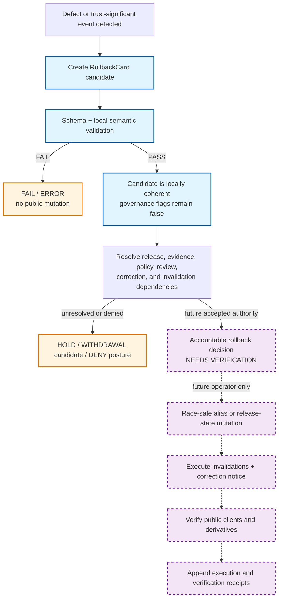

<!-- [KFM_META_BLOCK_V2]
doc_id: kfm://doc/focus-mode-state-transitions-rollback-to-prior
title: Rollback-to-Prior Transition Boundary — Candidate Restoration of a Prior Release
type: standard; focus-mode; release-rollback-transition; compatibility-lane
version: v1.0
status: draft; repository-grounded; documentation-only; candidate-aware; non-executing; non-release; non-publication
owner: "@bartytime4life via CODEOWNERS; release, correction, withdrawal, rollback, evidence, policy, review, runtime, invalidation, and independent approval authority NEEDS VERIFICATION"
created: 2026-05-24
updated: 2026-08-22
policy_label: public; documentation; focus-mode; rollback; prior-release; correction; withdrawal; release-state; invalidation; cite-or-abstain; fail-closed; no-silent-mutation
owning_root: docs/
responsibility: >-
  Explain the bounded rollback-to-prior design, reconcile the v0.1 behavior
  claims with the current fixture-first RollbackCard contract, schema,
  validator, fixtures, release-root guidance, correction surface, alias
  preflight, and release-state scaffold, preserve legacy anchors, and expose
  the authority, execution, invalidation, correction, and public-state gaps
  without executing or authorizing rollback.
authority: >-
  Human-readable reconciliation, review guidance, and maintenance
  documentation only. Rollback meaning belongs to contracts/release/; machine
  shape belongs to schemas/contracts/v1/release/; policy, evidence, review,
  release decisions, alias mutation, invalidation, execution receipts,
  correction, deployment, and publication remain with their owning roots and
  accountable authorities.
current_path: docs/focus-mode/state/transitions/rollback-to-prior.md
canonical_relationship: >-
  Same-path documentation correction inside the repository-present singular
  Focus compatibility lane. Accepted Directory Rules v2 supports PLACE for
  this docs-root edit but does not settle the mixed state tree's final split,
  migration, transition-object homes, consumer aliases, or retirement.
truth_posture: >-
  CONFIRMED the current path and prior v0.1 bytes, the parent transition and
  revocation-state boundaries, accepted ADR-0029 and adopted Directory Rules
  v2, the canonical release decision root, the proposed closed RollbackCard
  1.0.0 candidate schema, its candidate-only validator, three valid and six
  invalid fixtures, the fixture-first semantic contract, the proposed
  non-mutating ReleaseAliasVerification preflight, the thin CorrectionNotice
  contract/schema posture, the empty proposed release-state scaffold, and the
  four-outcome RuntimeResponseEnvelope machine shape / LINEAGE the v0.1
  lower-case rollback reason names, claims that a signed card is currently
  issued, live and rolled-back release-state values, automatic supersession
  chain updates, client rebinding, cache invalidation, and a completed
  rollback execution path / PROPOSED actor authentication, policy evaluation,
  review completion, safe-target revalidation, accepted rollback decision,
  conditional alias mutation, invalidation execution, correction propagation,
  public notice, execution receipt, and post-transition verification /
  CONFLICTED the v0.1 description of RollbackCard as an executed receipt while
  the current profile deliberately requires authority_created,
  policy_evaluated, review_completed, rollback_executed, and
  public_state_mutated to remain false and governance.release_ref to remain
  null / UNKNOWN production release registry, current-alias implementation,
  signer custody, accountable approval, operational rollback, cache and
  derivative invalidation, governed API or UI rebinding, deployment, and
  public parity / NEEDS VERIFICATION every implementation or public-use claim
  beyond the inspected repository shapes and documentation boundaries.
evidence_snapshot:
  repository: bartytime4life/Kansas-Frontier-Matrix
  base_ref: main
  inspected_commit: 4712e52f10a6c8f688cc1e158b7e010888fb4102
  target_prior_blob: f0e8327f3bfe65ad95a58a1a507e8323c3395d72
  transitions_readme_blob: 220f7d6b7c2cd486267490a986d943a509d54347
  revocation_state_blob: da4e1cbec2db9a589f7480debd9e8bde1d9f47d4
  release_root_readme_blob: 60b6a656f8f2b765616bba7223f51c25863c7172
  rollback_contract_blob: c6d3c35c56b064e04c3a2532f4709d938d7b0c1a
  rollback_schema_blob: e0a9edf02dd5d6997eda60a054a5bf19636c3dd4
  rollback_validator_blob: 9e9ed5a92851935b41a36698e4bead13ef4edf57
  rollback_valid_fixture_count: 3
  rollback_invalid_fixture_count: 6
  correction_notice_contract_blob: 4716f2bc6e714ad2ab873d95144417d7855f5beb
  release_alias_verification_contract_blob: 0580b1445e864afb295213797cbf1dd47712e63c
  release_state_schema_blob: 2911be7873f0bf42a7cec073437b71f16748e5a3
  runtime_response_schema_blob: 8b86e7db8b18b65a56a4e639dfc54e1b2db93155
  directory_rules_blob: fd49a0b83e55cef52c1124281f093e263526898d
  adr_0029_blob: a4de0d7a96b78da59cfc499d1025e1508afd8dd9
  codeowners_blob: dd2a84aa514d8ecd9208bc347f90f9a2ed37dd61
inspection_boundary: >-
  Current-session GitHub reads covered current main, the complete prior target,
  the transition-directory and parent revocation documentation boundaries,
  accepted Directory Rules evidence, the canonical release-root guidance,
  RollbackCard semantic contract, schema and validator, fixture inventory,
  CorrectionNotice, ReleaseAliasVerification, release-state schema,
  RuntimeResponseEnvelope schema, CODEOWNERS, open pull-request overlap, and
  task-branch overlap. No source was admitted, no EvidenceRef was resolved, no
  policy evaluator or authenticated reviewer was exercised, no RollbackCard
  was approved or signed, no release alias or public carrier was mutated, no
  cache or derivative was invalidated, and no rollback, correction,
  withdrawal, deployment, or public endpoint was executed.
related:
  - ./README.md
  - ./published-to-revoked.md
  - ../README.md
  - ../revocation-state.md
  - ../payload-state.md
  - ../lifecycle-states.md
  - ../finite-outcomes.md
  - ../../../../release/README.md
  - ../../../../contracts/release/rollback_card.md
  - ../../../../schemas/contracts/v1/release/rollback_card.schema.json
  - ../../../../tools/validators/release/validate_rollback_card.py
  - ../../../../tests/validators/test_validate_rollback_card.py
  - ../../../../fixtures/release/rollback_card/
  - ../../../../contracts/correction/correction_notice.md
  - ../../../../contracts/release/release_alias_verification.md
  - ../../../../schemas/contracts/v1/release/release_state.schema.json
  - ../../../../schemas/contracts/v1/runtime/runtime_response_envelope.schema.json
  - ../../../doctrine/directory-rules.md
  - ../../../adr/ADR-0029-adopt-directory-governance-standard-v2.md
  - ../../../../.github/CODEOWNERS
tags: [kfm, focus-mode, state, transition, rollback, prior-release, rollback-card, correction, invalidation, release-alias, compatibility, non-publication]
notes:
  - "v1.0 replaces the execution-assertive v0.1 prose with a repository-grounded rollback-to-prior documentation boundary."
  - "The current RollbackCard stack validates candidate shape and local consistency only; it deliberately cannot claim authority, completed review or policy, execution, public mutation, or release."
  - "The release-state schema does not enumerate live, rolled-back, revoked, or superseded-by; those values remain lineage or proposal unless accepted elsewhere."
  - "Legacy lower-case reason codes are crosswalked to the current closed RollbackCard reason vocabulary instead of represented as current enums."
  - "No rollback, withdrawal, correction, release, deployment, publication, or repository-setting transition is performed by this document."
[/KFM_META_BLOCK_V2] -->

<a id="top"></a>
<a id="transition--published--rolled-back-prior-release-re-promoted"></a>

# Rollback-to-Prior Transition Boundary — Candidate Restoration of a Prior Release

> **Purpose.** Explain how KFM may describe a candidate request to stop using one
> release and restore a distinct prior release, while keeping candidate validation,
> accountable approval, release-state mutation, correction, invalidation, public
> rebinding, and publication authority separate.

[](#1-status-and-evidence-boundary)
[](#3-transition-semantics)
[](#13-validation-and-negative-tests)
[](#1-status-and-evidence-boundary)
[](#2-responsibility-and-placement-boundary)

> [!IMPORTANT]
> **This file is not an executable rollback.** It cannot approve a
> `RollbackCard`, authenticate an actor, resolve its references, evaluate policy,
> move a current alias, invalidate caches, issue a correction, restore a public
> carrier, or authorize release or publication.

> [!WARNING]
> **A schema-valid card is deliberately non-executing.** The current
> `RollbackCard` profile requires `authority_created`, `policy_evaluated`,
> `review_completed`, `rollback_executed`, and `public_state_mutated` to be
> `false`; `governance.release_ref` must be `null`.

> [!CAUTION]
> **`PUBLISHED → rolled-back` is not a current machine enum.** The generic
> `release_state.schema.json` is an empty proposed scaffold. The v0.1 values
> `live`, `rolled-back`, and `superseded-by` are useful lineage vocabulary, not
> verified release-state authority.

> [!NOTE]
> **Rollback, withdrawal, revocation, correction, supersession, Git revert, and
> client rebinding are distinct.** One incident may require several linked
> records, but no record silently substitutes for another.

**Quick navigation:** [Status](#1-status-and-evidence-boundary) ·
[Authority](#2-responsibility-and-placement-boundary) ·
[Semantics](#3-transition-semantics) ·
[Triggers](#4-trigger-conditions) ·
[Preconditions](#5-pre-conditions) ·
[Decision matrix](#6-candidate-disposition-and-target-matrix) ·
[Postconditions](#7-post-conditions) ·
[Records](#8-required-records-and-receipts) ·
[Clients](#9-client-cache-and-invalidation-boundary) ·
[Forward path](#10-forward-path-after-rollback) ·
[Pairing](#11-pairing-with-revocation-withdrawal-and-correction) ·
[Diagram](#12-diagram) ·
[Validation](#13-validation-and-negative-tests) ·
[Anti-patterns](#14-anti-patterns) ·
[Open work](#15-open-verification-backlog) ·
[Maintenance](#16-maintenance-correction-and-documentation-rollback) ·
[References](#17-cross-references) · [History](#18-change-history)

---

## 1. Status and evidence boundary

| Question | Current bounded answer | Truth label |
|---|---|---|
| Does this document exist at the requested path? | Yes. The prior v0.1 file is tracked at blob `f0e8327f3bfe65ad95a58a1a507e8323c3395d72`. | `CONFIRMED` |
| Does a current `RollbackCard` semantic contract exist? | Yes. It defines a proposed immutable candidate plan and target binding, not an executed rollback. | `CONFIRMED` repository presence; authority `PROPOSED` |
| Is the machine profile closed and testable? | Yes. The paired `1.0.0` schema is closed, and a no-network validator checks bounded shape and local consistency. | `CONFIRMED` |
| What candidate dispositions are machine-enumerated? | `ROLLBACK_CANDIDATE`, `WITHDRAWAL_CANDIDATE`, `HOLD`, and `ERROR`. | `CONFIRMED` current schema |
| What target modes are machine-enumerated? | `PRIOR_RELEASE`, `WITHDRAWAL`, and `HOLD`. | `CONFIRMED` current schema |
| Can a valid card claim that policy, review, execution, public mutation, or release already happened? | No. The schema requires all five governance flags to remain false and `release_ref` to remain null. | `CONFIRMED` |
| Does the repository prove an operational rollback executor? | No. Release-root guidance records rollback execution as held; no operator, authenticated decision, alias mutation, invalidation, or public rebind was exercised here. | `UNKNOWN` / `HOLD` |
| Does the generic release-state schema define `live`, `rolled-back`, `revoked`, or `superseded-by`? | No. It has no properties or enum. | `CONFIRMED` |
| Does a public correction surface exist? | A `CorrectionNotice` semantic contract exists, but its paired schema remains a thin proposal and full validation/execution is not established. | `CONFIRMED` current posture |
| Does alias-transition validation exist? | A fixture-only, non-mutating `ReleaseAliasVerification` preflight exists, including a `ROLLBACK` action. It never writes an alias. | `CONFIRMED` bounded profile |
| Does this page authorize or perform rollback, release, correction, deployment, or publication? | No. | `CONFIRMED` |
| Is this path final canon? | Same-path maintenance is allowed; structural convergence of the mixed state tree remains `HOLD`. | `CONFIRMED` current disposition |

### Truth labels used here

| Label | Meaning |
|---|---|
| `CONFIRMED` | Verified from current-session repository bytes or remote state. |
| `PROPOSED` | Design, behavior, vocabulary, authority, or operational flow not accepted or proved. |
| `LINEAGE` | Retained prior wording or vocabulary; not current authority by itself. |
| `CONFLICTED` | Current documents or object families make incompatible claims. |
| `UNKNOWN` | Evidence does not establish the claim. |
| `NEEDS VERIFICATION` | A concrete contract, reference, policy, review, execution, client, or release check remains. |
| `NOT_RUN` | The named executable or external check was not performed. |
| `HOLD` | Proceeding would cross an unresolved authority, placement, safety, review, or release boundary. |

Repository presence proves that bytes and candidate validation surfaces exist. It
 does not prove that a target release is safe, an actor is authorized, a review is
complete, an alias changed, invalidation finished, or public state was restored.

[Back to top](#top)

---

## 2. Responsibility and placement boundary

### This document owns

- a repository-grounded explanation of rollback-to-prior design;
- reconciliation of v0.1 claims with current RollbackCard and release evidence;
- preservation of the nine legacy transition anchors;
- separation of candidate validation from accountable decision and execution;
- a bounded crosswalk from legacy reasons to current schema vocabulary;
- documentation of correction, withdrawal, invalidation, alias, client, and
  release-state gaps; and
- maintenance and documentation rollback guidance.

### This document does not own

| Responsibility | Current owning surface or decision class | Effect here |
|---|---|---|
| RollbackCard meaning | [`RollbackCard` contract](../../../../contracts/release/rollback_card.md) | This page cannot add fields, dispositions, or normative semantics |
| RollbackCard machine shape | [Paired JSON Schema](../../../../schemas/contracts/v1/release/rollback_card.schema.json) | Closed shape and finite values outrank stale prose |
| Candidate validation | [RollbackCard validator](../../../../tools/validators/release/validate_rollback_card.py) and fixtures | A pass proves bounded local consistency only |
| Release decisions and append-only records | [`release/` root](../../../../release/README.md) and accountable release authority | Documentation cannot approve or apply a transition |
| Release-state vocabulary | Accepted contract/schema/registry decision | The current generic schema does not define the old state words |
| Evidence and source support | `EvidenceRef`, `EvidenceBundle`, source, and evidence owners | Reference presence does not prove resolution |
| Policy, rights, sensitivity, and access | `policy/` plus accountable evaluation | Documentation cannot allow restoration |
| Review and separation of duties | Review contracts, records, and verified reviewers | CODEOWNERS routing is not a ReviewRecord |
| Public correction | [`CorrectionNotice`](../../../../contracts/correction/correction_notice.md) and correction governance | This page cannot issue or publish a notice |
| Alias compare-and-swap preflight | [`ReleaseAliasVerification`](../../../../contracts/release/release_alias_verification.md) | Fixture-only verification is not mutation |
| Cache and derivative invalidation | Governed operators, runtime, CDN, catalog, search, vector, tile, and AI-cache owners | No invalidation behavior is established here |
| Public API/UI behavior | Governed API, Explorer, runtime, and release consumers | No rebind or serving result is proved |
| Deployment and publication | Deployment and release systems | A Markdown edit, PR, merge, or green check is not publication |

### Directory Rules basis

Accepted ADR-0029 adopts Directory Rules v2. Those rules place human-readable
explanation under `docs/`, assign release decisions to `release/`, semantic
meaning to `contracts/`, machine shape to `schemas/`, and executable validation
to `tools/` and `tests/`.

| Proposed action | Placement result | Basis |
|---|---|---|
| Correct this existing document in place | `PLACE` | Existing human-document responsibility under `docs/` |
| Treat this page as a rollback contract or executor | `DENY` | Would collapse documentation into semantic or operational authority |
| Create a second RollbackCard schema or release-decision home here | `DENY` | Would create parallel authority |
| Move or split the mixed state tree in this change | `HOLD` | Final owners, consumers, aliases, migration tests, and rollback remain unresolved |
| Reference current contract/schema/validator evidence | `PLACE` | Documentation may explain verified adjacent surfaces without owning them |

[Back to top](#top)

---

## 3. Transition semantics

`rollback-to-prior` is a human shorthand for a proposed recovery relationship:

```text
affected release A
  + distinct prior release B
  + evidence / policy / review / correction references
  + invalidation scope
  -> RollbackCard(disposition=ROLLBACK_CANDIDATE, target.mode=PRIOR_RELEASE)
```

The current repository proves the candidate representation and local validator,
not the state mutation that would follow an accepted decision.

### Candidate event versus operational event

| Layer | Current bounded representation | What remains unproved |
|---|---|---|
| Detection | `trigger.reason_code` and timezone-aware `detected_at` | Trusted detector, incident intake, materiality, and secrecy controls |
| Candidate plan | Immutable `RollbackCard` with affected and target release refs | Reference resolution, target safety, accepted authority |
| Candidate validation | Schema plus deterministic local cross-field checks | Policy evaluation, authenticated review, decision approval |
| Alias preflight | Fixture-only `ReleaseAliasVerification(action=ROLLBACK)` | Conditional write, race control against a live registry, mutation receipt |
| Correction/public notice | Conditional `correction_notice_ref` in the card | Complete CorrectionNotice validation, issuance, safe public rendering |
| Invalidation | Finite declared invalidation classes | Actual cache, tile, catalog, search, vector, AI, and derivative invalidation |
| Public restoration | Not represented as executed by the current candidate profile | Release-registry update, public carrier rebind, deployment, public parity |
| Audit closure | Candidate lineage fields and support refs | Accepted decision, execution receipt, postcondition proof, rollback-of-rollback path |

### Immutable-history rule

An affected release is not erased, overwritten, or relabeled by editing its
historic record. A future operational flow would append decision, correction,
execution, invalidation, and verification records while preserving the prior
release and the failed or withdrawn release for lawful audit and replay.

[Back to top](#top)

---

<a id="1-trigger-conditions"></a>
<a id="4-trigger-conditions"></a>

## 4. Trigger conditions

The v0.1 document used lower-case reasons that are not the current
`RollbackCard.trigger.reason_code` enum. The following crosswalk preserves their
intent as lineage while using current machine vocabulary where a candidate is
created.

| Legacy v0.1 trigger or reason | Current candidate reason(s) | Current disposition |
|---|---|---|
| Evidence supporting the current release is contradicted or invalidated. | `EVIDENCE_CONTRADICTION` or `INSUFFICIENT_EVIDENCE` | Usually `ROLLBACK_CANDIDATE`, `WITHDRAWAL_CANDIDATE`, or `HOLD` depending on target safety |
| A new release introduced a behavior or content defect. | `RELEASE_DEFECT`, `VALIDATION_FAILURE`, or `OPERATIONAL_FAILURE` | `ROLLBACK_CANDIDATE` when a safe prior target exists |
| A policy or rights posture changed. | `POLICY_FAILURE`, `RIGHTS_CHANGE`, or `SOURCE_WITHDRAWAL` | Candidate outcome depends on current policy and source review |
| A sensitivity issue was discovered. | `SENSITIVITY_DISCOVERY` | Often `HOLD` or `WITHDRAWAL_CANDIDATE`; restoration requires independent target review |
| Security or urgent operational risk requires immediate containment. | `SECURITY_ISSUE`, `EMERGENCY_HOLD`, or `OPERATIONAL_FAILURE` | `HOLD`, `WITHDRAWAL_CANDIDATE`, or `ROLLBACK_CANDIDATE` |
| Input cannot support a valid decision. | `INPUT_INVALID` or `INSUFFICIENT_EVIDENCE` | `ERROR` or `HOLD`; never automatic restoration |

The following v0.1 names remain **LINEAGE only**:
`evidence_invalidated_post_release`, `regression`, `policy_revert`,
`correction_pending_rebuild`, and `emergency`.

> [!CAUTION]
> **A trigger does not select the final action by itself.** The same incident can
> produce `ROLLBACK_CANDIDATE`, `WITHDRAWAL_CANDIDATE`, `HOLD`, or `ERROR`
> depending on evidence closure, target availability, policy, review, and input
> validity.

[Back to top](#top)

---

<a id="2-pre-conditions"></a>

## 5. Pre-conditions

### Machine-enforced candidate conditions

For a `ROLLBACK_CANDIDATE`, the current validator requires or checks:

| Condition | Current enforcement |
|---|---|
| `target.mode` is `PRIOR_RELEASE`. | Schema plus semantic validator |
| `target.release_ref` is a non-empty string. | Schema plus semantic validator |
| Target release differs from `affected_release_ref`. | `ROLLBACK_TARGET_NOT_PRIOR` finding |
| `restoration.restore_release_ref` matches `target.release_ref`. | `RESTORATION_TARGET_MISMATCH` finding |
| Evidence support references are non-empty. | `EVIDENCE_REQUIRED` finding |
| Policy decision references are non-empty. | `POLICY_DECISION_REQUIRED` finding |
| Populated ref and invalidation arrays are sorted and unique. | `REFS_NOT_CANONICAL` finding |
| `restoration.validation_required` is `true`. | Schema constant |
| Public notice requirement has a correction reference. | `CORRECTION_NOTICE_REQUIRED` finding |
| Detection, decision, and effective times are ordered. | Time-order findings |
| Card lineage is not self-referential. | `SELF_SUPERSESSION` finding |
| Candidate cannot claim authority or execution. | `GOVERNANCE_BOUNDARY_VIOLATION` finding |

### Operational preconditions still required

The candidate validator does **not** establish these conditions:

- the affected release and target release resolve in an accepted release registry;
- the target is genuinely prior in accepted lineage, not merely a different string;
- the target's bytes, manifest, evidence, rights, policy, review, and sensitivity
  posture are valid under current rules;
- the target is not withdrawn, revoked, superseded by a correction, or otherwise
  unsafe;
- the actor proposing, approving, and executing the transition is authenticated
  and authorized;
- required reviewer separation and emergency authority are satisfied;
- a conditional-write or equivalent race-safe alias mutation mechanism exists;
- every affected public carrier and derivative is inventoried;
- a complete invalidation and correction plan exists;
- an execution receipt and postcondition verification profile exist.

Until those conditions are implemented and verified, operational rollback remains
`HOLD`.

> [!NOTE]
> **No prior target means no rollback-to-prior candidate.** A withdrawal with no
> safe replacement uses `WITHDRAWAL_CANDIDATE`; inability to decide uses `HOLD`
> or `ERROR` as the current profile requires.

[Back to top](#top)

---

## 6. Candidate disposition and target matrix

| Candidate disposition | Required target mode | Release target | Candidate meaning | Public-state effect |
|---|---|---|---|---|
| `ROLLBACK_CANDIDATE` | `PRIOR_RELEASE` | Distinct non-null prior release ref | Proposes restoration after evidence/policy/review closure | None; execution prohibited |
| `WITHDRAWAL_CANDIDATE` | `WITHDRAWAL` | `null` | Proposes stopping use without selecting a prior release | None; execution prohibited |
| `HOLD` | `HOLD` | `null` | Stops advancement while evidence, policy, authority, or target remains unresolved | None |
| `ERROR` | `HOLD` | Usually `null` | Records invalid or failed candidate evaluation | None |

A validator `PASS` means only that one candidate is internally coherent for its
bounded profile. It is not `READY`, `APPROVED`, `EXECUTED`, `PUBLISHED`, or
proof that the referenced target is safe.

[Back to top](#top)

---

<a id="3-post-conditions"></a>

## 7. Post-conditions

### What candidate validation can establish

After a successful current validator run:

- the JSON conforms to the proposed closed `RollbackCard` `1.0.0` shape;
- disposition, target mode, restoration target, timing, lineage, and local
  reference ordering are internally coherent;
- a prior-release candidate carries non-empty evidence and policy refs;
- public-notice intent has a correction reference when required; and
- the candidate still declares that no authority, policy evaluation, review,
  execution, public mutation, or release has occurred.

### What remains a future operational postcondition

An accepted implementation would need separately verifiable records for:

| Proposed operational postcondition | Required proof class |
|---|---|
| Accountable rollback decision approved | Authenticated decision and ReviewRecord |
| Target release revalidated under current evidence and policy | Resolved evidence, policy result, validation report |
| Current alias or registry pointer changed atomically | Conditional-write record and immutable before/after refs |
| Public-safe carriers rebound to the restored release | Release/public-carrier manifest and consumer verification |
| All declared invalidations completed | Execution receipt plus per-system acknowledgements |
| Public correction or status notice issued when required | Validated CorrectionNotice and delivery record |
| Affected release remains inspectable but non-current | Append-only release-state and lineage record |
| Post-transition health and public parity verified | Runtime/API/UI/cache/catalog/search/tile verification report |
| Failure can be reversed without erasing history | Tested rollback/correction plan and stable prior state |

None of those effects is created by the current candidate schema, validator, this
document, a branch, a pull request, or a merge.

[Back to top](#top)

---

<a id="4-required-receipts"></a>

## 8. Required records and receipts

The v0.1 heading said “required receipts,” but the current `RollbackCard` is
better described as a **candidate plan record**. The complete operational record
set remains partly proposed.

| Record or reference | Current status | Role |
|---|---|---|
| `RollbackCard` | `CONFIRMED` fixture-first candidate profile; `PROPOSED` authority | Identifies affected release, target, support refs, invalidations, timing, lineage, and non-authority state |
| `EvidenceBundle` refs | Required strings for rollback candidate | Candidate support pointers; resolution is not performed by the validator |
| `PolicyDecision` refs | Required strings for rollback candidate | Candidate policy pointers; evaluation is not performed |
| `ReviewRecord` refs | Required field, may be empty under current shape | Review pointers; current validator does not authenticate or require completed review |
| `CorrectionNotice` ref | Conditional when public notice is required | Links the public correction surface; full shape/validator maturity remains incomplete |
| `ReleaseAliasVerification` | Fixture-only non-mutating preflight | Compares expected and observed alias state; does not write |
| Accepted rollback decision | `NEEDS VERIFICATION` | Would authorize a specific transition under accountable roles |
| Execution receipt | `NEEDS VERIFICATION` | Would record alias/public-state mutation and operator identity |
| Invalidation receipt set | `NEEDS VERIFICATION` | Would prove all declared cache, tile, catalog, search, vector, AI, and derivative actions completed |
| Postcondition verification | `NEEDS VERIFICATION` | Would prove restored serving state and absence of stale or unsafe exposure |
| Signature or DSSE envelope | `PROPOSED` / unresolved | May bind accepted records after signer, key, profile, and verification authority are adopted |

> [!WARNING]
> **Do not rename a candidate card into an execution receipt.** A valid JSON
> object with a signature-shaped field, commit hash, or green check would still
> not prove authenticated authority or public mutation.

[Back to top](#top)

---

## 9. Client, cache, and invalidation boundary

The current card can declare one or more invalidation classes:

`API_CACHE`, `CDN`, `TILES`, `CATALOG`, `TRIPLETS`, `SEARCH_INDEX`,
`VECTOR_INDEX`, `AI_CACHE`, and `DOWNSTREAM_DERIVATIVES`.

That list is a plan, not execution evidence.

### Proposed future sequence

1. Freeze or deny further use of the affected release where policy requires.
2. Verify the prior release and candidate decision.
3. Apply the accepted, race-safe release-state change.
4. Execute every declared invalidation.
5. Publish the public-safe correction or status notice.
6. Re-resolve clients against governed release state.
7. Verify no stale cache, tile, search, graph, vector, AI, or derivative still
   presents the affected release as current.
8. Record success, partial failure, or recovery action append-only.

### Finite runtime outcomes

A client-facing result after a future transition must still use the current
runtime envelope outcomes:

- `ANSWER` only when current released evidence supports the request;
- `ABSTAIN` when support is insufficient or no usable replacement exists;
- `DENY` when policy forbids exposure; and
- `ERROR` when the governed service cannot safely complete the request.

The rollback document does not guarantee `ANSWER`. Restoring a prior release
does not make that release suitable for every current question, time, geography,
role, or policy context.

[Back to top](#top)

---

<a id="5-forward-path-after-rollback"></a>

## 10. Forward path after rollback

Because operational execution is not established, this section states the
**proposed** forward path after a future accepted rollback.

| Situation | Proposed next action |
|---|---|
| Defect is being repaired | Build a new candidate from corrected inputs; use the normal evidence, policy, review, release, correction, and rollback path |
| Prior release remains current for an extended period | Continue freshness and policy monitoring; do not treat historical validation as permanent authority |
| Evidence or rights invalidated the affected release | Pair recovery with the appropriate correction or withdrawal records |
| No safe prior release exists | Remain withdrawn, held, denied, or abstaining rather than restoring unsafe material |
| The rollback itself proves defective | Create a new candidate and correction record; never rewrite the earlier card or execution history |
| A new release later supersedes the restored release | Treat it as a new governed transition, not “undo rollback” |

> [!IMPORTANT]
> **A roll-forward is a new release decision.** It must not bypass current
> evidence, policy, validation, review, correction, invalidation, and rollback
> requirements merely because related content was previously published.

[Back to top](#top)

---

<a id="7-pairing-with-revocation"></a>

## 11. Pairing with revocation, withdrawal, and correction

The repository currently has a bounded RollbackCard candidate profile and a thin
WithdrawalNotice/CorrectionNotice posture; the old generic revocation-manifest
path is not current machine authority.

| Incident | Rollback candidate | Withdrawal candidate or notice | Correction notice | Key boundary |
|---|---:|---:|---:|---|
| Current release has a defect; prior target is safe | Usually | Maybe not | Usually for user-visible impact | Restoration and public explanation are separate |
| Current release must stop serving and no safe prior exists | No | Yes | Usually | “Rollback to nothing” is withdrawal, not rollback |
| Rights or sensitivity issue affects only current release; prior target passes current review | Possible | Possible for affected release | Required when public impact is material | Pairing requires distinct records |
| Rights, sensitivity, or evidence problem also affects the prior release | No safe rollback | Yes or `HOLD` | Required as applicable | Do not restore a historically published but now unsafe target |
| Current release is fine; an older release is later found problematic | No | Separate withdrawal/correction for older release | As needed | Current release state is independent |
| New release simply supersedes old content without defect | Usually no rollback or withdrawal | No | Optional supersession notice | Supersession is not revocation |

> [!NOTE]
> **Object-family separation is mandatory.** RollbackCard plans a recovery
> target; CorrectionNotice explains a trust-significant public change;
> WithdrawalNotice records withdrawal semantics; ReleaseManifest binds released
> contents. One cannot silently stand in for the others.

[Back to top](#top)

---

<a id="6-diagram"></a>

## 12. Diagram



Solid blue steps are repository-grounded candidate surfaces. Orange steps are
fail-closed outcomes. Dashed purple steps describe a future operational chain
that was not exercised or proved in this documentation update.

[Back to top](#top)

---

## 13. Validation and negative tests

### Current focused commands

```bash
python tools/validators/release/validate_rollback_card.py --fixtures

python -m unittest discover \
  --start-directory tests/validators \
  --pattern 'test_validate_rollback_card.py' \
  --verbose
```

The current fixture inventory contains:

- valid: `valid_hold.json`, `valid_prior_release_candidate.json`,
  `valid_withdrawal_candidate.json`;
- invalid: `invalid_authority_claim.json`,
  `invalid_missing_correction_notice.json`,
  `invalid_missing_target_release.json`,
  `invalid_same_release_target.json`, `invalid_time_order.json`, and
  `invalid_zero_digest.json`; and
- an expected-findings manifest binding invalid fixtures to exact finding codes.

### What these checks prove

- JSON parsing and bounded file-safety behavior;
- Draft 2020-12 schema validity;
- finite disposition, reason, target, and invalidation vocabularies;
- canonical arrays;
- target/restoration consistency;
- timing and lineage checks;
- conditional correction reference; and
- enforcement of the non-authority governance boundary.

### What they do not prove

- release refs or evidence/policy/review refs resolve;
- actor identity or signature authority;
- policy and sensitivity permission;
- accountable reviewer approval;
- target release safety;
- live alias state or conditional-write correctness;
- execution, invalidation, public correction, or rollback receipt;
- governed API, UI, cache, deployment, or public parity.

### Required future negative cases

| Future negative case | Required fail-closed behavior |
|---|---|
| Target ref resolves to missing or non-prior release | Reject candidate or hold |
| Target release is withdrawn, revoked, stale, or policy-denied | Deny restoration |
| Evidence or policy ref is unresolved | Hold, abstain, deny, or error; never execute |
| Reviewer equals disallowed author/operator role | Reject approval |
| Observed alias state changed after preflight | Conditional write fails; no mutation |
| One invalidation subsystem fails | Stop or record partial failure and recovery; do not claim completion |
| Public notice required but not delivered | Do not claim public transition closure |
| Cache or tile still serves affected release | Transition verification fails |
| Execution receipt does not match before/after refs | Integrity error |
| Rollback target later proves unsafe | Open a new correction/withdrawal flow; preserve history |

[Back to top](#top)

---

<a id="8-anti-patterns"></a>

## 14. Anti-patterns

| Anti-pattern | Why it breaks KFM boundaries |
|---|---|
| **Treating validator `PASS` as rollback approval** | Candidate consistency is not authority, review, or execution |
| **Changing governance flags to `true` in the candidate profile** | Violates the deliberate non-executing schema boundary |
| **Calling `RollbackCard` a signed execution receipt** | Collapses plan, decision, signature, execution, and proof |
| **Using `live` or `rolled-back` as current machine facts** | Generic release-state schema does not enumerate them |
| **Restoring a release because it was once published** | Historical publication does not prove current evidence, rights, policy, or safety |
| **Restoring the same release as the target** | Not rollback; current validator rejects it |
| **Rollback to no release** | Use withdrawal or hold semantics |
| **Implicit correction or withdrawal** | Distinct public and release records are lost |
| **Deleting or rewriting the affected release** | Destroys append-only audit and correction lineage |
| **Mutating an alias after stale preflight** | Creates race-prone public state |
| **Declaring invalidation without acknowledgements** | Stale carriers may continue serving unsafe or incorrect material |
| **Assuming restored release guarantees `ANSWER`** | Runtime outcome depends on current request, evidence, policy, time, and scope |
| **Git revert described as KFM rollback** | Repository history and release/public state are separate systems |
| **Rollback of public state performed by a watcher or browser client** | Bypasses accountable release authority and the governed trust membrane |

[Back to top](#top)

---

## 15. Open verification backlog

| Priority | Question | Resolves when |
|---|---|---|
| P0 | Which accepted actor model may propose, approve, and execute rollback? | Accepted governance and authenticated role implementation |
| P0 | Which policy profile decides target safety and emergency handling? | Accepted policy plus positive/negative fixtures and execution evidence |
| P0 | What is the authoritative release registry and current-alias model? | Accepted contract/schema plus implemented conditional-write service |
| P0 | Which record distinguishes accepted decision from executed transition? | Accepted object family, schema, validator, and receipts |
| P0 | How are all invalidation classes executed and acknowledged? | Operator implementation, deterministic plan, failure recovery, and drill |
| P0 | How are public corrections and status changes propagated? | Accepted CorrectionNotice/WithdrawalNotice profiles and client tests |
| P1 | Should accepted rollback decisions and receipts be signed or DSSE-wrapped? | Signer/key/profile decision and verification tests |
| P1 | What closed release-state vocabulary replaces or accepts the v0.1 words? | Accepted semantic contract and machine schema |
| P1 | How are rollback and supersession represented in catalog, triplet, search, map, and AI surfaces? | Cross-consumer contract and fixture closure |
| P1 | How is target freshness re-evaluated during long-lived restoration? | Freshness policy and monitor implementation |
| P2 | What metrics and alerts detect stale public consumers after transition? | Observability profile and measured recovery exercise |
| P2 | What is the correction path for a defective rollback decision? | Accepted correction and forward-recovery runbook |

Until P0 items close, operational rollback and public-state mutation remain
`HOLD`.

[Back to top](#top)

---

## 16. Maintenance, correction, and documentation rollback

### Maintaining this document

Update this page when any of the following materially changes:

- RollbackCard contract, schema, validator, fixtures, or reason vocabulary;
- release-state contract or enum;
- accepted rollback decision or execution object family;
- alias-verification or mutation profile;
- correction/withdrawal contract maturity;
- invalidation classes or completion receipts;
- release-root authority or Directory Rules placement;
- runtime/client behavior verified by tests or operational evidence.

Do not upgrade a `PROPOSED`, `UNKNOWN`, or `HOLD` claim merely because a file,
workflow, pull request, merge, signature-shaped field, or example exists.

### Documentation rollback

Before merge, close or abandon the draft pull request and task branch. After an
authorized merge, use a transparent revert or forward-correction pull request to
restore prior blob `f0e8327f3bfe65ad95a58a1a507e8323c3395d72` while
preserving Git history.

A documentation revert:

- does not execute a KFM rollback;
- does not restore or withdraw a release;
- does not change an alias, cache, published carrier, or correction record; and
- must not be reported as evidence that operational rollback succeeded or failed.

[Back to top](#top)

---

<a id="9-cross-references"></a>

## 17. Cross-references

- [Transition documentation boundary](./README.md)
- [Companion published-to-revoked lineage](./published-to-revoked.md)
- [Revocation, withdrawal, and rollback state boundary](../revocation-state.md)
- [Payload-state documentation](../payload-state.md)
- [Lifecycle-state documentation](../lifecycle-states.md)
- [Finite runtime outcomes](../finite-outcomes.md)
- [Release governance root](../../../../release/README.md)
- [RollbackCard semantic contract](../../../../contracts/release/rollback_card.md)
- [RollbackCard machine schema](../../../../schemas/contracts/v1/release/rollback_card.schema.json)
- [RollbackCard validator](../../../../tools/validators/release/validate_rollback_card.py)
- [RollbackCard tests](../../../../tests/validators/test_validate_rollback_card.py)
- [RollbackCard fixtures](../../../../fixtures/release/rollback_card/)
- [CorrectionNotice semantic contract](../../../../contracts/correction/correction_notice.md)
- [ReleaseAliasVerification contract](../../../../contracts/release/release_alias_verification.md)
- [Generic release-state scaffold](../../../../schemas/contracts/v1/release/release_state.schema.json)
- [RuntimeResponseEnvelope machine schema](../../../../schemas/contracts/v1/runtime/runtime_response_envelope.schema.json)
- [Accepted Directory Rules v2](../../../doctrine/directory-rules.md)
- [ADR-0029 adoption record](../../../adr/ADR-0029-adopt-directory-governance-standard-v2.md)
- [CODEOWNERS review routing](../../../../.github/CODEOWNERS)

[Back to top](#top)

---

## 18. Change history

| Version | Date | Change |
|---|---|---|
| v0.1 | 2026-05-24 | Initial behavior-assertive transition design. |
| v1.0 | 2026-08-22 | Repository-grounded reconciliation; candidate-only RollbackCard boundary; reason-code crosswalk; release-state, alias, correction, invalidation, validation, execution, and public-use limits. |

---

**Last updated:** 2026-08-22 · **Doc version:** v1.0 · **Doc status:** repository-grounded draft · **Execution:** not performed · **Publication:** none

[Back to top](#top)
