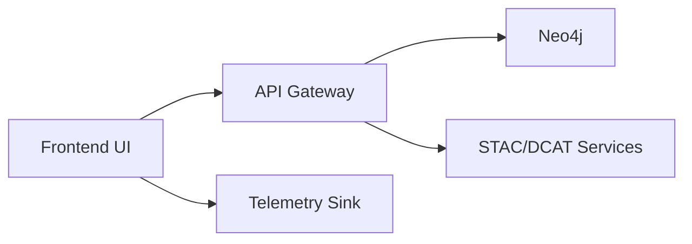

<div align="center">

# 🖥️ KFM v11.2.4 — Frontend Architecture Index  
`docs/frontend/README.md`

**Purpose:**  
Canonical index for the KFM frontend layer (React · MapLibre · Cesium · Story Nodes · Focus Mode), defining module boundaries, contracts to the API/graph, and required documentation/telemetry for all user-facing surfaces.

</div>

---

## 📘 Overview

The KFM frontend sits at the final stage of the pipeline:

> Deterministic ETL → STAC/DCAT/PROV catalogs → Neo4j knowledge graph → API layer → React/MapLibre/Cesium frontend → Story Nodes → Focus Mode.

This document:

- Defines the **frontend module map** (apps, shells, and core feature areas).  
- Describes **contracts** between frontend ↔ API ↔ graph.  
- Points to **feature-level READMEs** (Story Nodes, Focus Mode, Geoethical Reflection, STAC/DCAT browsing, etc.).  
- Specifies **governance hooks** (FAIR+CARE, sovereignty, accessibility, energy/telemetry).  

All new frontend work **must** link back to this index in its front-matter and follow KFM-MDP v11.2.4.

---

## 🗂️ Directory Layout

This index governs the `docs/frontend/` subtree and follows the emoji-first layout profile.

```text
📂 docs/frontend/
├── 📄 README.md                      # 🖥️ Frontend architecture index
├── 📂 story-nodes/                   # 🧵 Story Nodes
│   ├── 📄 README.md                  # 🧵 Story Node frontend patterns
│   └── 📂 geoethical-reflection/     # 🧭 Geoethical Reflection Layer
│       ├── 📄 README.md              # 🧭 Geoethical Reflection Layer standard
│       ├── 📂 schema/
│       │   └── 📄 kfm.storyNode.geoethics.v1.json
│       ├── 📂 examples/
│       │   └── 📄 story-node-frontmatter.yaml
│       └── 📂 ui/
│           └── 📄 GeoethicsPanel.tsx
├── 📂 focus-mode/                    # 🎛️ Focus Mode
│   └── 📄 README.md                  # 🎛️ Focus Mode UI/contract
├── 📂 map/                           # 🌍 Map (MapLibre)
│   └── 📄 README.md                  # 🌍 MapLibre layer stack & interactions
├── 📂 cesium/                        # 🌐 Cesium 3D
│   └── 📄 README.md                  # 🌐 3D scenes, timelines, vertical profiles
├── 📂 catalog/                       # 🗃️ STAC/DCAT catalog browsing
│   └── 📄 README.md                  # 🗃️ STAC/DCAT browsing frontend patterns
└── 📂 shared/                        # 🧩 Shared design system & components
    └── 📄 README.md                  # 🧩 Design system, shared components
```

Each README under `docs/frontend/*` must:

- Use a KFM-MDP v11.2.4-compliant front-matter block.  
- Declare scope and module boundaries.  
- Reference related API/graph/docs paths.  

---

## 🧭 Context

### 1. Frontend’s role in the KFM stack

The frontend:

- Visualizes spatiotemporal knowledge (maps, timelines, 3D views).  
- Hosts Story Nodes and Focus Mode narratives linked into the knowledge graph.  
- Surfaces governance metadata (geoethics, sovereignty, data access labels).  
- Provides operational views for ETL status, telemetry, and lineage.  

It is **read-mostly** with tightly-scoped, governed write paths (e.g., Story Node authoring, annotations, review workflows) adopted only after governance approval.

### 2. Design principles

- **Documentation-first:** each major feature has a README under `docs/frontend/...` that defines props, routes, and contracts.  
- **Config-driven:** environment, feature flags, and map/3D defaults are supplied via configuration, not hard-coded constants.  
- **Deterministic contracts:** UI relies on stable, versioned API/graph contracts; no ad-hoc queries from components.  
- **Governance-visible:** geoethical, sovereignty, and access metadata are visible in the UI when relevant.  
- **Performance + energy-aware:** frontend metrics (latency, error rates, GPU usage, tile fetch) flow into telemetry bundles.

---

## 🧱 Architecture

### 1. High-level module map

Core source modules (for reference; actual paths live under `src/` but are documented here):

- `src/web/app-shell/` — global layout, routing, auth, theming.  
- `src/web/map/` — MapLibre + vector tiles, overlays, selection tools.  
- `src/web/cesium/` — Cesium 3D globe, vertical profiles, time-dynamic scenes.  
- `src/web/story-nodes/` — Story Node listing, detail views, sidebars.  
- `src/web/focus-mode/` — Focus Mode workspace, graph-local summaries, overlays.  
- `src/web/catalog/` — STAC/DCAT browsing & dataset details.  
- `src/web/admin/` — governed tools (lineage dashboards, ETL status, telemetry viewer).  
- `src/web/shared/` — shared components, typography, design tokens, forms, layout primitives.

### 2. Frontend ↔ API contracts

The frontend **only** talks to backend via typed APIs. Each domain has:

- An API README (e.g., `docs/api/story-nodes/README.md`).  
- A frontend README (e.g., `docs/frontend/story-nodes/README.md`).  
- Shared types where appropriate (e.g., `GeoethicsPanel` props).

Common contract rules:

- All times are ISO 8601 with explicit timezone (or documented as UTC).  
- All IDs are stable, opaque identifiers (URNs or short UUIDs).  
- Story Node and Focus Mode responses include:
  - Node metadata, geo-temporal extent.  
  - Governance blocks (e.g., `kfm_geoethics`).  
  - Graph neighborhood summaries (for Focus Mode).  

---

## 🗺️ Diagrams

Frontend diagrams are defined in more detail under `docs/architecture/frontend/`, but this index acknowledges:

- **Flowcharts** (`mermaid-flowchart-v1`) for routing, data flow, and integration between UI ↔ API ↔ graph.  
- **Timelines** (`mermaid-timeline-v1`) for major frontend milestones or deprecation schedules.  

Example (schematic only):



Diagrams must follow the KFM-MDP v11.2.4 diagram rules (profiles, captions, and a11y).

---

## 🧠 Story Node & Focus Mode Integration

The frontend is the primary host for Story Nodes and Focus Mode:

- **Story Nodes**
  - Rendered in dedicated views and sidebars.  
  - Must show governance metadata (e.g., `kfm_geoethics`) when present.  
  - Provide deep links (URLs) for sharing and embeddings.

- **Focus Mode**
  - Presents a graph-local workspace combining Story Nodes, related entities, and overlays (map/3D/timeline).  
  - Uses predictable layout and headings in docs to anchor narrative overlays.  
  - Must respect access labels and sovereignty controls coming from backend/graph.

Frontend requirements:

- Integrate Geoethical Reflection Layer (`GeoethicsPanel`) into Story Node and Focus Mode UIs.  
- Avoid client-side “guessing” of governance; display only what is supplied via contracts.  
- Keep visual emphasis clear when content is restricted, generalized, or masked.

---

## 🧪 Validation & CI/CD

### 1. Testing requirements

For all frontend modules:

- **Unit tests** for components and utility functions.  
- **Integration tests** for end-to-end flows (e.g., open Story Node → map pans → Geoethics panel appears).  
- **Contract tests** asserting API response shapes match shared types.  
- **Accessibility tests** (WCAG-targeted checks on key flows).

### 2. CI/CD hooks

Frontend changes must be covered in `.github/workflows/kfm-ci-frontend.yml` (or equivalent) with:

- Linting (TS/JS, CSS, markdown).  
- Type-checking.  
- Test suites (unit + integration).  
- Bundle size checks and budgets (per entrypoint).  
- Optional Lighthouse/performance checks for key routes.

### 3. Telemetry

Frontend telemetry is recorded into `frontend-telemetry.json` bundles, including:

- Route load times.  
- API error rates per domain.  
- Map/3D interaction metrics.  
- Focus Mode session metrics (time in view, feature toggles).  

Energy/carbon estimates may be approximated via backend metrics and client-side usage patterns, but must be annotated as such.

---

## 📦 Data & Metadata

Frontend docs and components participate in KFM’s broader metadata ecosystem:

- Docs under `docs/frontend/` can be indexed in documentation catalogs (e.g., DCAT or a STAC “docs” Collection).  
- Telemetry schemas referenced in `telemetry_schema` define the shape of frontend metrics.  
- Per-feature READMEs should declare:
  - API endpoints and their types.  
  - Graph node/relationship labels they depend on.  
  - Telemetry events emitted by the UI.

New frontend features **must**:

- Update `docs/frontend/` with appropriate metadata references.  
- Ensure telemetry event names and payloads are stable and documented.  

---

## 🌐 STAC, DCAT & PROV Alignment

Frontend artifacts are **consumers** of STAC/DCAT/PROV but must align with them:

- **STAC**
  - Catalog views surface STAC Collections/Items with licensing, access rights, and provenance summaries.  
  - Map/3D entry points respect STAC asset types and media types.

- **DCAT**
  - Dataset detail pages map DCAT fields (`dct:title`, `dct:description`, `dct:license`, `dct:accessRights`) to UI elements.  
  - Links back to governance docs and access labels must be explicit.

- **PROV-O**
  - Where lineage is shown (e.g., “how this layer was generated”), the UI should reflect `prov:Entity`, `prov:Activity`, and `prov:Agent` in human-understandable form.  
  - OpenLineage or similar IDs can be surfaced as “technical details” links.

---

## ⚖ FAIR+CARE & Governance

The frontend is responsible for **surfacing** governance decisions, not making them.

- Access labels (“Open”, “Restricted”, “Tribal-only”, “Withheld”) must affect what is shown and how (e.g., generalized coordinates, blurred media, or full omission).  
- Geoethical Reflection Layer and other governance blocks must be prominent wherever sensitive content might appear.  
- UI language and affordances must respect Indigenous data sovereignty and avoid extractive framing.

FAIR:

- **Findable:** routes, filters, and links make datasets and Story Nodes discoverable.  
- **Accessible:** UIs favor clarity, a11y, and multi-device support.  
- **Interoperable:** frontend mirrors metadata semantics from STAC/DCAT/PROV.  
- **Reusable:** clear tooltips, legends, and docs help users understand constraints.

CARE:

- **Collective benefit:** visualizations emphasize shared understanding, not extraction.  
- **Authority to control:** indicators for Tribal or community governance are surfaced via governance blocks.  
- **Responsibility & ethics:** UI avoids implying certainty where models or data are uncertain; sensitive content is generalized or withheld as required.

Reference standards & resources:

- [FAIR Principles](https://www.go-fair.org/fair-principles/)  
- [CARE Principles for Indigenous Data Governance](https://www.gida-global.org/care)  
- [CIDOC-CRM](https://www.cidoc-crm.org/) · [PROV-O](https://www.w3.org/TR/prov-o/) · [GeoSPARQL](https://www.ogc.org/standard/geosparql/)  
- [KFM Governance Framework](../standards/governance/ROOT-GOVERNANCE.md)  
- [KFM Markdown Authoring Protocol — KFM-MDP v11.2.4](../standards/kfm_markdown_protocol_v11.2.4.md)  

All frontend features that expose sensitive datasets **must** be reviewed by:

- FAIR+CARE Council.  
- Tribal Sovereignty Board.  
- KFM Governance maintainers.

---

## 🕰️ Version History

| Version | Date       | Status            | Notes                                                                 |
|---------|------------|-------------------|-----------------------------------------------------------------------|
| v11.2.4 | 2025-12-05 | Active / Enforced | Initial LTS frontend architecture index for KFM v11.2.4.              |

Future revisions must:

- Preserve or document breaking changes to module boundaries and contracts.  
- Update references to new feature READMEs and APIs as they are added.  
- Keep governance and standards links in sync with global KFM-MDP updates.  

---

<div align="center">

🖥️ **KFM v11.2.4 — Frontend Architecture Index**  
Designed for Longevity · Governed for Integrity  

[📘 Docs Root](..) · [📂 Standards Index](../standards/README.md) · [⚖ Governance](../standards/governance/ROOT-GOVERNANCE.md)

</div>