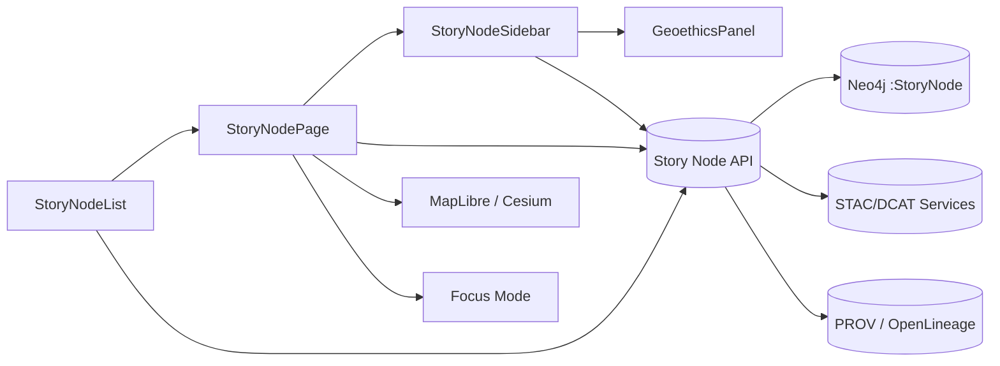

<div align="center">

# 🧵 KFM v11.2.4 — Story Node Frontend Guide  
`docs/frontend/story-nodes/README.md`

**Purpose:**  
Define the canonical frontend patterns, components, and contracts for Story Nodes in the Kansas Frontier Matrix — including sidebars, pages, lists, and integration of the Geoethical Reflection Layer into Story Node UIs and Focus Mode.

</div>

---

## 📘 Overview

Story Nodes are the primary narrative units in the Kansas Frontier Matrix (KFM). In the frontend, they:

- Bind narrative text and media to spatial and temporal extents.  
- Expose links into the Neo4j knowledge graph (places, events, people, datasets).  
- Surface governance metadata, including the Geoethical Reflection Layer (`kfm_geoethics`).  
- Act as entry points into Focus Mode, map/3D views, and catalog detail pages.  

This guide:

- Describes the Story Node frontend module layout under `src/web/story-nodes/`.  
- Defines core React components and their props contracts.  
- Explains how Story Nodes integrate with the Geoethical Reflection Layer UI (`GeoethicsPanel`).  
- Shows how Story Nodes interact with Focus Mode, STAC/DCAT catalogs, and provenance views.  
- Specifies tests, telemetry, and governance expectations for Story Node UI work.  

All Story Node UI work **must** conform to this guide and the global frontend index at `docs/frontend/README.md`.

---

## 🗂️ Directory Layout

This guide governs the `docs/frontend/story-nodes/` subtree and its relationship to the Story Node frontend code.

```text
📂 docs/frontend/story-nodes/
├── 📄 README.md                      # 🧵 Story Node frontend guide (this file)
├── 📂 geoethical-reflection/         # 🧭 Geoethical Reflection Layer
│   ├── 📄 README.md                  # 🧭 Geoethical Reflection Layer standard
│   ├── 📂 schema/
│   │   └── 📄 kfm.storyNode.geoethics.v1.json
│   ├── 📂 examples/
│   │   └── 📄 story-node-frontmatter.yaml
│   └── 📂 ui/
│       └── 📄 GeoethicsPanel.tsx
└── 📂 ui/                            # 🧩 Story Node UI patterns & examples
    ├── 📄 StoryNodeList.tsx          # 🧵 List + filters for Story Nodes
    ├── 📄 StoryNodeSidebar.tsx       # 🧵 Sidebar view for a single Story Node
    ├── 📄 StoryNodePage.tsx          # 🧵 Full-page Story Node view
    └── 📄 StoryNodeMetaPanel.tsx     # 🧾 Metadata (graph links, catalog links, governance badges)
```

Code-level modules (for reference) live under:

- `src/web/story-nodes/` — production implementation of Story Node components.  
- `src/web/focus-mode/` — Focus Mode views that consume Story Node data.  
- `src/api/story-nodes/` — Story Node API handlers and types.  
- `src/graph/story-nodes/` — query helpers for Neo4j/graph-backed Story Node data.  

Each `README.md` under `docs/frontend/story-nodes/*` must:

- Use a KFM-MDP v11.2.4-compliant front-matter block.  
- Declare scope and affected modules.  
- Reference corresponding API/graph/docs routes.  

---

## 🧭 Context

Story Nodes sit in the KFM pipeline as:

> Deterministic ETL → STAC/DCAT/PROV catalogs → Neo4j knowledge graph → API layer → React/MapLibre/Cesium frontend → **Story Nodes** → Focus Mode.

Key context for the Story Node frontend:

- **ETL & catalogs**  
  - ETL populates Story Node records with graph IDs, STAC/DCAT links, temporal extents, and governance flags.  
  - Geoethical metadata is attached as `kfm_geoethics` (see `geoethical-reflection/README.md`).  

- **Graph & API**  
  - Each Story Node is represented as a `:StoryNode` node in Neo4j with relationships to `:Place`, `:Event`, `:Dataset`, etc.  
  - API endpoints provide typed JSON responses that the frontend maps directly into components (no ad-hoc graph queries from UI).  

- **Frontend integration**  
  - Story Nodes appear in:
    - Lists (search/filter results, catalog overlays).  
    - Sidebars (selected feature on map/3D).  
    - Full-page views (Focus Mode, deep links).  
  - Governance and sovereignty metadata must be visible wherever Story Nodes are rendered.  

---

## 🗺️ Diagrams

High-level Story Node flow between UI, API, and graph:



Use this diagram as a conceptual reference when introducing new routes or components; detailed diagrams for specific flows (e.g., Story Node → Focus Mode handoff) should live under `docs/architecture/frontend/`.

---

## 🧠 Story Node & Focus Mode Integration

Story Nodes and Focus Mode are tightly coupled in the frontend:

- **Entry points into Focus Mode**
  - From a Story Node page (`/story-nodes/:id` or `/story-nodes/:slug`), users can open Focus Mode scoped to that node.  
  - From map or 3D, selecting a feature that is backed by a Story Node offers an “Open in Focus Mode” option.  

- **Shared contracts**
  - Focus Mode uses the same Story Node payloads as the Story Node page, plus:
    - Graph neighborhood summaries.  
    - Overlay configuration (layers, timelines, geoethics overlays).  
  - Governance metadata (including `kfm_geoethics`) must be identical between Story Node views and Focus Mode overlays.  

- **State synchronization**
  - Story Node components must expose enough state to allow Focus Mode to:
    - Reuse map camera, layer state, and time sliders.  
    - Keep selection and highlight state in sync (selected Story Node stays consistent between sidebar and Focus Mode panel).  

Frontend requirements:

- Every Story Node detail view must provide a clear Focus Mode affordance (button or link).  
- Focus Mode must treat Story Node content as read-only narrative; modifications to Story Nodes follow governed authoring flows, not ad-hoc Focus Mode edits.  
- When a Story Node has restricted or Tribal-only content, Focus Mode must not reveal any more detail than the Story Node view itself.  

---

## 🧪 Validation & CI/CD

For Story Node frontend modules, CI/CD must ensure:

- **Component-level tests**
  - `StoryNodeList`:
    - Renders pagination/filters correctly.  
    - Honors access labels (e.g., hides restricted nodes when the user lacks permission).  
  - `StoryNodeSidebar` and `StoryNodePage`:
    - Render governance badges and `GeoethicsPanel` when `kfm_geoethics` is present.  
    - Handle missing or partial metadata gracefully (clear “not available” states).  
  - `StoryNodeMetaPanel`:
    - Correctly links to datasets, places, and events.  

- **Contract tests**
  - Type-check API responses against frontend types (e.g., `StoryNodeDto`, `GeoethicsPanel`).  
  - Assert that required fields (IDs, titles, temporal extents, access labels) are present.  

- **Accessibility tests**
  - Story Node views must satisfy WCAG 2.1 AA expectations:
    - Proper landmarks, headings, and ARIA labels.  
    - Keyboard navigation for lists and sidebars.  
    - High-contrast governance indicators (e.g., restricted / Tribal-only badges).  

- **Workflow integration**
  - A CI job (e.g., `kfm-ci-frontend.yml`) must include:
    - Unit and integration tests for `src/web/story-nodes/`.  
    - Linting and type-checking for Story Node components.  
    - Optional Lighthouse runs on Story Node routes in staging.  

---

## 📦 Data & Metadata

Story Node UIs sit on top of rich metadata; the frontend must expose key fields consistently.

### 1. Core Story Node fields

Story Node frontend components should expect a typed payload similar to:

```ts
type StoryNode = {
  id: string;                        // Stable, opaque ID (URN or UUID)
  slug: string;                      // Optional human-readable slug for URLs
  title: string;
  summary: string;
  body_markdown: string;             // Rendered as Markdown in the UI
  temporal_extent: {
    start: string;                   // ISO 8601
    end?: string;                    // Optional, ISO 8601
  };
  spatial_extent: {
    bbox?: [number, number, number, number]; // Optional bbox for map framing
    place_ids?: string[];            // Related :Place node IDs
  };
  access_label: "Open" | "Restricted" | "Tribal-only" | "Withheld";
  tags: string[];
  related_entities: {
    places: string[];
    events: string[];
    datasets: string[];
  };
  kfm_geoethics?: GeoethicsPanel;    // From Geoethical Reflection Layer
  provenance_ref?: string;           // PROV bundle / entity
  audit_trail_ref?: string;          // OpenLineage run ID
};
```

The exact type is defined in API/graph contracts; this shape is illustrative.

### 2. Governance & access metadata

Story Node components must:

- Use `access_label` to:
  - Show badges (e.g., pill UI elements).  
  - Generalize or withhold content (e.g., no coordinates for `Tribal-only`).  
- Show `kfm_geoethics` in a dedicated panel (see Geoethical Reflection Layer docs).  
- Link `provenance_ref` and `audit_trail_ref` to:
  - PROV detail views (e.g., lineage modal or separate page).  
  - OpenLineage or process audit dashboards (where available).  

---

## 🌐 STAC, DCAT & PROV Alignment

Story Node frontend features must respect upstream metadata standards:

- **STAC**
  - When Story Nodes reference STAC Items (imagery layers, DEMs, etc.), UI controls should:
    - Link to the STAC detail page.  
    - Clearly differentiate between Story Node narrative and STAC asset metadata.  
  - Story Node map overlays that use STAC assets should show licensing/access info from the asset.  

- **DCAT**
  - Dataset links in `StoryNodeMetaPanel` should:
    - Display DCAT fields like `dct:title`, `dct:description`, `dct:license`, `dct:accessRights`.  
    - Respect access rights from DCAT when offering “open in map/Focus Mode” actions.  

- **PROV-O**
  - Where lineage is exposed (e.g., “This narrative is derived from X datasets processed by Y pipeline”), UI should:
    - Reflect `prov:Entity`, `prov:Activity`, and `prov:Agent` relationships in simple human language.  
    - Provide links or buttons to more detailed lineage views for expert users.  

---

## 🧱 Architecture

Story Node frontend architecture must remain modular and predictable:

- **Containers vs. Presentational components**
  - Containers (under `src/web/story-nodes/containers/` if used) handle data fetching, routing, and state.  
  - Presentational components (`StoryNodeList`, `StoryNodeSidebar`, `StoryNodePage`, `StoryNodeMetaPanel`, `GeoethicsPanel`) receive fully prepared props and do not make ad-hoc API calls.  

- **Routing**
  - Canonical routes:
    - `/story-nodes` — listing & filters.  
    - `/story-nodes/:id` or `/story-nodes/:slug` — detail page.  
  - Routes must be deep-linkable and stable across releases unless a migration plan is documented.  

- **State management**
  - Prefer local component state + React Query/SWR for data fetching.  
  - Global state only for:
    - Selected Story Node.  
    - Map/3D camera state.  
    - Focus Mode context.  

- **Error handling**
  - When a Story Node fails to load:
    - Show a clear error message (no silent failures).  
    - Never show partial governance state (e.g., missing `kfm_geoethics` should be explicit, not silently hidden).  

Any architectural change that affects these patterns must update this guide and the top-level frontend index.

---

## ⚖ FAIR+CARE & Governance

Story Node frontend design must embody FAIR and CARE principles and respect Indigenous data sovereignty:

- **FAIR**
  - *Findable*: Story Node lists and search/filter UIs help users locate relevant narratives efficiently.  
  - *Accessible*: Pages are responsive, accessible (WCAG 2.1 AA), and performant across devices.  
  - *Interoperable*: Governance and metadata fields map cleanly to STAC/DCAT/PROV concepts.  
  - *Reusable*: Clear context, provenance, and licensing info make Story Node content safely reusable.  

- **CARE**
  - *Collective benefit*: Story Node interfaces should emphasize context and understanding over spectacle or extraction.  
  - *Authority to control*: UI must clearly display Tribal/sovereignty governance where provided (e.g., `Tribal-only` labels, references to Sovereignty Boards).  
  - *Responsibility*: Interfaces should make limitations and generalizations explicit (e.g., generalized dates/locations).  
  - *Ethics*: No UI should invite guessing, “unmasking,” or reverse-engineering of sensitive site locations.  

Governance hooks:

- `access_label` and `kfm_geoethics` are authoritative; UI must not attempt to infer governance beyond them.  
- For content involving Indigenous knowledge or sacred sites, additional human review is expected prior to release.  
- Any Story Node feature that may reveal new combinations of information (e.g., cross-layer overlays) must be considered for re-identification risk.  

---

## 📚 Reference Standards & Resources (Footer)

Core standards and references for Story Node frontend work:

- [FAIR Principles](https://www.go-fair.org/fair-principles/)  
- [CARE Principles for Indigenous Data Governance](https://www.gida-global.org/care)  
- [CIDOC-CRM](https://www.cidoc-crm.org/) · [PROV-O](https://www.w3.org/TR/prov-o/) · [GeoSPARQL](https://www.ogc.org/standard/geosparql/)  
- [KFM Governance Framework](../../standards/governance/ROOT-GOVERNANCE.md)  
- [KFM Markdown Authoring Protocol — KFM-MDP v11.2.4](../../standards/kfm_markdown_protocol_v11.2.4.md)  
- [Geoethical Reflection Layer — Story Nodes](./geoethical-reflection/README.md)  
- [Frontend Architecture Index](../README.md)  

Use these references when designing or reviewing Story Node-related UI changes, especially where governance, provenance, or sensitive content is involved.

---

## 🕰️ Version History

| Version | Date       | Status            | Notes                                                                                  |
|--------:|------------|-------------------|----------------------------------------------------------------------------------------|
| v11.2.4 | 2025-12-05 | Active / Enforced | Initial LTS Story Node frontend guide aligned with KFM v11.2.4 and Geoethical Layer.  |

Future revisions must:

- Document changes to Story Node routes, component props, or governance UI patterns.  
- Update references to Geoethical Reflection Layer and Focus Mode integration as those standards evolve.  
- Keep this guide in sync with the top-level frontend architecture index and KFM-MDP updates.  

---

<div align="center">

🧵 **KFM v11.2.4 — Story Node Frontend Guide**  
Designed for Longevity · Governed for Integrity  

[📘 Docs Root](../..) · [🖥️ Frontend Index](../README.md) · [⚖ Governance](../../standards/governance/ROOT-GOVERNANCE.md)

</div>