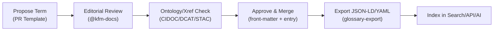

<div align="center">

# 📘 **Kansas Frontier Matrix — Glossary (v2.0.0 · Tier-Ω+∞ Certified)**  
`docs/glossary.md`

**Mission:** Provide a **canonical, machine-readable, and audit-ready** reference for all technical, geospatial, historical, and procedural terms used across the **Kansas Frontier Matrix (KFM)** — ensuring cross-discipline clarity, interoperability, and MCP-DL v6.3 reproducibility in documentation, datasets, pipelines, knowledge-graph schema, and AI systems.

[](../docs/)
[](../.github/workflows/docs-validate.yml)
[](../.github/workflows/stac-validate.yml)
[](../.github/workflows/)
[](../.github/workflows/sbom.yml)
[](../LICENSE)

</div>

---

```yaml
---
title: "Kansas Frontier Matrix — Glossary"
document_type: "Glossary Index"
version: "v2.0.0"
last_updated: "2025-11-15"
owners: ["@kfm-docs","@kfm-architecture","@kfm-accessibility"]
maturity: "Production"
status: "Active"
license: "CC-BY 4.0"
tags: ["glossary","standards","mcp","ontology","stac","graph","etl","security","ai","ethics","ci","fair","care","i18n"]
ci_required_checks:
  - docs-validate
  - markdownlint
  - policy-check
  - glossary-export
alignment:
  - MCP-DL v6.3
  - STAC 1.0 / DCAT 2.0
  - CIDOC CRM / OWL-Time / GeoSPARQL
  - JSON Schema / ISO 8601
  - SLSA (provenance)
  - FAIR / CARE
observability:
  endpoint: "https://metrics.kfm.ai/docs/glossary"
  metrics: ["term_count","alias_coverage_pct","i18n_coverage_pct","broken_link_count","schema_pass_rate"]
preservation_policy:
  retention: "glossary exports 365d · logs 90d"
  checksum_algorithm: "SHA-256"
---
```

---

## 📚 Overview

The **KFM Glossary** is a **cross-domain authority** for terms used by developers, curators, historians, and data scientists.  
It aligns vocabulary across **documentation**, **ETL pipelines**, **STAC metadata**, **knowledge-graph ontology**, **security posture**, and **CI/CD**.

**Organization**
- 🧱 Architecture & Infrastructure  
- 🌎 Geospatial & Environmental Data  
- 🧩 Metadata & Interoperability  
- 🧠 Knowledge Graph & Semantics  
- ⚙️ CI/CD & Governance  
- 🔐 Security & Supply Chain  
- 🧪 AI/ML & NLP  
- 🧭 Ethics & Cultural Safeguards  
- 🔗 Cross-Ontology & Provenance  

> Entries are concise, source-linked where appropriate, accessible, and **exported to JSON-LD/YAML** for use by APIs and the AI Assistant.

---

## 🧰 Term Record Schema (required fields)

```yaml
term_schema:
  id: "string (kfm:TERM_ID)"
  label: "human-readable title"
  definition: "one-paragraph definition (≤ 60 words)"
  context: ["architecture|data|stac|graph|etl|security|ai|ethics|ci|web|design"]
  aliases: ["synonym-1","synonym-2"]         # include plurals/variants
  crossrefs:
    cidoc: "E21_Person|E5_Event|E31_Document|..."
    dcat: "dcat:Dataset|dcat:distribution|..."
    stac: "Collection|Item|Asset|FieldName"
    owl_time: "time:Interval|time:Instant"
    geosparql: "Feature|Geometry|wktLiteral"
  i18n:
    en: "label in English"
    osage: "optional Osage label"            # example for Indigenous languages
    es: "Spanish label (if applicable)"
  examples: ["short example sentence using the term in KFM context"]
  see_also: ["other-term-id","external-url"]
  source: "primary ref or URL"
  status: "active|deprecated|candidate"
  last_reviewed: "YYYY-MM-DD"
```

> **Alias policy:** Prefer singular. Add plural(s) to `aliases`. Avoid abbreviations unless ubiquitous (e.g., **ETL**, **OCR**).

---

## 🧭 Editorial & Curation Policy

- **Plain language** ≤ Grade 9; avoid jargon or define it.  
- **Accessibility**: pronounceable labels; add pronunciation hints for Indigenous terms where helpful.  
- **Neutral & respectful**; include cultural context when terms intersect with Indigenous data.  
- **Versioned**: changes recorded in **Version History** with reviewer sign-off.  
- **Deprecation**: mark `status: deprecated`, add `see_also` pointer to the successor term, keep record for historical trace.

---

## 🧩 Core Terminology

| Term | Definition | Context |
|:--|:--|:--|
| **MCP / MCP-DL** | Documentation-first methodology ensuring reproducibility, provenance, and accessibility across code, data, and docs. | governance, docs |
| **RMI / DCI** | Repository Maturity Index / Dynamic Compliance Index — CI-tracked metrics for MCP and validation coverage. | audit, ci |
| **STAC (SpatioTemporal Asset Catalog)** | Schema for describing spatiotemporal assets (Collections, Items, Assets) with standardized metadata. | data, stac |
| **DCAT** | W3C vocabulary for dataset catalogs and distributions; used for crosswalks and publishing. | metadata, portals |
| **ETL** | Extract → Transform → (Enrich) → Load stages for data pipelines. | etl |
| **Checksum (SHA-256)** | Cryptographic hash used for integrity verification and provenance audit. | ci, data |
| **CIDOC CRM** | Cultural heritage ontology for entities (people, places, events, documents) and relations. | graph |
| **OWL-Time** | Temporal ontology modeling instants/intervals and ordering. | time, graph |
| **JSON Schema** | Declarative validation for JSON structures (config, STAC, docs metadata). | validation |
| **COG (Cloud-Optimized GeoTIFF)** | GeoTIFF variant enabling HTTP range requests and web streaming. | rasters |
| **GeoJSON** | JSON encoding for vector features and geometries. | vectors |
| **OCR** | Optical Character Recognition turning scanned pages into text. | ai, etl |
| **Provenance / Lineage** | Source → transforms → outputs trail recorded in STAC `derived_from` and PROV-O. | stac, audit |

---

## 🌎 Geospatial & Environmental Terms

| Term | Definition | Context |
|:--|:--|:--|
| **DEM** | Digital Elevation Model raster derived from LiDAR/photogrammetry. | rasters |
| **LiDAR** | Laser-based elevation capture producing point clouds (→ DEM/DSM). | elevation |
| **Raster / Vector** | Pixel grids vs. geometric features. | data |
| **WGS84 (EPSG:4326)** | Geographic CRS (lat/lon) standard output in KFM. | crs |
| **CRS** | Coordinate Reference System; reprojection occurs in ETL. | geodesy |
| **BBox** | Bounding box describing rectangular spatial extent. | stac |
| **NHD / WBD** | National Hydrography Dataset; Watershed Boundary Dataset. | hydrology |
| **PRISM / Daymet** | Gridded climate normals / daily weather products. | climate |

---

## 🧠 Knowledge Graph & Semantics

| Term | Definition | Context |
|:--|:--|:--|
| **Entity / Relationship** | Node (Person/Place/Event/Document) and edge (e.g., `OCCURRED_AT`, `DERIVED_FROM`). | graph |
| **Graph Schema** | Labels, properties, and constraints forming the data model. | graph |
| **Inference / Rules** | Derive implicit facts from explicit triples/paths. | reasoning |
| **JSON-LD Export** | Structured export for the semantic web & data portals. | integration |
| **Similarity Edge** | `SIMILAR_TO` edges based on embeddings or textual similarity. | ai, graph |
| **PeriodO** | Gazetteer of named historical time periods used for temporal tags. | time |

---

## 🧩 Metadata & Interoperability

| Term | Definition | Context |
|:--|:--|:--|
| **FAIR** | Findable, Accessible, Interoperable, Reusable; KFM baseline policy. | governance |
| **Open Standards** | Non-proprietary formats (JSON, CSV, GeoTIFF, STAC, JSON Schema). | interoperability |
| **STAC Extensions** | Optional fields (`proj:`, `processing:`, `scientific:`) for richer metadata. | stac |
| **DCAT Crosswalk** | Mapping STAC fields → DCAT properties for catalog publishing. | metadata |

---

## ⚙️ CI/CD & Governance

| Term | Definition | Context |
|:--|:--|:--|
| **GitHub Actions** | Build/Test/Deploy orchestrations under `.github/workflows/`. | ci |
| **Golden Tests** | Known-good outputs used for regression guards. | tests |
| **Artifact** | Build or validation output (logs, reports, SBOM). | ci |
| **OIDC** | Keyless auth (OpenID Connect) for deploy/attestation. | security |
| **Conventional Commits** | Semantic commit format driving releases & changelogs. | release |
| **Policy-as-Code** | OPA/Conftest rules that block non-compliant PRs. | governance |

---

## 🔐 Security & Supply Chain

| Term | Definition | Context |
|:--|:--|:--|
| **CodeQL** | Static security analysis producing SARIF reports. | security |
| **Trivy** | CVE scanning for containers/dependencies; SBOM verification. | security |
| **SBOM** | Software Bill of Materials (Syft; SPDX/CycloneDX). | supply-chain |
| **SLSA** | Supply-chain Levels for Software Artifacts; provenance attestations. | releases |
| **Gitleaks** | Secret scanning with SARIF results. | security |
| **Dependabot/Renovate** | Automated dependency update tooling. | hygiene |

---

## 🧪 AI/ML & NLP

| Term | Definition | Context |
|:--|:--|:--|
| **NER** | Named Entity Recognition (people/places/events/dates). | ai |
| **Summarization** | Abstractive/extractive reduction of text. | ai |
| **Entity Linking** | Resolve mentions to canonical graph nodes with confidence. | ai, graph |
| **Embedding Similarity** | Vector-space search for semantically close items. | ai, search |
| **Model Card** | Metadata about a model (purpose,data,metrics,ethics). | docs |
| **Bias/Quality Gates** | Min metrics + fairness checks required by CI before publish. | governance |

---

## 🧭 Ethics & Cultural Safeguards

| Term | Definition | Context |
|:--|:--|:--|
| **Data Ethics Tag** | STAC `properties.data_ethics` (e.g., `restricted-derivatives`). | stac |
| **Public Artifact Scrub** | Remove or aggregate restricted layers from public builds. | ci |
| **Co-stewardship** | Collaborative handling of cultural data with communities. | governance |

---

## 🔗 Cross-Ontology Mapping (Reference Table)

| KFM Concept | CIDOC CRM | DCAT | STAC | Notes |
|:--|:--|:--|:--|:--|
| Person | E21_Person | dcat:contactPoint | — | Historical & modern figures |
| Place | E53_Place | dcat:spatial | `geometry` | Projected CRS defined |
| Event | E5_Event | dcat:temporal | `datetime` | Map to OWL-Time intervals |
| Document | E31_Document | dcat:dataset | `assets` | OCR + provenance |
| Dataset | E73_Information_Object | dcat:Dataset | `collection` | Catalog publication |

---

## 🗣️ Indigenous & Multilingual Terms (i18n)

```yaml
i18n_policy:
  langs_supported: ["en","es","osage"]
  lang_tags_required: true           # use BCP-47 (`lang="osa"` for Osage where appropriate)
  rtl_support: false                 # enable if adopting RTL languages
  transliteration_notes: "include pronunciation or diacritics when clarifying"
```

> When Indigenous terms exist, prefer **community-approved labels**; add community context and citations.

---

## 🧪 Export & CI Integration

**Commands**
```bash
make export-glossary         # build docs/glossary.jsonld + docs/glossary.yaml
make glossary-validate       # schema + broken crossref check
```

**CI (`docs-validate.yml`)**
- Validates **front-matter**, **term schema**, **cross-references**, **links**  
- Publishes **`glossary.jsonld`** and **`glossary.yaml`** as build artifacts  
- Posts metrics to **`https://metrics.kfm.ai/docs/glossary`**

---

## 🤖 AI Assistant & API Consumption

- The AI Assistant indexes **`glossary.jsonld`** to provide **authoritative definitions** and **preferred terms**.  
- Planned REST/GraphQL endpoints:

```http
GET /api/v1/terms?query=etL
GET /api/v1/terms/{id}          # returns JSON-LD record
GET /api/v1/terms?alias=COG
```

---

## 🔁 Term Lifecycle


<!-- END OF MERMAID -->

---

## 🧮 Example Term Records

```yaml
- id: "kfm:COG"
  label: "COG (Cloud-Optimized GeoTIFF)"
  definition: "A GeoTIFF optimized for HTTP range requests enabling efficient web streaming and tiling."
  context: ["data","rasters","web"]
  aliases: ["Cloud Optimized GeoTIFF","Cloud-Optimized GeoTIFF","GeoTIFF-COG"]
  crossrefs: { stac: "Asset (raster)", dcat: "dcat:distribution" }
  i18n: { en: "Cloud-Optimized GeoTIFF", es: "GeoTIFF optimizado para la nube" }
  examples: ["Export rasters as COG for MapLibre overlays."]
  see_also: ["kfm:GeoTIFF","kfm:Raster"]
  source: "https://www.cogeo.org/"
  status: "active"
  last_reviewed: "2025-11-15"

- id: "kfm:DERIVED_FROM"
  label: "Derived From (Provenance)"
  definition: "A lineage link indicating a dataset or document was produced from another source."
  context: ["stac","provenance","audit"]
  aliases: ["lineage","source_of","originates_from"]
  crossrefs: { stac: "derived_from", prov: "prov:wasDerivedFrom", cidoc: "P94_has_created"}
  examples: ["STAC Items include `derived_from` for transformed datasets."]
  status: "active"
  last_reviewed: "2025-11-15"
```

---

## 🧪 Style Guidance for Definitions

- Use **single-paragraph** definitions (≤ ~60 words).  
- Prefer **present tense**; avoid future promises.  
- Use **neutral tone**; add citation when factual claims exceed common knowledge.  
- Provide **one concise example** per term when possible.

---

## 🧾 Reviewer Sign-off

| Reviewer | Role | Date | Signature |
|:--|:--|:--|:--|
| @kfm-docs | Documentation Maintainer | 2025-11-15 | 🔏 SHA256:45e8…12a |
| @kfm-architecture | System Architect | 2025-11-15 | 🔏 SHA256:e4c9…91a |

---

## 🔄 Versioning & Release Governance

```yaml
versioning:
  policy: "Semantic Versioning (MAJOR.MINOR.PATCH)"
  tag_pattern: "glossary-v*"
  export_bundle: ["glossary.jsonld","glossary.yaml","glossary.sha256"]
  doi_on_major: true
  changelog_dir: "docs/changelog/"
```

**When to bump**
- **Major** — schema or structure changes; IA overhaul  
- **Minor** — new term groups; i18n additions; cross-ontology tables  
- **Patch** — typo fixes; minor clarifications; new examples

---

## 🧠 MCP Compliance Summary

| MCP Pillar | Implementation |
|:--|:--|
| Documentation-first | Terms pre-date feature docs; glossary cited across READMEs. |
| Reproducibility | Exports + schema validation; CI metrics; deterministic builds. |
| Open Standards | STAC/DCAT/CIDOC/OWL-Time/GeoSPARQL cross-walk. |
| Provenance | Versioned entries; `last_reviewed`; editorial sign-off. |
| Auditability | `docs-validate.yml` and policy gates block missing fields. |

---

## 🕰️ Version History

| Version | Date | Summary |
|:--|:--|:--|
| **v2.0.0** | 2025-11-15 | Tier-Ω+∞ upgrade: term schema, i18n guidance, JSON-LD/YAML exports, lifecycle & CI hooks, cross-ontology table, editorial policy. |
| v1.4.0 | 2025-10-18 | Ethics section, supply-chain badges, CI gates, FAIR & GeoSPARQL alignment, reviewer sign-off. |
| v1.3.0 | 2025-10-17 | Ontology mapping, machine-readable export, provenance metadata. |
| v1.2.0 | 2025-10-17 | Security/supply-chain & AI/ML terms; cross-references. |
| v1.1.0 | 2025-10-05 | Expanded architecture/geospatial/governance sections. |
| v1.0.0 | 2025-10-04 | Initial glossary. |

---

<div align="center">

**Kansas Frontier Matrix © 2025**  
*“Every Definition. Every Domain. Linked, Verified, and Reusable.”*  
📍 `docs/glossary.md` — Authoritative terminology for KFM’s documentation, data, and AI systems.

</div>