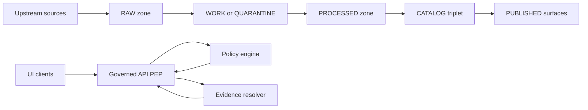

<!-- [KFM_META_BLOCK_V2]
doc_id: kfm://doc/3cbf1956-c8bd-44a0-b624-82f3dfb22160
title: KFM Glossary
type: standard
version: v1
status: draft
owners: KFM Maintainers
created: 2026-03-04
updated: 2026-03-04
policy_label: public
related: []
tags: [kfm]
notes: [Shared definitions for KFM docs and system surfaces. Each entry includes status: CONFIRMED/PROPOSED/UNKNOWN.]
[/KFM_META_BLOCK_V2] -->

# Glossary
Shared definitions for terms used across Kansas Frontier Matrix (KFM) docs, pipelines, policy, APIs, and UI.

> **Status:** active (draft)  
> **Owners:** KFM Maintainers (TODO: add GitHub handles / team)  
> **Policy label:** public  
>
> 
> 
> 
>
> **Quick links:** [How to use](#how-to-use-this-glossary) · [Conventions](#conventions) · [Abbreviations](#abbreviations) · [Glossary A–Z](#glossary-a-z) · [Contributing](#contributing)

---

## How to use this glossary

- Use these definitions in *governed docs* (standards, contracts, runbooks) and UI copy.
- If a term is overloaded in other domains, prefer the KFM definition **inside KFM**.
- When adding a new term, include:
  - **Status** (CONFIRMED / PROPOSED / UNKNOWN)
  - A crisp definition (1–3 sentences)
  - “See also” pointers to related terms

## Conventions

### Status meanings

- **CONFIRMED** — The term/meaning is explicitly described in a KFM design/guide document or is already treated as a normative invariant in KFM docs.
- **PROPOSED** — The term/meaning appears in drafts/idea packs and is a recommended direction, but not yet a ratified standard.
- **UNKNOWN** — The term is used, but its KFM meaning is ambiguous; it needs governance review (or a link to the defining spec).

### Cross-references

- “See also” references are internal hyperlinks within this file.
- External standards (STAC/DCAT/PROV, etc.) are referenced conceptually; KFM profiles may further constrain them.

## Where this fits

- **Path:** `docs/glossary.md`
- **Upstream:** governance and standards docs (policy labels, profiles), schema registries.
- **Downstream:** Story Nodes, Focus Mode prompts/outputs, API contracts, pipeline specs, docs-lint rules.

## Acceptable inputs

- New glossary entries for:
  - KFM-specific concepts (e.g., Promotion Contract, Trust Membrane)
  - Standard acronyms used in KFM (e.g., SBOM, SLSA)
  - Data lifecycle zone terminology (RAW/WORK/PROCESSED/CATALOG/PUBLISHED)

## Exclusions

- **Do not** put policy decisions here (belongs in governance/policy docs).
- **Do not** define schemas here (belongs in `schemas/`).
- **Do not** claim a module exists/works unless verified in the repo or a governed release note.

## Diagram

```mermaid
flowchart LR
  Upstream[Upstream sources] --> RAW[RAW zone]
  RAW --> WORK[WORK or QUARANTINE]
  WORK --> PROCESSED[PROCESSED zone]
  PROCESSED --> CATALOG[CATALOG triplet]
  CATALOG --> PUBLISHED[PUBLISHED surfaces]

  UI[UI clients] --> PEP[Governed API PEP]
  PEP --> PDP[Policy engine]
  PEP --> EV[Evidence resolver]
  EV --> PEP
  PDP --> PEP
```

---

## Abbreviations

| Acronym | Expansion | Notes |
|---|---|---|
| CARE | Collective Benefit, Authority to Control, Responsibility, Ethics | Often paired with FAIR in KFM governance (“FAIR+CARE”). |
| CI | Continuous Integration | KFM uses CI gates to enforce promotion/publishing rules. |
| COG | Cloud Optimized GeoTIFF | Raster format optimized for HTTP range requests. |
| DCAT | Data Catalog Vocabulary | Dataset-level metadata surface in the KFM “triplet.” |
| JCS | JSON Canonicalization Scheme | Used for deterministic hashing (e.g., `spec_hash`). |
| OPA | Open Policy Agent | Policy engine; Rego language. |
| ORAS | OCI Registry As Storage | Used for pushing non-container artifacts to OCI registries. |
| PEP | Policy Enforcement Point | The gateway where policy is enforced (e.g., governed API). |
| PMTiles | Portable Map Tiles | Single-file tile archive for fast distribution. |
| PROV | W3C Provenance model | Lineage surface in the KFM “triplet.” |
| SBOM | Software Bill of Materials | SPDX/CycloneDX are common formats. |
| SLSA | Supply-chain Levels for Software Artifacts | Used with attestations (often in-toto). |
| STAC | SpatioTemporal Asset Catalog | Asset-level metadata surface in the KFM “triplet.” |

---

## Glossary A–Z

### A

#### Acquisition manifest
- **Status:** CONFIRMED
- **Definition:** A record describing what was fetched/snapshotted from an upstream source, when, and under what terms. In KFM, acquisition manifests are part of the RAW zone’s immutable evidence surface.
- **See also:** [RAW zone](#raw-zone), [License snapshot](#license-snapshot)

#### Allowlist
- **Status:** PROPOSED
- **Definition:** A set of explicitly permitted values (e.g., licenses, file types, domains) used by policy checks. Anything not allowlisted is denied by default.
- **See also:** [Default-deny](#default-deny), [Fail-closed](#fail-closed)

---

### C

#### Canonical store
- **Status:** CONFIRMED
- **Definition:** A storage surface treated as “source of truth” that is preserved across re-indexing and migrations (e.g., object storage artifacts + catalogs + audit ledger). Rebuildable projections are derived from canonical stores.
- **See also:** [Rebuildable projection](#rebuildable-projection), [Catalog triplet](#catalog-triplet)

#### Catalog triplet
- **Status:** CONFIRMED
- **Definition:** The cross-linked metadata surfaces that together describe a dataset version:
  - **DCAT** for dataset-level metadata,
  - **STAC** for asset-level spatiotemporal metadata,
  - **PROV** for lineage (how artifacts were produced).
  If the triplet is missing or inconsistent, promotion/publishing should fail.
- **See also:** [DCAT](#dcat), [STAC](#stac), [PROV](#prov), [Promotion Contract](#promotion-contract)

#### Citation handshake
- **Status:** PROPOSED
- **Definition:** A requirement that user-facing outputs (especially Focus Mode) include structured, resolvable citations to the underlying dataset versions and evidence artifacts (not just free-text references).
- **See also:** [Cite-or-abstain](#cite-or-abstain), [EvidenceRef](#evidenceref), [EvidenceBundle](#evidencebundle)

#### Cite-or-abstain
- **Status:** CONFIRMED
- **Definition:** A behavior rule for Focus Mode: if the system cannot produce valid citations/evidence references for a factual claim, it must refuse or clearly mark the response as unknown rather than guessing.
- **See also:** [Focus Mode](#focus-mode), [Evidence resolver](#evidence-resolver)

#### Conftest
- **Status:** PROPOSED
- **Definition:** A tool commonly used to run OPA/Rego policies against structured inputs during CI to enforce “policy as code.”
- **See also:** [OPA](#opa), [Policy engine](#policy-engine)

---

### D

#### Dataset
- **Status:** CONFIRMED
- **Definition:** A named, versioned collection of artifacts + metadata representing a specific source/product in KFM (e.g., “land cover,” “storm events”). Datasets are promoted through lifecycle zones under the Promotion Contract.
- **See also:** [Dataset version](#dataset-version), [Promotion Contract](#promotion-contract)

#### Dataset ID
- **Status:** CONFIRMED
- **Definition:** A stable identifier for a dataset across time (slug or canonical ID). Dataset IDs group dataset versions.
- **See also:** [Dataset version](#dataset-version)

#### Dataset version
- **Status:** CONFIRMED
- **Definition:** An immutable, publishable “release unit” of a dataset that includes processed artifacts, validated catalogs, and run receipts. UI surfaces should show dataset version and freshness.
- **See also:** [PROCESSED zone](#processed-zone), [Run receipt](#run-receipt), [PUBLISHED surfaces](#published-surfaces)

#### Default-deny
- **Status:** CONFIRMED
- **Definition:** A policy posture where the default is to deny access or deny an action unless it is explicitly allowed. In practice, this means missing metadata, missing receipts, or ambiguous policy labels cause denial rather than accidental exposure.
- **See also:** [Fail-closed](#fail-closed), [Policy label](#policy-label)

#### Digest
- **Status:** PROPOSED
- **Definition:** A cryptographic hash (commonly SHA-256) used as a content address for artifacts. In KFM, digests are used to verify integrity and to pin artifact references in catalogs/receipts.
- **See also:** [Digest-pinned distribution](#digest-pinned-distribution), [Integrity](#integrity)

#### Digest-pinned distribution
- **Status:** PROPOSED
- **Definition:** A distribution pattern where artifacts are referenced by immutable digests (not mutable tags/“latest”). This supports reproducibility and auditability.
- **See also:** [OCI artifact](#oci-artifact), [ORAS](#oras)

---

### E

#### Evidence
- **Status:** CONFIRMED
- **Definition:** The artifacts + metadata + lineage that justify a claim, query result, tile, or story statement. Evidence must be resolvable and governed.
- **See also:** [EvidenceRef](#evidenceref), [EvidenceBundle](#evidencebundle)

#### EvidenceBundle
- **Status:** CONFIRMED
- **Definition:** A structured, policy-filtered response payload that includes (at minimum) the policy decision, license/attribution, provenance/run reference, artifact digests, and an audit reference. It is the unit the UI can display in an “evidence drawer.”
- **See also:** [Evidence resolver](#evidence-resolver), [EvidenceRef](#evidenceref), [Audit ref](#audit-ref)

#### Evidence drawer
- **Status:** PROPOSED
- **Definition:** A UI component shared across Map/Story/Focus that displays the EvidenceBundle for whatever the user is viewing (feature, tile, story paragraph, Focus answer).
- **See also:** [Map Explorer](#map-explorer), [Story Mode](#story-mode), [Focus Mode](#focus-mode)

#### EvidenceRef
- **Status:** CONFIRMED
- **Definition:** A structured reference that can be resolved into an EvidenceBundle. EvidenceRefs should resolve without guessing (broken refs should fail publishing).
- **See also:** [Evidence resolver](#evidence-resolver)

#### Evidence resolver
- **Status:** CONFIRMED
- **Definition:** The service/endpoint responsible for turning an EvidenceRef into an EvidenceBundle by applying policy and redaction obligations, and returning a result usable by the UI in ≤ a few calls.
- **See also:** [Trust membrane](#trust-membrane), [Policy engine](#policy-engine)

#### Emergency deny
- **Status:** PROPOSED
- **Definition:** A kill-switch policy mechanism used to force denials (e.g., block promotions) to verify fail-closed behavior and to respond to incidents.
- **See also:** [Fail-closed](#fail-closed), [Policy regression suite](#policy-regression-suite)

---

### F

#### FAIR
- **Status:** PROPOSED
- **Definition:** A set of principles for making data Findable, Accessible, Interoperable, and Reusable. In KFM, FAIR is treated as a governance lens for metadata quality and reuse.
- **See also:** [FAIR+CARE](#faircare)

#### FAIR+CARE
- **Status:** PROPOSED
- **Definition:** A governance framing that combines FAIR principles with CARE principles. In KFM, this appears as a classification/category in front-matter and governance references.
- **See also:** [CARE](#care)

#### Fail-closed
- **Status:** CONFIRMED
- **Definition:** A system design rule: when something is missing, invalid, or ambiguous, the system must deny or block rather than allow by accident. This applies to policy decisions, promotion gates, and evidence resolution.
- **See also:** [Default-deny](#default-deny), [Promotion gates](#promotion-gates)

#### Focus Mode
- **Status:** CONFIRMED
- **Definition:** A user-facing Q&A surface that produces evidence-led answers. Focus Mode must cite sources (EvidenceRefs/EvidenceBundles) for factual claims and abstain when it cannot.
- **See also:** [Cite-or-abstain](#cite-or-abstain), [Evidence drawer](#evidence-drawer)

---

### G

#### Gate
- **Status:** CONFIRMED
- **Definition:** A required check that must pass before a dataset version can be promoted/published (identity, licensing, sensitivity, triplet validity, QA thresholds, receipts).
- **See also:** [Promotion Contract](#promotion-contract), [Promotion gates](#promotion-gates)

#### GeoParquet
- **Status:** CONFIRMED
- **Definition:** A Parquet-based columnar format for geospatial features. In KFM, GeoParquet is an example of a PROCESSED-zone “publishable artifact” format.
- **See also:** [PROCESSED zone](#processed-zone)

---

### I

#### Integrity
- **Status:** PROPOSED
- **Definition:** The ability to verify that an artifact is complete and unmodified, typically via cryptographic checksums/digests recorded in catalogs and receipts.
- **See also:** [Digest](#digest), [Run receipt](#run-receipt)

---

### J

#### JCS
- **Status:** PROPOSED
- **Definition:** JSON Canonicalization Scheme; a deterministic canonical form for JSON so hashes can be stable. Used to compute `spec_hash`.
- **See also:** [Spec hash](#spec-hash)

---

### L

#### License snapshot
- **Status:** CONFIRMED
- **Definition:** A captured record of upstream licensing/terms at acquisition time, preserved alongside RAW artifacts so later audits can reconstruct what terms applied when data was fetched.
- **See also:** [Acquisition manifest](#acquisition-manifest)

#### Lineage
- **Status:** CONFIRMED
- **Definition:** The “how it was produced” chain linking inputs, activities, and outputs. In KFM, lineage is part of the catalog triplet via PROV and is surfaced in UI provenance panels.
- **See also:** [PROV](#prov), [Provenance](#provenance)

---

### M

#### Map Explorer
- **Status:** CONFIRMED
- **Definition:** The primary UI surface for exploring layers, time windows, and feature inspection. KFM requires map surfaces to make trust visible (version, license, policy badges) and to link evidence.
- **See also:** [Evidence drawer](#evidence-drawer), [Trust membrane](#trust-membrane)

#### Materiality
- **Status:** PROPOSED
- **Definition:** A typed decision indicating whether a change is “publish candidate” material based on domain-appropriate diffs (to prevent noisy or meaningless promotions).
- **See also:** [Promotion gates](#promotion-gates)

---

### O

#### Obligation
- **Status:** CONFIRMED
- **Definition:** An action required by policy as a condition of allowing an output (e.g., applying redaction/generalization before PUBLISHED serving). Obligations are enforced by policy gates and applied by the evidence resolver and publishing pipelines.
- **See also:** [Redaction](#redaction), [Policy engine](#policy-engine)

#### OCI artifact
- **Status:** PROPOSED
- **Definition:** A bundle stored in an OCI registry (not necessarily a container image) that can include datasets, catalogs, receipts, and attestations, addressed by digest for immutability.
- **See also:** [Digest-pinned distribution](#digest-pinned-distribution), [ORAS](#oras)

#### OPA
- **Status:** CONFIRMED
- **Definition:** Open Policy Agent; a policy engine that evaluates Rego rules to produce allow/deny decisions and obligations.
- **See also:** [Policy engine](#policy-engine)

#### ORAS
- **Status:** PROPOSED
- **Definition:** OCI Registry As Storage; tooling for pushing and pulling non-container artifacts (datasets, receipts, catalogs) to OCI registries.
- **See also:** [OCI artifact](#oci-artifact)

---

### P

#### PEP
- **Status:** CONFIRMED
- **Definition:** Policy Enforcement Point. In KFM, the governed API is the boundary that enforces policy for any access to storage/catalogs/evidence; UI and external clients must not bypass it.
- **See also:** [Trust membrane](#trust-membrane), [Policy engine](#policy-engine)

#### PDP
- **Status:** CONFIRMED
- **Definition:** Policy Decision Point. The component that evaluates policy (e.g., OPA/Rego) and returns allow/deny + obligations. Often paired with a PEP.
- **See also:** [PEP](#pep), [OPA](#opa)

#### Policy engine
- **Status:** CONFIRMED
- **Definition:** The runtime and CI component that evaluates policy-as-code to produce allow/deny decisions and obligations (e.g., redaction required). Must be shared semantics between CI and runtime where possible.
- **See also:** [Fail-closed](#fail-closed), [Obligation](#obligation)

#### Policy label
- **Status:** CONFIRMED
- **Definition:** A classification tag attached to datasets, artifacts, and outputs that drives access and redaction rules (e.g., public vs restricted). Policy labels must be visible in UI trust surfaces.
- **See also:** [Sensitivity classification](#sensitivity-classification)

#### Promotion Contract
- **Status:** CONFIRMED
- **Definition:** The mechanism that turns governance intent into enforceable behavior by defining lifecycle zones and gates. Promotion is the act of moving dataset versions through zones into PUBLISHED surfaces only when all required artifacts exist and validate.
- **See also:** [Data lifecycle zones](#data-lifecycle-zones), [Promotion gates](#promotion-gates)

#### Promotion gates
- **Status:** CONFIRMED
- **Definition:** The minimum checks required for promotion/publishing (identity/versioning, licensing, sensitivity/redaction, catalog triplet validation, QA thresholds, run receipts/audit records, manifests).
- **See also:** [Run receipt](#run-receipt), [Catalog triplet](#catalog-triplet)

#### PROCESSED zone
- **Status:** CONFIRMED
- **Definition:** The zone containing publishable artifacts in KFM-approved formats with stable IDs and checksums. This is the “data product” layer that downstream projections and serving surfaces are built from.
- **See also:** [RAW zone](#raw-zone), [WORK zone](#work-zone), [PUBLISHED surfaces](#published-surfaces)

#### PROV
- **Status:** CONFIRMED
- **Definition:** The provenance/lineage surface of the KFM catalog triplet. PROV records the activities and agents that generated artifacts.
- **See also:** [Catalog triplet](#catalog-triplet), [Lineage](#lineage)

#### Provenance
- **Status:** CONFIRMED
- **Definition:** The provenance metadata that connects outputs to inputs and processes, enabling auditing and reproducibility. In KFM, provenance is surfaced through PROV plus run receipts and UI provenance panels.
- **See also:** [Run receipt](#run-receipt), [PROV](#prov)

#### PUBLISHED surfaces
- **Status:** CONFIRMED
- **Definition:** Governed runtime surfaces (API + UI) that may only serve promoted dataset versions that have processed artifacts, validated catalogs, run receipts, and policy labels.
- **See also:** [Trust membrane](#trust-membrane), [Promotion Contract](#promotion-contract)

---

### Q

#### QUARANTINE
- **Status:** CONFIRMED
- **Definition:** A holding state within WORK where artifacts fail validation, have unclear licensing, or have sensitivity concerns. Quarantined items are not promoted.
- **See also:** [WORK zone](#work-zone)

---

### R

#### RAW zone
- **Status:** CONFIRMED
- **Definition:** Immutable acquisition storage: upstream payloads/snapshots plus checksums and minimal metadata (time fetched, source, license/terms snapshot). RAW is append-only; you supersede by new acquisitions.
- **See also:** [Acquisition manifest](#acquisition-manifest), [WORK zone](#work-zone)

#### Rebuildable projection
- **Status:** CONFIRMED
- **Definition:** A derived store that can be regenerated from canonical sources (e.g., PostGIS tables, search indexes, graph edges, tile bundles). Projections are not the canonical truth.
- **See also:** [Canonical store](#canonical-store)

#### Redaction
- **Status:** CONFIRMED
- **Definition:** A first-class transformation that removes or generalizes sensitive information (geometry, fields, attributes) according to policy obligations before anything is served publicly.
- **See also:** [Obligation](#obligation), [Sensitivity classification](#sensitivity-classification)

#### Run manifest
- **Status:** PROPOSED
- **Definition:** A machine-readable record describing a pipeline run’s inputs, steps, outputs, and environment identifiers. Often paired with a run receipt.
- **See also:** [Run receipt](#run-receipt)

#### Run receipt
- **Status:** CONFIRMED
- **Definition:** A structured audit record capturing inputs, tooling versions, hashes/digests, and policy decisions for a run. Receipts are immutable and used as evidence during promotion/publishing.
- **See also:** [EvidenceBundle](#evidencebundle), [Promotion gates](#promotion-gates)

---

### S

#### SBOM
- **Status:** PROPOSED
- **Definition:** A Software Bill of Materials (e.g., SPDX or CycloneDX) describing dependencies for build/release artifacts; used to support supply-chain governance.
- **See also:** [SLSA](#slsa)

#### Sensitivity classification
- **Status:** CONFIRMED
- **Definition:** A classification describing whether data is public, restricted, or otherwise sensitive, and what obligations apply (redaction, generalization, access controls). Sensitivity must influence both CI promotion gates and runtime serving.
- **See also:** [Policy label](#policy-label), [Default-deny](#default-deny)

#### SLSA
- **Status:** PROPOSED
- **Definition:** Supply-chain Levels for Software Artifacts; used with attestations to document how artifacts were built and to reduce tampering risk.
- **See also:** [SBOM](#sbom)

#### Spec hash
- **Status:** PROPOSED
- **Definition:** A deterministic hash of a canonical pipeline spec used to identify “what was intended to run.” Typically computed by canonicalizing JSON (JCS) then hashing (SHA-256), producing an identifier like `jcs:sha256:<hex>`.
- **See also:** [JCS](#jcs), [Run receipt](#run-receipt)

#### Story Mode
- **Status:** CONFIRMED
- **Definition:** A UI surface focused on narrative experiences (“stories”) that must retain provenance, evidence, and policy visibility.
- **See also:** [Story Node](#story-node)

#### Story Node
- **Status:** PROPOSED
- **Definition:** A versioned narrative artifact that links map/timeline state to claims supported by resolvable citations/evidence references. Publishing a Story Node should be blocked if citations cannot be resolved.
- **See also:** [EvidenceRef](#evidenceref), [PUBLISHED surfaces](#published-surfaces)

#### STAC
- **Status:** CONFIRMED
- **Definition:** The asset-level surface of the KFM catalog triplet, describing spatiotemporal artifacts (collections, items, assets) with links to distributions and checksums.
- **See also:** [Catalog triplet](#catalog-triplet)

---

### T

#### Trust membrane
- **Status:** CONFIRMED
- **Definition:** A non-bypassable boundary that prevents clients (UI/external) from directly accessing storage. All access must cross the governed API (PEP) where policy is evaluated and enforced.
- **See also:** [PEP](#pep), [Policy engine](#policy-engine)

---

### W

#### WORK zone
- **Status:** CONFIRMED
- **Definition:** Intermediate transforms and QA where failures are isolated; artifacts may be rewritten. WORK includes normalization, reprojection, tiling jobs, QA reports, and candidate redactions/generalizations. QUARANTINE is the “fail state” within WORK.
- **See also:** [QUARANTINE](#quarantine), [PROCESSED zone](#processed-zone)

---

## Contributing

- Add terms alphabetically under the correct letter section.
- Keep definitions short; prefer KFM usage over generic textbook definitions.
- Do not claim a system behavior is implemented unless:
  - it is confirmed in a governed release note, **or**
  - the repo contains a verified contract/test demonstrating it.

### Definition of done for a glossary update

- [ ] Term is placed in correct A–Z location
- [ ] Status is set appropriately (CONFIRMED/PROPOSED/UNKNOWN)
- [ ] “See also” links exist where helpful
- [ ] No new broken links introduced

---

## Sources

This glossary is aligned to KFM design/guide documents that describe:
- The data lifecycle zones and Promotion Contract (RAW → WORK/QUARANTINE → PROCESSED → CATALOG/TRIPLET → PUBLISHED)
- Trust membrane and policy enforcement boundaries (PEP/PDP)
- Evidence resolution (EvidenceRef → EvidenceBundle) and UI trust surfaces
- Fail-closed policy posture and promotion gate behavior

> **TODO (repo hygiene):** replace any references to PDF-only sources with stable, repo-local Markdown equivalents once those docs are promoted into governed `docs/standards/` locations.

---

[Back to top](#glossary)
