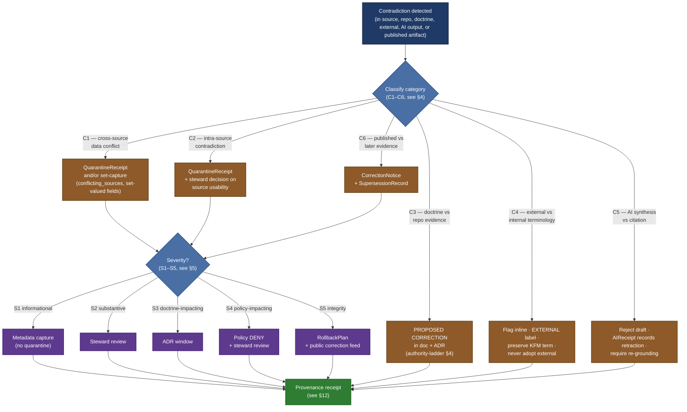

<!-- [KFM_META_BLOCK_V2]
doc_id: kfm://doc/NEEDS-VERIFICATION/contradiction-handling
title: Contradiction Handling
type: standard
version: v1
status: draft
owners: "TODO(owner): confirm Governance Steward + Doctrine Working Group + Release Authority in role register"
created: 2026-05-12
updated: 2026-05-15
policy_label: public
related:
  - docs/doctrine/truth-posture.md
  - docs/doctrine/authority-ladder.md
  - docs/doctrine/evidence-first.md
  - docs/doctrine/lifecycle-law.md
  - docs/doctrine/corrections-first-class.md
  - docs/doctrine/derived-stays-derived.md
  - docs/doctrine/ai-as-assistant.md
  - docs/doctrine/policy-aware.md
  - docs/doctrine/time-aware.md
  - docs/doctrine/trust-membrane.md
  - docs/doctrine/directory-rules.md
  - docs/adr/
  - docs/runbooks/RB-CORRECTION-ROUTINE.md
  - docs/runbooks/RB-ROLLBACK-EXECUTION.md
  - schemas/contracts/v1/correction_notice.schema.json
  - schemas/contracts/v1/supersession_record.schema.json
  - schemas/contracts/v1/quarantine_receipt.schema.json
  - schemas/contracts/v1/validation_report.schema.json
  - schemas/contracts/v1/rollback_plan.schema.json
  - schemas/contracts/v1/ai_receipt.schema.json
  - control_plane/policy_gate_register.yaml
tags: [kfm, governance, doctrine, contradiction, conflict, evidence, audit, trust]
notes:
  - Codifies how KFM detects, classifies, surfaces, and routes contradictions across sources, repository evidence, doctrine, external standards, and AI-assisted output.
  - Operationalizes the "Conflict surfacing" rule from docs/doctrine/truth-posture.md and the override-routing rules from docs/doctrine/authority-ladder.md.
  - Placement under docs/governance/ remains CONFLICTED / NEEDS VERIFICATION with the sibling doctrine track under docs/doctrine/. Confirm against Directory Rules and mounted-repo evidence before moving or linking.
  - All schema field names, route paths, CI workflow names, reason codes, role-register paths, and runbook references are PROPOSED until verified against repository state.
  - 2026-05-15 update tightened evidence-boundary language, quick triage, path placeholders, runtime outcome notes, and adoption checks without changing the core doctrine.
[/KFM_META_BLOCK_V2] -->

# Contradiction Handling

> **How Kansas Frontier Matrix detects, classifies, surfaces, and resolves contradictions — across sources, repository evidence, doctrine, external standards, and AI-assisted output — without ever silently picking a winner.**

**Status:** Draft &middot; **Owners:** `TODO(owner): confirm Governance Steward + Doctrine Working Group + Release Authority in role register` &middot; **Last updated:** 2026-05-15 &middot; **Path:** `PATH_TBD_AFTER_REPO_INSPECTION`

> [!IMPORTANT]
> This document is **normative**. It governs how every KFM contributor — human or AI — must behave when they encounter disagreement between sources, between code and doctrine, between standards and project terminology, or between an AI draft and its citations. Deviation is not a stylistic choice; it requires explicit governance review and a recorded justification (typically an ADR).

> [!NOTE]
> **Evidence boundary for this revision:** the attached Markdown was inspected as the working baseline. No mounted repository, live schemas, tests, workflows, role register, policy-gate register, runbooks, dashboards, or runtime logs were inspected in this session. This document states doctrine and proposed operating machinery; exact paths, owners, reason codes, schema fields, and runtime wiring remain `NEEDS VERIFICATION` until repository evidence confirms them.

---

## Quick triage card

Use this card when a reviewer, steward, validator, or AI assistant first encounters a possible contradiction. It is a navigation aid; the numbered sections below remain authoritative.

| First question | If yes | If no |
|---|---|---|
| Are two or more claims incompatible about the same fact, geometry, date, source role, release state, or policy posture? | Classify as a contradiction and continue. | Treat as uncertainty or missing evidence; see [§3](#3-definitions--contradiction-vs-uncertainty-vs-missing-evidence). |
| Is either side already public, semi-public, or used by a released artifact? | Start at C6 and consider S4/S5 escalation. | Start at C1–C5 according to source of the conflict. |
| Does the contradiction cross rights, sensitivity, cultural, archaeological, ecological, living-person, DNA, title, infrastructure, or security boundaries? | Prefer `DENY`, quarantine, redaction, generalization, or steward review until support is clear. | Continue normal classification and provenance recording. |
| Is the contradiction between doctrine and current repository evidence? | Mark `PROPOSED CORRECTION`; route through ADR. | Use the ordinary category/severity matrix. |
| Did AI generate, summarize, or smooth the disputed claim? | Reject or re-ground the draft and record an `AIReceipt` when C5 applies. | Record the contradiction through the non-AI receipt path. |

> [!CAUTION]
> The triage card must not become a shortcut for picking a winner. Its job is to get the contradiction into the right queue with enough evidence to audit later.

[⬆ Back to top](#contradiction-handling)

---

## Contents

- [Quick triage card](#quick-triage-card)

1. [Purpose &amp; scope](#1-purpose--scope)
2. [The doctrine in one paragraph](#2-the-doctrine-in-one-paragraph)
3. [Definitions — contradiction vs uncertainty vs missing evidence](#3-definitions--contradiction-vs-uncertainty-vs-missing-evidence)
4. [Categories of contradiction](#4-categories-of-contradiction)
5. [Severity classes](#5-severity-classes)
6. [Routing flow](#6-routing-flow)
7. [Disposition matrix](#7-disposition-matrix)
8. [The cardinal rules — what is forbidden](#8-the-cardinal-rules--what-is-forbidden)
9. [Lifecycle impact — where contradictions are caught](#9-lifecycle-impact--where-contradictions-are-caught)
10. [Runtime impact — outcome mapping](#10-runtime-impact--outcome-mapping)
11. [AI-assisted authoring rules](#11-ai-assisted-authoring-rules)
12. [Audit &amp; provenance requirements](#12-audit--provenance-requirements)
13. [Roles &amp; responsibilities](#13-roles--responsibilities)
14. [Pre-merge contradiction checklist](#14-pre-merge-contradiction-checklist)
15. [Worked examples](#15-worked-examples)
16. [FAQ](#16-faq)
17. [Related docs](#17-related-docs)
18. [Adoption & verification checklist](#18-adoption--verification-checklist)

---

## 1. Purpose &amp; scope

Kansas Frontier Matrix integrates heterogeneous, frequently contested historical, archival, geospatial, and scientific evidence. Disagreement is the default state of the input. The integrity of every downstream artifact — datasets, catalogs, maps, narratives, models, documentation — depends on the discipline with which **contradictions are detected, named, and routed** rather than smoothed away by the author or the pipeline.

This document operationalizes the **"Conflict surfacing"** rule from [`truth-posture`](../doctrine/truth-posture.md) and the **override-routing rules** from [`authority-ladder`](../doctrine/authority-ladder.md). It defines the categories, severity ladder, routing mechanisms, audit obligations, and forbidden actions that together comprise KFM's contradiction posture. It does **not** prove current repository implementation, schema availability, runbook existence, or runtime behavior; those remain `UNKNOWN` until inspected.

**In scope**

- Contradictions across any KFM authority tier (Primary doctrine, Secondary repo evidence, Tertiary external research).
- Contradictions inside ingested data (cross-source conflicts, intra-source conflicts).
- Contradictions between AI-generated output and the sources it cites.
- Contradictions between published artifacts and later-arriving evidence.
- The classification, routing, audit, and disposition machinery for each of the above.

**Out of scope**

- Pure *uncertainty* with no rival claim (covered by [`truth-posture`](../doctrine/truth-posture.md) truth labels and the time-uncertainty vocabulary in [`time-aware`](../doctrine/time-aware.md)).
- *Missing* evidence with no conflict (covered by the `ABSTAIN` rule in [`evidence-first`](../doctrine/evidence-first.md)).
- Data-quality validation failures that are not contradictions (covered by the validation policy and `ValidationReport` contract).
- General governance procedure (PR review, ADR cadence) where no contradiction is at stake.

> [!NOTE]
> The boundaries above matter. A label of *"uncertain"* communicates one thing; a label of *"contradicted"* communicates a different thing; they must not be conflated. See [§3](#3-definitions--contradiction-vs-uncertainty-vs-missing-evidence).

[⬆ Back to top](#contradiction-handling)

---

## 2. The doctrine in one paragraph

A contradiction is **not a defect to hide** — it is information that must be preserved, classified, surfaced, and routed. KFM never silently picks a winner. Every contradiction must be **(a)** detected at the earliest stage it is detectable, **(b)** classified by tier and severity, **(c)** recorded in a form downstream consumers can inspect, and **(d)** routed to a mechanism appropriate to its kind — `QuarantineReceipt`, set-capture in metadata, `PROPOSED CORRECTION` + ADR, `CorrectionNotice`, `SupersessionRecord`, `RollbackPlan`, `ABSTAIN`, `DENY`, or a rejected AI draft. **Silent reconciliation is the cardinal sin.**

> [!WARNING]
> *Silent reconciliation* means: choosing one side of a contradiction in code, prose, geometry, date, attribution, or summary **without recording that a contradiction existed**, the sides of it, the evidence basis for each, and the disposition. Discovering silent reconciliation in a KFM artifact is sufficient grounds for rollback regardless of any downstream consequences.

[⬆ Back to top](#contradiction-handling)

---

## 3. Definitions — contradiction vs uncertainty vs missing evidence

Three nearby states are commonly conflated. The doctrine treats them distinctly because their dispositions differ.

| State | Definition | Example | Disposition family |
|---|---|---|---|
| **Contradiction** | Two or more sources make incompatible claims about the same fact; both are present. | Two USGS gauge records report different discharge values for the same station-hour. | Routed per this document. |
| **Uncertainty** | A single source makes a claim with admitted imprecision; no rival is present. | An EDTF date `1854~` (approximate). | Captured via truth labels and `time_uncertainty`. |
| **Missing evidence** | No source supports a claim that the artifact wishes to make. | A timeline event with no citable source. | `ABSTAIN` per `evidence-first`. |

> [!TIP]
> When unsure, ask: *"Are there rival claims present?"* If yes → contradiction (this doc). If only one source with hedged confidence → uncertainty. If zero sources → missing evidence (abstain).

A claim can be **simultaneously** uncertain *and* contradicted (two imprecise sources that disagree); the contradiction posture applies, with uncertainty labels preserved on each side.

[⬆ Back to top](#contradiction-handling)

---

## 4. Categories of contradiction

Six categories cover the contradictions KFM encounters. Each has a typical detection point and a primary disposition. All categories are normative; none may be silently reconciled.

| # | Category | Definition | Typically detected at | Primary disposition |
|---|---|---|---|---|
| C1 | **Cross-source data conflict** | Two or more ingested sources disagree on a fact about the same real-world referent. | `RAW` intake / `WORK` normalization. | Quarantine and/or set-capture in metadata; route per [§7](#7-disposition-matrix). |
| C2 | **Intra-source contradiction** | A single source contradicts itself (e.g., two dates for the same event in the same document). | `RAW` intake. | `QuarantineReceipt`; steward decides if the source is usable at all. |
| C3 | **Doctrine vs repository evidence** | Tier 2 (code, tests, configs) reveals doctrine is wrong or has drifted. | Authoring / review / audit. | `PROPOSED CORRECTION` in the doc + ADR per [`authority-ladder`](../doctrine/authority-ladder.md). |
| C4 | **External vs internal terminology or standard** | A Tier 3 external standard or vendor doc conflicts with KFM terminology, casing, or doctrine. | Authoring / review. | Surface the relationship inline (`EXTERNAL` label); never adopt the external term in place of the KFM term. |
| C5 | **AI synthesis vs citation** | An AI-generated draft makes a claim its cited evidence does not support, or omits a contradiction visible in the cited evidence. | AI-assisted authoring / review. | Reject the draft; require re-grounding. Record an `AIReceipt` indicating the synthesis was retracted. |
| C6 | **Published artifact vs later evidence** | A new source surfaces after publication and contradicts a published claim, geometry, date, attribution, release state, or policy classification. | Post-publication. | `CorrectionNotice` + `SupersessionRecord` (+ `RollbackPlan` if severity ≥ S5). |

> [!NOTE]
> The categories are exhaustive **by intent**, not by enumeration. A contradiction that does not cleanly fit one of C1–C6 should be classified into the nearest category and the misfit noted as a `PROPOSED CORRECTION` to this taxonomy. Do not invent new categories silently.

[⬆ Back to top](#contradiction-handling)

---

## 5. Severity classes

Severity governs **response urgency and ceiling of disposition**. Severity is determined by the impact on consumers, on doctrine, and on the policy / release surface — not by how much the contradiction "feels" important.

| Class | Definition | Examples | Required action |
|---|---|---|---|
| **S1 — Informational** | Minor disagreement between weak sources; no material downstream effect. | Two history books disagree on one digit of a treaty *year* where the canonical record is clear. | Capture both in metadata (`time_uncertainty: conflicting_sources` or analogous set field). No quarantine. |
| **S2 — Substantive** | Material disagreement that affects downstream use. | Two land surveys report incompatible parcel geometries; both are otherwise credible. | `QuarantineReceipt`; steward review required before `PROCESSED`. |
| **S3 — Doctrine-impacting** | Code, schema, or test reveals doctrine itself is wrong or has drifted. | Validator behavior contradicts the published rule in a doctrine doc. | `PROPOSED CORRECTION` in the doc plus an ADR within the doctrine-review window. |
| **S4 — Policy-impacting** | Contradiction crosses a policy boundary (sensitivity, rights, public exposure). | A published geometry contradicts the sensitivity classification it should have inherited. | `DENY` at the policy gate; immediate steward review; possible `RollbackPlan`. |
| **S5 — Integrity** | A published artifact is provably wrong in a way consumers may have already acted on. | Geometry that places a Kansas county in a neighboring state in the public map. | `CorrectionNotice` + `SupersessionRecord` + `RollbackPlan`; public correction-feed entry. |

> [!CAUTION]
> The severity rubric above is **PROPOSED** in its exact thresholds. Severity assignment for any specific incident is a steward judgment that must be recorded in the audit trail. Do not encode severity as an automatic function of category; the same category can produce different severities depending on consequence.

[⬆ Back to top](#contradiction-handling)

---

## 6. Routing flow

The diagram below is the doctrinal routing model for any detected contradiction. Begin at the top; the categorization step (`C1`–`C6`) determines the lane; severity (`S1`–`S5`) determines the ceiling.

The dashed reading of the diagram: **classification chooses the lane; severity chooses the ceiling**. Every path terminates in a provenance receipt — there is no path where the contradiction simply disappears.

> [!NOTE]
> Diagram vocabulary is **CONFIRMED** as this document's category/severity taxonomy. The precise routing edges are **PROPOSED** implementation guidance until verified against active runbooks (`RB-CORRECTION-ROUTINE.md`, `RB-ROLLBACK-EXECUTION.md`) and the policy-gate register.

[⬆ Back to top](#contradiction-handling)

---

## 7. Disposition matrix

The matrix below maps **category × severity** to disposition mechanisms. Cells marked with a primary mechanism (**bold**) are required; secondary mechanisms (plain) may also apply.

| Category \ Severity | S1 | S2 | S3 | S4 | S5 |
|---|---|---|---|---|---|
| **C1** cross-source data | **`conflicting_sources` / set-capture** | **`QuarantineReceipt`** | (rare) → ADR if doctrine implicated | **`DENY` + review** | **`CorrectionNotice` + `RollbackPlan`** |
| **C2** intra-source | (rare) metadata flag | **`QuarantineReceipt`** | (rare) → ADR | **`DENY` + review** | **`CorrectionNotice` + `RollbackPlan`** |
| **C3** doctrine vs repo | (n/a — doctrine conflicts are ≥ S3) | (n/a) | **`PROPOSED CORRECTION` + ADR** | **`PROPOSED CORRECTION` + ADR + policy review** | **`PROPOSED CORRECTION` + ADR + rollback** |
| **C4** external vs internal | **Inline `EXTERNAL` flag** | **Inline flag + reviewer escalation** | **ADR if doctrine impacted** | **Policy review** | (rare) integrity rollback |
| **C5** AI synthesis vs citation | **Reject draft + re-ground** | **Reject + `AIReceipt` retraction** | **Reject + doctrine review** | **Reject + policy review** | **Reject + post-mortem if published** |
| **C6** published vs later | (rare — S2 is the floor for post-pub) | **`CorrectionNotice` + `SupersessionRecord`** | **`CorrectionNotice` + ADR** | **`CorrectionNotice` + `DENY` on stale routes** | **`CorrectionNotice` + `SupersessionRecord` + `RollbackPlan`** |

> [!IMPORTANT]
> The matrix codifies *minimum* response. A steward may always escalate (e.g., treat an S2 as if it were S3) when judgment warrants. A steward **may not** de-escalate without an ADR; downgrading severity in private is itself a silent-reconciliation defect.

[⬆ Back to top](#contradiction-handling)

---

## 8. The cardinal rules — what is forbidden

These are the actions that, if discovered in any KFM artifact, are sufficient grounds for rollback and a post-mortem regardless of how convenient or polished the result appears.

- ❌ **Silent picking.** Choosing one source over another without recording that a contradiction existed, the sides of it, the basis for each side, and the disposition.
- ❌ **"Most recent wins"** without evidence that recency is the right tiebreaker for the specific fact at hand.
- ❌ **"Most authoritative-looking wins"** without an explicit mapping to the authority ladder (see [`authority-ladder`](../doctrine/authority-ladder.md)).
- ❌ **Smoothing prose.** Rewriting language so a reader cannot tell that sources disagree.
- ❌ **Substituting an external term** (e.g., replacing `EvidenceBundle` with a generic industry word) to dodge a doctrine conflict.
- ❌ **AI synthesis that papers over disagreement** present in the cited sources.
- ❌ **Hand-editing data** to "fix" a source contradiction. Manual edits are themselves a derivation step and must be recorded as such per [`derived-stays-derived`](../doctrine/derived-stays-derived.md).
- ❌ **Treating absence of disagreement** as evidence of resolution. Silence is not consensus.
- ❌ **Resolving a Tier 1 vs Tier 2 contradiction without an ADR.** Doctrine drift is itself a violation.
- ❌ **Closing a `QuarantineReceipt` without recording the steward decision** that justified the closure.
- ❌ **Withdrawing a `CorrectionNotice`** instead of issuing a follow-on notice. Corrections themselves are first-class and immutable; see [`corrections-first-class`](../doctrine/corrections-first-class.md).

> [!WARNING]
> If you find yourself reaching for any of the above to "make the doc / dataset / answer cleaner," **stop**. The cleanness you are buying is paid for by the consumer downstream, who can no longer see the disagreement.

[⬆ Back to top](#contradiction-handling)

---

## 9. Lifecycle impact — where contradictions are caught

Contradictions are caught at every stage of the lifecycle. Each stage has detection responsibility, disposition mechanism, and a non-negotiable rule that the stage must **never collapse** a contradiction it can see.

| Stage | Detection responsibility | Disposition mechanism | Non-negotiable |
|---|---|---|---|
| **`RAW`** | Intake validation; per-source schema validation; cross-source comparison where possible. | `IntakeReceipt` may record detected cross-source disagreement; `QuarantineReceipt` if validation fails. | RAW never silently merges sources. |
| **`WORK`** | Normalization rules; type/units coercion; geometry alignment. | Transformation must preserve disagreement (e.g., emit set-valued fields, not collapsed scalars). | A transformation that collapses a contradiction is **rejected** by validation. |
| **`QUARANTINE`** | Holds anything that failed intake or normalization due to contradiction or other defect. | Steward review → released to `WORK`/`PROCESSED` with annotation, or rejected. | A `QuarantineReceipt` may not be closed without a recorded steward decision. |
| **`PROCESSED`** | Encodes surviving contradictions as structured metadata. | `time_uncertainty: conflicting_sources`; set-valued geometries; multi-valued attributions. | Single-value fields require a recorded reason if multiple inputs disagreed. |
| **`CATALOG` / `TRIPLET`** | Catalog records and triples must link **all** supporting `EvidenceRef`s when sources disagree. | Multiple `EvidenceRef`s per `InspectableClaim`; rival claims linked, not hidden. | A claim grounded in disagreement that cites only one side fails the citation-closure check. |
| **`PUBLISHED`** | Surfaces contradictions to consumers via metadata / evidence drawer / catalog. | `ReleaseManifest` records detected unresolved disagreements; `ProofPack` includes them. | A `PUBLISHED` artifact that hides a known disagreement is an integrity defect (S5). |
| **Post-publication** | Watches for later-arriving evidence; receives correction submissions. | `CorrectionNotice` + `SupersessionRecord` (+ `RollbackPlan` if S5). | Corrections themselves are immutable and append-only. |

> [!TIP]
> A contradiction caught at `RAW` is cheap. The same contradiction caught at `PUBLISHED` is expensive. Detection investment belongs as close to ingest as the available evidence permits.

[⬆ Back to top](#contradiction-handling)

---

## 10. Runtime impact — outcome mapping

Contradictions affect the runtime decision envelope. The mapping below ties each outcome (`ANSWER`, `ABSTAIN`, `DENY`, `ERROR`, `STALE`) to the contradiction states that produce it.

| Outcome | When it applies to a contradiction | Illustrative `reason_code` |
|---|---|---|
| `ANSWER` | Contradiction was resolved (e.g., supersession established, steward decision recorded); citation chain is clean and links both the resolved claim and the superseded one. | `ok.warranted` |
| `ABSTAIN` | An unresolved contradiction prevents a defensible answer; available evidence is mutually inconsistent and no supersession exists. | `evidence.conflicting` *(PROPOSED)* |
| `DENY` | The contradiction crosses a policy boundary (e.g., sensitivity classification mismatch, public-exposure mismatch). | `policy.sensitivity` &middot; `policy.rights_unclear` |
| `ERROR` | The contradiction reveals a system invariant violation (e.g., a `PUBLISHED` artifact whose `EvidenceRef` chain no longer terminates in `RAW`). | `system.integrity_failure` |
| `STALE` | The contradiction is between current evidence and an evidence bundle whose freshness window has lapsed; serve nothing until refreshed. | `freshness.window_lapsed` |

> [!NOTE]
> The `evidence.conflicting` reason code is **PROPOSED**. Existing reason codes (`policy.sensitivity`, `policy.rights_unclear`, `system.integrity_failure`, `freshness.window_lapsed`, `evidence.missing`) are drawn from existing KFM doctrine. The naming of any new reason code requires alignment with [`policy-aware`](../doctrine/policy-aware.md) and the `policy_gate_register.yaml` register before adoption.
>
> `STALE` is treated here as a trust-visible runtime state. If the active runtime contract admits only `ANSWER`, `ABSTAIN`, `DENY`, and `ERROR`, map a stale contradiction to `ABSTAIN` or `ERROR` with `freshness.window_lapsed`, rather than inventing a new final outcome silently.

[⬆ Back to top](#contradiction-handling)

---

## 11. AI-assisted authoring rules

AI assistance is permitted inside KFM under the [`ai-as-assistant`](../doctrine/ai-as-assistant.md) doctrine. Contradiction handling imposes additional, AI-specific rules that override any model preference for fluency.

1. **Surface, never reconcile.** An AI draft must surface a contradiction it sees in cited sources. It may not synthesize a "best of both" sentence that hides the disagreement.
2. **Label, don't smooth.** When sources disagree, the AI labels the claim `CONTRADICTED` and presents each side with its `EvidenceRef`, rather than choosing.
3. **Refuse fluent reconciliation.** If a contradiction can only be resolved by inference, the AI must mark the inference `INFERRED` or `PROPOSED` — never present it as fact.
4. **Reject re-grounding requests that ask for a winner.** A request like *"just pick the more authoritative one"* must be refused with an explanation; routing to a steward or ADR is the correct response.
5. **`AIReceipt` records retraction.** When an AI draft is rejected for failing C5 (synthesis vs citation), the `AIReceipt` records that the synthesis was retracted, the contradiction that caused the retraction, and the re-grounding action taken.
6. **No silent terminology substitution.** If an external standard the AI is referencing uses a different word for a KFM concept (`EvidenceBundle` vs "provenance bundle"), the AI flags the relationship as a C4 contradiction and preserves the KFM term.
7. **Chain-of-thought is not the audit trail.** The audit trail is the `AIReceipt`, the receipts on the artifacts the AI produced, and the citations resolved. The model's internal reasoning is not persisted and cannot substitute for a recorded disposition.

> [!CAUTION]
> An AI that resolves contradictions silently is **less safe** than an AI that abstains. KFM prefers an `ABSTAIN` with structured uncertainty over a polished, fluent answer that hides a disagreement. Reviewers should treat fluent reconciliation by AI as a defect signal, not a quality signal.

[⬆ Back to top](#contradiction-handling)

---

## 12. Audit &amp; provenance requirements

Every contradiction event leaves a record. The records are append-only and immutable per [`corrections-first-class`](../doctrine/corrections-first-class.md). The required content of each record:

- **Detection metadata** — when the contradiction was detected, by what (validator, steward, AI review), at what lifecycle stage.
- **Sides** — the rival claims, each with their `EvidenceRef`(s) and source citations.
- **Classification** — category (C1–C6) and severity (S1–S5), with the steward who assigned them.
- **Disposition** — which mechanism was invoked (`QuarantineReceipt`, `PROPOSED CORRECTION`, `CorrectionNotice`, etc.) and where the artifact for that mechanism lives.
- **Resolution** — if resolved, the resolution decision and its evidence basis; if unresolved, the abstain / set-capture / quarantine state.
- **ADR linkage** — if a doctrine or contract change resulted, the ADR id and disposition.

The receipts that may carry these records (paths and field names **PROPOSED** until verified):

<strong>Receipts and records that carry contradiction provenance</strong>

- `schemas/contracts/v1/quarantine_receipt.schema.json` — `QuarantineReceipt` records the conflict that caused quarantine and the steward decision that closed it. *PROPOSED path.*
- `schemas/contracts/v1/correction_notice.schema.json` — `CorrectionNotice` records the published claim that was wrong, the corrected claim, and the contradiction that triggered the correction. *PROPOSED path.*
- `schemas/contracts/v1/supersession_record.schema.json` — `SupersessionRecord` links the superseded claim to the new claim and references the `CorrectionNotice`. *PROPOSED path.*
- `schemas/contracts/v1/rollback_plan.schema.json` — `RollbackPlan` for S5 events. *PROPOSED path.*
- `schemas/contracts/v1/validation_report.schema.json` — `ValidationReport` records detected contradictions at intake / normalization. *PROPOSED path.*
- `schemas/contracts/v1/ai_receipt.schema.json` — `AIReceipt` records C5 retractions. *PROPOSED path.*
- `docs/adr/` — ADRs for C3 doctrine-vs-repo dispositions. *PROPOSED path.*

> [!IMPORTANT]
> Records are **append-only**. A wrong record is corrected by issuing a *new* record that supersedes the previous one — not by editing the prior record. This applies to `QuarantineReceipt`, `CorrectionNotice`, `SupersessionRecord`, and `AIReceipt` equally.

[⬆ Back to top](#contradiction-handling)

---

## 13. Roles &amp; responsibilities

The roles below are **functional**, not necessarily mapped to specific people. A single individual may hold multiple roles; a contradiction's disposition is recorded against the role, not the person.

| Role | Responsibility for contradictions |
|---|---|
| **Contributor (human or AI)** | Detect contradictions during authoring; label them; route them; never silently reconcile. |
| **Reviewer** | Audit submitted artifacts for hidden contradictions; confirm classification and severity; sign off only when disposition is recorded. |
| **Steward** | Make the disposition decision for quarantined data; sign `QuarantineReceipt` closures; assign severity. |
| **Doctrine Working Group** | Resolve C3 (doctrine vs repo) contradictions via ADR; maintain this document. |
| **Release Authority** | Approve `CorrectionNotice` and `RollbackPlan` for published material; coordinate with stewards on S4/S5 events. |
| **Governance Steward** | Owns this document; reviews patterns of contradictions to identify systemic issues; reports drift to the working group. |
| **Audit role** | Spot-checks artifacts for silent reconciliation; flags suspected violations for steward review. |

> [!NOTE]
> Role identities (specific people, teams, or groups) are **TODO** placeholders until confirmed against the project's role register (`control_plane/role_register.yaml`, *PROPOSED path*).

[⬆ Back to top](#contradiction-handling)

---

## 14. Pre-merge contradiction checklist

Reviewers and authors should run this checklist before merging any PR that touches sources, data, doctrine, schemas, policies, or runtime decision paths. The checklist is **absolute** in the sense of [`truth-posture`](../doctrine/truth-posture.md) — failure on any item is grounds to block merge.

- [ ] Every contradiction I encountered while authoring is **recorded somewhere** — in metadata, in a receipt, in an inline label, or in a `PROPOSED CORRECTION`.
- [ ] No prose was rewritten to hide a disagreement.
- [ ] No data field collapses multiple disagreeing inputs into a single value without a recorded reason.
- [ ] No external term replaces a KFM term to dodge a C4 contradiction.
- [ ] No AI-generated section makes a synthesis claim its citations do not support.
- [ ] Where a contradiction exists, the category (C1–C6) and severity (S1–S5) are explicit.
- [ ] Where disposition required an ADR, the ADR is linked or the contradiction is marked **`PROPOSED CORRECTION`** awaiting ADR.
- [ ] Where the contradiction touched published material, a `CorrectionNotice` is open or in flight.
- [ ] The audit trail required by [§12](#12-audit--provenance-requirements) is complete for every contradiction I introduced or discovered.
- [ ] If I touched placement, schema-home, reason-code, role-register, or runbook assumptions, they are either verified or marked `NEEDS VERIFICATION` / `PROPOSED`.
- [ ] I have not silently reconciled.

[⬆ Back to top](#contradiction-handling)

---

## 15. Worked examples

The examples below are **illustrative** — they are not direct transcripts of incidents. Each shows how the doctrine routes a realistic-shaped contradiction.

<strong>Example 1 — Two historical sources disagree on a treaty date</strong>

**Situation.** Source A (a state archive transcript) records a treaty signing as `1854-09-12`. Source B (a contemporary newspaper) records it as `1854-09-15`. Both are credible. The KFM event node currently in `WORK` cites Source A.

**Classification.** C1 (cross-source data conflict), S1–S2 depending on downstream usage. Treat as **S2** here because the date is surfaced in a public timeline.

**Disposition.**
- Encode the disagreement using the `time_uncertainty: conflicting_sources` vocabulary from [`time-aware`](../doctrine/time-aware.md).
- Use an EDTF *set* on the event node: `[1854-09-12, 1854-09-15]`.
- Link both `EvidenceRef`s; do not drop Source B.
- Surface the disagreement in the catalog metadata and in the public Evidence Drawer.
- No quarantine — the event remains usable with the structured disagreement carried forward.

**Forbidden.** Silently picking `1854-09-12` because Source A "looks more authoritative." That move is a silent-reconciliation defect.

<strong>Example 2 — Validator behavior contradicts published doctrine</strong>

**Situation.** Doctrine doc states *"PROCESSED artifacts must carry a non-empty list of input `EvidenceRef`s."* A reviewer discovers that the active validator accepts empty `EvidenceRef` lists for a specific stage.

**Classification.** C3 (doctrine vs repo), severity at least **S3** (doctrine-impacting); escalates to S4 if it can produce policy-violating output.

**Disposition.**
- Author inserts `PROPOSED CORRECTION` note in the doctrine doc identifying the contradiction.
- An ADR is opened under `docs/adr/` (*PROPOSED path*) to resolve.
- The ADR decides whether (a) doctrine narrows to match validator scope, or (b) validator is fixed to enforce doctrine. The decision is **not** made silently in either place.
- Until the ADR lands, the doctrine doc carries the `PROPOSED CORRECTION` openly.

**Forbidden.** Editing the doctrine doc to match validator behavior without an ADR. Silent doctrine drift is a structural defect.

<strong>Example 3 — AI draft synthesizes a "consensus" from disagreeing sources</strong>

**Situation.** An AI assistant is asked to summarize hydrology gauge coverage for 1925. Two cited reports give different gauge counts. The AI returns: *"By 1925, KFM held roughly 90 gauge records for Kansas."*

**Classification.** C5 (AI synthesis vs citation), severity at least **S2** (substantive — the synthesis hides the disagreement).

**Disposition.**
- Reviewer rejects the draft.
- An `AIReceipt` is filed recording the retraction and the contradiction.
- The AI is re-prompted to surface both counts, label the claim `CONTRADICTED`, link both `EvidenceRef`s, and present the disagreement to the consumer.
- The final draft reads, illustratively: *"Source X reports 87 gauge records; Source Y reports 94. The sources disagree (`CONTRADICTED`)."*

**Forbidden.** Accepting the original "roughly 90" formulation on the grounds that it is "close enough." The fluency conceals the contradiction; the fluency is the defect.

<strong>Example 4 — A new survey arrives after publication and contradicts a published geometry</strong>

**Situation.** A `PUBLISHED` parcel geometry is contradicted by a newly-arrived 2026 survey that places one boundary 14 meters further north.

**Classification.** C6 (published vs later evidence), severity **S5** if the published geometry is consumed by downstream legal or planning users; **S2–S3** if usage is informational.

**Disposition (assuming S5).**
- File a `CorrectionNotice` identifying the published artifact, the prior geometry, the new geometry, and the contradiction.
- Issue a `SupersessionRecord` linking the prior `EvidenceBundle` to the new one.
- Open a `RollbackPlan` to retract or amend the public artifact.
- Add the event to the public correction-notice feed.
- The prior `CorrectionNotice` and prior `EvidenceBundle` are **not deleted** — they remain in the immutable record per [`corrections-first-class`](../doctrine/corrections-first-class.md).

**Forbidden.** Silently re-publishing with the new geometry. The old geometry must remain accessible with a supersession pointer; consumers who saw the old version need to see how they got there.

<strong>Example 5 — External standard uses terminology that conflicts with a KFM term</strong>

**Situation.** A contributor cites an external standard that uses the phrase "provenance bundle" for a concept that overlaps partly, but not exactly, with KFM's `EvidenceBundle`. The draft replaces `EvidenceBundle` with the external term throughout the KFM doc to sound more standard.

**Classification.** C4 (external vs internal terminology or standard), severity **S1–S3** depending on whether the substitution changes doctrine or only wording.

**Disposition.**
- Preserve the KFM term `EvidenceBundle`.
- Add an inline note: `EXTERNAL: <standard> uses "provenance bundle"; KFM uses EvidenceBundle for the governed evidence-resolution object.`
- If the external standard shows that KFM terminology or structure is wrong, open a `PROPOSED CORRECTION` and ADR rather than silently renaming.

**Forbidden.** Replacing the KFM term everywhere without recording the relationship. External familiarity is not authority to erase KFM semantics.

[⬆ Back to top](#contradiction-handling)

---

## 16. FAQ

<strong>Isn't "surface every contradiction" exhausting? Can we batch them?</strong>

Batching the *recording* is fine; batching the *resolution* is fine; batching the *concealment* is not. The doctrine requires that the record exist — not that every record interrupt the workflow. Stewards may review quarantine queues on a cadence; ADRs may aggregate related doctrine-vs-repo findings. What's not permitted is the contradiction passing through without a record at all.

<strong>What if both sources are clearly low-quality?</strong>

Quality is not a license to pick. If both sources are weak, the structured disagreement reflects the weakness honestly. The consumer is told *"we have two weak sources that disagree,"* which is more accurate than *"here is a fact."* If a steward decides neither source is usable at all, that is a different disposition (quarantine the source, not the contradiction).

<strong>How does this differ from <code>truth-posture.md</code>'s "Conflict surfacing" section?</strong>

`truth-posture.md` states the **principle**: conflicts are information, do not smooth. This document provides the **machinery**: categories, severities, routing, mechanisms, receipts, audit. The principle is binding; the machinery is how the principle is applied across the lifecycle and the runtime.

<strong>Is "the source is wrong, just fix it" ever acceptable?</strong>

Only via a recorded derivation. A manual edit that corrects a source is itself a derivation step per [`derived-stays-derived`](../doctrine/derived-stays-derived.md) and must be recorded as such, with the original source preserved and the correction linked. The doctrine does not forbid corrections — it forbids invisible corrections.

<strong>What if the contradiction is between this doc and another doctrine doc?</strong>

Then this doc carries an inline `PROPOSED CORRECTION` flag and an ADR is opened. The contradiction-handling doctrine is bound by its own rules. There is no "trust me" exception for governance documents.

<strong>Does this apply to ingestion of large datasets where per-record review is infeasible?</strong>

Yes — but the rule applies at the *shape* of detection, not at human-eyeballs review. Automated cross-source comparison at intake, automated set-capture in metadata, and automated `QuarantineReceipt` generation when validators detect disagreement are the operational form. Stewards review the queues, not every record individually.

[⬆ Back to top](#contradiction-handling)

---

## 17. Related docs

> [!NOTE]
> Paths below preserve the existing relative-link assumptions of the baseline document. Because this session did not inspect a mounted repository, every concrete path remains `NEEDS VERIFICATION` unless separately confirmed by repository evidence. Directory placement should follow Directory Rules: responsibility root first, no parallel schema/contract/policy homes without an ADR, and `schemas/contracts/v1/<…>` as the default schema-home convention where applicable.

- [`docs/doctrine/truth-posture.md`](../doctrine/truth-posture.md) — Truth labels, source hierarchy, evidence-gathering, and the headline "Conflict surfacing" rule this document operationalizes. **CONFIRMED doctrine reference; path NEEDS VERIFICATION.**
- [`docs/doctrine/authority-ladder.md`](../doctrine/authority-ladder.md) — Primary / Secondary / Tertiary tiers and the `PROPOSED CORRECTION` mechanism this document inherits. **CONFIRMED doctrine reference; path NEEDS VERIFICATION.**
- [`docs/doctrine/evidence-first.md`](../doctrine/evidence-first.md) — `InspectableClaim` → `EvidenceRef` → `EvidenceBundle` → `SourceDescriptor`; the `ABSTAIN` rule that applies when contradictions cannot be defensibly resolved. **CONFIRMED doctrine reference; path NEEDS VERIFICATION.**
- [`docs/doctrine/lifecycle-law.md`](../doctrine/lifecycle-law.md) — `RAW → WORK/QUARANTINE → PROCESSED → CATALOG/TRIPLET → PUBLISHED`; the stages where contradictions are caught and quarantined. **CONFIRMED doctrine reference; path NEEDS VERIFICATION.**
- [`docs/doctrine/corrections-first-class.md`](../doctrine/corrections-first-class.md) — `CorrectionNotice`, `SupersessionRecord`, `RollbackPlan`; the immutable-append-only correction machinery referenced throughout. **CONFIRMED doctrine reference; path NEEDS VERIFICATION.**
- [`docs/doctrine/derived-stays-derived.md`](../doctrine/derived-stays-derived.md) — Manual edits are derivations; the doctrine that governs how source corrections are recorded. **CONFIRMED doctrine reference; path NEEDS VERIFICATION.**
- [`docs/doctrine/ai-as-assistant.md`](../doctrine/ai-as-assistant.md) — Bounds AI use; `AIReceipt`; chain-of-thought non-persistence. **CONFIRMED doctrine reference; path NEEDS VERIFICATION.**
- [`docs/doctrine/policy-aware.md`](../doctrine/policy-aware.md) — `DecisionEnvelope`, sensitivity classification, `DENY` reason codes referenced in [§10](#10-runtime-impact--outcome-mapping). **CONFIRMED doctrine reference; path NEEDS VERIFICATION.**
- [`docs/doctrine/trust-membrane.md`](../doctrine/trust-membrane.md) — Runtime outcomes (`ANSWER`, `ABSTAIN`, `DENY`, `ERROR`, `STALE`); the canonical outcome vocabulary mapped in [§10](#10-runtime-impact--outcome-mapping). **CONFIRMED doctrine reference; path NEEDS VERIFICATION.**
- [`docs/doctrine/time-aware.md`](../doctrine/time-aware.md) — `time_uncertainty` vocabulary including `conflicting_sources`. **CONFIRMED doctrine reference; path NEEDS VERIFICATION.**
- [`docs/doctrine/directory-rules.md`](../doctrine/directory-rules.md) — Placement, responsibility-root, and schema-home rules to verify before moving this standard or creating contradiction-related schemas. **CONFIRMED directory doctrine; path NEEDS VERIFICATION.**
- [`docs/adr/`](../adr/) — ADR home for C3 dispositions, schema-home conflicts, placement decisions, and severity-rubric revisions. **PROPOSED path.**
- [`docs/runbooks/RB-CORRECTION-ROUTINE.md`](../runbooks/RB-CORRECTION-ROUTINE.md) — Day-2 routine correction procedure. **PROPOSED path.**
- [`docs/runbooks/RB-ROLLBACK-EXECUTION.md`](../runbooks/RB-ROLLBACK-EXECUTION.md) — Day-2 rollback procedure for S5 events. **PROPOSED path.**
- `schemas/contracts/v1/` — Default schema-home convention for receipt and record schemas listed in [§12](#12-audit--provenance-requirements), subject to ADR/repo verification. **PROPOSED file names; directory convention from Directory Rules.**
- `control_plane/policy_gate_register.yaml` — Reason-code register referenced in [§10](#10-runtime-impact--outcome-mapping). **NEEDS VERIFICATION — exact path.**
- [`CONTRIBUTING.md`](../../CONTRIBUTING.md) — Pre-merge checklist surface; PR template references. **NEEDS VERIFICATION.**

---

## 18. Adoption & verification checklist

Use this checklist before treating this standard as implemented or wiring it into validators, runbooks, policy gates, APIs, UI surfaces, or AI review workflows.

- [ ] Confirm the canonical target path for this file (`docs/doctrine/`, `docs/governance/`, or another documented home) against Directory Rules, current repo structure, and any accepted ADR.
- [ ] Confirm owners in the role register; replace `TODO(owner)` only with verified role/team names.
- [ ] Confirm every sibling doctrine link in [§17](#17-related-docs) resolves from the final target path.
- [ ] Confirm `C1`–`C6` and `S1`–`S5` are accepted taxonomy, or open an ADR for changes.
- [ ] Confirm contradiction-related schemas exist or create them under the ADR-approved schema home.
- [ ] Confirm `policy_gate_register.yaml` (or successor) contains the reason codes used in [§10](#10-runtime-impact--outcome-mapping).
- [ ] Confirm runbooks for correction and rollback exist and match the routing model in [§6](#6-routing-flow).
- [ ] Confirm runtime contracts either support `STALE` directly or map stale conditions to finite outcomes without silent vocabulary drift.
- [ ] Confirm UI surfaces, especially Evidence Drawer and Focus Mode, expose contradictions instead of smoothing them.
- [ ] Confirm PR templates or contributor guidance include the pre-merge checklist in [§14](#14-pre-merge-contradiction-checklist).

> [!IMPORTANT]
> Until these checks pass, this file can govern authoring posture and review expectations, but exact implementation wiring remains `UNKNOWN` / `NEEDS VERIFICATION`.

[⬆ Back to top](#contradiction-handling)

---

**Last updated:** 2026-05-15 · **Version:** v1 (draft) · **Placement:** `PATH_TBD_AFTER_REPO_INSPECTION` — current relative links preserve the baseline assumption pending repo verification

[⬆ Back to top](#contradiction-handling)
