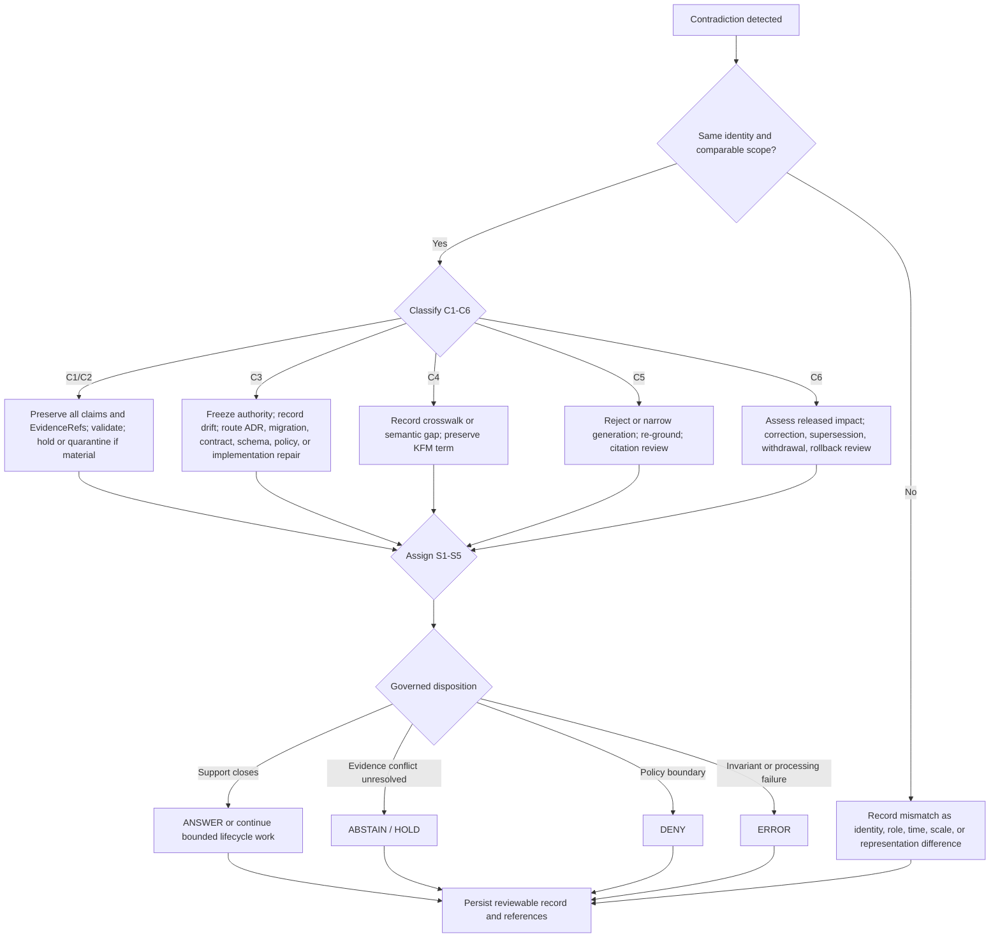

<!-- [KFM_META_BLOCK_V2]
doc_id: kfm://doc/governance/contradiction-handling
title: Contradiction Handling
type: governance-guide
version: v2-draft
status: draft; repository-grounded; taxonomy-proposed; non-publisher
owners:
  - "@bartytime4life"
owner_status: "Verified CODEOWNERS review route only; no StewardshipAssignment, independent review, policy authority, release authority, or approval is implied."
created: 2026-05-12
updated: 2026-08-23
policy_label: public
owning_root: docs/
responsibility: "Explain how KFM preserves, classifies, routes, reviews, and records contradictions without creating contract, schema, policy, release, correction, rollback, deployment, or publication authority."
truth_posture: "CONFIRMED current repository surfaces / PROPOSED C1-C6 and S1-S5 taxonomy / UNKNOWN operational enforcement; cite-or-abstain"
evidence_snapshot:
  repository: bartytime4life/Kansas-Frontier-Matrix
  base_ref: main
  base_commit: 0d2c9db88861be1ba2c32b60daea7bab3a5d4ab9
  target_prior_blob: 042096c66c8c23ce1ab98008ad3b9139eddb859d
  directory_rules_blob: fd49a0b83e55cef52c1124281f093e263526898d
  codeowners_blob: dd2a84aa514d8ecd9208bc347f90f9a2ed37dd61
  correction_notice_schema_blob: 8f260eb5a5adba0b4966adfeffebfbcf6960277d
  correction_notice_validator_blob: 00b7335a39efdc6b12d180acb40a27fe682b8ade
  validation_report_schema_blob: 14d1eeffbb15fa07f233c778a7a30106a4a14fd6
  validation_report_validator_blob: c43b6e9594e8fd91760ea3811ac888c848681e70
related:
  - docs/governance/README.md
  - docs/governance/ESCALATION.md
  - docs/governance/REVIEW_DUTIES.md
  - docs/governance/SEPARATION_OF_DUTIES.md
  - docs/governance/STEWARD_CHARTERS.md
  - docs/governance/DEPRECATION_PROCESS.md
  - docs/governance/DECISION_LOG.md
  - docs/doctrine/directory-rules.md
  - docs/adr/ADR-0029-adopt-directory-governance-standard-v2.md
  - docs/doctrine/authority-ladder.md
  - docs/doctrine/evidence-first.md
  - docs/doctrine/lifecycle-law.md
  - docs/doctrine/trust-membrane.md
  - docs/doctrine/corrections-first-class.md
  - docs/doctrine/derived-stays-derived.md
  - docs/doctrine/ai-as-assistant.md
  - docs/registers/DRIFT_REGISTER.md
  - docs/registers/VERIFICATION_BACKLOG.md
  - control_plane/object_family_register.yaml
  - contracts/correction/correction_notice.md
  - contracts/correction/supersession_notice.md
  - contracts/data/validation_report.md
  - contracts/release/rollback_card.md
  - schemas/contracts/v1/correction/correction_notice.schema.json
  - schemas/contracts/v1/correction/supersession_notice.schema.json
  - schemas/contracts/v1/data/validation_report.schema.json
  - tools/validators/correction/validate_correction_notice.py
  - tools/validators/data/validate_validation_report.py
  - docs/architecture/publication/rollback-and-correction.md
  - .github/CODEOWNERS
tags: [kfm, governance, contradiction, conflict, evidence, quarantine, correction, supersession, rollback, ai, cite-or-abstain]
notes:
  - "v2-draft is a same-path documentation reconciliation against current main."
  - "ADR-0029 is accepted and confirms docs/ as the owning responsibility root; this change creates no new path or authority home."
  - "The C1-C6 categories, S1-S5 severities, and routing matrix remain PROPOSED governance machinery until accepted by the applicable decision route."
  - "CorrectionNotice and ValidationReport validators provide bounded no-network shape evidence only."
  - "The repository currently records conflicting CorrectionNotice and AIReceipt schema candidates; this document surfaces those conflicts and selects none."
  - "Runtime terminal outcomes remain ANSWER, ABSTAIN, DENY, and ERROR. Staleness is a reason/state, not a fifth terminal outcome unless an accepted contract says otherwise."
  - "Release, deployment, promotion, publication, source activation, and repository settings are unaffected."
[/KFM_META_BLOCK_V2] -->

<a id="top"></a>

# Contradiction Handling

> **Operating posture:** preserve disagreement, expose its evidence and scope, route it through the proper authority, and refuse silent reconciliation.

[](#status--authority)
[](../adr/ADR-0029-adopt-directory-governance-standard-v2.md)
[](#4-categories-of-contradiction)
[](#12-audit--provenance-requirements)
[](#10-runtime-impact--outcome-mapping)
[](#status--authority)

> [!IMPORTANT]
> **This document explains governance; it does not create authority.** Accepted doctrine and ADRs govern placement and operating law. Contracts define object meaning. Schemas define machine shape. Policy decides admissibility. Validators and tests establish only their bounded behavior. Review and release records decide governed transitions. This page does not accept its own taxonomy, choose a canonical schema candidate, authorize a correction, release an artifact, or publish anything.

> [!WARNING]
> A file, commit, merge, passing workflow, valid JSON instance, catalog row, map layer, or AI answer is not proof that a contradiction has been resolved. Resolution requires evidence appropriate to the claim and a recorded decision from the authority that owns that decision.

## Status & authority

| Area | Current bounded result | Consequence |
|---|---|---|
| Path | **CONFIRMED** at `docs/governance/CONTRADICTION_HANDLING.md` | Same-path update under the existing human-governance lane. |
| Placement authority | **CONFIRMED**: accepted ADR-0029 and adopted Directory Rules place human explanation under `docs/` | No new root, move, rename, compatibility home, or ADR is required for this docs-only reconciliation. |
| Document authority | **DRAFT** governance guidance | Binding force exists only where this page accurately restates accepted higher authority. |
| Category/severity taxonomy | **PROPOSED** | C1-C6, S1-S5, and the matrix are review aids, not machine policy or accepted incident law. |
| Review route | **CONFIRMED**: `@bartytime4life` through CODEOWNERS | Routing is not independent approval, stewardship assignment, or release authority. |
| `CorrectionNotice` family | **CONFIRMED structural coverage / CONFLICTED authority** | Contract, fixtures, validator, and tests exist; four schema candidates remain visible and this page selects none. |
| `ValidationReport` family | **CONFIRMED bounded shape path** | Contract, proposed schema, fixtures, no-network validator, and tests exist; shape conformance does not prove evidence truth or review. |
| Operational contradiction routing | **UNKNOWN / HOLD** | No claim is made that ingestion, policy, runtime, UI, review console, correction worker, or release flow enforces this page end to end. |
| Release, deployment, publication | **None** | A documentation PR cannot promote, release, deploy, correct, withdraw, roll back, or publish an artifact. |

**Quick navigation:** [Purpose](#1-purpose--scope) · [Core posture](#2-the-doctrine-in-one-paragraph) · [Definitions](#3-definitions--contradiction-vs-uncertainty-vs-missing-evidence) · [Categories](#4-categories-of-contradiction) · [Severity](#5-severity-classes) · [Routing](#6-routing-flow) · [Matrix](#7-disposition-matrix) · [Forbidden actions](#8-the-cardinal-rules--what-is-forbidden) · [Lifecycle](#9-lifecycle-impact--where-contradictions-are-caught) · [Runtime](#10-runtime-impact--outcome-mapping) · [AI](#11-ai-assisted-authoring-rules) · [Records](#12-audit--provenance-requirements) · [Roles](#13-roles--responsibilities) · [Checklist](#14-pre-merge-contradiction-checklist) · [Examples](#15-worked-examples) · [FAQ](#16-faq) · [Related docs](#17-related-docs) · [Verification](#18-adoption--verification-checklist) · [Change history](#19-change-history--rollback)

---

## 1. Purpose & scope

KFM treats contradictions as evidence about the limits, history, or authority of a claim. The goal is not to maximize the number of contradictions or force every disagreement into a single winner. The goal is to keep the disagreement inspectable until an authorized, evidence-backed disposition exists.

This document helps contributors and reviewers answer five questions:

1. Are rival claims actually present, or is the problem uncertainty or missing evidence?
2. What kind of contradiction is it?
3. What consequence might it have?
4. Which responsibility owns the next decision?
5. What record must survive so downstream consumers can reconstruct the disposition?

### In scope

- Conflicts between sources, records, models, classifications, standards, contracts, schemas, policy, implementation, AI output, and released artifacts.
- Contradiction detection at every lifecycle stage.
- Human review and escalation expectations.
- Cite-or-abstain behavior when a contradiction blocks a defensible answer.
- Correction, supersession, withdrawal, and rollback handoffs after release.
- The minimum evidence profile that a contradiction-related record should preserve.

### Out of scope

- Pure uncertainty with no rival claim.
- Missing evidence with no competing support.
- Generic validation failures that do not express rival claims.
- Selecting canonical schema or contract authority.
- Defining policy reason codes or runtime DTOs.
- Issuing an actual `CorrectionNotice`, `SupersessionNotice`, `RollbackCard`, release decision, or public correction.
- Legal, title, medical, emergency-response, or cultural-authority judgments.

> [!NOTE]
> A case may contain several states at once. Two approximate dates may be both uncertain and contradictory. Preserve uncertainty on each side, then apply contradiction handling to the incompatibility between them.

[Back to top](#top)

---

## 2. The doctrine in one paragraph

A contradiction is not a defect to hide. KFM preserves the rival claims, their `EvidenceRef` support, source roles, temporal and spatial scope, rights and sensitivity posture, and current lifecycle/release state. It detects disagreement as early as practical, records what was found, routes the case to the responsibility that owns the decision, and exposes unresolved conflict to governed consumers. KFM does not select a winner merely because one file is newer, one source looks official, one schema validates, one test passes, one branch merged, or one answer sounds fluent. When evidence cannot support a defensible result, the system narrows scope, holds work, or returns `ABSTAIN`, `DENY`, or `ERROR` as appropriate. **Silent reconciliation is an integrity defect.**

### The minimum preservation rule

Every material contradiction should preserve, at minimum:

- the subject or referent under dispute;
- each rival claim without smoothing;
- an evidence reference for each side, or an explicit missing-evidence label;
- source role and authority context for each side;
- temporal and spatial scope;
- category and severity status, including who assigned them;
- current disposition and unresolved obligations;
- correction, supersession, withdrawal, or rollback references where public state is involved.

[Back to top](#top)

---

## 3. Definitions — contradiction vs uncertainty vs missing evidence

| State | Definition | Example | Primary posture |
|---|---|---|---|
| **Contradiction** | Two or more claims about the same scoped subject cannot all be true in the asserted sense. | Two source records give incompatible station-hour discharge values. | Preserve all sides and route under this guide. |
| **Uncertainty** | A claim admits imprecision, probability, ambiguity, or a range without a rival claim. | A date is recorded as approximately 1854. | Preserve uncertainty metadata; do not invent a conflict. |
| **Missing evidence** | A desired claim lacks admissible support. | A timeline event has no resolvable evidence. | `ABSTAIN` or hold the claim. |
| **Drift** | Documentation, contracts, schemas, policy, code, tests, workflows, or generated projections no longer agree about intended or current state. | A document names one schema home while a validator targets another. | Record current evidence; route an authority or migration decision. |
| **Supersession** | A later governed object explicitly replaces an earlier object for a defined scope while preserving lineage. | A corrected geometry release replaces a prior released geometry. | Follow the accepted correction/release contract; do not delete history silently. |
| **Competing interpretation** | The same evidence can support more than one reasoned interpretation without a settled authority decision. | Two historical interpretations weigh the same archive differently. | Present bounded alternatives; do not relabel interpretation as observation. |

### Identity and scope check

Before declaring a contradiction, verify that the claims refer to the same subject and comparable scope:

- same real-world referent or explicit crosswalk;
- compatible measurement or claim type;
- compatible temporal basis;
- compatible spatial basis, CRS, scale, and generalization level;
- compatible source role;
- compatible release or version state.

A forecast and an observation about the same place and date may disagree numerically without being contradictory object types. A generalized public geometry and a restricted exact geometry may differ by design. Classification precedes comparison.

[Back to top](#top)

---

## 4. Categories of contradiction

The six categories below are **PROPOSED governance vocabulary**. They preserve the baseline document's coverage while broadening internal-authority conflicts beyond doctrine-versus-code alone.

| ID | Category | Definition | Typical detection point | Primary route |
|---|---|---|---|---|
| **C1** | Cross-source claim conflict | Two or more source-backed claims disagree about the same scoped referent. | Source intake, RAW comparison, WORK normalization, evidence assembly. | Preserve rival values; validate identity/scope; hold or set-capture until reviewed. |
| **C2** | Intra-source contradiction | One source or one source version contradicts itself. | Source inspection or RAW validation. | Preserve both passages/records; assess source usability; quarantine when material. |
| **C3** | Internal authority or implementation conflict | Doctrine, ADRs, contracts, schemas, policy, registries, code, tests, workflows, or generated projections claim incompatible authority or behavior. | Repository preflight, authoring, validation, CI, audit. | Record drift; freeze authority; use ADR, migration, contract/schema correction, or scoped repair as applicable. |
| **C4** | External-to-KFM semantic conflict | An external standard, provider, vendor, or source vocabulary overlaps with but does not equal a KFM concept. | Research, connector design, standards mapping. | Preserve KFM vocabulary; record an explicit mapping or gap; never silently substitute terms. |
| **C5** | AI synthesis versus evidence | Generated language omits a visible disagreement, cites only one side, or asserts more than its evidence supports. | Retrieval, drafting, citation validation, review. | Reject or narrow the draft; re-ground from evidence; record the bounded AI event where the active contract permits. |
| **C6** | Released artifact versus later evidence | New evidence, review, rights information, or policy state contradicts a released or published claim or carrier. | Watch, correction intake, post-release review. | Hold stale routes; assess impact; initiate governed correction, supersession, withdrawal, and rollback review. |

> [!IMPORTANT]
> Categories are not authority. A category helps route a case; it does not decide which claim is true, which schema is canonical, whether policy allows exposure, or whether a correction is approved.

### Multi-category cases

A case may carry more than one category. For example, four competing `CorrectionNotice` schema candidates are primarily C3. If one candidate copied an external standard term that changes KFM semantics, C4 also applies. Record a primary category and any secondary categories rather than forcing a false single label.

[Back to top](#top)

---

## 5. Severity classes

Severity is also **PROPOSED**. It expresses consequence and response urgency, not confidence in either side and not moral judgment about a contributor.

| Class | Consequence profile | Illustrative case | Minimum posture |
|---|---|---|---|
| **S1 — Informational** | The disagreement is real but has no material downstream effect at the current scope. | Two contextual sources differ on a non-consequential label. | Record and expose the difference; no forced winner. |
| **S2 — Substantive** | The disagreement can change analysis, selection, interpretation, or a non-public derived product. | Two credible parcel or station geometries differ materially. | Hold the affected transition; require steward/reviewer disposition. |
| **S3 — Authority-impacting** | The disagreement changes doctrine, contract meaning, schema authority, policy semantics, identity, or compatibility. | Multiple candidate schemas claim one object family. | Freeze authority; open ADR, migration, contract/schema, or drift work as required. |
| **S4 — Policy-impacting** | The disagreement affects rights, sensitivity, sovereignty, access, harmful precision, or public exposure. | One source marks an archaeology location public while another marks it restricted. | Fail closed; route rights/sensitivity/policy review. |
| **S5 — Released-integrity** | A released claim or carrier may have misled consumers or exposed unsafe material. | Public geometry is materially wrong or improperly precise. | Initiate correction-impact review, supersession/withdrawal, and rollback planning. |

### Assignment and change control

- Record the evidence and rationale for the assigned severity.
- Incident-specific severity may be raised or lowered through a recorded reviewer/steward decision; an ADR is not required merely to reassess one incident.
- Changing the taxonomy, thresholds, or authority consequences of a severity class is a governance decision and may require an ADR or contract/policy change.
- Unclear consequence defaults upward to the safer review lane until the uncertainty is resolved.

[Back to top](#top)

---

## 6. Routing flow


```mermaid
flowchart TD
    D["Contradiction detected"] --> I{"Same identity and comparable scope?"}
    I -->|"No"| N["Record mismatch as identity, role, time, scale, or representation difference"]
    I -->|"Yes"| C{"Classify C1-C6"}

    C -->|"C1/C2"| E["Preserve all claims and EvidenceRefs; validate; hold or quarantine if material"]
    C -->|"C3"| A["Freeze authority; record drift; route ADR, migration, contract, schema, policy, or implementation repair"]
    C -->|"C4"| X["Record crosswalk or semantic gap; preserve KFM term"]
    C -->|"C5"| G["Reject or narrow generation; re-ground; citation review"]
    C -->|"C6"| R["Assess released impact; correction, supersession, withdrawal, rollback review"]

    E --> S{"Assign S1-S5"}
    A --> S
    X --> S
    G --> S
    R --> S

    S --> O{"Governed disposition"}
    O -->|"Support closes"| ANS["ANSWER or continue bounded lifecycle work"]
    O -->|"Evidence conflict unresolved"| ABS["ABSTAIN / HOLD"]
    O -->|"Policy boundary"| DEN["DENY"]
    O -->|"Invariant or processing failure"| ERR["ERROR"]

    ANS --> P["Persist reviewable record and references"]
    ABS --> P
    DEN --> P
    ERR --> P
    N --> P
```

The flow has no path where disagreement simply disappears. It also has no path from detection directly to publication. A correction candidate must still cross the applicable evidence, policy, review, release, correction, and rollback gates.

[Back to top](#top)

---

## 7. Disposition matrix

The matrix is **PROPOSED minimum guidance**. Applicable contracts, policy, accepted ADRs, and release controls can require more. It does not create executable routing.

| Category \ Severity | S1 | S2 | S3 | S4 | S5 |
|---|---|---|---|---|---|
| **C1 cross-source** | Structured set-capture or rival-claim display | Hold or quarantine; reviewer disposition | Contract/identity review if the conflict exposes a modeling defect | Fail closed for rights/sensitivity/public-exposure conflicts | Correction-impact and rollback review if released |
| **C2 intra-source** | Preserve source caveat | Hold source use; assess usability | Source-admission or contract review | Deny unsafe use pending policy review | Correct/withdraw released dependence on the source |
| **C3 internal authority** | Record bounded documentation drift | Scoped repair or verification item | Authority freeze plus ADR/migration/contract/schema decision | Policy review plus authority decision | Correct/roll back released behavior that relied on the wrong authority |
| **C4 external semantic** | Explicit crosswalk note | Reviewer escalation if behavior could drift | ADR or contract change if KFM semantics should change | Policy/rights review where external semantics affect exposure | Correct released mappings or carriers if consumers were misled |
| **C5 AI versus evidence** | Reject or narrow and re-ground | Record retraction under the applicable AI audit surface | Doctrine/contract review if prompts or envelopes encourage the defect | Deny unsafe generation or exposure | Correction/post-incident review if released output was consumed |
| **C6 released versus later evidence** | Record later evidence when no material effect exists | Correction-impact review | Correction plus authority review | Deny or withdraw affected public route pending policy review | Correction, `SupersessionNotice`, withdrawal, and `RollbackCard` review |

> [!CAUTION]
> The presence of a named object in this matrix does not prove its schema is canonical or its workflow is active. Section 12 records the current repository evidence and conflicts.

[Back to top](#top)

---

## 8. The cardinal rules — what is forbidden

- **Silent picking:** selecting one side without preserving the rival claims and decision basis.
- **File-presence authority:** assuming the most canonical-looking path wins.
- **Validation-as-truth:** treating schema conformance as evidence truth, review, release, or publication.
- **Recency-as-universal-tiebreaker:** using “newest wins” without proving that the claim type is version-superseding.
- **Majority vote by sources:** counting sources without evaluating independence, source role, lineage, and fitness for the claim.
- **Authority by tone or branding:** choosing the source that sounds more official.
- **Prose smoothing:** rewriting disagreement into one fluent sentence that no source actually supports.
- **Terminology laundering:** replacing a KFM object name with an external near-synonym to avoid a semantic conflict.
- **Representation hiding:** concealing a sensitive or contradictory feature only with client styling rather than governed transformation and policy.
- **Hand-editing source truth:** overwriting source material instead of producing a recorded derivative or correction.
- **AI winner selection:** asking a model to resolve an authority decision that belongs to evidence, policy, review, or an ADR.
- **History deletion:** deleting prior released state, corrections, or evidence merely because a successor exists.
- **Private de-escalation:** lowering severity or closing a hold without recording rationale and the responsible review route.
- **Publishing from a watcher:** allowing detection, drift, or source-watch automation to promote or publish directly.

> [!WARNING]
> Convenience, deadline pressure, a green check, or a polished map cannot compensate for hidden disagreement, missing evidence closure, unresolved rights, unsafe precision, or absent correction and rollback paths.

[Back to top](#top)

---

## 9. Lifecycle impact — where contradictions are caught

KFM's lifecycle remains:

```text
RAW -> WORK / QUARANTINE -> PROCESSED -> CATALOG / TRIPLETS -> PUBLISHED
```

Promotion is a governed state transition, not a file move.

| Stage | Detection responsibility | Allowed handling | Forbidden collapse |
|---|---|---|---|
| **Source edge / admission** | Verify source identity, role, rights, terms, sensitivity, and version. | Record source caveats and candidate conflicts before activation. | Treating discovery or connector presence as source admission. |
| **RAW** | Preserve source-native bytes or immutable reference and source hash. | Record rival source records without merging them. | Editing RAW to make sources agree. |
| **WORK** | Normalize units, CRS, identity, time, and field semantics. | Emit comparable rival values and transformation receipts. | Coercing incompatible roles, times, or geometries into one scalar. |
| **QUARANTINE** | Hold unresolved, unsafe, malformed, or authority-conflicted material. | Record reason, owner, next evidence need, and exit decision. | Closing the hold without a reviewable disposition. |
| **PROCESSED** | Validate shape and preserve contradiction metadata or rival claims. | Store explicit conflict state and evidence references. | Declaring truth because validation passed. |
| **CATALOG / TRIPLETS** | Preserve claim/evidence links and rival relationships. | Project all relevant support and contradiction lineage. | Letting a graph, index, or catalog become sovereign truth. |
| **Release / PUBLISHED** | Verify evidence, policy, review, release, correction, and rollback closure. | Expose public-safe contradiction state or abstain/deny. | Publishing a known hidden disagreement or unsafe precision. |
| **Post-release** | Receive later evidence, rights changes, policy changes, and consumer corrections. | Assess impact; issue governed correction/supersession/withdrawal/rollback objects. | Silent replacement or deletion of prior public lineage. |

Public clients and ordinary UI surfaces use governed APIs and released public-safe carriers. They do not read RAW, WORK, QUARANTINE, internal candidate stores, or direct model output as their normal path.

[Back to top](#top)

---

## 10. Runtime impact — outcome mapping

The finite terminal vocabulary is `ANSWER`, `ABSTAIN`, `DENY`, and `ERROR` unless an accepted runtime contract explicitly says otherwise.

| Outcome | Contradiction posture | Required traceability |
|---|---|---|
| **`ANSWER`** | The relevant contradiction is resolved for the requested scope, or the answer can accurately present bounded alternatives without implying a false winner. | Evidence for each material claim, resolution/scope note, and any superseded lineage. |
| **`ABSTAIN`** | Rival evidence prevents a defensible claim, or required evidence/review is incomplete. | Conflict summary, evidence references, missing decision, and next verification step. |
| **`DENY`** | Rights, sensitivity, sovereignty, access, harmful precision, or release state prohibits exposure. | Policy/review reference and a non-sensitive reason. |
| **`ERROR`** | The contradiction reveals an invariant failure, broken reference, malformed state, or processing failure that cannot be represented safely as evidence uncertainty. | Stable error reason, non-value-bearing diagnostics, and no partial authoritative answer. |

### Staleness

`STALE` is a trust-visible condition, not a fifth terminal outcome in this guide. A stale conflict should map through the active runtime contract, commonly:

- `ABSTAIN` when support is out of date or supersession is unresolved;
- `ERROR` when a required freshness or lineage invariant is broken;
- `DENY` when policy forbids serving the stale state.

Reason-code examples such as `evidence.conflicting`, `freshness.window_lapsed`, or `system.integrity_failure` remain **PROPOSED / NEEDS VERIFICATION** until aligned with the accepted policy and runtime reason-code authority. This document does not register them.

### UI and map behavior

A governed public surface should make the following visible when permitted:

- that a contradiction exists;
- the rival claim summaries;
- source roles and applicable time/spatial scope;
- current review or correction state;
- whether the result is narrowed, abstained, denied, withdrawn, or superseded;
- the Evidence Drawer route to inspect admissible support.

A popup, layer style, graph edge, badge, or generated narrative is a carrier. None may resolve a contradiction by itself.

[Back to top](#top)

---

## 11. AI-assisted authoring rules

1. **Retrieve before generating.** Resolve the applicable evidence and scope before asking a model to summarize.
2. **Preserve both sides.** Cite each rival claim independently; do not cite one side and paraphrase the other from memory.
3. **Do not manufacture synthesis.** A sentence that combines incompatible sources into a new unsupported claim is rejected.
4. **Use bounded language.** Distinguish observation, interpretation, model, forecast, classification, aggregate, context, and synthetic support.
5. **Abstain on unresolved authority.** Models do not choose canonical schema homes, rights posture, steward authority, or release state.
6. **Keep policy outside the model.** Sensitivity, access, rights, and release decisions come from governed policy/review surfaces.
7. **Record the auditable result, not private reasoning.** Citations, retrieval scope, finite outcome, validator reports, and the applicable AI audit object form the record; private chain-of-thought does not.
8. **Treat `AIReceipt` maturity honestly.** The current object-family register records two schema candidates and a conflicted implementation status. A valid candidate receipt cannot be treated as settled family authority.
9. **Reject direct public model paths.** Public clients use governed APIs; a model response cannot bypass evidence resolution, policy, review, or release state.

> [!CAUTION]
> Fluent reconciliation is a defect signal when the evidence remains conflicted. KFM prefers a structured `ABSTAIN` to a polished unsupported answer.

[Back to top](#top)

---

## 12. Audit & provenance requirements

This section describes a **portable contradiction evidence profile**, not a new canonical `ContradictionRecord` object family. Store the information in the object that owns the event—such as a `ValidationReport`, review record, issue, drift entry, correction candidate, `CorrectionNotice`, `SupersessionNotice`, or `RollbackCard`—according to its accepted contract and lifecycle home.

### 12.1 Minimum profile

| Field group | Minimum content |
|---|---|
| Detection | Detection time, detector class or role, lifecycle stage, and tool/run reference where applicable. |
| Subject | Stable subject identifier or bounded description; temporal and spatial scope. |
| Rival claims | Each claim separately, without smoothing or winner language. |
| Evidence | `EvidenceRef` or equivalent resolvable support for each side; explicit absence where support is missing. |
| Source role | Observation, model, forecast, classification, aggregate, regulatory, contextual, synthetic, or other accepted role. |
| Classification | Primary C1-C6 category, secondary categories, S1-S5 status, and rationale; mark taxonomy status `PROPOSED` where material. |
| Authority | Owning responsibility, required reviewer, unresolved authority conflicts, and applicable ADR/contract/policy references. |
| Disposition | HOLD, quarantine, set-capture, narrowed answer, abstention, denial, repair, correction, supersession, withdrawal, or rollback review. |
| Lineage | Prior and successor object/release references; correction and rollback targets where applicable. |
| Non-effects | What the record does not authorize: source activation, truth, policy approval, release, deployment, or publication. |

### 12.2 Current repository evidence

| Surface | CONFIRMED current evidence | Important boundary |
|---|---|---|
| `control_plane/object_family_register.yaml` | Proposed navigational register covers sixteen required trust families plus three pre-existing runtime families and records eleven required families as conflicted. | It selects no canonical candidate and creates no meaning, shape, policy, evidence, review, release, or publication authority. |
| `CorrectionNotice` semantic contract | `contracts/correction/correction_notice.md` exists. | Contract presence does not prove acceptance, issuance, review, or release. |
| `CorrectionNotice` schema candidates | Four candidates are recorded: `schemas/contracts/v1/correction/correction_notice.schema.json`, `schemas/contracts/v1/corrections/correction_notice_candidate.schema.json`, `schemas/contracts/v1/release/correction_notice.schema.json`, and `schemas/contracts/v1/review/correction_notice.schema.json`. | **CONFLICTED.** This document does not choose among them. |
| Paired correction schema | `schemas/contracts/v1/correction/correction_notice.schema.json` is a Draft 2020-12, `PROPOSED`, permissive stub requiring only `id`. | Shape is incomplete and `additionalProperties` remains allowed. |
| Correction validator | `tools/validators/correction/validate_correction_notice.py` performs bounded, no-network JSON safety and schema validation with valid/invalid fixture polarity. | PASS proves only conformance to the paired proposed schema; it does not prove correction completion, evidence closure, policy, review, release, rollback, or publication. |
| Correction compatibility entry point | `tools/validators/validate_correction_notice.py` forwards to the correction validator. | A wrapper does not create a second validator authority or resolve schema candidates. |
| Generic `ValidationReport` | `contracts/data/validation_report.md`, `schemas/contracts/v1/data/validation_report.schema.json`, `fixtures/data/validation_report/`, `tools/validators/data/validate_validation_report.py`, and focused tests exist. | The schema is also a permissive `PROPOSED` stub; validator PASS is shape-only. |
| Supersession vocabulary | Current correction surfaces use `SupersessionNotice` in `contracts/correction/supersession_notice.md` and `schemas/contracts/v1/correction/supersession_notice.schema.json`. | Baseline references to `SupersessionRecord` are lineage terminology, not an automatic alias. Equivalence needs an authority decision. |
| Rollback vocabulary | Current semantic contract path is `contracts/release/rollback_card.md`. | Baseline references to `RollbackPlan` are not silently converted into the same object family. |
| `QuarantineReceipt` | The term appears in doctrine and domain guidance. | A dedicated canonical schema/validator family was not verified in this bounded inspection; use the applicable lane's accepted quarantine record rather than inventing a path. |
| `AIReceipt` | Structural contract/schema/fixture/validator/test coverage is recorded. | The object-family register records two schema candidates and `CONFLICTED` authority. |
| CODEOWNERS | `/docs/governance/` routes to `@bartytime4life`. | Review routing is not independent approval, stewardship assignment, policy decision, release authority, or proof that review occurred. |

### 12.3 Vocabulary collision rule

When current repository evidence and lineage terminology differ:

1. record both names and their owning surfaces;
2. do not declare them aliases based on similarity;
3. use the current contract name when discussing the current repository surface;
4. preserve the lineage term when describing historical material;
5. route equivalence, rename, migration, or retirement through the applicable ADR/contract/migration process.

[Back to top](#top)

---

## 13. Roles & responsibilities

The role names below are functional. Only `@bartytime4life` is verified as a GitHub review route for this path. No independent staffing, authenticated actor binding, reviewer quorum, or operational release authority is established by this page.

| Role | Contradiction responsibility | Authority boundary |
|---|---|---|
| **Author or detector** | Preserve the contradiction, evidence, and scope; stop silent reconciliation; route the case. | Cannot approve its own material release merely by opening or merging a PR. |
| **Source steward** | Assess source identity, role, terms, version, reliability limits, and source usability. | Does not decide domain meaning or public release alone. |
| **Domain steward** | Assess the meaning and consequence of rival domain claims. | Does not override rights, sensitivity, or release authority. |
| **Evidence/validation reviewer** | Verify claim/evidence closure, comparable scope, validator limits, and negative evidence. | A passing validation report is not policy or release approval. |
| **Contract/schema steward** | Reconcile semantic meaning, machine shape, candidate collisions, compatibility, and migrations. | File presence does not select authority; material changes may need ADR/migration review. |
| **Policy, rights, or sensitivity reviewer** | Decide fail-closed posture for rights, sovereignty, living-person data, DNA, archaeology, rare species, infrastructure, private land, or harmful precision. | Must not be replaced by AI or client-side hiding. |
| **Docs/governance reviewer** | Keep this guide, escalation guidance, drift, and decision references accurate. | Documentation cannot create runtime or release authority. |
| **Correction reviewer** | Assess released impact and correction/supersession obligations. | Does not issue release state unless separately authorized. |
| **Release authority** | Decide correction, withdrawal, supersession, or rollback transitions under accepted controls. | Current operational identity and separation remain `UNKNOWN / HOLD`. |
| **Audit role** | Sample artifacts for hidden contradictions, unrecorded winner selection, and broken lineage. | Audit findings route work; they do not publish fixes. |

Use [`ESCALATION.md`](./ESCALATION.md), [`REVIEW_DUTIES.md`](./REVIEW_DUTIES.md), and [`SEPARATION_OF_DUTIES.md`](./SEPARATION_OF_DUTIES.md) for the broader proposed role model. Their role identities and operational enforcement remain separately evidence-gated.

[Back to top](#top)

---

## 14. Pre-merge contradiction checklist

- [ ] I verified the target path and current base rather than relying on memory.
- [ ] I searched for parallel contracts, schemas, policies, registries, validators, fixtures, workflows, and active PRs that touch the same authority surface.
- [ ] I distinguished contradiction from uncertainty, missing evidence, drift, and representation differences.
- [ ] I verified identity, source role, temporal scope, spatial scope, scale, CRS, and version before comparing claims.
- [ ] Every material rival claim remains visible and independently cited or explicitly unsupported.
- [ ] I did not select a winner because a file looked canonical, a validator passed, a test was green, or a source was newer.
- [ ] I recorded the category and severity as `PROPOSED` taxonomy where relevant, with rationale and responsible review route.
- [ ] I used current repository object names and separately recorded lineage terms or unresolved aliases.
- [ ] I did not turn a `ValidationReport`, receipt, proof, catalog entry, workflow, or merge into authority it does not own.
- [ ] Rights, sensitivity, sovereignty, living-person, DNA, archaeology, rare-species, infrastructure, and exact-location conflicts fail closed.
- [ ] An unresolved evidence conflict maps to a hold or finite runtime outcome rather than fluent reconciliation.
- [ ] If released state is affected, I identified correction-impact, supersession/withdrawal, cache/index invalidation, and rollback obligations without claiming they are approved.
- [ ] Documentation was updated where behavior or authority changed, or the omission is explained.
- [ ] Rollback remains possible and prior lineage is preserved.

[Back to top](#top)

---

## 15. Worked examples

<details>
<summary><strong>Example 1 — Historical sources disagree on an event date</strong></summary>

**Situation.** Two independently cited historical sources assert different dates for the same event.

**Classification.** C1. Severity depends on consequence: S1 for a contextual display with no material downstream effect; S2 or higher when the date controls a timeline join, jurisdiction, eligibility, or released narrative.

**Handling.**

- Verify that both sources describe the same event and calendar basis.
- Preserve both dates and citations.
- Record source role, publication date, archival lineage, and any admitted uncertainty.
- `ABSTAIN` from a single date unless an authorized source/claim decision closes the conflict.
- A later source does not automatically supersede an earlier primary record.

</details>

<details>
<summary><strong>Example 2 — Four CorrectionNotice schema candidates exist</strong></summary>

**Situation.** The current object-family register records four schema candidates for `CorrectionNotice`, while the bounded validator targets only `schemas/contracts/v1/correction/correction_notice.schema.json`.

**Classification.** C3, S3 authority-impacting.

**Handling.**

- Preserve all four candidate paths in the register and review record.
- Treat the paired validator's PASS as evidence only about the schema it loads.
- Do not relabel that candidate canonical because it has fixtures and tests.
- Freeze rename/deletion/consumer migration until the applicable contract/schema authority decision lands.
- Keep review, release, correction issuance, and publication separate.

</details>

<details>
<summary><strong>Example 3 — AI summary cites one side and hides another</strong></summary>

**Situation.** Retrieval returns two incompatible source claims; generated prose cites only the claim that produces the cleaner answer.

**Classification.** C5. S2 if caught before release; S5 may apply if a consequential released answer was consumed.

**Handling.** Reject the draft, restore both evidence paths, re-run citation validation, and return a bounded alternative or `ABSTAIN`. Record the event through the applicable AI audit surface without treating the currently conflicted `AIReceipt` schema family as settled authority.

</details>

<details>
<summary><strong>Example 4 — Later evidence contradicts a released public geometry</strong></summary>

**Situation.** A newly reviewed source shows that a released public geometry is materially wrong or was exposed at unsafe precision.

**Classification.** C6. S4 for a rights/sensitivity exposure conflict; S5 when consumers may have relied on materially wrong public state.

**Handling.** Fail closed on affected routes, preserve the released lineage, assess impact, prepare the applicable correction candidate, use the current `SupersessionNotice` and `RollbackCard` vocabulary where those accepted contracts apply, and route release authority separately. Do not silently overwrite the public artifact.

</details>

<details>
<summary><strong>Example 5 — External standard uses a near-synonym for EvidenceBundle</strong></summary>

**Situation.** An external standard uses a term that partly overlaps with KFM's `EvidenceBundle`.

**Classification.** C4. Usually S1; S3 if adopting the term would change object meaning or compatibility.

**Handling.** Preserve `EvidenceBundle`, document the external mapping and non-equivalent fields, and route any proposed rename or structural adoption through the contract/ADR process. Familiarity is not semantic authority.

</details>

[Back to top](#top)

---

## 16. FAQ

<details>
<summary><strong>Does the most authoritative source always win?</strong></summary>

No universal authority score exists. Authority is claim-relative. A regulator may be authoritative for permit status but not for observed geology; a model may be useful for prediction but not as a measurement; a later compilation may be less primary than an earlier source-native record. Record source role and fitness for the exact claim.

</details>

<details>
<summary><strong>Can a passing validator resolve a contradiction?</strong></summary>

No. A validator can prove bounded shape or rule behavior. It cannot prove source authority, evidence truth, policy approval, human review, release, or publication unless those claims are explicitly within a verified validator contract—and the current CorrectionNotice and generic ValidationReport validators disclaim those effects.

</details>

<details>
<summary><strong>Can contradictions be batched?</strong></summary>

Detection records and review queues may be batched. Concealment may not. The minimum requirement is that the disagreement and its evidence survive before processing continues.

</details>

<details>
<summary><strong>What if both sources are weak?</strong></summary>

Preserve that fact. The defensible result may be `ABSTAIN`, a bounded alternatives view, or source quarantine. Weakness is not permission to choose the more convenient claim.

</details>

<details>
<summary><strong>What if two files both look canonical?</strong></summary>

That is a C3 authority conflict. Consult accepted ADRs, Directory Rules, contracts, machine projections, consumers, and migration evidence. Return HOLD rather than inventing a winner. A navigational register may expose candidates but cannot create authority.

</details>

<details>
<summary><strong>Does correction mean the prior record disappears?</strong></summary>

No. Governed correction preserves prior identity and lineage, subject to rights, retention, and access controls. Exact behavior belongs to the accepted correction, supersession, withdrawal, release, and rollback contracts—not to this guide.

</details>

[Back to top](#top)

---

## 17. Related docs

### Governing placement and authority

- [`docs/doctrine/directory-rules.md`](../doctrine/directory-rules.md) — adopted responsibility-root and placement law.
- [`docs/adr/ADR-0029-adopt-directory-governance-standard-v2.md`](../adr/ADR-0029-adopt-directory-governance-standard-v2.md) — accepted Directory Rules v2 adoption and migration boundary.
- [`docs/doctrine/authority-ladder.md`](../doctrine/authority-ladder.md) — draft explanation of documentation/decision authority versus external sources.
- [`control_plane/object_family_register.yaml`](../../control_plane/object_family_register.yaml) — proposed, navigational, non-authoritative family projection.

### Evidence, lifecycle, AI, and correction doctrine

- [`docs/doctrine/evidence-first.md`](../doctrine/evidence-first.md)
- [`docs/doctrine/lifecycle-law.md`](../doctrine/lifecycle-law.md)
- [`docs/doctrine/trust-membrane.md`](../doctrine/trust-membrane.md)
- [`docs/doctrine/corrections-first-class.md`](../doctrine/corrections-first-class.md)
- [`docs/doctrine/derived-stays-derived.md`](../doctrine/derived-stays-derived.md)
- [`docs/doctrine/ai-as-assistant.md`](../doctrine/ai-as-assistant.md)

### Human governance lane

- [`docs/governance/README.md`](./README.md)
- [`docs/governance/ESCALATION.md`](./ESCALATION.md)
- [`docs/governance/REVIEW_DUTIES.md`](./REVIEW_DUTIES.md)
- [`docs/governance/SEPARATION_OF_DUTIES.md`](./SEPARATION_OF_DUTIES.md)
- [`docs/governance/STEWARD_CHARTERS.md`](./STEWARD_CHARTERS.md)
- [`docs/governance/DEPRECATION_PROCESS.md`](./DEPRECATION_PROCESS.md)
- [`docs/governance/DECISION_LOG.md`](./DECISION_LOG.md)
- [`docs/registers/DRIFT_REGISTER.md`](../registers/DRIFT_REGISTER.md)
- [`docs/registers/VERIFICATION_BACKLOG.md`](../registers/VERIFICATION_BACKLOG.md)

### Current semantic and machine surfaces

- [`contracts/correction/correction_notice.md`](../../contracts/correction/correction_notice.md)
- [`contracts/correction/supersession_notice.md`](../../contracts/correction/supersession_notice.md)
- [`contracts/data/validation_report.md`](../../contracts/data/validation_report.md)
- [`contracts/release/rollback_card.md`](../../contracts/release/rollback_card.md)
- [`schemas/contracts/v1/correction/correction_notice.schema.json`](../../schemas/contracts/v1/correction/correction_notice.schema.json)
- [`schemas/contracts/v1/correction/supersession_notice.schema.json`](../../schemas/contracts/v1/correction/supersession_notice.schema.json)
- [`schemas/contracts/v1/data/validation_report.schema.json`](../../schemas/contracts/v1/data/validation_report.schema.json)
- [`tools/validators/correction/validate_correction_notice.py`](../../tools/validators/correction/validate_correction_notice.py)
- [`tools/validators/data/validate_validation_report.py`](../../tools/validators/data/validate_validation_report.py)
- [`docs/architecture/publication/rollback-and-correction.md`](../architecture/publication/rollback-and-correction.md)
- [`.github/CODEOWNERS`](../../.github/CODEOWNERS)

[Back to top](#top)

---

## 18. Adoption & verification checklist

Before treating this guide as normative or implemented:

- [ ] Decide whether C1-C6 and S1-S5 should become accepted governance vocabulary; use an ADR or other verified decision route if required.
- [ ] Reconcile the four `CorrectionNotice` schema candidates without treating validator coverage as canonical authority.
- [ ] Reconcile `SupersessionNotice` versus lineage references to `SupersessionRecord`.
- [ ] Reconcile `RollbackCard` versus lineage references to `RollbackPlan`.
- [ ] Verify whether a canonical `QuarantineReceipt` family exists or define the applicable quarantine-record contract through the proper authority.
- [ ] Resolve the two `AIReceipt` schema candidates before claiming one family shape.
- [ ] Verify contradiction reason codes against the accepted policy/runtime reason-code source.
- [ ] Verify authenticated actor binding, stewardship assignments, independent review capacity, and separation of duties.
- [ ] Verify end-to-end enforcement across source intake, validators, policy, review, governed API, Evidence Drawer, Focus Mode, correction, and rollback.
- [ ] Add realistic positive and negative fixtures for any accepted contradiction contract.
- [ ] Prove that public surfaces expose unresolved contradiction state and cannot bypass it through direct stores, client-only filters, or direct model calls.
- [ ] Run a governed correction and rollback rehearsal against synthetic, no-network fixtures before claiming operational maturity.

> [!IMPORTANT]
> Until those checks close, this page improves authoring and review posture only. Implementation maturity, runtime behavior, source activation, release authority, deployment, and publication remain separate.

[Back to top](#top)

---

## 19. Change history & rollback

### v2-draft — 2026-08-23

- Reconciled the document against current main and accepted ADR-0029 placement authority.
- Removed the stale `PATH_TBD_AFTER_REPO_INSPECTION` and no-mounted-repository posture.
- Changed the page from self-declared normative doctrine to repository-grounded draft governance guidance.
- Preserved the C1-C6 categories, S1-S5 severities, routing flow, disposition matrix, lifecycle mapping, AI rules, checklist, examples, and FAQ while labeling their exact machinery `PROPOSED`.
- Expanded C3 to cover doctrine, contract, schema, policy, registry, implementation, workflow, and generated-projection authority conflicts.
- Reconciled runtime behavior to four terminal outcomes; retained staleness as a reason/state.
- Grounded `CorrectionNotice` and `ValidationReport` claims in current contract/schema/fixture/validator/test evidence and stated validator non-effects.
- Surfaced the four current `CorrectionNotice` schema candidates and selected none.
- Reconciled current `SupersessionNotice` and `RollbackCard` terminology while preserving older terms as lineage rather than silent aliases.
- Replaced unverified schema/runbook claims with explicit verification boundaries.
- Recorded CODEOWNERS as a review route only.

### Rollback

This is a one-file documentation change. Rollback is the exact restoration of prior blob:

```text
042096c66c8c23ce1ab98008ad3b9139eddb859d
```

Rollback restores the prior prose only. It does not alter any contract, schema, policy, validator, fixture, test, workflow, receipt, proof, release record, correction, rollback object, runtime, deployment, or publication state.

[Back to top](#top)
