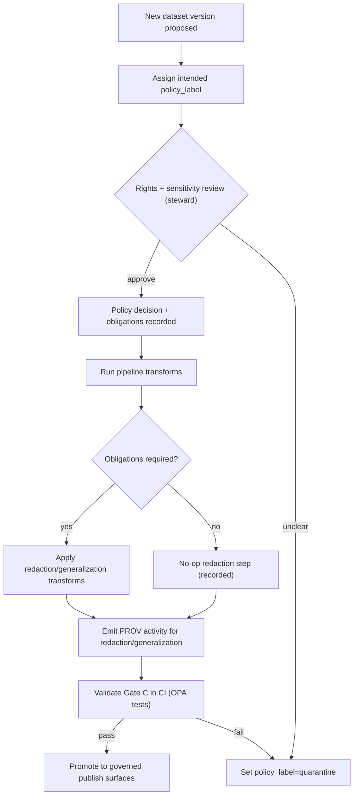

<!-- [KFM_META_BLOCK_V2]
doc_id: kfm://doc/3a2a5b3e-0c2d-4cb0-8f7c-2e2b1a0c9c4a
title: Data Classification
type: standard
version: v1
status: draft
owners: kfm-governance-stewards
created: 2026-03-04
updated: 2026-03-04
policy_label: public
related:
  - docs/governance/ROOT_GOVERNANCE.md
  - docs/governance/ETHICS.md
  - docs/governance/SOVEREIGNTY.md
  - policy/          # OPA/Rego bundle (repo-specific path)
  - contracts/       # schemas + profiles (repo-specific path)
tags: [kfm, governance, data-classification, policy-label, redaction]
notes:
  - Defines the policy_label vocabulary and the minimum rubric for classifying datasets/artifacts and derived outputs.
  - Establishes default-deny + obligation-based redaction/generalization rules for governed surfaces (API/UI/Focus Mode/Story Nodes).
[/KFM_META_BLOCK_V2] -->

<!--
IMPACT
Status: Draft (intended to become Canonical)
Owners: kfm-governance-stewards
Badges: TODO
  - 
  - 
  - 
Quick links:
  - #scope
  - #classification-model
  - #policy-label-controlled-vocabulary
  - #default-rules-fail-closed
  - #obligations-and-redaction-plans
  - #where-classification-must-appear
  - #workflow-and-ci-gates
  - #examples
-->

# Data Classification
Define how KFM classifies data and enforces access + redaction/generalization via `policy_label` and policy obligations.

> IMPORTANT: This document describes KFM’s **governance intent**. Where the upstream source material is explicitly marked **PROPOSED**, this document preserves that status and lists verification steps to make it **CONFIRMED**.

---

## Scope
This policy applies to:

- **Datasets** (and dataset versions) promoted through the data lifecycle.
- **Artifacts** (raw files, processed outputs, tiles, indexes, derived exports).
- **Governed surfaces**: API responses, UI layer rendering, Story Nodes, and Focus Mode outputs.

### Non-scope
- Legal determinations of copyright, privacy law compliance, or sovereignty agreements.
- Security classification of infrastructure secrets (handled by security policy).
- Clinical/medical adjudication (not a KFM domain assumption).

---

## Where it fits
KFM’s governance model uses policy-as-code and requires the **same semantics in CI and runtime**: CI policy tests must block merges; runtime policy checks must run before serving data; the UI only displays policy results and never decides them. **CONFIRMED intent** (system behavior goal).  

This document supports Promotion Contract **Gate C**: “Sensitivity classification and redaction plan” (policy label + obligations when needed). **CONFIRMED intent**.  

---

## Normative status map
KFM source materials frequently label requirements as **CONFIRMED** vs **PROPOSED**. This file tracks that.

| Area | Status | Notes / how to confirm |
|---|---|---|
| `policy_label` is the primary classification input | PROPOSED→CONFIRMED target | Confirm by ratifying this doc + policy bundle fixtures. |
| `policy_label` controlled vocabulary starter set | PROPOSED | Adopt as v1 and version in `data/registry/vocab/` (or equivalent). |
| Default rules (default deny; public_generalized derivatives; no 403/404 leakage; no precise coords unless allowed; redaction recorded in PROV) | PROPOSED | Confirm via policy fixtures + integration tests. |
| Promotion Gate C requires policy_label + obligations | CONFIRMED intent | Enforce via CI: OPA/Conftest + receipts. |
| Baseline roles (public/contributor/steward/operator/governance council) | PROPOSED | Confirm by CODEOWNERS + governance charter. |

---

## Definitions
- **policy_label**: Primary classification input applied to resources (datasets, dataset versions, artifacts, evidence bundles, layers). Policy evaluation uses it to decide allow/deny and attach obligations.
- **obligation**: A required handling step attached to an allow decision (e.g., “generalize geometry”, “remove attributes”, “show notice”).
- **redaction / generalization**: Transformations applied to produce a policy-compliant representation (must be recorded as a first-class step in provenance).
- **artifact.zone**: A lifecycle zone marker (`raw`, `work`, `processed`, `catalog`, `published`) used for placement, promotion rules, and enforcement.
- **restricted_sensitive_location**: A label used when precise geometry must not be exposed (e.g., protected archaeological site coordinates).

---

## Classification model
KFM’s classification model is:

1. **Assign a `policy_label`** to each dataset version (and to each served resource representation where needed).
2. **Evaluate policy** (OPA/Rego or equivalent) with `(user.role, action, resource.policy_label, context…)`.
3. **Return decision + obligations**.
4. **Apply obligations** (redaction/generalization, notices, rate limits, etc.) before a response is emitted.
5. **Record** policy decisions and transforms in receipts and provenance so the system is auditable and replayable.

### Policy-as-code enforcement points
Policy is enforced at multiple points:

- **CI**: schema validation + policy tests block merges.
- **Runtime API**: policy checks before serving data.
- **Evidence resolver**: policy checks before resolving evidence and rendering bundles.
- **UI**: displays policy badges and notices; UI does **not** decide policy.

---

## policy_label controlled vocabulary
This is the starter controlled vocabulary for KFM `policy_label`. Treat it as the minimum enumerated set for v1.

| policy_label | Meaning | Public UI allowed? | Typical handling obligations |
|---|---|---:|---|
| `public` | Safe to show publicly | ✅ Yes | None (but still requires citation + license surfaces). |
| `public_generalized` | Derived public version of sensitive data | ✅ Yes | `show_notice`, plus generalization artifacts + provenance. |
| `restricted` | Requires authorization; not public | ❌ No | Default deny to public; may allow to stewards/reviewers. |
| `restricted_sensitive_location` | Precise locations protected | ❌ No | Default deny; allow only explicit roles; publish generalized derivative only if approved. |
| `internal` | Visible only to operators/stewards | ❌ No | Treat as non-public; block public discovery. |
| `embargoed` | Time-limited restriction pending release | ❌ Until release | Time gate; requires explicit embargo end condition. |
| `quarantine` | Not promoted (validation or rights unresolved) | ❌ No | Block publication; fix rights/QA before promotion. |

> NOTE: If you need “aggregate-only” representations, encode them as `public_generalized` with an explicit generalization method and thresholds (see below).

---

## Default rules (fail-closed)
These defaults align to KFM’s posture. They should be enforced via policy fixtures and tests.

1. **Default deny** for `restricted_sensitive_location` and `restricted` datasets.
2. If any public representation is allowed, produce a separate **`public_generalized` dataset version** (do not “partially leak” the restricted version).
3. Never leak restricted metadata in **403/404** responses (error shapes must be policy-safe).
4. Do not embed precise coordinates in **Story Nodes** or **Focus Mode** outputs unless policy explicitly allows.
5. Treat redaction/generalization as a **first-class transform recorded in PROV**.

---

## Obligations and redaction plans

### Obligation types (starter)
Obligations are attached to policy decisions. They are *requirements*, not suggestions.

| obligation.type | Purpose | Where enforced | Evidence / audit output |
|---|---|---|---|
| `show_notice` | Inform user that data was generalized/redacted | UI | UI banner text; policy decision record. |
| `generalize_geometry` | Reduce spatial precision (e.g., grid, admin dissolve) | Pipeline + API | Generalization receipt + PROV activity. |
| `remove_attributes` | Drop/blank sensitive fields | Pipeline + API | Field-drop manifest + PROV. |
| `temporal_coarsen` | Reduce time precision | Pipeline + API | Coarsening receipt + PROV. |
| `rate_limit` | Prevent extraction at scale | API gateway | Rate-limit logs (policy-safe). |
| `no_export` | Block bulk export/download | API | Deny rule + audit_ref. |

> Minimum viable requirement: obligations must be **machine-checkable** and appear in run receipts and/or evidence bundles.

### Redaction plan (Gate C)
A “redaction plan” is required when policy_label implies a non-trivial obligation set (e.g., any restricted class, or `public_generalized` derivatives).

**Minimum redaction plan contents (PROPOSED):**
- Inputs: dataset_version_id + schema + fields that are sensitive.
- Geometry handling: method + parameters (e.g., cell size, admin dissolve unit).
- Temporal handling: method + granularity (day→month, etc.).
- Attribute handling: explicit allowlist/denylist and nulling rules.
- Output: list of derived artifacts produced, with digests.
- Verification: tests/thresholds proving obligations were applied (and do not leak).
- Provenance: PROV activity/agent identifiers; link to policy decision.

**UNKNOWN (needs confirmation):** repo-standard location for redaction profiles and their schema.
- Smallest verification step: define `contracts/redaction_profile.schema.json` + one canonical location (e.g., `data/registry/redaction/profiles.yaml`) and add CI validation.

### Geometry generalization methods (starter)
Use a controlled vocabulary for how geometry is generalized.

- `centroid_only`
- `grid_aggregation_<meters>`
- `random_offset_<meters>`
- `dissolve_to_admin_unit`
- `bounding_box_only`
- `none`

---

## Where classification must appear
KFM treats catalogs as contract surfaces; classification must be present in those contract surfaces so enforcement is deterministic.

### Minimum required placements (v1)
| Surface | Must include | Why |
|---|---|---|
| Dataset registry / onboarding spec | proposed `policy_label` intent | Review + predictable promotion. |
| DCAT dataset record | `kfm:policy_label` (plus license/rights) | Discovery + distribution governance. |
| STAC collection/item | policy label and policy-consistent geometry/bbox | Prevent geometry leaks. |
| PROV bundle | record redaction/generalization as transforms + policy decision refs | Auditable lineage. |
| EvidenceBundle (resolver output) | decision + policy_label + obligations | UI/Focus Mode can render safely. |
| Layer config | `policy_label` + dataset_version_id | UI can show badges/behavior without deciding. |

---

## Workflow and CI gates

### Dataset onboarding workflow (high level)
1. Contributor proposes dataset spec with intended `policy_label`.
2. Steward reviews: rights + sensitivity; approves `policy_label` and required obligations.
3. Pipeline run produces artifacts + catalogs + provenance.
4. CI validates:
   - schemas (DCAT/STAC/PROV)
   - policy fixtures and obligations honored
   - link integrity + evidence resolution
5. Only then can a dataset be promoted to governed publication surfaces.

### Promotion Contract: Gate C (sensitivity + redaction plan)
Gate C is satisfied when:
- A `policy_label` is assigned, and
- Obligations are attached and honored (generalize geometry / remove fields, etc.) when needed, and
- Policy tests demonstrate default-deny posture and validate that redaction obligations were applied.

> CI should fail closed when Gate C is not met.

---

## Roles and responsibilities (baseline)
Baseline roles (PROPOSED):
- **Public user**: reads public layers/stories; Focus Mode limited to public evidence.
- **Contributor**: proposes datasets/stories; drafts content; cannot publish.
- **Reviewer/Steward**: approves promotions and story publishing; owns policy labels and redaction rules.
- **Operator**: runs pipelines and manages deployments; cannot override policy gates.
- **Governance council / community stewards**: controls culturally sensitive materials; sets rules for restricted collections and public representations.

---

## Mermaid: Classification decision flow


---

## Examples

### Example 1: Sensitive archaeological sites
A state archaeology sites source should be treated as `restricted_sensitive_location` with precise coordinates protected; generalized derivatives may be published only if approved.

**Recommended handling pattern (PROPOSED):**
- Dataset version A: `restricted_sensitive_location` (precise geometry; access only to authorized roles).
- Dataset version B: `public_generalized` (grid aggregation or admin dissolve; notice required).

### Example 2: Rego policy skeleton (illustrative)
```rego
package kfm.authz

default allow = false

allow {
  input.user.role == "steward"
}

allow {
  input.user.role == "public"
  input.action == "read"
  input.resource.policy_label == "public"
}

# If dataset is public_generalized, record an obligation for a UI notice
obligations[o] {
  input.resource.policy_label == "public_generalized"
  o := {"type": "show_notice", "message": "Geometry generalized due to policy."}
}
```

### Example 3: Policy decision object (template)
```json
{
  "decision_id": "kfm://policy_decision/xyz",
  "policy_label": "restricted",
  "decision": "deny",
  "reason_codes": ["SENSITIVE_SITE", "RIGHTS_UNCLEAR"],
  "obligations": [
    {"type": "generalize_geometry", "min_cell_size_m": 5000},
    {"type": "remove_attributes", "fields": ["exact_location", "owner_name"]}
  ],
  "evaluated_at": "2026-02-20T12:00:00Z",
  "rule_id": "deny.restricted_dataset.default"
}
```

---

## Checklists

### Dataset onboarding (Contributor)
- [ ] Proposed `policy_label` included in dataset spec.
- [ ] Identify sensitive-location risk and any sensitive attributes.
- [ ] Provide draft redaction plan if non-public.
- [ ] Provide evidence references + rights metadata snapshot.

### Steward review (Steward)
- [ ] Confirm rights allow mirroring and/or define metadata-only mode (if applicable).
- [ ] Confirm `policy_label`.
- [ ] Approve obligation set and the redaction/generalization plan.
- [ ] Ensure policy fixtures/tests exist for the classification decision.

### Operator run + publish (Operator)
- [ ] Ensure Gate C checks pass in CI (OPA/Conftest).
- [ ] Ensure provenance includes redaction/generalization activity when required.
- [ ] Ensure UI surfaces show policy notices for `public_generalized`.

---

## FAQ

### What if we’re unsure?
Fail closed:
- Use `policy_label=quarantine`.
- Do not promote to public/governed surfaces until rights/sensitivity are resolved.

### Do we ever “partially show” restricted data?
Default: **no**. If a public view is needed, publish a separate `public_generalized` dataset version with explicit provenance and UI notice.

---

## Appendix: Implementation hooks (recommended)
- Version and validate the `policy_label` vocabulary (and generalization methods) as controlled vocabularies.
- Add policy fixtures + tests for each new `policy_label` rule and obligation type.
- Add “leakage tests” for Story Nodes and Focus Mode outputs (no precise coordinates unless allowed).
- Ensure error responses are policy-safe (no restricted leakage in 403/404).

---

_Back to top: [Data Classification](#data-classification)_
