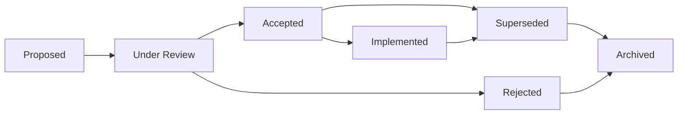
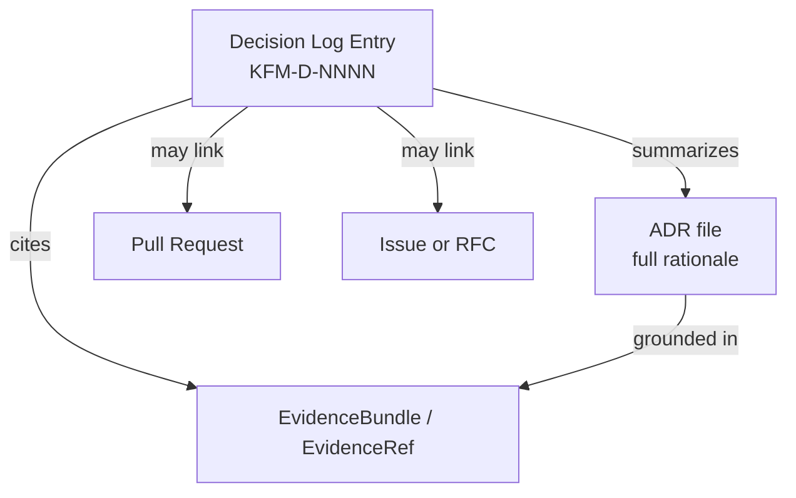

<!-- [KFM_META_BLOCK_V2]
doc_id: kfm://doc/decision-log
title: Decision Log
type: standard
version: v1
status: draft
owners: TODO (governance maintainers)
created: 2026-05-12
updated: 2026-05-12
policy_label: public
related: [docs/governance/CONTRIBUTING.md, docs/governance/ADR/, docs/architecture/README.md]
tags: [kfm, governance, decisions, adr]
notes: [Initial scaffold; registry rows are illustrative placeholders pending population from real prior decisions]
[/KFM_META_BLOCK_V2] -->

# Decision Log

> Chronological registry of significant decisions shaping the Kansas Frontier Matrix — architecture, governance, data, and process.


**Status:** Draft (PROPOSED) · **Owners:** TODO · **Last updated:** 2026-05-12

---

## Quick navigation

- [Purpose & scope](#purpose--scope)
- [How to read this log](#how-to-read-this-log)
- [Decision lifecycle](#decision-lifecycle)
- [Decision registry](#decision-registry)
- [Decision record template](#decision-record-template)
- [Status taxonomy](#status-taxonomy)
- [Relationship to ADRs and EvidenceBundles](#relationship-to-adrs-and-evidencebundles)
- [Adding a decision](#adding-a-decision)
- [Governance and review](#governance-and-review)
- [FAQ](#faq)
- [Related docs](#related-docs)
- [Appendix](#appendix)

---

## Purpose & scope

The Decision Log is the **single chronological source of significant decisions** taken across Kansas Frontier Matrix (KFM). It records what was decided, when, on what evidence, by whom, and what changed as a result. Routine implementation choices live in code, PR descriptions, or working notes — not here.

A decision belongs in this log when **any** of the following apply:

- It changes architecture, module boundaries, or the data pipeline (e.g., the semantics of `RAW → WORK/QUARANTINE → PROCESSED → CATALOG/TRIPLET → PUBLISHED`).
- It introduces, retires, or redefines an `EvidenceBundle`, `EvidenceRef`, or governance contract.
- It sets or revises a policy, standard, or external commitment.
- It locks in a vendor, format, schema, or interface that downstream work must respect.
- It resolves a previously open question that other docs reference.

> [!IMPORTANT]
> The Decision Log records *decisions*, not *discussion*. Rationale is summarized; long deliberation belongs in linked ADRs, issues, or PRs.

---

## How to read this log

Each entry has stable identity (`KFM-D-NNNN`) and a clear status. Entries are **append-only** — superseded decisions are not deleted; they are re-statused and linked forward.

- **Read the registry table** for an at-a-glance view of every decision.
- **Open a specific decision file** under `docs/governance/decisions/` *(PROPOSED path)* for full record detail.
- **Follow the lifecycle diagram** to understand legal status transitions.

> [!NOTE]
> The individual-decision file path `docs/governance/decisions/` is **PROPOSED**. Confirm against the actual repository layout before writing decision files there.

---

## Decision lifecycle

The lifecycle below is **PROPOSED** and aligned with KFM truth-label discipline. Adjust transitions to match any existing repo convention before publishing.



| Stage | Meaning |
|---|---|
| Proposed | A decision record exists; no consensus yet. |
| Under Review | Active review by owners; comments open. |
| Accepted | Decision endorsed; implementation may begin. |
| Implemented | Code, docs, or policy reflects the decision. |
| Rejected | Closed without acceptance; preserved for context. |
| Superseded | Replaced by a newer decision (linked forward). |
| Archived | No longer active; retained for the historical record. |

[⬆ Back to top](#decision-log)

---

## Decision registry

> [!NOTE]
> Rows below are **illustrative placeholders** demonstrating the record shape. They are not actual KFM decisions and must be replaced with real entries before this document is treated as authoritative.

| ID | Date | Title | Status | Owners | Linked ADR / EvidenceBundle |
|---|---|---|---|---|---|
| KFM-D-0001 | YYYY-MM-DD | *Adopt the `RAW → WORK/QUARANTINE → PROCESSED → CATALOG/TRIPLET → PUBLISHED` pipeline stages* | Accepted *(illustrative)* | TODO | TODO |
| KFM-D-0002 | YYYY-MM-DD | *Define `EvidenceBundle` and `EvidenceRef` as core governance primitives* | Accepted *(illustrative)* | TODO | TODO |
| KFM-D-0003 | YYYY-MM-DD | *Adopt KFM Meta Block v2 for standard docs* | Accepted *(illustrative)* | TODO | TODO |
| KFM-D-NNNN | YYYY-MM-DD | *Title of decision* | Proposed | TODO | TODO |

---

## Decision record template

Each decision lives in its own file. Use the template below verbatim. File naming convention is **PROPOSED**: `KFM-D-NNNN-short-slug.md`.

```markdown
<!-- [KFM_META_BLOCK_V2]
doc_id: kfm://decision/KFM-D-NNNN
title: <Short decision title>
type: standard
version: v1
status: proposed|under-review|accepted|rejected|implemented|superseded|archived
owners: <names or team>
created: YYYY-MM-DD
updated: YYYY-MM-DD
policy_label: public|restricted
related: [<linked ADRs, EvidenceBundles, issues, PRs>]
tags: [kfm, decision]
notes: []
[/KFM_META_BLOCK_V2] -->

# KFM-D-NNNN — <Short decision title>

> One-line summary of what was decided.

## Context
What problem or question prompted this decision. Cite the evidence considered.

## Decision
The decision, stated plainly. One paragraph. No deliberation here.

## Rationale
Why this decision over the alternatives. Reference evidence, not opinion.

## Alternatives considered
- **Option A** — summary and why it was not chosen.
- **Option B** — summary and why it was not chosen.

## Consequences
- **Immediate** — what changes now (code, docs, policy).
- **Downstream** — what other work this enables, blocks, or forces.
- **Reversibility** — how hard this is to undo.

## Evidence
- Linked `EvidenceBundle` / `EvidenceRef` identifiers.
- ADRs, RFCs, issues, PRs, tests.

## Status history
| Date | Status | Note |
|---|---|---|
| YYYY-MM-DD | Proposed | Initial entry |

## Supersession
- Supersedes: `KFM-D-NNNN` (if any).
- Superseded by: `KFM-D-NNNN` (if any).
```

[⬆ Back to top](#decision-log)

---

## Status taxonomy

The decision-status field maps cleanly to the KFM truth-label vocabulary used elsewhere in the project.

| Decision status | Truth-label analog | Meaning in practice |
|---|---|---|
| Proposed | PROPOSED | Drafted; not yet endorsed. |
| Under Review | NEEDS VERIFICATION | Actively being evaluated. |
| Accepted | CONFIRMED *(of the decision itself)* | Endorsed; binding on downstream work. |
| Implemented | CONFIRMED *(in repo)* | Reflected in code, docs, or policy. |
| Rejected | n/a | Closed; preserved for context. |
| Superseded | n/a | Replaced by a newer decision. |
| Archived | n/a | Historical record only. |

> [!TIP]
> A decision can be **Accepted** without being **Implemented**. Keep the two statuses separate so the gap between intent and reality stays visible.

---

## Relationship to ADRs and EvidenceBundles

The Decision Log is a **registry**, not a replacement for ADRs or evidence artifacts. The relationships below are **PROPOSED** and should be confirmed against the repository's existing ADR and evidence conventions.



| Artifact | Primary role | Lives where *(PROPOSED)* |
|---|---|---|
| Decision Log entry | Short, citable record of a decision | `docs/governance/decisions/` |
| ADR | Full rationale, alternatives, consequences | `docs/governance/ADR/` |
| `EvidenceBundle` / `EvidenceRef` | Verifiable evidence grounding the decision | Per KFM evidence conventions |
| PR / Issue | Discussion thread and implementation work | GitHub |

[⬆ Back to top](#decision-log)

---

## Adding a decision

The workflow below is **PROPOSED**. Confirm against `CONTRIBUTING.md` and any existing governance policy before adopting.

1. Open an issue or RFC describing the question.
2. Draft a decision record from the [template](#decision-record-template) at `docs/governance/decisions/KFM-D-NNNN-short-slug.md` *(PROPOSED path)*.
3. Set status to **Proposed**; link the supporting `EvidenceBundle` / `EvidenceRef`.
4. Open a PR; request review from the listed owners.
5. On approval, update status to **Accepted** and add the entry to the [registry table](#decision-registry).
6. When implementation lands, update status to **Implemented** and link the merge commit or release.
7. If later superseded, flip status to **Superseded** and link forward to the replacing decision.

> [!WARNING]
> Do not delete or rewrite the substance of accepted decisions. Use **Superseded** with a forward link. The historical record is the point of the log.

---

## Governance and review

- **Cadence** — *PROPOSED:* quarterly review of open and recently accepted decisions.
- **Quorum** — *PROPOSED:* defined by `CONTRIBUTING.md` / governance policy.
- **Conflicts** — when a new decision would contradict an accepted one, the new entry must explicitly supersede the older one or be rejected. Silent contradictions are not permitted.
- **External standards** — when a decision adopts or modifies alignment with an external standard (e.g., STAC, JSON Schema, W3C PROV, OGC, FAIR/CARE), cite the standard **and its version** in the decision record. Standards evolve; pinning the version protects future readers.

[⬆ Back to top](#decision-log)

---

## FAQ

<details>
<summary><b>Is every PR a decision?</b></summary>

No. Most PRs implement existing decisions or make routine changes. A decision is logged when it constrains future work, locks in an interface, or sets policy.
</details>

<details>
<summary><b>What if I disagree with an accepted decision?</b></summary>

Open a new decision record proposing supersession. Cite the evidence that changed. Do not edit the original entry's substance — append a status update on the original and link forward once the new decision is accepted.
</details>

<details>
<summary><b>Do experiments need a decision record?</b></summary>

Only if the experiment's outcome will bind future work. Pure exploration without commitment does not.
</details>

<details>
<summary><b>How does this differ from a CHANGELOG?</b></summary>

A CHANGELOG records *what* shipped. The Decision Log records *why* something was chosen — and is often written before implementation. Many decisions never produce a single CHANGELOG entry; many CHANGELOG entries trace back to a single decision.
</details>

---

## Related docs

- `docs/governance/CONTRIBUTING.md` — *PROPOSED link; verify path*
- `docs/governance/ADR/` — *PROPOSED link; verify directory exists*
- `docs/governance/EVIDENCE.md` — *PROPOSED link; verify path*
- `docs/architecture/README.md` — *PROPOSED link; verify path*

> [!NOTE]
> All related-docs paths above are **PROPOSED** and must be verified against the repository before this file is published. Replace placeholders with confirmed paths or remove entries that do not exist.

---

## Appendix

<details>
<summary><b>Why this log exists (design notes)</b></summary>

The Decision Log addresses three recurring failure modes in long-lived projects:

1. **Lost rationale** — implementations outlive the reasoning behind them.
2. **Drift** — small changes accumulate until the project no longer resembles its stated architecture.
3. **Re-litigation** — settled questions are re-opened because no one remembers the previous answer.

A lightweight, append-only registry with stable IDs and explicit supersession links resolves all three.
</details>

<details>
<summary><b>Glossary (KFM-specific terms used here)</b></summary>

- **`EvidenceBundle`** — KFM governance primitive packaging the evidence supporting a claim or decision.
- **`EvidenceRef`** — pointer to evidence used in lieu of inlining the full bundle.
- **`RAW → WORK/QUARANTINE → PROCESSED → CATALOG/TRIPLET → PUBLISHED`** — the KFM data pipeline stage progression.
- **KFM Meta Block v2** — the standard front-matter HTML comment for KFM standard docs.

Definitions reflect terminology preserved from KFM doctrine. Verify usage against the project's authoritative glossary.
</details>

<details>
<summary><b>Example: an illustrative filled decision</b></summary>

```text
KFM-D-0001 — Adopt RAW → WORK/QUARANTINE → PROCESSED → CATALOG/TRIPLET → PUBLISHED stages

Context:      Pipeline stage names were inconsistent across early modules.
Decision:     Standardize on the five-stage progression above.
Rationale:    Reflects existing data flow; matches evidence-grounding requirements.
Consequences: All ingestion modules must label outputs by stage.
Status:       Accepted (illustrative — not a real recorded decision).
```

This example is **illustrative only** and is not a recorded KFM decision.
</details>

---

**Last updated:** 2026-05-12 · **Status:** Draft (PROPOSED) · [⬆ Back to top](#decision-log)
