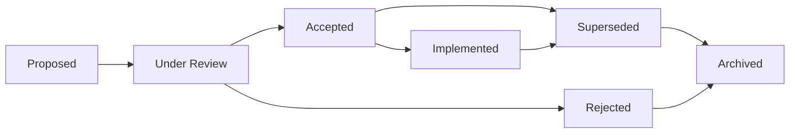
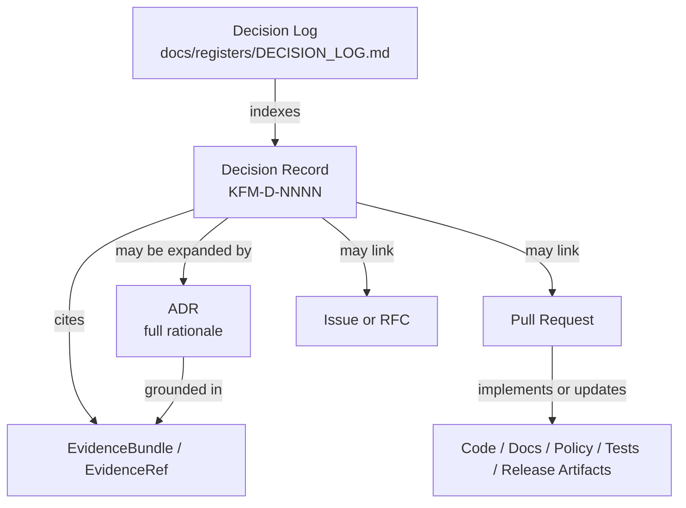

<!-- [KFM_META_BLOCK_V2]
doc_id: kfm://doc/decision-log
title: Decision Log
type: standard
version: v1.1
status: draft
owners: OWNER_TBD (governance/docs steward; verify CODEOWNERS)
created: 2026-05-12
updated: 2026-05-15
policy_label: public
related: [docs/registers/DECISION_LOG.md, docs/registers/decisions/, docs/adr/, docs/governance/, docs/doctrine/directory-rules.md, docs/architecture/contract-schema-policy-split.md]
tags: [kfm, governance, decisions, adr, registers]
notes: [Revised for Directory Rules alignment; prior docs/governance/decisions path retained as CONFLICTED lineage; registry rows remain placeholders until real decisions are added]
[/KFM_META_BLOCK_V2] -->

# Decision Log

> Chronological registry of significant Kansas Frontier Matrix decisions — what was decided, why, on what evidence, by whom, and how later work can inspect, supersede, or roll back the decision.


**Status:** Draft (PROPOSED) · **Owner:** OWNER_TBD · **Path candidate:** `docs/registers/DECISION_LOG.md` *(PROPOSED)* · **Last updated:** 2026-05-15

> [!IMPORTANT]
> **Evidence boundary:** This document states KFM decision-governance doctrine and a proposed register shape. Current repository implementation depth remains **UNKNOWN** unless a mounted repo, CODEOWNERS, adjacent docs, tests, workflows, generated artifacts, or runtime evidence are inspected. Paths in this file are **PROPOSED** until verified.

---

## Quick navigation

- [Purpose & scope](#purpose--scope)
- [Repo fit and evidence boundary](#repo-fit-and-evidence-boundary)
- [How to read this log](#how-to-read-this-log)
- [Decision lifecycle](#decision-lifecycle)
- [Decision registry](#decision-registry)
- [Decision record template](#decision-record-template)
- [Status taxonomy](#status-taxonomy)
- [Relationship to ADRs and EvidenceBundles](#relationship-to-adrs-and-evidencebundles)
- [Adding a decision](#adding-a-decision)
- [Governance and review](#governance-and-review)
- [Verification checklist](#verification-checklist)
- [Rollback](#rollback)
- [FAQ](#faq)
- [Related docs](#related-docs)
- [Appendix](#appendix)

---

## Purpose & scope

The Decision Log is the **intended chronological register of significant KFM decisions**. It records what was decided, when, on what evidence, by whom, and what changed as a result. Routine implementation choices live in code, PR descriptions, CHANGELOG entries, or working notes — not here.

A decision belongs in this log when **any** of the following apply:

- It changes architecture, module boundaries, responsibility roots, or the data lifecycle, including `RAW → WORK/QUARANTINE → PROCESSED → CATALOG/TRIPLET → PUBLISHED`.
- It introduces, retires, or redefines an `EvidenceBundle`, `EvidenceRef`, `SourceDescriptor`, `RunReceipt`, `PromotionDecision`, `ReleaseManifest`, `RollbackCard`, or other governance contract.
- It sets or revises a policy, review burden, source-rights posture, publication rule, or external-standard commitment.
- It locks in a vendor, runtime, source family, file format, schema home, API surface, map-delivery format, or interface downstream work must respect.
- It resolves a previously open question that other docs, contracts, schemas, policies, tests, or release gates reference.

> [!IMPORTANT]
> The Decision Log records **decisions**, not extended discussion. Rationale is summarized; long deliberation belongs in linked ADRs, issues, RFCs, evidence bundles, or PRs.

The Decision Log is not:

- a substitute for ADRs;
- a substitute for `EvidenceBundle` / `EvidenceRef` resolution;
- an implementation proof;
- a release manifest;
- a place to hide unresolved path, policy, rights, or sensitivity conflicts.

[⬆ Back to top](#decision-log)

---

## Repo fit and evidence boundary

This file is a human-facing governance register. Under the current Directory Rules doctrine, the best-fit path is:

```text
docs/registers/DECISION_LOG.md
```

The proposed location is responsibility-rooted because `docs/` explains human-facing governance, and `docs/registers/` is the register surface. It should not create a new root folder and should not live under a domain lane.

| Item | Status | Proposed handling | Verification needed |
|---|---|---|---|
| This register | PROPOSED | `docs/registers/DECISION_LOG.md` | Confirm current repo conventions and adjacent register names. |
| Individual short decision records | PROPOSED / NEEDS VERIFICATION | `docs/registers/decisions/KFM-D-NNNN-short-slug.md` | Confirm whether the repo wants separate short records or registry-only rows. |
| Architecture Decision Records | PROPOSED | `docs/adr/ADR-NNNN-short-slug.md` | Confirm ADR naming and numbering convention. |
| Governance roles and review policy | PROPOSED | `docs/governance/` | Confirm policy docs and owner files. |
| Prior path `docs/governance/decisions/` | CONFLICTED / LINEAGE | Do not create by default. Retain only as a prior-doc path until repo evidence or ADR confirms it. | Check existing repo tree and open a drift entry if this path already exists. |

> [!WARNING]
> If the mounted repository already contains a conflicting decision-log home, do not silently normalize it. Record the conflict in the drift or verification backlog, then resolve through an ADR or migration note.

[⬆ Back to top](#decision-log)

---

## How to read this log

Each entry has stable identity (`KFM-D-NNNN`) and a clear status. Entries are **append-only**: superseded decisions are not deleted; they are re-statused and linked forward.

- **Read the registry table** for an at-a-glance view of decisions and their current status.
- **Open the linked decision record or ADR** for full context when the registry row is not enough.
- **Inspect the evidence references** before treating a decision as support for a downstream claim.
- **Follow supersession links** before relying on an old decision.

> [!NOTE]
> A decision can be accepted before it is implemented. Treat **Accepted** as governance intent and **Implemented** as implementation evidence only when linked repo evidence supports it.

[⬆ Back to top](#decision-log)

---

## Decision lifecycle

The lifecycle below is **PROPOSED** and aligned with KFM truth-label discipline. Adjust transitions to match existing repository convention before publishing.



| Stage | Meaning | Required evidence before use |
|---|---|---|
| Proposed | A decision record exists; no consensus yet. | Draft record, owner placeholder, evidence plan. |
| Under Review | Active review by owners; comments open. | Reviewer list, open questions, evidence references. |
| Accepted | Decision endorsed; downstream work may depend on it. | Approval record, ADR or rationale, evidence references. |
| Implemented | Code, docs, policy, schema, contract, or release artifacts reflect the decision. | PR, commit, test, workflow, release, or emitted artifact evidence. |
| Rejected | Closed without acceptance; preserved for context. | Rejection note and reason. |
| Superseded | Replaced by a newer decision. | Forward link to replacing decision. |
| Archived | No longer active; retained for historical record. | Archive note and successor if any. |

[⬆ Back to top](#decision-log)

---

## Decision registry

> [!NOTE]
> No real decision rows are confirmed in this attached baseline. The row below is a **shape example only**. Replace it with real entries after owners, IDs, evidence references, and paths are verified.

| ID | Date | Title | Status | Owner | Evidence / ADR / PR | Supersession |
|---|---|---|---|---|---|---|
| KFM-D-NNNN | YYYY-MM-DD | `<decision title>` | Proposed | OWNER_TBD | EvidenceRef / ADR / PR: NEEDS VERIFICATION | Supersedes: none; Superseded by: none |

### Registry row rules

- IDs are stable and must not be reused.
- Rows are chronological by decision date, newest row placement to be confirmed by repo convention.
- **Accepted** rows must link evidence, approval, and reviewer context.
- **Implemented** rows must link implementation proof; do not infer implementation from an accepted decision.
- **Superseded** rows stay visible and link forward.
- Illustrative rows must be labeled illustrative and must not use real-looking accepted status.

[⬆ Back to top](#decision-log)

---

## Decision record template

Each substantial decision should have either a linked ADR or a decision record. File placement is **PROPOSED** until verified:

- Short decision record: `docs/registers/decisions/KFM-D-NNNN-short-slug.md`
- Full ADR: `docs/adr/ADR-NNNN-short-slug.md`

Use the template below for a short decision record. Use the repo's ADR template when the decision needs full alternatives, consequences, and architectural rationale.

```markdown
<!-- [KFM_META_BLOCK_V2]
doc_id: kfm://decision/KFM-D-NNNN
title: <Short decision title>
type: standard
version: v1
status: proposed|under-review|accepted|rejected|implemented|superseded|archived
owners: OWNER_TBD (<team or steward; verify CODEOWNERS>)
created: YYYY-MM-DD
updated: YYYY-MM-DD
policy_label: public|restricted
related: [<linked ADRs, EvidenceBundles, issues, PRs>]
tags: [kfm, decision]
notes: [<short notes; include PROPOSED/UNKNOWN where relevant>]
[/KFM_META_BLOCK_V2] -->

# KFM-D-NNNN — <Short decision title>

> One-line summary of what was decided.

## Context

What problem or question prompted this decision. Cite the evidence considered. State whether repo implementation depth is CONFIRMED, PROPOSED, UNKNOWN, or NEEDS VERIFICATION.

## Decision

The decision, stated plainly. Keep it short. Do not include long deliberation here.

## Rationale

Why this decision was chosen over alternatives. Reference evidence, source role, policy posture, review state, or implementation constraints.

## Alternatives considered

- **Option A** — summary and why it was not chosen.
- **Option B** — summary and why it was not chosen.

## Consequences

- **Immediate** — what changes now: docs, contract, schema, policy, tests, source registry, release, or UI/API behavior.
- **Downstream** — what this enables, blocks, or forces.
- **Reversibility** — how hard this is to undo and what rollback target exists.

## Evidence

- `EvidenceBundle` / `EvidenceRef`: `<id or NEEDS VERIFICATION>`
- ADR / RFC / issue / PR: `<id or NEEDS VERIFICATION>`
- Tests / validators / release artifacts: `<id or UNKNOWN>`

## Status history

| Date | Status | Note |
|---|---|---|
| YYYY-MM-DD | Proposed | Initial entry |

## Supersession

- Supersedes: `KFM-D-NNNN` or `none`.
- Superseded by: `KFM-D-NNNN` or `none`.
```

[⬆ Back to top](#decision-log)

---

## Status taxonomy

Decision status maps to KFM truth posture, but it does not replace evidence. Use the narrowest truthful label.

| Decision status | Truth-label analog | Meaning in practice |
|---|---|---|
| Proposed | PROPOSED | Drafted; not yet endorsed. |
| Under Review | NEEDS VERIFICATION | Actively being evaluated. |
| Accepted | CONFIRMED *(of the decision itself)* | Endorsed; binding as governance intent. |
| Implemented | CONFIRMED *(in repo or artifact evidence)* | Reflected in inspected code, docs, policy, tests, workflow, release, or emitted artifacts. |
| Rejected | n/a | Closed; preserved for context. |
| Superseded | n/a | Replaced by a newer decision. |
| Archived | n/a | Historical record only. |

> [!TIP]
> A decision can be **Accepted** without being **Implemented**. Keep the two statuses separate so the gap between intent and reality stays visible.

[⬆ Back to top](#decision-log)

---

## Relationship to ADRs and EvidenceBundles

The Decision Log is a **registry**, not a replacement for ADRs or evidence artifacts. The relationships below are **PROPOSED** and should be confirmed against the repository's ADR, register, and evidence conventions.



| Artifact | Primary role | Lives where *(PROPOSED)* | Notes |
|---|---|---|---|
| Decision Log | Chronological register | `docs/registers/DECISION_LOG.md` | Human-facing register; not implementation proof. |
| Decision record | Short, citable record of one decision | `docs/registers/decisions/` | Use only if repo convention supports separate records. |
| ADR | Full rationale, alternatives, consequences | `docs/adr/` | Required when architecture, schema home, roots, lifecycle, or policy-significant boundaries change. |
| `EvidenceBundle` / `EvidenceRef` | Verifiable evidence grounding the decision | Per KFM evidence conventions | Evidence outranks generated language and summaries. |
| PR / Issue / RFC | Discussion, review, implementation work | GitHub or repo-native tracker | Not a substitute for evidence. |
| Release / rollback artifact | Publication state, correction, rollback | `release/` and lifecycle artifacts | Required when decision affects publication state. |

[⬆ Back to top](#decision-log)

---

## Adding a decision

The workflow below is **PROPOSED**. Confirm against `CONTRIBUTING.md`, CODEOWNERS, ADR conventions, and governance policy before adopting.

1. Open an issue or RFC describing the question, affected roots, and decision scope.
2. Check whether the decision requires an ADR. ADR is required for canonical root changes, schema-home changes, lifecycle changes, new parallel authority homes, or invariant-bending changes.
3. Assign the next unused `KFM-D-NNNN` identifier. Do not reuse IDs.
4. Draft a decision record from the [template](#decision-record-template) or link a full ADR.
5. Add evidence references. If evidence is not ready, keep status **Proposed** or **Under Review**.
6. Open a PR and request review from owners and affected subsystem stewards.
7. Add or update the [registry table](#decision-registry) only with truthful status.
8. On approval, update status to **Accepted** and record reviewer / approval evidence.
9. When implementation lands, update status to **Implemented** only after linking the implementation proof.
10. If later replaced, mark the old decision **Superseded** and link forward to the replacing decision.

> [!WARNING]
> Do not delete or rewrite the substance of accepted decisions. Use **Superseded** with a forward link. The historical record is the point of the log.

[⬆ Back to top](#decision-log)

---

## Governance and review

- **Cadence** — PROPOSED: quarterly review of open, under-review, accepted-but-unimplemented, and recently superseded decisions.
- **Quorum** — PROPOSED: defined by `CONTRIBUTING.md`, CODEOWNERS, or governance policy.
- **Conflicts** — when a new decision contradicts an accepted one, the new entry must explicitly supersede the older one or be rejected. Silent contradictions are not permitted.
- **Path conflicts** — when a proposed path conflicts with Directory Rules or mounted repo evidence, mark it `CONFLICTED / NEEDS VERIFICATION` and record a drift or verification item.
- **External standards** — when a decision adopts or modifies alignment with an external standard (for example STAC, JSON Schema, W3C PROV, OGC, FAIR/CARE), cite the standard **and version**. Standards evolve; pinning the version protects future readers.
- **Sensitive or rights-bearing decisions** — require source role, rights, sensitivity, steward, review, release, correction, and rollback posture appropriate to significance.

[⬆ Back to top](#decision-log)

---

## Verification checklist

Before publishing or merging this Decision Log, verify:

- [ ] Target path: confirm `docs/registers/DECISION_LOG.md` or record the accepted alternative.
- [ ] Owner: replace `OWNER_TBD` with a confirmed steward or team.
- [ ] CODEOWNERS: confirm review responsibility for decision-log and ADR changes.
- [ ] Adjacent docs: confirm `docs/registers/`, `docs/adr/`, `docs/governance/`, and `docs/doctrine/` conventions.
- [ ] Previous path: determine whether `docs/governance/decisions/` exists; if it does, open a drift/migration note rather than duplicating authority.
- [ ] ID policy: confirm ID allocation, numbering, and whether IDs are global or scoped.
- [ ] Evidence policy: confirm required `EvidenceBundle` / `EvidenceRef` fields for accepted decisions.
- [ ] ADR policy: confirm when a decision must be an ADR rather than a short record.
- [ ] Registry rows: remove illustrative rows or label them as examples before treating the document as authoritative.
- [ ] Relative links: verify all related-doc paths from the final file location.
- [ ] Supersession: verify every superseded row links forward and every replacing decision links back.
- [ ] No implementation overclaim: accepted decisions are not called implemented without inspected proof.

[⬆ Back to top](#decision-log)

---

## Rollback

Rollback is required if this Decision Log:

- creates a path authority conflict;
- treats illustrative rows as real decisions;
- removes accepted-decision history;
- breaks supersession links without replacement;
- upgrades implementation status without evidence;
- weakens evidence, policy, review, publication, correction, or rollback controls.

Rollback target: the previous committed revision of this file. If the file is not yet committed, use the original attached baseline dated `2026-05-12` as the rollback reference.

[⬆ Back to top](#decision-log)

---

## FAQ

<details>
<summary><b>Is every PR a decision?</b></summary>

No. Most PRs implement existing decisions or make routine changes. A decision is logged when it constrains future work, locks in an interface, changes responsibility boundaries, sets policy, or creates a commitment downstream work must respect.
</details>

<details>
<summary><b>What if I disagree with an accepted decision?</b></summary>

Open a new decision record proposing supersession. Cite the evidence that changed. Do not edit the original entry's substance — append a status update on the original and link forward once the new decision is accepted.
</details>

<details>
<summary><b>Do experiments need a decision record?</b></summary>

Only if the experiment's outcome will bind future work. Pure exploration without commitment does not. If an experiment touches sensitive data, rights, public publication, source authority, or policy gates, record its review path even if it never becomes an accepted decision.
</details>

<details>
<summary><b>How does this differ from a CHANGELOG?</b></summary>

A CHANGELOG records *what* shipped. The Decision Log records *why* something was chosen — and is often written before implementation. Many decisions never produce a single CHANGELOG entry; many CHANGELOG entries trace back to a single decision.
</details>

<details>
<summary><b>Does an ADR replace a Decision Log entry?</b></summary>

No. The ADR carries full rationale. The Decision Log indexes the decision chronologically and keeps status, supersession, implementation evidence, and rollback visibility in one place.
</details>

[⬆ Back to top](#decision-log)

---

## Related docs

All links below are **PROPOSED** until verified from the final file location.

- `CONTRIBUTING.md` — root contribution and PR review rules; verify path.
- `CODEOWNERS` or `.github/CODEOWNERS` — reviewer ownership; verify location.
- `docs/doctrine/directory-rules.md` — placement authority; verify path.
- `docs/doctrine/truth-posture.md` — truth labels and evidence posture; verify path.
- `docs/doctrine/trust-membrane.md` — trust-boundary doctrine; verify path.
- `docs/doctrine/lifecycle-law.md` — lifecycle invariant; verify path.
- `docs/adr/` — ADR home; verify directory and naming convention.
- `docs/governance/` — roles, review burden, separation of duties; verify contents.
- `docs/registers/DRIFT_REGISTER.md` — drift capture; verify path.
- `docs/registers/VERIFICATION_BACKLOG.md` — unresolved verification work; verify path.
- `docs/architecture/contract-schema-policy-split.md` — responsibility split; verify path.

> [!NOTE]
> Replace proposed links with confirmed relative links after repository inspection. Remove links that do not exist or create them through the appropriate governed change.

[⬆ Back to top](#decision-log)

---

## Appendix

<details>
<summary><b>Why this log exists (design notes)</b></summary>

The Decision Log addresses three recurring failure modes in long-lived projects:

1. **Lost rationale** — implementations outlive the reasoning behind them.
2. **Drift** — small changes accumulate until the project no longer resembles its stated architecture.
3. **Re-litigation** — settled questions are re-opened because no one remembers the previous answer.

A lightweight, append-only registry with stable IDs, evidence links, status history, and explicit supersession links resolves all three.
</details>

<details>
<summary><b>Glossary (KFM-specific terms used here)</b></summary>

- **`EvidenceBundle`** — KFM governance primitive packaging the evidence supporting a claim or decision.
- **`EvidenceRef`** — pointer to evidence used in lieu of inlining the full bundle.
- **`SourceDescriptor`** — source identity, role, rights, cadence, sensitivity, and limits.
- **`RunReceipt`** — receipt that pins an intake, transform, validation, or release-adjacent run.
- **`PromotionDecision`** — governed promotion state decision; publication is not a file move.
- **`ReleaseManifest`** — manifest describing released artifacts and rollback/correction references.
- **`RollbackCard`** — rollback target and procedure for reversing a release or decision impact.
- **`RAW → WORK/QUARANTINE → PROCESSED → CATALOG/TRIPLET → PUBLISHED`** — KFM data lifecycle progression.
- **KFM Meta Block v2** — standard HTML-comment metadata block for KFM standard docs.

Definitions reflect terminology preserved from KFM doctrine. Verify usage against the authoritative glossary when available.
</details>

<details>
<summary><b>Example: illustrative decision row and record</b></summary>

```text
KFM-D-NNNN — Adopt a decision-log path under docs/registers

Context:      Directory placement must encode responsibility and avoid parallel authority.
Decision:     Place the Decision Log under docs/registers/ after repo verification.
Rationale:    The file is a human-facing governance register, not a domain doc or implementation artifact.
Consequences: Prior docs/governance/decisions path becomes lineage unless accepted by ADR or repo convention.
Status:       Proposed (illustrative only — not a recorded KFM decision).
```

This example is **illustrative only** and is not a recorded KFM decision.
</details>

---

**Last updated:** 2026-05-15 · **Status:** Draft (PROPOSED) · **Path:** `docs/registers/DECISION_LOG.md` *(PROPOSED)* · [⬆ Back to top](#decision-log)
