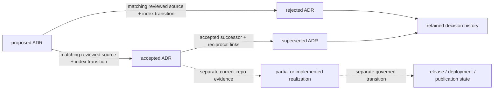
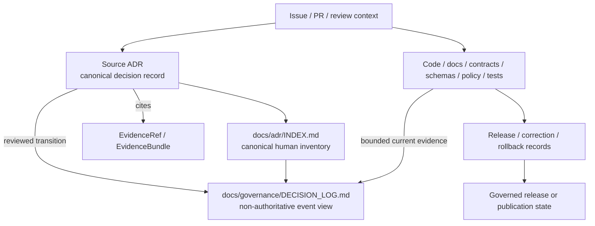

<!-- [KFM_META_BLOCK_V2]
doc_id: kfm://doc/decision-log
title: Decision Log
type: standard
version: v2.0
status: draft; repository-grounded
owners:
  - "@bartytime4life"
owner_status: "Verified CODEOWNERS review route only; no independent stewardship assignment, approval, release authority, or publication authority is implied."
created: 2026-05-12
updated: 2026-08-23
policy_label: public
owning_root: docs/
current_path: docs/governance/DECISION_LOG.md
responsibility: "Provide a human-facing, non-duplicating log of reviewed KFM decision-state transitions, their bounded effects, and the separation between decision acceptance, implementation evidence, release, and publication."
truth_posture: "CONFIRMED repository evidence / source-ADR status / UNKNOWN operational authority; cite-or-abstain"
evidence_snapshot:
  repository: bartytime4life/Kansas-Frontier-Matrix
  base_ref: main
  base_commit: 1362b9c4d8a5e0575ac72f0bef2848fe4b074daa
  initial_authoring_base_commit: 0d2c9db88861be1ba2c32b60daea7bab3a5d4ab9
  target_prior_blob: 4e6394ccbee782b68ed1ed4c97ee017d942b4f7d
  governance_readme_blob: 500f8bcad3a384160a561f1460617f0a13d42fcc
  directory_rules_blob: fd49a0b83e55cef52c1124281f093e263526898d
  codeowners_blob: dd2a84aa514d8ecd9208bc347f90f9a2ed37dd61
  maplibre_package_manifest_blob: c7e8e57445fcca8f8a7316b54043da0ea43968a6
canonical_decision_inventory: docs/adr/INDEX.md
related:
  - docs/governance/README.md
  - docs/adr/README.md
  - docs/adr/INDEX.md
  - docs/adr/ADR-template.md
  - docs/adr/ADR-0006-maplibre-boundary--only-maplibreadapter-imports-maplibre.md
  - "docs/adr/ADR-0007 — MapLibre GL JS Is the Sole Browser-Side Renderer.md"
  - docs/adr/ADR-0029-adopt-directory-governance-standard-v2.md
  - docs/registers/ADR_INDEX.md
  - docs/registers/DRIFT_REGISTER.md
  - docs/registers/VERIFICATION_BACKLOG.md
  - docs/doctrine/directory-rules.md
  - contracts/governance/implementation_decision_record.md
  - packages/maplibre/package.json
  - packages/maplibre/src/map-runtime-port.ts
  - packages/maplibre/src/null-map-runtime.ts
  - .github/CODEOWNERS
  - .github/workflows/docs-control-plane.yml
tags: [kfm, governance, decisions, adr, evidence, implementation, supersession, rollback]
notes:
  - "The canonical ADR source records and docs/adr/INDEX.md own decision identity and status. This document summarizes reviewed transitions without maintaining a second full ADR inventory."
  - "The prior proposed move to docs/registers/DECISION_LOG.md and the illustrative KFM-D-NNNN identity scheme are retired as stale planning prose; no file move, rename, or new authority home is created."
  - "Accepted, implemented, released, deployed, and published remain separate states."
  - "This documentation-only update creates no source, policy, review, release, deployment, promotion, or publication effect."
[/KFM_META_BLOCK_V2] -->

<a id="top"></a>

# Decision Log

> **Human-facing decision-transition log.** This document records reviewed KFM decision-state changes and their bounded consequences while routing authoritative identity and status to the source ADRs and the canonical [`docs/adr/INDEX.md`](../adr/INDEX.md).

[](#repo-fit-and-evidence-boundary)
[](../adr/INDEX.md)
[](#decision-registry)
[](#rollback)

> [!IMPORTANT]
> **This log cannot accept, reject, or supersede a decision.** A decision-state transition is authoritative only when the source ADR and the canonical ADR index carry matching reviewed status. This file is a readable event view and maintenance guide, not a second decision registry.

> [!WARNING]
> **Accepted is not implemented, and implemented is not released or published.** A source ADR records governance intent. Current code, contracts, schemas, policy, tests, workflows, and generated artifacts provide bounded implementation evidence. Release and publication require their own state-bearing records and gates.

| Field | Current bounded value |
|---|---|
| Tracked path | `docs/governance/DECISION_LOG.md` — same-path update |
| Placement authority | Accepted [`ADR-0029`](../adr/ADR-0029-adopt-directory-governance-standard-v2.md), adopted [Directory Rules](../doctrine/directory-rules.md), and the repository-present governance lane |
| Canonical ADR inventory | [`docs/adr/INDEX.md`](../adr/INDEX.md) |
| Snapshot at `main@1362b9c…` | 36 numbered ADRs: 3 accepted, 33 proposed; 12 unassigned scaffolds |
| Accepted decisions summarized here | ADR-0006, ADR-0007, ADR-0029 |
| Verified GitHub review route | `@bartytime4life` through [CODEOWNERS](../../.github/CODEOWNERS); routing is not approval |
| Runtime / release / deployment / publication effect | None |

---

## Contents

- [Purpose & scope](#purpose--scope)
- [Repo fit and evidence boundary](#repo-fit-and-evidence-boundary)
- [How to read this log](#how-to-read-this-log)
- [Decision lifecycle](#decision-lifecycle)
- [Decision registry](#decision-registry)
- [Decision record template](#decision-record-template)
- [Status taxonomy](#status-taxonomy)
- [Relationship to ADRs and EvidenceBundles](#relationship-to-adrs-and-evidencebundles)
- [Adding a decision](#adding-a-decision)
- [Governance and review](#governance-and-review)
- [Verification checklist](#verification-checklist)
- [Rollback](#rollback)
- [FAQ](#faq)
- [Related docs](#related-docs)
- [Appendix](#appendix)

---

## Purpose & scope

The Decision Log gives maintainers one place to answer four questions without copying the canonical ADR inventory:

1. **Which reviewed decision-state transitions have occurred?**
2. **What did each transition authorize—and what did it explicitly leave unchanged?**
3. **What bounded implementation evidence exists after the decision?**
4. **Where are the authoritative source record, inventory row, review evidence, and rollback path?**

### In scope

- reviewed ADR transitions to `accepted`, `rejected`, or `superseded`;
- material post-decision implementation or conformance checkpoints when current repository evidence supports them;
- explicit separation of decision status, implementation maturity, review, release, deployment, promotion, publication, correction, and rollback;
- links to source ADRs, the canonical index, relevant implementation evidence, and verification gaps;
- maintenance rules for keeping this view non-duplicating and auditable.

### Out of scope

- the complete proposed-ADR inventory, which belongs only in [`docs/adr/INDEX.md`](../adr/INDEX.md);
- activating the proposed `GovernanceDecision` object-family roster before a reviewed contract, schema, registry, and authority path exist;
- accepting, rejecting, superseding, or renumbering an ADR;
- a parallel `KFM-D-NNNN` decision identity scheme;
- a second writable decision-record tree under `docs/registers/decisions/` or any other path;
- routine commit, issue, or pull-request history that does not constrain future work;
- implementation-local rationale that belongs in a pull-request body or the proposed-inactive [`ImplementationDecisionRecord`](../../contracts/governance/implementation_decision_record.md);
- release, deployment, promotion, publication, correction, or rollback authority.

[Back to top](#top)

---

## Repo fit and evidence boundary

### Same-path placement basis

`docs/governance/DECISION_LOG.md` is a tracked human-facing governance document and is linked from the repository-grounded [`docs/governance/README.md`](./README.md). Accepted ADR-0029 assigns human explanation to `docs/` and makes the adopted Directory Rules the placement authority. This revision therefore updates the existing path and does not create, move, rename, mirror, or delete a file.

The previous document proposed `docs/registers/DECISION_LOG.md` and separate `docs/registers/decisions/` records because repository depth was then unverified. Current evidence resolves that proposal:

- `docs/governance/` is the existing explanatory governance lane;
- `docs/adr/` owns source decision records and the canonical inventory;
- `docs/registers/ADR_INDEX.md` is intentionally a pointer, not a competing row set;
- `contracts/governance/implementation_decision_record.md` defines a narrower, proposed-inactive review-support object for implementation choices.

Creating another writable decision home would now increase authority drift rather than close a gap.

### Evidence inspected for this revision

| Surface | Current-session observation | Authority limit |
|---|---|---|
| [`docs/adr/INDEX.md`](../adr/INDEX.md) | 36 numbered records; ADR-0006, ADR-0007, and ADR-0029 are accepted; 33 are proposed; 12 scaffolds are unassigned | Canonical human inventory and status crosswalk; not implementation proof |
| [`ADR-0006`](../adr/ADR-0006-maplibre-boundary--only-maplibreadapter-imports-maplibre.md) | Accepted 2026-08-21: one package-owned `MapRuntimePort` / `MapLibreAdapter` seam | Architecture only; no dependency, release, deployment, or publication admission |
| [`ADR-0007`](<../adr/ADR-0007 — MapLibre GL JS Is the Sole Browser-Side Renderer.md>) | Accepted 2026-08-21: MapLibre GL JS is the sole normal browser renderer family | Family choice only; no version, package, plugin, runtime, release, or publication admission |
| [`ADR-0029`](../adr/ADR-0029-adopt-directory-governance-standard-v2.md) | Accepted 2026-07-26: exact Directory Rules v2 bytes adopted; compatibility migration remains controlled | Placement authority only; post-adoption conformance remains partial |
| [`packages/maplibre/src/`](../../packages/maplibre/src/) | `MapRuntimePort` and deterministic `NullMapRuntime` are present | Bounded implementation evidence; not a concrete renderer or browser-readiness proof |
| [`packages/maplibre/package.json`](../../packages/maplibre/package.json) | No `maplibre-gl` dependency is declared | Confirms dependency remains unadmitted at this snapshot |
| [CODEOWNERS](../../.github/CODEOWNERS) | Routes `docs/governance/` review to `@bartytime4life` | Review routing only; not independent approval or release authority |
| Base reconciliation | PR #3443 merged as `main@1362b9c4d8a5e0575ac72f0bef2848fe4b074daa` and changed adjacent `docs/governance/CONTRADICTION_HANDLING.md`; the Decision Log blob remained `4e6394ccbee782b68ed1ed4c97ee017d942b4f7d` | Compatible adjacent change; this branch was reconciled without overwriting the merged bytes |
| Historical task branch | `codex/implement-decision-log-verification-layer` is behind current main with no unique commits | Lineage only; not a reusable current task branch |

### Known adjacent drift

The canonical ADR index is newer than the summary counts in [`docs/adr/README.md`](../adr/README.md) and [`docs/registers/ADR_INDEX.md`](../registers/ADR_INDEX.md). Those files are secondary operating and pointer surfaces; the canonical source ADRs and [`docs/adr/INDEX.md`](../adr/INDEX.md) control current status. Refreshing the two summaries is a separate bounded maintenance change and is not silently folded into this file.

[Back to top](#top)

---

## How to read this log

Read every entry across separate axes:

| Axis | Question | Authoritative evidence |
|---|---|---|
| Decision identity | Which durable decision is this? | Source ADR ID and path |
| Decision status | Is it proposed, accepted, rejected, or superseded? | Matching source ADR and canonical index status |
| Truth posture | How strongly is a factual claim supported now? | Pinned repository evidence and KFM truth labels |
| Realization | Has code, documentation, policy, schema, validation, or migration implemented the decision? | Current files, tests, workflows, logs, and generated artifacts |
| Review | Was the relevant change reviewed by an authorized route? | Review records, source ADR evidence, and platform review state |
| Release / publication | Has a governed artifact crossed a release or publication gate? | State-bearing release, promotion, correction, and rollback records |

A row may therefore say **accepted decision / partial implementation / no release effect** without contradiction.

[Back to top](#top)

---

## Decision lifecycle

KFM's canonical decision statuses are `proposed`, `accepted`, `rejected`, and `superseded`. Implementation and release are parallel evidence tracks, not additional ADR statuses.


```mermaid
flowchart LR
    P["proposed ADR"] -->|matching reviewed source + index transition| A["accepted ADR"]
    P -->|matching reviewed source + index transition| R["rejected ADR"]
    A -->|accepted successor + reciprocal links| S["superseded ADR"]

    A -. "separate current-repo evidence" .-> I["partial or implemented realization"]
    I -. "separate governed transition" .-> L["release / deployment / publication state"]

    R --> H["retained decision history"]
    S --> H
```

| Transition or checkpoint | Minimum support before this log records it |
|---|---|
| Proposed → accepted | Source ADR and canonical index both say `accepted`; reviewed decision evidence is linked in the ADR |
| Proposed → rejected | Source ADR and canonical index both say `rejected`; rationale is retained |
| Accepted → superseded | Accepted successor exists; old and new ADRs link reciprocally; canonical index agrees |
| Implementation checkpoint | Current repository bytes plus proportionate tests, workflows, logs, or generated evidence support the bounded claim |
| Release or publication checkpoint | State-bearing release or publication records exist; a PR, merge, tag, badge, or green workflow is insufficient |

[Back to top](#top)

---

## Decision registry

> [!NOTE]
> The heading is retained for stable navigation, but this table is a **non-authoritative transition view**, not the canonical ADR registry. Proposed records stay in [`docs/adr/INDEX.md`](../adr/INDEX.md); do not copy all 36 rows here.

### Current accepted-decision transition view

| Effective date | Decision | Reviewed transition | Bounded current realization at `main@1362b9c…` | Explicit non-effects | Source |
|---|---|---|---|---|---|
| 2026-08-21 | `ADR-0006` — only package-owned `MapLibreAdapter` imports MapLibre | `proposed` → `accepted` | **CONFIRMED BOUNDED / PARTIAL:** `MapRuntimePort` and `NullMapRuntime` are present; no package-owned concrete `MapLibreAdapter` implementation or `maplibre-gl` dependency is present | No dependency admission, browser readiness, release, deployment, or publication | [ADR-0006](../adr/ADR-0006-maplibre-boundary--only-maplibreadapter-imports-maplibre.md) · [`src/`](../../packages/maplibre/src/) · [`package.json`](../../packages/maplibre/package.json) |
| 2026-08-21 | `ADR-0007` — MapLibre GL JS is the sole browser-side renderer family | `proposed` → `accepted` | **HOLD:** renderer family is selected; exact package/version, plugins, workers, concrete adapter, and authenticated browser evidence remain unadmitted or unproved | No runtime, release, deployment, serving, or publication authority | [ADR-0007](<../adr/ADR-0007 — MapLibre GL JS Is the Sole Browser-Side Renderer.md>) · [`package.json`](../../packages/maplibre/package.json) |
| 2026-07-26 | `ADR-0029` — adopt Directory Governance Standard v2 | `proposed` → `accepted` | **PARTIAL:** the source ADR records machine projections and a topology ratchet; compatibility-path migration, consumer closure, and full conformance remain incomplete or held | No automatic root migration, source admission, release, deployment, or publication | [ADR-0029](../adr/ADR-0029-adopt-directory-governance-standard-v2.md) · [Directory Rules](../doctrine/directory-rules.md) |

### Snapshot summary

| Classification | Count | Where to inspect |
|---|---:|---|
| Accepted numbered ADRs | 3 | The transition view above and the canonical index |
| Proposed numbered ADRs | 33 | [`docs/adr/INDEX.md`](../adr/INDEX.md) only |
| Rejected numbered ADRs | 0 | [`docs/adr/INDEX.md`](../adr/INDEX.md) |
| Superseded numbered ADRs | 0 | [`docs/adr/INDEX.md`](../adr/INDEX.md) |
| Unassigned ADR scaffolds | 12 | [`docs/adr/INDEX.md`](../adr/INDEX.md) |

### Registry row rules

- Use the source ADR ID; do not allocate `KFM-D-*` identifiers.
- Add a row only for a reviewed decision transition or a material bounded realization checkpoint.
- Link the source ADR and current evidence rather than copying full rationale.
- State what the event did **not** authorize.
- Keep newest effective events first.
- Preserve rejected and superseded history once those states exist.
- Never infer acceptance from file presence, merge, validation, issue closure, or index registration alone.
- Never infer implementation from acceptance or publication from implementation.

[Back to top](#top)

---

## Decision record template

The prior revision supplied a standalone `KFM-D-NNNN` template and proposed a new `docs/registers/decisions/` home. Current repository authority makes that pattern inappropriate because it would compete with the established ADR identity and inventory.

Use the existing surface that matches the decision:

| Decision kind | Correct surface | Status / authority boundary |
|---|---|---|
| Architecture, root, lifecycle, trust-boundary, or long-lived governance choice | Copy [`docs/adr/ADR-template.md`](../adr/ADR-template.md), assign a collision-free `ADR-NNNN`, and update [`docs/adr/INDEX.md`](../adr/INDEX.md) in the same change | Source ADR owns the decision; starts proposed |
| Routine implementation choice visible in one PR | Record rationale, alternatives, evidence, validation, and rollback in the pull-request body | PR context only; not a governance decision |
| Load-bearing implementation fork that benefits from deterministic review support | Use the proposed-inactive [`ImplementationDecisionRecord`](../../contracts/governance/implementation_decision_record.md) only within its validated profile | Review support only; creates no approval or release authority |
| Release, correction, withdrawal, or rollback decision | Use the state-bearing object family under `release/` and its governing contracts, schemas, policy, and review route | Separate from ADR acceptance and GitHub state |

> [!CAUTION]
> Do not create `docs/registers/decisions/`, a new `KFM-D-*` sequence, or another canonical decision table without an accepted ADR and migration plan. The old illustrative template remains recoverable in Git history and is intentionally removed from the active guidance.

[Back to top](#top)

---

## Status taxonomy

### Canonical ADR status

| Status | Meaning | What establishes it |
|---|---|---|
| `proposed` | Under consideration; not binding even if merged | Source ADR plus canonical index |
| `accepted` | Explicitly reviewed and effective within the ADR's stated scope | Matching reviewed source ADR and canonical index transition |
| `rejected` | Considered and not adopted; retained as history | Matching source ADR and index transition with rationale |
| `superseded` | Replaced by an accepted successor; retained with reciprocal links | Old ADR, successor ADR, and canonical index agreement |

### Truth labels for current-state claims

| Label | Meaning in this document |
|---|---|
| `CONFIRMED` | Verified at the pinned repository snapshot from source records, files, configuration, tests, workflows, or generated artifacts |
| `PROPOSED` | Design, action, or state not accepted or not implemented |
| `UNKNOWN` | Evidence is insufficient to state the current condition |
| `NEEDS VERIFICATION` | A named check can resolve the claim but has not been completed strongly enough |
| `HOLD` | A stronger transition must not proceed because a prerequisite or authority remains unresolved |

### States that must remain separate

| State | Not equivalent to |
|---|---|
| ADR accepted | Implemented, conformant, secure, released, deployed, or published |
| File or schema present | Adopted semantic authority or active policy |
| Validator passes | Correct evidence, approval, release, or publication |
| Pull request merged | Promotion, release, deployment, or publication |
| GitHub release or tag exists | KFM governed publication unless release closure independently supports it |
| Implementation checkpoint recorded here | Canonical ADR status change |

[Back to top](#top)

---

## Relationship to ADRs and EvidenceBundles


```mermaid
flowchart TB
    ADR["Source ADR\ncanonical decision record"] --> IDX["docs/adr/INDEX.md\ncanonical human inventory"]
    ADR -->|"reviewed transition"| LOG["docs/governance/DECISION_LOG.md\nnon-authoritative event view"]
    IDX --> LOG

    ADR -->|"cites"| EV["EvidenceRef / EvidenceBundle"]
    PR["Issue / PR / review context"] --> ADR
    PR --> IMPL["Code / docs / contracts / schemas / policy / tests"]
    IMPL -->|"bounded current evidence"| LOG

    IMPL --> REL["Release / correction / rollback records"]
    REL --> PUB["Governed release or publication state"]
```

| Artifact | Primary role | Authority boundary |
|---|---|---|
| Source ADR | One consequential decision, rationale, alternatives, consequences, migration, validation, and rollback | Owns decision intent and source status |
| [`docs/adr/INDEX.md`](../adr/INDEX.md) | Complete numbered ADR and scaffold inventory | Owns the canonical human status crosswalk; cannot promote independently |
| Decision Log | Readable transition timeline and bounded realization notes | Summarizes only; cannot change source status |
| `EvidenceRef` / `EvidenceBundle` | Verifiable support for claims considered by a decision | Evidence outranks summaries and generated language |
| Issue / PR / review record | Discussion, coordination, review, and implementation delivery | Does not replace source evidence or decision status |
| `ImplementationDecisionRecord` | Proposed-inactive, local review-support rationale | Not an ADR, review approval, policy decision, or release record |
| Release / correction / rollback object | State-bearing release, withdrawal, correction, or reversal decision | Separate from ADR and GitHub state |

[Back to top](#top)

---

## Adding a decision

1. **Classify the choice.** Confirm that it is consequential and ADR-class rather than a routine implementation detail, runbook step, release instance, or local refactor.
2. **Inspect current authority and overlap.** Read Directory Rules, the canonical ADR index, relevant accepted ADRs, open pull requests, active branches, and recent merges.
3. **Assign one collision-free ADR identity.** Copy the current ADR template and use the next available number only after the index and overlap check.
4. **Keep the initial status proposed.** Record context, decision, alternatives, consequences, affected roots, evidence, migration, validation, correction, and rollback.
5. **Update source and index together.** A source ADR and canonical index row must agree; registration never implies acceptance.
6. **Request the affected review routes.** CODEOWNERS may route review, but does not prove reviewer identity, independence, authority, or approval.
7. **Transition only through explicit review.** Change source and index together to `accepted`, `rejected`, or `superseded`; preserve evidence and reciprocal supersession links.
8. **Update this log after the source transition.** Add one concise row with the effective date, bounded effect, current realization evidence, and non-effects. Do not copy all proposed rows.
9. **Implement separately.** Link later implementation evidence without rewriting the historical decision or upgrading release state.
10. **Release separately.** Use governed release, correction, withdrawal, and rollback controls when a public or semi-public state changes.

> [!WARNING]
> Do not edit the substance of an accepted ADR to make later implementation look conformant. Use a successor ADR for a changed decision, a transparent implementation note for bounded realization, or a drift/correction record when current behavior conflicts.

[Back to top](#top)

---

## Governance and review

- **Review route — CONFIRMED:** [CODEOWNERS](../../.github/CODEOWNERS) routes `docs/governance/`, `docs/adr/`, and `docs/registers/` to `@bartytime4life`.
- **Independent stewardship — UNKNOWN:** the route does not establish an accepted StewardshipAssignment, independent reviewer capacity, quorum, or release authority.
- **Decision transition:** source ADR and canonical index must agree and carry the reviewed transition evidence.
- **Implementation claim:** verify current repository bytes and proportionate validation; a historical branch or old ADR description is insufficient.
- **Contradiction:** surface source/index disagreement, implementation drift, or conflicting authority through [`CONTRADICTION_HANDLING.md`](./CONTRADICTION_HANDLING.md), the drift register, or a successor ADR as appropriate.
- **Sensitive or rights-bearing decisions:** require rights, sensitivity, sovereignty, source role, evidence, review, release, correction, and rollback support proportionate to consequence.
- **Maintenance trigger:** review this log when a numbered ADR changes to accepted, rejected, or superseded, or when a material realization checkpoint makes a current row misleading.

This document does not establish a periodic approval quorum, automatic acceptance rule, or release cadence.

[Back to top](#top)

---

## Verification checklist

Before merging a Decision Log update:

- [ ] The target remains `docs/governance/DECISION_LOG.md`; no parallel decision home is introduced.
- [ ] The file has one H1, valid heading order, balanced fences, renderable tables, and a final newline.
- [ ] Every decision row links to an existing source ADR.
- [ ] Source ADR status and [`docs/adr/INDEX.md`](../adr/INDEX.md) agree.
- [ ] Proposed ADRs are not copied into a competing full inventory.
- [ ] Accepted, implemented, released, deployed, promoted, and published are kept separate.
- [ ] Every current implementation claim is pinned to present repository evidence or labeled `UNKNOWN` / `NEEDS VERIFICATION`.
- [ ] Superseded and rejected entries remain visible once they exist, with reciprocal links where required.
- [ ] CODEOWNERS routing is not described as independent review or approval.
- [ ] Relative links and legacy space-containing ADR paths resolve from this file.
- [ ] No source, policy, release, deployment, publication, repository-setting, or sensitive-data effect is implied.
- [ ] Rollback is the prior committed revision or a transparent forward-fix PR; shared history is never rewritten.

### Repository-native ADR coherence checks

```bash
python tools/validators/validate_adr_index.py
python -m pytest tests/validators/test_validate_adr_index.py -q --strict-config --strict-markers
```

The read-only [`docs-control-plane` workflow](../../.github/workflows/docs-control-plane.yml) runs the ADR coherence profile. A green result supports checked-revision inventory, ID, status, link, scaffold, and supersession coherence. It does not accept a decision, prove implementation, or authorize release or publication.

[Back to top](#top)

---

## Rollback

### Before merge

Close or abandon the draft pull request and retain the base revision. Remote-branch deletion, if desired, is a separate repository mutation and is not required to neutralize an unmerged documentation change.

### After merge

Open a transparent revert or forward-fix pull request against the merged commit. Do not rewrite shared history and do not recreate a second writable Decision Log.

### Rollback target for this revision

- Base: `main@1362b9c4d8a5e0575ac72f0bef2848fe4b074daa`
- Prior target blob: `4e6394ccbee782b68ed1ed4c97ee017d942b4f7d`
- Changed path: `docs/governance/DECISION_LOG.md`
- Migration or reprocessing: none
- Release, deployment, cache, source, or publication rollback: not applicable

Rollback is required if this file creates a competing decision identity, misstates source ADR status, upgrades implementation without evidence, hides supersession, or collapses decision, review, release, correction, and publication boundaries.

[Back to top](#top)

---

## FAQ

<details>
<summary><b>Is every pull request a decision?</b></summary>

No. Most pull requests implement existing decisions or make routine changes. Create an ADR only when a choice constrains future work, changes a responsibility or trust boundary, creates lasting compatibility, or is likely to be re-litigated. Record local rationale in the PR body when no ADR is required.
</details>

<details>
<summary><b>Does an accepted ADR prove implementation?</b></summary>

No. Acceptance establishes governance intent within the ADR's scope. Implementation requires current repository evidence. ADR-0006 and ADR-0007 are accepted while the package-owned concrete adapter and renderer dependency remain unadmitted or incomplete.
</details>

<details>
<summary><b>Does this log replace the ADR index?</b></summary>

No. [`docs/adr/INDEX.md`](../adr/INDEX.md) is the canonical complete inventory. This log carries only reviewed transitions and concise bounded realization notes.
</details>

<details>
<summary><b>Where do implementation-only decisions go?</b></summary>

Use the pull-request body for ordinary choices. The [`ImplementationDecisionRecord`](../../contracts/governance/implementation_decision_record.md) is a proposed-inactive deterministic review-support profile for load-bearing implementation forks; it creates no governance or release authority.
</details>

<details>
<summary><b>What if I disagree with an accepted decision?</b></summary>

Propose a successor ADR with the changed evidence, consequences, migration, validation, and rollback. Do not silently rewrite the accepted record or this summary row. Once accepted, link the old and new ADRs reciprocally and mark the old decision superseded.
</details>

<details>
<summary><b>How does this differ from a CHANGELOG?</b></summary>

A CHANGELOG records delivered product or repository changes. The Decision Log records reviewed decision transitions and the boundary between intent and realization. One accepted decision may lead to many implementation changes; many routine changes require no ADR event.
</details>

<details>
<summary><b>Can a green workflow, merge, or GitHub release publish a KFM artifact?</b></summary>

No. Those are delivery or platform events. KFM publication remains a separate governed transition with evidence, policy, review, release, correction, and rollback support appropriate to consequence.
</details>

[Back to top](#top)

---

## Related docs

- [Governance lane README](./README.md) — human roles, review burden, separation of duties, and responsibility boundaries.
- [Canonical ADR index](../adr/INDEX.md) — complete numbered-record and scaffold inventory.
- [ADR operating guide](../adr/README.md) — authoring and review rules; its summary counts may lag the canonical index.
- [ADR template](../adr/ADR-template.md) — starting point for new proposed ADRs.
- [ADR cross-register pointer](../registers/ADR_INDEX.md) — non-duplicating register connection; its summary may lag the canonical index.
- [Directory Rules](../doctrine/directory-rules.md) — adopted placement authority through ADR-0029.
- [Drift Register](../registers/DRIFT_REGISTER.md) — current placement and authority drift.
- [Verification Backlog](../registers/VERIFICATION_BACKLOG.md) — checkable unresolved work.
- [Contradiction Handling](./CONTRADICTION_HANDLING.md) — contradiction classification and routing.
- [ImplementationDecisionRecord contract](../../contracts/governance/implementation_decision_record.md) — proposed-inactive implementation-rationale profile.
- [CODEOWNERS](../../.github/CODEOWNERS) — verified GitHub review routing and its authority limits.
- [Documentation control-plane workflow](../../.github/workflows/docs-control-plane.yml) — read-only ADR coherence checks.

[Back to top](#top)

---

## Appendix

### A. Material modernization ledger

| Prior element | Disposition | Current treatment |
|---|---|---|
| Existing path and document ID | KEEP / CLARIFY | Same path and stable document identity retained |
| `OWNER_TBD` | REPAIR | Replaced with verified CODEOWNERS route plus explicit authority limit |
| Unknown repository depth | REPAIR | Replaced with pinned current repository evidence |
| Proposed move to `docs/registers/DECISION_LOG.md` | REMOVE WITH EVIDENCE | Existing governance lane and accepted Directory Rules support same-path ownership |
| Illustrative `KFM-D-NNNN` registry and template | REMOVE WITH EVIDENCE | Canonical `ADR-NNNN` identity and index now exist; parallel identity is prohibited |
| Full decision lifecycle including `Implemented` as a decision status | CLARIFY | Canonical ADR status separated from implementation and release tracks |
| Empty illustrative registry row | REPAIR / ENRICH | Replaced by the three verified accepted transitions and bounded non-effects |
| ADR / evidence relationships | KEEP / CLARIFY | Reframed around source ADR, canonical index, implementation evidence, and release objects |
| Verification and rollback guidance | KEEP / ENRICH | Bound to current paths, validators, snapshot, and exact prior blob |
| FAQ and stable major headings | KEEP / CLARIFY | Retained for navigation compatibility and updated to current authority |

### B. Open verification and follow-up

- **NEEDS VERIFICATION:** independent stewardship assignments, reviewer quorum, and operational release authority.
- **CONFIRMED DRIFT / separate maintenance:** `docs/adr/README.md` and `docs/registers/ADR_INDEX.md` summary counts lag the canonical index after ADR-0006 and ADR-0007 acceptance.
- **HOLD:** exact MapLibre dependency, concrete adapter, plugins, workers, and browser-readiness evidence remain separate implementation and admission work.
- **CONFIRMED reconciled base drift:** PR #3443 merged adjacent `CONTRADICTION_HANDLING.md` bytes and advanced `main` to `1362b9c4d8a5e0575ac72f0bef2848fe4b074daa`; the Decision Log target blob was unchanged and the merged bytes are retained.
- **NEEDS VERIFICATION:** hosted exact-head results after this documentation change; pending checks must be reported separately from draft-PR delivery.
- **PROPOSED / INACTIVE:** `GovernanceDecision` appears in the governance-contract lane roster, but no active canonical record family or registry was verified; this log does not instantiate one.
- **UNKNOWN:** external consumers of legacy headings beyond repository-search visibility. Stable major headings are retained to reduce compatibility risk.

---

**Last updated:** 2026-08-23 · **Status:** Draft, repository-grounded · **Canonical decision inventory:** [`docs/adr/INDEX.md`](../adr/INDEX.md) · [Back to top](#top)
