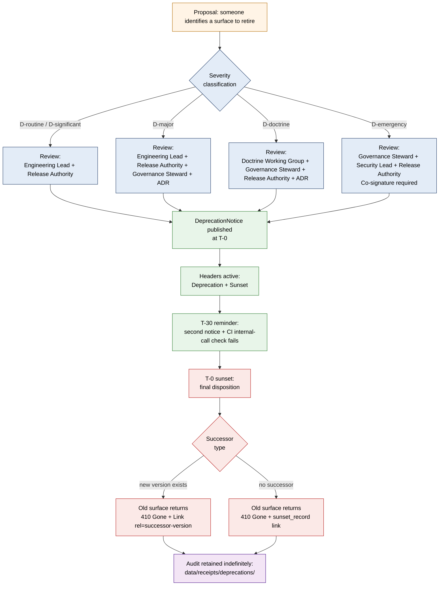

<!-- [KFM_META_BLOCK_V2]
doc_id: kfm://doc/<TODO-uuid-deprecation-process>
title: Deprecation Process
type: standard
version: v1
status: draft
owners: <TODO: Release Authority + Governance Steward + Engineering Lead + Security Lead>
created: 2026-05-12
updated: 2026-05-15
policy_label: public
related:
  - docs/governance/CONTRADICTION_HANDLING.md
  - docs/doctrine/lifecycle-law.md
  - docs/doctrine/corrections-first-class.md
  - docs/doctrine/policy-aware.md
  - docs/doctrine/evidence-first.md
  - docs/doctrine/authority-ladder.md
  - docs/doctrine/ai-as-assistant.md
  - docs/doctrine/derived-stays-derived.md
  - docs/doctrine/trust-membrane.md
  - docs/doctrine/time-aware.md
  - docs/architecture/release-and-publication.md
  - docs/runbooks/RB-DEPRECATION-EXECUTION.md
  - docs/runbooks/RB-CORRECTION-ROUTINE.md
  - docs/runbooks/RB-ROLLBACK-EXECUTION.md
  - docs/adr/
  - schemas/contracts/v1/deprecation_notice.schema.json
  - schemas/contracts/v1/sunset_record.schema.json
  - schemas/contracts/v1/successor_record.schema.json
  - schemas/contracts/v1/release_manifest.schema.json
  - schemas/contracts/v1/correction_notice.schema.json
  - control_plane/deprecation_register.yaml
  - control_plane/policy_gate_register.yaml
  - .github/workflows/deprecation-window-check.yml
  - tests/deprecation/
  - CHANGELOG.md
tags: [kfm, governance, deprecation, sunset, retirement, lifecycle, release, trust]
notes:
  - Codifies how KFM deprecates any governed surface — schemas, routes, layers, datasets, connectors, fixtures, runbooks, validators, AI adapters, doctrine docs — without violating evidence-first, lifecycle-law, or corrections-first-class doctrine.
  - Distinguishes deprecation (planned future removal) from withdrawal, supersession, rollback, and correction.
  - Preserves the CONFIRMED 90-day minimum window and the RFC 9745 / RFC 8594 header posture from the project versioning policy. RFC syntax was externally checked against RFC Editor pages on 2026-05-15; implementation wiring still remains NEEDS VERIFICATION.
  - Schema names, file paths, route paths, workflow filenames, control_plane keys, and runbook IDs are PROPOSED until verified against the live repository.
  - Sibling-doc placement: lives in docs/governance/ alongside CONTRADICTION_HANDLING.md; cross-links the doctrine track in docs/doctrine/.
[/KFM_META_BLOCK_V2] -->

# Deprecation Process

> **How Kansas Frontier Matrix retires a governed surface — schema, route, layer, dataset, connector, fixture, validator, runbook, or doctrine doc — on a published schedule, with a recorded successor, a discoverable notice, and an append-only audit trail.**

[](#)
[](#)
[](#)
[](#)
[](#)
[](#)
[](#)

**Status:** Draft &middot; **Owners:** *TODO — Release Authority + Governance Steward + Engineering Lead + Security Lead* <sub>NEEDS VERIFICATION</sub> &middot; **Last updated:** 2026-05-15

> [!IMPORTANT]
> This document is **normative**. It governs every planned retirement of a governed surface in KFM. Deprecation **never** means silent removal, surprise sunset, or "we'll figure it out at the deadline." A deprecation that violates any rule below is a **build-stop defect**, equivalent in severity to a silent correction (see [`docs/doctrine/corrections-first-class.md`](../doctrine/corrections-first-class.md) §**I-3**).

> [!NOTE]
> **Evidence boundary.** This revision verifies the external RFC numbers and header syntax from RFC Editor sources as of 2026-05-15. It does **not** verify live repository routes, schemas, workflows, owner assignments, middleware behavior, or emitted proof objects; those remain `PROPOSED`, `UNKNOWN`, or `NEEDS VERIFICATION` where marked.

---

## Contents

1. [Purpose &amp; scope](#1-purpose--scope)
2. [The doctrine in one paragraph](#2-the-doctrine-in-one-paragraph)
3. [Definitions — deprecation vs. withdrawal vs. supersession vs. rollback vs. correction](#3-definitions--deprecation-vs-withdrawal-vs-supersession-vs-rollback-vs-correction)
4. [The deprecation surface — what is deprecable](#4-the-deprecation-surface--what-is-deprecable)
5. [Severity classes](#5-severity-classes)
6. [The 90-day window and the emergency exception](#6-the-90-day-window-and-the-emergency-exception)
7. [The deprecation lifecycle](#7-the-deprecation-lifecycle)
8. [The `DeprecationNotice` artifact](#8-the-deprecationnotice-artifact)
9. [HTTP headers and machine-discoverable signals](#9-http-headers-and-machine-discoverable-signals)
10. [Public visibility requirements](#10-public-visibility-requirements)
11. [Audit &amp; provenance requirements](#11-audit--provenance-requirements)
12. [Relationship to other doctrines](#12-relationship-to-other-doctrines)
13. [Roles &amp; responsibilities](#13-roles--responsibilities)
14. [The cardinal rules — what is forbidden](#14-the-cardinal-rules--what-is-forbidden)
15. [Pre-deprecation checklist](#15-pre-deprecation-checklist)
16. [Worked examples](#16-worked-examples)
17. [FAQ](#17-faq)
18. [Related docs](#18-related-docs)
19. [Appendix](#19-appendix)

---

## 1. Purpose &amp; scope

Kansas Frontier Matrix is an **evidence-first, append-only, fail-closed** system. Every public surface earns its trust by a recorded chain of evidence, policy, and review (see [`evidence-first.md`](../doctrine/evidence-first.md), [`policy-aware.md`](../doctrine/policy-aware.md), [`lifecycle-law.md`](../doctrine/lifecycle-law.md)). That posture creates a precise obligation when something is **leaving**: the act of retirement is itself a governed event that must be announced, scheduled, traceable, and reversible up to the point of sunset.

This document codifies that obligation. It governs **every planned retirement of every governed surface** — schemas, contracts, public and steward routes, map layers, tile services, dataset versions, source connectors, policy rego files, fixtures, validators, tools, runbooks, AI model adapters, and doctrine documents. It is the planned-retirement counterpart of [`corrections-first-class.md`](../doctrine/corrections-first-class.md) (reactive correction) and [`CONTRADICTION_HANDLING.md`](./CONTRADICTION_HANDLING.md) (source/standard conflict resolution).

**In scope.** Planned retirement of any item that has crossed the **trust membrane** described in [`trust-membrane.md`](../doctrine/trust-membrane.md) and acquired a recorded warranty — items in `PUBLISHED` lifecycle state, or items whose `PROPOSED` / `CONFIRMED` status is visible to downstream consumers.

**Out of scope.** Routine deletion of internal scratch artifacts in `data/work/`; iteration on `PROPOSED` candidate material before any public exposure; mid-flight `data/quarantine/` decisions; rollback of an active incident (see [`RB-ROLLBACK-EXECUTION.md`](../runbooks/RB-ROLLBACK-EXECUTION.md) <sub>PROPOSED path</sub>); withdrawal driven by rights or sensitivity escalation (use the **withdrawal** path in [`corrections-first-class.md`](../doctrine/corrections-first-class.md), not deprecation).

> [!NOTE]
> **Withdrawal ≠ deprecation.** Withdrawal is *immediate* and is driven by rights, sensitivity, or integrity failure. Deprecation is *scheduled* and is driven by version planning, successor availability, or supersession of a surface. They use different artifacts, different reason codes, and different review gates. See [§3](#3-definitions--deprecation-vs-withdrawal-vs-supersession-vs-rollback-vs-correction).

[⬆ Back to top](#deprecation-process)

---

## 2. The doctrine in one paragraph

> **Every retirement of a governed KFM surface is announced, scheduled, named, paired with a successor (where one exists), surfaced in machine-discoverable form, recorded in append-only audit, and held for a minimum 90-day window before the sunset effective time — unless an emergency review explicitly shortens the window and records why. A retirement that violates any of those clauses is a defect, not a deprecation.**

`[CONFIRMED — derived from the project versioning policy: "Minimum 90 days for non-emergency deprecation. Public routes get a `Deprecation` header per RFC 9745 and a `Sunset` header per RFC 8594."]`

Everything else in this document is operational shape for that single sentence. Where a lower-layer design appears to conflict with this doctrine, this doctrine wins until the design is amended through an [ADR](../adr/) <sub>PROPOSED path</sub>.

[⬆ Back to top](#deprecation-process)

---

## 3. Definitions — deprecation vs. withdrawal vs. supersession vs. rollback vs. correction

KFM uses five distinct terms for "this artifact is changing in a way that affects downstream consumers." They are **not** interchangeable. Confusing them is the most common authoring error in this space, and it has real consequences for how the system fails closed.

| Term | Trigger | Window | Public effect | Authoring artifact | Failure mode if misapplied |
|---|---|---|---|---|---|
| **Deprecation** | Planned retirement; successor available or not-applicable; version-policy event. | **≥ 90 days** (minimum, non-emergency). | Item still works; carries `Deprecation` + `Sunset` headers; notice visible at stable URL; successor link surfaced. | `DeprecationNotice` <sub>PROPOSED schema</sub> | If used in place of withdrawal: rights / sensitivity exposure continues for ≥ 90 days. **Forbidden.** |
| **Withdrawal** | Rights revoked, sensitivity re-classified, integrity failure. | **Immediate.** | Item removed from public routes; reason code surfaced; audit retained. | `CorrectionNotice` (`reason: rights_revoked` / `sensitivity_reclassified` / `integrity_failure`). `[CONFIRMED from corrections-first-class.md]` | If used in place of deprecation: downstream consumers experience surprise sunset, no successor. **Forbidden.** |
| **Supersession** | A new release replaces a prior release of the **same** surface. | Bounded by release cadence; predecessor remains inspectable in audit. | Public sees `superseded_by` link on the old artifact and a forward pointer to the replacement. | `SupersessionRecord` (`old_release` / `new_release` / `effective_time`). `[CONFIRMED from corrections-first-class.md]` | If used in place of deprecation: the old `$id` / route stays addressable indefinitely with no sunset signal. |
| **Rollback** | Operational reversion of public pointers, caches, and indexes to a prior `target_release_id`, typically during an incident. | Operational (minutes-to-hours). | Public surface reverts; rollback notice posted; audit of both releases retained. | `RollbackPlan` (`target_release_id`, `scope`, `rationale`). `[CONFIRMED from corrections-first-class.md]` | If used in place of deprecation: a planned retirement masquerades as an incident; trust posture damaged. |
| **Correction** | A published claim, dataset, layer, or report is wrong, disputed, stale, or rights-affected. | Variable; severity-driven. | `CorrectionNotice` visible at stable URL; affected claims marked; corrective candidate routed through standard release path. | `CorrectionNotice`. `[CONFIRMED from corrections-first-class.md]` | If used in place of deprecation: every routine version retirement gets treated as an error in something, polluting the correction audit. |

> [!IMPORTANT]
> **Pick exactly one path.** A retirement event is *either* a deprecation *or* a withdrawal *or* a supersession *or* a rollback *or* a correction. Authors who cannot determine which path applies MUST route to the **Governance Steward + Release Authority** review pair before publishing any retirement signal. The default disposition for ambiguous routing is `DENY release.unreviewed` <sub>PROPOSED reason code</sub>.

[⬆ Back to top](#deprecation-process)

---

## 4. The deprecation surface — what is deprecable

A **deprecable surface** is any governed KFM artifact whose identity or contract has crossed the trust membrane and made visible to downstream consumers (humans, agents, or other systems). The taxonomy below names every category KFM currently anticipates.

| Category | Examples | Identity field | Successor pattern | Notice channel |
|---|---|---|---|---|
| **Public API route** | `/api/v1/claims`, `/api/v1/layers/{id}` | path + version segment | new version path (`/api/v2/...`) | `Deprecation` + `Sunset` headers; `/api/notices/deprecations` <sub>PROPOSED route</sub> |
| **Steward / admin route** | `/steward/v1/...`, `/admin/v1/...` | path + version segment | new version path | headers + steward-only notice index |
| **JSON Schema (contract)** | `evidence_bundle.schema.json#1.2.0` | `$id` (semver-tagged) | new `$id` with new semver | release notes + `CHANGELOG.md` + schema registry |
| **Map layer** | gauge layer, treaty layer, hazard layer | `LayerManifest.layer_id` | `successor_layer_id` field | Evidence Drawer badge + `LayerManifest` `deprecation` block |
| **Tile service / tile pyramid** | `TileManifest.tile_set_id` | `tile_set_id` | new `tile_set_id` | `LayerManifest` deprecation block |
| **`DatasetVersion`** | a specific NWIS pull, a specific BLM PLSS extract | `dataset_version_id` | next `DatasetVersion` of same `dataset_id` | release notes + Evidence Drawer |
| **Source connector** | `kfm-connector-noaa-ghcn` | connector id + version | successor connector or rewrite | release notes + steward notice |
| **Policy rego file** | `policy/sensitivity/living_persons.rego` | path + bundle digest | replacement rego file | policy-register entry + ADR |
| **Validator / tool** | `tools/validate-evidence-bundle` | tool id + version | successor tool or built-in validator | release notes |
| **Fixture** | `fixtures/policy/c4_geometry_minimal.json` | path | replacement fixture | release notes |
| **Runbook** | `RB-CORRECTION-ROUTINE.md` | runbook id | successor runbook id | runbook header + governance index |
| **AI model adapter** | LLM provider adapter at a specific version | adapter id + version | successor adapter | `AIReceipt` model-id audit + steward notice |
| **Doctrine doc** | a sibling doc in `docs/doctrine/` | doc path + `KFM_META_BLOCK_V2.doc_id` | successor doctrine doc | ADR + governance index |

> [!NOTE]
> **`EvidenceBundle.bundle_id` is NOT deprecable.** `[CONFIRMED — from the project versioning policy: "`EvidenceBundle.bundle_id` is immutable. Updates produce new bundle ids; correction lineage links them."]` A bundle is either current (resolvable) or superseded (resolvable, with `superseded_by` set). Bundles are never "deprecated"; they are corrected, superseded, or withdrawn. Attempting to attach a `DeprecationNotice` to a bundle id is a build-stop defect.

> [!WARNING]
> **Doctrine docs are deprecable only via ADR.** Retiring a sibling doctrine doc (e.g., folding `truth-posture.md` into `trust-membrane.md`) requires an ADR that names the successor, preserves stable anchors where possible, and runs the full 90-day window even though the underlying mechanism does not change. The doctrine layer is the slowest-moving layer in KFM by design.

[⬆ Back to top](#deprecation-process)

---

## 5. Severity classes

Severity drives the review gate and the minimum window. Every deprecation MUST be classified at intake. Misclassification is a `DENY release.unreviewed` <sub>PROPOSED reason code</sub> event.

| Class | Trigger | Minimum window | Review gate | Public communication |
|---|---|---|---|---|
| **D-routine** | Additive contract change, internal tool retirement, no public-surface impact. | **90 days** | Engineering Lead + Release Authority | `CHANGELOG.md` entry + headers if applicable |
| **D-significant** | Breaking schema change, route version retirement, layer identity change, connector rewrite. | **90 days** (consider longer per consumer base) | Engineering Lead + Release Authority | `CHANGELOG.md` + headers + public notice + steward email |
| **D-major** | Cross-cutting contract change, AI adapter swap, policy rego replacement, multiple downstream releases affected. | **180 days recommended** <sub>PROPOSED</sub> | Engineering Lead + Release Authority + Governance Steward + ADR | full notice path + ADR + at least two reminder cycles |
| **D-emergency** | Rights revocation requiring sunset *and* downstream successor work; security vulnerability requiring controlled phase-out. | **Less than 90 days, recorded justification required.** Must be co-signed Governance Steward + Security Lead; if rights-immediate, use **withdrawal** path instead. | Governance Steward + Security Lead + Release Authority; ADR within 14 days post-event. | accelerated notice + headers + steward alert |
| **D-doctrine** | Retirement of a doctrine doc, an authority-ladder tier definition, or a governance process. | **90 days minimum; ADR required.** | Doctrine Working Group + Governance Steward + Release Authority + ADR | governance index + ADR + sibling-doc cross-link updates |

> [!CAUTION]
> **D-emergency is not a license to shortcut.** It compresses the *window*; it does not relax the **public notice**, **successor recording**, **audit retention**, or **headers** obligations. A "we'll skip the notice this once" disposition for emergency deprecation is a forbidden anti-pattern (see [§14](#14-the-cardinal-rules--what-is-forbidden)).

[⬆ Back to top](#deprecation-process)

---

## 6. The 90-day window and the emergency exception

`[CONFIRMED — from the project versioning policy: "Minimum 90 days for non-emergency deprecation. Public routes get a `Deprecation` header per RFC 9745 and a `Sunset` header per RFC 8594." Header syntax is externally checked as of 2026-05-15; implementation remains NEEDS VERIFICATION.]`

The **90-day floor** is doctrinal, not advisory. It exists for three reasons:

1. **Downstream rebuild time.** External integrators of KFM evidence (universities, atlases, agencies, citizen-science projects) need predictable lead time to migrate. 90 days is the operating floor across most public-data programs of comparable scope.
2. **Audit integrity.** A deprecation that runs shorter than the announcement window is operationally indistinguishable from a silent removal. Without the floor, the audit trail loses the *announce-before-act* invariant.
3. **Trust posture.** KFM publishes the warranty that its surfaces will *not vanish under consumers' feet*. The window is what that warranty looks like in calendar form.

### 6.1 Three calendar checkpoints

Every deprecation MUST emit signals at three checkpoints. Missing any one is a `DENY release.unreviewed` event.

| Checkpoint | Day | What MUST happen |
|---|---|---|
| **T-0** (announcement) | the day the `DeprecationNotice` is published | `Deprecation` + `Sunset` headers begin; notice live at stable URL; successor link surfaced; `CHANGELOG.md` updated |
| **T-30 before sunset** | sunset_date − 30 days | reminder notice; steward email; surface a more prominent Evidence Drawer badge; CI fails any KFM-internal call to the deprecated surface |
| **T-0 sunset** (effective) | sunset_date | the surface returns its final disposition (see [§7.5](#75-after-sunset)); audit retained; `successor_record` resolvable |

### 6.2 Emergency window compression

`[PROPOSED operational rules; doctrinal floor is CONFIRMED.]`

The window MAY be compressed below 90 days only when **all** of the following hold:

- A named risk justifies it (rights, security, integrity, or sensitivity), and the risk would *not* be better served by an immediate **withdrawal**.
- The Governance Steward **and** Security Lead **and** Release Authority co-sign the `DeprecationNotice`.
- A `compression_rationale` field is populated with the named risk and the alternative paths considered (especially: why this is deprecation, not withdrawal).
- An ADR is opened within 14 days of the emergency event; the ADR is a *retrospective* record of the decision, not a precondition.
- Public notice still runs; the headers still appear; the successor record is still required.

> [!WARNING]
> **A compressed window is a public statement.** A `DeprecationNotice` with a compressed window MUST surface that fact in its public face — readers MUST be able to see *"this deprecation ran on a compressed schedule because [recorded reason]."* Silent compression is forbidden.

[⬆ Back to top](#deprecation-process)

---

## 7. The deprecation lifecycle

`[PROPOSED operational shape; doctrinal anchors are CONFIRMED.]` The lifecycle below describes how a deprecation moves through KFM. Each box is a state; each arrow is a governed transition that emits an append-only record.



<sub>Illustrative state diagram. Box labels reflect doctrinal anchors; specific HTTP status codes, route paths, and timing details are `PROPOSED` until verified in implementation. `[NEEDS VERIFICATION at impl time.]`</sub>

### 7.1 Proposal

Anyone (contributor, steward, AI assistant in its *bounded-assistant* role per [`ai-as-assistant.md`](../doctrine/ai-as-assistant.md)) MAY open a deprecation proposal. The proposal carries: surface identity, current usage estimate, reason, proposed successor (if any), proposed severity class, and proposed `sunset_date`.

### 7.2 Severity classification &amp; review

The reviewer assigned by [§5](#5-severity-classes) verifies the classification, the window, the successor pattern, the audit destination, and the notice channels. Misclassification is corrected here, before publication. A proposal that fails review returns to the author with named gaps — it does not silently lapse.

### 7.3 Announcement at T-0

At the announcement timestamp, **all** of the following MUST happen atomically in the same release event:

- `DeprecationNotice` artifact appears at a stable URL (see [§10](#10-public-visibility-requirements)).
- Affected routes begin emitting `Deprecation` and `Sunset` HTTP headers (see [§9](#9-http-headers-and-machine-discoverable-signals)).
- Successor record (if applicable) is published and resolvable.
- `CHANGELOG.md` is updated.
- The `control_plane/deprecation_register.yaml` <sub>PROPOSED path</sub> entry is added.
- The release this announcement is part of MUST include a `ReleaseManifest` linking the `DeprecationNotice` artifact ids.

### 7.4 Mid-window obligations

For the duration of the window, the deprecated surface remains **functional** and **fully governed**. Calls succeed; evidence resolves; policy gates fire; audit is recorded. The only differences from a non-deprecated surface are: the headers; the notice link; the Evidence Drawer badge surfacing the deprecation state (see [`map-first.md`](../doctrine/map-first.md)); and the CI check that fails any **internal** KFM code path that still calls the deprecated surface.

> [!NOTE]
> **CI failure on internal calls is intentional.** External consumers receive a soft signal (headers); internal consumers receive a hard signal (broken build). The internal codebase MUST migrate first — KFM does not let its own code outlive a surface it has publicly committed to retire.

### 7.5 After sunset

At `sunset_date`, the deprecated surface emits a **final disposition**. The disposition depends on the deprecation category:

| Surface category | Final disposition | Resolution |
|---|---|---|
| Public / steward route | HTTP `410 Gone` + `Link: <successor-url>; rel="successor-version"` (if successor exists) | request resolves to either successor or the sunset record |
| JSON Schema `$id` | `$id` remains addressable, returns the schema with a `deprecated: true` marker and a `successor_id` field; CI rejects new payloads referencing it | downstream consumers fail fast at validation |
| Map layer / tile set | `LayerManifest` returns `lifecycle_state: sunset`; tile endpoints return `410 Gone`; map UI surfaces the sunset Evidence Drawer badge | UI redirects to successor layer if recorded |
| `DatasetVersion` | dataset returns `dataset_state: sunset`; query routes return `ABSTAIN evidence.sunset` <sub>PROPOSED code</sub> if it was the only resolvable version | upstream re-resolution against successor version |
| Source connector | connector binary refuses to run with the deprecated configuration | replacement connector must be installed |
| AI model adapter | `AIReceipt`s referencing the sunset adapter are still resolvable; *new* adapter calls fail closed | successor adapter required |
| Runbook | runbook returns to readers as **`SUNSET — see successor`** with a forward link | successor runbook executes the procedure |
| Doctrine doc | doc returns its content with a banner reading **`SUNSET — superseded by [successor]`**; anchors preserved | sibling docs cross-link to successor |

### 7.6 Indefinite audit

After sunset, **all artifacts referenced in the deprecation chain remain in audit indefinitely** under `data/receipts/deprecations/` <sub>PROPOSED path</sub>. The `DeprecationNotice`, the `SunsetRecord`, the `SuccessorRecord` (if any), and every `ReleaseManifest` that referenced them remain resolvable. KFM does not garbage-collect deprecation audit. `[CONFIRMED principle — derived from the append-only audit invariant in lifecycle-law.md §I-2 and corrections-first-class.md §I-2.]`

[⬆ Back to top](#deprecation-process)

---

## 8. The `DeprecationNotice` artifact

The `DeprecationNotice` is the public, machine-readable, append-only record of a deprecation. Every active deprecation chain begins with one. Follow-up notices use `replaces_notice`; the original remains in audit. Field names below are `PROPOSED`; doctrinal *shape* (identity, scope, schedule, successor, audit) is `CONFIRMED`.

### 8.1 Required fields

| Field | Type | Required | Notes |
|---|---|:---:|---|
| `notice_id` | string | ✓ | Stable identifier; format `dn-<scope>-<date>-<seq>`. |
| `surface_type` | enum | ✓ | One of the categories in [§4](#4-the-deprecation-surface--what-is-deprecable). |
| `surface_id` | string | ✓ | Identity field appropriate to `surface_type` (route path, schema `$id`, `LayerManifest.layer_id`, etc.). |
| `severity_class` | enum | ✓ | `D-routine` / `D-significant` / `D-major` / `D-emergency` / `D-doctrine`. |
| `announcement_date` | date | ✓ | T-0. ISO 8601. |
| `sunset_date` | date \| `null` | ✓ | Effective time of the final disposition. ISO 8601. MUST be non-null for active deprecations; MUST be `null` only for cancellation notices. |
| `window_days` | integer \| `null` | conditional | Required for active deprecations: `sunset_date − announcement_date`, in calendar days. MUST be ≥ 90 unless `severity_class == D-emergency`. MUST be `null` for cancellation notices. |
| `compression_rationale` | string | conditional | Required iff `window_days < 90`. Must name the risk and reference the co-signing roles. |
| `reason` | enum + string | ✓ | Reason code (e.g., `version_supersession`, `connector_replacement`, `schema_rewrite`, `security_phaseout`, `rights_phaseout`, `redundancy`, `policy_realignment`, `cancellation`). |
| `successor` | object \| `null` | ✓ | If non-null, contains successor identity (`successor_id`, `successor_url`, `successor_type`). Explicit `null` signals "no successor planned" and requires a `no_successor_rationale`. |
| `no_successor_rationale` | string | conditional | Required iff `successor == null`. |
| `affected_releases` | array of `ReleaseManifest` ids | ✓ | The releases that currently reference the deprecated surface. |
| `notice_channels` | array | ✓ | Where the notice is reachable (e.g., `/api/notices/deprecations/<notice_id>`, `CHANGELOG.md` heading anchor, steward email subject). |
| `headers_active_from` | timestamp \| `null` | conditional | Required for active HTTP-addressable deprecations; when `Deprecation` and `Sunset` headers begin appearing on the surface (typically equal to `announcement_date`). MUST be `null` for cancellation notices. |
| `co_signed_by` | array of roles | ✓ | Named roles per [§13](#13-roles--responsibilities). Validates against `control_plane/role_register.yaml` <sub>PROPOSED path</sub>. |
| `evidence_refs` | array of `EvidenceRef` | conditional | Required when the reason cites external evidence (e.g., a security advisory, a rights revocation). Each `EvidenceRef` MUST resolve to a published `EvidenceBundle` per [`evidence-first.md`](../doctrine/evidence-first.md). |
| `adr_ref` | string | conditional | Required for `D-major`, `D-doctrine`, and post-event for `D-emergency`. |
| `replaces_notice` | string \| `null` | ✓ | If this notice supersedes a prior deprecation (e.g., schedule slipped, successor changed), the prior `notice_id`. Append-only — the prior notice is **not** edited. |
| `audit_path` | string | ✓ | `data/receipts/deprecations/<notice_id>/` or equivalent. `[PROPOSED path.]` |

### 8.2 Companion records

A complete deprecation produces up to three additional append-only records, depending on category:

| Record | Purpose | Required when |
|---|---|---|
| `SuccessorRecord` <sub>PROPOSED</sub> | Names and binds the successor surface. | `successor != null`. |
| `SunsetRecord` <sub>PROPOSED</sub> | Marks the sunset transition as having occurred. Emitted at `sunset_date`. | always. |
| `DeprecationReminderRecord` <sub>PROPOSED</sub> | T-30 reminder notice. | always (unless `window_days < 30`, in which case the reminder is folded into the announcement and recorded as such). |

> [!TIP]
> The `replaces_notice` field is how KFM handles "we need to push the sunset date back" or "the successor changed." The original notice stays in audit; a new notice supersedes it. There is no edit-in-place path.

[⬆ Back to top](#deprecation-process)

---

## 9. HTTP headers and machine-discoverable signals

`[CONFIRMED policy + EXTERNAL standards; RFC numbers and syntax checked against RFC Editor pages on 2026-05-15. Repo/framework implementation remains NEEDS VERIFICATION.]`

For deprecated HTTP-addressable surfaces (public API, steward API, admin API, tile services), KFM emits the following headers from `headers_active_from` through `sunset_date`:

| Header | Source | Value |
|---|---|---|
| `Deprecation` | [RFC 9745](https://www.rfc-editor.org/rfc/rfc9745.html) | Structured Field Date, e.g. `@1778544000`; equal to `DeprecationNotice.announcement_date` when the notice is time-normalized. |
| `Sunset` | [RFC 8594](https://www.rfc-editor.org/rfc/rfc8594.html) | HTTP-date, e.g. `Sat, 12 Sep 2026 00:00:00 GMT`; equal to `DeprecationNotice.sunset_date` when the notice is time-normalized. |
| `Link: <notice-url>; rel="deprecation"` | [RFC 9745](https://www.rfc-editor.org/rfc/rfc9745.html) + [RFC 8288](https://www.rfc-editor.org/rfc/rfc8288.html) conventions | resolves to the public `DeprecationNotice`. |
| `Link: <successor-url>; rel="successor-version"` | [RFC 5829](https://www.rfc-editor.org/rfc/rfc5829.html) + RFC 8288 conventions | present iff `successor != null`. |

> [!IMPORTANT]
> **Header syntax is standards-bound; KFM semantics are doctrine-bound.** `Deprecation` is a Structured Field Date, while `Sunset` is an HTTP-date. KFM still owns the governance semantics: notice identity, successor binding, release linkage, EvidenceBundle resolution, and audit retention.

> [!NOTE]
> **Why headers and notices both.** Headers are for machines; notices are for humans and for audit. Either alone is insufficient. A surface that emits headers without a resolvable notice is opaque; a surface that publishes a notice without emitting headers is invisible to automation. Both MUST be present from `headers_active_from` onward.

After sunset, the headers stop and the disposition rules in [§7.5](#75-after-sunset) take over.

### 9.1 Non-HTTP surfaces

Surfaces that are not HTTP-addressable use the equivalent machine-discoverable signal for their carrier:

| Surface | Discovery signal |
|---|---|
| JSON Schema | `deprecated: true` keyword on the schema or affected sub-schema; `x-kfm-sunset` and `x-kfm-successor-id` extension fields. <sub>PROPOSED extension names.</sub> |
| Map `LayerManifest` | `lifecycle_state: deprecated` plus `deprecation_notice_ref` and `sunset_date` fields. |
| Source connector | startup banner + machine-readable `--state` flag returning `deprecated`. |
| AI model adapter | `AIReceipt.adapter_state: deprecated`; runtime envelope carries a `deprecation_hint` field on calls. |
| Runbook / doctrine doc | leading callout block + `KFM_META_BLOCK_V2.status: deprecated`. |

[⬆ Back to top](#deprecation-process)

---

## 10. Public visibility requirements

Every `DeprecationNotice` MUST be reachable from **at least three** stable channels. Reaching the notice MUST not require authentication unless the deprecated surface is itself non-public.

| Channel | Required for | Notes |
|---|---|---|
| **Notice URL** (e.g., `/api/notices/deprecations/<notice_id>`) | every public deprecation | the canonical human-readable rendering. |
| **`CHANGELOG.md` heading anchor** | every deprecation | one heading per notice, formatted as `### Deprecated: <surface_id>`. |
| **Affected-surface `Deprecation` + `Sunset` headers** | every HTTP-addressable deprecation | machine-discoverable. |
| **Evidence Drawer badge** | every map-layer or dataset deprecation | per [`map-first.md`](../doctrine/map-first.md). |
| **Steward email** | every `D-significant`, `D-major`, `D-doctrine`, and `D-emergency` | non-blocking but required. |
| **ADR reference** | every `D-major`, `D-doctrine`, and post-event `D-emergency` | normative architectural record. |
| **Successor surface** | every deprecation with a successor | the successor MUST link back to the deprecated predecessor's notice. |

> [!IMPORTANT]
> The **discoverability invariant**: a downstream consumer who reads the deprecated surface must be able to reach the notice within **one click or one HTTP header inspection**, with no login wall. A deprecation hidden behind authentication is, for trust-posture purposes, a silent removal.

[⬆ Back to top](#deprecation-process)

---

## 11. Audit &amp; provenance requirements

Deprecation audit follows the same append-only invariant that governs lifecycle and corrections.

| Invariant | What it means in practice | Failure mode |
|---|---|---|
| **A-1 — Named operation** | Every deprecation has a typed `DeprecationNotice`. There is no untyped deprecation. | `ERROR` if a public surface emits a `Deprecation` header without a resolvable `DeprecationNotice`. |
| **A-2 — Append-only history** | `DeprecationNotice`, `SuccessorRecord`, and `SunsetRecord` are write-once. Slippage produces a new notice with `replaces_notice` set; the old notice is never edited. | `ERROR` if any deprecation record is overwritten in place. |
| **A-3 — Reachable evidence** | Where the deprecation reason cites external evidence (security advisory, rights revocation, standards change), the `evidence_refs` array MUST resolve per [`evidence-first.md`](../doctrine/evidence-first.md). | `ABSTAIN evidence.unresolved` if a notice cites unresolvable evidence at validation time. |
| **A-4 — Release linkage** | The `ReleaseManifest` for the release that announces the deprecation MUST list the `DeprecationNotice.notice_id`. | `DENY release.unreviewed` if a deprecation announcement is published outside a `ReleaseManifest`. |
| **A-5 — Indefinite retention** | Deprecation audit is retained indefinitely under `data/receipts/deprecations/`. KFM does not garbage-collect it. | `ERROR` if any deprecation receipt path is purged. |
| **A-6 — Single source of truth** | `control_plane/deprecation_register.yaml` <sub>PROPOSED path</sub> is the authoritative inventory; the public notice route reads from it. | divergence between register and public notice triggers a `CorrectionNotice`. |

[⬆ Back to top](#deprecation-process)

---

## 12. Relationship to other doctrines

Deprecation is an *operational* doctrine that depends on, and is constrained by, several foundational ones. The relationships below are explicit so that authors and reviewers can trace which constraint governs which decision.

| Related doctrine | Relationship to deprecation |
|---|---|
| [`lifecycle-law.md`](../doctrine/lifecycle-law.md) | Deprecation operates on items already in `PUBLISHED` state. It does not introduce a new lifecycle stage; it adds a `deprecated` annotation that the runtime surfaces. The append-only invariant governs deprecation audit. |
| [`corrections-first-class.md`](../doctrine/corrections-first-class.md) | Sibling doctrine. Deprecation is the **planned** counterpart to **reactive** correction. The two share invariants (named operation, append-only, public visibility, path to rebuild). |
| [`evidence-first.md`](../doctrine/evidence-first.md) | When a deprecation reason cites external evidence (CVE, rights revocation, standards change), that evidence MUST resolve from `EvidenceRef` to `EvidenceBundle`. No deprecation may be justified by uncited prose. |
| [`policy-aware.md`](../doctrine/policy-aware.md) | When a deprecation is driven by a policy change (rights, sensitivity, source-terms update), the `PolicyDecision` and `SourceRightsAssessment` records are linked from the `DeprecationNotice`. Where the policy change is *immediate*, use **withdrawal**, not deprecation. |
| [`authority-ladder.md`](../doctrine/authority-ladder.md) | A deprecation that overrides an external standard recommendation, or that supersedes a Tier 1 doctrine doc, requires an ADR. The ladder governs which tier holds. |
| [`ai-as-assistant.md`](../doctrine/ai-as-assistant.md) | AI may **draft** a `DeprecationNotice` (extract usage metrics, propose severity, generate the announcement text); a named role **decides** it. AI drafts are preserved as `AIReceipt`s on the notice. AI never co-signs an emergency compression. |
| [`derived-stays-derived.md`](../doctrine/derived-stays-derived.md) | A deprecation that retires a carrier (tile pyramid, search index, graph projection) does not deprecate the underlying canonical evidence. The notice MUST distinguish carrier retirement from source retirement. |
| [`trust-membrane.md`](../doctrine/trust-membrane.md) | Crossing the membrane *into* `PUBLISHED` is a warranty; deprecation is a scheduled adjustment to that warranty. The membrane's outcome vocabulary (`ANSWER` / `ABSTAIN` / `DENY` / `ERROR` / `STALE`) governs post-sunset call behavior. |
| [`time-aware.md`](../doctrine/time-aware.md) | The window arithmetic in this doc uses the same calendar discipline that governs `STALE` evaluation. <sub>NEEDS VERIFICATION — confirm exact filename.</sub> |
| [`CONTRADICTION_HANDLING.md`](./CONTRADICTION_HANDLING.md) | If a deprecation reason is "external standard conflicts with project terminology," route the conflict through contradiction handling **first**, and let its disposition drive the deprecation. |

[⬆ Back to top](#deprecation-process)

---

## 13. Roles &amp; responsibilities

`[PROPOSED — roles align with the role register pattern; specific role assignments NEEDS VERIFICATION against control_plane/role_register.yaml.]`

| Role | In deprecation |
|---|---|
| **Release Authority** | Owns the deprecation schedule and the announcement release. Signs every `DeprecationNotice`. The only role authorized to set `sunset_date`. |
| **Governance Steward** | Owns the doctrine-level fit. Verifies severity classification. Required co-signer for `D-major`, `D-doctrine`, and `D-emergency`. |
| **Engineering Lead** | Owns the implementation: header emission, CI internal-call check, successor wiring, runtime disposition at sunset. Signs every `DeprecationNotice` involving a code surface. |
| **Security Lead** | Required co-signer for `D-emergency`. Validates the named risk. |
| **Steward (domain)** | Notified by steward email; surfaces downstream impact. May escalate severity if downstream-rebuild estimate exceeds window. |
| **Reviewers (PR)** | Verify that every PR touching a deprecated surface either implements the migration to successor or carries a documented exception. |
| **ADR review group** | Approves the ADR for `D-major`, `D-doctrine`, and post-event `D-emergency`. |
| **AI assistants** | May draft, summarize, and propose. May **not** decide severity, set `sunset_date`, co-sign emergency compression, or skip notice channels. Drafts are preserved as `AIReceipt`s. `[CONFIRMED via ai-as-assistant.md.]` |
| **Audit role** | Independent verifier. Audits each deprecation against the [pre-deprecation checklist](#15-pre-deprecation-checklist) and the [cardinal rules](#14-the-cardinal-rules--what-is-forbidden); routes failures through [`CONTRADICTION_HANDLING.md`](./CONTRADICTION_HANDLING.md) or [`corrections-first-class.md`](../doctrine/corrections-first-class.md) as appropriate. |

> [!NOTE]
> **No single role decides alone.** Every deprecation has at least two named signatures; `D-major` and above require three; `D-emergency` requires three named roles drawn from a specific set. This is intentional: deprecation is one of the few events that *removes* a previously warranted surface, and the warranty obligation in [`trust-membrane.md`](../doctrine/trust-membrane.md) is symmetric — the same level of review that approved the surface approves its retirement.

[⬆ Back to top](#deprecation-process)

---

## 14. The cardinal rules — what is forbidden

These rules are absolute. A deprecation that violates any of them is a **defect**, not a deprecation, and MUST be reverted.

| # | Forbidden | Why |
|---|---|---|
| **F-1** | **Silent removal** of a previously published surface. | Violates A-1, A-3, A-4. Equivalent in severity to a silent correction. |
| **F-2** | **Edit-in-place** of any `DeprecationNotice`, `SuccessorRecord`, or `SunsetRecord`. | Violates A-2 (append-only history). Slippage produces a new notice via `replaces_notice`. |
| **F-3** | **Sunset before announcement.** Headers, notice, and successor record MUST appear in the same release that begins the window. | Without simultaneous publication, downstream consumers cannot detect the deprecation in time to migrate. |
| **F-4** | **Compressing the window below 90 days outside `D-emergency`** with three named co-signatures. | The 90-day floor is doctrinal. |
| **F-5** | **Hiding a deprecation behind authentication** when the deprecated surface is public. | Violates §10 discoverability invariant. |
| **F-6** | **Using deprecation in place of withdrawal** for rights or sensitivity escalation. | Continues unsafe exposure for ≥ 90 days. Use withdrawal (`CorrectionNotice` with `reason: rights_revoked` / `sensitivity_reclassified`) instead. |
| **F-7** | **Using withdrawal in place of deprecation** for planned version retirement. | Surprise sunset without successor; trust posture damaged. |
| **F-8** | **AI co-signature** on a `D-emergency` window compression. | AI is bounded by `ai-as-assistant.md`; emergency compression requires named human roles. |
| **F-9** | **Deprecating an `EvidenceBundle.bundle_id`.** | Bundles are immutable; use correction lineage instead. |
| **F-10** | **Dropping deprecation audit** from `data/receipts/deprecations/`. | Violates A-5 (indefinite retention). |
| **F-11** | **A deprecation announcement outside a `ReleaseManifest`.** | Violates A-4 (release linkage). |
| **F-12** | **Deprecating a doctrine doc without an ADR.** | Violates the authority ladder for Tier 1 doctrine retirement. |

[⬆ Back to top](#deprecation-process)

---

## 15. Pre-deprecation checklist

Before announcing a deprecation, every signer MUST be able to answer **yes** to every applicable item below.

- [ ] Severity is classified per [§5](#5-severity-classes) and the classification is documented.
- [ ] The path is **deprecation** (planned) — not **withdrawal** (rights / sensitivity / integrity), **supersession** (release replacement), **rollback** (incident reversion), or **correction** (something is wrong). See [§3](#3-definitions--deprecation-vs-withdrawal-vs-supersession-vs-rollback-vs-correction).
- [ ] `sunset_date − announcement_date ≥ 90 days`, **OR** the deprecation is `D-emergency` with co-signature and `compression_rationale`.
- [ ] A successor is identified — **OR** `successor == null` and `no_successor_rationale` is populated.
- [ ] The `DeprecationNotice` artifact validates against the `PROPOSED` schema (see [§8.1](#81-required-fields)).
- [ ] The `ReleaseManifest` for the announcement release lists the `notice_id`.
- [ ] The affected HTTP surfaces emit `Deprecation` and `Sunset` headers starting at `headers_active_from`.
- [ ] The `Deprecation` header serializes as an RFC 9745 Structured Field Date and the `Sunset` header serializes as an RFC 8594 HTTP-date.
- [ ] The non-HTTP surfaces emit their equivalent machine-discoverable signal per [§9.1](#91-non-http-surfaces).
- [ ] The notice is reachable from at least three channels per [§10](#10-public-visibility-requirements).
- [ ] Internal callers of the deprecated surface are inventoried and migration tickets are filed.
- [ ] The CI internal-call check is enabled on the surface (or scheduled to enable at T-30).
- [ ] If `D-major`, `D-doctrine`, or `D-emergency`: the ADR is open (post-event for `D-emergency`).
- [ ] If the reason cites external evidence: every `EvidenceRef` resolves to a published `EvidenceBundle`.
- [ ] The `T-30` reminder is scheduled.
- [ ] The sunset disposition for each surface category is configured per [§7.5](#75-after-sunset).
- [ ] Co-signing roles are named and authorized per [§13](#13-roles--responsibilities).
- [ ] `control_plane/deprecation_register.yaml` is updated.
- [ ] `CHANGELOG.md` heading is added.

[⬆ Back to top](#deprecation-process)

---

## 16. Worked examples

The examples below are **illustrative**; field values, IDs, and dates are placeholders. They demonstrate how the doctrine resolves common cases.

<details>
<summary><b>Example 1 — Routine schema retirement (D-routine)</b></summary>

**Situation.** A small additive change to `evidence_bundle.schema.json` releases as `#1.3.0`. The prior `#1.2.0` is being retired six months later.

**Resolution.**

- `surface_type = json_schema`
- `surface_id = evidence_bundle.schema.json#1.2.0`
- `severity_class = D-routine` (additive change, no breaking impact on consumers).
- `window_days = 180` (well above the floor; comfortable for downstream integrators).
- `successor = evidence_bundle.schema.json#1.3.0`.
- `reason = version_supersession`.
- Sign-offs: Engineering Lead + Release Authority. No ADR required.
- The `#1.2.0` schema document is annotated `deprecated: true` and gains `x-kfm-successor-id`; payloads referencing `#1.2.0` continue to validate during the window.
- At sunset, `#1.2.0` remains resolvable as a frozen historical document with `deprecated: true`; new payloads referencing it are rejected at CI.

**Forbidden alternative.** Silently editing `evidence_bundle.schema.json` in place to bump from `#1.2.0` to `#1.3.0` and removing the `#1.2.0` document. Violates F-1, F-2, F-9 (by analogy to bundles), and breaks the append-only audit invariant.

</details>

<details>
<summary><b>Example 2 — Public API version retirement (D-significant)</b></summary>

**Situation.** `/api/v1/claims` is being retired in favor of `/api/v2/claims`, which adds a required `provenance_scope` parameter and reshapes the response envelope.

**Resolution.**

- `surface_type = public_api_route`
- `surface_id = /api/v1/claims`
- `severity_class = D-significant` (breaking change for consumers).
- `window_days = 120` (longer than the floor because external integrators must rebuild client code).
- `successor = /api/v2/claims`.
- `reason = schema_rewrite` + free-text rationale.
- Sign-offs: Engineering Lead + Release Authority.
- From `headers_active_from`, every `/api/v1/claims` response carries `Deprecation`, `Sunset`, and two `Link` headers (notice + successor-version).
- At T-30, a reminder `DeprecationReminderRecord` is emitted; the Evidence Drawer badge becomes more prominent on related layers; CI internal-call check becomes failing on remaining KFM-internal callers.
- At sunset, `/api/v1/claims` returns `410 Gone` plus the successor-version `Link`. The `SunsetRecord` is published. The notice URL remains live indefinitely.

</details>

<details>
<summary><b>Example 3 — Layer identity change (D-significant, with carrier nuance)</b></summary>

**Situation.** The hydrology `gauge_layer` is being split into `gauge_layer_observed` and `gauge_layer_modeled`. The original `gauge_layer.layer_id` is being retired.

**Resolution.**

- `surface_type = map_layer`
- `successor = { successor_id: ["gauge_layer_observed", "gauge_layer_modeled"], successor_type: "split" }` <sub>PROPOSED successor pattern</sub>.
- The notice MUST distinguish *carrier retirement* (the unified `gauge_layer` `LayerManifest`) from the underlying canonical evidence (the `EvidenceBundle`s of NWIS observations and modeled-discharge bundles), per [`derived-stays-derived.md`](../doctrine/derived-stays-derived.md).
- At sunset, `gauge_layer` `LayerManifest` returns `lifecycle_state: sunset` with both successor `layer_id`s in the disposition; the underlying evidence bundles are **unaffected** and remain resolvable from the new layers.

**Common authoring error.** Writing "the gauge data is being deprecated." That's wrong twice: (1) the **data** (bundles) is not deprecated, only the **layer** (carrier) is; (2) the layer is being **split**, not simply retired, so the successor representation is an array, not a scalar.

</details>

<details>
<summary><b>Example 4 — Rights-revocation emergency (D-emergency, but check the path)</b></summary>

**Situation.** A licensor of an aerial-imagery source revokes their grant with 30 days' notice.

**Resolution.**

- **First decision:** is this deprecation or **withdrawal**? Test: does the revocation require *immediate* removal? If yes, use withdrawal (`CorrectionNotice` with `reason: rights_revoked`) per [`corrections-first-class.md`](../doctrine/corrections-first-class.md). If the licensor grants a 30-day phase-out *and the imagery is C0 public-safe* (not, e.g., C3 restricted-by-rights), a `D-emergency` deprecation MAY be permissible.
- For the deprecation path: `window_days = 30`, `severity_class = D-emergency`, `compression_rationale` populated, co-signatures from Governance Steward + Security Lead + Release Authority, ADR within 14 days.
- For the withdrawal path: a `CorrectionNotice` is published, the affected layers transition to `lifecycle_state: withdrawn` immediately, the audit retains everything.

**Default disposition when in doubt:** **withdrawal**, not deprecation. The compression exception exists, but it is the narrow path, not the wide one.

</details>

<details>
<summary><b>Example 5 — Doctrine doc folding (D-doctrine)</b></summary>

**Situation.** A proposal to fold `truth-posture.md` and `trust-membrane.md` into a single `governance-membrane.md` doctrine doc.

**Resolution.**

- `surface_type = doctrine_doc`
- `surface_id = docs/doctrine/truth-posture.md` (one notice per source doc; the proposal produces two notices if both are retired).
- `severity_class = D-doctrine`.
- `window_days = 90` minimum; recommended 180+ given how deeply sibling docs cite the doctrine.
- ADR is **required** before announcement; the ADR records the consolidation rationale and the anchor-preservation strategy.
- Each source doc gains a top-of-file callout reading `**SUNSET on YYYY-MM-DD — superseded by docs/doctrine/governance-membrane.md.**` from `announcement_date` onward.
- Every sibling doc that links to the retired docs MUST be updated within the window, **or** carry an automated anchor redirect.
- After sunset, the retired docs remain at their paths with a `**SUNSET — see successor**` banner; their `KFM_META_BLOCK_V2.status` flips to `deprecated`; anchors continue to resolve.

</details>

[⬆ Back to top](#deprecation-process)

---

## 17. FAQ

<details>
<summary><b>Why 90 days as the floor?</b></summary>

The 90-day floor was set in the project versioning policy and is reproduced here as `CONFIRMED` doctrine. It reflects the operating reality that external integrators of public-data programs typically need at least one fiscal quarter to plan a migration. Shorter windows are not "more agile" — they are *less governed*. A team that consistently needs sub-90-day deprecations is signalling either (a) the wrong artifact category is being retired, or (b) the surface should never have been published without a more stable contract. Both signals should trigger a retrospective ADR.

</details>

<details>
<summary><b>What if no successor exists?</b></summary>

Set `successor: null` and populate `no_successor_rationale` with a clear statement. The most common legitimate cases are: the surface was experimental and is being abandoned; the surface duplicated another and is being collapsed (in which case point to the canonical surface); the underlying source no longer exists. A `no_successor_rationale` of "we just don't need it anymore" is reviewable but acceptable for `D-routine`; for `D-significant` and above, a richer justification is expected.

</details>

<details>
<summary><b>Can a deprecation be cancelled?</b></summary>

Yes — but not by editing the notice. Publish a new `DeprecationNotice` with `reason.code: cancellation`, `successor: null`, `sunset_date: null`, `window_days: null`, `headers_active_from: null`, and `replaces_notice: <original_notice_id>`. The original notice remains in audit, marked superseded. The headers stop. CI internal-call checks revert. The append-only invariant (A-2) holds.

</details>

<details>
<summary><b>Can AI announce a deprecation?</b></summary>

AI may **draft** the announcement — generate the notice prose, summarize usage, propose successor pattern, draft `CHANGELOG.md` entry. AI may **not** decide severity, set `sunset_date`, co-sign emergency compression, mark the announcement release as ready, or perform any of the actions defined as role-bound in [§13](#13-roles--responsibilities). The draft is preserved as an `AIReceipt` attached to the notice. `[CONFIRMED via ai-as-assistant.md.]`

</details>

<details>
<summary><b>What if a deprecated surface is still heavily used at T-30?</b></summary>

The T-30 reminder is a signalling event, not a decision event. Heavy continued usage at T-30 is *information for the next decision*, not an automatic extension. The Release Authority MAY publish a follow-up `DeprecationNotice` with `replaces_notice` and a later `sunset_date`. The author of that follow-up MUST document why the original window was insufficient and what changed. Habitual slippage is itself a reviewable pattern — repeated extensions of the same deprecation are routed to the Governance Steward.

</details>

<details>
<summary><b>How does deprecation interact with `STALE`?</b></summary>

A deprecated surface is **not** `STALE` by virtue of being deprecated. `STALE` is an evidence-freshness disposition (see [`time-aware.md`](../doctrine/time-aware.md) <sub>NEEDS VERIFICATION — confirm exact filename</sub>); `deprecated` is a lifecycle-state annotation. A deprecated surface returns fresh evidence right up to sunset, with the headers indicating its planned retirement. After sunset, calls fail closed with their category-specific final disposition — not `STALE`.

</details>

<details>
<summary><b>What's the difference between this and `CHANGELOG.md`?</b></summary>

`CHANGELOG.md` is a *carrier* for human announcements; the `DeprecationNotice` is the *governed artifact*. Every deprecation produces a `CHANGELOG.md` entry, but the `CHANGELOG.md` entry is not the deprecation. Disagreement between the two is routed through [`CONTRADICTION_HANDLING.md`](./CONTRADICTION_HANDLING.md), with the `DeprecationNotice` winning per [`authority-ladder.md`](../doctrine/authority-ladder.md) (the schema-validated, append-only record outranks the human-readable carrier).

</details>

<details>
<summary><b>Does external documentation of RFC 9745 / RFC 8594 override KFM's header conventions?</b></summary>

Where the RFCs constrain syntax, the RFCs win — KFM emits the headers in the form the RFCs specify. As of the 2026-05-15 external standards check, RFC 9745 defines `Deprecation` as a Structured Field Date and RFC 8594 defines `Sunset` as an HTTP-date. Where the RFCs leave choices to the implementer (e.g., where to host the notice URL, how KFM binds successors, how the register resolves), KFM doctrine wins. Implementation remains `NEEDS VERIFICATION` because framework serializers, middleware, route scope, and clock normalization must be checked in the live repo.

</details>

[⬆ Back to top](#deprecation-process)

---

## 18. Related docs

- [`docs/governance/CONTRADICTION_HANDLING.md`](./CONTRADICTION_HANDLING.md) — Sibling governance doc on conflict surfacing. `[CONFIRMED.]`
- [`docs/doctrine/lifecycle-law.md`](../doctrine/lifecycle-law.md) — The lifecycle invariant that deprecation operates on. `[CONFIRMED.]`
- [`docs/doctrine/corrections-first-class.md`](../doctrine/corrections-first-class.md) — Reactive counterpart to deprecation. `[CONFIRMED.]`
- [`docs/doctrine/policy-aware.md`](../doctrine/policy-aware.md) — Withdrawal path for rights / sensitivity escalation. `[CONFIRMED.]`
- [`docs/doctrine/evidence-first.md`](../doctrine/evidence-first.md) — `EvidenceRef` resolution requirement on cited evidence. `[CONFIRMED.]`
- [`docs/doctrine/authority-ladder.md`](../doctrine/authority-ladder.md) — Tier discipline for deprecation-driven overrides. `[CONFIRMED.]`
- [`docs/doctrine/ai-as-assistant.md`](../doctrine/ai-as-assistant.md) — AI bounds in drafting deprecations. `[CONFIRMED.]`
- [`docs/doctrine/derived-stays-derived.md`](../doctrine/derived-stays-derived.md) — Carrier-vs-canonical distinction at deprecation time. `[CONFIRMED.]`
- [`docs/doctrine/trust-membrane.md`](../doctrine/trust-membrane.md) — Warranty model that deprecation adjusts on schedule. `[CONFIRMED.]`
- [`docs/doctrine/time-aware.md`](../doctrine/time-aware.md) — Window arithmetic and `STALE` boundary. `[NEEDS VERIFICATION — confirm exact filename.]`
- [`docs/architecture/release-and-publication.md`](../architecture/release-and-publication.md) — The release state machine in which deprecation announcements ride. `[NEEDS VERIFICATION — exact path.]`
- [`docs/runbooks/RB-DEPRECATION-EXECUTION.md`](../runbooks/RB-DEPRECATION-EXECUTION.md) — Operator runbook. `[TODO — runbook not yet authored.]`
- [`docs/runbooks/RB-CORRECTION-ROUTINE.md`](../runbooks/RB-CORRECTION-ROUTINE.md) — Correction runbook. `[PROPOSED path.]`
- [`docs/runbooks/RB-ROLLBACK-EXECUTION.md`](../runbooks/RB-ROLLBACK-EXECUTION.md) — Rollback runbook. `[PROPOSED path.]`
- `schemas/contracts/v1/deprecation_notice.schema.json` — Machine-readable schema. `[PROPOSED path.]`
- `schemas/contracts/v1/sunset_record.schema.json` — Machine-readable schema. `[PROPOSED path.]`
- `schemas/contracts/v1/successor_record.schema.json` — Machine-readable schema. `[PROPOSED path.]`
- `control_plane/deprecation_register.yaml` — Authoritative deprecation inventory. `[PROPOSED path.]`
- `control_plane/policy_gate_register.yaml` — Canonical fail-closed mappings. `[PROPOSED path.]`
- `.github/workflows/deprecation-window-check.yml` — CI internal-call check workflow. `[PROPOSED path.]`
- ADR — *Deprecation window: 90-day floor and emergency compression rule*. `[TODO — ADR not yet authored.]`
- ADR — *Header conventions: RFC 9745 / RFC 8594 adoption*. `[TODO — ADR not yet authored.]`

[⬆ Back to top](#deprecation-process)

---

## 19. Appendix

<details>
<summary><b>A. Illustrative <code>DeprecationNotice</code> JSON</b></summary>

```json
{
  "notice_id": "dn-api-claims-2026-05-12-001",
  "surface_type": "public_api_route",
  "surface_id": "/api/v1/claims",
  "severity_class": "D-significant",
  "announcement_date": "2026-05-12",
  "sunset_date": "2026-09-12",
  "window_days": 123,
  "reason": {
    "code": "schema_rewrite",
    "text": "Adds required provenance_scope parameter; reshapes response envelope."
  },
  "successor": {
    "successor_id": "/api/v2/claims",
    "successor_url": "https://example.invalid/api/v2/claims",
    "successor_type": "version_bump"
  },
  "affected_releases": ["rel-2026-05-12-public"],
  "notice_channels": [
    "/api/notices/deprecations/dn-api-claims-2026-05-12-001",
    "CHANGELOG.md#deprecated-apiv1claims",
    "headers"
  ],
  "headers_active_from": "2026-05-12T00:00:00Z",
  "co_signed_by": ["release_authority", "engineering_lead"],
  "evidence_refs": [],
  "adr_ref": null,
  "replaces_notice": null,
  "audit_path": "data/receipts/deprecations/dn-api-claims-2026-05-12-001/"
}
```

> Illustrative only. Field names, paths, and ID formats are `PROPOSED` until verified against `schemas/contracts/v1/deprecation_notice.schema.json`.

</details>

<details>
<summary><b>B. Illustrative HTTP response from a deprecated surface</b></summary>

```http
HTTP/1.1 200 OK
Content-Type: application/json
Deprecation: @1778544000
Sunset: Sat, 12 Sep 2026 00:00:00 GMT
Link: <https://example.invalid/api/notices/deprecations/dn-api-claims-2026-05-12-001>; rel="deprecation"
Link: <https://example.invalid/api/v2/claims>; rel="successor-version"

{ "outcome": "ANSWER", "claims": [ ... ] }
```

> Illustrative only. `Deprecation` uses the RFC 9745 Structured Field Date form; `Sunset` uses the RFC 8594 HTTP-date form. Middleware/framework implementation remains `NEEDS VERIFICATION`.

</details>

<details>
<summary><b>C. Illustrative <code>control_plane/deprecation_register.yaml</code> entry</b></summary>

```yaml
- notice_id: dn-api-claims-2026-05-12-001
  surface_type: public_api_route
  surface_id: /api/v1/claims
  severity_class: D-significant
  announcement_date: 2026-05-12
  sunset_date: 2026-09-12
  successor: /api/v2/claims
  state: live           # values: live | reminder-emitted | sunset | cancelled
  co_signed_by:
    - release_authority
    - engineering_lead
  audit_path: data/receipts/deprecations/dn-api-claims-2026-05-12-001/
```

> Illustrative only. The register key set is `PROPOSED`.

</details>

<details>
<summary><b>D. Anti-pattern catalogue (extended)</b></summary>

| Anti-pattern | Why rejected | Correct path |
|---|---|---|
| "We'll just stop returning the endpoint next quarter." | Silent removal. Violates F-1. | Publish a `DeprecationNotice`; emit headers; run the window. |
| "We bumped the schema in place to fix the bug." | Edit-in-place of a versioned contract; treats a versioned `$id` as mutable. | Publish a new `$id`; deprecate the old; correction-link if the bug was material. |
| "It's just a fixture; nobody depends on it." | Unverified dependency claim. Fixtures are inputs to validators and downstream tests. | Run a fixture-usage scan; if zero internal callers and no external citation, `D-routine` with reduced channels. |
| "Emergency — we'll write the notice retroactively." | Violates F-3 (sunset before announcement). | Publish the notice atomically with the headers, in the same release. |
| "Steward-only; we don't need a public notice." | Discoverability still required at the steward-route level; absence of public surface does not waive the channel requirement. | Steward-channel notice + headers, per [§10](#10-public-visibility-requirements). |
| "The AI signed off on the compression rationale." | Violates F-8. | Human co-signatures only for compression. |

</details>

<details>
<summary><b>E. Glossary of deprecation-specific terms</b></summary>

| Term | Meaning |
|---|---|
| **Sunset** | The effective time at which a deprecated surface emits its final disposition. See [§7.5](#75-after-sunset). |
| **Successor** | The replacement surface, if one exists. Recorded in `SuccessorRecord`. |
| **Compression** | The act of running a deprecation window shorter than 90 days. Permitted only for `D-emergency` with three co-signatures and a recorded rationale. |
| **Final disposition** | The behavior of a deprecated surface after `sunset_date`. Varies by category — see the table in [§7.5](#75-after-sunset). |
| **T-0**, **T-30**, **T-0 sunset** | The three calendar checkpoints of a deprecation. See [§6.1](#61-three-calendar-checkpoints). |
| **Window** | `sunset_date − announcement_date` in calendar days. |
| **Discoverability invariant** | A consumer of the deprecated surface can reach the notice in one click or one header inspection, with no auth wall. See [§10](#10-public-visibility-requirements). |
| **Carrier retirement** | Retirement of a derived product (tile pyramid, search index, layer, projection) without affecting the underlying canonical evidence. Per [`derived-stays-derived.md`](../doctrine/derived-stays-derived.md). |

</details>

[⬆ Back to top](#deprecation-process)

---

<sub>**Last updated:** 2026-05-15 · **Version:** v1 (draft) · **Governance track:** `docs/governance/` · **Owners:** _TODO — Release Authority + Governance Steward + Engineering Lead + Security Lead_</sub>

[⬆ Back to top](#deprecation-process)
