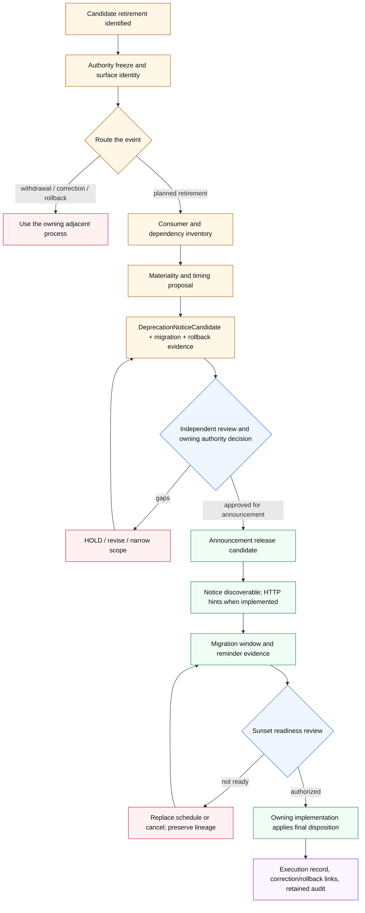

<!-- [KFM_META_BLOCK_V2]
doc_id: kfm://doc/governance/deprecation-process
title: Deprecation Process
type: governance-standard-candidate; planned-retirement-process; repository-reconciled
authority_class: human-readable-governance-guidance
version: v1.1-draft
status: draft; repository-reconciled; non-enforcing; implementation-incomplete
owners:
  - UNKNOWN — governance steward assignment is not verified
  - UNKNOWN — release authority assignment is not verified
created: 2026-05-12
updated: 2026-08-23
owning_root: docs/
responsibility: Explain the proposed, reviewable, and reversible process for planned retirement of governed KFM surfaces without turning documentation, a register row, validation, a pull request, or a merge into deprecation authority.
policy_label: public; governance; deprecation; release-adjacent; correction-aware
truth_posture: CONFIRMED current repository inventory and RFC syntax; PROPOSED operating policy, notice family, timing defaults, and post-sunset behavior; UNKNOWN runtime enforcement and operational ownership; NEEDS VERIFICATION adoption, schemas, validators, workflows, and release wiring
evidence_snapshot:
  repository: bartytime4life/Kansas-Frontier-Matrix
  base_ref: 0d2c9db88861be1ba2c32b60daea7bab3a5d4ab9
  target_blob_before_change: f41804398adca34200b629cc6c73718e177f9464
  inspected:
    - docs/adr/ADR-0029-adopt-directory-governance-standard-v2.md
    - docs/doctrine/directory-rules.md
    - docs/governance/README.md
    - docs/governance/SEPARATION_OF_DUTIES.md
    - docs/registers/DEPRECATION.md
    - control_plane/deprecation_register.yaml
    - contracts/release/api_contract_change_assessment.md
    - schemas/contracts/v1/release/api_contract_change_assessment.schema.json
    - tools/validators/release/validate_api_contract_change_assessment.py
    - docs/architecture/publication/RELEASE_GATES.md
    - docs/runbooks/PROMOTION_RUNBOOK.md
    - docs/runbooks/RELEASE_DRY_RUN.md
    - docs/runbooks/ROLLBACK_RUNBOOK.md
    - docs/runbooks/EVIDENCE_CORRECTION.md
    - docs/runbooks/SENSITIVITY_ESCALATION.md
external_standards_checked:
  - RFC 9745 — Deprecation HTTP Response Header Field
  - RFC 8594 — Sunset HTTP Header Field
  - RFC 5829 — successor-version link relation
related:
  - ./README.md
  - ./CONTRADICTION_HANDLING.md
  - ./SEPARATION_OF_DUTIES.md
  - ../registers/DEPRECATION.md
  - ../../control_plane/deprecation_register.yaml
  - ../../contracts/release/api_contract_change_assessment.md
  - ../../schemas/contracts/v1/release/api_contract_change_assessment.schema.json
  - ../architecture/publication/RELEASE_GATES.md
  - ../runbooks/PROMOTION_RUNBOOK.md
  - ../runbooks/RELEASE_DRY_RUN.md
  - ../runbooks/ROLLBACK_RUNBOOK.md
  - ../runbooks/EVIDENCE_CORRECTION.md
  - ../runbooks/SENSITIVITY_ESCALATION.md
  - ../doctrine/lifecycle-law.md
  - ../doctrine/corrections-first-class.md
  - ../doctrine/evidence-first.md
  - ../doctrine/policy-aware.md
  - ../doctrine/authority-ladder.md
  - ../doctrine/ai-as-assistant.md
  - ../doctrine/derived-stays-derived.md
  - ../doctrine/trust-membrane.md
  - ../doctrine/time-aware.md
non_effects:
  - does_not_adopt_a_deprecation_policy
  - does_not_assign_governance_or_release_authority
  - does_not_create_or_approve_a_DeprecationNotice_object_family
  - does_not_populate_or_operationalize_the_deprecation_register
  - does_not_emit_HTTP_headers_or_change_runtime_behavior
  - does_not_deprecate_retire_archive_move_rename_or_delete_any_surface
  - does_not_release_deploy_promote_publish_or_change_repository_settings
tags: [kfm, governance, deprecation, sunset, retirement, migration, correction, rollback, provenance, release]
[/KFM_META_BLOCK_V2] -->

<a id="deprecation-process"></a>

# Deprecation Process

> **How Kansas Frontier Matrix proposes, reviews, announces, migrates, sunsets, and preserves the audit history of a planned retirement without confusing notice, validation, repository state, release, or publication authority.**


| Field | Current bounded result |
|---|---|
| Document state | **PROPOSED** governance-standard candidate; this page is not adopted policy or enforcement. |
| Placement | **CONFIRMED** same-path fit under `docs/governance/` by accepted ADR-0029 and Directory Rules responsibility-root doctrine. |
| Machine register | **CONFIRMED path presence** at `control_plane/deprecation_register.yaml`; **PROPOSED**, empty, projection-only, and `implementation_status: ABSENT`. |
| Human register guide | **CONFIRMED path presence** at `docs/registers/DEPRECATION.md`; draft explanatory surface, not retirement authority by itself. |
| Notice object family | **ABSENT / NEEDS VERIFICATION.** No canonical `DeprecationNotice` semantic contract, dedicated schema, fixture set, validator, or conformance test was found in the inspected snapshot. |
| Bounded related implementation | **CONFIRMED.** `ApiContractChangeAssessmentCandidate` has a fixture-only `deprecation_notice_ref` requirement when an API change declares deprecation. That reference slot does not create or approve a notice. |
| HTTP middleware and post-sunset behavior | **UNKNOWN.** No current runtime proof was found for header emission, notice resolution, scheduled transition, or status-code behavior. |
| Timing policy | **PROPOSED.** The prior text's claimed repository-wide 90-day authority was not found outside this file. Adoption requires a current accepted decision or policy surface. |
| Owners and separation of duties | **UNKNOWN / HOLD.** Current governance role assignments and operational release-duty enforcement are not verified. |

> [!IMPORTANT]
> **Reading rule.** Uppercase requirement words in this page describe the proposed KFM process unless a paragraph explicitly identifies a requirement from an accepted repository authority or an external RFC. They do not prove that KFM currently enforces the rule.

> [!CAUTION]
> **Deprecation is not a commit property.** A file, route, schema, layer, connector, or release is not deprecated merely because a document says so, a register row exists, a validator passes, a pull request merges, or a badge changes. Planned retirement requires the owning authority object, consumer impact evidence, review, a migration and rollback path, and the release transition appropriate to the surface.

---

## Contents

1. [Purpose & scope](#1-purpose--scope)
2. [The proposed operating rule](#2-the-proposed-operating-rule)
3. [Definitions — deprecation vs. withdrawal vs. supersession vs. rollback vs. correction](#3-definitions--deprecation-vs-withdrawal-vs-supersession-vs-rollback-vs-correction)
4. [The deprecation surface — what may be deprecable](#4-the-deprecation-surface--what-may-be-deprecable)
5. [Materiality and review classes](#5-materiality-and-review-classes)
6. [Timing model and proposed notice window](#6-timing-model-and-proposed-notice-window)
7. [The proposed deprecation lifecycle](#7-the-proposed-deprecation-lifecycle)
8. [The proposed `DeprecationNoticeCandidate`](#8-the-proposed-deprecationnoticecandidate)
9. [HTTP headers and machine-discoverable signals](#9-http-headers-and-machine-discoverable-signals)
10. [Discoverability and consumer communication](#10-discoverability-and-consumer-communication)
11. [Audit, provenance, and register boundaries](#11-audit-provenance-and-register-boundaries)
12. [Relationship to other doctrines and responsibility roots](#12-relationship-to-other-doctrines-and-responsibility-roots)
13. [Roles and separation of duties](#13-roles-and-separation-of-duties)
14. [Cardinal rules and anti-patterns](#14-cardinal-rules-and-anti-patterns)
15. [Authoring, graduation, and validation checklists](#15-authoring-graduation-and-validation-checklists)
16. [Worked examples](#16-worked-examples)
17. [FAQ](#17-faq)
18. [Related repository surfaces](#18-related-repository-surfaces)
19. [Appendix — candidate shape, validation, rollback, and open verification](#19-appendix--candidate-shape-validation-rollback-and-open-verification)

---

## 1. Purpose & scope

KFM preserves a governed lifecycle:

```text
RAW -> WORK / QUARANTINE -> PROCESSED -> CATALOG / TRIPLET -> PUBLISHED
```

Promotion is a governed state transition, not a file move. The reverse direction deserves the same discipline. When a public or otherwise relied-upon surface is intentionally moving toward retirement, consumers need enough information to identify the affected surface, understand the schedule, migrate to a successor or accept that none exists, and inspect the decision and correction lineage later.

This document therefore defines a **repository-reconciled candidate process** for planned retirement. Its central concern is not deletion. It is preservation of identity, consumer notice, evidence, review, compatibility, correction, and rollback while the owning surface moves through a bounded transition.

### 1.1 In scope

The process may apply to a surface that has acquired a stable identity and a real downstream dependency, including:

- public or steward API contracts and routes;
- versioned schemas and semantic contracts;
- released map layers, tile products, datasets, styles, and manifests;
- admitted source interfaces and connectors;
- policy bundles or validators with dependent callers;
- package or adapter interfaces;
- runbooks and governance documents that other repository surfaces treat as authority;
- compatibility roots, mirrors, or aliases governed by Directory Rules;
- released artifacts whose planned end of service is known in advance.

### 1.2 Out of scope

Use another mechanism when the primary event is:

- **immediate harm prevention, rights revocation, sensitivity escalation, or integrity failure** — use withdrawal, revocation, quarantine, or correction;
- **a published error** — use correction and, where needed, rollback;
- **an operational incident** — use rollback or incident response;
- **a new release replacing an old release without an end-of-service decision** — use supersession lineage;
- **unpublished candidate cleanup** — use ordinary feature-branch deletion or migration discipline;
- **internal scratch cleanup** under WORK or other non-public temporary surfaces;
- **a structural move** — follow Directory Rules migration requirements; add deprecation only when a compatibility window or downstream retirement decision is actually needed.

> [!NOTE]
> A rename or move can require both a migration record and a deprecation record, but they are not the same object. Migration explains how bytes or ownership move. Deprecation explains how an old identity or behavior leaves service for consumers.

[Back to top](#deprecation-process)

---

## 2. The proposed operating rule

> [!IMPORTANT]
> **PROPOSED default:** A planned retirement of a governed KFM surface should be identity-bound, evidence-backed, announced before its effective deprecation, paired with a migration or explicit no-successor rationale, discoverable from the affected surface, reviewed in proportion to materiality, linked to release/correction/rollback context, and preserved as append-only lineage after sunset.

The prior edition stated a 90-day floor as confirmed repository policy. Current repository inspection did not find that authority outside this page. This revision therefore preserves **90 calendar days as a conservative proposed default**, not as a current accepted rule.

The process must keep these states separate:

| State | What it means | What it does not mean |
|---|---|---|
| Proposed retirement | Someone has identified a candidate surface and rationale. | The surface is not yet deprecated. |
| Reviewed notice candidate | The packet is coherent enough for human decision. | Review or schema validation is not approval. |
| Announced | Consumers can inspect the planned transition. | Announcement alone does not change runtime behavior or release state. |
| Deprecated | The surface is no longer recommended, but may still operate. | It is not necessarily unavailable. |
| Sunset scheduled | A future point of likely unavailability is declared. | The status code or final disposition is not implied by the timestamp alone. |
| Sunset executed | The owning implementation applies its approved final disposition. | A register edit does not execute the transition. |
| Retired / archived | The old surface is no longer offered as an active dependency; lineage remains inspectable. | Audit, correction, and historical resolution are not deleted. |

[Back to top](#deprecation-process)

---

## 3. Definitions — deprecation vs. withdrawal vs. supersession vs. rollback vs. correction

KFM must route a change by its actual trigger rather than by whichever word seems convenient.

| Mechanism | Trigger | Timing | Expected public effect | Owning evidence |
|---|---|---|---|---|
| **Deprecation** | Planned reduction in recommendation or planned retirement of a stable surface. | Announced schedule; proposed default window in §6. | Surface may continue to work while carrying notice and migration guidance. | Proposed notice object plus owning review/release evidence. |
| **Withdrawal / revocation** | Rights, sovereignty, sensitivity, safety, or integrity requires exposure to stop. | Immediate or as fast as the governing obligation requires. | Public exposure is removed or constrained; reason and correction path remain visible at the appropriate access level. | Correction, withdrawal, policy, or sensitivity decision. |
| **Supersession** | A newer version or release replaces a predecessor while predecessor lineage remains inspectable. | Release-defined. | Old and new identities are linked; the old surface may or may not also receive a future sunset. | Release/supersession lineage. |
| **Rollback** | A release or pointer must revert because the current state is defective or unsafe. | Operational incident window. | Public references return to a named prior safe state; affected derivatives are invalidated or rebuilt. | Rollback card/decision, correction notice, and release evidence. |
| **Correction** | A published claim, artifact, layer, or document is wrong, disputed, stale, or otherwise requires amendment. | Severity- and policy-driven. | Error and corrective lineage become visible; a corrected candidate follows normal gates. | Correction notice and evidence. |
| **Migration** | Responsibility, path, schema home, or implementation moves while compatibility is managed. | Change-plan-defined. | Canonical ownership changes; mirrors or aliases may exist temporarily. | ADR/migration manifest/rollback plan as required by Directory Rules. |

### 3.1 Routing test

Use these questions in order:

1. **Must exposure stop now because of rights, safety, sensitivity, or integrity?** Use withdrawal/revocation/correction, not deprecation.
2. **Is current public state defective and should a prior safe release be restored?** Use rollback.
3. **Is the change only a new version with preserved predecessor lineage?** Record supersession; add deprecation only when end-of-service is actually planned.
4. **Is an old identity or behavior being intentionally phased out?** Use deprecation.
5. **Is only a path or responsibility moving?** Use migration; add deprecation only for a consumer-visible old surface.

> [!CAUTION]
> Ambiguous routing is a **HOLD**, not permission to choose the slowest or least disruptive word. Continued unsafe exposure cannot be justified by calling a required withdrawal a deprecation.

### 3.2 EvidenceBundle identity

An immutable `EvidenceBundle.bundle_id` should not be treated as a deprecable runtime interface. New evidence, correction, supersession, withdrawal, or redaction produces explicit lineage while the old identity remains inspectable subject to access policy. Retiring a carrier that refers to an EvidenceBundle does not retire the evidence object itself.

[Back to top](#deprecation-process)

---

## 4. The deprecation surface — what may be deprecable

A surface is a deprecation candidate when all of the following are true:

1. It has a stable identity or contract.
2. At least one downstream consumer may reasonably depend on it.
3. The owning responsibility root can name the retirement decision and final disposition.
4. The change is planned rather than an immediate withdrawal or incident rollback.
5. Historical resolution, correction, and audit requirements can be preserved.

| Surface family | Stable identity examples | Likely successor form | Required boundary note |
|---|---|---|---|
| HTTP API | route + media/profile/version contract | versioned route or compatible alternate resource | Headers are hints; owning API contract and release decision govern behavior. |
| Semantic contract | contract ID + version | new contract version | Meaning belongs under `contracts/`; prose in this page cannot redefine it. |
| JSON Schema | `$id` + version | new `$id` | Shape belongs under `schemas/`; old schema treatment must be explicit. |
| Map layer / style / tiles | manifest identity + release | successor manifest(s) | Carrier retirement must not be described as evidence retirement. |
| Dataset version | dataset/version identity | next dataset version or no successor | Observation time, release time, and deprecation time remain distinct. |
| Source interface / connector | descriptor/interface ID + implementation version | successor interface/connector | Source admission and source retirement are separate decisions. |
| Policy bundle / validator | stable rule/tool identity + digest/version | successor rule/tool | Validation success is not policy or release authority. |
| Package / adapter | package and public interface version | successor interface | Internal callers and external consumers must be inventoried separately. |
| Runbook / governance doc | path + stable document ID | successor document or retained archive | Doctrine/governance retirement may require an accepted ADR. |
| Compatibility root / mirror | path + declared compatibility class | canonical destination | Directory Rules migration and deprecation register lineage both apply. |

### 4.1 Not deprecable merely by association

The following do not become deprecated just because a carrier or presentation surface is retired:

- source bytes or canonical evidence referenced by a retired layer;
- a claim whose only affected component is a UI presentation;
- historical receipts and proof objects;
- correction, withdrawal, supersession, or rollback records;
- old release manifests needed for audit and rollback;
- deterministic identities needed to resolve lineage.

[Back to top](#deprecation-process)

---

## 5. Materiality and review classes

The following classes are **PROPOSED review heuristics**. They do not assign authority or override accepted review policy.

| Class | Typical change | Proposed timing posture | Review posture |
|---|---|---|---|
| **D-routine** | Internal tool or fixture with bounded, verified consumers; non-breaking successor. | 90 days by default; shorter only when accepted policy expressly permits it. | Owning maintainer plus independent reviewer where current governance requires. |
| **D-significant** | Public API version, breaking schema, released layer identity, admitted connector interface. | At least 90 days proposed; lengthen for external rebuild burden. | Owning steward, consumer-impact reviewer, and release review. |
| **D-major** | Cross-cutting contract family, policy bundle, shared public interface, multiple releases or domains. | 180 days recommended as a planning default, not a current mandate. | Accepted ADR or equivalent authority decision plus independent review and rollback evidence. |
| **D-doctrine** | Retirement or consolidation of doctrine/governance authority. | At least 90 days proposed; preserve anchors and predecessor content. | Accepted ADR and current governance review route. |
| **D-emergency phase-out** | A controlled phase-out is safer than abrupt withdrawal, but the ordinary window cannot be met. | Shortest defensible window; rationale and rejected alternatives recorded. | Security/rights/sensitivity and release decision makers identified by current accepted authority. |

> [!WARNING]
> `D-emergency` is not an escape hatch for missing planning. When immediate exposure is unsafe, use withdrawal. When the only justification is schedule pressure, keep the ordinary process or record an explicit governance exception through accepted authority.

### 5.1 Materiality factors

Classify using evidence, not intuition:

- number and type of internal and external consumers;
- whether the change alters meaning, identity, shape, policy, access, or only presentation;
- public, steward-only, or internal exposure;
- rights, sensitivity, sovereignty, living-person, genomic, archaeological, rare-species, infrastructure, or land/title implications;
- migration complexity and availability of a tested successor;
- reversibility and rollback readiness;
- correction and audit impact;
- low-connectivity, accessibility, and offline consumers;
- whether a stable external standard constrains the transition.

[Back to top](#deprecation-process)

---

## 6. Timing model and proposed notice window

Deprecation needs more than one timestamp. Conflating announcement, effective deprecation, and sunset creates ambiguous headers and misleading audit.

| Time | Meaning | Required relationship |
|---|---|---|
| `proposal_opened_at` | Candidate packet first exists. | No runtime or publication effect. |
| `announcement_at` | Reviewed notice becomes discoverable to consumers. | Should precede or equal `deprecation_at`. |
| `deprecation_at` | Resource becomes formally deprecated / no longer recommended. | RFC 9745 `Deprecation` value for HTTP surfaces. |
| `reminder_at[]` | Scheduled consumer reminders and migration checkpoints. | Falls after announcement and before sunset. |
| `sunset_at` | Resource is expected to become unresponsive or enter another final disposition. | For HTTP, must not be earlier than `deprecation_at`. |
| `executed_at` | Owning implementation actually applies the final disposition. | Recorded after execution; must not be inferred from the planned date. |
| `recorded_at` | Audit record entered or updated by append-only successor record. | Preserves transaction time separately. |

### 6.1 Proposed default window

Until an accepted KFM policy or ADR says otherwise:

- use **90 calendar days from `announcement_at` to `sunset_at`** as the conservative planning default;
- announce before the effective deprecation when practical;
- lengthen the window when consumer migration, procurement, accessibility, low-connectivity, or release cadence requires it;
- do not call 90 days a confirmed repository mandate;
- do not shorten the window without named authority, rationale, consumer-impact evidence, and a tested migration or withdrawal alternative.

### 6.2 Reminder checkpoints

A candidate schedule should include at least one mid-window reminder. A longer or more material transition may use:

- announcement;
- midpoint health check;
- 30-day reminder;
- 7-day operational readiness check;
- sunset execution and audit confirmation.

These are proposed operational checkpoints. No inspected workflow currently proves their automation.

### 6.3 Schedule changes and cancellation

Once a reviewed notice has been emitted as a governed object, do not silently rewrite its historical schedule. Prefer an append-only replacement record that references the predecessor and explains:

- old and new dates;
- reason for the change;
- consumer impact;
- whether migration evidence changed;
- whether the successor changed;
- whether the original notice remains discoverable.

Cancellation uses the same pattern: a new decision supersedes the planned retirement; the historical notice remains inspectable.

[Back to top](#deprecation-process)

---

## 7. The proposed deprecation lifecycle


```mermaid
flowchart TD
    A[Candidate retirement identified] --> B[Authority freeze and surface identity]
    B --> C{Route the event}
    C -- withdrawal / correction / rollback --> X[Use the owning adjacent process]
    C -- planned retirement --> D[Consumer and dependency inventory]
    D --> E[Materiality and timing proposal]
    E --> F[DeprecationNoticeCandidate + migration + rollback evidence]
    F --> G{Independent review and owning authority decision}
    G -- gaps --> H[HOLD / revise / narrow scope]
    H --> F
    G -- approved for announcement --> I[Announcement release candidate]
    I --> J[Notice discoverable; HTTP hints when implemented]
    J --> K[Migration window and reminder evidence]
    K --> L{Sunset readiness review}
    L -- not ready --> M[Replace schedule or cancel; preserve lineage]
    M --> K
    L -- authorized --> N[Owning implementation applies final disposition]
    N --> O[Execution record, correction/rollback links, retained audit]

    classDef proposal fill:#fff7e6,stroke:#b45309,color:#111;
    classDef review fill:#eff6ff,stroke:#2563eb,color:#111;
    classDef hold fill:#fff1f2,stroke:#be123c,color:#111;
    classDef active fill:#f0fdf4,stroke:#15803d,color:#111;
    classDef audit fill:#faf5ff,stroke:#7e22ce,color:#111;
    class A,B,C,D,E,F proposal;
    class G,L review;
    class H,M,X hold;
    class I,J,K,N active;
    class O audit;
```

The diagram is a proposed control flow, not proof of current automation.

### 7.1 Authority freeze

Before drafting the change, capture:

- exact base commit and target blob/digest;
- accepted ADRs and Directory Rules relevant to the surface;
- owning contract, schema, policy, release, source, or domain root;
- current consumers, mirrors, aliases, generated projections, and open PRs;
- current review and release authority evidence;
- rollback and correction surfaces;
- external standards that constrain behavior.

### 7.2 Dependency closure

A coherent deprecation change closes direct dependencies needed to make the notice truthful. Depending on the surface, that can include:

- successor documentation and migration guide;
- compatibility adapter or redirect plan;
- client fixtures and conformance tests;
- register projection and release linkage;
- notice rendering and header middleware;
- Evidence Drawer or UI state;
- archive/tombstone behavior;
- correction and rollback references;
- documentation and changelog links.

Unknown optional relationships may be disclosed as follow-up work. Unknown direct consumers are a HOLD.

### 7.3 Announcement is not sunset

The announcement transition communicates intent. The sunset transition changes availability or another operational disposition. They require separate evidence and must not be collapsed into one unreviewed action.

### 7.4 After sunset

The owning surface defines the approved final disposition. Possible dispositions include:

- retained read-only historical resolution;
- redirect or explicit successor response;
- `410 Gone` for a retired HTTP resource;
- `ABSTAIN` or `DENY` in a governed runtime envelope;
- frozen schema resolution with rejection of new references;
- manifest lifecycle state change;
- adapter refusal for new calls;
- archived documentation with stable successor banner.

No RFC or this document makes one disposition universal. The notice candidate must name the intended behavior and the evidence that it was tested.

[Back to top](#deprecation-process)

---

## 8. The proposed `DeprecationNoticeCandidate`

No canonical `DeprecationNotice` family was found in the inspected repository snapshot. This section therefore defines a **candidate packet**, not an adopted object.

A future accepted implementation should keep semantic meaning, machine shape, policy, validators, emitted records, and release state in their own responsibility roots. Based on current release-adjacent precedent, the likely placement is:

| Responsibility | PROPOSED home | Why |
|---|---|---|
| Semantic meaning | `contracts/release/` | Planned retirement changes a released or relied-upon interface. |
| Machine shape | `schemas/contracts/v1/release/` | Current schema-home convention; exact family requires review. |
| Synthetic fixtures | `fixtures/contracts/v1/release/` | No-network valid and invalid replay. |
| Reusable validation | `tools/validators/release/` | Validation is not release approval. |
| Executable conformance proof | `tests/validators/release/` | Tests prove bounded behavior only. |
| Human process | `docs/governance/` | This page explains governance and review. |
| Operator procedure | `docs/runbooks/` | A dedicated deprecation execution runbook is currently absent. |
| Machine projection | `control_plane/deprecation_register.yaml` | Index only; must reference owning objects and remain non-authoritative by itself. |
| Emitted release/correction/audit objects | current `release/` and governed lifecycle homes | Exact paths require current object-family and Directory Rules review. |

> [!IMPORTANT]
> This placement is **PROPOSED**, not permission to create a parallel notice, register, release, or receipt authority. A future implementation must reconcile `docs/registers/DEPRECATION.md`, the empty control-plane projection, current release object families, and any active ADR or migration.

### 8.1 Candidate field groups

A complete candidate should carry, at minimum:

| Group | Candidate fields | Purpose |
|---|---|---|
| Identity | `notice_id`, `subject_type`, `subject_ref`, `subject_version_or_digest` | Prevent ambiguous or path-only retirement. |
| Status | `candidate_state`, `authority_state`, `release_state` | Keep drafting, approval, and publication separate. |
| Time | `proposal_opened_at`, `announcement_at`, `deprecation_at`, `sunset_at`, `executed_at`, `recorded_at` | Preserve time kinds and RFC semantics. |
| Rationale | `reason_code`, `reason_summary`, `evidence_refs`, `limitations` | Cite or abstain on material reasons. |
| Consumer impact | `consumer_inventory_ref`, `impact_class`, `affected_releases`, `affected_surfaces` | Make dependency burden inspectable. |
| Successor | `successor_refs[]`, `successor_relation`, `no_successor_rationale` | Support one-to-one, split, merge, or no-successor cases. |
| Migration | `migration_guide_ref`, `compatibility_ref`, `client_fixture_refs[]` | Prove the transition is buildable. |
| Review | `review_refs[]`, `decision_ref`, `authority_ref`, `separation_of_duties_ref` | Keep human authority explicit. |
| Release | `announcement_release_ref`, `sunset_release_ref`, `post_sunset_behavior` | Bind communication and execution to release state. |
| Correction / rollback | `correction_refs[]`, `rollback_ref`, `cancellation_or_replacement_ref` | Preserve reversible change and append-only lineage. |
| Discoverability | `notice_uri`, `http_signal_profile`, `non_http_signal_refs[]` | Make the transition visible to affected consumers. |
| Integrity | `spec_hash`, `content_digest`, `generated_receipt_ref` | Support deterministic identity and reproducibility. |
| Non-effects | fixed-false authority claims | Prevent validation from masquerading as approval, release, or publication. |

### 8.2 Candidate states

A future schema should use finite states such as:

```text
DRAFT -> REVIEWABLE -> APPROVED_FOR_ANNOUNCEMENT -> ANNOUNCED
      -> DEPRECATED -> READY_FOR_SUNSET -> SUNSET_EXECUTED -> RETIRED
```

Side transitions should include:

```text
DRAFT / REVIEWABLE -> HOLD | DENY
ANNOUNCED / DEPRECATED -> REPLACED_SCHEDULE | CANCELLED
ANY STATE -> ERROR when safe evaluation is impossible
```

The exact vocabulary remains PROPOSED. State transitions must reference the owning decision rather than deriving authority from the register.

### 8.3 Bounded current implementation

`contracts/release/api_contract_change_assessment.md` and its paired schema/validator/fixtures/tests currently provide a narrow, fixture-only check: when an API change declares deprecation, a `deprecation_notice_ref` must be present. That proves only local packet coherence under that candidate profile. It does not prove that the referenced notice exists, is accepted, is discoverable, or has been released.

[Back to top](#deprecation-process)

---

## 9. HTTP headers and machine-discoverable signals

This section distinguishes **external standard requirements** from **PROPOSED KFM policy**.

### 9.1 RFC 9745 `Deprecation`

[RFC 9745](https://www.rfc-editor.org/rfc/rfc9745.html) defines the `Deprecation` HTTP response header field.

**External standard facts:**

- The field signals that the resource in the response context will be or has been deprecated.
- Its value is an Item Structured Field Date, for example `Deprecation: @1688169599`.
- The date can be in the future or the past.
- Deprecation itself does not change resource behavior.
- The `deprecation` link relation can point to human- or machine-readable documentation.
- By default, the signal applies to the resource returning it. Broader API scope must be documented and remains invisible to unaware clients.

**PROPOSED KFM use:**

- `Deprecation` should equal the notice's `deprecation_at`, not automatically `announcement_at`.
- Every header should resolve through a `Link` with `rel="deprecation"` to a stable notice representation.
- A notice should identify its scope explicitly: one resource, a route family, a media profile, or another bounded set.
- Header emission must be tested against the exact runtime/framework serializer before any implementation claim.

### 9.2 RFC 8594 `Sunset`

[RFC 8594](https://www.rfc-editor.org/rfc/rfc8594.html) defines the `Sunset` response header and `sunset` link relation.

**External standard facts:**

- `Sunset` indicates that a URI is likely to become unresponsive at a specified future point.
- The value is an HTTP-date.
- It is appropriate for a decommissioning stage, not merely for “not preferred anymore.”
- The header is a hint; it does not prescribe a universal status code after the date.
- RFC 9745 requires the `Sunset` timestamp not to be earlier than the `Deprecation` timestamp when both are emitted.

**PROPOSED KFM use:**

- Emit `Sunset` only when an operational end-of-service or other unavailability disposition is actually planned.
- Link to a `sunset` policy or the deprecation notice when useful.
- Record the intended post-sunset behavior in the notice candidate and test it separately.

### 9.3 Successor links

[RFC 5829](https://www.rfc-editor.org/rfc/rfc5829.html) defines `successor-version` for navigation to a successor version.

Use it only when the relation is genuinely a version successor. A split layer, merged schema family, alternate service, or no-successor retirement may need multiple notice-level successor references rather than a misleading single `successor-version` link.

### 9.4 Illustrative HTTP response

```http
HTTP/1.1 200 OK
Content-Type: application/json
Deprecation: @<structured-field-date>
Sunset: <HTTP-date-not-earlier-than-deprecation>
Link: <https://example.invalid/notices/<notice-id>>; rel="deprecation"; type="text/html"
Link: <https://example.invalid/example/v2/resource>; rel="successor-version"
```

This example is illustrative. It is not evidence that a KFM route emits these fields.

### 9.5 Non-HTTP signals

A non-HTTP carrier may expose a machine-readable deprecation reference in its owning manifest or contract. Possible candidate fields include:

- schema annotation plus successor reference;
- layer/tileset manifest lifecycle state and notice reference;
- connector status output;
- package metadata and migration guide;
- runbook or doctrine banner with stable successor link;
- governed runtime envelope obligation or warning.

Exact field names must come from accepted owning contracts and schemas. This page does not create extension keywords.

[Back to top](#deprecation-process)

---

## 10. Discoverability and consumer communication

A transition is not governed when the people and systems affected by it cannot find the notice.

### 10.1 Proposed discoverability invariant

> A consumer inspecting an affected surface should be able to reach a stable notice through the surface's normal machine or human interface, without relying on repository archaeology.

Potential channels include:

| Channel | Appropriate for | Boundary |
|---|---|---|
| Stable notice URI | Public or steward-visible deprecation | Must preserve access classification and integrity. |
| `Deprecation` / `Sunset` / `Link` headers | HTTP-addressable resources | Header scope and serialization require runtime tests. |
| Changelog or release notes | Repository and release consumers | Human carrier; not owning authority. |
| Migration guide | Breaking or semantic transition | Must be versioned with the affected contract. |
| Layer/Evidence Drawer state | Released map or dataset carrier | UI is downstream of the manifest and policy decision. |
| Steward or integrator notification | Material external dependencies | Delivery receipt does not prove comprehension or migration. |
| Package or schema registry annotation | Versioned machine interface | Exact shape requires accepted contract/schema. |
| Successor backlink | Replacement surface | Helps consumers reconstruct predecessor lineage. |

The prior edition required “at least three channels” as a universal rule. Current evidence does not establish that threshold. Channel count should be selected by materiality and consumer type, while the notice remains directly discoverable from the affected surface.

### 10.2 Communication content

A public-facing notice should explain:

- exact affected identity and scope;
- what remains unaffected;
- announcement, effective deprecation, and sunset times;
- reason and evidence appropriate to the audience;
- successor(s), no-successor rationale, or withdrawal path;
- migration steps and compatibility limits;
- support/contact route without inventing an unassigned owner;
- expected post-sunset behavior;
- correction, schedule replacement, and rollback links;
- access, rights, sensitivity, or sovereignty constraints.

### 10.3 Accessibility and low-connectivity

Material notices should remain usable without requiring a heavy map or JavaScript application. Provide a stable text representation, clear dates, meaningful link text, and a machine-readable representation when an accepted schema exists.

[Back to top](#deprecation-process)

---

## 11. Audit, provenance, and register boundaries

Deprecation audit should preserve the same distinctions KFM applies elsewhere: receipt is not proof; validation is not authority; projection is not owning truth; release is not publication by accident.

### 11.1 Current register evidence

At the inspected snapshot, `control_plane/deprecation_register.yaml` declares:

- `status: PROPOSED`;
- `authority_mode: projection_only`;
- `implementation_status: ABSENT`;
- `completeness: empty`;
- `owner_role: UNKNOWN`;
- `entries: []`;
- explicit non-effects including no authority creation, no retirement/deletion, and no release/deployment/publication.

Its `base_ref` predates the current main checkpoint. That is not an error by itself, but it means the projection is not a current complete inventory.

> [!IMPORTANT]
> A future register entry should index an owning notice/decision and relevant migration/release/correction/rollback objects. The register must not become the only place where the retirement decision exists.

### 11.2 Proposed audit invariants

| Invariant | Proposed requirement | Failure posture |
|---|---|---|
| Named subject | Stable subject identity, version/digest, and owning root are recorded. | HOLD on ambiguity. |
| Append-only lineage | Emitted notices are replaced through forward links, not silently edited. | ERROR on history loss. |
| Evidence closure | Material external reasons resolve through EvidenceRef/EvidenceBundle or equivalent accepted evidence. | ABSTAIN / HOLD when unresolved. |
| Consumer inventory | Direct internal and known external consumers are recorded with limitations. | HOLD when direct dependencies are unknown. |
| Decision linkage | Review and authority references are explicit. | DENY any claim of approval without evidence. |
| Release linkage | Announcement and sunset execution identify their release state when applicable. | Do not infer release from docs or merge. |
| Correction and rollback | Public consequence has a correction path and rollback or cancellation strategy. | HOLD public transition without recovery. |
| Retention | Notice, predecessor, successor, and correction lineage remain inspectable subject to rights and access policy. | DENY silent audit deletion. |
| Projection integrity | Human notice, machine register, and owning objects agree or expose drift. | Open contradiction/correction; do not smooth over it. |

### 11.3 Receipts and proofs

A generated receipt may show that a notice was rendered, headers were tested, an email was queued, or a register was compiled. It does not prove:

- that the reason is authoritative;
- that consumers migrated;
- that rights/sensitivity review passed;
- that release was approved;
- that sunset occurred;
- that publication or deployment changed.

[Back to top](#deprecation-process)

---

## 12. Relationship to other doctrines and responsibility roots

### 12.1 Doctrine relationships

| Repository surface | Relationship to planned retirement |
|---|---|
| [`lifecycle-law.md`](../doctrine/lifecycle-law.md) | Keeps lifecycle state and audit transitions explicit; deprecation is not an ungoverned file move. |
| [`corrections-first-class.md`](../doctrine/corrections-first-class.md) | Owns reactive correction and helps distinguish planned retirement from wrong or unsafe public state. |
| [`evidence-first.md`](../doctrine/evidence-first.md) | Material reasons cite resolvable evidence or remain bounded/abstained. |
| [`policy-aware.md`](../doctrine/policy-aware.md) | Rights, sensitivity, source terms, and access policy can force withdrawal instead of deprecation. |
| [`authority-ladder.md`](../doctrine/authority-ladder.md) | Determines which adopted authority can approve a doctrine, contract, or policy retirement. |
| [`ai-as-assistant.md`](../doctrine/ai-as-assistant.md) | AI may draft and summarize; it does not become the deciding authority. |
| [`derived-stays-derived.md`](../doctrine/derived-stays-derived.md) | Retiring a carrier does not retire canonical evidence. |
| [`trust-membrane.md`](../doctrine/trust-membrane.md) | Public surfaces remain downstream of evidence, policy, review, and release state throughout the window. |
| [`time-aware.md`](../doctrine/time-aware.md) | Keeps announcement, validity, effective, sunset, execution, correction, and transaction time distinct. |
| [`CONTRADICTION_HANDLING.md`](./CONTRADICTION_HANDLING.md) | Resolves conflicts between external standards, repo objects, or competing authority before retirement proceeds. |

### 12.2 Directory Rules basis

Accepted ADR-0029 places this human-readable governance process under `docs/governance/`. Adjacent artifacts follow responsibility rather than topic:

```text
docs/governance/                         human governance guidance
contracts/release/                       semantic meaning of a release-adjacent notice family (PROPOSED)
schemas/contracts/v1/release/            machine shape (PROPOSED)
fixtures/contracts/v1/release/           synthetic replay (PROPOSED)
tools/validators/release/                reusable validation (PROPOSED)
tests/validators/release/                executable conformance proof (PROPOSED)
docs/runbooks/                           operator procedure (dedicated deprecation runbook ABSENT)
control_plane/deprecation_register.yaml  machine projection; currently empty and non-authoritative
release/ and governed lifecycle roots    emitted decisions, manifests, corrections, rollback, audit as accepted
```

Do not create parallel `deprecations/`, `sunsets/`, `notices/`, `registries/`, `proofs/`, or `release/` homes without an accepted ADR or migration note.

### 12.3 Documentation does not substitute for implementation

Updating this page can improve truth and usability, but it cannot:

- instantiate a notice object;
- assign authority;
- wire a header;
- schedule a job;
- populate a register;
- move a lifecycle pointer;
- invalidate a cache;
- release, deploy, or publish anything.

[Back to top](#deprecation-process)

---

## 13. Roles and separation of duties

The repository contains `docs/governance/SEPARATION_OF_DUTIES.md`, but its role matrix and tooling posture remain draft/PROPOSED. This page therefore names **responsibilities**, not current assigned people or proven enforcement.

| Responsibility | Required contribution | Current status |
|---|---|---|
| Subject owner | Identifies stable subject, current behavior, consumers, successor, and migration. | Assignment varies; NEEDS VERIFICATION per surface. |
| Governance reviewer | Confirms routing, materiality, doctrine fit, and no authority collapse. | UNKNOWN assignment. |
| Release reviewer / authority | Decides announcement and sunset release transitions. | UNKNOWN assignment; docs cannot self-assign it. |
| Security / rights / sensitivity reviewer | Determines whether emergency phase-out is permissible or withdrawal is required. | Context-dependent; UNKNOWN assignment. |
| Consumer-impact reviewer | Reviews compatibility and migration burden. | PROPOSED responsibility. |
| Validation reviewer | Confirms schema/fixtures/validator/test evidence for the bounded packet. | Does not approve release. |
| Audit / correction reviewer | Confirms lineage, schedule replacement, correction, and rollback references. | PROPOSED responsibility. |
| AI assistant | May inventory, draft, compare, and propose. | Must not decide, co-sign, or publish. |

### 13.1 Separation rule

For public, sensitive, doctrine-changing, breaking, or cross-domain retirement, the author should not be the sole approver. Exact reviewer counts and role combinations must come from accepted governance and repository controls; this page does not invent them.

### 13.2 Missing authority

When a required authority or steward cannot be resolved:

- keep the candidate in DRAFT or HOLD;
- record the missing assignment;
- do not fabricate a name or treat CODEOWNERS routing as release authority;
- do not announce or execute the retirement as governed fact.

[Back to top](#deprecation-process)

---

## 14. Cardinal rules and anti-patterns

| # | Forbidden anti-pattern | Why it fails | Correct path |
|---|---|---|---|
| **F-1** | Silent removal of a relied-upon surface. | Consumers cannot migrate; audit cannot reconstruct intent. | Identity-bound notice, migration, review, and release transition. |
| **F-2** | Treating a documentation edit, register row, validation PASS, PR, merge, tag, or release badge as deprecation authority. | Collapses carriers and state transitions. | Reference the owning decision and release evidence. |
| **F-3** | Using deprecation instead of immediate withdrawal for rights, sensitivity, safety, or integrity. | Continues harmful exposure. | Withdrawal/revocation/correction path. |
| **F-4** | Using withdrawal for ordinary planned version retirement. | Creates surprise unavailability and loses migration context. | Scheduled deprecation or supersession. |
| **F-5** | Claiming the 90-day floor is confirmed current policy without an accepted authority. | Overstates repository maturity. | Label it PROPOSED until adopted. |
| **F-6** | Editing an emitted notice in place to hide schedule slippage or changed rationale. | Breaks append-only lineage. | Replacement/cancellation notice with predecessor link. |
| **F-7** | Deprecating an immutable evidence identity because a layer or UI carrier is retired. | Collapses derived carrier and canonical evidence. | Retire the carrier; preserve evidence lineage. |
| **F-8** | Publishing broad-scope HTTP headers without documenting scope. | Standard-unaware consumers see only resource-local semantics. | Explicit scope in notice and tested header profile. |
| **F-9** | Assuming `410 Gone` is mandated by RFC 9745 or RFC 8594. | The RFCs provide lifecycle hints, not a universal final status. | Define and test category-specific final behavior. |
| **F-10** | Using `successor-version` for any arbitrary alternate. | Misstates the registered link relation. | Use it only for version successors; record complex successors in notice. |
| **F-11** | Letting the empty control-plane register become sole authority. | The current file explicitly declares projection-only non-effects. | Index owning objects and preserve the split. |
| **F-12** | Allowing AI to set dates, classify emergency risk, approve, co-sign, or execute sunset. | AI is interpretive, not root authority. | Human decision with inspectable evidence. |
| **F-13** | Deleting old notices, manifests, correction records, or predecessor docs after sunset. | Breaks audit, rollback, and correction lineage. | Retain subject to rights/access/retention policy. |
| **F-14** | Creating new schema, register, receipt, policy, or release homes because the topic says “deprecation.” | Violates responsibility-root governance. | Use accepted roots or obtain an ADR/migration. |

[Back to top](#deprecation-process)

---

## 15. Authoring, graduation, and validation checklists

### 15.1 Candidate authoring checklist

Before a review request:

- [ ] Exact subject identity, current version/digest, owning root, and base commit are recorded.
- [ ] The event is correctly routed as deprecation rather than withdrawal, correction, rollback, supersession, or migration-only work.
- [ ] Direct internal consumers and known external consumers are inventoried; gaps are explicit.
- [ ] Materiality class and rationale are documented.
- [ ] Announcement, deprecation, reminder, and sunset times are distinct.
- [ ] The proposed window is justified; 90 days is labeled PROPOSED unless an accepted policy is cited.
- [ ] Successor(s) are named, or the no-successor rationale is explicit.
- [ ] Migration guide, compatibility plan, and client fixtures are referenced where applicable.
- [ ] Post-sunset behavior is named but not claimed as implemented without tests.
- [ ] EvidenceRefs resolve for external or consequential reasons, or the candidate abstains/narrows scope.
- [ ] Rights, sensitivity, sovereignty, and precision review is complete enough to choose deprecation versus withdrawal.
- [ ] Correction, schedule replacement/cancellation, and rollback paths are identified.
- [ ] Review responsibilities and missing authority assignments are explicit.
- [ ] The machine register is treated as projection-only.
- [ ] No new parallel authority home is introduced.

### 15.2 Implementation graduation checklist

A future deprecation capability should not be described as operational until repository evidence confirms:

- [ ] accepted semantic contract for the notice family;
- [ ] registered JSON Schema with stable `$id` and required fields;
- [ ] valid, invalid, edge, cancellation, replacement-schedule, split-successor, and emergency fixtures;
- [ ] deterministic validator with finite outcomes;
- [ ] focused unit and negative tests;
- [ ] reference resolution for subject, evidence, successor, review, release, correction, and rollback;
- [ ] control-plane projection generated from owning objects rather than hand-maintained authority;
- [ ] deprecation execution runbook;
- [ ] tested HTTP serializer/middleware for RFC 9745 and RFC 8594 where applicable;
- [ ] exact-scope header tests;
- [ ] category-specific post-sunset behavior tests;
- [ ] consumer inventory and internal-call migration checks;
- [ ] accessibility and low-connectivity notice rendering;
- [ ] review and separation-of-duties enforcement or explicit manual HOLD posture;
- [ ] release, rollback, correction, and audit drills;
- [ ] hosted CI at the exact pull-request head;
- [ ] accepted adoption decision distinct from implementation.

### 15.3 Documentation validation checklist

For this page and future edits:

- [ ] One H1 and stable `#deprecation-process` anchor.
- [ ] Balanced code fences, details blocks, tables, and Mermaid syntax.
- [ ] Relative links resolve to current repository paths or are labeled PROPOSED.
- [ ] No placeholder UUID, fake owner, or unverified “CONFIRMED” policy remains.
- [ ] Current register state is reported accurately.
- [ ] RFC facts and KFM proposals are visibly separated.
- [ ] No implementation, release, deployment, or publication claim is inferred from docs.

[Back to top](#deprecation-process)

---

## 16. Worked examples

All examples are illustrative and have no repository, release, deployment, or publication effect.

<details>
<summary><b>Example 1 — API version retirement</b></summary>

**Situation.** `/example/v1/claims` is planned to leave service after `/example/v2/claims` becomes the supported version.

**Candidate treatment.**

- Route as deprecation, not correction, if v1 is functioning as originally contracted.
- Record exact v1 contract digest, known clients, and the v2 successor.
- Use `successor-version` only because v2 is genuinely a successor version.
- Announce before `deprecation_at`; emit RFC 9745/RFC 8594 fields only after middleware tests.
- Keep v1 functional during the declared window unless an accepted policy says otherwise.
- Define final behavior explicitly; `410 Gone` is one possible tested choice, not an RFC mandate.
- Preserve predecessor contract, notice, schedule changes, and release lineage.

</details>

<details>
<summary><b>Example 2 — Schema replacement</b></summary>

**Situation.** A versioned schema gains an incompatible required field.

**Candidate treatment.**

- Publish a new `$id`; do not mutate the old version in place.
- Use the current API contract-change assessment profile when applicable, while recognizing it only checks a fixture packet.
- Identify all payload producers and validators that reference the old `$id`.
- Define whether the old schema remains resolvable as historical documentation after sunset.
- Reject new references only through an accepted validator/release rule, not through this page.

</details>

<details>
<summary><b>Example 3 — Layer split</b></summary>

**Situation.** One released `gauge_layer` carrier is replaced by separate observed and modeled layers.

**Candidate treatment.**

- Subject is the old LayerManifest identity, not “the gauge data.”
- Successor is a split relation with two successor manifest references.
- `successor-version` is not necessarily appropriate because the transition is not a single version successor.
- Preserve EvidenceBundle identities and source-role distinctions.
- Define how the map UI, Evidence Drawer, saved views, exports, and deep links expose the split.
- Test that no client-only hiding leaks or conflates observed and modeled support.

</details>

<details>
<summary><b>Example 4 — Rights revocation</b></summary>

**Situation.** A licensor revokes permission for a public imagery product.

**Candidate treatment.**

- First route to rights/policy review.
- If public exposure must stop immediately, use withdrawal/revocation and correction lineage.
- Use a compressed deprecation only when the rights holder permits a bounded phase-out and accepted authority determines it is safer than abrupt removal.
- Do not expose restricted content merely to satisfy a proposed notice window.

</details>

<details>
<summary><b>Example 5 — Governance document consolidation</b></summary>

**Situation.** Two governance documents are proposed to be consolidated into one successor.

**Candidate treatment.**

- Follow accepted ADR and Directory Rules requirements before changing authority surfaces.
- Preserve stable predecessor paths or archive/tombstone pages with forward links where practical.
- Inventory inbound links, generated indexes, prompt references, schemas, policies, tests, and open PRs.
- Treat the docs change as migration and deprecation planning, not as self-authorizing governance adoption.

</details>

[Back to top](#deprecation-process)

---

## 17. FAQ

<details>
<summary><b>Is 90 days required today?</b></summary>

**NEEDS VERIFICATION.** The prior revision attributed a 90-day floor to a project versioning policy, but current repository search found no separate accepted authority containing that rule. This revision retains 90 calendar days as a conservative PROPOSED default pending an accepted ADR or policy decision.

</details>

<details>
<summary><b>Does a register entry deprecate the subject?</b></summary>

No. The current control-plane register explicitly declares itself projection-only, empty, and unable to deprecate, retire, delete, release, deploy, or publish. A future row should index the owning notice and decision objects.

</details>

<details>
<summary><b>Does a validator PASS approve the transition?</b></summary>

No. Validation can prove only that a candidate packet satisfies its declared shape and bounded rules. It cannot prove source authority, consumer migration, rights review, release approval, runtime behavior, or sunset execution.

</details>

<details>
<summary><b>Can a deprecation be cancelled or delayed?</b></summary>

Yes, through an append-only replacement/cancellation decision that references the original notice. The old record remains inspectable; the new record explains changed dates, successor, rationale, and consumer impact.

</details>

<details>
<summary><b>Must every deprecated HTTP resource return 410 after sunset?</b></summary>

No. RFC 9745 defines the deprecation hint; RFC 8594 defines likely future unresponsiveness. Neither mandates a universal status code. The owning API contract and release decision must define and test the final behavior.

</details>

<details>
<summary><b>Is a deprecated surface automatically stale?</b></summary>

No. Deprecation describes lifecycle recommendation/retirement. Staleness describes evidence freshness or temporal support. A deprecated resource can still return current evidence during its window, and a non-deprecated resource can be stale.

</details>

<details>
<summary><b>Can AI prepare the notice?</b></summary>

AI may draft prose, summarize dependencies, compare versions, and propose a packet. It must not decide the route, severity, dates, rights/sensitivity posture, authority, release, or sunset execution. Generated work remains subordinate to evidence and human review.

</details>

<details>
<summary><b>What happens when no successor exists?</b></summary>

Record an explicit no-successor rationale, consumer impact, final disposition, and correction/rollback/cancellation path. Absence of a successor does not justify silent removal.

</details>

<details>
<summary><b>How does this differ from a changelog entry?</b></summary>

A changelog is a human carrier. The owning notice/decision/release objects carry the governed state. A mismatch is a contradiction or correction issue, not permission to choose whichever wording is convenient.

</details>

[Back to top](#deprecation-process)

---

## 18. Related repository surfaces

### 18.1 Governance and doctrine

- [`docs/governance/README.md`](./README.md) — governance ownership and truth boundary.
- [`docs/governance/CONTRADICTION_HANDLING.md`](./CONTRADICTION_HANDLING.md) — conflict routing.
- [`docs/governance/SEPARATION_OF_DUTIES.md`](./SEPARATION_OF_DUTIES.md) — draft role-separation posture; not proven enforcement.
- [`docs/doctrine/directory-rules.md`](../doctrine/directory-rules.md) — responsibility-root placement law.
- [`docs/doctrine/lifecycle-law.md`](../doctrine/lifecycle-law.md) — lifecycle and promotion boundary.
- [`docs/doctrine/corrections-first-class.md`](../doctrine/corrections-first-class.md) — correction and rollback lineage.
- [`docs/doctrine/evidence-first.md`](../doctrine/evidence-first.md) — evidence closure.
- [`docs/doctrine/policy-aware.md`](../doctrine/policy-aware.md) — rights/sensitivity fail-safe posture.
- [`docs/doctrine/derived-stays-derived.md`](../doctrine/derived-stays-derived.md) — carrier/evidence separation.
- [`docs/doctrine/time-aware.md`](../doctrine/time-aware.md) — distinct time semantics.

### 18.2 Register and bounded implementation

- [`docs/registers/DEPRECATION.md`](../registers/DEPRECATION.md) — draft human register guide.
- [`control_plane/deprecation_register.yaml`](../../control_plane/deprecation_register.yaml) — empty PROPOSED projection with explicit non-effects.
- [`contracts/release/api_contract_change_assessment.md`](../../contracts/release/api_contract_change_assessment.md) — fixture-only API change-assessment semantic contract.
- [`schemas/contracts/v1/release/api_contract_change_assessment.schema.json`](../../schemas/contracts/v1/release/api_contract_change_assessment.schema.json) — matching candidate shape.
- [`tools/validators/release/validate_api_contract_change_assessment.py`](../../tools/validators/release/validate_api_contract_change_assessment.py) — bounded validator.
- [`tests/validators/release/test_validate_api_contract_change_assessment.py`](../../tests/validators/release/test_validate_api_contract_change_assessment.py) — focused conformance tests.

### 18.3 Publication, correction, and rollback

- [`docs/architecture/publication/RELEASE_GATES.md`](../architecture/publication/RELEASE_GATES.md) — release-gate architecture.
- [`docs/runbooks/PROMOTION_RUNBOOK.md`](../runbooks/PROMOTION_RUNBOOK.md) — promotion procedure guidance.
- [`docs/runbooks/RELEASE_DRY_RUN.md`](../runbooks/RELEASE_DRY_RUN.md) — release rehearsal guidance.
- [`docs/runbooks/ROLLBACK_RUNBOOK.md`](../runbooks/ROLLBACK_RUNBOOK.md) — rollback guidance; current implementation claims remain bounded by that file.
- [`docs/runbooks/EVIDENCE_CORRECTION.md`](../runbooks/EVIDENCE_CORRECTION.md) — evidence correction procedure.
- [`docs/runbooks/SENSITIVITY_ESCALATION.md`](../runbooks/SENSITIVITY_ESCALATION.md) — sensitivity escalation and fail-closed handling.

### 18.4 External standards

- [RFC 9745 — The Deprecation HTTP Response Header Field](https://www.rfc-editor.org/rfc/rfc9745.html)
- [RFC 8594 — The Sunset HTTP Header Field](https://www.rfc-editor.org/rfc/rfc8594.html)
- [RFC 5829 — Link Relation Types for Simple Version Navigation](https://www.rfc-editor.org/rfc/rfc5829.html)

[Back to top](#deprecation-process)

---

## 19. Appendix — candidate shape, validation, rollback, and open verification

### 19.1 Illustrative candidate packet

```yaml
notice_candidate_id: kfm.example.deprecation.notice.v1
candidate_state: DRAFT
subject:
  subject_type: http_api_resource
  subject_ref: https://example.invalid/example/v1/resource
  version_or_digest: sha256:<placeholder>
  owning_root_ref: contracts/release/<owning-contract>

time:
  proposal_opened_at: 2026-01-01T00:00:00Z
  announcement_at: null
  deprecation_at: null
  sunset_at: null
  executed_at: null
reason:
  code: version_transition
  summary: Illustrative only; no KFM route is affected.
  evidence_refs: []
consumer_impact:
  class: D-significant
  consumer_inventory_ref: null
  limitations:
    - No live consumer inventory is asserted.
successors:
  - relation: successor-version
    successor_ref: https://example.invalid/example/v2/resource
migration:
  guide_ref: null
  compatibility_ref: null
review:
  review_refs: []
  authority_ref: null
release:
  announcement_release_ref: null
  sunset_release_ref: null
  post_sunset_behavior: NEEDS_VERIFICATION
correction_and_rollback:
  correction_refs: []
  rollback_ref: null
lineage:
  replaces_notice_ref: null
  cancelled_by_ref: null
non_effects:
  creates_authority: false
  approves_release: false
  changes_runtime: false
  deprecates_subject: false
  deploys_or_publishes: false
```

This packet is illustrative only. Field names and placement are not accepted schema.

### 19.2 Validation performed for this documentation change

The documentation PR should verify:

- target exists at the inspected base commit and is updated in place;
- accepted Directory Rules placement remains unchanged;
- only the intended file changes;
- metadata no longer contains a placeholder UUID or falsely confirmed owner;
- current register state matches repository bytes;
- related current paths resolve;
- RFC syntax and semantics are represented accurately;
- legacy H1 and principal numbered anchors remain available;
- code fences, tables, details blocks, and Mermaid block are balanced;
- no claim of policy adoption, runtime enforcement, release, deployment, or publication is introduced.

Hosted CI is separate evidence and may remain pending on a draft pull request.

### 19.3 Rollback for this documentation change

Rollback is one docs-only commit revert or closure of the draft pull request before merge. No runtime, source, release, deployment, publication, register, or policy state requires restoration because this change does not mutate those surfaces.

### 19.4 Open verification backlog

| Item | Current state | Required next evidence |
|---|---|---|
| Adopted timing policy | **UNKNOWN / PROPOSED** | Accepted ADR or policy defining minimum windows, exceptions, and authority. |
| Notice semantic contract | **ABSENT** | Contract review and accepted placement under the correct responsibility root. |
| Notice schema/fixtures/validator/tests | **ABSENT** | Dependency-closed no-network implementation slice. |
| Register compilation | **ABSENT** | Owning-object resolver, deterministic projection, drift tests, and non-authority guarantees. |
| Governance/release owners | **UNKNOWN** | Current role register, CODEOWNERS scope, accepted SoD decision, and platform enforcement evidence. |
| HTTP middleware | **UNKNOWN** | Framework-specific implementation and exact-head tests for RFC 9745/RFC 8594. |
| Non-HTTP manifest signals | **PROPOSED** | Accepted owning contracts and schemas for each surface family. |
| Post-sunset behaviors | **UNKNOWN** | Category-specific contracts, negative tests, release rehearsal, and rollback proof. |
| Dedicated deprecation runbook | **ABSENT** | Operator procedure tied to implemented objects and workflows. |
| Public notice rendering | **UNKNOWN** | Accessible, low-connectivity, policy-aware renderer and route evidence. |
| Consumer inventory | **UNKNOWN** | Internal dependency scanner, external-consumer declaration process, and limitation handling. |
| Archive/retention policy | **NEEDS VERIFICATION** | Accepted retention and access rules for notices, predecessors, successors, and sensitive evidence. |

### 19.5 Modernization delta

This revision:

- preserves the planned-retirement, correction, successor, audit, and no-silent-removal intent of the prior document;
- replaces placeholder identity and owner claims with bounded UNKNOWN status;
- reconciles the text with the empty projection-only machine register;
- recognizes the current fixture-only API contract-change assessment without overstating it;
- downgrades the unsupported “confirmed 90-day policy” claim to a proposed default;
- corrects RFC 9745/RFC 8594 timing and behavior semantics;
- treats `successor-version` as version-specific;
- removes nonexistent runbook/schema/workflow paths from the current-state inventory;
- links actual current repository surfaces;
- separates documentation, validation, authority, release, sunset execution, deployment, and publication;
- defines validation, rollback, and a concrete implementation backlog.

---

<sub>**Last updated:** 2026-08-23 · **Version:** v1.1-draft · **Path:** `docs/governance/DEPRECATION_PROCESS.md` · **Authority:** PROPOSED human-readable governance guidance · **Implementation:** incomplete</sub>

[Back to top](#deprecation-process)
