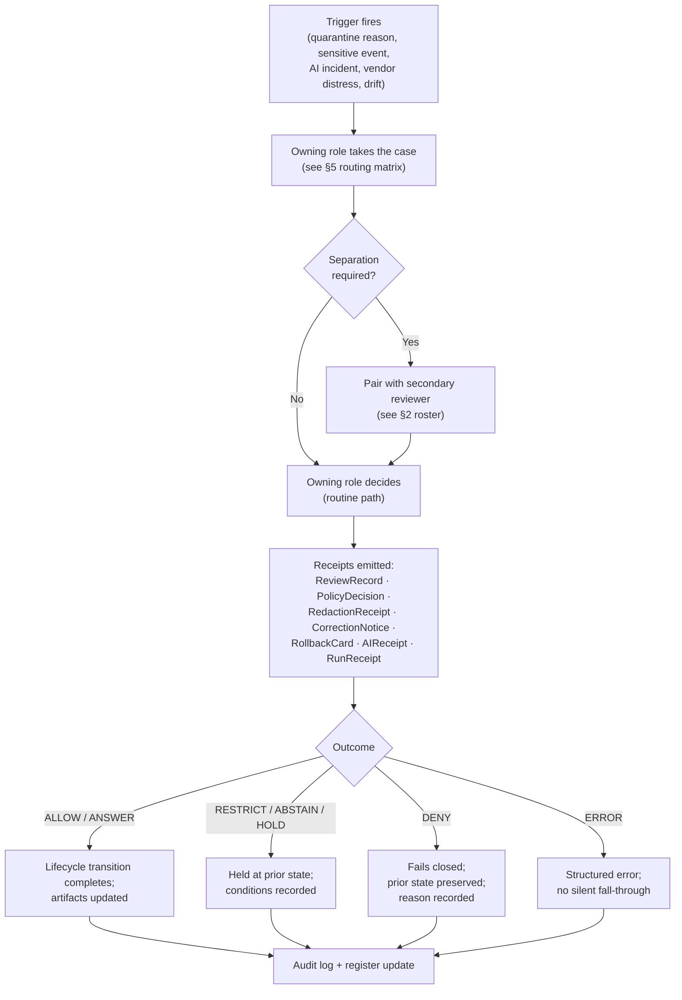

<!-- [KFM_META_BLOCK_V2]
doc_id: kfm://doc/docs-governance-escalation
title: Escalation — docs/governance/ESCALATION.md
type: standard
version: v1
status: draft
owners: ["@kfm-docs-stewards"]
created: 2026-05-12
updated: 2026-05-15
policy_label: public
related:
  - docs/governance/README.md
  - docs/governance/SEPARATION_OF_DUTIES.md
  - docs/governance/STEWARD_CHARTERS.md
  - docs/governance/REVIEW_DUTIES.md
  - docs/governance/CONTRADICTION_HANDLING.md
  - docs/doctrine/directory-rules.md
  - docs/doctrine/authority-ladder.md
  - docs/doctrine/trust-membrane.md
  - docs/doctrine/lifecycle-law.md
  - docs/registers/DRIFT_REGISTER.md
  - docs/registers/VERIFICATION_BACKLOG.md
  - docs/runbooks/SENSITIVITY_ESCALATION.md
  - docs/runbooks/INCIDENT_RESPONSE.md
  - docs/runbooks/VENDOR_WATCH.md
  - docs/security/INCIDENT_RESPONSE.md
  - control_plane/policy_gate_register.yaml
  - control_plane/contradiction_register.yaml
tags: ["kfm", "governance", "escalation", "review", "separation-of-duties", "sensitivity", "rollback", "incident-response", "vendor-watch"]
notes: "Names the triggers, owning roles, secondary reviewers, minimum receipts, closure records, and verification gaps required when a decision exceeds an actor's authority. Explains; does not enforce. Enforcement lives in policy/, tests/, .github/workflows/, and control_plane/."
[/KFM_META_BLOCK_V2] -->

# Escalation · `docs/governance/ESCALATION.md`

> **When a decision exceeds an actor's authority, KFM escalates it through a named, reviewable path. This document catalogs the triggers, owning role, required secondary reviewer, minimum receipts, and closure record the handoff must produce.**

**Status:** `draft` · **Owners:** `@kfm-docs-stewards` *(PROPOSED placeholder)* · **Updated:** `2026-05-15` *(draft revision; confirm at merge)* · **Repo implementation depth:** `UNKNOWN`

> [!IMPORTANT]
> `docs/governance/ESCALATION.md` **explains** how escalation works.
> It does **not** enforce escalation. Enforcement lives in `policy/`, `tests/`, `.github/workflows/`, and `control_plane/`.
> If this document and the executable layer disagree, the executable layer wins for runtime behavior and a `docs/registers/DRIFT_REGISTER.md` entry is opened.

> [!NOTE]
> **Evidence boundary:** this revision preserves the attached Markdown's intent, terms, anchors, and governing posture. Current implementation depth remains **UNKNOWN** where repo files, `CODEOWNERS`, tests, workflows, dashboards, logs, emitted receipts, or live runtime behavior were not inspected.

---

## Quick links

- [Status & authority](#status--authority)
- [1. Purpose & scope](#1-purpose--scope)
- [2. Roles roster](#2-roles-roster)
- [3. Escalation flow](#3-escalation-flow)
- [4. Trigger catalog](#4-trigger-catalog)
- [5. Routing matrix](#5-routing-matrix)
- [6. Sensitivity tier escalation](#6-sensitivity-tier-escalation)
- [7. AI surface escalation](#7-ai-surface-escalation)
- [8. Source / vendor distress escalation](#8-source--vendor-distress-escalation)
- [9. Process & tracking](#9-process--tracking-proposed)
- [10. Anti-patterns](#10-anti-patterns)
- [11. Open questions](#11-open-questions--verification-backlog)
- [12. Related docs](#12-related-docs)
- [Appendix A — Reason-code crosswalk](#appendix-a--reason-code-crosswalk)
- [Appendix B — Merge verification checklist](#appendix-b--merge-verification-checklist)

---

## Status & authority

| Aspect | Status | What this means |
|---|---:|---|
| Document authority | **Governance prose** | Explains routing and review burden; does not enforce policy or CI behavior. |
| Directory fit | **PROPOSED path / doctrine-aligned** | `docs/governance/ESCALATION.md` belongs under the `docs/` responsibility root as human-facing governance guidance. Confirm mounted-repo placement before merge. |
| Enforcement layer | **External to this doc** | Enforcement belongs in `policy/`, `tests/`, `.github/workflows/`, `control_plane/`, and governed API/runtime gates. |
| Implementation evidence | **UNKNOWN** | No current repo checkout, workflow output, logs, dashboards, or emitted proof objects are asserted by this document. |
| Change discipline | **Review required** | Docs steward + at least one subsystem owner; ADR required for Directory Rules §2.4-class changes. |

[Back to top](#escalation--docsgovernanceescalationmd)

---

## 1. Purpose & scope

Escalation is the deliberate, governed handoff that happens when an actor encounters a decision they cannot, may not, or should not make alone. KFM treats every such handoff as a **first-class event**: it has a named trigger, a named owning role, a named secondary reviewer where separation is required, and one or more receipts that record what was decided and why.

This document catalogs those handoffs. It is the **routing layer** between three other document families:

- `docs/governance/REVIEW_DUTIES.md` *(PROPOSED)* — what each reviewer is responsible for in steady state.
- `docs/governance/SEPARATION_OF_DUTIES.md` *(PROPOSED)* — which duty pairs may not collapse onto a single actor.
- `docs/runbooks/SENSITIVITY_ESCALATION.md`, `docs/runbooks/INCIDENT_RESPONSE.md`, and `docs/runbooks/VENDOR_WATCH.md` *(PROPOSED)* — step-by-step procedures.

**In scope** — the table of *when* to escalate, *to whom*, with *what receipts*, and *what outcome is acceptable*.

**Out of scope**:

- Object-family meaning. (`contracts/`)
- Field-level shape. (`schemas/`)
- Allow / deny / restrict / abstain machine decisions. (`policy/`)
- The mechanical CI gates. (`.github/workflows/`, `tests/`)
- Threat-modeling and exposure posture. (`docs/security/`)
- Emergency instructions, legal advice, medical advice, title opinions, or sensitive-location release decisions.

> [!NOTE]
> KFM's operating-law invariant — *separate policy-significant release duties when maturity justifies it* — is doctrine. The matrices below are the **PROPOSED** operational form of that doctrine for ADR review. Until the relevant ADRs are accepted and the executable layer enforces them, treat the routing rows as guidance, not proof of current enforcement.

[Back to top](#escalation--docsgovernanceescalationmd)

---

## 2. Roles roster

The roster below keeps the role names already used across the KFM corpus and this document. Each row carries a **scope** (the artifacts and surfaces the role governs) and a **primary escalation partner** (the role most often paired with it when separation is required).

> [!IMPORTANT]
> Role names are **PROPOSED operational names** until ratified by ADR, `CODEOWNERS`, team charter, or mounted-repo evidence. Owner handles and contact channels remain **UNKNOWN** unless the repo supplies them.

### 2.1 Core review roles

| Role | Scope | Primary escalation partner |
|---|---|---|
| **Source steward** | `SourceDescriptor` lifecycle; source admission; rights confirmation; sensitivity tag; source-role preservation; freshness watch. | Rights-holder representative when rights, sovereignty, consent, or source terms are unclear. |
| **Domain steward** | Meaning of a domain's object families; contracts, schemas, validators; domain-internal review before promotion. | Sensitivity reviewer for sensitive lanes; release authority for PUBLISHED transitions. |
| **Sensitivity reviewer** | Tier assignment; redaction; generalization; withholding; exact-location controls; `RedactionReceipt`. | Rights-holder representative; release authority. |
| **Rights-holder representative** | Sovereignty, cultural-heritage, consent-based, living-person, DNA, and steward-controlled release decisions. | Release authority. |
| **Release authority** | Issues or approves `ReleaseManifest`; authorizes PUBLISHED transitions; authorizes rollback. Distinct from authorship when materiality applies. | Author / detector for separation; correction reviewer post-publication. |
| **Correction reviewer** | Reviews `CorrectionNotice` / `RollbackCard` before they amend or supersede a PUBLISHED claim. | Release authority; domain steward. |
| **AI surface steward** | Focus Mode templates; `AIReceipt` sampling; cite-or-abstain audits; policy bindings on AI surfaces. | Docs steward for policy binding; domain steward for meaning. |
| **Docs steward** | Governance documentation; ADR index; drift register; Atlas / supplement integrity; review-burden metadata. | At least one subsystem owner for material governance changes. |

### 2.2 Supporting roles referenced by this document

| Supporting role | Scope | Escalates with |
|---|---|---|
| **Contract/schema steward** | Contract and schema authority; schema-home conflicts; field-shape validation surfaces. | Domain steward + docs steward when `contracts/` and `schemas/` drift. |
| **Policy steward** | Policy bundles, reason-code semantics, deny/hold/restrict posture, and policy-gate registers. | AI surface steward; release authority; docs steward. |
| **Security steward** | Direct public-access attempts, local exposure, authn/authz posture, secrets, and security incident response. | AI surface steward; release authority; security incident response owner. |
| **Author / detector** | The actor who authored a candidate change or detected a problem. This is not an approving role. | Owning role named in §5; cannot approve its own material release when separation applies. |

[Back to top](#escalation--docsgovernanceescalationmd)

---

## 3. Escalation flow

The high-level flow below captures the most common shape of an escalation. A trigger fires inside the lifecycle; an owning role takes it; a secondary reviewer is added when separation is required or sensitivity is in play; the outcome is recorded as one or more receipts; and the original lifecycle transition either completes or fails closed.

> [!TIP]
> Every leaf of this flow ends in **an audit-bearing receipt**, not in a verbal hand-wave. If an escalation cannot produce a receipt, the lifecycle stays at the prior state. This is the same fail-closed posture the trust membrane enforces at the public surface.

### 3.1 Minimum escalation record

Every escalation record SHOULD be able to answer these questions without reading chat history or reconstructing intent from memory.

| Field | Purpose |
|---|---|
| `case_id` | Stable ID for the escalation case. |
| `trigger_reason_code` | Machine-readable reason from Appendix A or a registered policy reason. |
| `origin_surface` | Where it fired: validator, policy gate, reviewer, watcher, AI audit, docs drift, manual catch. |
| `object_ref` | The artifact, source, claim, release candidate, template, or route affected. |
| `current_lifecycle_state` | Current state: RAW, WORK, QUARANTINE, PROCESSED, CATALOG, TRIPLET, PUBLISHED, or runtime surface. |
| `requested_transition` | The transition or operation that was blocked, routed, denied, corrected, or approved. |
| `owning_role` | Primary role from §2 / §5. |
| `secondary_reviewer` | Required when separation, sensitivity, rights, sovereignty, release, correction, or security materiality applies. |
| `receipt_refs` | References to `ReviewRecord`, `PolicyDecision`, `ValidationReport`, `RedactionReceipt`, `RunReceipt`, `AIReceipt`, `CorrectionNotice`, `RollbackCard`, or related proof object. |
| `decision_outcome` | Finite outcome; no free-form hidden state. |
| `rollback_target_ref` | Required when PUBLISHED artifacts, derivatives, public API payloads, or public tiles are affected. |

[Back to top](#escalation--docsgovernanceescalationmd)

---

## 4. Trigger catalog

Triggers are grouped by **the layer they originate in**. The reason codes are drawn from the current KFM escalation vocabulary in this document and its related corpus. They are the canonical machine-readable signals that an escalation has begun.

### 4.1 Lifecycle gate triggers

A lifecycle gate (Admission, Normalization, Validation, Catalog closure, Release, Correction, Rollback) emits a finite outcome — `PASS`, `FAIL`, `ALLOW`, `HOLD`, `DENY`, or `ERROR`. The non-routine outcomes below escalate.

| Trigger reason code | Where it fires | Default owning role | Receipt required to close |
|---|---|---|---|
| `MISSING_RECEIPT` / `MISSING_EVIDENCE` / `MISSING_REVIEW` | Normalization → Catalog → Release | Domain steward | Re-emitted receipt; `ValidationReport` pass. |
| `SCHEMA_MISMATCH` / `CONTRACT_DRIFT` | Normalization / Validation | Domain steward + contract/schema steward | Schema fix and/or ADR; `ValidationReport` pass. |
| `RIGHTS_UNKNOWN` / `SENSITIVITY_UNRESOLVED` | Admission → Release | Source steward + sensitivity reviewer | `PolicyDecision` + `ReviewRecord` (+ rights-holder where applicable). |
| `ROLE_COLLAPSE` / `ROLE_DOWNCAST_FORBIDDEN` | Validation → Catalog → Release | Source steward + domain steward | Restored source role; corrected `EvidenceBundle`; no role upcast. |
| `REVIEW_NEEDED` / `REVIEW_INSUFFICIENT` / `REVIEW_REJECTED` | Catalog / Release | The reviewer named by the lane | `ReviewRecord` with outcome. |
| `RELEASE_MANIFEST_INVALID` / `ROLLBACK_TARGET_MISSING` | Release | Release authority | Fixed `ReleaseManifest`; rollback target supplied. |
| `CORRECTION_DERIVATIVES_UNRESOLVED` / `CORRECTION_PRIOR_RELEASE_MISSING` | Correction | Correction reviewer | Resolved derivatives; predecessor release linked; supersession entry. |

### 4.2 Sensitivity / rights triggers

These escalate the moment the originating signal is observed, regardless of which gate would have fired next. They follow KFM's sensitivity-tier scheme (T0–T4) described in §6.

| Trigger | Default owning role | Required partners |
|---|---|---|
| Archaeology site coordinate at full precision | Sensitivity reviewer | Rights-holder representative (cultural / sovereignty) |
| Sensitive fauna or flora exact occurrence | Sensitivity reviewer | Domain steward |
| Living-person field exposure attempt | Sensitivity reviewer | Rights-holder representative (consent) |
| DNA segment / match-evidence handling | Sensitivity reviewer | Rights-holder representative + release authority |
| Critical infrastructure detail at facility precision | Sensitivity reviewer | Release authority + security steward where exposure risk applies |
| Hazards surface used as alert / instruction authority | Release authority | Sensitivity reviewer (boundary holds) |
| Synthetic / reconstructed surface presented without Reality Boundary Note | AI surface steward | Domain steward |

> [!WARNING]
> The sensitive-lane defaults are **fail-closed**. An actor who is uncertain about rights, sovereignty, or sensitivity must escalate rather than proceed. There is no "publish and correct later" path for these triggers; the cost of failing safe is much smaller than the cost of failing open.

### 4.3 AI surface triggers

These follow the Governed AI doctrine: AI is interpretive, not the root truth source; `EvidenceBundle` outranks generated language.

| Trigger | Default owning role |
|---|---|
| Synthetic-claim incidence detected during `AIReceipt` audit | AI surface steward |
| ABSTAIN rate spike on a Focus Mode template | AI surface steward |
| Large new-reason spike in DENY reason distribution | AI surface steward + policy steward |
| Uncited language returned as `ANSWER` | AI surface steward (severity → release authority) |
| Direct model-runtime access attempt from a public client | AI surface steward + security steward |
| Focus Mode template change | AI surface steward + docs steward |

### 4.4 Source / vendor triggers

These follow the vendor-watchlist doctrine. The current corpus uses the 23andMe Chapter 11 filing of March 2025 as the reference example for vendor distress as a consent-relevant variable. This document treats that as a **corpus exemplar**, not as a current legal-status update.

| Trigger | Default owning role |
|---|---|
| Upstream vendor enters distress (bankruptcy, sale, terms-of-service rewrite) | Source steward |
| Source rights change detected by watcher | Source steward + rights-holder representative |
| Source freshness expired past declared cadence | Source steward (correction routed via correction reviewer) |
| Source-role collapse risk (e.g., modeled → observed) | Domain steward |

### 4.5 Documentation / structural triggers

| Trigger | Default owning role |
|---|---|
| Path / schema / policy / source home conflict between docs and repo | Docs steward (`docs/registers/DRIFT_REGISTER.md` entry) |
| Atlas / supplement / dossier supersession | Docs steward + at least one subsystem owner |
| ADR-class change (Directory Rules §2.4) without an open ADR | Docs steward (block merge; open ADR) |
| Contradiction register entry that grows stale | Docs steward |
| Related-doc link resolves to a compatibility root instead of the canonical home | Docs steward + affected subsystem owner |

[Back to top](#escalation--docsgovernanceescalationmd)

---

## 5. Routing matrix

The matrix below collapses §4 into a single "trigger → owning role → required partner → outcome envelope" view. The outcome envelope refers to finite outcomes: `ALLOW`, `RESTRICT`, `DENY`, `HOLD`, `ERROR` for governance queues, and `ANSWER` / `ABSTAIN` / `DENY` / `ERROR` for runtime surfaces.

| Trigger family | Owning role | Required partner (separation) | Acceptable outcomes |
|---|---|---|---|
| Routine source admission | Source steward | — | `ALLOW` / `HOLD` / `DENY` / `ERROR` |
| Admission with unresolved rights / sovereignty | Source steward | Rights-holder representative | `ALLOW` only with `PolicyDecision` + `ReviewRecord` / `HOLD` / `DENY` |
| Normalization receipt (routine) | Domain steward | — | `ALLOW` / `HOLD` / `ERROR` |
| Normalization with sensitivity-relevant transform | Domain steward | Sensitivity reviewer | `ALLOW` / `RESTRICT` / `HOLD` / `DENY` |
| Validator authorship & run | Domain steward | Periodic audit by docs steward | `PASS` / `FAIL` / `ERROR` |
| Schema or contract drift | Contract/schema steward | Domain steward + docs steward if home conflict exists | `ALLOW` after fix / `HOLD` / `DENY` / `ERROR` |
| Promotion PROCESSED → CATALOG (non-sensitive) | Domain steward | — | `ALLOW` / `HOLD` / `DENY` |
| Promotion PROCESSED → CATALOG (sensitive lane) | Domain steward | Sensitivity reviewer | `ALLOW` / `RESTRICT` / `HOLD` / `DENY` |
| Release CATALOG → PUBLISHED (material change) | Release authority | Author ≠ release authority; rights-holder where applicable | `ALLOW` / `HOLD` / `DENY` |
| Sensitive-lane release | Release authority | Author + sensitivity reviewer + rights-holder | `ALLOW` only with full receipt stack / `HOLD` / `DENY` |
| Correction / rollback (steward-significant) | Correction reviewer | Author / detector + release authority | `ACCEPTED` / `HOLD` / `DENY` / `ERROR` |
| AI surface change (template or policy binding) | AI surface steward | Docs steward + domain steward where domain meaning is affected | `ALLOW` / `HOLD` / `DENY` |
| AI direct-runtime or public-bypass incident | AI surface steward | Security steward + policy steward | `DENY` / `ERROR` + incident record |
| Atlas / supplement publication | Docs steward | At least one subsystem owner | `ALLOW` / `HOLD` / `DENY` |
| ADR-class structural change | Docs steward | At least one subsystem owner | `ALLOW` only with accepted ADR / `HOLD` |

> Status: **PROPOSED** routing. Author-and-approver overlap is permitted only in low-materiality routine cases. As maturity rises, separation must be enforced through tooling, not custom.

[Back to top](#escalation--docsgovernanceescalationmd)

---

## 6. Sensitivity tier escalation

The tier scheme (T0 Open → T4 Denied) is the canonical KFM language for "how safely is this representation publishable?" An escalation that moves an object **toward T0** (more public) always requires both a transform receipt and a review record. An escalation that moves an object **toward T4** (less public) may happen immediately to fail closed, but the closure record still needs a `CorrectionNotice` / `ReviewRecord` when affected derivatives or PUBLISHED claims exist.

| Tier transition | Direction | Required artifacts | Required reviewer | Reversibility |
|---|---|---|---|---|
| T4 → T3 | toward public | `PolicyDecision` + `ReviewRecord` + agreement | Sensitivity reviewer + rights-holder where applicable | Reversible via agreement revocation |
| T4 → T2 | toward public | `PolicyDecision` + `ReviewRecord` | Sensitivity reviewer | Reversible via review revocation |
| T4 → T1 | toward public | `RedactionReceipt` + `ReviewRecord` | Sensitivity reviewer | Reversible; redaction can be re-evaluated |
| T3 → T2 | toward public | `PolicyDecision` + `ReviewRecord` | Sensitivity reviewer | Reversible |
| T2 → T1 | toward public | `RedactionReceipt` + `ReviewRecord` | Sensitivity reviewer | Reversible |
| T1 → T0 | toward public | `ReleaseManifest` + `ReviewRecord` | Sensitivity reviewer + release authority | Reversible via `RollbackCard` |
| Any → T4 | toward restricted | `CorrectionNotice` + `ReviewRecord` when derivatives or PUBLISHED claims are affected | Owning steward + rights-holder where applicable | Always permitted; precedes derivative invalidation |

> [!CAUTION]
> Three transitions **cannot be reached by any transform**:
> - **Archaeology — human remains / sacred sites** never relaxes below T3, and only under explicit named authorization.
> - **People/DNA — raw DNA segment data** never reaches a public tier; T3 only under explicit research agreement.
> - **Hazards — KFM as alert authority** holds at T4 forever. No transform permits KFM to act as an emergency-alert authority.

[Back to top](#escalation--docsgovernanceescalationmd)

---

## 7. AI surface escalation

The AI surface (`Focus Mode` and any downstream story / explanation surfaces) has its own escalation envelope because generated language can fluently substitute for evidence if left unchecked.

**Required abstention.** ABSTAIN when `EvidenceBundle` is missing, citations cannot be validated, source roles conflict, temporal scope is insufficient, or the user asks for unsupported inference.

**Required denial.** DENY direct `RAW` / `WORK` / `QUARANTINE` access, sensitive-location exposure, restricted personal/DNA inference, emergency-alerting replacement, public-client model-runtime bypass, or uncited authoritative claims.

**Escalation triggers (this surface only).**

| Indicator | Healthy posture (PROPOSED) | Escalates to |
|---|---|---|
| `AIReceipt` presence rate | 100% of Focus Mode answers | AI surface steward; any miss is an incident |
| ABSTAIN rate by template | Visibly tracked; very low ABSTAIN suggests over-fitting, very high suggests evidence gaps | AI surface steward |
| DENY reason distribution | Stable; large new-reason spikes investigated | AI surface steward + policy steward |
| Synthetic-claim incidence | Approaches zero; never silently | AI surface steward + release authority |
| Focus Mode template change | n/a; always a change-managed event | AI surface steward + docs steward |
| Direct model-runtime access attempt | Zero from public clients | AI surface steward + security steward |

> [!IMPORTANT]
> AI suggestions are **never** approvals. A Focus Mode answer that suggests promoting, releasing, or correcting an artifact is interpreted as **a candidate that still owes the same receipts as any other candidate**. The trust-membrane anti-pattern of "AI generation routed through admin shortcut" is denied at the trust-membrane audit.

[Back to top](#escalation--docsgovernanceescalationmd)

---

## 8. Source / vendor distress escalation

A source-side incident — vendor distress, terms-of-service rewrite, sudden licensing change, ownership transfer, freshness collapse — is escalated through the source steward, with mandatory consent revalidation when consent-relevant.

**Canonical reference incident.** The corpus uses the 23andMe Chapter 11 filing (March 2025) as the named exemplar that vendor solvency can become a consent-relevant variable, because a sale of customer data in bankruptcy can void prior consent assumptions. Treat this as a source-ledger precedent, not as a current-status statement.

**Routing.**

1. Watcher detects watchlist event → emits to source steward queue.
2. Source steward classifies severity:
   - **Routine** (minor licensing-page update with no scope change) → `ReviewRecord` only.
   - **Material** (ownership change, scope change, bankruptcy filing, ToS rewrite affecting downstream rights) → escalate to rights-holder representative + release authority.
3. **Consent-revalidation drill** runs against every active KFM consent grant under that vendor; ambiguous postures embargo until cleared.
4. Affected records are tier-reassigned per §6; downstream derivatives are invalidated per correction discipline.
5. `CorrectionNotice` + `RollbackCard` emitted where PUBLISHED claims are affected.

> [!NOTE]
> Cadence, threshold definitions, and notification format for watchlist events are **NEEDS VERIFICATION** in the corpus. The vendor-watch SOP remains **PROPOSED** at `docs/runbooks/VENDOR_WATCH.md` until authored and verified.

[Back to top](#escalation--docsgovernanceescalationmd)

---

## 9. Process & tracking (PROPOSED)

The process below is the smallest useful flow that preserves auditability without prematurely committing to tooling.

1. **Detect.** A trigger fires from §4, either by a validator, a policy gate, a CI check, a steward review, a watcher, an AI surface audit, or a manual catch.
2. **File.** The detector opens an entry in the appropriate register:
   - Policy-gate or release-gate triggers → `control_plane/policy_gate_register.yaml` *(PROPOSED)* with a cross-reference to the originating receipt.
   - Drift between docs and repo → `docs/registers/DRIFT_REGISTER.md` *(PROPOSED)*.
   - Doctrine-or-source contradiction → `control_plane/contradiction_register.yaml` *(PROPOSED)*.
   - Verifiable but unverified claims → `docs/registers/VERIFICATION_BACKLOG.md` *(PROPOSED)*.
3. **Route.** The owning role from §5 picks up the case. If separation is required, the secondary reviewer is named at the time of pickup, not at the time of decision.
4. **Decide.** The owning role and (where required) the secondary reviewer produce the receipts named in §4 / §5.
5. **Close.** The lifecycle transition that triggered the escalation either completes (with the new receipts attached to the `EvidenceBundle`) or fails closed (with the reason recorded). Either way, the register entry moves to a closed state with links to the receipts.
6. **Audit.** Periodic docs-steward audit reviews aged-out register entries, synthetic-claim incidence on the AI surface, separation-of-duties violations, and ADR completeness for Directory Rules §2.4-class cases.

### 9.1 Severity bands

| Band | Meaning | Default posture |
|---|---|---|
| Routine | Low-materiality, non-sensitive, no public release impact. | Owning steward may close with a receipt. |
| Material | Affects release state, public API payloads, public map layers, evidence closure, or stable docs. | Secondary reviewer required. |
| Sensitive | Rights, sovereignty, living-person, DNA, archaeology, rare species, critical infrastructure, or exact-location exposure. | Fail closed; sensitivity reviewer required. |
| Incident | Public trust membrane bypass, model-runtime direct access, security exposure, uncited authoritative answer, or emergency-alert substitution. | Deny or error; incident response path required. |

### 9.2 SLA / cadence

All time-bound numbers are **UNKNOWN** in the corpus and intentionally left placeholder here.

| Stage | Target (PROPOSED — NEEDS VERIFICATION) |
|---|---|
| Acknowledgement of a triggered escalation | `TODO` |
| Initial routing decision | `TODO` |
| Closure of routine (non-sensitive) escalations | `TODO` |
| Closure of sensitive-lane escalations | `TODO` |
| Periodic docs-steward audit cadence | `TODO` |

> [!NOTE]
> SLAs encode operational maturity. They are written down only when the team has the capacity to honor them; writing a number that will not be met would weaken the rest of the document. Open an ADR (suggested title: *Reviewer separation-of-duties threshold and tooling*) before pinning numbers.

[Back to top](#escalation--docsgovernanceescalationmd)

---

## 10. Anti-patterns

The list below names the failure modes most likely to corrode the escalation discipline.

> [!WARNING]
> **Approving one's own release on a sensitive lane.** Separation-of-duties matrix §5; release authority must be distinct from the author when materiality applies.

> [!WARNING]
> **Documenting a change instead of validating it.** Docs are part of the working system but never substitute for validators, fixtures, or schema. An escalation note is not a receipt.

> [!WARNING]
> **Treating an AI summary or Story Node as an approval.** AI surface output is interpretive only; cite-or-abstain applies; promotion still requires the full receipt stack.

> [!WARNING]
> **Promotion that "upgrades" a source role** (for example, modeled → observed). Source role is fixed at admission; never upgraded by promotion. Escalate to the source steward instead.

> [!WARNING]
> **Re-publishing a corrected claim without invalidating derivatives.** `CorrectionNotice` must list invalidated derivatives; `RollbackCard` is required where downstream is affected.

> [!WARNING]
> **Silent migration between schema, policy, or source homes.** ADR is required per Directory Rules §2.4; migration plan and supersession entry are mandatory.

> [!WARNING]
> **Admin shortcut becomes the normal public path.** Admin / steward bypasses are explicitly constrained, documented, and kept out of the normal public route. An escalation triggered through an admin shortcut still owes the full receipt stack.

> [!WARNING]
> **Free-form escalation statuses.** Escalation records use finite outcomes and reason codes. A sentence like "looks okay" is not a governance outcome.

[Back to top](#escalation--docsgovernanceescalationmd)

---

## 11. Open questions & verification backlog

These items are **NEEDS VERIFICATION** in the current corpus. Each should be retired by ADR, register entry, or mounted-repo evidence before any number in this document is treated as fact.

- **SLA numbers** for acknowledgement, routing, and closure (§9). UNKNOWN; needs ADR or runbook decision.
- **Channel and queue identifiers** (for example, which queue source-steward cases live in, which channel rights-holder representatives are reachable through). UNKNOWN; needs `CODEOWNERS` + ops decision.
- **Vendor-watch cadence and threshold definitions** (§8). NEEDS VERIFICATION.
- **Right-to-be-forgotten boundary** between tombstoning and erasure; affects DNA / consent triggers.
- **ADR for reviewer separation-of-duties threshold and tooling**; pending.
- **ADR for sensitivity-tier scheme adoption**; pending.
- **Vendor-watch SOP** at `docs/runbooks/VENDOR_WATCH.md`; not yet authored.
- **Drift register triage cadence**; pending.
- **Contract/schema, policy, source, release, proof, and receipt homes**; verify against mounted repo before treating any path as current fact.
- **Role handles and contact channels**; placeholder until `CODEOWNERS`, steward charters, or team roster evidence exists.

Track these against `docs/registers/VERIFICATION_BACKLOG.md` *(PROPOSED)*.

[Back to top](#escalation--docsgovernanceescalationmd)

---

## 12. Related docs

The links below assume the `docs/` tree laid out in `docs/doctrine/directory-rules.md`. Until a mounted repo confirms the paths, treat them as **PROPOSED**.

- [`docs/governance/README.md`](./README.md) *(PROPOSED)* — governance landing page.
- [`docs/governance/REVIEW_DUTIES.md`](./REVIEW_DUTIES.md) *(PROPOSED)* — what each reviewer is responsible for.
- [`docs/governance/SEPARATION_OF_DUTIES.md`](./SEPARATION_OF_DUTIES.md) *(PROPOSED)* — which duty pairs may not collapse.
- [`docs/governance/STEWARD_CHARTERS.md`](./STEWARD_CHARTERS.md) *(PROPOSED)* — per-steward charter and scope.
- [`docs/governance/CONTRADICTION_HANDLING.md`](./CONTRADICTION_HANDLING.md) *(PROPOSED)* — how contradictions are recorded and resolved.
- [`docs/doctrine/directory-rules.md`](../doctrine/directory-rules.md) *(PROPOSED home)* — placement rules and ADR-required changes.
- [`docs/doctrine/authority-ladder.md`](../doctrine/authority-ladder.md) *(PROPOSED)* — canonical authority order.
- [`docs/doctrine/trust-membrane.md`](../doctrine/trust-membrane.md) *(PROPOSED)* — public-vs-internal boundary.
- [`docs/doctrine/lifecycle-law.md`](../doctrine/lifecycle-law.md) *(PROPOSED)* — RAW → PUBLISHED invariant.
- [`docs/runbooks/SENSITIVITY_ESCALATION.md`](../runbooks/SENSITIVITY_ESCALATION.md) *(PROPOSED)* — step-by-step sensitivity escalation procedure.
- [`docs/runbooks/INCIDENT_RESPONSE.md`](../runbooks/INCIDENT_RESPONSE.md) *(PROPOSED)* — operational incident response.
- [`docs/runbooks/VENDOR_WATCH.md`](../runbooks/VENDOR_WATCH.md) *(PROPOSED)* — vendor/source distress watch procedure.
- [`docs/security/INCIDENT_RESPONSE.md`](../security/INCIDENT_RESPONSE.md) *(PROPOSED)* — security-side incident response.
- [`docs/registers/DRIFT_REGISTER.md`](../registers/DRIFT_REGISTER.md) *(PROPOSED)* — doctrine/code/path drift entries.
- [`docs/registers/VERIFICATION_BACKLOG.md`](../registers/VERIFICATION_BACKLOG.md) *(PROPOSED)* — open verification items.
- `control_plane/policy_gate_register.yaml` *(PROPOSED)* — machine-readable policy gate register.
- `control_plane/contradiction_register.yaml` *(PROPOSED)* — machine-readable contradiction register.

[Back to top](#escalation--docsgovernanceescalationmd)

---

## Appendix A — Reason-code crosswalk

<strong>Click to expand:</strong> reason codes used in this document and their canonical source

The reason codes below are the machine-readable signals that a gate has failed closed, a reviewer must be added, or a runtime surface has refused to emit `ANSWER`. Codes marked **PROPOSED** should be registered in the relevant policy / control-plane home before enforcement.

| Code | Layer | Meaning | Recovery |
|---|---|---|---|
| `MISSING_RECEIPT` | Normalization → Release | A required receipt (`TransformReceipt`, `RedactionReceipt`, `RunReceipt`, `AIReceipt`, etc.) is absent. | Re-emit the receipt; re-run validator. |
| `MISSING_EVIDENCE` | Validation → Catalog | An `EvidenceRef` does not resolve to an `EvidenceBundle`. | Resolve the bundle; re-link the reference. |
| `MISSING_REVIEW` | Catalog / Release | A required `ReviewRecord` is missing. | Run the required review; supply the record. |
| `SCHEMA_MISMATCH` | Normalization / Validation | The object does not conform to its schema version. | Schema fix and/or ADR; re-run validator. |
| `CONTRACT_DRIFT` | Normalization / Validation | The object does not conform to its contract / vocabulary. | Contract correction; re-run validator. |
| `RIGHTS_UNKNOWN` | Admission → Release | Source rights are unconfirmed. | Steward review; rights resolution; tier reassignment. |
| `SENSITIVITY_UNRESOLVED` | Admission → Release | Sensitivity tag is unconfirmed. | Sensitivity reviewer; tier assignment. |
| `ROLE_COLLAPSE` | Validation → Release | Source role has been collapsed (for example, aggregate cited as per-place observation). | Restore source role. |
| `ROLE_DOWNCAST_FORBIDDEN` | Validation → Release | A forbidden source-role change is attempted, commonly an upcast such as modeled → observed. | Refuse change; preserve original role. |
| `REVIEW_NEEDED` | Catalog / Release | A review is required but has not been performed. | Run the review. |
| `REVIEW_INSUFFICIENT` | Catalog / Release | A review was performed but is inadequate for the lane. | Re-run with the correct reviewer roster. |
| `REVIEW_REJECTED` | Catalog / Release | The review explicitly rejected the candidate. | Honor the rejection; hold or correct. |
| `RELEASE_MANIFEST_INVALID` | Release | The `ReleaseManifest` is malformed or incomplete. | Fix the manifest. |
| `ROLLBACK_TARGET_MISSING` | Release | No `RollbackCard` / rollback target is supplied. | Supply the rollback target. |
| `CORRECTION_DERIVATIVES_UNRESOLVED` | Correction | Downstream derivatives have not been identified or invalidated. | Resolve derivatives; supersession entry. |
| `CORRECTION_PRIOR_RELEASE_MISSING` | Correction | The `CorrectionNotice` does not reference its predecessor release. | Add the reference. |
| `DIRECT_MODEL_ACCESS_ATTEMPT` | AI / security | A public client attempts direct model-runtime access. | DENY; route to AI surface steward + security steward. |
| `UNCITED_ANSWER` | AI | AI surface emits or attempts to emit authoritative language without citation validation. | ABSTAIN or DENY; open AIReceipt audit. |
| `REALITY_BOUNDARY_MISSING` | AI / 3D / story | Synthetic or reconstructed content lacks a Reality Boundary Note. | Add note and review; restrict until corrected. |
| `VENDOR_DISTRESS` | Source watch | Vendor distress, sale, bankruptcy, or ToS change may affect consent or rights. | Consent revalidation drill; source steward escalation. |
| `SOURCE_FRESHNESS_EXPIRED` | Source watch | Source is stale beyond declared cadence. | Hold affected claims; correction reviewer if PUBLISHED. |
| `PATH_HOME_CONFLICT` | Docs / structure | Docs and repo disagree about schema, policy, source, release, proof, or receipt home. | Open drift entry; ADR or migration plan. |
| `ADR_REQUIRED_MISSING` | Docs / structure | A Directory Rules §2.4-class change lacks an ADR. | Block merge; open ADR. |

<strong>Click to expand:</strong> finite outcome envelopes used in routing decisions

| Outcome | When | Required artifacts | Public-surface effect |
|---|---|---|---|
| `ANSWER` | Evidence sufficient; policy permits; release allows; review (if required) recorded. | `EvidenceBundle` resolved; `PolicyDecision = allow`; `ReleaseManifest` applies. | Substantive answer with citation. |
| `ABSTAIN` | Evidence insufficient or AI cannot cite. | `AIReceipt` with reason; no claim emitted. | Non-substantive note with reason; never invents. |
| `DENY` | Policy / rights / sensitivity / release state forbids. | `PolicyDecision = deny` + reason code; `AIReceipt` records denial where AI surface is involved. | Denial reason; offers alternative non-restricted surface where possible. |
| `ERROR` | Governed API cannot evaluate. | Error envelope with diagnostic code; no claim leakage. | Finite, actionable error; no silent fall-through. |
| `HOLD` | Promotion / release / correction paused pending a reviewer or missing artifact. | `ReviewRecord` pending; `PolicyDecision = hold`. | Surface remains in prior state; no silent rollback. |
| `PASS` / `FAIL` | Validator-class outcome. | `ValidationReport`. | Internal; promotion blocked on `FAIL`. |
| `ALLOW` / `RESTRICT` | Governance queue outcomes. | `ReviewRecord` and any required policy / redaction receipt. | Drives downstream lifecycle transition. |
| `ACCEPTED` | Correction-queue outcome. | `CorrectionNotice`. | Triggers supersession or rollback. |

[Back to top](#escalation--docsgovernanceescalationmd)

---

## Appendix B — Merge verification checklist

Use this checklist before treating the document as merged, enforced, or operational.

- [ ] Confirm `docs/governance/ESCALATION.md` exists at the target path in the mounted repo.
- [ ] Confirm `@kfm-docs-stewards` and subsystem owners in `CODEOWNERS` or steward charters.
- [ ] Confirm related docs exist or mark missing links in `docs/registers/VERIFICATION_BACKLOG.md`.
- [ ] Confirm role names align with `STEWARD_CHARTERS.md` and `SEPARATION_OF_DUTIES.md`.
- [ ] Confirm the reason codes in Appendix A are registered in policy/control-plane homes before enforcement.
- [ ] Confirm `policy_gate_register.yaml`, `contradiction_register.yaml`, `DRIFT_REGISTER.md`, and `VERIFICATION_BACKLOG.md` homes in the mounted repo.
- [ ] Confirm Mermaid renders in GitHub or replace with a text fallback.
- [ ] Confirm no section implies enforcement before policy, tests, workflows, or runtime gates exist.
- [ ] Confirm sensitive-lane defaults remain fail-closed.
- [ ] Confirm rollback target expectations match release tooling.
- [ ] Confirm any Directory Rules §2.4-class change has an accepted ADR.

[Back to top](#escalation--docsgovernanceescalationmd)

---

### Last reviewed

`2026-05-15` — draft update pass. Merge reviewer must confirm repo paths, owners, related links, and enforcement surfaces.

### Review burden

| Aspect | Value |
|---|---|
| Doc owner | `@kfm-docs-stewards` *(placeholder; confirm in `CODEOWNERS`)* |
| Reviewers required for change | Docs steward + at least one subsystem owner; ADR required for changes that bend an invariant from Directory Rules §2.4 |
| Material-change protocol | Open a PR; reference the relevant ADR or register entry; surface the change in the next docs-steward audit |
| Rollback target | Revert this Markdown file to the prior committed version; open drift/verification entries for any related links or role names that were introduced by this revision |

---

**Related** · [`README.md`](./README.md) · [`SEPARATION_OF_DUTIES.md`](./SEPARATION_OF_DUTIES.md) · [`STEWARD_CHARTERS.md`](./STEWARD_CHARTERS.md) · [`../doctrine/directory-rules.md`](../doctrine/directory-rules.md) · [`../runbooks/SENSITIVITY_ESCALATION.md`](../runbooks/SENSITIVITY_ESCALATION.md)

**Last updated:** `2026-05-15` · [Back to top](#escalation--docsgovernanceescalationmd)
