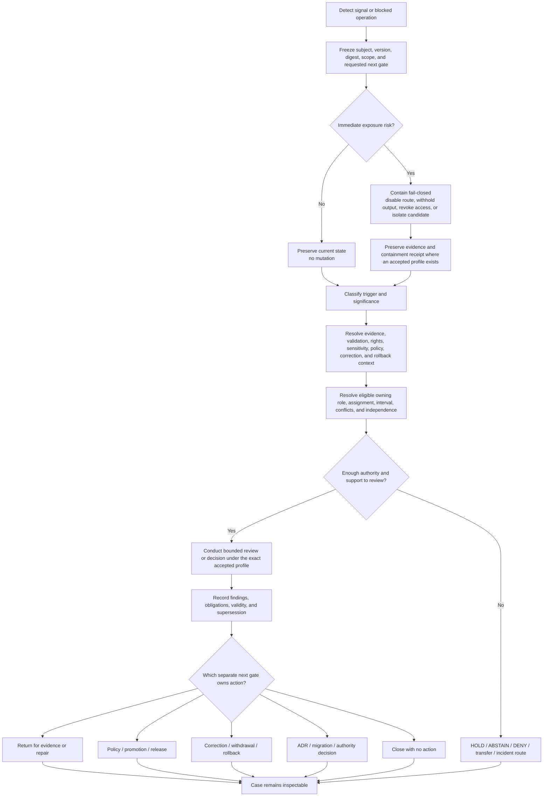

<!-- [KFM_META_BLOCK_V2]
doc_id: kfm://doc/governance/escalation
title: Escalation — Governed Handoff, Containment, and Closure Boundaries
type: governance-guide
version: v2-draft
status: draft; repository-grounded; proposed routing guidance; non-authoritative; no-release-effect
owners:
  - "@bartytime4life — verified CODEOWNERS review route only"
owner_status: "No accepted StewardshipAssignment, authenticated KFM actor identity, independent reviewer capacity, incident command, release authority, reviewer quorum, or approval is implied."
created: 2026-05-12
updated: 2026-08-23
policy_label: public
owning_root: docs/
current_path: docs/governance/ESCALATION.md
responsibility: "Explain when a KFM concern must leave its normal path, how to freeze and route the subject, what evidence and authority a handoff needs, how immediate containment differs from adjudication, and what must remain held before closure, correction, release, or restoration."
truth_posture: "CONFIRMED repository evidence and accepted Directory Rules placement / PROPOSED trigger, routing, severity, reason-code, and closure guidance / CONFLICTED incident-response and ReviewRecord machine surfaces / UNKNOWN operational queues, staffing, identity, policy, release, and platform enforcement / NEEDS VERIFICATION exact-current hosted checks and human authority; cite-or-abstain"
evidence_snapshot:
  repository: bartytime4life/Kansas-Frontier-Matrix
  base_ref: main
  inspected_main: 05e2437f746c884daf5c0b4c17bb5b5614117ff0
  target_prior_blob: fa808272d6f6873e704ae7180b8e0ee49575a5fc
  directory_rules_blob: fd49a0b83e55cef52c1124281f093e263526898d
  adr_0029_blob: a4de0d7a96b78da59cfc499d1025e1508afd8dd9
  adr_0024_blob: 57d46867c97a1c8d76ccdfbc12fc012bee3bd2ea
  governance_readme_blob: 500f8bcad3a384160a561f1460617f0a13d42fcc
  review_duties_blob: df9848c324cbb1b7a3d63b32bd5e2fcf929ff4e9
  separation_of_duties_blob: 00f68beeeec7d57cce806e6cdbd710a837bd4f0c
  contradiction_handling_blob: ff3ee37454b2baea29b533b643c4a86b63d74df0
  codeowners_blob: dd2a84aa514d8ecd9208bc347f90f9a2ed37dd61
  stewardship_assignment_contract_blob: 80c6fd4149deeb4172e2401dfaf741226380f085
  stewardship_assignment_schema_blob: bd12f7e5e8eea966306c250d992f2826693815c9
  review_record_contract_blob: 9641345d1e5d939dc59687a900e60a563d92c4f0
  review_authority_binding_contract_blob: f156e100660e9fd97ca95e90092143a3cd6d62ee
  sensitive_release_review_contract_blob: 235ca86dd807c6842ca8c861f995371fe7758f64
  policy_gate_register_blob: bc8185b4762a947c742cf54a7ea4f2bf80670e21
  contradiction_register_blob: cf51caf09daa17822b052e955f1fa48e830453ab
  sensitivity_runbook_blob: e4dc0cb960b115a55cbc57fd5b8d186caaeaed48
  operations_incident_runbook_blob: 33d364c98f88f94b78e401298a0970e7dec2cbb9
  security_incident_standard_blob: da6eb82dc6608e0cdfbbe9f1823ebd1e13289ec4
inspection_boundary: >-
  Current-session GitHub reads covered the target, accepted Directory Rules and ADR-0029,
  proposed ADR-0024, governance siblings, CODEOWNERS, governance contract and schema
  surfaces, fixture-only review profiles, release-policy and release-review guidance,
  control-plane projection registers, human drift and verification registers, sensitivity
  escalation, and both incident-response documents. No actor was authenticated, no
  assignment or queue was activated, no live policy bundle or release gate was evaluated,
  no governed escalation, review, correction, withdrawal, rollback, release, or incident
  record was issued, and no lifecycle, deployment, publication, or repository-setting
  transition was exercised.
related:
  - ./README.md
  - ./REVIEW_DUTIES.md
  - ./SEPARATION_OF_DUTIES.md
  - ./STEWARD_CHARTERS.md
  - ./CONTRADICTION_HANDLING.md
  - ./DEPRECATION_PROCESS.md
  - ../doctrine/directory-rules.md
  - ../adr/ADR-0029-adopt-directory-governance-standard-v2.md
  - ../adr/ADR-0024-steward-separation-of-duties-for-release.md
  - ../registers/DRIFT_REGISTER.md
  - ../registers/VERIFICATION_BACKLOG.md
  - ../runbooks/SENSITIVITY_ESCALATION.md
  - ../runbooks/INCIDENT_RESPONSE.md
  - ../security/INCIDENT_RESPONSE.md
  - ../../contracts/governance/ReviewRecord.md
  - ../../contracts/governance/steward_assignment.md
  - ../../contracts/governance/review_authority_binding.md
  - ../../contracts/governance/sensitive_release_review_closure.md
  - ../../schemas/contracts/v1/governance/README.md
  - ../../policy/release/README.md
  - ../../release/reviews/README.md
  - ../../control_plane/policy_gate_register.yaml
  - ../../control_plane/contradiction_register.yaml
  - ../../.github/CODEOWNERS
tags: [kfm, governance, escalation, handoff, containment, review, sensitivity, rights, incident, correction, rollback, ai, source-watch, separation-of-duties]
notes:
  - "v2-draft is a same-path documentation-only reconciliation against repository evidence."
  - "ADR-0029 is accepted and confirms docs/ as the owning responsibility root; this update creates no path, alias, queue, registry authority, or migration."
  - "ADR-0024 is the current numbered release-separation decision and remains proposed."
  - "A generic operational EscalationRecord contract, canonical reason-code registry, staffed queue, and accepted SLA were not established."
  - "The two incident-response documents and the ReviewRecord machine candidates remain unresolved; this guide selects none."
  - "The control-plane policy-gate and contradiction registers are projection-only, empty, and declare implementation absent at the inspected snapshot."
  - "No source activation, policy approval, review approval, release, deployment, promotion, correction, rollback, or publication effect."
[/KFM_META_BLOCK_V2] -->

<a id="top"></a>

# Escalation — Governed Handoff, Containment, and Closure Boundaries

> **Escalation is a bounded transfer of unresolved responsibility—not a shortcut to approval.** Freeze the exact subject, preserve evidence and uncertainty, contain exposure when necessary, route to an eligible authority, and keep every stronger transition on `HOLD` until its own gate closes.

[](#status--authority)
[](../adr/ADR-0029-adopt-directory-governance-standard-v2.md)
[](../adr/ADR-0024-steward-separation-of-duties-for-release.md)
[](#9-process--tracking)
[](#92-current-register-and-queue-boundary)
[](#status--authority)

> [!IMPORTANT]
> **This page explains a human governance handoff; it does not create an authority, queue, approval, policy result, release record, or public state.** Contracts define object meaning, schemas define machine shape, policy evaluates admissibility, validators prove only bounded behavior, and state-bearing promotion, release, correction, withdrawal, and rollback records remain separate.

> [!WARNING]
> **Containment and adjudication are different acts.** A suspected sensitive exposure, trust-membrane bypass, credential leak, or unsafe public route may be disabled immediately to fail closed. That containment does not prove the diagnosis, authorize destructive cleanup, approve corrected bytes, restore service, or publish a replacement.

> [!CAUTION]
> **Do not invent operational maturity from filenames.** At the inspected snapshot, the policy-gate and contradiction registers are empty projection-only indexes with `implementation_status: ABSENT`; the repository also contains two incident-response documents whose authority relationship is unresolved. This guide records those facts and routes conservatively. It does not select a canonical incident owner or claim an active escalation service.

**Quick navigation:** [Status](#status--authority) · [Purpose](#1-purpose--scope) · [Roles](#2-roles-roster) · [Flow](#3-escalation-flow) · [Triggers](#4-trigger-catalog) · [Matrix](#5-routing-matrix) · [Sensitivity](#6-sensitivity-tier-escalation) · [AI](#7-ai-surface-escalation) · [Source/vendor](#8-source--vendor-distress-escalation) · [Process](#9-process--tracking) · [Anti-patterns](#10-anti-patterns) · [Open work](#11-open-questions--verification-backlog) · [Related](#12-related-docs) · [Verification](#13-verification-review--rollback) · [Reason codes](#appendix-a--reason-code-crosswalk) · [Checklist](#appendix-b--merge-verification-checklist) · [No-loss ledger](#appendix-c--no-loss-modernization-ledger)

---

<a id="status"></a>
<a id="repo-fit"></a>

## Status & authority

| Area | Current bounded result | Consequence |
|---|---|---|
| Tracked path | **CONFIRMED** at `docs/governance/ESCALATION.md` | Same-path update under the existing human-governance lane. |
| Placement authority | **CONFIRMED:** accepted ADR-0029 and adopted Directory Rules assign human explanation to `docs/` | No new root, move, rename, compatibility home, or placement ADR is created here. |
| Document authority | **DRAFT / PROPOSED guidance** | Binding effect exists only where this file accurately restates accepted higher authority. |
| Repository review route | **CONFIRMED:** `@bartytime4life` through CODEOWNERS | Routing is not an accepted assignment, independence proof, approval, or release authority. |
| Detailed release separation | **PROPOSED:** ADR-0024 remains draft/effectively proposed | Material release-separation claims remain `HOLD`. |
| Generic escalation object | **NOT ESTABLISHED** by the inspected evidence | The packet template in this file is human guidance, not a new contract or schema. |
| Reason-code vocabulary | **PROPOSED / mixed lineage** | Codes help reviewers describe cases; they are not canonical machine outcomes until an accepted profile registers them. |
| Policy and contradiction registers | **CONFIRMED present; projection-only, empty, implementation absent** | They cannot be represented as active queues, decision stores, or policy engines. |
| Incident-response ownership | **CONFLICTED / NEEDS VERIFICATION** | Both `docs/runbooks/INCIDENT_RESPONSE.md` and `docs/security/INCIDENT_RESPONSE.md` exist; this guide selects neither as sole authority. |
| Sensitivity tier model | **PROPOSED / conflicted lineage** | T0–T4 is not treated as a universally accepted machine model by this guide. |
| Operational queues, staffing, contacts, SLAs | **UNKNOWN / HOLD** | No named on-call, private roster, accepted assignment, queue, or response target is asserted. |
| Release, deployment, publication effect | **None** | A documentation change cannot promote, correct, withdraw, roll back, release, deploy, restore, or publish anything. |

### 0.1 Responsibility split

| Responsibility | Owning surface | Relationship to this guide |
|---|---|---|
| Human trigger, routing, handoff, and anti-pattern guidance | `docs/governance/` | **Owned here** |
| Stable operating law | `docs/doctrine/` and accepted ADRs | Outranks this draft |
| Steward and review-event meaning | `contracts/governance/` | Referenced; not redefined |
| Machine-checkable shape | `schemas/contracts/v1/` | Referenced; conflicts disclosed |
| Admissibility and restrictions | `policy/` through an accepted evaluator | Separate authority |
| Synthetic fixtures and validators | `fixtures/`, `tests/`, `tools/validators/`, workflows | Bounded execution evidence only |
| Operational procedure | `docs/runbooks/` and security procedures | Referenced; current overlap disclosed |
| Release review and state-bearing decisions | `release/` | Separate release-control authority |
| Human drift and verification tracking | `docs/registers/` | Records open work; does not decide it |
| Machine projections | `control_plane/` | Indexes accepted objects only when a governed producer exists |
| GitHub routing and merge controls | `.github/` and platform settings | Repository controls; not KFM release authority |

### 0.2 Truth labels used here

- **CONFIRMED** — verified from repository bytes or accepted decisions at the evidence snapshot.
- **PROPOSED** — useful design or process guidance not accepted or operationally proven.
- **UNKNOWN** — evidence is insufficient to state the condition.
- **NEEDS VERIFICATION** — a specific check could resolve the claim but has not done so strongly enough.
- **HOLD** — a stronger transition must not proceed because a required authority, record, or control is unresolved.
- **CONFLICTED** — two or more visible surfaces make incompatible or overlapping authority claims.

[Back to top](#top)

---

## 1. Purpose & scope

Escalation is the deliberate handoff used when the current actor cannot, may not, or should not close a decision alone. The handoff preserves the exact subject and its evidence, names the blocked next step, records why the normal path is insufficient, identifies the required role or authority class, and prevents stronger state from being inferred while the case is unresolved.

This guide answers six questions:

1. **What exact subject and operation are blocked or unsafe?**
2. **Which trigger requires the normal path to stop?**
3. **Is immediate containment needed before full review?**
4. **Which role and authority basis are required next?**
5. **What support, constraints, and rollback context must travel with the handoff?**
6. **What separate record or gate can close the case without confusing closure with release or publication?**

### 1.1 In scope

- Source admission, rights, consent, sovereignty, sensitivity, freshness, and source-role concerns.
- Contract, schema, policy, registry, implementation, and documentation conflicts.
- Missing evidence, validation, review, correction, rollback, or release support.
- Sensitive-location, living-person, genomic, cultural, infrastructure, and harmful-precision exposure concerns.
- Governed AI citation, evidence, policy, direct-runtime, and public-surface concerns.
- Public trust-membrane bypass, credential exposure, and release-integrity concerns.
- Vendor or provider changes that may affect source rights, continuity, or consent assumptions.
- The distinction among routine review, escalation, contradiction handling, incident response, correction, withdrawal, rollback, and release.
- Minimum human handoff content, fail-closed behavior, re-review triggers, and closure boundaries.

### 1.2 Out of scope

- Defining the semantic contract or JSON Schema for a generic `EscalationRecord`.
- Creating a steward roster, on-call rotation, private contact list, assignment, or reviewer quorum.
- Selecting between the two incident-response documents.
- Accepting ADR-0024 or any sensitivity-tier decision.
- Registering machine reason codes or outcome enums.
- Evaluating live policy, authenticating actors, or proving reviewer independence.
- Issuing a `ReviewRecord`, `PolicyDecision`, `PromotionDecision`, `ReleaseManifest`, `CorrectionNotice`, withdrawal, or `RollbackCard`.
- Legal, title, medical, cultural-authority, consent, or emergency-response determinations.
- Publishing private contact information, credentials, restricted coordinates, protected reason details, or control-defeating redaction parameters.
- Restoring a public surface or declaring an incident resolved.

### 1.3 Escalation is not the same as adjacent processes

| Process | Core question | Escalation relationship |
|---|---|---|
| Routine review | Is this fixed subject acceptable for a named next gate? | Escalate when evidence, authority, independence, rights, or risk exceeds the reviewer’s scope. |
| Contradiction handling | Which incompatible claims or authorities are visible, and how are they preserved? | Escalation routes a contradiction when its disposition exceeds the current actor’s authority. |
| Incident response | Is immediate containment and coordinated recovery required? | Escalation hands off into incident procedure when public exposure, security, or trust-membrane risk is present. |
| Correction / withdrawal / rollback | How is released state repaired, removed, or restored? | Escalation may request these paths but cannot authorize them. |
| ADR / governance decision | Should architecture, authority, or invariant-level behavior change? | Escalation freezes the proposal until the decision route acts. |
| Policy evaluation | Is an operation allowed, restricted, held, denied, or unevaluable under an exact bundle? | Escalation supplies context; it does not synthesize a policy result. |
| Release | May a reviewed, policy-cleared candidate cross into public state? | Escalation closure is merely one possible prerequisite. |

> [!NOTE]
> An unresolved case can be both an escalation and a contradiction or incident. Keep the labels separate because each carries a different authority, evidence, and closure burden.

[Back to top](#top)

---

## 2. Roles roster

The role names below are **PROPOSED responsibility labels**, not verified people, teams, service identities, or staffed positions. A role becomes usable for a governed decision only when actor identity, current scoped assignment, authority basis, effective interval, conflict posture, and required independence are established for the exact subject.

### 2.1 Core governance roles

| Role | Proposed escalation responsibility | Cannot establish alone |
|---|---|---|
| **Source steward** | Source identity, role, terms, rights intake, freshness, admission, and source-family continuity. | Unresolved rights or consent, sensitive release, public release, or source-role upcast. |
| **Domain steward** | Domain meaning, scope, transforms, validation context, and domain-level impact. | Policy override, rights clearance, sensitive release, or public release. |
| **Sensitivity reviewer** | Precision, redaction, generalization, withholding, tier/profile applicability, and reconstruction risk. | Rights-holder authority, release approval, or independent authorship separation by role label alone. |
| **Rights-holder representative** | Consent, sovereignty, cultural/community authority, license or agreement constraints, and revocation concerns. | Technical validation, schema authority, or release alone. |
| **Release authority** | Accountable decision for a governed public-state transition or restoration after all prerequisites close. | Evidence creation, policy substitution, self-approval where independence is required, or silent rollback. |
| **Correction reviewer** | Post-release defect scope, correction, withdrawal, supersession, derivative invalidation, and rollback recommendation. | Replacement-content authorship and public-state mutation alone. |
| **AI surface steward** | Evidence-bounded templates, citations, finite outcomes, prompt-injection posture, direct-runtime boundaries, and AI receipt review. | Evidence, truth, policy, domain meaning, release, or model self-approval. |
| **Docs steward** | Human guidance, ADR/index integrity, drift visibility, metadata, links, and supersession documentation. | Contract, schema, policy, release, or operational authority by prose. |

### 2.2 Supporting responsibility labels

| Supporting label | Proposed scope | Typical handoff partner |
|---|---|---|
| **Contract steward** | Semantic object meaning and anti-collapse boundaries. | Schema steward and affected domain steward. |
| **Schema steward** | Machine shape, compatibility, fixtures, and migration. | Contract steward and validation steward. |
| **Policy steward** | Exact policy source, bundle identity, evaluator binding, reason semantics, and obligations. | Affected domain/sensitivity/release authority. |
| **Validation steward** | Deterministic validator behavior, fixtures, negative tests, diagnostics, and execution evidence. | Contract/schema owner and affected subsystem. |
| **Security steward** | Credentials, access, exposure, trust roots, authn/authz, infrastructure, and security response. | Incident coordinator and release authority. |
| **Subsystem owner** | Affected package, service, pipeline, UI, API, renderer, source connector, or operational lane. | The governance role that owns the blocked decision. |
| **Detector / reporter** | The actor or signal that discovered the concern. | Never treated as approval authority by detection alone. |
| **Incident coordinator** | Timeline, containment coordination, evidence preservation, and handoff orchestration. | Does not become release authority merely by coordinating. |

### 2.3 Eligibility and independence

Before assigning a material case to a reviewer or decision-maker, verify:

- stable actor identity and relevant aliases;
- a current, scoped, accepted authority basis;
- subject and operation within that authority;
- effective interval covering the decision time;
- required independence from author, producer, detector, or prior approver;
- conflicts, recusals, delegations, and bootstrap exceptions;
- safe access to the evidence and restricted context needed for review;
- an alternate route if the assigned actor is absent, conflicted, or lacks capacity.

Different account names, CODEOWNERS matches, workflow identities, or role labels do not prove different independent actors. Missing eligibility produces `HOLD`, `ABSTAIN`, `DENY`, or transfer according to the exact governing profile; it does not produce assumed approval.

### 2.4 Absence, conflict, and recusal

- **Absent authority:** keep the blocked operation on `HOLD`; do not widen another role by convenience.
- **Conflict of interest:** record recusal and transfer to an independently eligible actor.
- **No independent capacity:** disclose the bootstrap limitation. High-risk release, sensitive exposure, rights decisions, and public restoration remain held unless an accepted, scoped, time-bounded exception exists.
- **Ambiguous ownership:** route to governance/architecture decision work without creating a new responsibility root or queue.
- **Emergency containment:** an available operator may disable exposure, but may not use that action as proof of authority to restore or release.

[Back to top](#top)

---

## 3. Escalation flow


```mermaid
flowchart TD
    A["Detect signal or blocked operation"] --> B["Freeze subject, version, digest, scope, and requested next gate"]
    B --> C{"Immediate exposure risk?"}
    C -->|"Yes"| D["Contain fail-closed<br/>disable route, withhold output, revoke access, or isolate candidate"]
    C -->|"No"| E["Preserve current state<br/>no mutation"]
    D --> F["Preserve evidence and containment receipt where an accepted profile exists"]
    E --> G["Classify trigger and significance"]
    F --> G
    G --> H["Resolve evidence, validation, rights, sensitivity, policy, correction, and rollback context"]
    H --> I["Resolve eligible owning role, assignment, interval, conflicts, and independence"]
    I --> J{"Enough authority and support to review?"}
    J -->|"No"| K["HOLD / ABSTAIN / DENY / transfer / incident route"]
    J -->|"Yes"| L["Conduct bounded review or decision under the exact accepted profile"]
    L --> M["Record findings, obligations, validity, and supersession"]
    M --> N{"Which separate next gate owns action?"}
    N --> O["Return for evidence or repair"]
    N --> P["Policy / promotion / release"]
    N --> Q["Correction / withdrawal / rollback"]
    N --> R["ADR / migration / authority decision"]
    N --> S["Close with no action"]
    O --> T["Case remains inspectable"]
    P --> T
    Q --> T
    R --> T
    S --> T
    K --> T
```

> [!IMPORTANT]
> A flowchart node is not an implemented service. Each arrow becomes operational only through accepted contracts, schemas, identity, assignments, policy, records, procedures, and observed enforcement for the named profile.

### 3.1 Freeze-before-route rule

Before routing, capture enough identity to prevent the subject from drifting during review:

- stable `subject_ref`;
- repository, source, release, or object-family namespace;
- version, commit, immutable locator, and digest where available;
- exact operation or transition requested;
- included and excluded scope;
- current lifecycle and exposure state;
- author, producer, detector, and prior reviewer references;
- evidence snapshot time;
- known downstream consumers and rollback or containment target.

If the subject changes, the review and escalation scope must be refreshed. A reviewer may not approve one digest and have that approval silently applied to another.

### 3.2 Immediate containment rule

Contain without waiting for ordinary review when there is credible risk of:

- sensitive or rights-restricted public exposure;
- living-person, genomic, archaeology, rare-species, cultural, or critical-infrastructure precision leakage;
- public access to RAW, WORK, QUARANTINE, canonical/internal stores, unpublished candidates, credentials, or direct model runtime;
- signing-key, secret, or authentication compromise;
- an unsafe public route that can continue to spread unsupported or restricted content;
- KFM being presented as emergency or life-safety authority.

Containment should be the smallest reversible action that stops exposure and preserves evidence. Examples include disabling a route or layer, forcing `ABSTAIN`/`DENY`, withholding a candidate, revoking a compromised credential, or isolating a service. Destructive deletion, public restoration, replacement release, and erasure decisions require their own authority.

### 3.3 Minimum human escalation packet

The following is a documentation template—not a new semantic contract or schema:

```yaml
escalation_packet:
  case_ref: "<stable human or accepted-system reference>"
  subject_ref: "<exact subject>"
  subject_version: "<version or commit>"
  subject_digest: "sha256:<digest-or-NEEDS_VERIFICATION>"
  detected_at: "<timestamp>"
  detection_source: "<person|validator|policy|watcher|runtime|external-report>"
  current_state: "<lifecycle/exposure/release state>"
  requested_operation: "<blocked operation or next gate>"
  trigger_family: "<evidence|rights|sensitivity|policy|review|release|incident|other>"
  trigger_details_public_safe: "<bounded description>"
  immediate_containment:
    required: false
    action_ref: null
  evidence_refs: []
  validation_refs: []
  policy_refs: []
  rights_and_sensitivity_refs: []
  author_or_producer_refs: []
  required_role_classes: []
  assignment_and_independence_refs: []
  correction_withdrawal_rollback_refs: []
  downstream_impact_refs: []
  open_obligations: []
  re_review_triggers: []
  next_authority_surface: "<review|policy|ADR|release|incident|correction|other>"
```

Do not put private contact details, credentials, precise restricted locations, protected consent terms, or control-defeating details into a public packet. Use governed references to restricted systems.

[Back to top](#top)

---

## 4. Trigger catalog

A trigger stops or diverts the normal path. It does not decide the final outcome. Trigger names below retain the prior edition’s coverage and are **PROPOSED guidance vocabulary** unless an exact accepted contract or policy profile registers them.

### 4.1 Evidence, provenance, and source-role triggers

| Trigger | Default posture | Proposed route |
|---|---|---|
| Evidence reference does not resolve or support is missing | Hold the claim; runtime uses `ABSTAIN` or `ERROR` as appropriate | Domain/evidence responsibility; reviewer if public or release-significant |
| Source identity, role, authority, or version is ambiguous | Preserve original role; do not upcast | Source steward plus domain steward |
| Rival sources or internal objects make incompatible claims | Preserve both sides; do not smooth | Contradiction handling plus owning domain/source role |
| Provenance, digest, time, or geography binding is incomplete | Hold promotion or release | Validation/domain responsibility |
| Source freshness exceeds declared cadence | Mark stale; evaluate affected claims | Source steward; correction reviewer if public state is affected |
| Model, aggregate, administrative, regulatory, or forecast output is presented as observation | Deny the role collapse | Source and domain stewards |

### 4.2 Contract, schema, policy, and repository triggers

| Trigger | Default posture | Proposed route |
|---|---|---|
| Contract and schema vocabularies disagree | Freeze machine authority; preserve both | Contract and schema stewards; ADR/migration when authority changes |
| Multiple schema or contract homes overlap | `HOLD`; do not select by prose | Directory/architecture decision route |
| Policy source, bundle, evaluator, or entrypoint is unresolved | No policy permission may be inferred | Policy steward and affected operation owner |
| A permissive scaffold is used as operational proof | Reject the proof claim | Schema/validation review |
| Documentation and implementation disagree | Record current behavior and doctrinal conflict separately | Docs steward plus affected subsystem |
| Proposed structural change lacks accepted placement or migration authority | Hold the structural change | ADR/Directory Rules route |
| Workflow or validator passes but its claimed authority exceeds its profile | Narrow the claim | Validation steward plus owning governance role |

### 4.3 Review and authority triggers

| Trigger | Default posture | Proposed route |
|---|---|---|
| Required reviewer identity or assignment is missing | `HOLD` | Governance/stewardship decision route |
| Reviewer is author, producer, detector, or role-chain actor where separation is required | Recuse and transfer | Independent eligible reviewer |
| Review is stale, conditional, superseded, or scoped to different bytes | Renew review | Original role class plus current subject owner |
| CODEOWNERS or platform approval is being treated as release authority | Reject the inference | Docs/governance and release authority |
| No independent capacity exists for a material decision | Disclose and hold | Accepted bootstrap-exception decision or alternate reviewer |
| Review obligations remain open | Do not advance the named gate | Reviewer and obligation owners |

### 4.4 Rights, sensitivity, sovereignty, and public-safety triggers

Escalate immediately when rights, consent, sovereignty, cultural authority, living-person data, genomic data, rare-species locations, archaeology, private land/title detail, infrastructure precision, or reconstructability is unclear.

Typical signals include:

- exact restricted coordinates or attributes in a public carrier;
- client-side hiding used instead of server-side withholding or generalization;
- public joins that reconstruct protected information;
- consent, license, agreement, or rights status changed or expired;
- community or rights-holder objection;
- public-safe transform cannot be demonstrated;
- withheld reason text itself reveals protected information;
- a map, export, screenshot, story, AI answer, or tile carries harmful precision.

Default posture: contain or withhold; route to sensitivity and rights review; keep release/restoration held.

### 4.5 AI and public-interface triggers

| Trigger | Default posture |
|---|---|
| `ANSWER` lacks resolvable citations or exceeds evidence | Replace with `ABSTAIN` or `ERROR`; review the affected surface |
| Direct browser/public-client access to model runtime, source API, or internal store | Deny and route to incident/security review |
| Prompt injection or tool manipulation changes evidence/policy scope | Deny or contain; preserve diagnostics without leaking protected content |
| Generated text hides contradiction or upgrades source role | Reject and re-ground from evidence |
| Synthetic/reconstructed content is presented as observed reality | Add bounded reality/provenance treatment or withhold |
| Template, policy binding, or public scope changes | Route to AI surface, domain, policy, docs, and release review as applicable |
| Model or adapter failure causes uncontrolled fallback | Return structured error; no silent uncited generation |

### 4.6 Release, correction, withdrawal, and rollback triggers

- candidate lacks evidence, validation, policy, review, rights, sensitivity, manifest, correction, or rollback support required by its profile;
- release identity or digest mismatches the reviewed candidate;
- published alias points to an unreviewed or stale object;
- correction does not identify predecessor or affected derivatives;
- withdrawal lacks public-state and cache/invalidation handling;
- rollback target is missing, untested, or cannot restore a public-safe state;
- restoration is attempted before incident, policy, review, and release prerequisites close;
- a release decision is inferred from a merge, tag, workflow, or fixture result.

Default posture: keep or return to the prior safe state. Escalation may prepare the handoff but cannot issue the state-bearing decision.

### 4.7 Incident triggers

Use an incident route when the concern is active, public, security-relevant, spreading, or demands coordinated containment. Examples include:

- public trust-membrane bypass;
- credential, secret, signer, or key compromise;
- active sensitive-data exposure;
- public delivery of unsupported authoritative claims at scale;
- public model-runtime bypass;
- malicious or accidental access-control failure;
- release/rollback control bypass;
- evidence or audit integrity compromise that makes current public state untrustworthy.

The repository contains both an operations runbook and a security incident standard. Until their relationship is resolved, use the more conservative applicable requirements and record which document governed each action.

[Back to top](#top)

---

## 5. Routing matrix

The matrix is **PROPOSED human guidance**. It does not prove that roles are staffed, that a queue exists, or that platform controls enforce the route.

| Trigger family | Primary role class | Additional participation when material | Separate next authority |
|---|---|---|---|
| Missing evidence or unresolved provenance | Domain/evidence responsibility | Source steward; reviewer for public claims | Evidence repair, validation, or `ABSTAIN` |
| Source identity, terms, role, or freshness | Source steward | Rights-holder, domain, correction reviewer | Source admission/refresh/correction |
| Contract/schema drift | Contract and schema stewards | Domain, validation, docs; ADR when authority changes | Contract/schema decision and migration |
| Policy ambiguity or evaluator uncertainty | Policy steward | Domain, sensitivity, release authority | Accepted policy evaluation |
| Missing/invalid reviewer authority | Governance/stewardship responsibility | Independent role class; security for actor/trust roots | Assignment/identity/SoD decision |
| Sensitive or harmful-precision concern | Sensitivity reviewer | Rights-holder, domain, security, release authority | Public-safe transform, denial, or release review |
| Rights, consent, sovereignty, cultural authority | Rights-holder representative | Source, sensitivity, release authority | Agreement/consent/rights decision |
| Material release candidate | Release authority | Author distinct from releaser; affected roles | Release decision |
| Published defect or stale public claim | Correction reviewer | Detector/author, domain, release authority | Correction, withdrawal, or rollback |
| AI evidence/citation/template concern | AI surface steward | Domain, policy, docs, security, release as applicable | AI repair, policy, incident, or release review |
| Public route/internal-store/model bypass | Security/incident responsibility | AI/API/UI owner, policy, release | Containment and incident recovery |
| Documentation/authority/path conflict | Docs steward | Affected responsibility owner; ADR reviewer | Drift, contradiction, ADR, or migration decision |
| Vendor/provider distress or terms change | Source steward | Rights-holder, security, release, correction | Source hold, consent/rights review, correction |
| Emergency/life-safety ambiguity | Deny KFM authority | Authoritative external agency—not a KFM release role | KFM withholds or clearly disclaims authority |

### 5.1 Materiality triggers

Require independent or multi-role participation when the case can materially affect:

- public exposure or lifecycle/release state;
- evidence meaning, source role, contract/schema interpretation, policy, or authority;
- rights, consent, sovereignty, cultural sensitivity, living-person or genomic data;
- exact/harmful spatial precision, archaeology, rare species, infrastructure, or private land/title information;
- AI/public-surface behavior, citation closure, denial/abstention, or direct-runtime access;
- correction, withdrawal, rollback, cache invalidation, published lineage, or downstream derivatives;
- trust roots, signing, credentials, actor identity, reviewer assignment, platform controls, or auditability.

### 5.2 Low-materiality routine cases

A routine documentation typo, formatting repair, or deterministic non-sensitive validation correction may remain in ordinary review when it does not change authority, meaning, policy, source admission, lifecycle, release, sensitivity, rights, public behavior, or rollback posture.

When unsure whether a case is routine, classify it upward until evidence supports the lower burden.

[Back to top](#top)

---

## 6. Sensitivity tier escalation

This heading preserves the prior link anchor. The current repository evidence does **not** establish one universally accepted sensitivity-tier machine model.

### 6.1 Current model boundary

The inspected sensitivity runbook carries two vocabularies:

- a 0–5 sensitivity rank described as doctrine lineage; and
- a T0–T4 exposure tier described as proposed and awaiting reconciliation.

This guide therefore:

- does not declare either vocabulary universally canonical;
- uses descriptive risk and public-exposure language first;
- cites an exact tier/profile only when the governing source, policy, contract, or record declares it;
- fails closed when mapping, rights, transform, or reviewer authority is unresolved;
- does not create a rank-to-tier crosswalk.

### 6.2 Directional asymmetry

The safe general rule is directional:

- **Toward less exposure:** immediate containment, withholding, restriction, or denial may occur to fail closed. Public-state consequences still require correction, withdrawal, rollback, and invalidation records through their own authority.
- **Toward more exposure:** require an accepted public-safe transform/profile, evidence that protected information is not ordinarily reconstructable, applicable rights/consent, policy evaluation, independent review, and release authority.

A reduction in visible precision is not automatically safe. Joins, labels, attributes, temporal clues, vector payloads, tiles, exports, screenshots, caches, and AI text may reconstruct what the map style hides.

### 6.3 Sensitivity escalation packet additions

Add the following to the base packet:

- exact protected subject and trigger;
- internal and proposed public representation;
- rights, consent, sovereignty, or cultural-authority basis;
- applicable source terms and permitted audience/purpose;
- proposed redaction/generalization/aggregation/delay/withholding transform;
- transform identity, version, parameters, and receipt reference where public-safe;
- reconstruction and linkage analysis;
- downstream derivative, cache, tile, export, screenshot, and AI-output impact;
- authorized reviewer set and independence evidence;
- expiry, re-review, revocation, correction, withdrawal, and rollback path.

### 6.4 Non-negotiable fail-closed classes

Without explicit accepted authority and public-safe support, do not expose:

- living-person or genomic details beyond the approved purpose and audience;
- culturally restricted, sovereign, sacred, or descendant-sensitive information;
- exact archaeology or rare-species locations where harm is plausible;
- infrastructure vulnerabilities or facility-level detail that creates risk;
- private rights/consent terms or protected contact details;
- precise values hidden only by client-side styling;
- KFM output as emergency-alert or life-safety instruction.

[Back to top](#top)

---

## 7. AI surface escalation

AI is interpretive and never the root truth source. `EvidenceBundle` and accepted policy/release state outrank generated language.

### 7.1 Runtime boundary

The stable runtime terminal posture used by current governance guidance is:

- `ANSWER` — bounded response supported by admissible evidence and permitted by the applicable controls;
- `ABSTAIN` — evidence, scope, freshness, or authority is insufficient;
- `DENY` — policy, rights, sensitivity, security, or release state forbids the request;
- `ERROR` — the governed path cannot evaluate safely.

`HOLD`, `BOUND`, `CLOSED_FOR_SEPARATE_RELEASE_GATE`, `PASS`, and similar values belong to specific governance or validation profiles. They are not additional public-answer terminals and never imply release.

### 7.2 Required escalation triggers

Escalate when:

- an answer has no resolvable evidence or citation closure;
- a cited bundle does not support the generated claim;
- contradictory evidence is omitted or silently reconciled;
- source role is upgraded by paraphrase;
- generated content exposes restricted data or harmful precision;
- a public client reaches the model runtime directly;
- prompt injection changes tool, evidence, policy, or destination scope;
- a template or policy binding changes public behavior;
- a model/adapter fallback bypasses governed outcomes;
- AI suggests promotion, correction, release, or rollback as though it were authority;
- synthetic or reconstructed content is presented without bounded provenance/reality treatment.

### 7.3 Safe response

1. Freeze the prompt, tool/evidence scope, model/adapter identity, policy context, and output reference without copying protected payloads into public records.
2. Force the affected surface to `ABSTAIN`, `DENY`, or `ERROR` where continued `ANSWER` cannot be defended.
3. Contain any public bypass or data exposure.
4. Route evidence/meaning to the domain steward, policy to the policy steward, exposure to sensitivity/security, and public restoration to release authority.
5. Preserve a bounded audit or receipt only under an accepted contract.
6. Re-enable only through the separate governed release/restoration path.

AI-generated remediation text is a candidate patch, not approval or proof.

[Back to top](#top)

---

## 8. Source / vendor distress escalation

A source-side event may alter rights, continuity, freshness, authority, consent assumptions, access, provenance, or reproducibility. A watcher signal is evidence that review is needed—not proof of the event’s legal or operational consequence.

### 8.1 Trigger examples

- ownership, control, or provider changed;
- terms, license, consent, API, retention, or access changed;
- vendor/provider distress or service discontinuity threatens continuity;
- source moved, disappeared, or changed without a new immutable capture;
- freshness cadence expired;
- upstream correction or withdrawal was issued;
- source role or authority classification appears wrong;
- authentication or credentials were exposed;
- an upstream identifier or geography version changed;
- a source is available only through terms incompatible with intended public use.

### 8.2 Route

1. **Observe:** record a public-safe signal and its evidence.
2. **Freeze:** identify affected `SourceDescriptor`/source family, captures, releases, and downstream claims.
3. **Hold:** stop new admission, refresh, promotion, or public use when rights or integrity are unclear.
4. **Review:** source steward assesses identity, role, terms, cadence, and impact.
5. **Add authority:** rights-holder, sensitivity, security, domain, correction, and release roles join as triggered.
6. **Decide separately:** source admission/refresh, correction, withdrawal, rollback, or release controls act through their own records.
7. **Watch:** define re-check conditions and preserve predecessor/successor lineage.

### 8.3 Current vendor-watch boundary

The prior edition referenced a named historical vendor-distress example. This edition preserves the governance lesson but makes no current legal, bankruptcy, ownership, or consent-status claim about any named vendor.

No `docs/runbooks/VENDOR_WATCH.md` was established in the inspected runbook inventory. Vendor-watch cadence, source list, thresholds, notifications, and queue ownership remain **UNKNOWN / NEEDS VERIFICATION**. Do not imply an active watcher from this guide.

### 8.4 Freshness is not automatically falsity

An expired cadence marks support as stale or needing re-evaluation. It does not, by itself, prove the underlying claim is wrong. Public claims may need `ABSTAIN`, a stale marker, withdrawal, or correction depending on their time semantics and accepted contracts.

[Back to top](#top)

---

## 9. Process & tracking

### 9.1 Smallest governed process

1. **Detect** — receive a signal from a person, source, validator, policy evaluator, workflow, runtime, watcher, audit, or external report.
2. **Freeze** — bind exact subject, version, digest, scope, current state, and blocked operation.
3. **Contain** — when exposure risk is credible, apply the smallest reversible fail-closed action.
4. **Classify** — identify trigger family, significance, incident posture, contradiction posture, and affected responsibility roots.
5. **Preserve** — retain evidence, uncertainty, competing claims, logs/receipts, and public-safe diagnostics.
6. **Route** — resolve the required role class, actor identity, assignment, interval, conflicts, independence, and alternate route.
7. **Review** — apply the exact accepted contract/policy/profile; do not improvise authority from this page.
8. **Disposition** — record findings, obligations, expiry, and the separate next gate.
9. **Handoff** — send to evidence repair, ADR, policy, promotion, release, correction, withdrawal, rollback, or incident recovery.
10. **Close or supersede** — close only when the declared handoff is complete and durable references resolve; reopen when a trigger invalidates closure.
11. **Audit** — preserve enough lineage to reconstruct why the path stopped, who acted, what changed, and which stronger transitions did not occur.

### 9.2 Current register and queue boundary

The inspected repository contains:

- `control_plane/policy_gate_register.yaml`;
- `control_plane/contradiction_register.yaml`;
- `docs/registers/DRIFT_REGISTER.md`;
- `docs/registers/VERIFICATION_BACKLOG.md`.

The two control-plane registers explicitly declare projection-only authority, empty entries, and absent implementation at the inspected snapshot. They are not active escalation queues or case stores. The human registers contain historical and open items, but entry presence is not a policy decision or operational assignment.

Until a governed producer, schema, writer, ownership model, retention rule, and consumer are accepted:

- do not write a fabricated escalation instance into a control-plane projection;
- do not create a parallel case registry under `docs/governance/`;
- use an issue, pull-request handoff, accepted review/release object, or other currently authorized repository mechanism only for the purpose it actually owns;
- reference open drift/verification work without treating the register as adjudication;
- preserve any private operational details outside public repository documentation.

### 9.3 Closure criteria

A case may be described as closed only for its declared scope when:

- the exact subject and trigger are fixed;
- immediate containment is stable or intentionally lifted by authorized action;
- evidence and required references resolve;
- required role eligibility and independence are established;
- the applicable review/policy/decision record exists under an accepted profile;
- open obligations are resolved or transferred with explicit ownership;
- correction, withdrawal, rollback, and derivative invalidation are complete where public state is affected;
- supersession and re-review triggers are recorded;
- closure does not imply release, deployment, publication, or restoration beyond its scope.

“Routed to the next authority” and “fully resolved” are different closure classes. State which one occurred.

### 9.4 Reopen triggers

Reopen or supersede a case when:

- subject bytes, digest, scope, audience, geography, or time changes;
- evidence, source role, rights, consent, sensitivity, or policy changes;
- reviewer assignment expires or conflict is discovered;
- a conditional obligation remains unmet;
- downstream impact expands;
- a new contradiction or affected derivative appears;
- containment is lifted or public restoration is requested;
- the controlling contract, schema, policy bundle, decision, or release profile changes.

### 9.5 Severity and cadence

The prior edition used routine/material/sensitive/incident bands and left SLA values as placeholders. This edition retains the **qualitative bands as PROPOSED triage guidance**:

| Band | Meaning | Default posture |
|---|---|---|
| **Routine** | Low consequence; no authority, rights, sensitivity, public, release, or rollback effect. | Ordinary review may suffice. |
| **Material** | Meaning, authority, policy, evidence, public carrier, release, or durable docs may change. | Separate review and explicit handoff. |
| **Sensitive** | Rights, sovereignty, living-person, genomic, cultural, archaeology, rare-species, infrastructure, or harmful precision. | Fail closed; specialized review. |
| **Incident** | Active public exposure, security compromise, trust-membrane bypass, or spreading harm. | Immediate containment and incident route. |

No acknowledgement, routing, containment, or closure SLA is asserted. Time targets require an accepted operational decision and demonstrated capacity. A number in prose cannot create on-call coverage.

[Back to top](#top)

---

## 10. Anti-patterns

> [!WARNING]
> **Escalation as permission.** Being routed to a senior role does not authorize the blocked action.

> [!WARNING]
> **Containment as diagnosis or release.** Disabling a route is not proof of root cause; re-enabling it is a separate governed decision.

> [!WARNING]
> **Placeholder owner as real actor.** Role labels, `OWNER_TBD`, and unverified teams cannot sign or approve a case.

> [!WARNING]
> **CODEOWNERS as KFM authority.** Review routing is not an accepted assignment, independence proof, `ReviewRecord`, policy decision, or release approval.

> [!WARNING]
> **Empty register as active queue.** Projection-only control-plane files do not become operational because this document names them.

> [!WARNING]
> **Free-form status that hides state.** “Looks okay,” “handled,” or “approved” is not a bounded disposition or state-bearing record.

> [!WARNING]
> **Schema-valid equals governed.** A permissive or proposed schema pass does not authenticate an actor, evaluate policy, or establish authority.

> [!WARNING]
> **Workflow-green equals release.** A green check proves only the check’s bounded assertion at that head.

> [!WARNING]
> **Self-approval on a material or sensitive path.** Detection, authorship, review, release, and audit may require distinct actors.

> [!WARNING]
> **AI-generated handoff as evidence.** Generated summaries must resolve back to evidence and cannot approve their own recommendations.

> [!WARNING]
> **Client-side hiding as protection.** Styling, filters, obscured labels, and popups do not remove protected bytes from public access.

> [!WARNING]
> **Silent source-role upgrade.** Modeled, forecast, aggregate, administrative, or regulatory material cannot become observation by promotion or paraphrase.

> [!WARNING]
> **Public correction without derivative invalidation.** A replacement that leaves stale tiles, caches, exports, screenshots, indexes, or AI outputs reachable is incomplete.

> [!WARNING]
> **Destructive cleanup before preservation.** Deleting logs, payloads, or lineage can destroy the evidence needed to investigate and correct.

> [!WARNING]
> **Publishing private escalation details.** Public docs must not expose credentials, contacts, protected coordinates, consent terms, or security-sensitive diagnostics.

> [!WARNING]
> **Choosing between overlapping incident documents by convenience.** Record the conflict and route it to an authority decision.

> [!WARNING]
> **Life-safety substitution.** KFM must not present itself as an emergency-alert or response authority.

[Back to top](#top)

---

## 11. Open questions & verification backlog

### 11.1 Authority and object-family work

- Is a generic `EscalationRecord` object family needed, and where would its semantic contract, schema, instances, policy, fixtures, validator, retention, and correction path live?
- Which outcome and reason-code vocabulary is accepted for human queues, policy evaluation, validation, incidents, and public runtime?
- How should ReviewRecord schema overlap and contract-vocabulary drift be resolved without parallel authority?
- Which decision accepts or rejects the detailed release-separation model in ADR-0024?
- What qualifies as an accepted actor identity and `StewardshipAssignment` for escalation?
- How are recusal, delegation, expiry, and bootstrap exceptions recorded?

### 11.2 Operational work

- What queue or case system owns operational escalations?
- Who is on call, through which private channels, and with what coverage?
- Which severity model and time targets match actual capacity?
- How are public-safe and restricted case details split?
- What is the retention, access-control, correction, and deletion posture for case records?
- Which controls enforce immediate containment and prevent unauthorized restoration?
- Which hosted checks are required for the relevant repository operations?

### 11.3 Incident-response conflict

Both of these paths exist:

- [`docs/runbooks/INCIDENT_RESPONSE.md`](../runbooks/INCIDENT_RESPONSE.md)
- [`docs/security/INCIDENT_RESPONSE.md`](../security/INCIDENT_RESPONSE.md)

Their authority, audience, sensitivity label, operational role, and supersession relationship require a separate decision and migration/compatibility analysis. This document does not merge, redirect, deprecate, or delete either.

### 11.4 Sensitivity-model conflict

The inspected sensitivity runbook carries 0–5 rank and T0–T4 tier vocabularies with unresolved reconciliation. Required work includes:

- identify the accepted semantic authority;
- inventory schemas, policy, data, UI, API, docs, and consumers for each vocabulary;
- decide mapping, coexistence, migration, or retirement;
- add positive/negative fixtures and public-safe examples;
- preserve legacy records and correction/rollback behavior.

### 11.5 Register and producer work

The policy-gate and contradiction registers declare projection-only, empty, and implementation absent. Before operational use, verify or implement:

- accepted semantic source objects;
- schemas and deterministic identity;
- governed writer/producer;
- reviewer and owner assignments;
- access, retention, correction, and supersession;
- consumer inventory;
- negative-path validation;
- audit and rollback;
- explicit non-public handling for restricted details.

Track these questions in the current authorized issue/register mechanism without creating a parallel authority in this file.

[Back to top](#top)

---

## 12. Related docs

### 12.1 Governing and sibling guidance

- [`README.md`](./README.md) — governance landing page and responsibility map.
- [`REVIEW_DUTIES.md`](./REVIEW_DUTIES.md) — reviewer tasks, packets, and ReviewRecord boundary.
- [`SEPARATION_OF_DUTIES.md`](./SEPARATION_OF_DUTIES.md) — proposed independence and release-significant duty separation.
- [`STEWARD_CHARTERS.md`](./STEWARD_CHARTERS.md) — proposed role scopes; path presence is not staffing proof.
- [`CONTRADICTION_HANDLING.md`](./CONTRADICTION_HANDLING.md) — preservation and routing of incompatible claims and authorities.
- [`DEPRECATION_PROCESS.md`](./DEPRECATION_PROCESS.md) — retirement, successor, compatibility, and rollback guidance.
- [`directory-rules.md`](../doctrine/directory-rules.md) — adopted responsibility-root and placement law through ADR-0029.
- [`ADR-0029`](../adr/ADR-0029-adopt-directory-governance-standard-v2.md) — accepted Directory Rules adoption decision.
- [`ADR-0024`](../adr/ADR-0024-steward-separation-of-duties-for-release.md) — current proposed release-separation decision.

### 12.2 Contracts, schemas, policy, and release

- [`contracts/governance/ReviewRecord.md`](../../contracts/governance/ReviewRecord.md) — draft review-event semantics.
- [`contracts/governance/steward_assignment.md`](../../contracts/governance/steward_assignment.md) — draft responsibility-assignment semantics.
- [`ReviewAuthorityBinding`](../../contracts/governance/review_authority_binding.md) — fixture-only structural binding; no authority.
- [`SensitiveReleaseReviewClosure`](../../contracts/governance/sensitive_release_review_closure.md) — fixture-only T3/T4 closure profile; no release authority.
- [`schemas/contracts/v1/governance/README.md`](../../schemas/contracts/v1/governance/README.md) — mixed-maturity governance schema inventory.
- [`policy/release/README.md`](../../policy/release/README.md) — release-policy lane; current modules described as scaffolds.
- [`release/reviews/README.md`](../../release/reviews/README.md) — release-review guidance; no parent-level governed release ReviewRecord established by this guide.

### 12.3 Procedures, registers, and platform routing

- [`SENSITIVITY_ESCALATION.md`](../runbooks/SENSITIVITY_ESCALATION.md) — sensitivity procedure lineage; model reconciliation remains open.
- [`docs/runbooks/INCIDENT_RESPONSE.md`](../runbooks/INCIDENT_RESPONSE.md) — operations incident runbook.
- [`docs/security/INCIDENT_RESPONSE.md`](../security/INCIDENT_RESPONSE.md) — security incident standard; relationship to the runbook is unresolved.
- [`DRIFT_REGISTER.md`](../registers/DRIFT_REGISTER.md) — human drift history and open observations.
- [`VERIFICATION_BACKLOG.md`](../registers/VERIFICATION_BACKLOG.md) — human verification backlog.
- [`policy_gate_register.yaml`](../../control_plane/policy_gate_register.yaml) — projection-only policy-gate index at the evidence snapshot.
- [`contradiction_register.yaml`](../../control_plane/contradiction_register.yaml) — projection-only contradiction index at the evidence snapshot.
- [`.github/CODEOWNERS`](../../.github/CODEOWNERS) — repository review routing, not KFM authority.

> [!NOTE]
> A related link proves only that a repository path was inspected at the evidence snapshot. It does not accept the document, resolve its internal status, establish implementation, or make it operational.

[Back to top](#top)

---

## 13. Verification, review & rollback

### 13.1 Documentation validation

A review of this file should confirm:

- exactly one H1 and one closed `KFM_META_BLOCK_V2`;
- current tracked path and accepted Directory Rules placement;
- no placeholder team represented as a real owner;
- direct links point to inspected repository paths;
- controls, contracts, schemas, policy, runbooks, registers, and release records retain separate authority;
- T0–T4 is not described as universally accepted;
- both incident-response documents and their unresolved relationship are visible;
- control-plane registers are not described as active queues;
- generic escalation object, reason-code registry, staffing, channels, and SLAs remain unclaimed;
- immediate containment is separated from diagnosis, correction, restoration, and release;
- runtime outcomes are not collapsed with review, policy, validator, or fixture-profile outcomes;
- sensitive examples remain public-safe;
- exact rollback preimage is recorded;
- no release, deployment, publication, or repository-setting effect is implied.

### 13.2 Implementation verification before stronger claims

Do not claim operational escalation until evidence establishes, for a named profile:

1. accepted object meaning and machine shape;
2. deterministic case identity and exact-subject binding;
3. authenticated actors and accepted scoped assignments;
4. recusal, conflict, delegation, expiry, and alternate-route handling;
5. accepted policy bundle/evaluator and finite outcomes;
6. operational queue, private contact, access-control, and retention behavior;
7. required platform and runtime enforcement;
8. incident containment and restoration controls;
9. correction, withdrawal, rollback, cache, and derivative invalidation drills;
10. observed fail-closed behavior and auditable records.

### 13.3 Review burden

This is a governance-significant documentation change because wording can imply authority or weaken fail-closed posture. Review should focus on:

- trigger completeness without invented machine authority;
- role and independence boundaries;
- containment/restoration separation;
- sensitivity and rights safeguards;
- incident-document conflict disclosure;
- control-plane register maturity;
- reason-code and outcome boundaries;
- compatibility with Review Duties, Separation of Duties, Contradiction Handling, and proposed ADR-0024;
- non-effects and rollback.

CODEOWNERS routes repository review to `@bartytime4life`. That route is not independent KFM governance review.

### 13.4 Rollback

**Exact pre-change target:** `docs/governance/ESCALATION.md` blob `fa808272d6f6873e704ae7180b8e0ee49575a5fc`.

Before merge, close or abandon the draft pull request and branch. After an authorized merge, use a transparent revert or reviewed forward correction against the actual merged state.

A forward correction is preferable for wording, links, or evidence pins because restoring the prior edition would reintroduce:

- the unverified `@kfm-docs-stewards` owner;
- no-repository/unknown-depth authoring language;
- proposed repository paths presented as unverified despite current evidence;
- control-plane registers described like operational filing destinations;
- T0–T4 described as canonical;
- a generic receipt/queue posture stronger than current contracts support;
- the unbounded relationship among escalation, incident response, review, and release.

No data migration, reprocessing, cache invalidation, deployment rollback, release rollback, or publication rollback is required for this documentation-only change.

### 13.5 Non-effects

This update does not:

- create or authenticate an actor, steward, reviewer, incident coordinator, assignment, queue, quorum, or approval;
- accept ADR-0024 or any sensitivity-tier decision;
- create or choose an `EscalationRecord`, ReviewRecord schema, reason-code registry, or incident-response authority;
- change a contract, schema, policy, fixture, validator, workflow, register entry, ruleset, permission, secret, signer, key, runtime, API, UI, map, or AI adapter;
- activate a source, watcher, vendor feed, policy bundle, evaluator, release gate, incident service, or public route;
- move an object through RAW, WORK, QUARANTINE, PROCESSED, CATALOG, TRIPLET, or PUBLISHED;
- issue a `ReviewRecord`, `PolicyDecision`, promotion decision, release manifest, correction, withdrawal, or rollback record;
- merge, release, deploy, promote, restore, correct, withdraw, roll back, or publish anything.

[Back to top](#top)

---

## Appendix A — Reason-code crosswalk

The codes below preserve the prior edition’s routing vocabulary. They are **PROPOSED human labels** unless an accepted contract, schema, policy bundle, validator, or runtime profile defines the exact code and semantics.

| Proposed code | Trigger family | Public-safe meaning | Typical safe next step |
|---|---|---|---|
| `MISSING_RECEIPT` | Evidence/process | A required process record is absent or unresolved. | Hold; resolve the exact required object under its accepted profile. |
| `MISSING_EVIDENCE` | Evidence | Claim support is absent or unresolved. | Hold or `ABSTAIN`; resolve EvidenceRef/EvidenceBundle support. |
| `MISSING_REVIEW` | Review | Required review record or reviewer participation is absent. | Resolve identity, assignment, scope, and review. |
| `SCHEMA_MISMATCH` | Validation | Object does not conform to the declared schema profile. | Repair object/schema relationship; revalidate. |
| `CONTRACT_DRIFT` | Semantics | Object or implementation conflicts with semantic contract. | Freeze authority; contract/schema/domain review. |
| `RIGHTS_UNKNOWN` | Rights | Rights, license, consent, sovereignty, or permitted use is unresolved. | Hold/withhold; rights review. |
| `SENSITIVITY_UNRESOLVED` | Sensitivity | Exposure, precision, audience, or transform safety is unresolved. | Contain or withhold; sensitivity review. |
| `ROLE_COLLAPSE` | Source role | Distinct source/evidence roles were collapsed. | Restore role labels and evidence boundaries. |
| `ROLE_DOWNCAST_FORBIDDEN` | Source role | A forbidden role change or semantic upgrade is attempted. | Deny the change; preserve original role. |
| `REVIEW_NEEDED` | Review | A material operation requires review. | Route exact subject to eligible role. |
| `REVIEW_INSUFFICIENT` | Review | Existing review lacks scope, authority, independence, or support. | Renew or expand review. |
| `REVIEW_REJECTED` | Review | Reviewer blocked the declared next step. | Honor block; repair, transfer, or stop. |
| `RELEASE_MANIFEST_INVALID` | Release | Declared release support is malformed, mismatched, or incomplete. | Hold release; repair through release authority. |
| `ROLLBACK_TARGET_MISSING` | Release/rollback | Safe rollback or restoration target is absent. | Hold release/restoration. |
| `CORRECTION_DERIVATIVES_UNRESOLVED` | Correction | Affected downstream artifacts or caches are not closed. | Inventory and invalidate derivatives. |
| `CORRECTION_PRIOR_RELEASE_MISSING` | Correction | Predecessor public state is not bound. | Resolve predecessor and lineage. |
| `DIRECT_MODEL_ACCESS_ATTEMPT` | AI/security | Public path attempted to reach model runtime directly. | Deny, contain, and route to incident/security review. |
| `UNCITED_ANSWER` | AI/evidence | Public answer lacks adequate citation support. | Withdraw/replace with `ABSTAIN`; review evidence path. |
| `REALITY_BOUNDARY_MISSING` | AI/rendering | Synthetic/reconstructed output lacks bounded provenance treatment. | Withhold or add accepted treatment and review. |
| `VENDOR_DISTRESS` | Source watch | Provider condition may affect continuity, rights, or consent assumptions. | Verify event; source/rights impact review. |
| `SOURCE_FRESHNESS_EXPIRED` | Source watch | Declared source cadence has expired. | Mark stale; hold or re-evaluate affected claims. |
| `PATH_HOME_CONFLICT` | Directory/authority | Two repository homes claim overlapping responsibility. | Record conflict; ADR/migration decision. |
| `ADR_REQUIRED_MISSING` | Governance | Proposed authority/architecture change lacks required decision. | Hold structural change; open decision work. |

### A.1 Outcome-family boundary

| Family | Example outcomes | What they mean | What they do not mean |
|---|---|---|---|
| Public runtime | `ANSWER`, `ABSTAIN`, `DENY`, `ERROR` | Finite response posture | Release approval or evidence creation |
| Policy | Exact accepted profile may use `ALLOW`, `RESTRICT`, `HOLD`, `DENY`, `ERROR` | Admissibility result under one bundle/evaluator | Release or publication |
| Validation | `PASS`, `FAIL`, `ERROR` | Conformance to named check | Truth, authority, or approval |
| Review binding | `BOUND`, `HOLD`, `DENY` | Fixture/profile structural result | Actor authentication or write authority |
| Sensitive release closure | `CLOSED_FOR_SEPARATE_RELEASE_GATE`, `HOLD`, `DENY` | Candidate closure for another gate | Promotion, release, or publication |
| Human escalation | Descriptive open/routed/contained/held/transferred/closed language | Case coordination | Canonical machine state unless accepted separately |

Unknown or mismatched outcomes fail closed. Do not translate among families silently.

[Back to top](#top)

---

## Appendix B — Merge verification checklist

- [ ] Target path is `docs/governance/ESCALATION.md`.
- [ ] Accepted ADR-0029 and Directory Rules placement are represented accurately.
- [ ] `@bartytime4life` is described only as the verified CODEOWNERS route.
- [ ] ADR-0024 remains proposed.
- [ ] A generic escalation contract/schema/queue is not claimed.
- [ ] ReviewRecord and incident-response conflicts are not silently resolved.
- [ ] Policy-gate and contradiction registers remain projection-only/empty/absent-implementation at the evidence snapshot.
- [ ] Sensitivity vocabulary is bounded and fail-closed.
- [ ] Public runtime outcomes remain distinct from policy, review, validation, and fixture outcomes.
- [ ] Immediate containment is allowed only as bounded fail-closed action.
- [ ] Restoration, correction, withdrawal, rollback, release, and publication remain separate.
- [ ] Vendor distress is treated as a signal requiring verification, not a current legal conclusion.
- [ ] No fabricated contacts, queues, SLAs, teams, assignments, or approvals appear.
- [ ] No sensitive payload, exact protected location, credential, or control-defeating detail appears.
- [ ] Related links resolve or are explicitly marked as conflicted/missing.
- [ ] One H1, balanced fences, valid metadata block, and final newline are present.
- [ ] Exact rollback blob is recorded.
- [ ] Hosted checks are interpreted only within their bounded profiles.
- [ ] Human review is still required before any merge.
- [ ] No release, deployment, promotion, restoration, or publication claim is made.

[Back to top](#top)

---

## Appendix C — No-loss modernization ledger

| Prior element | v2 treatment |
|---|---|
| Draft governance-prose posture | Preserved and grounded against repository evidence. |
| Placeholder `@kfm-docs-stewards` owner | Replaced with verified CODEOWNERS route plus explicit non-authority boundary. |
| “No repository mounted” caveat | Replaced with commit/blob-pinned evidence snapshot and inspection limits. |
| Purpose and scope | Preserved; expanded to distinguish escalation from review, contradiction, incident, policy, correction, and release. |
| Eight core roles and supporting roles | Preserved as proposed responsibility labels; actor eligibility and assignment requirements added. |
| Mermaid flow | Preserved and revised to separate containment, review, and state-bearing next gates. |
| Minimum escalation record | Preserved as a human packet template; explicitly not a new contract/schema. |
| Lifecycle, sensitivity, AI, vendor, structural, and correction triggers | Preserved, grouped, and bounded by current authority. |
| Routing matrix | Preserved and aligned with current review/SoD guidance. |
| T0–T4 sensitivity table | Replaced with an evidence-grounded conflict disclosure and directional fail-closed rules; no universal tier authority claimed. |
| AI receipt/answer posture | Preserved; runtime outcomes narrowed to `ANSWER`/`ABSTAIN`/`DENY`/`ERROR`. |
| Named vendor-distress exemplar | Principle preserved; stale current-status/legal inference removed. |
| Filing cases into control-plane registers | Corrected: registers are projection-only, empty, and implementation-absent at the snapshot. |
| Severity bands and TODO SLAs | Qualitative bands preserved as proposed; fabricated time targets remain unclaimed. |
| Anti-patterns | Preserved and expanded for containment, owner, register, schema, incident-overlap, and public-safe handling. |
| Open questions | Preserved and converted into repository-grounded verification work. |
| Reason-code appendix | Preserved as proposed human vocabulary; machine authority explicitly withheld. |
| Outcome crosswalk | Preserved and separated by runtime, policy, validation, review, and fixture profile. |
| Merge checklist | Preserved and updated for current evidence and non-effects. |
| Rollback posture | Replaced with exact prior blob and forward-correction guidance. |

[Back to top](#top)

---

**Last updated:** 2026-08-23 · **Version:** `v2-draft` · **Status:** draft human governance guidance · **Publication effect:** none
