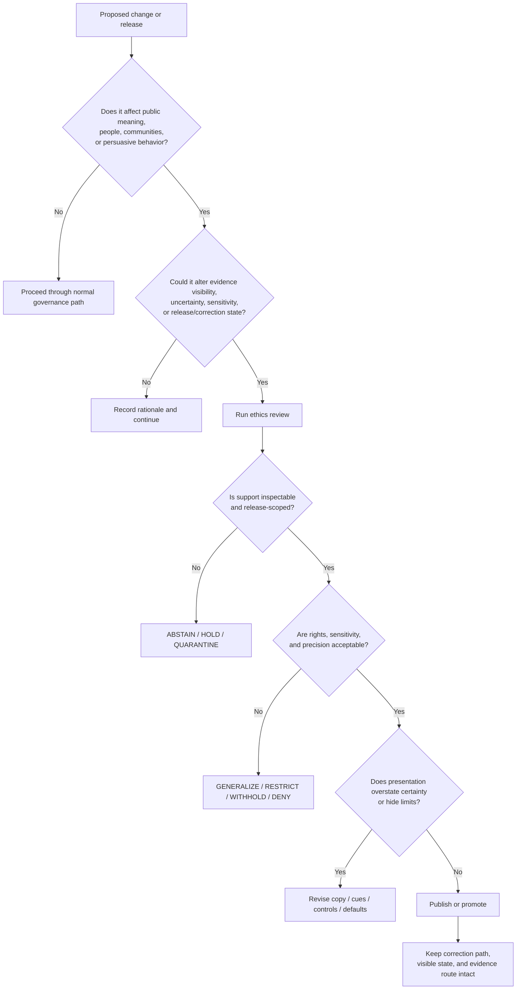

<!-- [KFM_META_BLOCK_V2]
doc_id: kfm://doc/NEEDS_VERIFICATION_UUID
title: Kansas Frontier Matrix — Ethics
type: standard
version: v1
status: draft
owners: @bartytime4life
created: 2026-02-24
updated: 2026-03-22
policy_label: NEEDS_VERIFICATION
related: [docs/governance/README.md, docs/governance/ROOT_GOVERNANCE.md, docs/governance/SOVEREIGNTY.md, CODE_OF_CONDUCT.md, SECURITY.md]
tags: [kfm, governance, ethics, public-consequence, trust]
notes: [doc_id placeholder until registry-backed ID is assigned, policy_label requires repo confirmation, owner is confirmed only as the current broad CODEOWNERS fallback, created and updated dates were confirmed from current public file history]
[/KFM_META_BLOCK_V2] -->

# Kansas Frontier Matrix — Ethics

Ethical and public-consequence guardrails for how KFM presents, narrows, withholds, explains, and corrects evidence-bearing claims.

> **Status:** Draft  
> **Owners:** `@bartytime4life` *(confirmed broad `CODEOWNERS` fallback; governance-specific owner mapping still needs verification)*  
> **Repo fit:** `docs/governance/ETHICS.md`  
> **Related:** [`./README.md`](./README.md) · [`./ROOT_GOVERNANCE.md`](./ROOT_GOVERNANCE.md) · [`./SOVEREIGNTY.md`](./SOVEREIGNTY.md) · [`../../CODE_OF_CONDUCT.md`](../../CODE_OF_CONDUCT.md) · [`../../SECURITY.md`](../../SECURITY.md)  
> **Quick jump:** [Scope](#scope) · [Evidence basis](#evidence-basis) · [Ethical commitments](#ethical-commitments) · [Public-consequence guardrails](#public-consequence-guardrails) · [Sensitive knowledge](#people-communities-and-sensitive-knowledge) · [AI and scoring](#ai-ranking-scoring-and-derived-judgment) · [Decision flow](#ethics-decision-flow) · [Definition of done](#definition-of-done)

> [!IMPORTANT]
> This file governs **ethical and public-consequence behavior** in KFM. It is about how the system should behave when evidence, people, communities, uncertainty, publication, and persuasive presentation intersect.
>
> It does **not** replace:
> - contributor conduct rules in [`../../CODE_OF_CONDUCT.md`](../../CODE_OF_CONDUCT.md)
> - security controls and incident handling in [`../../SECURITY.md`](../../SECURITY.md)
> - sovereignty- or sensitivity-specific handling in [`./SOVEREIGNTY.md`](./SOVEREIGNTY.md)
> - machine-checkable policy bundles in [`../../policy/`](../../policy/)
> - contract, schema, fixture, and test-backed enforcement surfaces in [`../../contracts/`](../../contracts/) and [`../../tests/`](../../tests/)

---

## Scope

This file exists for changes that affect:

- people, communities, or public interpretation
- persuasive behavior, framing, or selective visibility
- uncertainty display, confidence language, or omission risk
- sensitive locations, oral histories, archives, biodiversity, archaeology, or community-held material
- scoring, ranking, prioritization, recommendation, or AI-assisted explanation
- negative outcomes such as abstention, denial, generalization, withholding, withdrawal, or correction

### What belongs here

This file should be the first stop for work involving:

- public-facing maps, stories, dossiers, exports, or Focus / assistant responses
- decisions about what is shown, hidden, generalized, narrowed, or withheld
- interaction design that can influence interpretation or action
- language, labels, warnings, caveats, confidence cues, or uncertainty handling
- release decisions that change public consequence or trust posture

### What does **not** belong here

This file is not the right home for:

- interpersonal behavior expectations between contributors  
  → use [`../../CODE_OF_CONDUCT.md`](../../CODE_OF_CONDUCT.md)
- infrastructure hardening, credential handling, or vulnerability reporting  
  → use [`../../SECURITY.md`](../../SECURITY.md)
- sovereignty-, repatriation-, tribal-, or culturally specific release handling details  
  → use [`./SOVEREIGNTY.md`](./SOVEREIGNTY.md)
- implementation-only schemas, registries, or fixture files  
  → use contract, policy, and test surfaces

---

## Repo fit

| Field | Value |
|---|---|
| Path | `docs/governance/ETHICS.md` |
| Role in repo | Ethical and public-consequence rules for KFM behavior |
| Upstream inputs | KFM doctrine, governance docs, product-surface design, policy posture, sensitivity handling |
| Downstream effects | UI behavior, copy, defaults, review gates, release posture, escalation, correction behavior |
| Closest adjacent docs | `docs/governance/README.md`, `docs/governance/ROOT_GOVERNANCE.md`, `docs/governance/SOVEREIGNTY.md` |
| Machine companions | `../../policy/` · `../../contracts/` · `../../tests/` |
| Cross-cutting consumers | product, UX, data, review/stewardship, API/runtime, story/editorial, release governance |

---

## Evidence basis

This file keeps certainty narrow on purpose. It is grounded in visible repo surfaces and repeated KFM doctrine, and it leaves unresolved implementation detail visible instead of smoothing it into confident prose.

| Evidence layer | What this file treats as grounded |
|---|---|
| **Current public repo surfaces** | `docs/governance/ETHICS.md`, `./README.md`, `./ROOT_GOVERNANCE.md`, `./SOVEREIGNTY.md`, `.github/CODEOWNERS`, `../../CODE_OF_CONDUCT.md`, and `../../SECURITY.md` confirm the target path, governance cluster, broad owner fallback, and the distinct roles of conduct and security surfaces. |
| **Doctrinal anchors carried through this directory** | The truth path, trust membrane, authoritative-versus-derived split, evidence one hop away, finite governed outcomes, and visible correction lineage remain load-bearing for any ethics rule stated here. |
| **Still unresolved before merge** | Registry-backed `doc_id`, canonical `policy_label`, governance-specific owners beyond the broad fallback, canonical public security-doc path, and any active GitHub rulesets or workflow enforcement that are not derivable from public files alone. |

---

## Reading rule

Use the labels below literally.

| Label | Meaning in this file |
|---|---|
| **CONFIRMED** | Grounded in visible project doctrine or current public repo evidence |
| **INFERRED** | Strongly implied by project doctrine, but not directly proven as mounted implementation |
| **PROPOSED** | Recommended guardrail or workflow shape that fits KFM doctrine |
| **UNKNOWN** | Not verified strongly enough to state as current project fact |
| **NEEDS VERIFICATION** | Placeholder or relationship that should be confirmed before publication or automation |

---

## Ethical commitments

KFM is not just expected to be useful. It is expected to stay **truthful under pressure**.

| Commitment | Operational meaning |
|---|---|
| **Evidence before persuasion** | No consequential claim should outrun inspectable support. |
| **Context before compression** | Summaries, stories, and map labels must not flatten source meaning into misleading convenience. |
| **Uncertainty before confidence theater** | Missingness, ambiguity, recency gaps, and modeled status stay visible when they change interpretation. |
| **Stewardship before exposure** | If release could cause harm, narrow, generalize, hold, quarantine, or deny rather than publish by inertia. |
| **Correction before quiet supersession** | Changes that matter publicly must preserve lineage, not erase it. |
| **Human consequence before engagement metrics** | Design must not optimize for clicks, drama, urgency, or false certainty at the cost of truthful interpretation. |
| **Negative outcomes are healthy** | Abstain, deny, hold, quarantine, generalize, withdraw, and narrow are valid trust-preserving results. |

> [!NOTE]
> KFM should prefer **auditable incompleteness** over impressive but weakly supported completeness.

---

## Public-consequence guardrails

### 1. Do not imply more certainty than the evidence supports

Never present a result as settled when it is:

- inferred from incomplete support
- modeled rather than directly observed
- stale relative to the user-visible time frame
- generalized for safety
- under review, corrected, disputed, or partially reconstructed

### 2. Do not hide interpretive state changes

Whenever meaning changes, the surface should make that change visible:

- promoted vs draft
- public-safe vs restricted
- precise vs generalized
- current vs stale-visible
- observed vs modeled vs derived
- valid vs disputed vs superseded vs withdrawn

### 3. Do not use evidence decoratively

Evidence links, citations, or provenance controls must not be mere reassurance theater.

A user should be able to move from a consequential claim to:

1. its governing scope
2. its evidence package
3. its release state
4. its rights/sensitivity posture
5. its correction or review context when relevant

### 4. Do not let convenience layers masquerade as truth

Derived layers are useful, but they must not quietly become sovereign:

- tiles
- graph expansions
- search views
- summaries
- dashboards
- AI answers
- cached rankings
- scene / 3D projections
- exports assembled from derived material

### 5. Do not make policy refusal invisible

If something is narrowed, blocked, generalized, or withheld for rights, sensitivity, safety, or review reasons, the system should fail **calmly but visibly**.

---

## Anti-patterns to reject

| Anti-pattern | Why it is rejected |
|---|---|
| **Persuasive but unsupported copy** | Violates cite-or-abstain posture. |
| **Silent narrowing of scope** | Makes answers look stronger than they are. |
| **Decorative evidence drawers** | Simulates trust without enabling inspection. |
| **Color-only risk communication** | Excludes users and hides trust state. |
| **Score opacity** | Turns derived judgment into uninspectable authority. |
| **Narrative convenience over provenance** | Especially harmful for archives, oral histories, and heritage. |
| **Exact sensitive-location exposure by default** | Creates preventable harm. |
| **“Best effort” publication under rights ambiguity** | KFM should default to hold/quarantine, not leak-forward. |
| **Dark patterns in review or release** | Weakens stewardship and encourages accidental publication. |
| **Frictionless confidence in Focus / AI surfaces** | Violates bounded-answer doctrine. |

---

## Truth, uncertainty, and claim presentation

### Required claim behavior

Every consequential outward claim should preserve, in some visible form:

- **what** is being claimed
- **where** it applies
- **when** it applies
- **how** it was derived or observed
- **what release state** it belongs to
- **what evidence path** supports it
- **what uncertainty or limitation** changes its interpretation

### Required uncertainty behavior

Uncertainty should be shown when it is load-bearing, including:

- missing or partial coverage
- time lag or stale publication
- mismatched support or granularity
- observed vs modeled distinctions
- known data-quality caveats
- cross-source conflict
- withheld or generalized detail
- OCR / transcription ambiguity
- unresolved rights or reuse limits

### Language rules

Prefer language that reveals condition rather than conceals it.

| Avoid | Prefer |
|---|---|
| “proves” | “supports,” “indicates,” “documents,” “suggests,” “records” |
| “complete” | “released scope,” “current visible scope,” “available in this release” |
| “the system knows” | “the released evidence indicates” |
| “the answer is” | “based on the released scope, the best supported answer is…” |
| “no evidence of” when scope is partial | “no evidence found in the current released scope” |

> [!WARNING]
> A smooth answer that cannot reconstruct its evidence path is not a polished success. It is an ethical failure.

---

## People, communities, and sensitive knowledge

Some material has a higher publication burden even when it is historically or scientifically valuable.

### High-burden categories

Treat the following as **review-bearing by default** unless a stricter rule already exists elsewhere:

- oral histories
- community-contributed material
- archival scans and transcripts with reuse constraints
- culturally sensitive heritage material
- archaeology and site context
- rare-species and exact biodiversity locations
- exact locations tied to vandalism, extraction, trespass, or cultural harm
- Indigenous, tribal, or community-held knowledge
- material that could expose private persons, vulnerable sites, or operational weaknesses

### Required handling posture

For these categories, the system may need to:

- generalize
- restrict
- redact
- hold
- quarantine
- publish only excerpts or summaries
- require steward review
- preserve contributor/source context more explicitly
- avoid exact coordinates, raw scans, or unrestricted downloads

### Documentary and oral-history rule

Narrative material is not free-floating fact paste.

When working with:

- newspapers
- letters
- oral histories
- transcripts
- archival descriptions
- captions
- interpretive documents

KFM should preserve:

- original context
- speaker/creator framing when appropriate
- uncertainty around interpretation or transcription
- rights/reuse constraints
- the difference between testimony, assertion, record, and later analysis

---

## AI, ranking, scoring, and derived judgment

### AI rule

AI may assist. It may not become the hidden authority.

Allowed uses include bounded synthesis, retrieval support, OCR assistance, draft explanation, and scoped question answering.

Not allowed:

- uncited confident answers
- policy bypass
- invented completeness
- hidden narrowing of retrieved scope
- suppression of negative outcomes
- presenting synthesized prose as stronger than the released evidence

### Required Focus / assistant behavior

Any governed answer surface should support only finite outcomes such as:

- **ANSWER**
- **ABSTAIN**
- **DENY**
- **ERROR**
- **NARROWED / PARTIAL**
- **STALE-VISIBLE**
- **WITHDRAWN / SUPERSEDED**

### Ranking and score ethics

Scores, indexes, or recommendations should be:

- decomposable
- inspectable
- versioned
- contextualized
- visibly derived
- accompanied by uncertainty or limitation cues where needed

Do **not**:

- collapse heterogeneous evidence into a single magic score without breakdown
- mix observed, modeled, and inferential signals without labeling
- use ranking outputs as if they were canonical truth
- imply moral or civic priority from a score without showing its construction

---

## Interaction and UX ethics

### Trust-visible interaction rules

The interface should make trust visible at the point of use, not in buried appendix space.

That means:

- time scope stays visible when historical interpretation matters
- evidence is one hop away from consequential claims
- freshness, review, and correction state stay in-place
- generalized, partial, stale, modeled, disputed, or blocked states are labeled in-place
- non-color-only encoding is used for important state distinctions
- reduced-motion mode preserves meaning, not just aesthetics
- search lands in geography / context, not detached evidence-free fragments

### Behavioral design prohibitions

KFM should not use:

- urgency theater
- guilt-based prompts
- forced-consent framing
- prechecked publication-risk defaults
- visually minimized caveats
- asymmetric buttons that push unsafe publication or approval
- hidden review consequences
- manipulative color semantics that imply certainty without support

### Accessibility as an ethics issue

Accessibility is not decoration. It is part of truthful delivery.

A surface that hides trust state from keyboard users, screen-reader users, reduced-motion users, or color-blind users is ethically broken even if its data are correct.

---

## Release, correction, and withdrawal ethics

### Release ethics

Publication is not a file copy. It is a governed state transition.

A release is ethically acceptable only when the relevant evidence, rights, sensitivity, and review conditions have actually passed.

### Correction ethics

When a public interpretation changes, KFM should prefer:

- visible supersession
- visible narrowing
- visible withdrawal
- replacement with lineage
- calm explanation over silent disappearance

### Withdrawal ethics

Withdrawal is sometimes the ethical outcome.

Examples include:

- rights revocation
- newly discovered sensitivity
- bad provenance
- materially wrong transformation
- unsafe precision
- unsupported synthesis
- policy regression discovered after publication

---

## Escalation triggers

Open or refresh ethics review when a change affects any of the following:

- what a public user can conclude
- how confidence or uncertainty is displayed
- whether a result appears more complete than before
- whether a sensitive location becomes more precise
- whether narrative context is compressed
- whether scoring / ranking changes meaning
- whether AI surfaces can answer more broadly than before
- whether a release / correction state becomes less visible
- whether a user can no longer reach evidence in one hop
- whether a design change improves aesthetics by hiding friction, warnings, or caveats

---

## Ethics decision flow

---

## Definition of done

A change that touches this file’s scope is **not done** until all applicable checks pass.

- [ ] The change does not make KFM look more certain than the evidence supports.
- [ ] Evidence remains one hop away from consequential claims.
- [ ] Rights, reuse, and sensitivity posture are still visible where they matter.
- [ ] Any narrowing, withholding, generalization, or denial is calm and explicit.
- [ ] Any modeled, derived, or AI-assisted output remains visibly non-authoritative.
- [ ] Review or publication state is not hidden by layout, copy, or defaults.
- [ ] Negative outcomes remain first-class, not treated as UX defects.
- [ ] Accessibility of trust state was checked, not assumed.
- [ ] Correction, rollback, withdrawal, or supersession behavior remains possible and visible.
- [ ] The change does not weaken separation of duty or push policy decisions into informal paths.
- [ ] Related docs and adjacent governance surfaces were updated or consciously left unchanged with reason.

---

## FAQ

### Is this the same thing as the code of conduct?

No. The code of conduct governs contributor behavior and collaboration norms. This file governs product and publication ethics, especially where evidence, public consequence, and interpretation intersect.

### Is this the same thing as machine-readable policy?

No. This file states ethical guardrails in human-readable doctrine. Contracts, registries, policy bundles, tests, and CI gates should operationalize these rules elsewhere.

### Does this file ban derived layers, scores, or AI?

No. It bans **unlabeled authority theater**. Derived or assisted outputs are allowed when they remain inspectable, bounded, policy-shaped, and visibly non-sovereign.

### Why are denial, abstention, and withholding treated as healthy?

Because KFM’s trust posture depends on refusing unsupported or unsafe publication, not on producing a satisfying answer in every case.

### Why is accessibility in an ethics doc?

Because a trust cue that some users cannot perceive is not actually a trustworthy public cue.

---

## Open verification items

| Item | Current state |
|---|---|
| Governance-specific owner mapping beyond broad `CODEOWNERS` fallback | **NEEDS VERIFICATION** |
| Registry-backed `doc_id` for the meta block | **NEEDS VERIFICATION** |
| Canonical `policy_label` value for this doc | **NEEDS VERIFICATION** |
| Exact machine-readable policy or contract surfaces that operationalize this doc on public `main` | **UNKNOWN** |
| Canonical public security-policy path for the related-links block (`SECURITY.md` vs `.github/SECURITY.md`) | **NEEDS VERIFICATION** |

---

<strong>Appendix — Working vocabulary</strong>

### Public consequence
Any feature, claim, portrayal, label, score, recommendation, omission, or interaction pattern that can materially influence public understanding, stewardship, review, safety, or action.

### Persuasion
Any design or copy move that pushes interpretation, confidence, urgency, salience, or action. In KFM, persuasion is acceptable only when it stays downstream of evidence and explicit context.

### Generalization
A deliberate reduction in precision, detail, or exposure to reduce harm or respect rights/sensitivity constraints.

### Withholding
Not releasing a thing publicly because public release would violate policy, rights, safety, or stewardship obligations.

### Abstention
A valid outcome where the system refuses to answer beyond the admissible released scope.

### Decorative evidence
Evidence UI that creates the appearance of rigor without enabling actual inspection, reconstruction, or correction.

### Silent narrowing
Reducing time range, place scope, release scope, or evidence scope without making that reduction visible to the user.

### Trust-visible state
The user-visible condition of a result, such as promoted, generalized, partial, stale-visible, denied, abstained, withdrawn, or superseded.

### Context erasure
Flattening documentary, archival, oral-history, or community-held material into decontextualized fact claims that lose provenance, speaker position, or reuse constraints.

---

_Back to top: [Kansas Frontier Matrix — Ethics](#kansas-frontier-matrix--ethics)_
