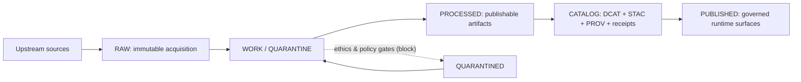
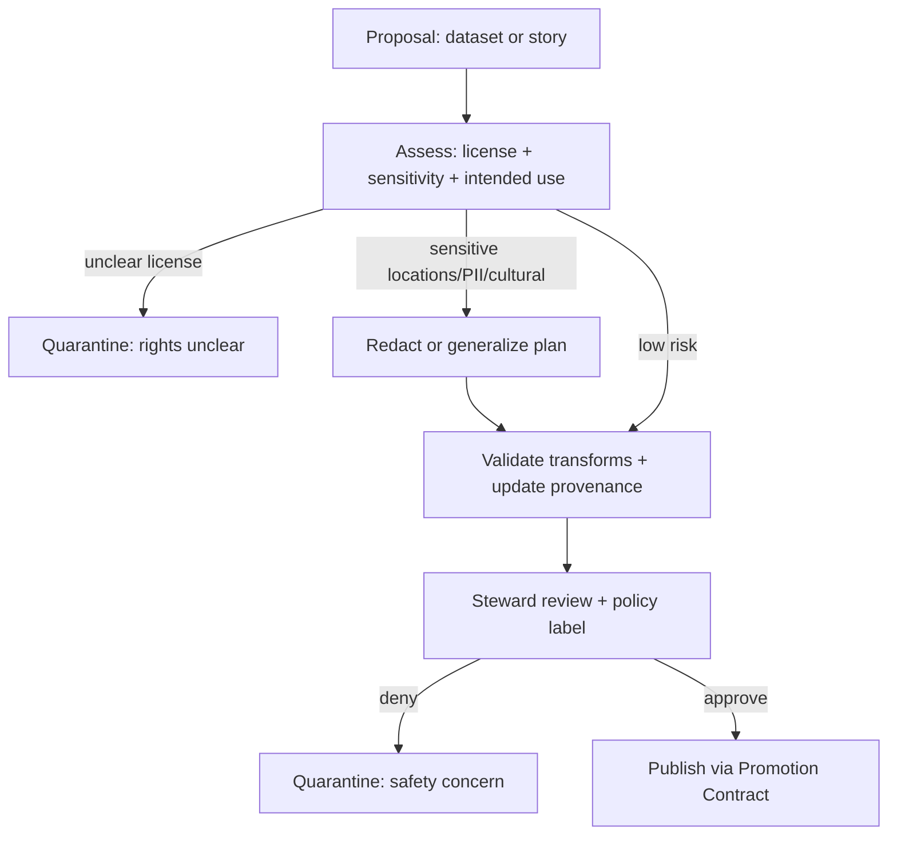

<!-- [KFM_META_BLOCK_V2]
doc_id: kfm://doc/59270a8d-78ee-4b89-a9db-81c798009b7c
title: Ethics
type: standard
version: v1
status: draft
owners: KFM Governance
created: 2026-03-02
updated: 2026-03-02
policy_label: public
related:
  - "Kansas Frontier Matrix (KFM) — Definitive Design & Governance Guide (vNext) (2026-02-20)"
  - "Tooling the KFM pipeline (2026-02-20)"
tags: [kfm, governance, ethics]
notes:
  - Ethical guardrails for datasets, stories, and Focus Mode outputs.
  - This document is not legal advice.
[/KFM_META_BLOCK_V2] -->

# Ethics

**Purpose:** Define ethical guardrails for building, publishing, and using Kansas Frontier Matrix (KFM) datasets, catalogs, maps, stories, and Focus Mode answers.

> **North star:** Every user-facing claim must be traceable to evidence and governed policy decisions.  
> **Default posture:** Fail closed when uncertain; generalize/redact before publishing.

---

## Badges (repo wiring TODO)

---

## Quick navigation

- [Where this file fits](#where-this-file-fits)
- [Ethical principles](#ethical-principles)
- [Truth path and trust membrane](#truth-path-and-trust-membrane)
- [Roles and accountability](#roles-and-accountability)
- [Ethics gates and Promotion Contract](#ethics-gates-and-promotion-contract)
- [Sensitive data and locations](#sensitive-data-and-locations)
- [Licensing and rights](#licensing-and-rights)
- [Focus Mode ethics](#focus-mode-ethics)
- [Review checklists](#review-checklists)
- [Incident response](#incident-response)
- [Change control](#change-control)

---

## Where this file fits

**Location:** `docs/governance/ETHICS.md`  
**Audience:** contributors, reviewers/stewards, operators, product/UX, and policy engineers.

### Acceptable inputs

This file should contain:

- Ethical principles and definitions that remain stable over time
- Minimum required gates/checklists for promotion and publishing
- Escalation triggers (when to involve stewards / community governance)
- Examples of *safe* public representation patterns (generalization/redaction)

### Exclusions

This file must **not** contain:

- Secrets, credentials, or operational exploit details
- “How to find/target” instructions for vulnerable or restricted locations
- Any release-specific operational runbooks (those belong in runbooks)
- Legal advice (coordinate with counsel for legal interpretation)

---

## Ethical principles

KFM ethics are not “nice-to-have.” They are product requirements.

### 1) Do no harm

KFM MUST avoid enabling:

- targeting of individuals, households, or vulnerable populations
- looting or disturbance of archaeological sites
- exploitation of culturally sensitive knowledge
- harassment, discrimination, or profiling
- unsafe operational decisions caused by unverified outputs

### 2) Consent, community rights, and CARE-aligned practice

When datasets or narratives involve communities with special rights (including Indigenous and culturally restricted materials), KFM MUST:

- prefer community-defined access rules over “open by default”
- support restricted collections and safe public representations
- document culturally specific obligations in policy (not tribal knowledge)

### 3) Evidence-first and cite-or-abstain

For **stories** and **Focus Mode answers**:

- If evidence cannot be resolved and policy-allowed, the system MUST **abstain** or reduce scope.
- Citations MUST refer to resolvable evidence objects (not “random URLs”).

### 4) Default-deny when uncertain

If licensing is unclear, sensitivity is unclear, or the safety of publishing is unclear:

- the dataset/story MUST remain in **WORK/QUARANTINE**
- or be published only as a **public-generalized** representation (if allowed)

### 5) Minimize exposure

Prefer the least-privilege, least-identifying, least-actionable representation that still supports the public purpose.

### 6) Reproducibility and auditability are ethical requirements

Ethics decisions MUST be reviewable later:

- what was published, when, by whom
- under what license/terms
- under what policy label and obligations
- with what transformations (redaction/generalization) and why

---

## Truth path and trust membrane

KFM ethics are enforced through **process**, not promises: the truth path lifecycle, the Promotion Contract gates, and a trust membrane that ensures clients only access data through governed APIs.

**Key ethic:** ethics/policy decisions must be **encoded** (labels + obligations) and enforced (CI + runtime).

---

## Roles and accountability

KFM governance should start with a minimal set of roles and evolve.

| Role | Ethical authority | Typical actions | Hard limits |
|---|---|---|---|
| Public user | None | View public layers/stories | No access to restricted evidence |
| Contributor | Propose only | Draft datasets/stories; supply sources & context | Cannot publish without review |
| Reviewer / Steward | Approve & label | Assign policy labels; approve promotions; define redaction obligations | Cannot bypass gates; must document decisions |
| Operator | Run pipelines | Execute promotions/builds; operate infra | Cannot override policy outcomes |
| Governance council / community stewards | Cultural authority | Define rules for culturally sensitive materials and safe public representations | May require additional restrictions |

> **NOTE:** “Ethics authority” is not the same as “technical admin.” No one should be able to “sudo past” governance.

---

## Ethics gates and Promotion Contract

Ethical review is not a separate ceremony—it is embedded in the gates that control what becomes public.

### Ethics decision flow

### Minimum ethics gates (normative)

A dataset/story MUST NOT be published unless:

- **License/rights are explicit** and preserved as a snapshot
- **Sensitivity is classified** with an assigned `policy_label`
- **Obligations are testable** (e.g., “generalize geometry”, “remove fields”, “metadata-only reference”)
- **Catalogs and provenance reflect the ethics transform** (redaction/generalization is recorded as a first-class transform)
- **Receipts/logs do not leak restricted data** (receipts may require redaction or restricted retention)

---

## Sensitive data and locations

### Categories that require heightened protection

KFM MUST treat the following as high risk by default:

1. **Personally identifying information (PII)** and quasi-identifiers (addresses, precise trajectories)
2. **Sensitive locations**, including:
   - archaeological sites and looting-sensitive areas
   - critical infrastructure details where targeting risk exists
   - endangered species nesting/den sites
   - culturally restricted/sacred sites
3. **Victimization risk** data (domestic violence shelters, immigration vulnerability, etc.)
4. **Security-sensitive operational details** (keys, internal network diagrams, credentials)

### Allowed public representations (safe patterns)

When publication is allowed, prefer:

- **Aggregation** (counts by county / grid cell) over points
- **Spatial generalization** (snap to coarse grid, jitter, bounding region) over exact coordinates
- **Temporal coarsening** (month/season) over exact timestamps
- **Field suppression** (remove free-text notes, exact addresses, IDs)

### Explicit prohibitions

KFM MUST NOT:

- publish exact coordinates for restricted locations unless policy explicitly allows
- embed precise coordinates in Story Nodes or Focus Mode outputs when policy does not allow
- reveal restricted metadata through error messages (including 403/404 responses)

---

## Licensing and rights

Ethics includes honoring the people and institutions who created and stewarded the data.

### Principles

- “Online availability” does not imply permission to reuse.
- Rights metadata is a **policy input**, not paperwork.

### Operational requirements

- Promotion MUST be blocked if license/rights holder is missing or unclear.
- “Metadata-only reference” is allowed when you can catalog an item but cannot mirror it.
- Exports/downloads MUST include attribution and license text automatically.
- Story publishing MUST be blocked if rights are unclear for included media.

---

## Focus Mode ethics

Focus Mode is not a generic chatbot. It is a governed system that must **earn trust**.

### Hard requirements

Focus Mode MUST:

1. **Scope to policy-allowed evidence only** (policy pre-check happens before bundling evidence)
2. **Cite-or-abstain**: every citation must resolve to an evidence bundle, or the response must abstain/reduce scope
3. **Avoid leakage**: no restricted fields, metadata, or coordinates in the synthesis if policy forbids it
4. **Emit a run receipt** for auditability; receipts must be classified and redacted as needed

### Prompt-injection and data exfiltration posture

Treat user-provided text as untrusted input. Focus Mode MUST resist:

- requests to reveal hidden system prompts or restricted evidence
- instructions to ignore policy gates
- attempts to “reconstruct” restricted locations from partial data

---

## Review checklists

### Dataset ethics checklist (minimum)

- [ ] License/rights holder documented; terms snapshot stored
- [ ] Sensitivity classified; `policy_label` set
- [ ] Restricted/sensitive-location risk assessed
- [ ] Public representation defined (if restricted): aggregation/generalization plan
- [ ] Redaction/generalization transforms recorded in provenance
- [ ] CI policy fixtures cover allow/deny + obligations
- [ ] Receipt/log redaction reviewed (no leakage)

### Story ethics checklist (minimum)

- [ ] All citations resolve to evidence bundles (no guesswork)
- [ ] No restricted coordinates/identifiers exposed
- [ ] Media (images/docs) reuse rights verified
- [ ] Claims avoid stigmatizing language; uncertainty is explicit
- [ ] Steward review completed; publishing event is auditable

### Focus Mode feature checklist (minimum)

- [ ] Policy pre-check implemented
- [ ] Evidence bundle resolution enforced
- [ ] Citation verification gate enforced
- [ ] Abstain path implemented and tested
- [ ] Receipt created and stored under correct classification

---

## Incident response

If an ethical breach occurs (e.g., sensitive location leaked, rights violation, harmful output):

1. **Contain**: disable affected surfaces (kill-switch / deny policy) and stop further leakage
2. **Assess**: what was exposed, to whom, and for how long (use receipts/audit ledger)
3. **Notify**: stewards + security + affected communities/rights holders as appropriate
4. **Remediate**: revoke/rotate, redact, re-issue corrected dataset versions
5. **Learn**: write an incident note and add regression tests + updated obligations

> **WARNING:** Do not “hotfix” by deleting evidence. Prefer superseding with a new version and recording the decision.

---

## Change control

Ethics changes MUST be treated as production changes:

- small diffs, reviewable and reversible
- policy-as-code: CI and runtime must share semantics and fixtures
- include a short rationale and tests (where possible)

**Minimum outputs for an ethics change PR:**

- a diff to this file (or an adjacent rubric/checklist)
- an updated policy fixture (allow/deny + obligations)
- a test ensuring the new rule fails closed when violated
