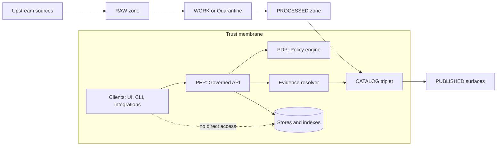

<!-- [KFM_META_BLOCK_V2]
doc_id: kfm://doc/7b4e6b70-89c9-4a2e-b4de-2d0b8b2e50f2
title: Governance Glossary
type: standard
version: v1
status: draft
owners: governance-stewards
created: 2026-03-02
updated: 2026-03-02
policy_label: public
related:
  - docs/governance/ROOT_GOVERNANCE.md
  - docs/governance/REVIEW_GATES.md
  - docs/governance/SECURITY.md
  - docs/governance/ETHICS.md
tags: [kfm, governance, glossary]
notes:
  - TODO: confirm owners + policy_label naming in the live repo governance model.
  - This glossary is normative for KFM governance + contracts; if a schema/contract disagrees, the schema wins.
[/KFM_META_BLOCK_V2] -->

# KFM Governance Glossary
**Purpose:** define shared, auditable meanings for governance terms used across the KFM truth path, policy boundary, evidence resolution, and publishing workflows.


---

## Quick navigation
- [Legend](#legend)
- [System picture](#system-picture)
- [Glossary](#glossary)
  - [A–C](#ac)
  - [D–I](#di)
  - [L–P](#lp)
  - [Q–T](#qt)
  - [U–Z](#uz)
- [Controlled vocabularies](#controlled-vocabularies)
- [How to add or change terms](#how-to-add-or-change-terms)

---

## Legend

### Status tags used in this glossary
- **CONFIRMED**: defined as an invariant/contract in the KFM governance + delivery docs (should be treated as “must be true”).
- **PROPOSED**: recommended default or starter list (acceptable to change with an explicit governance decision + version bump).
- **UNKNOWN**: included for completeness, but not yet confirmed in KFM artifacts in this repo (requires verification before treating as contract).

### Normative keywords
- **MUST** = required to preserve the trust membrane and promotion gates.
- **SHOULD** = strongly recommended default (deviations require rationale).
- **MAY** = optional / context-dependent.

> NOTE: This glossary exists to prevent “silent assumptions.” If two teams use the same word differently, we treat that as a governance defect, not “semantics.”

---

## System picture



---

## Glossary

### A–C

#### Abstain (cite-or-abstain) — **CONFIRMED**
When the system cannot produce **policy-allowed, resolvable evidence** for a claim, it MUST **refuse**, narrow scope, or ask for a governed alternative rather than guessing.  
**Where enforced:** Focus Mode synthesis gate; Story publishing gate.  
**See also:** [Citation (KFM)](#citation-kfm--confirmed), [EvidenceRef](#evidenceref--confirmed).

#### Acquisition copy — **CONFIRMED**
An immutable copy of upstream payloads + acquisition metadata (checksums, logs, and license snapshot), stored append-only in **RAW**.  
**Where enforced:** pipeline ingest rules; promotion gates.  
**See also:** [RAW zone](#raw-zone--confirmed), [License snapshot](#license-snapshot--confirmed).

#### Agent (PROV) — **PROPOSED**
In provenance graphs, an **Agent** is an actor responsible for Activities (e.g., pipeline runner identity, CI identity, or a human steward approval event).  
**Where enforced:** PROV profile validation; run receipts.  
**See also:** [PROV](#prov--proposed), [Run receipt](#run-receipt--confirmed).

#### Allowlist — **PROPOSED**
A controlled list of explicitly permitted licenses/sources/actions used by policy gates (fail closed when an item is not on the list).  
**Where enforced:** license gate policy pack + CI tests.  
**See also:** [Default deny](#default-deny--confirmed), [Licensing and rights metadata](#licensing-and-rights-metadata--confirmed).

#### Artifact — **CONFIRMED**
A concrete output file/object produced or stored by KFM (raw blob, processed GeoParquet/COG/PMTiles, catalog JSON, run receipt, etc.) that MUST be addressable by digest and associated to a dataset version.  
**Where enforced:** content-digest rules; catalog cross-links; evidence bundles.  
**See also:** [Digest](#digest-content-digest--confirmed), [Artifact zone](#artifact-zone--proposed).

#### Artifact zone — **PROPOSED**
A label that places an artifact into one of the lifecycle zones (raw/work/processed/catalog/published) for governance + retention + promotion logic.  
**Where enforced:** catalog schemas; validators; policy decisions.  
**See also:** [Truth path](#truth-path--confirmed), [Controlled vocabularies](#controlled-vocabularies).

#### Audit ledger — **CONFIRMED**
An append-only record of governed actions and decisions (pipeline runs, promotions, policy decisions, story publishing, Focus Mode runs), sufficient to reproduce and justify what was served.  
**Where enforced:** promotion gates; operational policy.  
**See also:** [Audit reference](#audit-reference-audit_ref--confirmed), [Run receipt](#run-receipt--confirmed).

#### Audit reference (audit_ref) — **CONFIRMED**
A stable identifier returned with runtime responses (including errors) that links the response to an audit ledger entry / receipt without leaking restricted metadata.  
**Where enforced:** governed API error model; evidence resolver responses.  
**See also:** [Governed API](#governed-api--confirmed), [Policy-safe errors](#policy-safe-errors--proposed).

#### Canonical store — **CONFIRMED**
A storage surface that holds the “source of truth” artifacts for reproducibility (e.g., promoted artifacts + catalogs + receipts). Canonical stores back the truth path; they are not “best-effort caches.”  
**Where enforced:** architecture invariants; rebuildability expectations.  
**See also:** [Rebuildable store](#rebuildable-store--confirmed).

#### Catalog triplet — **CONFIRMED**
The three cross-linked catalogs that jointly define what KFM can serve and how it was produced:
- **DCAT:** what the dataset is, who published it, license/rights, and distributions
- **STAC:** what assets exist and their spatiotemporal extents + file pointers
- **PROV:** how outputs were created (inputs, tools, parameters)  
**Where enforced:** validators + link checker; evidence resolver.  
**See also:** [DCAT](#dcat--proposed), [STAC](#stac--proposed), [PROV](#prov--proposed), [Cross-linking rules](#cross-linking-rules--confirmed).

#### Citation (KFM) — **CONFIRMED**
A citation is NOT “a URL pasted into text.” It is an **EvidenceRef** that MUST resolve via the evidence resolver into an **EvidenceBundle** with the metadata + artifacts + provenance needed to inspect and reproduce a claim.  
**Where enforced:** Focus Mode gate; Story publish gate; evidence resolver contract.  
**See also:** [EvidenceRef](#evidenceref--confirmed), [EvidenceBundle](#evidencebundle--confirmed).

#### CI gate — **CONFIRMED**
A merge-blocking automated check (schema validation, policy tests, link-checking, evidence resolution tests, etc.) used to enforce invariants before promotion/publishing.  
**Where enforced:** CI workflows; promotion contract.  
**See also:** [Promotion contract](#promotion-contract--confirmed), [Policy tests and fixtures](#policy-tests-and-fixtures--confirmed).

#### Controlled vocabulary — **CONFIRMED**
A versioned list of allowed values for fields that drive governance behavior (e.g., policy_label, artifact.zone, citation.kind).  
**Where enforced:** schema validation; controlled-vocab validation; CI.  
**See also:** [Controlled vocabularies](#controlled-vocabularies).

#### Cross-linking rules — **CONFIRMED**
Deterministic linking requirements between DCAT, STAC, and PROV so navigation and evidence resolution never requires guessing. Broken links block promotion.  
**Where enforced:** link checker + CI; catalog validators.  
**See also:** [Evidence resolver](#evidence-resolver--confirmed), [Promotion gate D](#promotion-contract--confirmed).

---

### D–I

#### Dataset — **CONFIRMED**
A governed “family” of data products with stable identity, publisher accountability, license/rights, and policy labeling. A dataset has one or more versions.  
**Where enforced:** dataset registry; DCAT profile; API discovery.  
**See also:** [dataset_id](#dataset_id--confirmed), [Dataset version](#dataset-version-dataset_version_id--confirmed).

#### Dataset registry — **CONFIRMED**
The canonical inventory of datasets and required metadata (identity, publisher, license/rights, upstream acquisition, policy_label, spec references). It is an onboarding contract, not a spreadsheet.  
**Where enforced:** onboarding spec validation; discovery endpoints.  
**See also:** [Spec hash](#spec_hash--confirmed), [policy_label](#policy_label--confirmed).

#### dataset_id — **CONFIRMED**
A stable identifier used across catalogs, UI, API, and citations.  
**Where enforced:** schema + validators; link-checking; evidence resolution.  
**See also:** [Dataset version](#dataset-version-dataset_version_id--confirmed).

#### Dataset version (dataset_version_id) — **CONFIRMED**
A stable identifier for one specific release of a dataset (tied to spec_hash, content digests, catalogs, and receipts). MUST be shown in UI evidence surfaces and returned by discovery APIs.  
**Where enforced:** promotion gates; API contract; evidence UI.  
**See also:** [Deterministic identity](#deterministic-identity--confirmed).

#### DCAT — **PROPOSED**
A catalog profile used to describe datasets and distributions (“what is this dataset, who published it, what license, what distributions?”). KFM treats this as a contract surface with strict validation.  
**Where enforced:** DCAT validator; link-checker.  
**See also:** [Catalog triplet](#catalog-triplet--confirmed).

#### Default deny — **CONFIRMED**
If policy/rights/sensitivity are unclear, the system MUST deny access/promotion/publishing by default, rather than “best effort.”  
**Where enforced:** policy-as-code; promotion gates; evidence resolver.  
**See also:** [policy_label](#policy_label--confirmed), [Obligation](#obligation--confirmed).

#### Deterministic identity — **CONFIRMED**
The property that dataset versions and their outputs are reproducibly identifiable via spec_hash + content digests (preventing silent drift).  
**Where enforced:** spec hashing; digest verification; golden tests.  
**See also:** [spec_hash](#spec_hash--confirmed), [Digest](#digest-content-digest--confirmed).

#### Digest (content digest) — **CONFIRMED**
A cryptographic hash (e.g., sha256) used to address and verify artifacts. Digests MUST be present for promoted artifacts and used in catalogs/evidence.  
**Where enforced:** artifact storage rules; validators; evidence bundles.  
**See also:** [Artifact](#artifact--confirmed), [Content-addressed staging](#content-addressed-staging--proposed).

#### Distribution (DCAT distribution) — **PROPOSED**
A described way to access an artifact class (raw, processed, catalog endpoints, etc.), including license/rights and digests where applicable.  
**Where enforced:** DCAT profile validation; link-checker.  
**See also:** [DCAT](#dcat--proposed), [Catalog triplet](#catalog-triplet--confirmed).

#### Evidence drawer — **CONFIRMED**
A UI element that surfaces evidence for any map feature/story claim: dataset version, license/rights, policy badges/notices, and artifact/provenance links (if allowed).  
**Where enforced:** UI acceptance criteria; accessibility checks.  
**See also:** [EvidenceBundle](#evidencebundle--confirmed), [Policy badges and notices](#policy-badges-and-notices--proposed).

#### Evidence resolver — **CONFIRMED**
A service/route that accepts EvidenceRefs (or structured refs), applies policy (allow/deny + obligations), and returns EvidenceBundles usable by UI/Focus/Story workflows in bounded calls.  
**Where enforced:** runtime policy checks; integration tests; publish gates.  
**See also:** [EvidenceRef](#evidenceref--confirmed), [EvidenceBundle](#evidencebundle--confirmed), [PDP/PEP](#policy-enforcement-point-pep--confirmed).

#### EvidenceBundle — **CONFIRMED**
The resolved output of evidence resolution containing:
- human-view renderable “cards”
- machine metadata (JSON)
- artifact links (only if policy allows)
- digests, dataset_version_id, and audit references  
**Where enforced:** evidence resolver contract; API schema validation.  
**See also:** [Audit reference](#audit-reference-audit_ref--confirmed).

#### EvidenceRef — **CONFIRMED**
A stable reference token (scheme://…) that identifies evidence targets (datasets, catalog records, provenance runs, documents, etc.) and can be resolved without guessing.  
**Where enforced:** citations linting; link-checking; evidence resolver.  
**See also:** [Citation (KFM)](#citation-kfm--confirmed), [EvidenceRef scheme](#evidence-ref-scheme--proposed).

#### EvidenceRef scheme — **PROPOSED**
A namespace convention for EvidenceRefs (e.g., `dcat://...`, `stac://...`, `prov://...`, `doc://...`) that maps cleanly onto the catalog triplet and documentation registry.  
**Where enforced:** evidence resolver parsing + tests.  
**See also:** [citation.kind](#citationkind--proposed).

#### Focus Mode — **CONFIRMED**
A governed Q&A mode treated as a “run” that includes policy pre-checks, retrieval, evidence bundling, synthesis, citation verification, and an auditable receipt. Must abstain if evidence cannot be verified or is not policy-allowed.  
**Where enforced:** Focus Mode orchestrator; evaluation harness; audit ledger.  
**See also:** [Abstain](#abstain-cite-or-abstain--confirmed), [Run receipt](#run-receipt--confirmed).

#### Governance artifacts — **CONFIRMED**
Minimum maintained artifacts required to operate governance (policy pack + tests, licensing rubric, sensitivity rubric, review workflows, audit ledger retention policy, etc.).  
**Where enforced:** governance process + CI.  
**See also:** [Policy tests and fixtures](#policy-tests-and-fixtures--confirmed).

#### Governed API — **CONFIRMED**
The runtime surface (PEP) that enforces policy before serving data, resolving evidence, or publishing content. Clients MUST NOT access storage directly.  
**Where enforced:** architecture invariants; security + network controls; tests.  
**See also:** [Trust membrane](#trust-membrane--confirmed).

#### Immutable — **CONFIRMED**
An artifact property: once written (especially in RAW or content-addressed staging), it MUST NOT be mutated; transforms produce new artifacts with new digests.  
**Where enforced:** storage conventions; pipeline rules; digest checks.

#### Index builder — **CONFIRMED**
A system that builds projections (tiles, search indexes, graph indexes) from promoted artifacts, without becoming a new source of truth.  
**Where enforced:** rebuildability rules; architecture.  
**See also:** [Rebuildable store](#rebuildable-store--confirmed).

---

### L–P

#### License snapshot — **CONFIRMED**
A captured record of upstream license/terms at acquisition time. Required for promotion and auditability because “online availability ≠ permission to reuse.”  
**Where enforced:** promotion gate B; license policy pack.  
**See also:** [Licensing and rights metadata](#licensing-and-rights-metadata--confirmed).

#### Licensing and rights metadata — **CONFIRMED**
The license/rights/rights-holder info required to legally and ethically distribute or display artifacts (including story media). If missing/unclear, promotion/publishing blocks (fail closed).  
**Where enforced:** promotion gate B; story publish gate; export rules.  
**See also:** [Metadata-only reference mode](#metadata-only-reference-mode--confirmed).

#### Link checker — **CONFIRMED**
A validation tool that ensures catalog triplet cross-links and EvidenceRefs resolve without guessing. Broken links block merges/promotions.  
**Where enforced:** CI; promotion gate D.  
**See also:** [Cross-linking rules](#cross-linking-rules--confirmed).

#### Metadata-only reference mode — **CONFIRMED**
A governance mode where KFM catalogs an item without mirroring it (e.g., rights do not permit copying), while still tracking provenance and rights metadata.  
**Where enforced:** licensing policy + review.  
**See also:** [Licensing and rights metadata](#licensing-and-rights-metadata--confirmed).

#### MUST / SHOULD / MAY — **CONFIRMED**
Normative terms that define governance strength. MUST statements represent trust membrane or promotion contract invariants. SHOULD statements represent defaults (deviation requires documented rationale). MAY is optional.  
**Where enforced:** review + ADRs; policy tests when applicable.

#### Obligation — **CONFIRMED**
A required follow-up action attached to a policy decision (e.g., “show notice,” “generalize geometry,” “strip fields,” “include attribution text”). Obligations are first-class outputs of policy evaluation.  
**Where enforced:** evidence resolver; API responses; UI notices; pipeline transforms.  
**See also:** [policy_label](#policy_label--confirmed), [Redaction](#redaction--confirmed), [Generalization](#generalization--confirmed).

#### OPA / Rego — **PROPOSED**
A policy-as-code approach where a Policy Decision Point evaluates allow/deny and obligations using versioned rules and fixtures-driven tests.  
**Where enforced:** CI policy tests; runtime PDP.  
**See also:** [Policy Decision Point](#policy-decision-point-pdp--confirmed).

#### Operator — **PROPOSED**
A role that runs pipelines and manages deployments but cannot override policy gates.  
**Where enforced:** RACI + access controls.  
**See also:** [Reviewer/Steward](#reviewersteward--proposed).

#### Policy bundle (policy pack) — **CONFIRMED**
The versioned repository of policy rules, fixtures, and tests used in CI and runtime to ensure identical semantics (“same outcomes”) across environments.  
**Where enforced:** policy-as-code architecture; CI blocking tests.  
**See also:** [Policy tests and fixtures](#policy-tests-and-fixtures--confirmed).

#### Policy Decision Point (PDP) — **CONFIRMED**
The component that evaluates policy decisions (allow/deny + obligations) from inputs (user role, action, resource policy_label, etc.).  
**Where enforced:** runtime; CI tests (shared semantics).  
**See also:** [Policy Enforcement Point](#policy-enforcement-point-pep--confirmed).

#### Policy Enforcement Point (PEP) — **CONFIRMED**
The boundary that MUST enforce policy checks before any data/evidence is served. Examples: runtime API gateway, evidence resolver, and CI merge gates.  
**Where enforced:** network boundaries + code boundaries + tests.  
**See also:** [Trust membrane](#trust-membrane--confirmed).

#### policy_label — **CONFIRMED**
The primary classification input to policy evaluation. It drives allow/deny and triggers obligations (generalize/redact/notice).  
**Where enforced:** policy-as-code; promotion gates; runtime filtering.  
**See also:** [Controlled vocabularies](#controlled-vocabularies).

#### Policy tests and fixtures — **CONFIRMED**
Policy rules MUST have fixtures and tests that run in CI and block merges to prevent policy regressions (e.g., “public can read public,” “public cannot read restricted”).  
**Where enforced:** CI workflows; policy bundle repo.  
**See also:** [CI gate](#ci-gate--confirmed).

#### Policy-safe errors — **PROPOSED**
An API behavior requirement: error responses must not leak restricted metadata (including via 403/404 differences).  
**Where enforced:** API contract tests; security review.  
**See also:** [Default deny](#default-deny--confirmed).

#### PROV — **PROPOSED**
A provenance profile capturing: Activities per run, Entities per artifact, Agents for runner/approvals, edges for used/generated-by, policy decision references, and environment capture (container digest, git commit, parameters).  
**Where enforced:** PROV validators; run receipt generation.  
**See also:** [Run receipt](#run-receipt--confirmed).

---

### Q–T

#### Quarantine (WORK/Quarantine) — **CONFIRMED**
A lifecycle zone where intermediate transforms and QA occur and failures are isolated. Artifacts may be rewritten here; the purpose is containment before promotion.  
**Where enforced:** pipeline discipline; promotion contract gate E.  
**See also:** [WORK zone](#work-zone--confirmed).

#### RAW zone — **CONFIRMED**
The immutable acquisition zone: upstream payloads + checksums + logs + license snapshot; append-only.  
**Where enforced:** ingest pipeline; storage conventions; audits.  
**See also:** [Truth path](#truth-path--confirmed).

#### Redaction — **CONFIRMED**
The removal or transformation of sensitive fields/attributes to satisfy policy. Redaction MUST be recorded as a first-class transform in provenance (PROV).  
**Where enforced:** policy obligations; pipeline transforms; evidence resolver constraints.  
**See also:** [Obligation](#obligation--confirmed).

#### Generalization — **CONFIRMED**
A transformation that reduces precision (commonly geometry precision) to reduce harm while allowing a public representation (often via `public_generalized`). Must be explicit, validated, and disclosed (UI notice).  
**Where enforced:** policy obligations; derivative dataset creation; UI notices.  
**See also:** [public_generalized](#policy_label--confirmed).

#### Rebuildable store — **CONFIRMED**
A derived storage/index surface (tiles/search/graph indices) that can be rebuilt from canonical artifacts; it MUST NOT become an alternate source of truth.  
**Where enforced:** architecture rules; operational runbooks.  
**See also:** [Canonical store](#canonical-store--confirmed).

#### Release manifest — **CONFIRMED**
A promotion record that references the exact artifacts and digests promoted, forming the “receipt of publishing” for a dataset version.  
**Where enforced:** promotion gate G.  
**See also:** [Promotion contract](#promotion-contract--confirmed).

#### Reviewer/Steward — **PROPOSED**
A role that approves dataset promotions and story publishing; owns policy labels and redaction rules.  
**Where enforced:** review workflow; access controls.  
**See also:** [Governance council](#governance-council--proposed).

#### Governance council — **PROPOSED**
A role/group with authority to control culturally sensitive materials and set rules for restricted collections and public representations.  
**Where enforced:** governance model + policy decisions.  
**See also:** [Sensitive location](#sensitive-location--confirmed).

#### Run receipt — **CONFIRMED**
A standardized provenance/audit record emitted per run capturing inputs, tooling, hashes, and policy decisions; it supports reproducibility and append-only auditing.  
**Where enforced:** promotion gate F; receipt schema validation.  
**See also:** [Audit ledger](#audit-ledger--confirmed), [PROV](#prov--proposed).

#### PROCESSED zone — **CONFIRMED**
Publishable artifacts in standardized formats with stable IDs and checksums (e.g., GeoParquet/COG/PMTiles; derived layers; final QA results).  
**Where enforced:** promotion gates; validators.  
**See also:** [Truth path](#truth-path--confirmed).

#### PUBLISHED surfaces — **CONFIRMED**
The governed runtime surfaces served via PEP/API and UI (API responses, tiles endpoints, story pages, Focus Mode answers—each with receipts).  
**Where enforced:** policy checks; audit ledger; UI evidence visibility.  
**See also:** [Governed API](#governed-api--confirmed).

#### Sensitive location — **CONFIRMED**
Data whose precise location could enable harm (archaeology, species, hazards, vulnerable infrastructure, culturally restricted sites). Default posture is deny, or publish generalized derivatives with explicit obligations and notices.  
**Where enforced:** policy labels; default deny; redaction/generalization transforms.  
**See also:** [restricted_sensitive_location](#controlled-vocabularies), [Default deny](#default-deny--confirmed).

#### Story Node — **CONFIRMED**
A governed narrative artifact: markdown content plus sidecar state (map state + citations). Publishing requires review state and resolvable citations.  
**Where enforced:** story publish gate; evidence resolver; review workflow.  
**See also:** [Story Node sidecar](#story-node-sidecar--confirmed).

#### Story Node sidecar — **CONFIRMED**
A machine-readable file accompanying Story markdown that stores: story version, policy_label, review state, map state (bbox/zoom/layers/time window), and citations (EvidenceRefs).  
**Where enforced:** publish workflow; schema validation.  
**See also:** [Citation (KFM)](#citation-kfm--confirmed).

#### spec_hash — **CONFIRMED**
A deterministic hash derived from the dataset onboarding spec (transforms + thresholds + parameters). Used to block silent drift and anchor dataset_version identity.  
**Where enforced:** golden tests; CI drift checks; promotion gate A.  
**See also:** [Deterministic identity](#deterministic-identity--confirmed).

#### Trust membrane — **CONFIRMED**
The enforceable boundary rule: clients (including UI) never talk directly to storage. All access goes through governed APIs + policy checks, with audit references and policy-safe errors.  
**Where enforced:** architecture + network controls + tests.  
**See also:** [PEP](#policy-enforcement-point-pep--confirmed).

#### Truth path — **CONFIRMED**
The end-to-end lifecycle (zones + gates) that makes KFM reproducible and auditable. It is “not a metaphor”—it is storage zones and validation gates.  
**Where enforced:** promotion contract; CI gates.  
**See also:** [Zones](#zones--confirmed), [Promotion contract](#promotion-contract--confirmed).

#### Promotion contract — **CONFIRMED**
The minimum fail-closed gates required before promoting anything to PUBLISHED. At minimum, promotion is blocked unless identity/versioning, licensing/rights, sensitivity policy, catalog triplet validation, QA thresholds, run receipt/audit record, and release manifest exist.  
**Where enforced:** CI + steward sign-off.  
**See also:** [CI gate](#ci-gate--confirmed), [Release manifest](#release-manifest--confirmed).

#### Zones — **CONFIRMED**
The lifecycle zones that define where artifacts live and what rules apply:
- RAW (immutable acquisition)
- WORK/Quarantine (intermediate transforms + QA)
- PROCESSED (publishable artifacts + stable digests)
- CATALOG/Triplet (DCAT + STAC + PROV)
- PUBLISHED (governed runtime surfaces)  
**Where enforced:** promotion contract; storage conventions; validators.

---

### U–Z

#### UI policy badges and notices — **PROPOSED**
Visible UI elements that surface policy_label and obligations (e.g., “geometry generalized due to policy”) so trust decisions are user-visible, not hidden in metadata panes.  
**Where enforced:** UI acceptance criteria; evidence drawer design.  
**See also:** [Obligation](#obligation--confirmed).

#### Validator — **CONFIRMED**
A tool that checks schema correctness + controlled vocab compliance + referential integrity across catalogs and receipts. Validators must run in CI and block merges/promotions on failure.  
**Where enforced:** CI; promotion gate D.

---

## Controlled vocabularies

> WARNING: These are **starter lists** and MUST be versioned. Treat changes as governance decisions with a changelog entry and compatibility notes.

```yaml
policy_label:               # starter
  - public
  - public_generalized
  - restricted
  - restricted_sensitive_location
  - internal
  - embargoed
  - quarantine

artifact.zone:              # starter
  - raw
  - work
  - processed
  - catalog
  - published

citation.kind:              # starter
  - dcat
  - stac
  - prov
  - doc
  - graph
  - url  # discouraged (prefer resolvable scheme refs)
```

---

## How to add or change terms

### Change policy
- If adding a **new term**:
  - Include **Status** (CONFIRMED/PROPOSED/UNKNOWN).
  - Add **where enforced** (CI/pipeline/runtime/UI) or explicitly say “none yet.”
  - Add “See also” links to related terms.

- If changing a **CONFIRMED** term:
  - MUST be accompanied by:
    - a policy decision record (ADR or governance note),
    - a schema/contract update (if applicable),
    - and CI tests updated to match the new definition.

### Minimum “definition of done” for glossary edits
- [ ] Term definition is unambiguous
- [ ] Status tag applied correctly
- [ ] At least one enforcement point named (or “none yet”)
- [ ] Cross-links updated
- [ ] Controlled vocabulary lists updated (if applicable)

---

## Where this file fits in the repo

This file lives in `docs/governance/` and is the shared vocabulary for:
- policy-as-code docs (PDP/PEP, policy_label, obligations)
- promotion/publishing gates (promotion contract, receipts)
- evidence resolution contracts (EvidenceRef → EvidenceBundle)
- review workflows (promotion + story review)

### Acceptable inputs
- Terms used by KFM governance contracts, gates, and policy boundary
- Controlled vocabulary starter lists (versioned)
- Short, enforcement-oriented definitions

### Exclusions
- Deep implementation details of specific services (belongs in ADRs or module docs)
- Non-governance GIS terminology (belongs in domain glossaries)
- Anything that would disclose restricted locations, sensitive collections, or operational secrets
