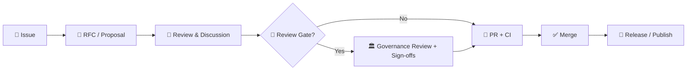

# 🏛️ Governance


---

## 📌 Quick navigation

- [🎯 Purpose](#-purpose)
- [🧭 Scope](#-scope)
- [🧱 Governance principles](#-governance-principles)
- [🧑‍⚖️ Roles and responsibilities](#-roles-and-responsibilities)
- [🗳️ Decision-making](#️-decision-making)
- [🚦 Governance review gates](#-governance-review-gates)
- [✅ Enforcement](#-enforcement)
- [🗂️ Data governance](#️-data-governance)
- [🤖 AI governance](#-ai-governance)
- [🔐 Security and privacy governance](#-security-and-privacy-governance)
- [🌍 Community governance](#-community-governance)
- [📝 Documentation standards](#-documentation-standards)
- [📁 Suggested folder layout](#-suggested-folder-layout)
- [📚 Sources](#-sources)

---

## 🎯 Purpose

This folder exists to keep the project **trustworthy at scale**:

- ✅ Every change is reviewable (PR-based)
- ✅ Every dataset is traceable (provenance-first)
- ✅ Every public output is governed (policy + review gates)
- ✅ Every AI behavior is constrained (no “ungoverned chatbot”) [oai_citation:1‡Kansas Frontier Matrix (KFM) – Comprehensive Technical Blueprint.pdf](sediment://file_000000006dbc71f89a5094ce310a452d)

KFM is designed so that **the UI never directly touches the databases**—all access is mediated by the backend API, which implements **validation + governance rules**. [oai_citation:2‡Kansas Frontier Matrix (KFM) – Comprehensive Technical Blueprint.pdf](sediment://file_000000006dbc71f89a5094ce310a452d)

---

## 🧭 Scope

| ✅ In scope | ❌ Out of scope |
|---|---|
| Repo decision-making (how decisions are proposed/approved) | External org policies not adopted by this repo |
| Data acceptance + classification + provenance requirements | One-off personal workflows outside Git history |
| AI usage, AI feature approvals, safety constraints | “Ship it anyway” bypasses around policy/CI |
| Security + privacy + sensitive data handling | Legal advice (this repo documents process, not counsel) |

---

## 🧱 Governance principles

### 1) Provenance-first (evidence-backed by default)
KFM’s blueprint defines “provenance-first” as a core system property: layers, datasets, stories, and even AI answers should remain **traceable back to original sources** to support transparency and trust. [oai_citation:3‡Kansas Frontier Matrix (KFM) – Comprehensive Technical Blueprint.pdf](sediment://file_000000006dbc71f89a5094ce310a452d)

### 2) Canonical pipeline order (no shortcuts)
Data must follow the canonical path:

**Raw → Processed → Catalog/Prov → Database → API → UI**  
Any proposal that shortcuts this is considered flawed unless proven otherwise. [oai_citation:4‡Kansas Frontier Matrix (KFM) – Comprehensive Technical Blueprint.pdf](sediment://file_000000006dbc71f89a5094ce310a452d)

### 3) Fail closed (governance-by-default)
If a policy or check fails, the system **blocks the action** (e.g., missing dataset license fails CI; forbidden AI output is refused). [oai_citation:5‡Kansas Frontier Matrix (KFM) – Comprehensive Technical Blueprint.pdf](sediment://file_000000006dbc71f89a5094ce310a452d)

### 4) FAIR + CARE by design (not retrofitted)
KFM explicitly bakes **FAIR** and **CARE** into architecture and workflow, including metadata requirements and access controls aligned to community rights and privacy expectations. [oai_citation:6‡Kansas Frontier Matrix (KFM) – Comprehensive Technical Blueprint.pdf](sediment://file_000000006dbc71f89a5094ce310a452d)

### 5) Sovereignty, privacy, and auditability
Data-governance requirements commonly emphasized in “data spaces” include:
- **data sovereignty & privacy**
- **non-repudiation & auditability**
- **trustfulness through transparency, security, and control** [oai_citation:7‡Data Spaces.pdf](sediment://file_0000000053c071f5a9733b1b09cc9f76)

KFM’s governance aligns to these concerns through policy enforcement, provenance, and controlled access patterns. [oai_citation:8‡Kansas Frontier Matrix (KFM) – Comprehensive Technical Blueprint.pdf](sediment://file_000000006dbc71f89a5094ce310a452d)

### 6) Fair governance (participation + transparency + accountability)
A governance model should be fair, meaning (among other things): participation, transparency, consensus-orientation, and accountability. [oai_citation:9‡Introduction to Digital Humanism.pdf](sediment://file_0000000090a071f5afd5c78c4383e488)

### 7) Human-centered oversight (ethical privacy, stakeholder voice)
Digital Humanism emphasizes that privacy and harm can apply to **communities**, not only individuals, and that governance needs accountability, resources, and stakeholder participation. [oai_citation:10‡Introduction to Digital Humanism.pdf](sediment://file_0000000090a071f5afd5c78c4383e488)  
It also argues that independent oversight (e.g., advisory boards) can strengthen accountability for AI systems and their impacts. [oai_citation:11‡Introduction to Digital Humanism.pdf](sediment://file_0000000090a071f5afd5c78c4383e488)

---

## 🧑‍⚖️ Roles and responsibilities

> 🧩 Small-team friendly: one person may hold multiple roles, but the responsibilities remain the same.

### Core roles

- **Maintainers 🧭**  
  Own code quality, PR review, CI gates, release readiness.

- **Governance Board 🏛️**  
  Handles review gates, sensitive topics, exceptions/waivers, and governance-policy changes (explicitly referenced as an option in governance triggers). [oai_citation:12‡MARKDOWN_GUIDE_v13.md.gdoc](file-service://file-UYVruFXfueR8veHMUKeugU)

- **Data Steward 🗂️**  
  Approves dataset acceptance, classification, redaction plans, licensing and provenance completeness.

- **AI Steward 🤖**  
  Oversees AI-related features, evaluation gates, system prompt + policy changes, and “AI narrative” risks. [oai_citation:13‡MARKDOWN_GUIDE_v13.md.gdoc](file-service://file-UYVruFXfueR8veHMUKeugU)

- **Security Lead 🔐**  
  Coordinates vulnerability handling and security incident response.

- **Release Manager 🚀**  
  Owns release cut, changelog, artifact integrity (SBOM/provenance attestations at release time). [oai_citation:14‡MARKDOWN_GUIDE_v13.md.gdoc](file-service://file-UYVruFXfueR8veHMUKeugU)

### RACI (who does what)

Legend: **R**=Responsible, **A**=Accountable, **C**=Consulted, **I**=Informed

| Activity | Maintainers | Governance Board | Data Steward | AI Steward | Security Lead | Release Mgr | Contributors |
|---|---:|---:|---:|---:|---:|---:|---:|
| Merge routine code PRs | R/A | I | I | I | C | I | R |
| Add new dataset | R | C | A | I | C | I | R |
| Change classification/sensitivity | R | A | R | I | C | I | C |
| New external data source | R | A | R | I | C | I | C |
| New public API/output surface | R | A | C | C | R | I | C |
| New AI narrative feature | R | A | C | R | C | I | C |
| Security incident response | C | I | I | I | R/A | I | I |
| Release (tags, artifacts) | C | I | I | I | C | R/A | I |
| Governance policy changes | C | R/A | C | C | C | I | C |

---

## 🗳️ Decision-making

We default to **consensus**, with documented fallback paths if consensus fails (fair governance emphasizes transparency, responsiveness, and accountability). [oai_citation:15‡Introduction to Digital Humanism.pdf](sediment://file_0000000090a071f5afd5c78c4383e488)

### Decision tiers

1. **Tier 0 — Editorial / docs-only**  
   ✅ PR + 1 maintainer approval

2. **Tier 1 — Standard code change**  
   ✅ PR + CI pass + required reviewers (CODEOWNERS if used)

3. **Tier 2 — Data/AI/API changes**  
   ✅ PR + CI pass + domain review (Data Steward / AI Steward)  
   🚦 May trigger [Governance Review Gates](#-governance-review-gates)

4. **Tier 3 — Policy / classification / sensitive topics / major architectural change**  
   ✅ Requires Governance Board decision + recorded rationale

### The default workflow (Issue → RFC → PR → Merge)



### Where decisions are recorded

- **Decision log:** `docs/governance/DECISIONS.md` *(recommended)*
- **RFC folder:** `docs/governance/rfc/` *(recommended)*

> 📎 Rule: governance-impacting decisions should be traceable to a PR + a written record (issue/RFC/decision log) to preserve institutional memory.

---

## 🚦 Governance review gates

Certain changes must trigger **manual governance review** beyond CI. The project docs describe examples that merit closer scrutiny by maintainers or a governance board, such as: sensitive data, AI narrative features, new external data sources, new public-facing outputs, and classification/sensitivity changes. [oai_citation:16‡MARKDOWN_GUIDE_v13.md.gdoc](file-service://file-UYVruFXfueR8veHMUKeugU)

### Triggers (non-exhaustive)

- 🧬 **Introducing sensitive data or layers** (incl. culturally sensitive or sovereignty-related)
- 🤖 **New AI-driven narrative features** (risk of unsourced “factual” claims)
- 🔗 **New external data sources** (license + provenance + standards alignment)
- 🌐 **New public-facing outputs** (risk of exposing sensitive information)
- 🏷️ **Classification/sensitivity changes** (public ↔ restricted, rules changed)

These reviews are expected to be documented (e.g., `docs/governance/REVIEW_GATES.md`) as a human supplement to automated checks. [oai_citation:17‡MARKDOWN_GUIDE_v13.md.gdoc](file-service://file-UYVruFXfueR8veHMUKeugU)

### Sovereignty & safety measures (redaction must propagate)
When data requires redaction/generalization, project guidance describes applying redaction across:
- processed outputs
- metadata (STAC/DCAT)
- API enforcement
- UI checks  
…and documenting the transformation transparently. [oai_citation:18‡MARKDOWN_GUIDE_v13.md.gdoc](file-service://file-UYVruFXfueR8veHMUKeugU)

---

## ✅ Enforcement

Governance is enforced through **architecture**, **policy-as-code**, and **CI gates**.

### 1) Architectural enforcement (API mediates access)
KFM’s blueprint explicitly states that the UI does not directly query databases; governance is mediated by the backend API which implements validation and governance rules. [oai_citation:19‡Kansas Frontier Matrix (KFM) – Comprehensive Technical Blueprint.pdf](sediment://file_000000006dbc71f89a5094ce310a452d)

### 2) Policy-as-code
The repository structure describes a `policy/` folder for governance policy definitions (e.g., OPA Rego rules and AI/data guidelines). [oai_citation:20‡Kansas Frontier Matrix (KFM) – Comprehensive Technical Blueprint.pdf](sediment://file_000000006dbc71f89a5094ce310a452d)

### 3) CI gates (automated scans + contracts)
Project guidance describes automated CI checks such as:
- secret scanning (prevent keys/tokens in repo)
- PII/sensitive data scans
- sensitive location checks (ensure protected coordinates aren’t exposed)
- classification consistency checks (prevent “downgrading” without approved de-identification) [oai_citation:21‡MARKDOWN_GUIDE_v13.md.gdoc](file-service://file-UYVruFXfueR8veHMUKeugU)

Only once gates pass (or are explicitly waived with approval) should PRs be merged. [oai_citation:22‡MARKDOWN_GUIDE_v13.md.gdoc](file-service://file-UYVruFXfueR8veHMUKeugU)

### 4) Release-time integrity
Guidance also notes that official releases may produce signed artifacts including **SBOMs** and provenance attestations at release time. [oai_citation:23‡MARKDOWN_GUIDE_v13.md.gdoc](file-service://file-UYVruFXfueR8veHMUKeugU)

---

## 🗂️ Data governance

### Data lifecycle contract

- **Raw**: immutable source snapshots  
- **Processed**: cleaned/standardized derivatives  
- **Catalog + Provenance**: metadata + lineage artifacts  
- **Database**: indexed/queryable representations  
- **API**: controlled access layer  
- **UI**: presentation layer (no direct DB access) [oai_citation:24‡Kansas Frontier Matrix (KFM) – Comprehensive Technical Blueprint.pdf](sediment://file_000000006dbc71f89a5094ce310a452d) [oai_citation:25‡Kansas Frontier Matrix (KFM) – Comprehensive Technical Blueprint.pdf](sediment://file_000000006dbc71f89a5094ce310a452d)

### Minimum bar for new datasets (PR checklist)

- [ ] License is clear (and compatible)
- [ ] Provenance is recorded (sources, transformations, dates)
- [ ] Classification/sensitivity is set
- [ ] Required metadata exists (machine-readable where applicable)
- [ ] Redaction/generalization applied when needed (and documented)
- [ ] CI passes (including governance scans)

> 🧯 Missing license is an example of a “fail closed” scenario: CI should block merge until corrected. [oai_citation:26‡Kansas Frontier Matrix (KFM) – Comprehensive Technical Blueprint.pdf](sediment://file_000000006dbc71f89a5094ce310a452d)

### Classification model (recommended)

- **Open / Public**: safe for public distribution
- **Controlled**: requires access controls (approved users/roles)
- **Restricted / Sensitive**: protected locations, sovereignty/rights concerns, PII, etc.
- **Embargoed**: time-delayed publication (requires explicit rationale + expiration)

> 🧭 Rule: If you can’t justify “Public,” default to **more restrictive**, then review (fail closed philosophy). [oai_citation:27‡Kansas Frontier Matrix (KFM) – Comprehensive Technical Blueprint.pdf](sediment://file_000000006dbc71f89a5094ce310a452d)

---

## 🤖 AI governance

### Non-negotiables

- **AI is not an ungoverned chatbot**; it is constrained by policy for ethical + factual responses. [oai_citation:28‡Kansas Frontier Matrix (KFM) – Comprehensive Technical Blueprint.pdf](sediment://file_000000006dbc71f89a5094ce310a452d)
- **Human-in-the-loop**: AI may generate drafts (metadata/provenance), but humans review before merge via PR workflows. [oai_citation:29‡Kansas Frontier Matrix (KFM) – Comprehensive Technical Blueprint.pdf](sediment://file_000000006dbc71f89a5094ce310a452d)

### AI changes that require elevated review

- New AI narrative generation (public-facing “factual” content risk) [oai_citation:30‡MARKDOWN_GUIDE_v13.md.gdoc](file-service://file-UYVruFXfueR8veHMUKeugU)
- Changes to AI system prompts / guardrails / refusal policy
- New retrieval sources (what AI can cite or access)
- New “automation” where AI can act without review

### Evaluation expectations (recommended)

- ✅ Test set coverage (accuracy + hallucination resistance)
- ✅ Bias checks (esp. narratives about people/communities)
- ✅ Red-team prompts for sensitive info leakage
- ✅ Logging/auditing plan (what was generated, from what sources)

> 🧠 Governance best practice: riskier AI systems warrant deeper oversight; independent advisory input can strengthen accountability for impacts on stakeholders. [oai_citation:31‡Introduction to Digital Humanism.pdf](sediment://file_0000000090a071f5afd5c78c4383e488)

---

## 🔐 Security and privacy governance

### Security posture
- Policy and CI should detect secrets, sensitive content, and classification drift. [oai_citation:32‡MARKDOWN_GUIDE_v13.md.gdoc](file-service://file-UYVruFXfueR8veHMUKeugU)
- Security incidents should have a clear escalation path (recommended: `docs/governance/SECURITY.md`).

### Ethical privacy (beyond compliance)
Digital Humanism emphasizes that privacy expectations can be cultural/community-based (not just legal), and ethical privacy includes group/community dimensions and harms beyond “data leakage.” [oai_citation:33‡Introduction to Digital Humanism.pdf](sediment://file_0000000090a071f5afd5c78c4383e488)

**Practical interpretation for this repo:**
- Treat sensitive locations + sovereignty concerns as first-class privacy risks
- Document redactions (what changed + why) without exposing protected info
- Prefer “minimum necessary” publication for public outputs

---

## 🌍 Community governance

We aim for **participation + transparency + responsiveness** (fair governance characteristics). [oai_citation:34‡Introduction to Digital Humanism.pdf](sediment://file_0000000090a071f5afd5c78c4383e488)

Recommended repo components (if not already present):
- `CODE_OF_CONDUCT.md`
- `CONTRIBUTING.md`
- A moderation/escalation section for public contributions

> 🤝 If community submissions are AI-assisted, it must remain clear that AI is a helper and that maintainers validate outcomes (to preserve trust). [oai_citation:35‡Kansas Frontier Matrix (KFM) – Comprehensive Technical Blueprint.pdf](sediment://file_000000006dbc71f89a5094ce310a452d)

---

## 📝 Documentation standards

For governance docs (and ideally all docs), we prefer:
- YAML front-matter metadata
- consistent section structure (Purpose, Scope, Definitions, etc.)
- explicit links to the governance policy docs they depend on [oai_citation:36‡Comprehensive Markdown Guide_ Syntax, Extensions, and Best Practices.docx](file-service://file-J6rFRcp4ExCCeCdTevQjxz)

---

## 📁 Suggested folder layout

> This is the recommended “end state” layout for `docs/governance/` (create files as needed).

```text
docs/
└── governance/ 🏛️
    ├── README.md ✅ (you are here)
    ├── REVIEW_GATES.md 🚦
    ├── GOVERNANCE_POLICY.md 📜
    ├── DATA_CLASSIFICATION.md 🏷️
    ├── AI_POLICY.md 🤖
    ├── SECURITY.md 🔐
    ├── DECISIONS.md 🧾
    ├── rfc/ 🗳️
    │   ├── 0001-template.md
    │   └── 0002-example.md
    └── meetings/ 🗓️
        └── YYYY-MM-DD.md
```

---

## 📚 Sources

Primary design anchors for this governance approach:

- **Kansas Frontier Matrix (KFM) – Comprehensive Technical Blueprint** (provenance-first; API-mediated governance; canonical pipeline order; fail-closed; FAIR+CARE; policy folder)  [oai_citation:37‡Kansas Frontier Matrix (KFM) – Comprehensive Technical Blueprint.pdf](sediment://file_000000006dbc71f89a5094ce310a452d)  [oai_citation:38‡Kansas Frontier Matrix (KFM) – Comprehensive Technical Blueprint.pdf](sediment://file_000000006dbc71f89a5094ce310a452d)  
  Key excerpts: provenance-first + AI constrained [oai_citation:39‡Kansas Frontier Matrix (KFM) – Comprehensive Technical Blueprint.pdf](sediment://file_000000006dbc71f89a5094ce310a452d); canonical pipeline order [oai_citation:40‡Kansas Frontier Matrix (KFM) – Comprehensive Technical Blueprint.pdf](sediment://file_000000006dbc71f89a5094ce310a452d); fail-closed [oai_citation:41‡Kansas Frontier Matrix (KFM) – Comprehensive Technical Blueprint.pdf](sediment://file_000000006dbc71f89a5094ce310a452d); policy folder [oai_citation:42‡Kansas Frontier Matrix (KFM) – Comprehensive Technical Blueprint.pdf](sediment://file_000000006dbc71f89a5094ce310a452d)

- **MARKDOWN_GUIDE_v13.md.gdoc** (review gates; governance scans; release integrity artifacts)  [oai_citation:43‡MARKDOWN_GUIDE_v13.md.gdoc](file-service://file-UYVruFXfueR8veHMUKeugU)  
  Key excerpts: governance review triggers [oai_citation:44‡MARKDOWN_GUIDE_v13.md.gdoc](file-service://file-UYVruFXfueR8veHMUKeugU); redaction propagation [oai_citation:45‡MARKDOWN_GUIDE_v13.md.gdoc](file-service://file-UYVruFXfueR8veHMUKeugU); CI governance scans [oai_citation:46‡MARKDOWN_GUIDE_v13.md.gdoc](file-service://file-UYVruFXfueR8veHMUKeugU); SBOM/provenance attestations [oai_citation:47‡MARKDOWN_GUIDE_v13.md.gdoc](file-service://file-UYVruFXfueR8veHMUKeugU)

- **Data Spaces** (data sovereignty, auditability, trust)  [oai_citation:48‡Data Spaces.pdf](sediment://file_0000000053c071f5a9733b1b09cc9f76)  
  Key excerpt: governance requirements [oai_citation:49‡Data Spaces.pdf](sediment://file_0000000053c071f5a9733b1b09cc9f76)

- **Introduction to Digital Humanism** (fair governance, ethical privacy, oversight)  [oai_citation:50‡Introduction to Digital Humanism.pdf](sediment://file_0000000090a071f5afd5c78c4383e488)  
  Key excerpts: ethical privacy framing [oai_citation:51‡Introduction to Digital Humanism.pdf](sediment://file_0000000090a071f5afd5c78c4383e488); fair governance characteristics [oai_citation:52‡Introduction to Digital Humanism.pdf](sediment://file_0000000090a071f5afd5c78c4383e488); oversight boards [oai_citation:53‡Introduction to Digital Humanism.pdf](sediment://file_0000000090a071f5afd5c78c4383e488)

- **Comprehensive Markdown Guide** (doc templates + metadata patterns)  [oai_citation:54‡Comprehensive Markdown Guide_ Syntax, Extensions, and Best Practices.docx](file-service://file-J6rFRcp4ExCCeCdTevQjxz)  
  Key excerpt: YAML front-matter template guidance [oai_citation:55‡Comprehensive Markdown Guide_ Syntax, Extensions, and Best Practices.docx](file-service://file-J6rFRcp4ExCCeCdTevQjxz)
