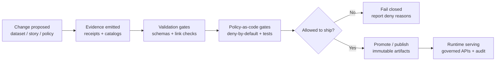
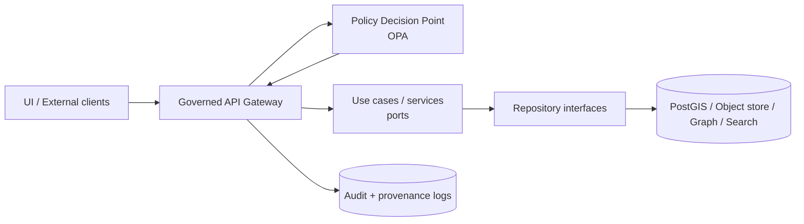

# Governance

**Status badges:** ✅ Governed • ✅ Evidence-first • ✅ FAIR+CARE aligned • ✅ Fail-closed • ✅ Trust membrane

KFM governance is not a “policy PDF on the side.” It is *system behavior*: machine-checkable rules, human review gates, and audit/provenance trails that protect communities, users, and the platform.

> [!IMPORTANT]
> **Fail-closed** is the default. If required evidence, licenses, metadata, consent, or policy signals are missing, KFM *withholds* publication or access until the gap is resolved.

---

## Quick links

- **Root governance charter:** [`ROOT_GOVERNANCE.md`](ROOT_GOVERNANCE.md)
- **Ethics policy:** [`ETHICS.md`](ETHICS.md)
- **Sovereignty and consent:** [`SOVEREIGNTY.md`](SOVEREIGNTY.md)
- **Review gates and release blockers:** [`REVIEW_GATES.md`](REVIEW_GATES.md)

### Closely related standards and templates

- Standards:
  - [`../standards/KFM_STAC_PROFILE.md`](../standards/KFM_STAC_PROFILE.md)
  - [`../standards/KFM_DCAT_PROFILE.md`](../standards/KFM_DCAT_PROFILE.md)
  - [`../standards/KFM_PROV_PROFILE.md`](../standards/KFM_PROV_PROFILE.md)
- Templates:
  - [`../templates/TEMPLATE__KFM_UNIVERSAL_DOC.md`](../templates/TEMPLATE__KFM_UNIVERSAL_DOC.md)
  - [`../templates/TEMPLATE__STORY_NODE_V3.md`](../templates/TEMPLATE__STORY_NODE_V3.md)
  - [`../templates/TEMPLATE__API_CONTRACT_EXTENSION.md`](../templates/TEMPLATE__API_CONTRACT_EXTENSION.md)

> [!NOTE]
> If any linked file is missing, treat it as a **governance gap** and add it (or update this README) before enabling production behavior.

---

## Folder map

This README provides orientation. The canonical normative rules should live in the sibling documents.

```text
docs/governance/
├── README.md              # 👈 you are here (map + operating guide)
├── ROOT_GOVERNANCE.md     # constitutional rules + governance model
├── ETHICS.md              # ethical principles + operational constraints
├── SOVEREIGNTY.md         # CARE, authority-to-control, consent facets, redaction rules
└── REVIEW_GATES.md        # merge/publish/promotion gates + checklists
```

### Where governance is enforced in the repo

Governance is distributed intentionally across “hard” enforcement points:

```text
repo-root/
├── policy/opa/                 # policy-as-code (deny-by-default) + tests
├── schemas/                    # JSON Schemas for receipts/manifests/catalog/profile extensions
├── .github/workflows/          # merge-blocking CI gates (validation + policy checks)
├── data/                       # governed zones + catalogs (raw/work/processed + STAC/DCAT/PROV)
└── docs/                       # human-readable rules, runbooks, review gates, templates
```

---

## Governance invariants

These are “must not regress” properties.

| Invariant | What it means in practice | Where enforced |
|---|---|---|
| Evidence-first | Every user-visible claim must resolve to a source, catalog entry, or run receipt. If not, label **not confirmed**. | Story Node template rules; Focus Mode guardrails; CI/content checks |
| Fail-closed | Publishing/promotion/access is denied unless required metadata, provenance, licenses, and policy checks pass. | CI gates; promotion gates; runtime policy (OPA/PDP) |
| Trust membrane | UI/external clients never access databases/object stores directly; all access is via governed APIs with policy checks. | Architecture rules; API gateway; infrastructure tests |
| Provenance-by-default | Transformations emit lineage (PROV), and assets/datasets are cataloged (STAC/DCAT). | Pipeline outputs; catalog validators; CI gates |
| Sovereignty and sensitivity | Authority-to-control + consent constraints are first-class policy inputs; sensitive content can be redacted/generalized/permissioned. | Policy packs; metadata enums; UI obligations |
| Least privilege | Public users see only cleared, non-sensitive content by default; restricted views require authorization. | Runtime authz; policy; UI rendering rules |
| Auditability | Governance decisions are explainable (“why denied?”) and logged. | Receipts + policy reports; audit logs; governance review |

---

## The governance loop

KFM governance assumes a repeatable loop that turns changes into *evidence + policy decisions* before they become public.



---

## Trust membrane

**Rule:** Frontend and external clients never access storage directly. All access routes through the governed API boundary, with policy evaluation and audit/provenance logging.



> [!IMPORTANT]
> **Do not bypass repositories** from core logic. The “trust membrane” is both *security* and *governance*.

---

## Review triggers

A governance review is required when any change could impact public narratives, safety, compliance, or system behavior.

### Always trigger governance review

- New dataset ingestion or a new data source
- Changes to sensitivity/sovereignty labels, redaction rules, or consent requirements
- New public Story Node or edits to a published Story Node
- Policy changes (OPA/Rego), promotion gates, or schema contract changes
- Any change that affects “what Focus Mode can say/show”

---

## Review gates

The details live in `REVIEW_GATES.md`. This README lists the minimum guardrails.

### Minimum governance review checklist

- [ ] **Policy review:** CARE/consent fields and any sovereignty flags reviewed by governance owners
- [ ] **Trust membrane:** no direct DB/object-store access from UI; only governed API access
- [ ] **Security:** verification (e.g., signatures/attestations) occurs server-side; UI only sees sanitized, verified outputs
- [ ] **Licensing:** license fields present and correct (e.g., DCAT/STAC license); SPDX signals where applicable
- [ ] **Immutability:** promoted artifacts are content-addressed; updates create new versions (new digests/attestations)
- [ ] **Audit:** discovery/promotion actions are logged and retained

---

## Sovereignty and sensitivity

Sovereignty and sensitivity are enforced as **machine-checkable invariants** and should be encoded consistently across:

- STAC item/asset fields
- DCAT accessRights (or equivalent)
- PROV activities/outcomes
- Policy input bundles to OPA

### CARE fail-closed promotion gate for Tribal boundary intersections

When an artifact intersects authoritative Tribal boundaries, public exposure must be blocked unless:
1) an **authority-to-control** label is present, and  
2) a **tribal_consent** provenance facet exists (with valid scope and expiry)

> [!IMPORTANT]
> This is a **fail-closed** rule: default allow is false.

#### Suggested policy input shape

```json
{
  "artifact": {
    "labels": ["authority_to_control:..."],
    "spatial": { "intersects_authoritative_tribal_boundary": true },
    "intended_exposure": "public"
  },
  "provenance": {
    "facets": [
      {
        "type": "tribal_consent",
        "scope": "…",
        "expires_at": "…"
      }
    ]
  },
  "run": { "lane": "prod" }
}
```

### Sensitivity classification

A starter classification (final taxonomy must match `SOVEREIGNTY.md` and policy enums):

| Class | Typical handling | Default exposure |
|---|---|---|
| Public | Fully visible; citations required | Public |
| Internal | Visible to authenticated users; may hide raw links | Internal only |
| Confidential | Restricted audience; redaction obligations; explicit approvals | Restricted |
| Restricted | Highly sensitive; generalized/blurred or not served; explicit consent + approvals | Deny-by-default |

> [!CAUTION]
> When unsure, **classify higher** (more restrictive), and escalate for governance review.

---

## Narrative governance

### Story Nodes

Story Nodes are governed narrative artifacts:
- Every factual claim must reference a source ID / catalog reference.
- Updates must preserve version history and provenance.

### Focus Mode

Focus Mode is constrained:
- It may summarize evidence, highlight patterns, and propose alternative views.
- It must not invent facts, infer Indigenous knowledge, or override governance flags.

---

## Licensing and intellectual property

Licensing is a *required field*, not a nice-to-have:
- Datasets must have license/attribution metadata before publication.
- KFM favors open-licensed content.
- Copyrighted material should be presented as metadata and short excerpts with citation when appropriate.

---

## Policy-as-code rules of the road

> [!NOTE]
> Keep policies small and composable, add unit tests, and version policy packs so audits can reconstruct the rule set used.

<details>
<summary><strong>Policy change checklist</strong></summary>

- [ ] Policy change is proposed via PR with clear rationale
- [ ] Policy includes unit tests (golden allow/deny fixtures)
- [ ] Policy pack version is bumped (if contract semantics change)
- [ ] Any schema/manifest changes are versioned (no silent breaking changes)
- [ ] Human review recorded (governance owners)
- [ ] CI gates updated to run the new tests
- [ ] Documentation updated (this folder + relevant standards)

</details>

---

## Definition of Done

This README is “done” when:

- [ ] Links resolve to the governance charter, ethics, sovereignty, and review gates
- [ ] Invariants are stated clearly and match enforcement behavior
- [ ] Governance checklist matches CI/policy enforcement reality
- [ ] Sensitive/sovereign handling is documented and points to the authoritative policy doc(s)
- [ ] Changes to this README follow normal PR review and are tracked in the repo’s changelog

---

## References

Primary design sources (for human context; enforcement lives in code and governed contracts):
- KFM Vision Brief (generated 2026-02-16)
- KFM Integration Idea Pack (v0.1 draft, 2026-02-15)
- KFM Data Source Integration Blueprint (v1.0, 2026-02-12)
- Master Guide v13 (draft) and repo standards/templates