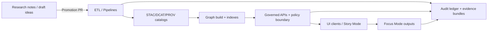

# ⚖️ Governance — Kansas Frontier Matrix (KFM)


> [!IMPORTANT]
> Governance documents are **production** artifacts.
> Changing governance can change: data releases, redaction behavior, API access, Story/Focus output rules, and audit expectations.

This folder (`docs/governance/`) is the entrypoint for KFM’s **socio-technical governance**: principles, policies, and enforcement surfaces that keep the platform trustworthy, ethical, and auditable.

---

## Quick navigation (read-first)

| If you are… | Start here | Why |
|---|---|---|
| New to KFM governance | `docs/governance/README.md` (this file) | Big picture + “how governance shows up in the build” |
| Defining/adjusting core governance policy | `docs/governance/ROOT_GOVERNANCE.md` | Non-negotiables + roles + escalation |
| Unsure what reviews/gates you need | `docs/governance/REVIEW_GATES.md` | PR triggers, required checks, sign-offs |
| Working on Story Nodes / Focus Mode narratives | `docs/governance/ETHICS.md` | Harm minimization + narrative constraints + cite/abstain rules |
| Handling Indigenous/community data sovereignty | `docs/governance/SOVEREIGNTY.md` | CARE/IDS + authority-to-control + consent expectations |

> [!NOTE]
> KFM assumes **draft research is non-canonical**. Anything that becomes user-facing or contract-bearing must pass through governed promotion paths.

---

## Governance principles

### FAIR + CARE + IDS (what “good” looks like)

- **FAIR** (Findable, Accessible, Interoperable, Reusable): applied to datasets and their metadata.
- **CARE** (Collective benefit, Authority to control, Responsibility, Ethics): applied to people and communities.
- **Indigenous Data Sovereignty (IDS)**: Indigenous peoples have a say in how data about them or their lands is used and shared.

**KFM interpretation:** openness is a goal, but **not at the expense of safety, rights, or community trust**.

---

## Non-negotiable invariants (must not regress)

1. **Evidence-first publishing (cite-or-abstain).**
   - Anything shipped to Story/Focus must trace back to dataset/record/asset identifiers.
2. **Trust membrane (no direct storage access from clients).**
   - UI/external clients consume governed API contracts and must not depend on storage internals.
3. **Fail-closed enforcement.**
   - If policy cannot confidently allow something, it is denied by default.
4. **Canonical pipeline ordering.**
   - ETL → STAC/DCAT/PROV catalogs → graph build → governed APIs → UI clients → Story Nodes → Focus Mode.
5. **Sensitivity-first handling.**
   - When content could be sensitive, default to redaction/aggregation rules and require review.

---

## Governance-by-construction loop (how it’s enforced)



**Intent:** governance is not a “review later” activity — it is baked into the **normal path** of shipping data and narratives.

---

## Sensitivity classification

Every dataset, derived artifact, and public surface is assigned a **sensitivity class**.

| Class | Default expectation | Typical “safe default” |
|---|---|---|
| `public` | Shareable broadly | Full fidelity allowed (still licensed + attributed) |
| `restricted` | Shareable only to approved roles | AuthZ required; field-level access control |
| `sensitive-location` | Disclosure increases risk | Generalize/suppress geometry by default |
| `aggregate-only` | Individual-level detail is unsafe | Only publish aggregates above thresholds |

### Redaction is a first-class transformation

Redaction/generalization is treated as a **real transformation**, not an afterthought:

- Raw datasets remain immutable.
- Redacted outputs are published as separate derived artifacts.
- The redaction/generalization step is captured in provenance (why, what changed, policy basis).

> [!WARNING]
> Do not “hand-wave” redaction. If it changes meaning, it must be explicit, recorded, and reviewable.

---

## Enforcement surfaces

### CI gates (minimum expectation)

Governance is enforced by automated checks and required human review.

Typical CI expectations include:

- **Schema validity** (STAC/DCAT/PROV, Story Node schema, API contracts).
- **License and attribution completeness** (no missing license/rights fields).
- **Provenance completeness** (lineage present for promoted artifacts).
- **Policy-as-code checks** (deny-by-default, regression suite).

### CI policy regression suite (sensitivity & leakage prevention)

The policy suite should include:

- golden queries (ensure previously-leaked sensitive results never reappear),
- negative tests (ensure high-precision outputs are denied when not allowed),
- field-level tests (e.g., names, small counts, precise archaeology coordinates),
- audit integrity tests (restricted results require audit reference + evidence bundle hash).

### Runtime enforcement (governed API boundary)

At runtime, KFM must be able to answer and log:

- who is requesting access,
- what class of data they’re requesting,
- what redaction/generalization (if any) was applied,
- why it was allowed/denied (policy decision),
- what evidence bundle / audit record corresponds to the action.

---

## Roles & oversight (human governance)

| Role | Owns | Typical decisions |
|---|---|---|
| FAIR+CARE Council | Data standards + ethical alignment | whether a dataset is includable; sensitivity class; CARE/IDS handling |
| Technical Governance Board | Architecture + security policies | authz model changes; major infra changes; enforcement patterns |
| Data Stewards | Dataset correctness and lifecycle | update frequency; deprecation/archival; quality notes |
| Maintainers | Merge + release authority | CI gates; release packaging; operational readiness |

> [!NOTE]
> Governance is both automated controls *and* accountable human oversight.

---

## Common workflows (fast checklists)

### Add a new dataset (promotion path)

- [ ] Assign **sensitivity class** (`public` / `restricted` / `sensitive-location` / `aggregate-only`)
- [ ] Capture **license + attribution** in metadata
- [ ] Produce **STAC/DCAT/PROV** records for ingest + derived artifacts
- [ ] Add/extend **validation** and (when needed) **golden regression tests**
- [ ] Open a **Promotion PR** (reviewable, deterministic, auditable)

### Ship/modify a Story Node / Focus Mode narrative

- [ ] Every factual claim traces to a dataset/record/asset identifier (or abstain)
- [ ] Citations present and consistent with evidence bundles
- [ ] Sensitive details are generalized/suppressed; redaction notices are shown when applicable
- [ ] Passes Story Node schema validation + policy gate

### Change a policy

- [ ] Policy defaults to **deny** (fail-closed posture)
- [ ] Add/update regression tests
- [ ] Document rationale + impact surface
- [ ] Obtain required board approvals per `REVIEW_GATES.md`

---

## Audit & telemetry

Governance relies on audit trails for trust and accountability:

- access to restricted layers,
- transformations/redactions applied,
- Focus Mode outputs that withheld/generalized information.

Example event names (non-exhaustive):

- `focus_mode_redaction_notice_shown`
- `policy_denied`
- `restricted_layer_accessed`

---

## Directory layout

```text
docs/governance/
├── README.md                  # Governance entrypoint (this file)
├── ROOT_GOVERNANCE.md         # Non-negotiables, roles, escalation, governance model
├── REVIEW_GATES.md            # PR triggers, required checks, sign-offs
├── ETHICS.md                  # Ethics policy, narrative constraints, harm minimization
├── SOVEREIGNTY.md             # CARE/IDS rules, authority-to-control, consent workflow
└── (optional) decision_log/   # Governance ADRs / decisions (if used)
```

<details>
<summary><strong>Related repository paths (governance touchpoints)</strong></summary>

```text
docs/standards/                # STAC/DCAT/PROV profiles, markdown protocols, repo standards
docs/templates/                # Universal Doc / Story Node / API contract templates
schemas/                       # Machine-readable contracts (catalogs, story nodes, telemetry, etc.)
tools/validation/              # Catalog QA, geometry/temporal validators, lint/link-check tooling
policy/                        # Policy-as-code (OPA/Rego) + tests (if implemented here)
src/                           # Pipelines, graph build, server logic (must respect clean boundaries)
web/                           # UI clients (must consume governed APIs only)
data/                          # raw/work/processed zones + catalogs (promotion & provenance rules)
.github/                       # CI workflows (enforcement gates)
releases/                      # Signed release artifacts + SBOMs (if used)
```

</details>

---

## Governance review triggers (when to escalate)

A governance review is required when a PR:

- adds a new data domain/provider,
- changes sensitivity classification or redaction behavior,
- introduces new public narrative surfaces (Story/Focus),
- changes API authz/access patterns,
- modifies provenance/audit expectations,
- changes supply-chain integrity controls.

---

## References (internal design sources)

- KFM Data Source Integration Blueprint (v1.0, 2026-02-12)
- KFM Master Guide v13 (draft) — repo structure + governance doc map
- KFM Integration-Ready Concepts Pack (prepared 2026-02-15)