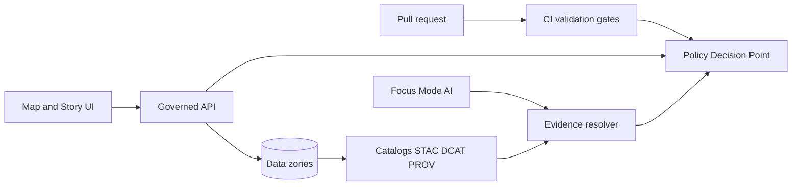

<!-- [KFM_META_BLOCK_V2]
doc_id: kfm://doc/<uuid>
title: Governance
type: standard
version: v1
status: draft
owners: TBD
created: 2026-02-24
updated: 2026-02-24
policy_label: public
related:
  - docs/governance/ROOT_GOVERNANCE.md
  - docs/governance/ETHICS.md
  - docs/governance/SOVEREIGNTY.md
  - docs/governance/REVIEW_GATES.md
tags: [kfm, governance]
notes:
  - Directory-level entrypoint for KFM governance policies, policy-as-code posture, and review gates.
[/KFM_META_BLOCK_V2] -->

# Governance
Policies, gates, and policy-as-code contracts that keep KFM evidence-bound, safe-by-default, and auditable.


<!-- TODO: replace with real repo badges (CI, policy tests, release attestations) -->

**Owners:** TBD (define in `ROOT_GOVERNANCE.md`)  
**Last reviewed:** 2026-02-24 <!-- TODO: update on each governance sign-off -->

---

## Quick navigation
- [Scope](#scope)
- [What lives here](#what-lives-here)
- [Core principles](#core-principles)
- [Governance workflow](#governance-workflow)
- [Policy-as-code boundary](#policy-as-code-boundary)
- [Promotion gates](#promotion-gates)
- [Sensitivity and sovereignty](#sensitivity-and-sovereignty)
- [Licensing and rights](#licensing-and-rights)
- [Audit and telemetry](#audit-and-telemetry)
- [Templates](#templates)
- [Appendix](#appendix)

---

## Scope
This directory defines **KFM governance**: ethics + sovereignty posture, review gates for contributions, and the policy semantics that must hold consistently in **CI** and **runtime**.

If you are:
- adding a dataset,
- changing a promotion/pipeline,
- changing public API/UI behavior,
- introducing AI narrative features,
- changing licensing/rights posture,
- or touching sensitivity / sovereignty constraints,

…start here.

[Back to top](#governance)

---

## What lives here

### Directory layout (required)
```text
docs/governance/
  README.md              # You are here (entrypoint + directory contract)
  ROOT_GOVERNANCE.md     # Governance charter: roles, decision process, definitions
  ETHICS.md              # Ethical commitments + “what we will not do”
  SOVEREIGNTY.md         # CARE-aligned sovereignty rules for sensitive/community data
  REVIEW_GATES.md        # Human review triggers + promotion checklist + sign-off rules

  policy/                # OPTIONAL: policy-as-code docs + fixtures (repo location may vary)
                          # If policy-as-code lives elsewhere, link it from ROOT_GOVERNANCE.md.
```

### Acceptable inputs
This directory accepts:
- Policy documents, rubrics, and checklists.
- Governance decision records and review sign-offs (human layer).
- Policy-as-code documentation (PDP/PEP semantics, fixtures, obligations).
- Templates used by governance processes (review records, manifests, evaluation cases).

### Exclusions
Do **not** put these here:
- Raw or processed datasets (belongs in `data/...`).
- Pipeline code (belongs in `pipelines/` and/or `src/...`).
- Secrets, API keys, tokens, or private coordinates.
- Unreviewed public narratives intended for publication (belongs in story draft areas).

[Back to top](#governance)

---

## Core principles
These are **platform invariants**: treat them as CI-enforceable rules, not suggestions.

### Fail closed
If policy, metadata, license, schema, or QA checks fail, KFM must block the action (merge, promotion, export, or response).

### FAIR + CARE by design
KFM encodes reuse and interoperability requirements (metadata, standard formats, provenance), while respecting CARE sovereignty constraints and access controls.

### License-first
License + rights are required policy inputs. Promotion and publication are blocked if they’re missing or unclear.

### Determinism + provenance by default
Pipelines should be idempotent and reproducible. Every run should emit provenance; where applicable, add release-time attestations.

### Catalogs are contract surfaces
Catalogs are not “nice metadata”—they are the canonical interface between pipeline outputs and runtime (for evidence resolution and safe serving).

[Back to top](#governance)

---

## Governance workflow

### 1) Automated gates (CI)
Minimum expectation (extend in `REVIEW_GATES.md`):
- Schema validation (data + catalog schemas)
- Metadata completeness
- License/rights checks
- QA thresholds (geometry/raster integrity, drift thresholds)
- Policy tests (allow/deny + obligations)

### 2) Manual governance review (when required)
Some changes require human review in addition to CI (see `REVIEW_GATES.md`), including:
- Introducing sensitive / sovereignty-governed datasets or layers.
- Adding AI-driven narrative features or auto-summaries that could be perceived as factual.
- Adding a new external data source (license + provenance scrutiny).
- Adding new public-facing outputs that could expose sensitive information (API endpoints, downloads, exports).
- Reclassifying sensitivity / policy labels (public ↔ restricted, etc.).

### 3) Decision recording
Governance decisions should be:
- small, reversible increments,
- linked to evidence (what changed, why, and what check enforces it),
- encoded in policy fixtures/tests where possible.

[Back to top](#governance)

---

## Policy-as-code boundary
KFM governance requires **the same policy semantics in CI and runtime**, or CI guarantees are meaningless.

Recommended architecture:
- **PDP**: a Policy Decision Point (e.g., OPA sidecar/in-process).
- **PEPs** (Policy Enforcement Points):
  - CI: schema validation + policy tests block merges.
  - Runtime API: policy checks before serving data.
  - Evidence resolver: policy checks before resolving evidence and rendering bundles.
  - UI: displays badges/notices, but **never decides policy**.



[Back to top](#governance)

---

## Promotion gates
“Promotion” is the act of moving artifacts into a published / served state. It must be evidence-producing and auditable.

### Minimum promotion checklist (starter)
- [ ] Raw inputs are immutable / content-addressed (or verifiably snapshotted).
- [ ] Processed artifacts are versioned and reproducible.
- [ ] Catalogs validate and cross-link (DCAT + STAC + PROV).
- [ ] License + rights holder recorded for each distribution.
- [ ] QA thresholds pass (schema + geometry/raster checks + drift thresholds).
- [ ] Policy label applied and enforced (CI + runtime).
- [ ] “What changed?” diff is produced for version updates.
- [ ] Focus Mode evaluation passes for public roles (citations resolve; no restricted leaks; abstentions provide audit references).

[Back to top](#governance)

---

## Sensitivity and sovereignty
Default posture: **fail closed**.

Recommended defaults:
- Default deny for sensitive-location and restricted datasets.
- If public representation is allowed, produce a separate **public_generalized** dataset version.
- Never leak restricted metadata in 403/404 responses.
- Do not embed precise coordinates in Story Nodes or Focus Mode outputs unless explicitly allowed.
- Treat redaction/generalization as a first-class transform recorded in provenance.

> TIP: Redaction must be applied end-to-end: processed data, catalog metadata, API serving, and UI behavior.

[Back to top](#governance)

---

## Licensing and rights
Key principle: **online availability does not equal permission to reuse**.

Operational rules (starter):
- Promotion gate requires license + rights holder for every distribution.
- “Metadata-only reference” is allowed when mirroring is not permitted.
- Export functions must include attribution and license text automatically.
- Story publishing must block if rights are unclear for included media.

[Back to top](#governance)

---

## Audit and telemetry
Governance requires auditability:
- Track access to sensitive data and transformations.
- Emit telemetry when redaction/generalization is applied (e.g., when Focus Mode withholds or generalizes).
- Ensure audit records can answer “who saw what and why” **without** leaking restricted content.

[Back to top](#governance)

---

## Templates

<details>
<summary><strong>Governance Review Record (starter template)</strong></summary>

```markdown
# Governance Review Record

- PR / Commit:
- Date:
- Reviewers:
- Change type: (new dataset | sensitivity change | new public output | new AI feature | policy change)
- Affected datasets / layers:
- Policy labels (before → after):
- Licensing status: (confirmed | unclear | blocked)
- Sensitivity/sovereignty notes:
- Automated gates status: (pass | fail | waived-with-justification)
- Decision: (approve | approve with conditions | block)
- Conditions / required follow-ups:
- Audit implications:
- Links to evidence (diff report, validation report, provenance bundle):
```

</details>

<details>
<summary><strong>Focus Mode “golden query” case (starter)</strong></summary>

```json
{
  "case_id": "focus_public_001",
  "role": "public",
  "query": "Describe what is visible in the current view.",
  "expectations": {
    "must_cite": true,
    "must_not_include": ["restricted_fields_or_locations"]
  }
}
```

</details>

[Back to top](#governance)

---

## Appendix

### Related docs (canonical in this directory)
- `docs/governance/ROOT_GOVERNANCE.md` — charter, roles, decision process
- `docs/governance/ETHICS.md` — ethics commitments
- `docs/governance/SOVEREIGNTY.md` — CARE-aligned sovereignty rules
- `docs/governance/REVIEW_GATES.md` — human review triggers + sign-offs

### TODOs (repo integration)
- [ ] Confirm final policy label taxonomy and role model (document in `ROOT_GOVERNANCE.md`).
- [ ] Add policy decision fixtures (allow/deny + obligations) and wire into CI.
- [ ] Add or link the promotion manifest + diff report formats and schemas.
- [ ] Document audit retention policy and access controls.
