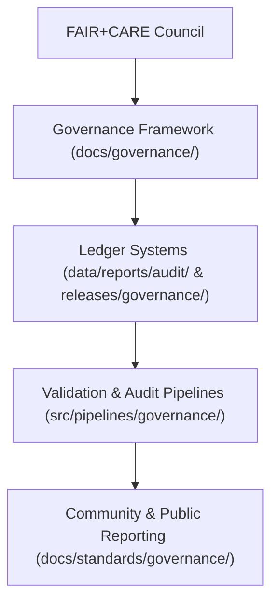

<div align="center">

# ⚖️ Kansas Frontier Matrix — **Governance Framework & Ethical Oversight**
`docs/governance/README.md`

**Purpose:**  
Defines the **governance, provenance, and ethical accountability structure** that governs all Kansas Frontier Matrix (KFM) operations.  
This framework ensures transparency, trust, and compliance with **FAIR+CARE, ISO, STAC/DCAT, and MCP-DL v6.3** standards — reinforcing ethical open science and equitable stewardship of data.

[](../../docs/standards/faircare-validation.md)
[]()
[]()
[](../../LICENSE)

</div>

---

## 📚 Overview

The **KFM Governance Framework** unites ethics, technical compliance, and transparency into a reproducible open-data ecosystem.  
Governance ensures every dataset, process, and AI inference adheres to **FAIR+CARE principles** while maintaining clear lineage through the **Provenance Ledger**.

### Key Objectives
- Uphold **ethical data practices** rooted in FAIR+CARE and ISO governance.  
- Maintain **ledger-backed provenance tracking** across all data lifecycles.  
- Provide **audit-ready documentation** for validation and accountability.  
- Enable **community-driven oversight** via FAIR+CARE Council mechanisms.  

---

## 🗂️ Directory Structure

```plaintext
docs/governance/
├── README.md                              # This file — governance framework overview
│
├── council-charter.md                     # FAIR+CARE Council organizational policies
├── oversight-procedures.md                # Audit, review, and decision-making procedures
├── ethical-framework.md                   # Ethical alignment and policy reference
├── governance-matrix.md                   # FAIR+CARE to ISO and STAC/DCAT alignment matrix
└── ledger-system.md                       # Description of blockchain-backed provenance and registry
```

---

## ⚙️ Governance Architecture



### Governance Layers
1. **FAIR+CARE Council:** Ethical oversight, data approvals, and accountability.  
2. **Governance Framework:** Defines compliance policies and operational charters.  
3. **Provenance Ledgers:** Immutable record of audits, ethics, and lineage.  
4. **Automation Pipelines:** Synchronize governance metadata with CI/CD systems.  
5. **Public Reporting:** Transparent publication of validation and certification results.  

---

## 🧩 Governance Framework Components

| Component | Description | Alignment |
|------------|--------------|------------|
| **FAIR+CARE Council Charter** | Defines decision-making authority and review cycles. | MCP-DL v6.3 |
| **Governance Ledger System** | Blockchain-style JSON ledger recording provenance and validation. | ISO 19115 / STAC |
| **Audit & Oversight Procedures** | Establishes ethics and performance review workflows. | ISO 14064 |
| **Ethical Framework** | Guides inclusive and sustainable decision-making. | FAIR+CARE / CARE Principles |
| **Governance Matrix** | Links FAIR+CARE to ISO, STAC, and DCAT standards. | DCAT 3.0 |

---

## 🧠 FAIR+CARE Governance Matrix

| Principle | Implementation |
|------------|----------------|
| **Findable** | Governance metadata indexed in open ledgers and FAIR repositories. |
| **Accessible** | Public access to non-sensitive audit and certification records. |
| **Interoperable** | Uses JSON-LD, DCAT 3.0, and ISO 19115 alignment for machine-readability. |
| **Reusable** | Governance data stored under MIT license and version control. |
| **Collective Benefit** | Supports community-driven ethical data usage and collaboration. |
| **Authority to Control** | FAIR+CARE Council manages governance approvals and audits. |
| **Responsibility** | KFM contributors document every change in provenance logs. |
| **Ethics** | All decisions prioritize environmental and cultural respect. |

Audit results logged to:  
`data/reports/audit/data_provenance_ledger.json`

---

## 🧮 Example Governance Record

```json
{
  "ledger_id": "governance-record-2025-11-03",
  "validated_dataset": "data/work/processed/hazards/hazards_composite_v9.6.0.geojson",
  "fairstatus": "certified",
  "carestatus": "reviewed",
  "audited_by": "@kfm-governance",
  "approved_by": "@faircare-council",
  "checksum_verified": true,
  "created": "2025-11-03T20:45:00Z",
  "governance_version": "v9.6.0"
}
```

This record is signed and appended to:
`releases/v9.6.0/governance/ledger_snapshot_2025Q4.json`

---

## ⚖️ Council Governance Model

| Role | Responsibility | Review Cycle |
|-------|----------------|---------------|
| **FAIR+CARE Council** | Oversee data ethics, inclusivity, and provenance integrity. | Continuous |
| **KFM Governance Team** | Maintain ledger systems, charters, and public reports. | Quarterly |
| **AI Ethics Review Board** | Evaluate transparency and fairness of ML outputs. | Biannual |
| **Sustainability Review Committee** | Audit environmental impact of operations. | Annual |

---

## ♻️ Sustainability & Ethics Standards

| Standard | Focus | Verified By |
|-----------|--------|--------------|
| **ISO 14064** | Carbon footprint and energy efficiency of KFM workflows. | @kfm-sustainability |
| **FAIR+CARE** | Equity and transparency of governance decisions. | @faircare-council |
| **ISO 19115** | Metadata provenance and traceability. | @kfm-data |
| **ISO 9241-210** | Human-centered governance documentation. | @kfm-accessibility |
| **MCP-DL v6.3** | Documentation-first governance lifecycle. | @kfm-architecture |

---

## 🧾 Governance Provenance Chain

| Ledger File | Description | Retention |
|--------------|--------------|------------|
| `data/reports/audit/data_provenance_ledger.json` | Core record of FAIR+CARE certification events. | Permanent |
| `releases/governance/ledger_snapshot_*.json` | Quarterly archived governance snapshots. | 10 years |
| `releases/v9.6.0/manifest.zip` | Versioned checksum archive of governance files. | Permanent |
| `docs/governance/governance-matrix.md` | Alignment index of FAIR+CARE and ISO compliance. | Continuous |

---

## 🧩 Governance Telemetry Metrics

| Metric | Description | Target |
|---------|--------------|---------|
| **Governance Validation Uptime** | Percentage of successful CI/CD governance workflows. | 100% |
| **Ledger Synchronization Lag** | Delay between validation and ledger registration. | < 1 min |
| **Ethical Decision Review Compliance** | Governance issues reviewed per FAIR+CARE cycle. | 100% |
| **Public Reporting Transparency Score** | Audit publication rate for governance summaries. | ≥ 95% |

Metrics recorded in:  
`releases/v9.6.0/focus-telemetry.json`

---

## 🧾 Internal Use Citation

```text
Kansas Frontier Matrix (2025). Governance Framework & Ethical Oversight (v9.6.0).
Outlines the FAIR+CARE, ISO, and MCP-DL-aligned governance structure that manages ethics, provenance, and accountability across the Kansas Frontier Matrix.
Ensures transparency, sustainability, and inclusive decision-making under open-source governance.
```

---

## 🧾 Version Notes

| Version | Date | Notes |
|----------|------|--------|
| v9.6.0 | 2025-11-03 | Introduced ledger telemetry tracking and expanded FAIR+CARE council documentation. |
| v9.5.0 | 2025-11-02 | Added ISO 14064 alignment for sustainability audits. |
| v9.3.2 | 2025-10-28 | Established FAIR+CARE governance baseline and ledger framework. |

---

<div align="center">

**Kansas Frontier Matrix** · *FAIR+CARE Governance × Ethical Data Stewardship × Transparent Provenance*  
[🔗 Repository](https://github.com/bartytime4life/Kansas-Frontier-Matrix) • [⚖️ Data Governance Standards](../standards/governance/DATA-GOVERNANCE.md) • [🧭 Docs Portal](../README.md)

</div>

