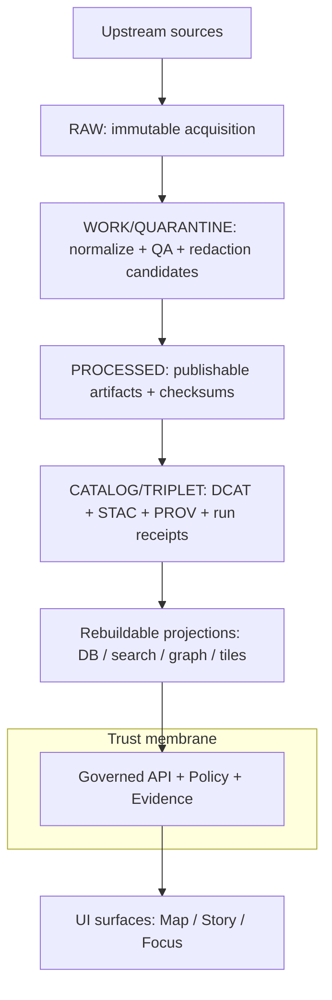
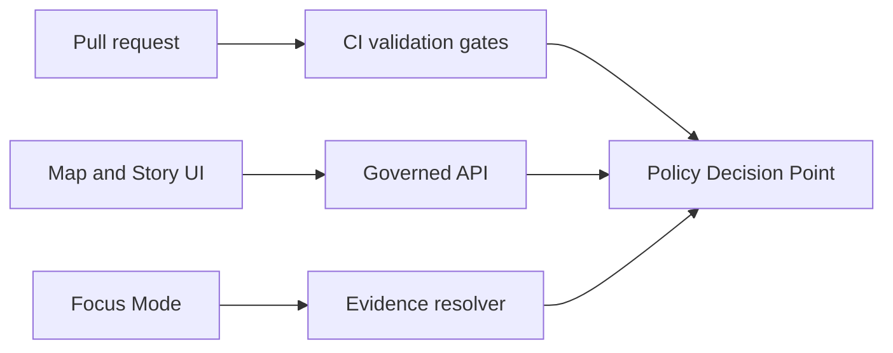

<!-- [KFM_META_BLOCK_V2]
doc_id: kfm://doc/8c818b49-fd8a-4a94-afb0-a5e46c5bb149
title: Governance
type: standard
version: v1
status: draft
owners: TBD
created: 2026-02-24
updated: 2026-03-01
policy_label: public
related:
  - docs/governance/ROOT_GOVERNANCE.md
  - docs/governance/ETHICS.md
  - docs/governance/SOVEREIGNTY.md
  - docs/governance/REVIEW_GATES.md
tags: [kfm, governance]
notes:
  - Directory-level entrypoint for KFM governance policies, policy-as-code posture, and review gates.
  - Aligned to vNext governance invariants: truth path, trust membrane, promotion contract, and cite-or-abstain Focus Mode.
[/KFM_META_BLOCK_V2] -->

# Governance
Policies, gates, and policy-as-code contracts that keep KFM evidence-bound, safe-by-default, and auditable.


<!-- TODO: replace with real repo badges (CI, policy tests, release attestations) -->

**Owners:** TBD (define in `ROOT_GOVERNANCE.md`)  
**Last reviewed:** 2026-02-28 <!-- update on each governance sign-off -->

---

## Quick navigation
- [Scope](#scope)
- [Normative language and claim tags](#normative-language-and-claim-tags)
- [What lives here](#what-lives-here)
  - [Directory layout](#directory-layout)
  - [Cross-repo governance surfaces](#cross-repo-governance-surfaces)
- [Non-negotiable invariants](#non-negotiable-invariants)
- [Governance workflow](#governance-workflow)
- [Policy-as-code boundary](#policy-as-code-boundary)
- [Promotion contract](#promotion-contract)
- [Evidence and citations](#evidence-and-citations)
- [Sensitivity and sovereignty](#sensitivity-and-sovereignty)
- [Licensing and rights](#licensing-and-rights)
- [Focus Mode governance](#focus-mode-governance)
- [Audit and telemetry](#audit-and-telemetry)
- [Templates](#templates)
- [Appendix](#appendix)

---

## Scope
This directory defines **KFM governance**: ethics + sovereignty posture, review gates for contributions, and the policy semantics that must hold consistently in **CI** and **runtime**.

If you are:
- adding a dataset or upstream source,
- changing a promotion/pipeline,
- changing public API/UI behavior,
- introducing AI narrative or auto-summary features,
- changing licensing/rights posture,
- or touching sensitivity / sovereignty constraints,

…start here.

> NOTE: Governance review is operationalized as two queues:
> - **Promotion Queue**: dataset/version promotion to published runtime surfaces.
> - **Story Review Queue**: narrative publishing (Story Nodes) with citation + rights + sensitivity gates.

[Back to top](#governance)

---

## Normative language and claim tags
To avoid accidental overreach, governance docs should be explicit about what is **required** vs **recommended** vs **unknown**.

- **MUST / MUST NOT / SHOULD / MAY** use common RFC-style meaning for enforceable requirements.
- **CONFIRMED / PROPOSED / UNKNOWN** tags are used when a document mixes:
  - *invariants and contracts* (safe to treat as requirements), and
  - *implementation details* (replaceable until verified).

> NOTE: Every **UNKNOWN** item should include (1) a recommended default path, and (2) the minimum verification step to convert it to CONFIRMED.

[Back to top](#governance)

---

## What lives here

### Directory layout
This tree is the **normative governance layout**. If your repo diverges, update this tree (or add `README.md` notes in subfolders) so reviewers can find policy-critical materials quickly.

```text
docs/governance/                                      # Governance hub (human + policy-as-code docs, fixtures, gates)

├─ README.md                                          # Entrypoint + directory contract + navigation
├─ ROOT_GOVERNANCE.md                                 # Charter: roles, decision process, definitions, escalation
├─ ETHICS.md                                          # Ethical commitments + “we will not do”
├─ SOVEREIGNTY.md                                     # CARE-aligned sovereignty rules + restricted knowledge handling
├─ REVIEW_GATES.md                                    # Review triggers + sign-off rules + promotion checklist (human layer)

├─ GLOSSARY.md                                        # Canonical governance terms (policy_label, obligation, EvidenceRef, etc.)
├─ CHANGELOG.md                                       # Governance policy changes (human-readable, time-aware)
├─ safety_checks.md                                   # Sensitive narratives checklist (non-sensational + redaction-first)

├─ workflows/                                         # Review workflow definitions (state machine + queue semantics)
│  ├─ PROMOTION_QUEUE.md                              # How datasets move through review → promote → publish
│  ├─ STORY_REVIEW_QUEUE.md                           # How Story Nodes move draft → review → publish
│  ├─ REVIEW_STATE_MODEL.md                           # Canonical review states + transitions (shared vocabulary)
│  └─ WORKFLOW_DIAGRAMS.md                            # Mermaid diagrams used by both queues

├─ roles/                                             # Governance ownership + roles + responsibilities (human)
│  ├─ OWNERSHIP.md                                    # Who owns what (datasets, services, policies, catalogs)
│  ├─ ROLE_MODEL.md                                   # Role taxonomy (public, staff, researcher, admin, etc.)
│  ├─ RBAC_MATRIX.md                                  # Role → permissions matrix (high-level; runtime enforced elsewhere)
│  └─ REVIEWERS.md                                    # Required reviewers / quorum rules (per change type)

├─ labels/                                            # Policy label taxonomy + how to apply it (human)
│  ├─ POLICY_LABEL_TAXONOMY.md                         # Definitions + required fields + defaults (fail-closed)
│  ├─ SENSITIVITY_GUIDE.md                             # How to classify layers, fields, locations, media
│  ├─ REDACTION_GENERALIZATION.md                      # Rules for redaction/generalization as first-class transforms
│  └─ examples/                                       # Worked examples (help reviewers + contributors be consistent)
│     ├─ public_generalized_example.md
│     ├─ restricted_location_example.md
│     └─ mixed_sensitivity_story_example.md

├─ licensing/                                         # Licensing + rights governance (human + checklists + rubrics)
│  ├─ LICENSE_CLASSIFICATION_RUBRIC.md                 # Allowed/blocked/metadata-only guidance; “online ≠ reusable”
│  ├─ RIGHTS_FIELDS_REQUIREMENTS.md                    # Required fields in catalogs/specs for rights + attribution
│  ├─ ATTRIBUTION_TEMPLATES.md                         # Copy/paste attribution snippets for exports + stories
│  └─ examples/
│     ├─ metadata_only_reference_example.md
│     └─ third_party_media_rights_example.md

├─ audit/                                             # Audit ledger rules (non-leaky, append-only, time-aware)
│  ├─ AUDIT_LEDGER_POLICY.md                           # What must be logged for runs/access; what must never be logged
│  ├─ RETENTION_POLICY.md                              # Retention + deletion posture (who can purge, when, how)
│  ├─ ACCESS_CONTROL.md                                # Who can read audit records; redaction rules for audit views
│  ├─ EVENT_SCHEMA.md                                  # Audit event schema (high-level; contract surfaces live elsewhere)
│  └─ examples/
│     ├─ focus_mode_run_receipt_example.json
│     └─ dataset_promotion_audit_example.json

├─ vocab/                                             # Controlled vocabularies used by governance + catalogs (docs + fixtures)
│  ├─ policy_label.vocab.json                          # e.g., public / restricted / staff / embargoed / …
│  ├─ artifact_zone.vocab.json                         # e.g., raw / work / quarantine / processed / catalog / published
│  ├─ citation_kind.vocab.json                         # e.g., dcat / stac / prov / doc / story / …
│  └─ theme.vocab.json                                 # Dataset themes (domain taxonomy; extend as needed)

├─ gates/                                             # CI + human gates + release/promotion gates (docs + checklists)
│  ├─ PROMOTION_CONTRACT.md                            # Minimum promotion requirements (zones, artifacts, receipts)
│  ├─ CI_GATES.md                                      # What CI must enforce (schemas, licenses, QA, policy tests)
│  ├─ RUNTIME_GATES.md                                 # What runtime must enforce (PDP/PEP checks, redaction, audit)
│  ├─ FOCUS_MODE_EVALUATION.md                         # “Cite-or-abstain” eval cases + regression expectations
│  ├─ DOD_DATASET_INTEGRATION.md                       # Definition of Done for dataset onboarding (ticket-level gate)
│  └─ waivers/                                        # Controlled escape hatches (explicit, logged, time-bounded)
│     ├─ WAIVER_POLICY.md                              # When waivers are allowed (rare) + required approvals
│     └─ WAIVER_RECORD_TEMPLATE.md                     # Waiver record format (who/why/expiry/mitigations)

├─ records/                                           # Durable governance decisions + sign-offs (auditable)
│  ├─ decisions/                                      # Governance Decision Records (GDRs): reversible, evidence-linked
│  │  ├─ README.md                                    # Naming convention + lifecycle (draft→approved→superseded)
│  │  └─ GDR_TEMPLATE.md
│  ├─ reviews/                                        # Completed governance reviews (PR-linked)
│  │  └─ (YYYY)/                                      # Year partitioning
│  │     └─ (PR-or-change-id).md
│  └─ incidents/                                      # Governance incidents/postmortems (leaks, bad labels, broken gates)
│     ├─ INCIDENT_TEMPLATE.md
│     └─ (YYYY)/...

├─ templates/                                         # Copy/paste templates used across governance workflows
│  ├─ GOVERNANCE_REVIEW_RECORD.md                      # Canonical review record template
│  ├─ DATASET_INTAKE_CHECKLIST.md                      # New dataset onboarding (license, provenance, sensitivity)
│  ├─ SOVEREIGNTY_ASSESSMENT.md                        # CARE-specific assessment + community constraints
│  ├─ AI_FEATURE_RISK_REVIEW.md                        # Focus Mode / narrative risk review (factuality + leakage)
│  └─ PUBLICATION_SIGNOFF.md                           # Publishing checklist (rights, citations, restricted leaks)

└─ policy/                                            # Policy-as-code *documentation + fixtures* (code may live elsewhere)
   ├─ README.md                                       # Policy boundary: CI == runtime semantics; where code lives
   ├─ POLICY_MODEL.md                                  # PDP/PEP model + decision inputs/outputs + failure modes
   ├─ OBLIGATIONS.md                                   # Obligation types (redact, generalize, cite, deny, log, warn)
   ├─ INPUT_CONTEXT.md                                 # What context is evaluated (role, purpose, dataset label, fields)

   ├─ schemas/                                        # Schemas for policy I/O + obligations (contract surfaces)
   │  ├─ policy_context.schema.json
   │  ├─ policy_decision.schema.json
   │  └─ obligation.schema.json

   ├─ fixtures/                                       # Test vectors for policy (allow/deny + obligations + redaction)
   │  ├─ allow_deny/
   │  │  ├─ public_role_cases.json
   │  │  ├─ staff_role_cases.json
   │  │  └─ researcher_role_cases.json
   │  ├─ redaction_generalization/
   │  │  ├─ redact_coordinates_cases.json
   │  │  ├─ generalize_geometry_cases.json
   │  │  └─ suppress_metadata_cases.json
   │  └─ focus_mode/
   │     ├─ golden_queries.json                        # Regression set for “must cite / must abstain”
   │     └─ jailbreak_leakage_tests.json               # “must not leak restricted” stress tests

   ├─ testplan/                                       # How fixtures run in CI + how runtime parity is validated
   │  ├─ ci_policy_tests.md
   │  ├─ runtime_policy_parity.md
   │  └─ coverage_expectations.md

   └─ mappings/                                       # Links from docs → code locations (avoid duplication)
      ├─ policy_code_locations.md                      # Where Rego/rules live (repo-relative links)
      └─ enforcement_points.md                         # Where PEPs live (API, evidence resolver, exporters)
```

#### Acceptable inputs
This directory accepts:
- Policy documents, rubrics, and checklists.
- Governance decision records and review sign-offs (human layer).
- Policy-as-code documentation (PDP/PEP semantics, fixtures, obligations).
- Templates used by governance processes (review records, manifests, evaluation cases).

#### Exclusions
Do **not** put these here:
- Raw or processed datasets (belongs in `data/...`).
- Pipeline code (belongs in `pipelines/` and/or `src/...`).
- Secrets, API keys, tokens, or private coordinates.
- Unreviewed public narratives intended for publication (belongs in story draft areas).

[Back to top](#governance)

---

### Cross-repo governance surfaces
This folder is the **human + documentation hub**, but governance also depends on code and contract surfaces elsewhere in the repo.

Use this list as a reviewer “jump table” (and keep it in sync with the real repo):

| Surface | Why it matters | Typical repo locations (verify) |
|---|---|---|
| Policy bundles + tests | Enforce default-deny + obligations; prevent regressions | `policy/**` (rego + tests), `tests/**` |
| Catalog validators + linkcheck | Block invalid DCAT/STAC/PROV or broken evidence links | `tools/validation/**`, `tests/**` |
| Run receipts + provenance templates | Reproduce runs; bind outputs to inputs/configs/images | `prov/templates/**`, `data/**/receipts/**` |
| Controlled vocabularies | Prevent taxonomy drift; keep IDs stable | `contracts/vocab/**`, `docs/governance/vocab/**` |
| Review automation | Promotion/stories as PR workflow with receipts | `.github/workflows/**`, `scripts/**` |
| Evidence resolver contract | EvidenceRef → EvidenceBundle, policy-checked | `contracts/openapi/**`, `apps/**`, `packages/evidence/**` |

> WARNING: Do not claim a path exists unless you can point to it in the repo tree. If this list drifts, update it to match reality.

[Back to top](#governance)

---

## Non-negotiable invariants
These are **platform invariants**: treat them as CI-enforceable rules, not suggestions.

| Invariant | Meaning in practice | Why it matters |
|---|---|---|
| **Truth path lifecycle** | Upstream → **RAW** → **WORK/QUARANTINE** → **PROCESSED** → **CATALOG/TRIPLET** (DCAT+STAC+PROV+run receipts) → projections → governed API → UI | Reproducibility and auditability |
| **Trust membrane** | Clients never access storage/DB directly; all access goes through governed APIs applying policy + evidence + logging | Without it, policy and provenance are unenforceable |
| **Policy parity (CI == runtime)** | The same policy semantics (or at minimum the same fixtures and outcomes) are enforced in CI gates and runtime enforcement points | Without parity, CI “green” can still leak data in production |
| **Evidence-first UX** | Every layer/claim opens into evidence: dataset version, license/rights, policy label, provenance chain, checksums | Trust is a first-class surface |
| **Cite-or-abstain Focus Mode** | Answers cite resolvable evidence bundles or abstain; citation verification is a hard gate; every query emits a run receipt | Mitigates hallucinations and leakage |
| **Canonical vs rebuildable stores** | Object store + catalogs + provenance are canonical; DB/search/graph/tiles are rebuildable projections | Safe re-indexing and migration |
| **Deterministic identity / hashing** | Stable dataset and version IDs based on canonical JSON hashing (e.g., RFC 8785 JCS) | Reliable caching, signing, and version clarity |

### Reference model diagram (truth path + trust membrane)


[Back to top](#governance)

---

## Governance workflow

### 1) Automated gates (CI)
Recommended minimum set (extend/override in `REVIEW_GATES.md`):
- Schema validation (data + catalog schemas)
- Metadata completeness
- License/rights checks (fail closed)
- QA thresholds (geometry/raster integrity, drift thresholds)
- Policy tests (allow/deny + obligations)
- Evidence resolution checks (EvidenceRefs resolve; broken links fail)
- Contract tests (API schemas and response shapes)

### 2) Manual governance review (when required)
Some changes require human review in addition to CI (see `REVIEW_GATES.md`), including:
- Introducing sensitive / sovereignty-governed datasets or layers.
- Adding AI-driven narrative features or auto-summaries that could be perceived as factual.
- Adding a new external data source (license + provenance scrutiny).
- Adding new public-facing outputs that could expose sensitive information (API endpoints, downloads, exports).
- Reclassifying sensitivity / policy labels (public ↔ restricted, etc.).

Manual reviews should be recorded in:
- `records/reviews/YYYY/(PR-or-change-id).md`

### 3) Queue semantics (Promotion + Story)
**Promotion Queue** is about *data*: moving dataset versions into the served surfaces after all promotion gates pass.

**Story Review Queue** is about *claims*: publishing narratives only when citations resolve, rights are clear, and sensitivity constraints are honored.

Both queues MUST be:
- fail-closed by default,
- auditable (review record + decision),
- reversible (small increments; clear rollback story).

### 4) Decision recording
Governance decisions should be:
- small, reversible increments,
- linked to evidence (what changed, why, and what check enforces it),
- encoded in policy fixtures/tests where possible,
- recorded as a review record that is easy to audit later.

[Back to top](#governance)

---

## Policy-as-code boundary
KFM governance requires **the same policy semantics in CI and runtime**, or CI guarantees are meaningless.

Recommended architecture:
- **PDP**: a Policy Decision Point (e.g., OPA running in-process or as a sidecar).
- **PEPs** (Policy Enforcement Points):
  - CI: schema validation + policy tests block merges.
  - Runtime API: policy checks before serving data.
  - Evidence resolver: policy checks before resolving evidence and rendering bundles.
  - UI: displays badges/notices, but **never decides policy**.



[Back to top](#governance)

---

## Promotion contract
“Promotion” is the act of moving a dataset version into a **published / served** state. Promotion MUST be evidence-producing and auditable.

### Promotion Contract v1 gates (minimum credible set)
| Gate | MUST be present | Example CI enforcement |
|---|---|---|
| A — Identity & versioning | Stable `dataset_id`; immutable `dataset_version_id` derived from stable `spec_hash`; content digests | Spec-hash golden tests; digest verification |
| B — Licensing & rights metadata | License + rights holder + attribution requirements + snapshot of upstream terms | Block if license missing/unknown |
| C — Sensitivity & redaction plan | `policy_label` + obligations (generalize geometry, remove fields, suppress metadata, etc.) recorded in PROV | Default-deny tests + obligation checks |
| D — Catalog triplet validation | DCAT/STAC/PROV validate + cross-link; EvidenceRefs resolve without guessing | Validators + linkcheck; fail on broken links |
| E — Run receipts & checksums | `run_receipt` exists; inputs/outputs enumerated with checksums; environment recorded (container digest, parameters) | Receipt schema validation; checksum verification |
| F — Policy + contract tests | Policy fixtures pass for this dataset version; evidence resolver can resolve at least one EvidenceRef in CI; API contracts/schemas validate | Policy test harness + “resolve smoke” + OpenAPI/schema checks |
| G — Optional but recommended | SBOM + build provenance; performance smoke checks; accessibility smoke checks (e.g., evidence drawer keyboard navigation) | Attestation verification + perf/a11y smoke workflows |

> TIP: Treat the Promotion Contract as the “governance compiler”: it turns intent into merge-blocking and promotion-blocking behavior.

[Back to top](#governance)

---

## Evidence and citations
In KFM, a “citation” is not a URL pasted into text. It is an **EvidenceRef** that resolves (via the evidence resolver) into an **EvidenceBundle** containing metadata, artifacts, and provenance needed to inspect and reproduce the claim.

### Contract rules (starter)
- Every user-facing claim that is presented as factual **MUST** be backed by a resolvable EvidenceRef.
- Evidence resolution **MUST** be policy-checked; if resolution is denied or fails, the system **MUST** narrow scope or abstain.
- Story publishing and Focus Mode responses have a hard gate: **citation verification must pass**.
- The UI may display evidence and policy badges, but **MUST NOT** make authorization decisions.

[Back to top](#governance)

---

## Sensitivity and sovereignty
Default posture: **fail closed**.

Recommended defaults:
- Default deny for sensitive-location and restricted datasets.
- If any public representation is allowed, produce a separate **public_generalized** dataset version.
- Never leak restricted metadata in 403/404 responses.
- Do not embed precise coordinates in Story Nodes or Focus Mode outputs unless explicitly allowed.
- Treat redaction/generalization as a first-class transform recorded in PROV and run receipts.

> TIP: Redaction must be applied end-to-end: processed data, catalog metadata, API serving, and UI behavior.

[Back to top](#governance)

---

## Licensing and rights
Key principle: **online availability does not equal permission to reuse**.

Operational rules (starter):
- Promotion gate requires license + rights holder for every distribution.
- “Metadata-only reference” is allowed when mirroring is not permitted.
- Export functions must include attribution and license text automatically.
- Story publishing must block if rights are unclear for included media.

[Back to top](#governance)

---

## Focus Mode governance
Focus Mode is a **governed workflow** (not open-ended chat). A Focus Mode request is treated as a governed run with a receipt.

Recommended control loop:
1. Policy pre-check
2. Retrieval plan
3. Retrieve admissible evidence
4. Build evidence bundles (apply redaction obligations)
5. Synthesize answer
6. **Citation verification hard gate**
7. Produce audit receipt

If citations cannot be verified or policy denies, the response must abstain or reduce scope.

### Minimum evaluation harness (must exist before broad release)
- Citation coverage: % of factual claims supported by citations
- Citation resolvability: 100% citations resolve for allowed users
- Refusal correctness: restricted questions receive policy-safe refusals
- Sensitivity leakage: no restricted coordinates/metadata in outputs
- Regression tests: golden queries across dataset versions

[Back to top](#governance)

---

## Audit and telemetry
Governance requires auditability:
- Track access to sensitive data and transformations.
- Emit telemetry when redaction/generalization is applied (including when Focus Mode withholds or generalizes).
- Ensure audit records can answer “who saw what and why” **without** leaking restricted content.
- Audit retention and access are governed: **log enough to reproduce and explain; never log secrets or restricted payloads**.

[Back to top](#governance)

---

## Templates

<details>
<summary><strong>Governance Review Record (starter template)</strong></summary>

```markdown
# Governance Review Record

- PR / Commit:
- Date:
- Reviewers:
- Change type: (new dataset | sensitivity change | new public output | new AI feature | policy change)
- Affected datasets / layers:
- Policy labels (before → after):
- Licensing status: (confirmed | unclear | blocked)
- Sensitivity/sovereignty notes:
- Automated gates status: (pass | fail | waived-with-justification)
- Decision: (approve | approve with conditions | block)
- Conditions / required follow-ups:
- Audit implications:
- Links to evidence (diff report, validation report, provenance bundle, run receipt):
```

</details>

<details>
<summary><strong>Promotion manifest (starter template)</strong></summary>

```json
{
  "promotion_manifest_version": "v1",
  "dataset_id": "kfm://dataset/<slug>",
  "dataset_version_id": "<version>",
  "spec_hash": "sha256:<hash>",
  "artifacts": [
    { "href": "processed/<artifact>", "digest": "sha256:<digest>", "media_type": "<type>" }
  ],
  "catalog_triplet": {
    "dcat": "dcat://<ref>",
    "stac": "stac://<ref>",
    "prov": "prov://<ref>"
  },
  "policy": {
    "policy_label": "public",
    "decision_id": "kfm://policy_decision/<id>",
    "obligations": []
  },
  "run": { "run_id": "kfm://run/<id>", "audit_ref": "kfm://audit/<id>" },
  "timestamps": { "promoted_at": "YYYY-MM-DDThh:mm:ssZ" }
}
```

</details>

<details>
<summary><strong>Focus Mode “golden query” case (starter)</strong></summary>

```json
{
  "case_id": "focus_public_001",
  "role": "public",
  "query": "Describe what is visible in the current view.",
  "expectations": {
    "must_cite": true,
    "citations_must_resolve": true,
    "must_not_include": ["restricted_fields_or_locations"],
    "ok_to_abstain": true
  }
}
```

</details>

[Back to top](#governance)

---

## Appendix

### Related docs (canonical in this directory)
- `docs/governance/ROOT_GOVERNANCE.md` — charter, roles, decision process
- `docs/governance/ETHICS.md` — ethics commitments
- `docs/governance/SOVEREIGNTY.md` — CARE-aligned sovereignty rules
- `docs/governance/REVIEW_GATES.md` — human review triggers + sign-offs

### TODOs (repo integration)
- [ ] Confirm final policy label taxonomy and role model (document in `ROOT_GOVERNANCE.md`).
- [ ] Add Promotion Queue + Story Review Queue definitions (state machine + required artifacts).
- [ ] Add or link controlled vocabularies (policy_label, artifact_zone, citation_kind) and validate in CI.
- [ ] Add policy decision fixtures (allow/deny + obligations) and wire into CI + runtime parity tests.
- [ ] Add/link promotion manifest + “what changed?” diff report formats and schemas.
- [ ] Document audit ledger retention policy and access controls.
- [ ] Add Focus Mode evaluation harness to CI (golden queries + leak tests).