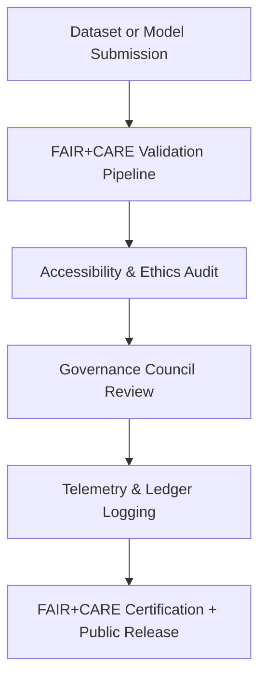
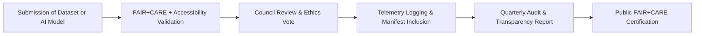

<div align="center">

# ⚖️ **Kansas Frontier Matrix — Governance Framework & Ethical Oversight**
`docs/governance/README.md`

**Purpose:**  
Define the **governance architecture**, **ethical oversight**, and **compliance framework** that guide the operation, validation, and release management of the **Kansas Frontier Matrix (KFM)** system.  
Governance ensures every dataset, interface, and AI output adheres to **FAIR+CARE principles**, **ISO standards**, and **Master Coder Protocol (MCP-DL v6.3)** reproducibility mandates.

[](../README.md)
[](../standards/faircare.md)
[](../../LICENSE)
[](../../releases/v10.0.0/manifest.zip)

</div>

---

## 📘 Overview

Governance is the **ethical backbone** of the Kansas Frontier Matrix, combining open data management, AI accountability, and cultural stewardship.  
It integrates **technical validation pipelines** with **FAIR+CARE Council ethics review**, ensuring responsible innovation across every version of the platform.

This document summarizes:
- Governance hierarchy and council responsibilities  
- FAIR+CARE integration mechanisms  
- Compliance and validation pipelines  
- Community engagement and Indigenous sovereignty practices  

---

## 🗂️ Directory Layout

```
docs/governance/
├── README.md                            # This file
├── council-structure.md                 # Governance hierarchy and voting rules
├── validation-pipelines.md              # FAIR+CARE validation and CI/CD integration
├── transparency-reports.md              # Public compliance and audit summaries
├── community-participation.md           # Public & Indigenous engagement framework
└── risk-and-ethics.md                   # AI, data, and privacy risk mitigation guide
```

---

## 🧭 Governance Model

| Council | Role | Frequency | Documentation |
|---|---|---|---|
| **FAIR+CARE Council** | Ethical oversight of datasets, AI models, and cultural content. | Quarterly | `docs/data/governance/review-council-minutes.md` |
| **Data Standards Committee (DSC)** | Maintains schemas, contracts, and metadata standards. | Biannual | `docs/data/contracts/README.md` |
| **Indigenous Data Governance Board (IDGB)** | Reviews and approves cultural and tribal datasets. | Quarterly | `docs/data/governance/indigenous-data-protocol.md` |
| **Accessibility & Design Council** | Monitors A11y, UX, and sustainable interface design. | Continuous | `docs/design/README.md` |
| **Governance Secretariat** | Records, audits, and publishes council minutes and telemetry reports. | Continuous | `docs/data/governance/review-council-minutes.md` |

---

## ⚙️ Governance Functions

| Function | Description | Oversight |
|---|---|---|
| **Ethical Validation** | Ensures all releases meet FAIR+CARE and MCP compliance. | FAIR+CARE Council |
| **Data Provenance Assurance** | Verifies source lineage and consent metadata. | Data Standards Committee |
| **Accessibility Certification** | Confirms adherence to WCAG 2.1 AA and ISO 9241-210. | Accessibility Council |
| **Cultural Consent Enforcement** | Implements Indigenous sovereignty through IDGB protocols. | Indigenous Data Governance Board |
| **AI Accountability** | Audits Focus Mode outputs for explainability, tone, and ethics. | AI Oversight Team |
| **Sustainability Audits** | Monitors energy use and computational efficiency. | Environmental Compliance Team |

---

## 🧠 FAIR+CARE Governance Integration

| Principle | Governance Implementation |
|---|---|
| **Collective Benefit** | All data and AI outputs contribute to public understanding, not exploitation. |
| **Authority to Control** | Indigenous and community groups retain governance over their data visibility. |
| **Responsibility** | Each dataset is reviewed for ethical provenance, consent, and representation. |
| **Ethics** | Councils ensure content reflects integrity, neutrality, and cultural respect. |

Every release must receive **FAIR+CARE Certification** before inclusion in the `manifest.zip`.

---

## ♿ Accessibility & Equity Mandates

- Every interface and document must meet **WCAG 2.1 AA** accessibility standards.  
- Cultural materials require **contextual consent and community attribution**.  
- Governance workflows emphasize **inclusive decision-making** — all council votes must include Indigenous and accessibility representatives.  
- Public dashboards ensure **transparency and visibility** of FAIR+CARE metrics.

---

## 🧩 Compliance & Validation Pipelines



| Workflow | Purpose | Artifact |
|---|---|---|
| `faircare-audit.yml` | Validates FAIR+CARE compliance across data and design layers. | `reports/data/faircare-validation.json` |
| `data-provenance.yml` | Confirms lineage, consent, and licensing. | `reports/data/provenance-summary.json` |
| `accessibility_scan.yml` | Tests web components and dashboards. | `reports/self-validation/web/a11y_summary.json` |
| `telemetry-export.yml` | Logs all governance metrics into telemetry. | `releases/v10.0.0/focus-telemetry.json` |

---

## 🪶 Indigenous Data Governance Protocol Integration

Governance respects the sovereignty of Indigenous data through active collaboration with the **Indigenous Data Governance Board (IDGB)**.  

Key practices:
- All tribal datasets tagged with **CARE consent metadata**.  
- Heritage content restricted or anonymized until reviewed by IDGB.  
- IDGB retains **final authority** on cultural visibility decisions.  
- Council publishes joint statements on cultural representation annually.  

> See `docs/data/governance/indigenous-data-protocol.md` for full procedural guidance.

---

## 📊 Governance Metrics Dashboard

| Metric | Target | Verification |
|---|---|---|
| **FAIR+CARE Compliance Rate** | ≥ 95% | `faircare-audit.yml` |
| **Consent Metadata Coverage** | 100% (for cultural datasets) | IDGB Review |
| **Accessibility Certification** | 100% | `accessibility_scan.yml` |
| **Telemetry Transparency Index** | ≥ 90% | Governance Dashboard |
| **Council Participation Rate** | ≥ 75% | Secretariat Minutes |

---

## 🧾 Council Decision Transparency (JSON-LD Schema)

```json
{
  "@context": "https://schema.org/",
  "@type": "CreativeWork",
  "identifier": "FDGC-2025-Q4-Decision-02",
  "name": "Approval of NOAA Climate Dataset",
  "author": {
    "name": "FAIR+CARE Governance Council",
    "role": "approver"
  },
  "datePublished": "2025-11-08",
  "decision": "approved",
  "rationale": "Dataset verified for FAIR+CARE and consent compliance."
}
```

All decisions are versioned in `docs/data/governance/review-council-minutes.md` and logged into the Governance Ledger.

---

## 🧮 Governance Lifecycle



---

## 🕰️ Version History

| Version | Date | Author | Summary |
|---|---|---|---|
| v10.0.0 | 2025-11-10 | FAIR+CARE Governance Secretariat | Established centralized governance documentation outlining ethical oversight, council functions, validation pipelines, and Indigenous sovereignty protocols. |

---

<div align="center">

**© 2025 Kansas Frontier Matrix — CC-BY 4.0**  
Governed under **Master Coder Protocol v6.3** · Certified by **FAIR+CARE Council** · Diamond⁹ Ω / Crown∞Ω Ultimate Certified  
[⬅ Back to Documentation Index](../README.md) · [Standards →](../standards/README.md)

</div>
