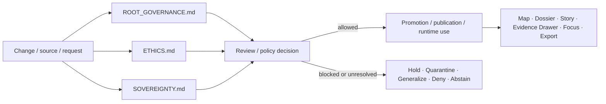

# Kansas Frontier Matrix — Governance

Directory index for the policy, review, sensitivity, and publication rules that keep KFM evidence-governed.

> **Directory status:** Active  
> **README status:** Draft / needs repo verification  
> **Owners:** NEEDS VERIFICATION  
>      
> **Quick jump:** [Scope](#scope) · [Repo fit](#repo-fit) · [Inputs](#inputs) · [Exclusions](#exclusions) · [Directory tree](#directory-tree) · [Quickstart](#quickstart) · [Governance flow](#governance-flow) · [Change matrix](#change-matrix) · [Definition of done](#definition-of-done) · [FAQ](#faq) · [Appendix](#appendix)

## Scope

This directory defines how KFM governs truth, review, rights, sensitivity, and correction. It is where maintainers should look first when a change could alter public claims, publication state, locational exposure, Focus behavior, Evidence Drawer obligations, release gates, or who is allowed to approve what.

KFM governance is deliberately broader than “security settings” and narrower than vague project values. Here, governance means the operational rules that keep public and role-limited surfaces downstream of evidence, policy, review, and release state.

Because KFM treats documentation as part of the production surface, governance changes that affect behavior should move with related docs, examples, tests, and runbooks rather than lag behind them.

When precision matters in this directory, use **CONFIRMED**, **PROPOSED**, and **UNKNOWN** rather than flattening uncertainty into confident prose.

> [!IMPORTANT]
> Derived layers, tiles, graphs, search indexes, summaries, scenes, exports, and AI outputs are not authoritative by default. Governance exists to keep them downstream of the canonical truth path and the trust membrane.

## Repo fit

| Item | Value |
|---|---|
| Directory path | `docs/governance/` |
| This file | `docs/governance/README.md` |
| Upstream | [Docs index][docs-root] |
| Primary downstream docs | [ROOT_GOVERNANCE.md][root-governance] · [ETHICS.md][ethics] · [SOVEREIGNTY.md][sovereignty] |
| Adjacent context | [Architecture docs][architecture] · [Security docs][security] |
| Governs | review triggers, publication constraints, rights/sensitivity handling, negative outcomes, correction posture, and trust-visible policy expectations |
| Does not replace | machine-readable contracts, policy bundles, fixtures, tests, or subsystem-specific runbooks |

## Inputs

Accepted inputs here include:

- core governance law and directory-level navigation
- review triggers and approval boundaries
- ethics, public-consequence, and behavioral guardrails
- sovereignty, CARE, and exact-location exposure rules
- publication blockers, correction rules, and withdrawal/supersession posture
- links to adjacent runtime, verification, security, and delivery doctrine where governance crosses subsystem boundaries

## Exclusions

This directory should not become a dumping ground for everything “important.”

- Dataset-specific registries, source inventories, and analysis methods belong in domain or data docs.
- Security implementation detail, supply-chain hardening, and threat-specific runbooks belong in security docs.
- OpenAPI schemas, JSON Schemas, policy bundles, fixtures, and automated tests belong in their machine-readable subsystem homes.
- Exploratory notes, draft proposals, and ungated research belong in research or draft directories—not in governing law.

## Directory tree

The current KFM documentary pattern repeatedly points to the following files as the core governance set:

```text
docs/governance/
├── README.md              # Directory contract and navigation
├── ROOT_GOVERNANCE.md     # Core governance law and review triggers
├── ETHICS.md              # Ethical constraints and public-consequence rules
└── SOVEREIGNTY.md         # Rights, sensitivity, and location-exposure handling
```

> [!NOTE]
> Before merge, verify the exact filenames and any additional subdirectories against the live repo. This README is written to the strongest visible documentation pattern, not a mounted repo tree.

## Quickstart

When a change might affect public trust, run this sequence before merge or promotion:

1. Identify the change class: public claim, publication state, sensitive location exposure, runtime answer behavior, review boundary, or correction path.
2. Read [ROOT_GOVERNANCE.md][root-governance] first.
3. Add [ETHICS.md][ethics] when the change affects people, public consequence, persuasive behavior, or the way uncertainty is shown.
4. Add [SOVEREIGNTY.md][sovereignty] when the change touches culturally sensitive material, community-linked knowledge, exact locations, archaeology, biodiversity, oral history, or any data that may require redaction or generalization.
5. Decide the allowed outcome before implementation: publish, hold, quarantine, generalize, deny, abstain, withdraw, or supersede.
6. Update related docs, contracts, tests, runbooks, and examples in the same governed change stream.

## Usage

### Start here when…

- a map, dossier, story, export, or Focus surface could present new public claims
- a workflow changes publication, promotion, or correction behavior
- a contributor wants to expose or summarize sensitive or community-linked material
- a derived layer risks being mistaken for authoritative truth
- a review boundary, approver role, or release blocker changes
- a doc proposes policy-significant behavior and needs the governing home

### Escalate immediately when…

- exact locations, geometry, or site descriptions may expose sensitive places
- AI or retrieval behavior could produce uncited, over-scoped, or policy-unsafe answers
- a convenience path bypasses the governed API or hides review state
- a domain doc wants to treat a modeled or summarized product as authoritative without explicit promotion and labeling
- a correction, withdrawal, or supersession path is missing

> [!WARNING]
> “Helpful” is not a governance outcome. KFM explicitly allows negative outcomes when trust cannot be preserved: hold, quarantine, generalize, deny, abstain, withdraw, and supersede are all valid designed states.

## Governance flow


```mermaid
flowchart LR
    A[Change / source / request] --> B[ROOT_GOVERNANCE.md]
    A --> C[ETHICS.md]
    A --> D[SOVEREIGNTY.md]

    B --> E[Review / policy decision]
    C --> E
    D --> E

    E -->|allowed| F[Promotion / publication / runtime use]
    E -->|blocked or unresolved| G[Hold · Quarantine · Generalize · Deny · Abstain]

    F --> H[Map · Dossier · Story · Evidence Drawer · Focus · Export]
```

## Change matrix

| Change type | Start here | Check next | Typical outputs |
|---|---|---|---|
| Public surface behavior (`Map`, `Dossier`, `Story`, `Focus`, `Export`) | [ROOT_GOVERNANCE.md][root-governance] | [ETHICS.md][ethics], [SOVEREIGNTY.md][sovereignty] as needed | review boundary, release obligation, visible caveats, correction path |
| Rights, sensitivity, or exact-location exposure | [SOVEREIGNTY.md][sovereignty] | [ETHICS.md][ethics] | redaction/generalization rule, steward review, restricted/public-safe variant |
| Policy or approval-boundary change | [ROOT_GOVERNANCE.md][root-governance] | [Security docs][security] and verification/delivery docs | approver boundary, blocking condition, recorded rationale |
| AI / runtime trust behavior | [ROOT_GOVERNANCE.md][root-governance] | [Security docs][security] | answer/abstain/deny rules, citation requirements, audit expectations |
| Public-consequence or persuasive UX change | [ETHICS.md][ethics] | [ROOT_GOVERNANCE.md][root-governance] | guardrails, disclosure rules, escalation path |
| Domain material with community-linked knowledge | [SOVEREIGNTY.md][sovereignty] | [ROOT_GOVERNANCE.md][root-governance] | withholding/generalization decision, steward review, publication class |

## Operational outcomes

| Outcome | Use it when | Do not treat it as |
|---|---|---|
| **Publish** | Evidence, policy, review, and release conditions are satisfied | a default entitlement |
| **Hold** | Readiness is incomplete but the item may yet become publishable | failure or indecision |
| **Quarantine** | intake, rights, or sensitivity is unresolved | a hidden backlog |
| **Generalize** | exact geometry or locational detail would create exposure | loss of meaning by default |
| **Deny** | the request or change exceeds policy or allowed scope | a UX annoyance |
| **Abstain** | runtime answer cannot be supported safely with admissible evidence | poor assistant performance |
| **Withdraw / Supersede** | a published object later proves wrong, unsafe, stale, or over-scoped | reputational damage to be hidden |

## Definition of done

A governance-directory change is ready when:

- [ ] linked governance docs resolve and the directory map is current
- [ ] owners and review boundaries are either current or intentionally flagged for follow-up
- [ ] truth posture is explicit where uncertainty matters
- [ ] rights, sensitivity, sovereignty, and exact-location handling are stated where relevant
- [ ] negative outcomes and correction paths are visible, not implied
- [ ] behavior-significant changes update adjacent docs, examples, tests, and runbooks together
- [ ] no prose quietly upgrades PROPOSED or UNKNOWN implementation into asserted fact

## FAQ

### Is governance just security?

No. Security is one governed concern, but KFM governance also covers publication state, review authority, rights, sensitivity, locational exposure, correction, and the rule that public claims must remain evidence-linked.

### Why are “deny” and “abstain” treated as healthy outcomes?

Because KFM is designed to fail closed. A system that visibly refuses unsupported or unsafe output is more trustworthy than one that returns plausible-looking claims without admissible support.

### Why keep governance docs separate from contracts and tests?

Because this directory states the governing law and escalation rules. Machine-readable contracts, policy bundles, fixtures, and tests should implement that law in their subsystem homes rather than duplicating it here.

## Appendix

<details>
<summary><strong>Working vocabulary</strong></summary>

| Term | Working meaning in KFM |
|---|---|
| **Truth path** | `Source edge → RAW → WORK / QUARANTINE → PROCESSED → CATALOG / TRIPLET → PUBLISHED` |
| **Trust membrane** | the governed API/policy boundary that prevents direct client access to internal stores or raw canonical state |
| **Authoritative vs derived** | canonical truth is controlled, versioned, and governance-bearing; derived layers are rebuildable unless explicitly promoted |
| **Evidence bundle** | the policy-safe evidence package that a claim, dossier, story, or runtime answer must resolve through |
| **Promotion** | a governed state transition, not a file copy |
| **Correction** | an explicit, auditable withdrawal, supersession, or narrowed replacement path |

</details>

<details>
<summary><strong>Review triggers worth keeping visible</strong></summary>

- new public claims or major changes to claim presentation
- new or changed publication classes
- exact-location exposure risk
- changes to review authority or no-self-approve boundaries
- AI/runtime response changes that affect citation, scope, or abstention
- corrections, withdrawals, and supersession rules
- changes that could make docs drift from actual behavior

</details>

[Back to top](#kansas-frontier-matrix--governance)

[docs-root]: ../README.md
[architecture]: ../architecture/README.md
[security]: ../security/README.md
[root-governance]: ./ROOT_GOVERNANCE.md
[ethics]: ./ETHICS.md
[sovereignty]: ./SOVEREIGNTY.md