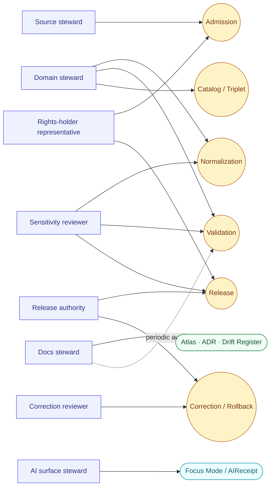

# 🧭 KFM Governance — Roles, Review Burden, and Separation of Duties

> Human-facing home for the **people side** of KFM governance: who owns what, when an
> author may also approve their own work, and where separation of duties is required
> before a claim becomes public.

<p>
  
  
  
  
  
</p>

| Field | Value |
|---|---|
| **Path** | `docs/governance/README.md` |
| **Authority level** | Canonical · governance-bearing (per Directory Rules §6.1) |
| **Status** | `PROPOSED` — doctrine CONFIRMED; folder contents and tooling enforcement `NEEDS VERIFICATION` |
| **Owners** | Docs steward (lead) · subsystem owners (per separation-of-duties matrix) · `TODO` named individuals |
| **Last reviewed** | 2026-05-12 |

---

## Contents

- [1. Purpose](#1-purpose)
- [2. Authority level and status](#2-authority-level-and-status)
- [3. Scope and repo fit](#3-scope-and-repo-fit)
- [4. Role topology](#4-role-topology-diagram)
- [5. What belongs here](#5-what-belongs-here)
- [6. What does NOT belong here](#6-what-does-not-belong-here)
- [7. Directory layout (PROPOSED)](#7-directory-layout-proposed)
- [8. The eight roles](#8-the-eight-roles)
- [9. Separation-of-duties matrix](#9-separation-of-duties-matrix)
- [10. Maturity progression — when separation tightens](#10-maturity-progression--when-separation-tightens)
- [11. Validation](#11-validation)
- [12. Review burden and CODEOWNERS](#12-review-burden-and-codeowners)
- [13. Anti-patterns](#13-anti-patterns)
- [14. Related folders and docs](#14-related-folders-and-docs)
- [15. Open ADRs that affect this folder](#15-open-adrs-that-affect-this-folder)
- [16. FAQ](#16-faq)
- [17. Last reviewed](#17-last-reviewed)

---

## 1. Purpose

This folder is the **human-facing operating manual for KFM governance roles**. It names
the people-shaped responsibilities that the rest of the system relies on — admission,
review, release, correction, rollback, and AI-surface stewardship — and describes when
separation of duties is required before a claim or artifact is treated as public.

> `CONFIRMED` doctrine (KFM operating-law invariant 9): *KFM separates policy-significant
> release duties when maturity justifies it.* The rules in this folder operationalize
> that invariant.

Specifically, `docs/governance/` answers four recurring questions:

1. **Who owns this kind of decision?** (e.g., admission of a new source, release of a
   sensitive layer, approval of a CorrectionNotice).
2. **When is the author allowed to also approve?**
3. **When must a separate reviewer sign off — and which reviewer?**
4. **When is review enforced by tooling vs. by custom?** (See open ADR-S-09.)

`docs/governance/` does **not** own doctrine itself, the directory rules, machine-readable
registers, or schemas. Those live in their own roots — see [§14](#14-related-folders-and-docs).

[Back to top](#-kfm-governance--roles-review-burden-and-separation-of-duties)

---

## 2. Authority level and status

| Field | Value | Basis |
|---|---|---|
| **Authority class** | Canonical · governance-bearing | Directory Rules §6.1 tree: `docs/governance/` is listed as a sub-root of the human-facing control plane. |
| **Doctrine label** | `CONFIRMED` | Operating-law invariant 9 in the KFM Encyclopedia. |
| **Roles list** | `PROPOSED` (Atlas v1.1 §24.7.1) | Atlas v1.1 explicitly flags the role catalog as a PROPOSED reference for ADR discussion. |
| **Separation-of-duties matrix** | `PROPOSED` (Atlas v1.1 §24.7.2) | Same; matrix is reference, not yet tooling-enforced. |
| **Enforcement maturity** | `UNKNOWN` | No mounted-repo evidence in this session proves CODEOWNERS, branch protections, or workflow gates enforce the matrix. |

> [!IMPORTANT]
> The **doctrine** in this folder is settled. The **enforcement** is not. Until ADR-S-09
> records the tooling threshold, this folder describes the *expected* posture, not a
> verified runtime guarantee. Do not cite this README as proof that separation of duties
> is mechanically blocked at PR time.

---

## 3. Scope and repo fit

**Repo fit (per Directory Rules §6.1):**

```text
docs/
├── README.md
├── doctrine/        ← operating law, lifecycle law, trust membrane, authority ladder
├── architecture/    ← system context, deployment topology, governed API, map shell
├── adr/             ← architectural decision records (including ADR-S-09 reviewer separation)
├── domains/         ← per-domain dossiers
├── sources/         ← source descriptor standards, source families
├── standards/       ← external standards KFM conforms to (STAC, DCAT, PROV, …)
├── runbooks/        ← ops procedures, rollback drills
├── security/        ← threat model, exposure posture
├── governance/      ← ← YOU ARE HERE: roles, review burden, separation of duties
├── registers/       ← AUTHORITY_LADDER, DRIFT_REGISTER, VERIFICATION_BACKLOG, …
├── intake/          ← IDEA_INTAKE, NEW_IDEAS_INDEX
├── archive/         ← lineage/, exploratory/, deprecated/
├── reports/         ← generated review/release reports (read-only)
└── brand/           ← style guide, logo, voice (only if not in packages/ui/)
```

**Upstream (this folder reads from):** `docs/doctrine/` (operating law), `docs/adr/`
(decisions about separation thresholds), `docs/registers/AUTHORITY_LADDER.md`.

**Downstream (consumes this folder):** PR reviewers, release authorities, sensitivity
reviewers, CODEOWNERS authors, the drift register triage process, and any tooling that
later enforces separation of duties.

---

## 4. Role topology (diagram)

The diagram below names the eight roles and the lifecycle gates each role principally
acts on. It is a **responsibility map**, not a workflow. Roles may collaborate on a
single gate; the matrix in [§9](#9-separation-of-duties-matrix) names when more than one
must.


```mermaid
flowchart LR
  %% Roles
  SS["Source steward"]:::role
  DS["Domain steward"]:::role
  SR["Sensitivity reviewer"]:::role
  RR["Rights-holder representative"]:::role
  RA["Release authority"]:::role
  CR["Correction reviewer"]:::role
  AS["AI surface steward"]:::role
  DOCS["Docs steward"]:::role

  %% Lifecycle gates
  G1((Admission)):::gate
  G2((Normalization)):::gate
  G3((Validation)):::gate
  G4((Catalog / Triplet)):::gate
  G5((Release)):::gate
  G6((Correction / Rollback)):::gate
  FOCUS([Focus Mode / AIReceipt]):::ai
  ATLAS([Atlas · ADR · Drift Register]):::doc

  SS --> G1
  RR --> G1
  DS --> G2
  DS --> G3
  SR --> G2
  SR --> G3
  DS --> G4
  RA --> G5
  SR --> G5
  RR --> G5
  CR --> G6
  RA --> G6
  AS --> FOCUS
  DOCS --> ATLAS
  DOCS -. periodic audit .-> G3

  classDef role fill:#EEF2FF,stroke:#4F46E5,color:#312E81;
  classDef gate fill:#FEF3C7,stroke:#B45309,color:#78350F;
  classDef ai   fill:#ECFEFF,stroke:#0891B2,color:#155E75;
  classDef doc  fill:#F0FDF4,stroke:#15803D,color:#14532D;
```

> [!NOTE]
> `PROPOSED`: the diagram reflects Atlas v1.1 §24.7. It will be regenerated from the
> machine-readable role register in `control_plane/` once that register lands (see
> ADR-S-09).

[Back to top](#-kfm-governance--roles-review-burden-and-separation-of-duties)

---

## 5. What belongs here

Files in `docs/governance/` describe **who is accountable for which governance action**,
in prose that humans can read in a PR. Accepted content:

- **Role definitions** — one file per role or one consolidated `roles.md`, expanding the
  Atlas v1.1 §24.7.1 catalog with KFM-specific scope notes.
- **Separation-of-duties policy** — when the author may also approve, when not, and which
  reviewer must sign.
- **Review burden tables** — per-action lists of required reviewers, expected receipts,
  and the failure-closed outcome when review is missing.
- **CODEOWNERS policy notes** — *not* the `CODEOWNERS` file itself (that lives at repo
  root or `.github/`), but the **rationale** for ownership assignments and the mapping
  from roles defined here to CODEOWNERS entries.
- **Escalation paths** — what happens when a reviewer is unavailable, conflicted, or
  the lane is sensitive enough to require a rights-holder representative.
- **Maturity thresholds** — at what point separation must move from custom to tooling.
- **Linkouts** to the doctrine, ADRs, and registers that make these rules normative.

---

## 6. What does NOT belong here

> [!WARNING]
> Putting any of the following here is a placement violation and a drift candidate.

| Content | Correct home | Why not here |
|---|---|---|
| Operating-law statements, lifecycle law, trust-membrane definition | `docs/doctrine/` | This folder *applies* doctrine; it does not author it. |
| Directory Rules §-level authority decisions | `docs/doctrine/directory-rules.md` | Same. |
| Architectural decision records (incl. ADR-S-09) | `docs/adr/` | ADRs have their own lifecycle and template. |
| Machine-readable role / owner registers | `control_plane/` (e.g., `policy_gate_register.yaml`) | Structured registers belong in the machine-readable governance layer, not in prose. |
| Threat model, exposure posture, incident response | `docs/security/` | Security is a peer governance root, not a child of this folder. |
| Drift register entries, verification backlog | `docs/registers/` | Registers track state; this folder defines roles. |
| The `CODEOWNERS` file itself | repo root or `.github/CODEOWNERS` | This folder may *describe* CODEOWNERS policy; it does not host the file. |
| Per-PR review checklists for code | `.github/PULL_REQUEST_TEMPLATE/` | Workflow templates live with GitHub config. |
| Per-domain role assignments (e.g., who reviews hydrology layers) | `docs/domains/<domain>/` (under its `M.` review section) | Domain dossiers own their own steward names. |

[Back to top](#-kfm-governance--roles-review-burden-and-separation-of-duties)

---

## 7. Directory layout (PROPOSED)

> [!NOTE]
> `PROPOSED` tree. The folder exists in Directory Rules §6.1 as canonical, but the
> *contents* below are an inference from the folder's stated purpose ("roles, review
> burden, separation of duties"). They are `NEEDS VERIFICATION` until mounted-repo
> evidence confirms which files actually exist.

```text
docs/governance/
├── README.md                       ← this file
├── roles.md                        ← PROPOSED: expanded definitions for the 8 roles
├── separation-of-duties.md         ← PROPOSED: action-by-action matrix (machine-checkable)
├── review-burden.md                ← PROPOSED: required reviewers + receipts per action
├── codeowners-policy.md            ← PROPOSED: rationale for CODEOWNERS mapping
├── escalation.md                   ← PROPOSED: unavailable / conflicted reviewer paths
├── maturity-thresholds.md          ← PROPOSED: when separation tightens; pre-ADR-S-09 notes
└── reviewer-rotation/              ← PROPOSED: optional cadence notes; not steward-of-record
```

Any file added under `docs/governance/` MUST satisfy the per-root README contract in
Directory Rules §15 (Purpose, Authority level, Status, What belongs here, What does NOT
belong here, Inputs, Outputs, Validation, Review burden, Related folders, ADRs, Last
reviewed). A folder without a conforming README is a drift candidate.

[Back to top](#-kfm-governance--roles-review-burden-and-separation-of-duties)

---

## 8. The eight roles

The role catalog below is `CONFIRMED` doctrine *as a catalog* — it appears in Atlas v1.1
§24.7.1 and is referenced by operating-law invariant 9 in the KFM Encyclopedia. The
individual role *scope statements* are `PROPOSED` pending ADR-S-09 and per-role
expansion in the files listed in [§7](#7-directory-layout-proposed).

| # | Role | Owns | Principal scope |
|:-:|---|---|---|
| 1 | **Source steward** | Admission, rights confirmation, and sensitivity tagging for a named source family. | `SourceDescriptor` lifecycle; the admission gate (— → RAW). |
| 2 | **Domain steward** | Meaning, contracts, and validators of a domain's object families. | Domain contracts and schemas; validator authorship; review of domain-internal promotions. |
| 3 | **Sensitivity reviewer** | Redaction, generalization, withholding, and tier decisions for sensitive content. | `RedactionReceipt`; tier transitions for sensitive lanes. |
| 4 | **Rights-holder representative** | Sovereignty, cultural-heritage, and consent-based release decisions. | Archaeology, sovereign data, living-person data, DNA data. |
| 5 | **Release authority** | Issues `ReleaseManifest`s and authorizes PUBLISHED transitions. | PUBLISHED transitions; rollback authorization. Distinct from authorship when materiality applies. |
| 6 | **Correction reviewer** | Reviews `CorrectionNotice` / `RollbackCard` before they amend a PUBLISHED claim. | Post-publication corrections; rollbacks. |
| 7 | **AI surface steward** | Focus Mode templates, `AIReceipt` sampling, policy bindings, cite-or-abstain audits. | Focus Mode; `AIReceipt` review; AI behavior vs. doctrine audits. |
| 8 | **Docs steward** | Governance documentation, ADR index, drift register, Atlas / supplement integrity. | The `docs/` tree; ADR index; `docs/registers/DRIFT_REGISTER.md`. |

> [!TIP]
> A single person MAY hold multiple roles in early-stage operation. The matrix in
> [§9](#9-separation-of-duties-matrix) controls when that is acceptable — not the role
> definitions themselves.

[Back to top](#-kfm-governance--roles-review-burden-and-separation-of-duties)

---

## 9. Separation-of-duties matrix

Reproduced from Atlas v1.1 §24.7.2 with KFM terminology preserved. `PROPOSED` reference
matrix; enforcement maturity is `UNKNOWN` pending ADR-S-09.

| Action | May author also approve? | Required separation |
|---|---|---|
| Source admission (— → RAW) | **Yes** for routine; **No** when source has unresolved rights / sovereignty. | Source steward + rights-holder representative where applicable. |
| Normalization receipts | **Yes** for routine; **No** when transforms are sensitivity-relevant. | Domain steward; sensitivity reviewer if sensitivity-relevant. |
| Validator authorship and run | **Yes** (validators are deterministic). | Domain steward; periodic audit by docs steward. |
| Promotion to PROCESSED / CATALOG | **Yes** for non-sensitive routine; **No** for sensitive lanes. | Domain steward + sensitivity reviewer (sensitive lanes). |
| Release to PUBLISHED | **No** when materiality applies. | Author ≠ release authority; rights-holder representative where applicable. |
| Sensitive-lane release | **No**. | Author **+** sensitivity reviewer **+** release authority **+** rights-holder representative. |
| Correction / rollback | **No** when correction is steward-significant. | Author / detector + correction reviewer + release authority. |
| AI surface change (template / policy binding) | **No**. | AI surface steward + docs steward (for the policy binding). |
| Atlas / supplement publication | **No**. | Docs steward + at least one subsystem owner (per Directory Rules). |

> [!IMPORTANT]
> "Materiality" and "sensitivity-relevant" are not self-defined here. They resolve via
> the sensitivity tier scheme (T0–T4, see Atlas v1.1 §24.5) and the per-domain rules in
> `docs/domains/<domain>/`. When in doubt, **escalate to a separate reviewer**. The fail-
> safe default is more separation, not less.

[Back to top](#-kfm-governance--roles-review-burden-and-separation-of-duties)

---

## 10. Maturity progression — when separation tightens

> [!NOTE]
> `CONFIRMED` doctrine (Atlas v1.1 §24.7 closing note + Directory Rules §2):
> *Separation of duties is maturity-dependent. Early-stage doctrine work may be authored
> and approved by the same actor when materiality is low. As maturity rises and the
> public trust surface expands, separation must be enforced through tooling, not custom.*

The intended progression:

1. **Pre-public stage.** Author = approver permitted for non-sensitive, low-materiality
   doctrine and internal review work. The matrix is aspirational.
2. **Early public surface.** Matrix becomes a PR-time custom: reviewers cite this README
   when refusing self-approval on sensitive lanes. No tooling block yet.
3. **Mature public surface.** Separation moves into tooling — CODEOWNERS, branch
   protections, required-reviewer workflows, policy-bundle checks that fail closed when
   a required role is missing from a release manifest.

The threshold between stages 2 and 3 is the subject of **open ADR-S-09** (*Reviewer
role separation: when is separation enforced by tooling vs. custom*). Until ADR-S-09 is
accepted, this README does **not** claim that any tooling enforces the matrix.

[Back to top](#-kfm-governance--roles-review-burden-and-separation-of-duties)

---

## 11. Validation

> [!NOTE]
> `PROPOSED` validation strategy. None of the validators below has been verified as
> present, wired, or passing in mounted-repo evidence in this session.

| Check | What it would validate | Status |
|---|---|---|
| `docs/governance/` README contract | Every file under this folder has a §15-compliant README. | `PROPOSED` |
| Role-name vocabulary lint | Role names used elsewhere in `docs/` match the eight names in [§8](#8-the-eight-roles). | `PROPOSED` |
| Separation-of-duties register parity | Machine-readable matrix in `control_plane/` matches the prose matrix here. | `PROPOSED` (depends on register existing) |
| CODEOWNERS ↔ role mapping check | Every role named here resolves to at least one CODEOWNERS path / team. | `PROPOSED` |
| Release-manifest required-reviewer check | A `ReleaseManifest` for a sensitive lane carries reviewer references in all four required roles. | `PROPOSED` (release tooling not verified) |
| ADR-S-09 acceptance | ADR-S-09 has reached `status: accepted` and this README links to it. | `PROPOSED` (ADR-S-09 currently open) |

---

## 12. Review burden and CODEOWNERS

Review burden = the **minimum set of human approvals** a change must collect before
merging or releasing. This folder describes burden in two layers:

1. **Doc-level burden** (what this folder's own files need to merge): Docs steward
   review by default; sensitivity reviewer co-sign if a change touches sensitive-lane
   role scopes; release authority co-sign if a change weakens release-time separation.
2. **System-level burden** (what changes elsewhere need, by role): captured in the
   matrix in [§9](#9-separation-of-duties-matrix).

> [!CAUTION]
> `CODEOWNERS` is a GitHub mechanism; it expresses *who is auto-requested for review on
> a path*. It does **not** by itself enforce separation of duties — an author with
> commit access can still self-merge unless branch protections require approvals from
> someone other than the author. Treat CODEOWNERS as a **routing tool**, not as a
> trust-membrane control. The tooling-enforced separation referenced in [§10](#10-maturity-progression--when-separation-tightens)
> requires branch protections, required-reviewer rules, and release-manifest checks
> *in addition to* CODEOWNERS.

`PROPOSED` CODEOWNERS-policy mapping (to be specified in `codeowners-policy.md`):

| Path pattern | Required reviewer role(s) |
|---|---|
| `docs/governance/**` | Docs steward |
| `docs/doctrine/**` | Docs steward + accepted-ADR reference |
| `docs/adr/**` | Docs steward + at least one subsystem owner |
| `release/manifests/**` | Release authority (+ rights-holder rep for sovereign lanes) |
| `policy/sensitivity/**` | Sensitivity reviewer + release authority |
| `apps/governed-api/**` | Subsystem owner + docs steward for any policy-binding change |
| `runtime/model_adapters/**`, `apps/governed-api/src/ai/**` | AI surface steward |

[Back to top](#-kfm-governance--roles-review-burden-and-separation-of-duties)

---

## 13. Anti-patterns

> [!WARNING]
> The following are governance-process anti-patterns called out in Atlas v1.1 §24.9.3.
> All are KFM-explicit, not generic.

- **Documenting a change instead of validating it.** Docs are part of the working
  system but never substitute for validators, fixtures, or schema. This README is not
  a substitute for a passing release-manifest reviewer check.
- **Approving one's own release on a sensitive lane.** Matrix [§9](#9-separation-of-duties-matrix);
  release authority must be distinct from author when materiality applies.
- **Treating an Atlas summary or matrix as evidence.** Atlas, supplements, and master
  matrices are reference views; `EvidenceBundle` remains authoritative.
- **Silent migrations between role homes.** Moving role definitions out of
  `docs/governance/` (e.g., into a domain folder) without an ADR fragments authority
  and is a drift candidate (Directory Rules §2.4).
- **Promotion that "upgrades" a source role** (e.g., modeled → observed). Source role
  is fixed at admission; never upgraded by promotion. Separation-of-duties does not fix
  a source-role collapse; the source role does.
- **Re-publishing a corrected claim without invalidating derivatives.**
  `CorrectionNotice` must list invalidated derivatives; `RollbackCard` if needed.
- **Using CODEOWNERS as a trust-membrane control.** See [§12](#12-review-burden-and-codeowners).

---

## 14. Related folders and docs

| Folder / file | Why it's related |
|---|---|
| `../doctrine/` | Operating law, lifecycle law, trust membrane, authority ladder — this folder operationalizes them. |
| `../doctrine/directory-rules.md` | Authoritative tree (§6.1) that places `docs/governance/` and lists the per-root README contract (§15). |
| `../adr/` | ADRs that affect role separation, most importantly the open ADR-S-09. |
| `../registers/AUTHORITY_LADDER.md` | Authority ranking; reviewers cite this when sources disagree. `TODO` link target. |
| `../registers/DRIFT_REGISTER.md` | Where drift between this folder and repo state should be recorded. `TODO` link target. |
| `../registers/VERIFICATION_BACKLOG.md` | Open verification items including matrix-tooling parity. `TODO` link target. |
| `../security/` | Threat model and exposure posture; peer governance root. |
| `../sources/SOURCE_DESCRIPTOR_STANDARD.md` | Source steward's authoring surface. `TODO` link target. |
| `../../control_plane/` | Machine-readable governance maps (role / policy-gate / release-state registers). |
| `../../release/` | Release decisions; where release authority's outputs land. |
| Repo-root `CODEOWNERS` *or* `.github/CODEOWNERS` | The actual ownership routing file. `NEEDS VERIFICATION` which path the repo uses. |

[Back to top](#-kfm-governance--roles-review-burden-and-separation-of-duties)

---

## 15. Open ADRs that affect this folder

| ADR | Question | Why it matters here |
|---|---|---|
| **ADR-S-09** | Reviewer role separation: when is separation enforced by tooling vs. custom? | Sets the threshold at which the matrix in [§9](#9-separation-of-duties-matrix) becomes a fail-closed tooling rule rather than a PR-time custom. |
| ADR-S-04 | Source-role enum — canonical vocabulary, evolution rule. | The source steward's authoring vocabulary; affects role scope in [§8](#8-the-eight-roles). |
| ADR-S-05 | Sensitivity tier scheme (T0–T4) — adopt as canonical or revise. | Defines what "sensitivity-relevant" means in the matrix. |
| ADR-S-13 | Drift register triage — how often, by whom, with what outcome. | Names the docs steward's recurring duty for drift handling. |
| ADR-S-15 | Atlas / supplement lifecycle — cadence, deprecation, supersession. | Atlas v1.1 is the source for §§8–10 above; its lifecycle governs this folder's review cadence. |

> [!NOTE]
> Identifiers `ADR-S-04 / 05 / 09 / 13 / 15` come from Atlas v1.1 §24.12 (Open-ADR Backlog).
> They are **PROPOSED** ADR titles until accepted ADRs are filed in `docs/adr/`.

---

## 16. FAQ

<details>
<summary><strong>Q: Can one person hold more than one role?</strong></summary>

Yes, especially in early-stage operation. The eight roles are **responsibilities**, not
job titles. The control that matters is not how many roles a person holds in the
abstract, but whether the [§9 matrix](#9-separation-of-duties-matrix) requires that a
*different* person sign off for a *specific action*. A single person who is both
domain steward and release authority MAY do routine non-sensitive work alone, but MAY
NOT self-approve a sensitive-lane release — they need a separate sensitivity reviewer
and a separate rights-holder representative.

</details>

<details>
<summary><strong>Q: Where is the actual list of named owners?</strong></summary>

Named owners belong in (a) the repo `CODEOWNERS` file and (b) the per-domain
`docs/domains/<domain>/` dossiers in their `M.` review sections. This README intentionally
does **not** name people, so that it stays stable when staffing changes. `TODO`: link to
CODEOWNERS once its location is verified.

</details>

<details>
<summary><strong>Q: Why isn't this folder just CODEOWNERS plus a comment?</strong></summary>

CODEOWNERS is a routing tool. It says *who gets auto-requested for review on a path*. It
cannot express the four properties this folder must express:
1. Which **role** a reviewer is acting as (a person may be domain steward on one path
   and correction reviewer on another).
2. When **multiple roles** must co-sign for one action.
3. When the **author** is forbidden from also approving.
4. When the **reviewer must be external** to the lane (rights-holder representative for
   sovereign data).

CODEOWNERS plus branch protections plus release-manifest reviewer checks can together
*enforce* the rules. This folder *defines* them.

</details>

<details>
<summary><strong>Q: How do we propose a change to the matrix?</strong></summary>

Open a PR against `docs/governance/separation-of-duties.md` (once created) **and** an
ADR in `docs/adr/`. A change to the matrix is by definition a separation-of-duties
change and therefore requires the docs steward plus a subsystem owner per Directory
Rules. The PR description SHOULD reference the affected matrix row, the proposed new
row, and the materiality argument.

</details>

<details>
<summary><strong>Q: What happens if a required reviewer is unavailable?</strong></summary>

`PROPOSED` (to be expanded in `escalation.md`): The action holds at its current
lifecycle gate and fails closed — no public surface change occurs. The release authority
MAY name a temporary alternate for non-sensitive routine work, but MAY NOT name a
temporary alternate for sensitive-lane release, rights-holder representation, or
correction/rollback. Sensitive lanes always wait.

</details>

<details>
<summary><strong>Q: Is the AI surface steward responsible for what the AI says?</strong></summary>

The AI surface steward is responsible for the **templates, policy bindings, and
audit cadence** that bound what the AI can say — not for individual generated answers.
Individual answers are governed by Focus Mode's cite-or-abstain rule, the
`PolicyDecision` pre/post checks, and the `AIReceipt`. When AI behavior drifts from
doctrine (e.g., uncited language, synthetic-as-observed presentation), the AI surface
steward is the role that opens the corrective ticket and co-signs the template change
with the docs steward.

</details>

[Back to top](#-kfm-governance--roles-review-burden-and-separation-of-duties)

---

## 17. Last reviewed

| Field | Value |
|---|---|
| Last reviewed | **2026-05-12** |
| Next review due | 2026-11-12 (per Directory Rules §15 "older than 6 months → flag for review") |
| Reviewed by | Docs steward (`TODO` named) |
| Reviewed against | Atlas v1.1 §24.7; KFM Encyclopedia §4 (operating law); Directory Rules §6.1 and §15 |

---

### Related docs

- [`../doctrine/`](../doctrine/) — operating law and authority ladder
- [`../adr/`](../adr/) — architectural decision records (incl. ADR-S-09)
- [`../registers/`](../registers/) — drift register, verification backlog
- [`../security/`](../security/) — threat model and exposure posture

**Last updated:** 2026-05-12 · [Back to top](#-kfm-governance--roles-review-burden-and-separation-of-duties)
