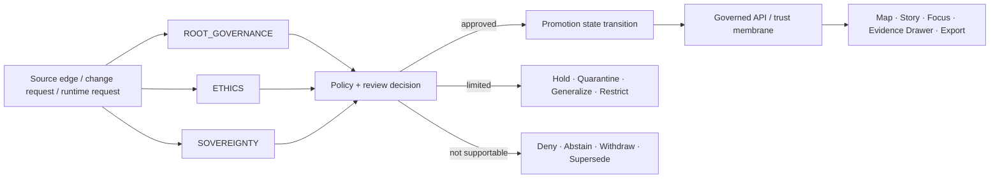

<!-- [KFM_META_BLOCK_V2]
doc_id: kfm://doc/NEEDS_VERIFICATION_UUID
title: Kansas Frontier Matrix — Governance
type: standard
version: v1
status: draft
owners: NEEDS VERIFICATION
created: YYYY-MM-DD
updated: YYYY-MM-DD
policy_label: NEEDS VERIFICATION
related: [./ROOT_GOVERNANCE.md, ./ETHICS.md, ./SOVEREIGNTY.md]
tags: [kfm, governance]
notes: [Repo-ready draft grounded in current KFM doctrine corpus; placeholder fields retained where live repo verification was not available in-session.]
[/KFM_META_BLOCK_V2] -->

# Kansas Frontier Matrix — Governance

Directory index for the policy, review, sensitivity, and publication rules that keep KFM evidence-governed.

> **Status:** Draft / needs repo verification  
> **Owners:** NEEDS VERIFICATION  
>       
> **Quick jump:** [Scope](#scope) · [Verification posture](#verification-posture) · [Repo fit](#repo-fit) · [Inputs](#inputs) · [Exclusions](#exclusions) · [Directory tree](#directory-tree) · [Quickstart](#quickstart) · [Usage](#usage) · [Governance flow](#governance-flow) · [Governance surfaces](#governance-surfaces) · [Change matrix](#change-matrix) · [Definition of done](#definition-of-done) · [FAQ](#faq) · [Appendix](#appendix)

> [!IMPORTANT]
> This README is written from the strongest evidence available in the current session: the March 2026 KFM doctrine manuals and a later repo-grounded audit. Core governance concepts are well supported. Live repo topology, owners, exact neighboring files, and active automation still need workspace verification before merge.

## Scope

This directory defines how KFM governs truth, review, rights, sensitivity, publication, and correction. It is where maintainers should look first when a change could alter public claims, release state, locational exposure, Focus behavior, Evidence Drawer obligations, review authority, or who is allowed to approve what.

KFM governance is deliberately broader than “security settings” and narrower than vague project values. Here, governance means the operational rules that keep public and role-limited surfaces downstream of evidence, policy, review, and release state.

Because KFM treats documentation as part of the production surface, behavior-significant governance changes should move with related docs, contracts, fixtures, tests, and runbooks rather than lag behind them.

> [!WARNING]
> Derived layers, tiles, graphs, search indexes, summaries, scenes, exports, and AI outputs are not authoritative by default. Governance exists to keep them downstream of the canonical truth path and the trust membrane.

## Verification posture

| Label | Meaning in this README |
|---|---|
| **CONFIRMED** | Repeatedly supported by the current KFM doctrine corpus. |
| **PROPOSED** | A repo-ready packaging or wording choice that fits the doctrine, but was not directly proven in mounted implementation. |
| **NEEDS VERIFICATION** | Live repo facts not directly inspectable in-session, including owners, exact file presence, directory neighbors, and active enforcement wiring. |

> [!NOTE]
> When precision matters in this directory, keep uncertainty visible. Do not smooth **PROPOSED** or **NEEDS VERIFICATION** material into implementation fact.

## Repo fit

| Item | Value |
|---|---|
| Directory path | `docs/governance/` |
| This file | `docs/governance/README.md` |
| Upstream | [Docs index][docs-root] *(NEEDS VERIFICATION in mounted repo)* |
| Primary downstream docs | [ROOT_GOVERNANCE.md][root-governance] · [ETHICS.md][ethics] · [SOVEREIGNTY.md][sovereignty] |
| Governs | Review triggers, publication constraints, rights/sensitivity handling, negative outcomes, correction posture, and trust-visible policy expectations |
| Does not replace | Machine-readable contracts, policy bundles, fixtures, tests, or subsystem-specific runbooks |

## Inputs

Accepted inputs here include:

- core governance law and directory-level navigation
- review triggers and approval boundaries
- ethics, public-consequence, and behavioral guardrails
- sovereignty, CARE, and exact-location exposure rules
- publication blockers, correction rules, and withdrawal or supersession posture
- cross-links to adjacent runtime, verification, delivery, and security doctrine where governance crosses subsystem boundaries

## Exclusions

This directory should not become a dumping ground for everything “important.”

- Dataset-specific registries, source inventories, and analysis methods belong in domain or data docs.
- Security implementation detail, supply-chain hardening, and threat-specific runbooks belong in security docs or subsystem runbooks.
- OpenAPI schemas, JSON Schemas, policy bundles, fixtures, and automated tests belong in their machine-readable homes.
- Exploratory notes, ungated research, and draft pattern experiments belong in research or draft directories, not here as governing law.

## Directory tree

The current KFM corpus repeatedly points to the following governance set:

```text
docs/governance/
├── README.md              # Directory contract and navigation (target file)
├── ROOT_GOVERNANCE.md     # Core governance law and review triggers
├── ETHICS.md              # Ethical and public-consequence rules
└── SOVEREIGNTY.md         # Rights, sensitivity, and location-exposure handling
```

> [!NOTE]
> The filenames above are corpus-referenced and suitable as the working baseline for this README. Their live presence, along with any additional governance files, still needs mounted repo verification before commit.

## Quickstart

When a change might affect public trust, run this sequence before merge or promotion:

1. Identify the change class: public claim, publication state, sensitive location exposure, runtime answer behavior, review boundary, or correction path.
2. Read [ROOT_GOVERNANCE.md][root-governance] first.
3. Add [ETHICS.md][ethics] when the change affects people, public consequence, persuasive behavior, or how uncertainty is shown.
4. Add [SOVEREIGNTY.md][sovereignty] when the change touches culturally sensitive material, community-linked knowledge, exact locations, archaeology, biodiversity, oral history, or any data that may require redaction or generalization.
5. Decide the allowed outcome before implementation: **publish**, **hold**, **quarantine**, **generalize**, **restrict**, **deny**, **abstain**, **withdraw**, or **supersede**.
6. Update related docs, contracts, fixtures, tests, and runbooks in the same governed change stream.

## Usage

### Start here when…

- a map, dossier, story, export, or Focus surface could present new public claims
- a workflow changes publication, promotion, correction, or withdrawal behavior
- a contributor wants to expose or summarize sensitive or community-linked material
- a derived layer risks being mistaken for authoritative truth
- a review boundary, approver role, or release blocker changes
- a doc proposes policy-significant behavior and needs the governing home

### Escalate immediately when…

- exact locations, geometry, or site descriptions may expose sensitive places
- AI or retrieval behavior could produce uncited, over-scoped, or policy-unsafe answers
- a convenience path bypasses the governed API or hides review state
- a domain doc wants to treat a modeled or summarized product as authoritative without explicit promotion and labeling
- a correction, withdrawal, or supersession path is missing

## Governance flow


```mermaid
flowchart LR
    A[Source edge / change request / runtime request] --> B[ROOT_GOVERNANCE]
    A --> C[ETHICS]
    A --> D[SOVEREIGNTY]

    B --> E[Policy + review decision]
    C --> E
    D --> E

    E -->|approved| F[Promotion state transition]
    F --> G[Governed API / trust membrane]
    G --> H[Map · Story · Focus · Evidence Drawer · Export]

    E -->|limited| I[Hold · Quarantine · Generalize · Restrict]
    E -->|not supportable| J[Deny · Abstain · Withdraw · Supersede]
```

## Governance surfaces

| Surface | Governance must make visible |
|---|---|
| **Map / Map Explorer** | Release state, time scope, source scope, and sensitive-geometry handling |
| **Story / Dossier** | Review state, resolvable citations, correction lineage, and publication posture |
| **Focus Mode** | Cite-or-abstain behavior, bounded scope, finite outcomes, and policy-checked context |
| **Evidence Drawer** | Evidence resolution, version/license visibility, redaction notices, and provenance context |
| **Export / API response** | Rights metadata, redaction or generalization, version/digest references, and correction path |

## Change matrix

| Change type | Start here | Check next | Typical outputs |
|---|---|---|---|
| Public surface behavior (`Map`, `Story`, `Focus`, `Export`) | [ROOT_GOVERNANCE.md][root-governance] | [ETHICS.md][ethics], [SOVEREIGNTY.md][sovereignty] as needed | review boundary, release obligation, visible caveats, correction path |
| Rights, sensitivity, or exact-location exposure | [SOVEREIGNTY.md][sovereignty] | [ETHICS.md][ethics] | redaction/generalization rule, steward review, restricted/public-safe variant |
| Policy or approval-boundary change | [ROOT_GOVERNANCE.md][root-governance] | machine-readable policy/tests *(NEEDS VERIFICATION in live repo)* | approver boundary, blocking condition, recorded rationale |
| AI / runtime trust behavior | [ROOT_GOVERNANCE.md][root-governance] | runtime contract and evaluation docs *(NEEDS VERIFICATION in live repo)* | answer/abstain/deny rules, citation requirements, audit expectations |
| Public-consequence or persuasive UX change | [ETHICS.md][ethics] | [ROOT_GOVERNANCE.md][root-governance] | guardrails, disclosure rules, escalation path |
| Domain material with community-linked knowledge | [SOVEREIGNTY.md][sovereignty] | [ROOT_GOVERNANCE.md][root-governance] | withholding/generalization decision, steward review, publication class |

## Operational outcomes

| Outcome | Use it when | Do not treat it as |
|---|---|---|
| **Publish** | Evidence, policy, review, and release conditions are satisfied | a default entitlement |
| **Hold** | Readiness is incomplete but the item may yet become publishable | failure or indecision |
| **Quarantine** | Intake, rights, or sensitivity is unresolved | a hidden backlog |
| **Generalize** | Exact geometry or locational detail would create exposure | automatic loss of meaning |
| **Restrict** | A steward-capable path is allowed, but public release is not | a temporary UX patch |
| **Deny** | The request or change exceeds policy or allowed scope | a UX annoyance |
| **Abstain** | Runtime answer cannot be supported safely with admissible evidence | poor assistant performance |
| **Withdraw / Supersede** | A published object later proves wrong, unsafe, stale, or over-scoped | reputational damage to be hidden |

## Definition of done

A governance-directory change is ready when:

- [ ] linked governance docs resolve and the directory map is current
- [ ] owners and review boundaries are current or intentionally flagged for follow-up
- [ ] truth posture is explicit where uncertainty matters
- [ ] rights, sensitivity, sovereignty, and exact-location handling are stated where relevant
- [ ] negative outcomes and correction paths are visible, not implied
- [ ] behavior-significant changes update adjacent docs, fixtures, tests, and runbooks together
- [ ] placeholders for `doc_id`, owners, dates, and policy label are retired or intentionally left visible
- [ ] no prose quietly upgrades **PROPOSED** or **NEEDS VERIFICATION** implementation into asserted fact

## FAQ

### Is governance just security?

No. Security is one governed concern, but KFM governance also covers publication state, review authority, rights, sensitivity, locational exposure, correction, and the rule that public claims must remain evidence-linked.

### Why are “deny” and “abstain” treated as healthy outcomes?

Because KFM is designed to fail closed. A system that visibly refuses unsupported or unsafe output is more trustworthy than one that returns plausible-looking claims without admissible support.

### Why keep governance docs separate from contracts and tests?

Because this directory states the governing law and escalation rules. Machine-readable contracts, policy bundles, fixtures, and tests should implement that law in their subsystem homes rather than duplicating it here.

### Why is this README still marked draft?

Because the doctrine is well supported, but the mounted repo was not directly available in-session. Owners, exact neighboring files, and live enforcement wiring still need verification before this document should be treated as published repo fact.

## Appendix

<details>
<summary><strong>Working vocabulary</strong></summary>

| Term | Working meaning in KFM |
|---|---|
| **Truth path** | `Source edge → RAW → WORK / QUARANTINE → PROCESSED → CATALOG / PUBLISHED` |
| **Trust membrane** | The governed boundary that prevents normal clients from reading unpublished or truth-changing internals directly |
| **Authoritative vs derived** | Canonical truth is governance-bearing; derived layers are subordinate unless explicitly promoted |
| **EvidenceRef** | Stable citation token used across the platform |
| **EvidenceBundle** | Governed resolution payload for an `EvidenceRef` |
| **Promotion** | A policy-checked state transition, not a file copy |
| **Correction** | An explicit withdrawal, supersession, or narrowed replacement path |

</details>

<details>
<summary><strong>Review triggers worth keeping visible</strong></summary>

- new public claims or major changes to claim presentation
- new or changed publication classes
- exact-location exposure risk
- changes to review authority or no-self-approve boundaries
- AI/runtime response changes that affect citation, scope, or abstention
- corrections, withdrawals, and supersession rules
- changes that could make docs drift from actual behavior

</details>

<details>
<summary><strong>Open verification items before merge</strong></summary>

- confirm the owner team or named maintainers for this directory
- replace placeholder `doc_id`, `created`, `updated`, and `policy_label` values
- confirm live presence of `ROOT_GOVERNANCE.md`, `ETHICS.md`, and `SOVEREIGNTY.md`
- confirm whether an additional governance file such as `REVIEW_GATES.md` exists and should be linked
- confirm the upstream docs index path used by local README patterns
- confirm where machine-readable policy bundles, fixtures, and tests actually live in the mounted repo

</details>

[Back to top](#kansas-frontier-matrix--governance)

[docs-root]: ../README.md
[root-governance]: ./ROOT_GOVERNANCE.md
[ethics]: ./ETHICS.md
[sovereignty]: ./SOVEREIGNTY.md
