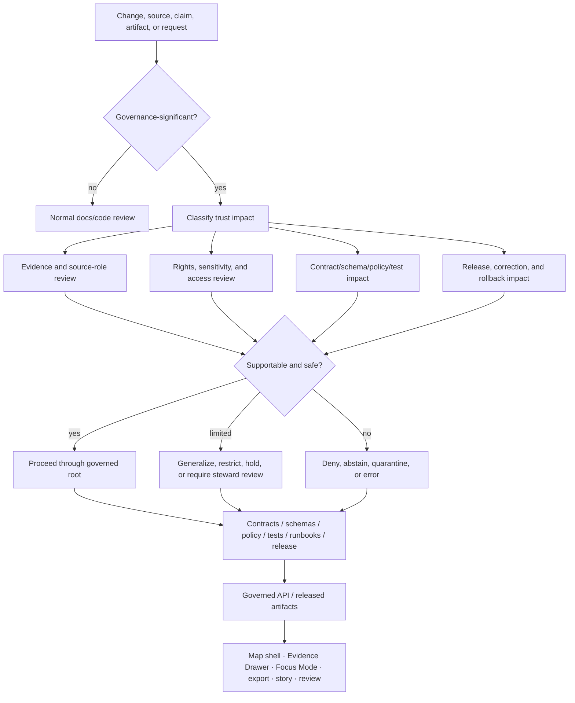

<!-- [KFM_META_BLOCK_V2]
doc_id: kfm://doc/NEEDS_VERIFICATION__docs_governance_readme
title: Governance
repo_path: docs/governance/README.md
type: index
version: v1-draft
status: draft
owners: NEEDS_VERIFICATION
created: NEEDS_VERIFICATION
updated: 2026-05-06
policy_label: NEEDS_VERIFICATION
source_basis:
  - repo:docs/governance/README.md
  - repo:docs/governance/data-use/README.md
  - repo:docs/governance/gates/PROMOTION_CONTRACT.md
  - repo:docs/standards/governance/README.md
  - repo:docs/standards/governance/ROOT_GOVERNANCE.md
  - repo:docs/runbooks/publication.md
  - repo:docs/adr/ADR-0005-promotion-gate.md
  - supplied:Directory Rules.pdf
related:
  - ../README.md
  - ../standards/README.md
  - ../standards/governance/README.md
  - ../standards/governance/ROOT_GOVERNANCE.md
  - ../runbooks/publication.md
  - ../adr/ADR-0005-promotion-gate.md
  - data-use/README.md
  - gates/PROMOTION_CONTRACT.md
  - ../../contracts/README.md
  - ../../schemas/README.md
  - ../../policy/README.md
  - ../../tests/README.md
  - ../../data/README.md
  - ../../release/README.md
  - ../../.github/README.md
  - ../../.github/workflows/README.md
tags:
  - kfm
  - governance
  - evidence
  - policy
  - publication
  - review
  - correction
  - rollback
  - data-use
  - promotion
notes:
  - This README is the human-facing operational governance index for docs/governance/.
  - Root governance law lives in docs/standards/governance/ROOT_GOVERNANCE.md.
  - Current main-branch evidence showed docs/governance/README.md as an empty placeholder; this draft supplies replacement content.
  - Owner, doc_id, created date, policy label, workflow enforcement, branch protection, and active-checkout parity remain NEEDS_VERIFICATION.
[/KFM_META_BLOCK_V2] -->

<a id="top"></a>

# Governance

Operational governance index for keeping KFM evidence-bound, policy-aware, reviewable, publishable, correctable, and reversible.

> [!IMPORTANT]
> **Status:** `draft` / `experimental`  
> **Owners:** `NEEDS_VERIFICATION`  
> **Path:** `docs/governance/README.md`  
> **Truth posture:** `CONFIRMED` repo path and adjacent governance surfaces / `PROPOSED` index content / `NEEDS_VERIFICATION` active enforcement  
> **Repo role:** human-facing governance routing and operational review guidance. Root governance standards remain in [`../standards/governance/`](../standards/governance/README.md); executable policy remains in [`../../policy/`](../../policy/README.md).
>
> 
> 
> 
> 
> 
> 

**Quick jumps:** [Scope](#scope) · [Repo fit](#repo-fit) · [Governance split](#governance-split) · [Current lane inventory](#current-lane-inventory) · [Accepted inputs](#accepted-inputs) · [Exclusions](#exclusions) · [Operating model](#operating-model) · [Review triggers](#review-triggers) · [Change packet](#minimum-governance-change-packet) · [Publication and promotion](#publication-and-promotion) · [Data use](#data-use) · [Verification](#verification-checklist) · [Rollback](#rollback-correction-and-withdrawal) · [FAQ](#faq) · [Open backlog](#open-verification-backlog)

---

## Scope

`docs/governance/` is the human-facing operational governance lane for KFM.

It answers:

> How should contributors, reviewers, stewards, release operators, and maintainers route governance-significant work without weakening KFM’s evidence, policy, review, publication, correction, or rollback membrane?

This lane is intentionally practical. It should help reviewers decide where a governance question belongs, what must be checked, what cannot be published, and which adjacent root owns the stronger machine or procedural artifact.

KFM’s durable public unit of value is the **inspectable claim**: a claim whose evidence, source role, spatial and temporal scope, policy posture, review state, release state, and correction lineage can be inspected. Maps, tiles, dashboards, stories, AI answers, scenes, exports, and summaries are downstream carriers of governed evidence; they are not sovereign truth.

[Back to top](#top)

---

## Repo fit

Directory Rules make `docs/` the human-facing control plane. Domain-specific or machine-specific material should remain under its responsibility root instead of creating new root-level domain folders.

| Item | Value |
|---|---|
| Path | `docs/governance/README.md` |
| Path role | Governance lane index, routing boundary, review checklist, and operational governance map |
| Parent docs index | [`../README.md`](../README.md) |
| Root governance standard | [`../standards/governance/ROOT_GOVERNANCE.md`](../standards/governance/ROOT_GOVERNANCE.md) |
| Governance standards lane | [`../standards/governance/README.md`](../standards/governance/README.md) |
| Data-use child lane | [`data-use/README.md`](data-use/README.md) |
| Promotion contract child lane | [`gates/PROMOTION_CONTRACT.md`](gates/PROMOTION_CONTRACT.md) |
| Publication procedure | [`../runbooks/publication.md`](../runbooks/publication.md) |
| Promotion ADR | [`../adr/ADR-0005-promotion-gate.md`](../adr/ADR-0005-promotion-gate.md) |
| Semantic object lane | [`../../contracts/README.md`](../../contracts/README.md) |
| Machine schema lane | [`../../schemas/README.md`](../../schemas/README.md) |
| Policy lane | [`../../policy/README.md`](../../policy/README.md) |
| Verification lane | [`../../tests/README.md`](../../tests/README.md) |
| Lifecycle data lane | [`../../data/README.md`](../../data/README.md) |
| Release lane | [`../../release/README.md`](../../release/README.md) |
| GitHub gatehouse | [`../../.github/README.md`](../../.github/README.md) and [`../../.github/workflows/README.md`](../../.github/workflows/README.md) |

> [!NOTE]
> Checked-in Markdown can define governance expectations. It does not prove branch protection, required checks, workflow execution, policy-bundle activation, release tooling, or runtime behavior.

[Back to top](#top)

---

## Governance split

`docs/governance/` is not the same lane as `docs/standards/governance/`.

| Surface | Owns | Must not silently own |
|---|---|---|
| `docs/governance/README.md` | Operational routing, review triggers, governance lane map, and contributor guidance | Root governance law, executable policy, schemas, release approval, proof storage |
| `docs/standards/governance/ROOT_GOVERNANCE.md` | Cross-domain governance law and non-negotiable KFM trust rules | Step-by-step procedures, local runbooks, tool commands, policy bundles |
| `docs/governance/data-use/README.md` | Data-use dispositions and response-packet guidance | EvidenceBundles, source registry records, response caches, proof packs |
| `docs/governance/gates/PROMOTION_CONTRACT.md` | Promotion gate contract and gate/artifact expectations | Runtime gate execution proof unless workflows and logs confirm it |
| `docs/runbooks/publication.md` | Release-facing operator procedure | Root governance standard or executable policy |
| `docs/adr/ADR-0005-promotion-gate.md` | Architecture decision for promotion as a governed state transition | Current implementation proof unless validated in the active branch |
| `policy/` | Allow / deny / abstain / obligation logic | Human-only governance prose, contract meaning, source truth |
| `contracts/` | Object meaning, field intent, compatibility, lifecycle semantics | Machine schema authority by directory name alone |
| `schemas/` | Machine-checkable shape | Policy decision authority or source evidence |
| `tests/` | Verification, fixtures, negative-path proof | Governance doctrine or publication approval |
| `data/receipts`, `data/proofs`, `data/catalog`, `data/published` | Process memory, proof objects, discovery/provenance, and released material respectively | Each other’s authority |

### Working rule

Use this README when the question is about **where governance work belongs** or **what a reviewer must remember**. Use the adjacent responsibility root when the question is about **how the rule is enforced, validated, stored, released, or corrected**.

[Back to top](#top)

---

## Current lane inventory

Current repo evidence surfaced these governance-lane files on `main`.

```text
docs/governance/
├── README.md
├── data-use/
│   └── README.md
└── gates/
    └── PROMOTION_CONTRACT.md
```

| Path | Current role | Safe reading |
|---|---|---|
| `README.md` | Governance lane index | Existing file was a placeholder; this draft supplies the intended routing surface. |
| `data-use/README.md` | Data-use governance and response-packet guidance | Confirmed child governance surface; enforcement remains separate from docs. |
| `gates/PROMOTION_CONTRACT.md` | Promotion gate artifact/policy contract | Confirmed child governance surface; command/workflow execution still needs active evidence. |

> [!CAUTION]
> Do not infer hidden governance files from the presence of this directory. Inventory the active checkout before adding links, owners, or claims about enforcement.

[Back to top](#top)

---

## Accepted inputs

Place material under `docs/governance/` only when it is human-facing governance guidance that benefits multiple KFM lanes or trust-bearing surfaces.

| Accepted input | Belongs here when | Better companion |
|---|---|---|
| Governance lane routing | It clarifies where a governance question belongs | This README |
| Data-use review guidance | It helps decide use, reuse, export, citation, screenshot, dashboard, story, Focus, or API response posture | [`data-use/README.md`](data-use/README.md) |
| Promotion gate explanation | It explains gate expectations, fail-closed semantics, or review artifacts | [`gates/PROMOTION_CONTRACT.md`](gates/PROMOTION_CONTRACT.md), ADR, schemas, tests |
| Review trigger matrices | They help reviewers classify governance-significant changes | This README or a reviewed child page |
| Correction / withdrawal / supersession guidance | It describes human review posture and public trust obligations | Runbooks, release/correction records, proof objects |
| Sensitivity and rights routing | It routes sensitive cases to policy, stewards, sovereignty, FAIR+CARE, source registry, or domain lanes | Policy, standards, source registry, domain docs |
| Governance checklists | They keep contributors from bypassing evidence, policy, review, release, or rollback | This README, runbooks, PR templates |
| Human-readable response templates | They are safe, minimized, and not machine schema substitutes | Data-use child lane + schemas/tests if executable |

[Back to top](#top)

---

## Exclusions

Do **not** put these in `docs/governance/` unless the content is only a short routing note.

| Does not belong here | Use instead | Why |
|---|---|---|
| Cross-domain root governance law | [`../standards/governance/ROOT_GOVERNANCE.md`](../standards/governance/ROOT_GOVERNANCE.md) | Avoid competing standards authority. |
| Rego, OPA, Conftest, deny logic, or executable obligations | [`../../policy/`](../../policy/) | Policy decisions need executable/testable homes. |
| JSON Schema, OpenAPI, DTOs, or runtime envelope shape | [`../../schemas/`](../../schemas/) and [`../../contracts/`](../../contracts/) | Machine contracts need versioned validation and fixtures. |
| Valid/invalid fixtures and golden objects | [`../../tests/`](../../tests/) or `fixtures/` | Verification belongs in proof/test lanes. |
| Workflow YAML or required-check configuration | [`../../.github/workflows/`](../../.github/workflows/) | Workflow claims need executable automation and platform verification. |
| Raw, work, quarantine, processed, catalog, receipt, proof, or published data | [`../../data/`](../../data/) | Lifecycle data is not documentation. |
| Release manifests, release decisions, rollback cards, or correction notices | [`../../release/`](../../release/) or data proof/release lanes | Release objects carry stronger trust obligations than prose. |
| Source descriptor instances or source-rights records | source registry under `data/registry/` or repo-native registry home | Source records must be structured and reviewable. |
| Domain-specific governance exceptions | `docs/domains/<lane>/`, `policy/domains/`, `schemas/contracts/v1/domains/`, or equivalent verified homes | Domain burden should stay with lane stewards. |
| Secrets, credentials, private URLs, exact sensitive coordinates, or private-person details | secret manager, restricted steward path, quarantine, or redacted mirror | Governance docs should remain safe to review. |
| AI-generated conclusions without evidence closure | governed runtime envelopes with citation validation | Generated language is interpretive only. |

[Back to top](#top)

---

## Operating model

KFM governance protects the transition from source material to public or restricted trust-bearing surfaces.

```text
SOURCE EDGE -> RAW -> WORK / QUARANTINE -> PROCESSED -> CATALOG / TRIPLET -> PUBLISHED
```


```mermaid
flowchart TD
  A[Change, source, claim, artifact, or request] --> B{Governance-significant?}
  B -->|no| C[Normal docs/code review]
  B -->|yes| D[Classify trust impact]

  D --> E[Evidence and source-role review]
  D --> F[Rights, sensitivity, and access review]
  D --> G[Contract/schema/policy/test impact]
  D --> H[Release, correction, and rollback impact]

  E --> I{Supportable and safe?}
  F --> I
  G --> I
  H --> I

  I -->|yes| J[Proceed through governed root]
  I -->|limited| K[Generalize, restrict, hold, or require steward review]
  I -->|no| L[Deny, abstain, quarantine, or error]

  J --> M[Contracts / schemas / policy / tests / runbooks / release]
  K --> M
  L --> M

  M --> N[Governed API / released artifacts]
  N --> O[Map shell · Evidence Drawer · Focus Mode · export · story · review]
```

### Runtime and publication outcomes

Runtime claim surfaces should stay finite:

```text
ANSWER / ABSTAIN / DENY / ERROR
```

Publication decisions should stay finite and auditable. ADR-0005 currently frames the Promotion Gate around:

```text
PROMOTE / ABSTAIN / DENY / ERROR
```

Display states such as `HOLD`, `NEEDS_REVIEW`, `ALLOW_WITH_LIMITS`, `WITHDRAWN`, and `SUPERSEDED` may be useful in human workflows, but they should map to repo-native machine contracts before they become executable.

[Back to top](#top)

---

## Review triggers

Treat a change as governance-significant when it can alter evidence meaning, public exposure, review state, release state, or correction lineage.

| Trigger | Why it matters | Route through |
|---|---|---|
| Public or semi-public claim changes | Users may rely on changed meaning | EvidenceBundle, policy, release, correction |
| Source role or source authority changes | A contextual source may be mistaken for authoritative support | Source registry, contracts, policy, domain steward |
| Rights, license, citation, or attribution changes | Use may become illegal, misleading, or noncompliant | Policy, source registry, release review |
| Sensitivity or exact-location exposure changes | May expose archaeology, rare species, infrastructure, cultural, private, or living-person risk | Policy, domain steward, sovereignty/FAIR+CARE standards, generalization/redaction |
| Data-use request, export, screenshot, story, dashboard, or Focus answer | Reuse may strip trust context or widen audience | [`data-use/README.md`](data-use/README.md), EvidenceBundle, release state |
| Promotion, publication, withdrawal, rollback, or supersession | Changes outward trust state | [`gates/PROMOTION_CONTRACT.md`](gates/PROMOTION_CONTRACT.md), ADR, runbook, release objects |
| Runtime answer behavior changes | Can turn unsupported text into apparent truth | RuntimeResponseEnvelope, citation validation, policy, tests |
| Map layer, tile, scene, graph, vector index, or search projection looks authoritative | Derived carriers may be mistaken for root truth | Layer manifest, catalog/proof, Evidence Drawer, release state |
| Review ownership or approval boundary changes | May collapse separation of duty | CODEOWNERS, PR template, review records, policy gate |
| Workflow or validator claims enforcement | Markdown may overstate automation | Workflow YAML, tool output, CI logs, platform settings |
| Documentation changes that alter governance meaning | Docs are part of the working system | Adjacent docs, ADR, policy/contracts/schemas/tests as needed |

> [!TIP]
> When unsure, route the change as governance-significant and downgrade later if evidence proves the risk is only editorial.

[Back to top](#top)

---

## Minimum governance change packet

A governance-significant PR or release packet should make these items easy to inspect.

| Item | Expected content |
|---|---|
| Change class | claim, source, data-use, promotion, policy, schema, release, correction, runtime, UI, workflow, or docs |
| Affected surfaces | docs, source registry, contracts, schemas, policy, tests, data lifecycle, release, API, UI, Focus, export |
| Evidence basis | source refs, EvidenceBundle refs, repository evidence, test fixtures, or explicit `ABSTAIN`/`NEEDS_VERIFICATION` |
| Rights and sensitivity | license/source terms, public-safe posture, redaction/generalization/access tier, unknowns |
| Review state | who reviewed, who still needs to review, and what owner is unknown |
| Release state | candidate, published, restricted, withdrawn, superseded, or not release-bearing |
| Machine impacts | contracts, schemas, validators, policy, fixtures, workflows, artifacts |
| Negative path | deny, abstain, error, quarantine, hold, or restricted behavior |
| Correction path | rollback target, CorrectionNotice, supersession, withdrawal, or reason not applicable |
| Truth labels | CONFIRMED / INFERRED / PROPOSED / UNKNOWN / NEEDS_VERIFICATION where confidence matters |

### Definition of done for governance-significant changes

A change is not ready when it only sounds right. It is ready when:

1. the affected trust state is named;
2. direct evidence supports material implementation claims;
3. policy, contract, schema, fixture, validator, workflow, release, and doc impacts are updated or explicitly declared unchanged;
4. the negative path is visible and safe;
5. correction or rollback remains possible;
6. unresolved facts remain labeled instead of being hidden.

[Back to top](#top)

---

## Publication and promotion

Publication is a governed state transition, not a file move, map toggle, workflow pass, or generated answer.

Use this lane to route publication questions, but use the stronger adjacent surfaces for execution:

| Need | Primary surface |
|---|---|
| Promotion doctrine and ADR rationale | [`../adr/ADR-0005-promotion-gate.md`](../adr/ADR-0005-promotion-gate.md) |
| Promotion artifact/gate contract | [`gates/PROMOTION_CONTRACT.md`](gates/PROMOTION_CONTRACT.md) |
| Operator procedure for release | [`../runbooks/publication.md`](../runbooks/publication.md) |
| Promotion decision schema | `schemas/contracts/v1/...` after schema-home verification |
| Policy denial/obligations | `policy/` |
| Gate fixtures and negative tests | `tests/` / `fixtures/` |
| Release manifests and rollback cards | `release/` and release/proof data lanes |
| Runtime display of release state | governed API, Evidence Drawer, Focus Mode, map shell |

Minimum promotion posture:

- EvidenceRefs resolve to EvidenceBundles before consequential outward claims.
- Unknown rights or sensitivity fail closed.
- Receipts, proofs, catalogs, and publication stay separate.
- Release manifests name artifacts, digests, scope, audience, rollback target, and correction route.
- UI and AI consume released, policy-safe evidence; they do not decide publication.

[Back to top](#top)

---

## Data use

Use [`data-use/README.md`](data-use/README.md) when a maintainer, reviewer, partner, user, export, story, map, dashboard, screenshot, or Focus Mode surface asks whether KFM material may be used.

Data-use review should answer:

| Question | Why it matters |
|---|---|
| What is being used? | Claim, evidence, source, map render, export, screenshot, answer, dashboard, story, or derived artifact. |
| Who will see it? | Public, restricted, steward, internal, partner, classroom, research, or unknown audience. |
| What supports it? | EvidenceRef, EvidenceBundle, source descriptor, catalog/proof/release references. |
| What is the source role? | Official observation, regulatory context, modeled derivative, documentary evidence, community contribution, or other role. |
| What are the rights and terms? | License, attribution, embargo, source terms, redistribution permission, or unknown. |
| What sensitivity exists? | Exact location, cultural, archaeological, rare species, infrastructure, living-person, DNA, private-land, title, or other risk. |
| What is the disposition? | `ALLOW`, `ALLOW_WITH_LIMITS`, `DENY`, `ABSTAIN`, `NEEDS_REVIEW`, `ERROR`, `WITHDRAWN`, or `SUPERSEDED`. |
| How is it corrected? | Correction notice, withdrawal, supersession, rollback target, or explicit not-release-bearing note. |

> [!WARNING]
> A visually correct map, compelling model output, or clean dashboard number is not enough. Use must remain traceable to evidence, policy, review, release state, and correction lineage.

[Back to top](#top)

---

## Verification checklist

Run these checks from the repository root before treating this README as current for an active branch.

```bash
# Confirm current branch and worktree state.
git status --short
git branch --show-current

# Inventory this lane.
find docs/governance -maxdepth 4 -type f | sort

# Inspect governance neighbors.
sed -n '1,260p' docs/governance/README.md
sed -n '1,260p' docs/governance/data-use/README.md
sed -n '1,220p' docs/governance/gates/PROMOTION_CONTRACT.md
sed -n '1,260p' docs/standards/governance/README.md
sed -n '1,320p' docs/standards/governance/ROOT_GOVERNANCE.md
sed -n '1,260p' docs/runbooks/publication.md
sed -n '1,260p' docs/adr/ADR-0005-promotion-gate.md

# Check routing into responsibility roots.
sed -n '1,240p' contracts/README.md
sed -n '1,240p' schemas/README.md
sed -n '1,240p' policy/README.md
sed -n '1,240p' tests/README.md
sed -n '1,240p' release/README.md

# Search for duplicate governance authority and stale aliases.
git grep -nE 'ROOT_GOVERNANCE|PROMOTION_CONTRACT|Publication Runbook|Data Use Governance|Promotion Gate|EvidenceBundle|PromotionDecision|ReleaseManifest' -- \
  docs contracts schemas policy tests data release .github tools 2>/dev/null
```

### README merge checklist

- [ ] `KFM_META_BLOCK_V2` values are verified or intentionally left as `NEEDS_VERIFICATION`.
- [ ] Relative links resolve from `docs/governance/`.
- [ ] This README does not duplicate `ROOT_GOVERNANCE.md` as a second governance standard.
- [ ] Data-use and promotion content points to child pages instead of being copied here.
- [ ] Executable policy, schemas, fixtures, workflows, and release objects remain in their responsibility roots.
- [ ] No active enforcement, branch protection, workflow, release, or runtime claim is made without direct evidence.
- [ ] Sensitive data, exact locations, secrets, and raw request payloads are excluded.
- [ ] Open verification items remain visible.

[Back to top](#top)

---

## Rollback, correction, and withdrawal

Rollback is required if this README or a child governance page:

- creates a parallel authority beside standards, policy, contracts, schemas, tests, release, or data lifecycle roots;
- implies public publication without PromotionDecision / ReleaseManifest / proof / review support;
- weakens cite-or-abstain or EvidenceBundle closure;
- routes public clients to RAW, WORK, QUARANTINE, internal stores, proof-only stores, or model runtimes;
- hides sensitivity, rights, sovereignty, exact-location, living-person, DNA, archaeology, rare-species, infrastructure, or private-land risk;
- claims enforcement not supported by direct workflow, test, platform, or runtime evidence.

Minimum rollback action:

1. Revert or supersede the incorrect governance text.
2. Update inbound links and navigation.
3. Record the reason in the repo-native correction, drift, ADR, or review register if available.
4. If outward users relied on the old text, publish a CorrectionNotice or release/correction equivalent.
5. Re-run link and governance checks.
6. Confirm downstream policy, schema, contract, fixture, workflow, release, and UI surfaces did not keep the bad assumption.

[Back to top](#top)

---

## FAQ

### Is this README the root governance standard?

No. This README is the operational governance index. Root governance law belongs in [`../standards/governance/ROOT_GOVERNANCE.md`](../standards/governance/ROOT_GOVERNANCE.md).

### Can this README approve publication?

No. It can route publication work and define review expectations. Publication still requires evidence, validation, policy, review, proof, release, correction, and rollback support appropriate to the release.

### Can a child governance page be executable authority?

Only when backed by the proper machine surfaces. A Markdown page can define expectations; executable authority needs schemas, policy, validators, fixtures, workflows, release artifacts, and/or runtime proof.

### Where should data-use decisions live?

Start with [`data-use/README.md`](data-use/README.md) for human guidance. Store EvidenceBundles, receipts, proof packs, release manifests, schemas, policies, and fixtures in their responsibility roots.

### What should happen when rights or sensitivity are unclear?

Fail closed: `DENY`, `ABSTAIN`, `NEEDS_REVIEW`, quarantine, redaction, generalization, staged access, delayed publication, or withdrawal depending on the context and active policy.

### Can AI or Focus Mode answer governance questions?

Only as an evidence-subordinate interface. It must resolve admissible evidence, preserve finite outcomes, cite support where needed, and never decide rights, sensitivity, source authority, review state, or publication state on its own.

[Back to top](#top)

---

## Open verification backlog

| Item | Why it matters | Status |
|---|---|---|
| Confirm `doc_id`, `created`, `owners`, and `policy_label` for this README | Required for stable KFM metadata | `NEEDS_VERIFICATION` |
| Confirm lane-specific CODEOWNERS coverage | Review routing should not rely on a badge or inherited guess | `NEEDS_VERIFICATION` |
| Confirm active-checkout inventory for `docs/governance/` | Prevents public-main or generated-doc drift | `NEEDS_VERIFICATION` |
| Confirm whether child folders beyond `data-use/` and `gates/` exist | Avoids broken links and hidden governance lanes | `NEEDS_VERIFICATION` |
| Confirm `PROMOTION_CONTRACT.md` machine-readable companion path | File states a machine-readable version exists; active path must be verified | `NEEDS_VERIFICATION` |
| Confirm `.github/workflows/promotion.yml` or equivalent workflow | Gate contract mentions workflow wiring; execution requires direct workflow evidence | `NEEDS_VERIFICATION` |
| Confirm schema-home decision for promotion and data-use packets | Avoids contracts/schemas authority drift | `NEEDS_VERIFICATION` |
| Confirm policy/test coverage for promotion and data-use outcomes | Governance docs should not outrun fail-closed tests | `NEEDS_VERIFICATION` |
| Confirm branch protection and required checks | Checked-in files do not prove platform enforcement | `NEEDS_VERIFICATION` |
| Confirm Evidence Drawer / Focus Mode runtime proof | Doctrine exists; payload and runtime tests must be inspected separately | `NEEDS_VERIFICATION` |

[Back to top](#top)

---

## Appendix: truth labels

<details>
<summary>Open truth-label glossary</summary>

| Label | Meaning in this README |
|---|---|
| `CONFIRMED` | Verified from current repo evidence, supplied KFM doctrine, inspected artifacts, tests, workflow outputs, logs, or generated proof in the current evidence layer. |
| `INFERRED` | Conservatively implied by repeated doctrine or adjacent checked files, but not direct implementation proof. |
| `PROPOSED` | Recommended design, placement, workflow, object, or documentation content not yet verified as implemented. |
| `UNKNOWN` | Not verified strongly enough to act as fact. |
| `NEEDS_VERIFICATION` | Checkable item that must be confirmed before stronger claims, release, enforcement, or publication. |
| `CONFLICTED` | Evidence or placement implies competing authorities that must not be smoothed away. |
| `DENY` | System or reviewer outcome blocking an action under policy, rights, sensitivity, source, or evidence rules. |
| `ABSTAIN` | System or reviewer outcome refusing to answer or promote because support is insufficient. |
| `ERROR` | Tooling, resolver, schema, runtime, or process failure prevented a safe decision. |

</details>

[Back to top](#top)

