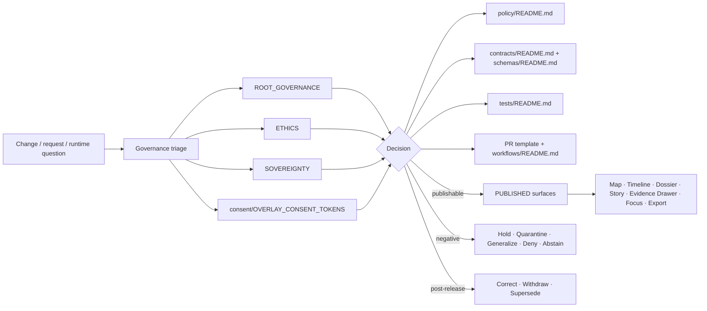

<!-- [KFM_META_BLOCK_V2]
doc_id: kfm://doc/NEEDS_VERIFICATION_UUID
title: Kansas Frontier Matrix — Governance
type: standard
version: v1
status: draft
owners: @bartytime4life
created: YYYY-MM-DD
updated: YYYY-MM-DD
policy_label: NEEDS_VERIFICATION
related: [../README.md, ../../README.md, ./ROOT_GOVERNANCE.md, ./ETHICS.md, ./SOVEREIGNTY.md, ./consent/OVERLAY_CONSENT_TOKENS.md, ../../policy/README.md, ../../contracts/README.md, ../../schemas/README.md, ../../tests/README.md]
tags: [kfm, governance]
notes: [Owner is confirmed via public CODEOWNERS coverage for /docs/; doc_id, dates, and policy_label still need branch-level verification.]
[/KFM_META_BLOCK_V2] -->

# Kansas Frontier Matrix — Governance

*Directory index for the policy, review, consent, sensitivity, and publication rules that keep KFM evidence-governed.*

> **Status:** experimental  
> **Owners:** `@bartytime4life` *(confirmed public `/.github/CODEOWNERS` coverage for `/docs/`; no narrower governance-only owner rule is visible on public `main`)*  
>         
> **Quick jump:** [Scope](#scope) · [Verification posture](#verification-posture) · [Repo fit](#repo-fit) · [Governance surface](#current-public-governance-surface) · [Inputs](#inputs) · [Exclusions](#exclusions) · [Directory tree](#directory-tree) · [Quickstart](#quickstart) · [Usage](#usage) · [Diagram](#diagram) · [Tables](#tables) · [Task list](#task-list--definition-of-done) · [FAQ](#faq) · [Appendix](#appendix)  
> **Repo fit:** `docs/governance/README.md` · upstream [`../README.md`](../README.md) · core law [`./ROOT_GOVERNANCE.md`](./ROOT_GOVERNANCE.md) · companion burdens [`./ETHICS.md`](./ETHICS.md), [`./SOVEREIGNTY.md`](./SOVEREIGNTY.md) · consent sublane [`./consent/OVERLAY_CONSENT_TOKENS.md`](./consent/OVERLAY_CONSENT_TOKENS.md)

> [!IMPORTANT]
> This README is a **directory contract and routing surface**, not the whole law set.
>
> Public `main` now confirms the path and its core companion files. Platform-only settings—required checks, rulesets, environment approvals, app permissions, OIDC wiring, and any non-public workflow behavior—still need direct branch/platform verification before merge.

## Scope

This directory is the human navigation layer for KFM governance.

Use it to find the rules that decide whether a claim, layer, dossier, story, export, overlay, or runtime answer is allowed to move forward, must be generalized, needs steward review, or must fail closed.

In KFM, governance is not decorative values language layered on top of implementation. It is a load-bearing dependency: truth path before delivery, policy before publication, review before trust, correction before silent replacement.

## Verification posture

| Label | Meaning here |
|---|---|
| **CONFIRMED** | Directly supported by current public `main` or repeated KFM doctrine already surfaced in checked-in docs. |
| **INFERRED** | Conservative interpretation that follows from confirmed repo evidence or repeated doctrine, but is not directly proven as detailed implementation behavior. |
| **PROPOSED** | Repo-native packaging, wording, or routing improvement added in this revision. |
| **UNKNOWN** | Not established strongly enough to present as current branch, platform, or runtime fact. |
| **NEEDS VERIFICATION** | A value or behavior that should be checked on the exact working branch, commit, or GitHub settings before merge. |

> [!CAUTION]
> Do not smooth **INFERRED**, **PROPOSED**, **UNKNOWN**, or **NEEDS VERIFICATION** material into implementation fact. KFM’s doctrine repeatedly treats polished overclaiming as a trust failure, not a documentation style choice.

## Repo fit

| Item | Value |
|---|---|
| Path | `docs/governance/README.md` |
| Path status | **CONFIRMED** on public `main`; working-branch parity still needs verification |
| Role in repo | Directory index for governance law, review routing, rights/sensitivity handling, consent-aware release boundaries, and correction posture |
| Upstream | [`../README.md`](../README.md) · [`../../README.md`](../../README.md) |
| Primary downstream companions | [`./ROOT_GOVERNANCE.md`](./ROOT_GOVERNANCE.md) · [`./ETHICS.md`](./ETHICS.md) · [`./SOVEREIGNTY.md`](./SOVEREIGNTY.md) · [`./consent/OVERLAY_CONSENT_TOKENS.md`](./consent/OVERLAY_CONSENT_TOKENS.md) |
| Adjacent machine-checkable surfaces | [`../../policy/README.md`](../../policy/README.md) · [`../../contracts/README.md`](../../contracts/README.md) · [`../../schemas/README.md`](../../schemas/README.md) · [`../../tests/README.md`](../../tests/README.md) · [`../../.github/PULL_REQUEST_TEMPLATE.md`](../../.github/PULL_REQUEST_TEMPLATE.md) · [`../../.github/workflows/README.md`](../../.github/workflows/README.md) |
| Ownership signal | Public `/.github/CODEOWNERS` routes both global fallback and `/docs/` coverage to `@bartytime4life` |
| Working boundary | Use this README to route decisions; keep executable enforcement in policy, contracts, schemas, tests, and workflow-bearing surfaces |

## Current public governance surface

| Surface | Current public `main` state | Role |
|---|---|---|
| [`README.md`](./README.md) | Present | Directory contract and entrypoint |
| [`ROOT_GOVERNANCE.md`](./ROOT_GOVERNANCE.md) | Present | Root governance law and review triggers |
| [`ETHICS.md`](./ETHICS.md) | Present | Ethical and public-consequence guardrails |
| [`SOVEREIGNTY.md`](./SOVEREIGNTY.md) | Present | Rights, sensitivity, precision, and steward obligations |
| [`consent/OVERLAY_CONSENT_TOKENS.md`](./consent/OVERLAY_CONSENT_TOKENS.md) | Present | Overlay consent, revocation, obligations, and receipt rules |
| [`consent/README.md`](./consent/README.md) | Present but currently empty on public `main` | Placeholder/index slot for a consent sublane that is not yet documented here |

> [!NOTE]
> The consent sublane is now part of the visible governance tree. Treat it as real path inventory, not as a speculative appendix. What remains unproven is how widely that sublane is already wired into branch-level enforcement and release flows.

## Inputs

Accepted material for this directory includes:

- governance law and directory-level navigation
- review triggers and escalation rules
- ethics, public-consequence, and trust-visible UX obligations
- sovereignty, rights, sensitivity, exact-location, and stewardship rules
- consent, revocation, and obligation-carrying release boundaries when overlays or limited-visibility surfaces are involved
- publication blockers, withdrawal, supersession, and correction posture
- links to adjacent contracts, schemas, policy bundles, tests, runbooks, and review surfaces when governance changes imply machine-checkable consequences

## Exclusions

This directory should not absorb everything important.

| Keep out of this README | Why it stays out | Where it goes instead |
|---|---|---|
| Machine-readable policy bundles, reason-code registries, and obligation registries | Governance prose should not silently replace executable gates. | [`../../policy/`](../../policy/) |
| Schemas, fixtures, and validator expectations | Trust-bearing structures need machine-checkable homes. | [`../../contracts/`](../../contracts/) · [`../../schemas/`](../../schemas/) · [`../../tests/`](../../tests/) |
| Runtime code, worker logic, or service behavior | This is a navigation surface, not the runtime. | Owning code surfaces under `apps/`, `packages/`, `infra/`, or `pipelines/` |
| Subsystem runbooks | Operational instructions should stay with runbooks. | [`../runbooks/`](../runbooks/) and owning ops surfaces |
| Exploratory notes or ungated ideas | Governance law should not be diluted by draft experimentation. | Research, draft, or planning surfaces |
| Platform-only certainty | Public docs cannot prove protected branch rules, required checks, environment approvals, or non-public app permissions. | Direct GitHub/project verification on the active branch |

## Directory tree

```text
docs/governance/
├── README.md
├── ROOT_GOVERNANCE.md
├── ETHICS.md
├── SOVEREIGNTY.md
└── consent/
    ├── README.md
    └── OVERLAY_CONSENT_TOKENS.md
```

> [!NOTE]
> `consent/README.md` is currently present but empty on public `main`. Until it gains real content, route readers directly to [`./consent/OVERLAY_CONSENT_TOKENS.md`](./consent/OVERLAY_CONSENT_TOKENS.md) when consent scope, revocation, or overlay publication rights are material.

## Quickstart

### Re-verify the branch before editing

```bash
sed -n '1,220p' docs/governance/README.md
find docs/governance -maxdepth 3 -type f | sort

sed -n '1,220p' docs/governance/ROOT_GOVERNANCE.md
sed -n '1,220p' docs/governance/ETHICS.md
sed -n '1,220p' docs/governance/SOVEREIGNTY.md
sed -n '1,220p' docs/governance/consent/OVERLAY_CONSENT_TOKENS.md

sed -n '1,200p' .github/CODEOWNERS
sed -n '1,220p' .github/PULL_REQUEST_TEMPLATE.md
sed -n '1,220p' .github/workflows/README.md
```

### Triage sequence

1. Classify the change: admission, review, promotion, delivery, runtime behavior, consent/revocation, or correction.
2. Read [`./ROOT_GOVERNANCE.md`](./ROOT_GOVERNANCE.md) first.
3. Add [`./ETHICS.md`](./ETHICS.md) when the change affects people, persuasion, omission risk, public framing, uncertainty cues, or ranking/scoring behavior.
4. Add [`./SOVEREIGNTY.md`](./SOVEREIGNTY.md) when the change touches rights, repatriation, culturally sensitive material, rare-species data, archaeology, exact locations, or steward-restricted knowledge.
5. Add [`./consent/OVERLAY_CONSENT_TOKENS.md`](./consent/OVERLAY_CONSENT_TOKENS.md) when overlay visibility, short-lived access, revocation, or use-scoped permissions are part of the decision.
6. Re-check adjacent machine surfaces: [`../../policy/README.md`](../../policy/README.md), [`../../contracts/README.md`](../../contracts/README.md), [`../../schemas/README.md`](../../schemas/README.md), [`../../tests/README.md`](../../tests/README.md), [`../../.github/PULL_REQUEST_TEMPLATE.md`](../../.github/PULL_REQUEST_TEMPLATE.md), and [`../../.github/workflows/README.md`](../../.github/workflows/README.md).
7. Keep the allowed outcome explicit: **allow/publish**, **review-required**, **hold**, **quarantine**, **generalize**, **deny**, **abstain**, **withdraw**, **supersede**, or **correct**.
8. Update docs, examples, fixtures, tests, and runbooks in the same governed change stream when behavior shifts.

## Usage

### Read this lane in this order

| Read this file | When it should lead |
|---|---|
| [`./ROOT_GOVERNANCE.md`](./ROOT_GOVERNANCE.md) | Always start here for base law, review triggers, and permitted outcomes |
| [`./ETHICS.md`](./ETHICS.md) | Public consequence, framing, omission risk, trust-visible UX, ranking, or AI-mediated explanation |
| [`./SOVEREIGNTY.md`](./SOVEREIGNTY.md) | Rights, sensitivity, exact-location, steward obligations, culturally specific release risk |
| [`./consent/OVERLAY_CONSENT_TOKENS.md`](./consent/OVERLAY_CONSENT_TOKENS.md) | Overlay-specific consent, revocation, obligation enforcement, and receipt-bearing release control |

### Start here when…

- a map, timeline, dossier, story, export, or Focus/assistant answer could present a new public claim
- a change affects release state, review state, correction state, or freshness meaning
- a source or derived layer risks being mistaken for authoritative truth
- an overlay or limited-visibility surface needs consent, revocation, or obligation-bearing release control
- a contributor wants to change how `ANSWER`, `ABSTAIN`, `DENY`, or `ERROR` become visible on user-facing surfaces

### Escalate immediately when…

- exact coordinates, geometry, or descriptive detail could expose sensitive places, species, people, sites, or community-held knowledge
- runtime behavior could return uncited or over-scoped prose instead of finite governed outcomes
- a convenience path bypasses governed APIs, policy evaluation, evidence resolution, or review state
- a public surface proposes to hide stale, generalized, withdrawn, superseded, or corrected state
- an overlay would be materialized or published without consent scope, revocation checks, or attached run receipts where those are required

## Diagram


```mermaid
flowchart LR
    A[Change / request / runtime question] --> B[Governance triage]
    B --> C[ROOT_GOVERNANCE]
    B --> D[ETHICS]
    B --> E[SOVEREIGNTY]
    B --> F[consent/OVERLAY_CONSENT_TOKENS]

    C --> G{Decision}
    D --> G
    E --> G
    F --> G

    G --> H[policy/README.md]
    G --> I[contracts/README.md + schemas/README.md]
    G --> J[tests/README.md]
    G --> K[PR template + workflows/README.md]

    G -->|publishable| L[PUBLISHED surfaces]
    L --> M[Map · Timeline · Dossier · Story · Evidence Drawer · Focus · Export]

    G -->|negative| N[Hold · Quarantine · Generalize · Deny · Abstain]
    G -->|post-release| O[Correct · Withdraw · Supersede]
```

## Tables

### Deny-by-default seams

| Seam | Governance meaning | Typical fail-closed outcome |
|---|---|---|
| **Admission** | Unresolved rights, sensitivity, admissibility, or consent scope blocks intake from becoming governed truth | hold · quarantine |
| **Promotion** | Missing review, proof, policy closure, or synchronized docs/tests blocks publication | review-required · hold |
| **Delivery** | Stale or insufficiently linked derived projections must not silently appear current | stale-visible · withhold · rebuild |
| **Runtime** | Missing admissible evidence or failed citation checks must not produce confident prose | abstain · deny · error |
| **Consent / revocation** | Invalid, expired, unknown, or revoked permission must block materialization or release | deny · rollback · purge/generalize |

### Trust-visible surfaces

| Surface | Governance must make visible |
|---|---|
| **Map Explorer** | layer state, time scope, freshness, route to evidence |
| **Timeline** | valid-time framing, event grain, comparison basis, stale-state cues |
| **Dossier** | identity, evidence links, service/hazard/water context, correction state |
| **Story** | evidence-linked excerpts, dates, perspective labels, review/correction state |
| **Evidence Drawer** | `EvidenceRef → EvidenceBundle` resolution, transform context, release state |
| **Focus Mode / assistant** | scoped retrieval, citation verification, audit linkage, finite outcomes |
| **Review / stewardship** | diff, gate results, policy labels, notes, receipts, no hidden approvals |
| **Export** | release scope, evidence linkage, preview policy, correction lineage |
| **Consent-bound overlays** | permission scope, obligations, revocation posture, receipt-bearing publication trail |

### Adjacent handoffs

| Surface | Why governance should link to it | Current public reading |
|---|---|---|
| [`../../policy/README.md`](../../policy/README.md) | deny-by-default posture, reasons/obligations grammar, finite outcomes | present |
| [`../../contracts/README.md`](../../contracts/README.md) + [`../../schemas/README.md`](../../schemas/README.md) | keeps governance prose aligned with contract and schema language | present |
| [`../../tests/README.md`](../../tests/README.md) | pairs governance changes with fixtures, proof drills, and negative-path expectations | present |
| [`../../.github/PULL_REQUEST_TEMPLATE.md`](../../.github/PULL_REQUEST_TEMPLATE.md) | contributor review checklist, truth labels, validation evidence, risk/rollback prompts | present |
| [`../../.github/workflows/README.md`](../../.github/workflows/README.md) | documents workflow lane intent and current public inventory limits | present, README-only on public `main` |

### Decision outcomes

| Outcome | Use it when | Do not treat it as |
|---|---|---|
| **allow / publish** | evidence, policy, review, and release conditions are satisfied | default entitlement |
| **review-required** | machine checks are insufficient and steward/reviewer judgment is required | optional paperwork |
| **hold** | readiness is incomplete but may become publishable | silent backlog |
| **quarantine** | rights, sensitivity, admissibility, or source integrity is unresolved | a mere staging delay |
| **generalize** | precise detail would create exposure or interpretive harm | decorative cartography |
| **deny** | the request exceeds policy, scope, or permission | a UX nuisance |
| **abstain** | runtime cannot support the answer safely from admissible evidence | assistant weakness |
| **withdraw / supersede / correct** | published material later proves unsafe, stale, wrong, or over-scoped | history to hide |

## Task list & definition of done

A governance-directory change is ready when:

- [ ] the path and subtree still match the branch being changed
- [ ] companion law docs and the consent sublane link correctly
- [ ] governance-significant changes are reflected in adjacent policy, contract, schema, and test surfaces where applicable
- [ ] review-language and workflow notes are updated when gate expectations change
- [ ] negative outcomes remain first-class, readable, and testable
- [ ] rights, sensitivity, exact-location, consent, revocation, and correction posture stay visible where they change outcomes
- [ ] no line upgrades **INFERRED**, **PROPOSED**, **UNKNOWN**, or **NEEDS VERIFICATION** into implementation fact
- [ ] placeholder metadata values are either retired or intentionally left visible

<details>
<summary><strong>Open verification items</strong></summary>

- Confirm canonical `doc_id`, `created`, `updated`, and `policy_label` values for the meta block.
- Confirm whether `docs/governance/consent/README.md` should remain empty, become an index, or be removed.
- Confirm whether additional governance child lanes exist on the working branch beyond what is visible on public `main`.
- Confirm platform-only merge gates, required checks, rulesets, environment approvals, app permissions, and any non-public workflow behavior before presenting them as live governance enforcement.
- Confirm whether any governance change in this branch also requires runbook updates under `../runbooks/` or standards updates under `../standards/`.

</details>

[Back to top](#kansas-frontier-matrix--governance)

## FAQ

### Is governance just security?

No. Security is one governed concern, but KFM governance also covers admissibility, rights, sensitivity, exact-location exposure, consent, review authority, publication posture, runtime failure semantics, and correction lineage.

### Why keep ethics and sovereignty separate from root governance?

Because KFM treats public consequence, rights, cultural sensitivity, stewardship, and exact-location exposure as decision-bearing burdens, not footnotes. Separate companion files make those burdens easier to review without letting them drift away from core law.

### Where does consent fit?

Consent belongs in governance when release or read-time visibility depends on explicit, scoped, revocable permission. In the current public tree, that specialized work is routed through [`./consent/OVERLAY_CONSENT_TOKENS.md`](./consent/OVERLAY_CONSENT_TOKENS.md).

### Why are deny and abstain healthy outcomes?

Because KFM is designed to fail closed. A visible refusal is more trustworthy than persuasive prose or a polished overlay with no admissible evidence or valid permission path behind it.

## Appendix

<details>
<summary><strong>Working vocabulary</strong></summary>

| Term | Working meaning in this directory |
|---|---|
| **Truth path** | `Source edge → RAW → WORK / QUARANTINE → PROCESSED → CATALOG / TRIPLET → PUBLISHED` |
| **Trust membrane** | The governed boundary that keeps public clients and ordinary UI surfaces from bypassing governed APIs, policy evaluation, and evidence resolution |
| **Authoritative vs derived** | Canonical truth carries governance burden; tiles, graphs, scenes, caches, indexes, and summaries stay subordinate unless explicitly promoted |
| **EvidenceRef** | Stable support reference used across KFM trust surfaces |
| **EvidenceBundle** | The governed support payload used to explain a claim, feature, story, export, or runtime answer |
| **Promotion** | A governed state transition, not a file copy |
| **Correction lineage** | The visible chain linking narrowing, supersession, withdrawal, or replacement across affected surfaces |

</details>

<details>
<summary><strong>Review triggers worth keeping visible</strong></summary>

- new public claims or new public claim presentation
- changes to publication classes or release scope
- changes to rights, sensitivity, exact-location, or consent handling
- changes to reviewer roles, steward boundaries, or no-self-approve expectations
- runtime behavior changes affecting citation checks or negative outcomes
- correction, withdrawal, supersession, or revocation behavior changes
- governance prose drifting away from policy, contracts, schemas, fixtures, or tests

</details>

<details>
<summary><strong>Authoring guardrails for this directory</strong></summary>

- Prefer burden language over abstract values language.
- Link to executable surfaces when governance has machine-checkable consequences.
- Keep branch/platform uncertainty visible instead of smoothing it away.
- Do not let derived delivery, AI output, or UI polish outrank evidence, policy, review, consent, or correction.
- When in doubt, make the safer outcome legible.

</details>
