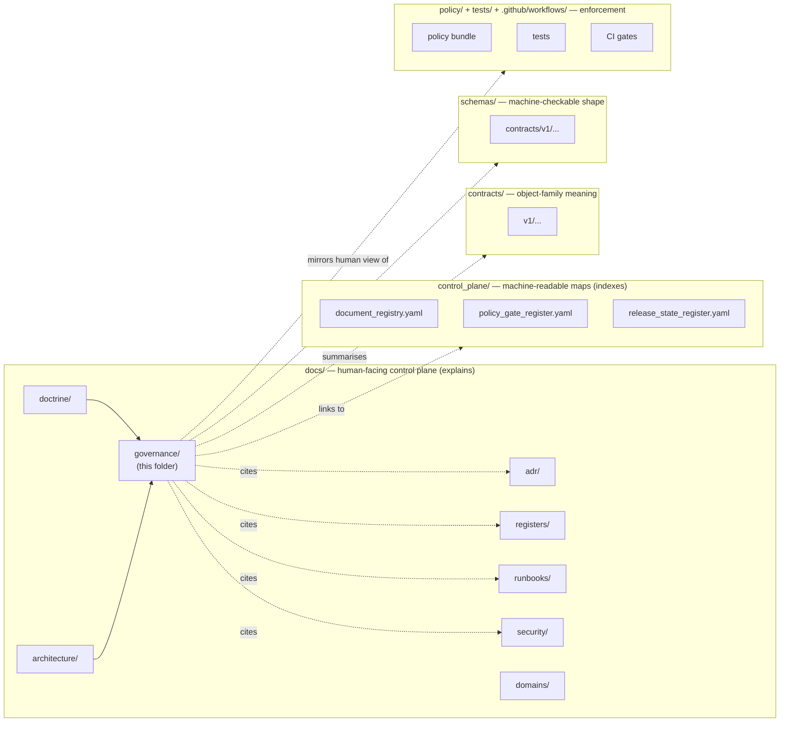

<!-- [KFM_META_BLOCK_V2]
doc_id: kfm://doc/docs-governance-readme
title: Governance — docs/governance/
type: readme
version: v1
status: draft
owners: ["@kfm-stewards"]
created: 2026-05-09
updated: 2026-05-09
policy_label: public
related:
  - docs/doctrine/directory-rules.md
  - docs/doctrine/authority-ladder.md
  - docs/doctrine/truth-posture.md
  - docs/doctrine/trust-membrane.md
  - docs/doctrine/lifecycle-law.md
  - docs/architecture/contract-schema-policy-split.md
  - docs/adr/README.md
  - docs/registers/AUTHORITY_LADDER.md
  - control_plane/policy_gate_register.yaml
tags: ["kfm", "governance", "review", "separation-of-duties", "promotion-gates"]
notes: "Human-facing landing page for governance docs. Explains; does not enforce. Enforcement lives in policy/, tests/, .github/workflows/, and control_plane/."
[/KFM_META_BLOCK_V2] -->

# Governance · `docs/governance/`

> **Human-facing landing page for KFM governance: who reviews what, where review duties separate, how promotion gates and the Definition of Done compose, and how corrections and rollbacks are governed.**

[](#status)
[](#authority-level)
[](#review-burden)
[](../doctrine/lifecycle-law.md)
[](../doctrine/truth-posture.md)
[](#last-reviewed)

> [!IMPORTANT]
> `docs/governance/` **explains.** It does not enforce. Enforcement lives in `policy/` (decisions), `tests/` (proof), `.github/workflows/` (CI gates), and `control_plane/` (machine-readable maps). If this folder and the executable layer disagree, **the executable layer wins** and a `docs/registers/DRIFT_REGISTER.md` entry is opened.

---

## Quick links

- [Purpose](#purpose) · [Authority level](#authority-level) · [Status](#status) · [Repo fit](#repo-fit)
- [What belongs / What does not](#what-belongs-here) · [Reviewer roles](#reviewer-roles--responsibilities)
- [Separation of duties](#separation-of-duties) · [PR review card](#pr-review-card)
- [Promotion Gates A–G](#promotion-gates-ag--quality-readme-pattern) · [Definition of Done](#definition-of-done)
- [Governance starter pack](#governance-starter-pack) · [Correction & rollback](#correction-withdrawal-supersession-and-rollback)
- [Inputs](#inputs) · [Outputs](#outputs) · [Validation](#validation)
- [Related folders](#related-folders) · [ADRs](#adrs) · [Open questions](#open-questions) · [Last reviewed](#last-reviewed)

---

## Purpose

`docs/governance/` is the **human-readable** landing page for KFM's governance posture. It collects the documents a reviewer, contributor, steward, or auditor needs to answer four questions:

1. **Who reviews what?** — reviewer roles and CODEOWNERS-aligned responsibilities.
2. **What separates?** — which generate / approve / publish / correct duties may not be held by one person or one automation, and at what maturity.
3. **What must pass before publication?** — the seven Promotion Gates (A–G), the per-domain Definition of Done, and the small set of governance-bearing repo files that make the gates auditable.
4. **What happens when something goes wrong?** — correction, withdrawal, supersession, and rollback procedures, and how they preserve lineage.

This folder does not redefine doctrine. The **doctrinal sources of truth** live in [`docs/doctrine/`](../doctrine/). This folder operationalizes them in a form a reviewer can read in five minutes before opening a PR.

---

## Authority level

**Canonical sub-folder** under the canonical `docs/` root.

| Aspect | Value |
|---|---|
| Authority kind | Explanatory (governance prose) |
| Owns meaning? | No — meaning lives in `contracts/` |
| Owns shape? | No — shape lives in `schemas/` |
| Owns decisions? | No — admissibility lives in `policy/` |
| Owns machine-readable governance maps? | No — those live in `control_plane/` |
| Owns release decisions? | No — release artifacts live in `release/` |
| Authority order applied here | Per `directory-rules.md` §2.1: doctrine → ADRs → directory-rules.md → per-root READMEs → dossiers → repo convention |

> [!NOTE]
> The four-layer separation `docs/` (explains) · `control_plane/` (indexes) · `contracts/` (defines meaning) · `schemas/` (defines shape) **MUST NOT** collapse. This folder lives in the first layer only.

---

## Status

| Item | Status | Notes |
|---|---|---|
| KFM doctrine cited here (lifecycle, gates A–G, cite-or-abstain, separation-of-duties intent) | **CONFIRMED** | From `directory-rules.md`, KFM Build Companion §21, Components Pass 10 §6.5 / §6.14. |
| The folder path `docs/governance/` itself | **CONFIRMED (rule)** / **PROPOSED (presence)** | The path is named in `directory-rules.md` §6.1; presence on `main` is not verified in this session. |
| Specific governance documents listed below as "should live here" | **PROPOSED** | Authoring order to be set by docs steward + release manager. |
| CODEOWNERS coverage referenced here | **NEEDS VERIFICATION** | Inspect `CODEOWNERS` and `.github/CODEOWNERS` once the repo is mounted. |
| Promotion-gate matrix synchronization with `policy/` bundle | **PROPOSED / NEEDS VERIFICATION** | Sync-check exists in doctrine; CI implementation requires repo evidence. |

> Memory is not evidence. Where a row above says **PROPOSED** or **NEEDS VERIFICATION**, do not treat it as repo fact.

---

## Repo fit

`docs/governance/` is one of several sub-folders that together form the human-facing control plane in `docs/`. It is bracketed by **doctrine** (anchors), **architecture** (system shape), **registers** (machine-readable cross-walks one layer over), **runbooks** (procedures), and **security** (threat model and exposure posture).


```mermaid
flowchart LR
    subgraph human["docs/ — human-facing control plane (explains)"]
        DOC[doctrine/]
        ARC[architecture/]
        ADR[adr/]
        REG[registers/]
        RUN[runbooks/]
        SEC[security/]
        GOV["governance/<br/>(this folder)"]
        DOM[domains/]
    end
    subgraph machine["control_plane/ — machine-readable maps (indexes)"]
        DR[document_registry.yaml]
        PG[policy_gate_register.yaml]
        RS[release_state_register.yaml]
    end
    subgraph meaning["contracts/ — object-family meaning"]
        CTR[v1/...]
    end
    subgraph shape["schemas/ — machine-checkable shape"]
        SCH[contracts/v1/...]
    end
    subgraph enforce["policy/ + tests/ + .github/workflows/ — enforcement"]
        POL[policy bundle]
        TST[tests]
        CI[CI gates]
    end

    DOC --> GOV
    ARC --> GOV
    GOV -. cites .-> ADR
    GOV -. cites .-> REG
    GOV -. cites .-> RUN
    GOV -. cites .-> SEC
    GOV -. links to .-> machine
    GOV -. summarises .-> meaning
    GOV -. summarises .-> shape
    GOV -. mirrors human view of .-> enforce
```

**Upstream of this folder:** `docs/doctrine/` (anchors), `docs/architecture/` (system shape), accepted ADRs in `docs/adr/`, and the executable enforcement layer (`policy/`, `tests/`, CI).
**Downstream of this folder:** contributors, reviewers, stewards, release managers, auditors; any tooling that lints README structure or scrapes the meta-block index.

[Back to top](#governance--docsgovernance)

---

## What belongs here

Authored, human-readable governance prose. Specifically:

| Document family | Role |
|---|---|
| `roles.md` (PROPOSED) | Reviewer-role roster, primary responsibilities, escalation paths. |
| `separation-of-duties.md` (PROPOSED) | Which duty pairs may not collapse onto one human or automation, and at what maturity threshold. |
| `pr-review-card.md` (PROPOSED) | The PR review card template and how reviewers use it. |
| `quality.md` / `gates.md` (PROPOSED) | Human-readable Promotion Gate Matrix A–G, kept in sync with `policy/policy-bundle.json`. |
| `definition-of-done.md` (PROPOSED) | Per-domain Definition-of-Done checklists; promotion is a documented event, not tacit judgment. |
| `starter-pack.md` (PROPOSED) | The five governance-bearing repo files (CODEOWNERS, `tool-versions.yaml`, `policy-bundle.json`, SBOM, `run_receipt.schema.json`) plus the `integrity.yml` workflow and `verify.sh`. |
| `commit-trailer.md` (PROPOSED) | The `meta:module / spec_hash / ticket / owners` trailer convention. |
| `material-change-report.md` (PROPOSED) | Description and cadence of the Friday material-change weekly report. |
| `correction-and-rollback.md` (PROPOSED) | The no-erase / supersede-with-lineage rule, and the rollback-card / correction-notice procedure. |
| `audit-and-incident.md` (PROPOSED) | How audit trails are queried, retained, and connected to incident response (`docs/security/`). |
| `glossary.md` (PROPOSED, optional) | Governance-specific glossary; may defer to `docs/doctrine/` if redundant. |

Files belong here when their primary purpose is **explaining** governance to a person. If the artifact is machine-readable, see `control_plane/`. If it is policy code, see `policy/`. If it is a contract or schema, see `contracts/` or `schemas/`.

[Back to top](#governance--docsgovernance)

---

## What does NOT belong here

| Out-of-scope content | Belongs in |
|---|---|
| Doctrinal anchors (lifecycle law, truth posture, authority ladder, trust membrane) | [`docs/doctrine/`](../doctrine/) |
| System shape (system context, deployment topology, governed-API boundary, map shell) | [`docs/architecture/`](../architecture/) |
| Architecture Decision Records | [`docs/adr/`](../adr/) |
| Machine-readable governance maps (registers, crosswalks, gate register) | [`control_plane/`](../../control_plane/) |
| Authority / drift / verification registers | [`docs/registers/`](../registers/) |
| Operational procedures, rollback drills, validation runs | [`docs/runbooks/`](../runbooks/) |
| Threat model, exposure posture, incident response | [`docs/security/`](../security/) |
| Source-descriptor standards and source families | [`docs/sources/`](../sources/) |
| Domain landing pages (hydrology, soil, fauna, …) | [`docs/domains/<domain>/`](../domains/) |
| Object-family meaning | `contracts/` |
| Field-level machine shape | `schemas/` |
| Allow / deny / restrict / abstain decisions | `policy/` |
| Release decisions, manifests, rollback cards, correction notices | `release/` |
| Tests that **prove** a rule is enforceable | `tests/` |
| CODEOWNERS file (the artifact itself) | repo root or `.github/` |

> [!CAUTION]
> Do not duplicate doctrine here. Cite it. Duplication causes drift; drift is a top-listed failure mode in `directory-rules.md` §13.

[Back to top](#governance--docsgovernance)

---

## Reviewer roles & responsibilities

Reviewer roles are the human side of the trust membrane. Each role has a **primary responsibility**, an **early implementation signal** (what tells you the role is actually being exercised in this repo), and a **CODEOWNERS pattern** that should select it.

> Source: KFM Build Companion §21.1, with role names preserved verbatim. CODEOWNERS patterns below are **PROPOSED** until verified against the in-repo `CODEOWNERS` file.

| Role | Primary responsibility | Early implementation signal | Proposed CODEOWNERS path-glob (NEEDS VERIFICATION) |
|---|---|---|---|
| **Repo steward** | Path rules, ADRs, directory responsibility, compatibility roots. | Path-decision cards; ADR review. | `docs/doctrine/`, `docs/adr/`, `docs/governance/`, root layout |
| **Contract / schema reviewer** | Meaning vs. shape split; schema versioning; fixtures. | Contract-schema crosswalk passes. | `contracts/`, `schemas/`, `fixtures/` |
| **Source steward** | Source authority, rights, source activation, attribution. | `SourceActivationDecision` required before connector work. | `docs/sources/`, `data/registry/sources/`, `connectors/` |
| **Domain steward** | Lane-specific claim burden, source roles, caveats. | Domain fixtures and source-role table approved. | `docs/domains/<domain>/`, `pipelines/domains/<domain>/`, `data/<phase>/<domain>/` |
| **Policy / sensitivity reviewer** | DENY / RESTRICT / ABSTAIN rules and public-safe transforms. | Policy fixtures cover risky cases. | `policy/`, `tests/policy/`, `docs/security/` |
| **Release manager** | Promotion, proof pack, release manifest, rollback target. | Release dry-run passes. | `release/`, `docs/governance/quality.md`, `data/proofs/` |
| **UI trust reviewer** | Evidence Drawer, Focus Mode, stale / correction display, accessibility. | UI payload contract and negative-state tests. | `apps/explorer-web/`, `packages/ui/`, `tests/ui/` |
| **Security / operator** | Secrets, access roles, local exposure, deployment, audit. | "No-direct-model-client" tests; deny-internal-paths tests. | `infra/`, `apps/admin/`, `.github/workflows/` |

> [!NOTE]
> Roles **may** be played by the same person on small teams. Separation-of-duties applies to **acts** (generate / approve / publish / correct), not to titles. See next section.

[Back to top](#governance--docsgovernance)

---

## Separation of duties

KFM doctrine: *for sensitive or consequential publication, one person or automation should not be able to generate, approve, publish, and correct without a review trail.* (KFM Build Companion §21.)

Maturity grows over time; the design **must leave space** for separation regardless of current team size.

| Act | Who **may** initiate | Who **must** approve before next stage | Trail emitted |
|---|---|---|---|
| **Generate** candidate (work, processed) | Domain editor; pipeline worker | n/a (candidate-only; not public) | `RunReceipt`, `ValidationReport` |
| **Approve** policy / sensitivity / source-role | Domain editor (proposes) | **Policy / sensitivity reviewer** *or* **Source steward** (depending on which gate) | `DecisionEnvelope`, `PolicyDecision` |
| **Promote** to PUBLISHED | Release manager | Two-key approval at Gate G; CODEOWNERS-enforced | `PromotionDecision`, `ReleaseManifest`, `ProofPack` |
| **Correct / withdraw / supersede** | Steward; release manager | Reviewer signs `ReviewRecord`; release manager signs `RollbackCard` | `CorrectionNotice`, `RollbackCard`, new `RunReceipt` |
| **Bypass / emergency** | Security / operator (only) | Post-incident review **mandatory**; ADR **required** if recurring | Incident receipt; ADR; updated policy |

**Watcher-as-non-publisher** is a hard rule: pipeline watchers may emit receipts and proofs and **open a PR**, but they may not commit to `main`. CODEOWNERS enforcement makes promotion a deliberate, reviewed state transition with a visible diff.

> [!WARNING]
> Bypass is logged, reviewed, and reversible. A bypass without a follow-up incident receipt and ADR (if recurring) is itself a finding.

[Back to top](#governance--docsgovernance)

---

## PR review card

Every non-trivial PR carries a compact review card. It is not a bureaucratic form; it makes hidden risk visible.

> Source: KFM Build Companion §21.2.

```yaml
# KFM PR review card (illustrative — adapt to repo conventions)
goal: <one-line statement of intent>
owning_root(s): <docs | control_plane | contracts | schemas | policy | tests | data | release | apps | packages | …>
directory_rules_basis: <section of directory-rules.md that justifies the placement>
object_families_affected: <e.g., EvidenceBundle, ReleaseManifest, SourceDescriptor, …>
contracts_changed: <list paths under contracts/ or "none">
schemas_changed:   <list paths under schemas/contracts/v1/ or "none">
fixtures_added_or_updated: <list paths under tests/fixtures/ or fixtures/ or "none">
policy_gates_affected: <list of A | B | C | D | E | F | G or "none">
public_exposure_possible: <yes | no>     # any path reachable through apps/governed-api/ or release/?
evidence_ref_or_bundle_impact: <"breaks", "extends", "no impact">
release_correction_rollback_impact: <"none" | description>
validation_commands_run: <commands and outcomes>
known_unknown_or_needs_verification: <list>
rollback_plan: <one or two lines: how to revert this PR safely>
```

**Reviewer's one-line check** (from `directory-rules.md` §4): *"Does the path encode the right responsibility, the right lifecycle phase (if data), and the right domain segment — and does this PR cite a rule for it?"*

[Back to top](#governance--docsgovernance)

---

## Promotion Gates A–G — Quality README pattern

KFM enforces **seven gates** between authoring and publication. Each gate maps a human-facing intent to a machine check and to required evidence. Auto-merge fires only when all seven pass; any failure blocks the merge until remediation.

> Source: Components Pass 10 §6.5.2 (C5-01). The matrix below is the **human-readable mirror** of the policy bundle. A CI sync-check fails when the bundle advances without a corresponding update here.

| Gate | Human-facing intent | Machine check (illustrative) | Required evidence | Authoritative implementation |
|---|---|---|---|---|
| **A** | Structure & metadata | `check_structure` (Meta-Block presence; section order; zone correctness) | README + Meta-Block v2 valid | `tools/docs/`, CI `integrity.yml` |
| **B** | Schemas & contracts | JSON-Schema + OpenAPI validation | Valid + invalid fixtures pass; contract-schema crosswalk closed | `schemas/contracts/v1/`, `tools/validators/` |
| **C** | Policy parity | Conftest / OPA decision matches CI and runtime (same Rego bundle pinned by digest) | `PolicyDecision` produced | `policy/`, `policy/policy-bundle.json` |
| **D** | Security & sensitivity | Sensitivity scan; rights / consent obligations honored; license check | Redaction receipts where required; access-role decision | `policy/sensitivity/`, `policy/rights/` |
| **E** | Data quality | DQ profilers / assertions with thresholds | DQ report meets thresholds | `tools/validators/dq/`, fixtures |
| **F** | Provenance & lineage | Receipt + lineage validation; catalog closure (STAC / DCAT / PROV) cross-checked | `RunReceipt`, `EvidenceBundle`, `CatalogMatrix` resolve | `data/receipts/`, `data/proofs/`, `data/catalog/` |
| **G** | Reviewability with two-key approval | CODEOWNERS-enforced human approval + policy approval | `ReviewRecord`, `PromotionDecision`; rollback target present | `CODEOWNERS`, `release/manifests/`, `release/rollback_cards/` |

**Finite outcomes.** Every governed runtime response is one of: `ANSWER` · `ABSTAIN` · `DENY` · `ERROR`. Validators **fail closed**: unclear evidence, rights, role, release, stale state, or sensitivity blocks higher-risk operations rather than guessing.

> [!IMPORTANT]
> Where a gate's behavior depends on a parameter (an epsilon, a threshold, a list of approved sources), this folder cites the parameter's location and value at time of writing. Drift between this folder and the policy bundle is a CI-blocking error, not an editorial choice.

[Back to top](#governance--docsgovernance)

---

## Definition of Done

Each KFM domain (hydrology, soil, fauna, flora, habitat, geology, atmosphere, roads-rail-trade, settlements-infrastructure, archaeology, hazards, agriculture, people-DNA-land) carries a **Definition of Done** — a checklist of receipts, schemas, gates, and tests that **must** be satisfied before a domain artifact can be promoted from CATALOG to PUBLISHED.

The shared envelope applies to all domains; the domain-specific checks differ. The Definition of Done captures the per-domain checks in a single place so that promotion is a **documented event**, not a tacit judgment.

**Shared envelope (every domain):**

- [ ] Object-family ready: `contract`, `schema`, valid fixture, invalid fixture, validator emits `ValidationReport`, at least one policy or evidence-closure test, docs link, rollback / supersession note. *(KFM Build Companion §5.2.)*
- [ ] Source descriptor activated, with `SourceActivationDecision` recorded.
- [ ] Catalog closure: STAC + DCAT + PROV records cross-validated by the catalog-integrity validator.
- [ ] `EvidenceBundle` resolves; `EvidenceRef` is not orphaned.
- [ ] Public-safe transforms applied where rights, sensitivity, or precise-location risk is present.
- [ ] `ReleaseManifest` includes `rollback_target` and links to the prior verified release.
- [ ] Two-key approval at Gate G recorded.

**Per-domain extensions** are authored in `docs/domains/<domain>/definition-of-done.md` and indexed from this folder.

> [!TIP]
> "Done" is not "merged." A merged PR may still leave a domain artifact at CATALOG. The transition CATALOG → PUBLISHED is the governed promotion that the Definition of Done gates.

[Back to top](#governance--docsgovernance)

---

## Governance starter pack

Five small files plus one CI workflow change the operational baseline. They are not aspirational — they are machine-checkable files that CI reads, runtime references, and review consults.

> Source: Components Pass 10 §6.14.2 (C14-01). All paths below are **PROPOSED** until verified against the mounted repo.

| File | Role | Authoritative home |
|---|---|---|
| `CODEOWNERS` | Names responsible reviewers per path; enforces watcher-as-non-publisher and two-key approval at Gate G. | repo root **or** `.github/CODEOWNERS` |
| `tool-versions.yaml` | Pins toolchain versions; reproducibility of CI and local runs. | repo root |
| `policy-bundle.json` | Pinned Rego policy bundle (digest-pinned); same bundle runs in CI (Conftest) and at runtime (PDP / Gatekeeper). | `policy/` |
| `sbom.yaml` (SPDX-2.3) | Software bill of materials for governed components. | repo root or `release/sbom/` |
| `run_receipt.schema.json` | Schema for the run-receipt object emitted by every governed run. | `schemas/contracts/v1/governance/` |
| `integrity.yml` workflow + `verify.sh` | Same integrity checks run locally and in CI; fail-closed semantics. | `.github/workflows/integrity.yml` and `scripts/verify.sh` |

**Commit-trailer convention.** Every commit that materially affects a KFM module carries structured trailers:

```text
meta:module=<module-name>
spec_hash=<sha256:...>
ticket=<tracker-id>
owners=<@handle, @handle>
```

CI rejects merges that lack the trailers on materially-affecting commits (anything that touches a schema, contract, policy, receipt, or generated artifact).

**Friday material-change report.** Every Friday an automated report aggregates the week's `spec_hash` advances, asset deltas, data-quality breaches, and promotion-gate state changes, and posts it to the team channel and a permanent archive. The report is the recurring trust ritual.

[Back to top](#governance--docsgovernance)

---

## Correction, withdrawal, supersession, and rollback

> **Doctrine:** corrections **never erase**, they **supersede with explicit lineage**. A published artifact without a documented rollback path is not a release.

| Action | Required behavior |
|---|---|
| **Rollback** | Re-point the public alias to a **prior verified release**. Do **not** delete the prior release. Verify the prior release manifest, catalog matrix, and evidence bundle before the alias moves. Emit a new `RollbackCard`, a new `RunReceipt`, and a `CorrectionNotice` if a public claim changed. |
| **Correction** | Issue a `CorrectionNotice` with `{correction_id, prior_release, new_release, reason, evidence_refs, signed_by, created_at}`. `correction_reason ∈ {data_error, source_error, policy_change, sensitivity_revision, scope_extension}`. The catalog points to the active release; consumers can walk `correction_lineage[]`. |
| **Withdrawal** | Disable the public layer / route via feature flag; preserve the proof trail; mark the prior release `release_state: REVOKED` with `rollback.previous_release` pointing to the prior PUBLISHED manifest. |
| **Supersession** | New release sets `correction_lineage[]` referencing the prior release; prior release is `release_state: SUPERSEDED`; immutable storage retained; UI shows correction visibility. |
| **Emergency bypass** | Feature-flag disable; steward notification; incident receipt; `RollbackCard`; `CorrectionNotice`; **post-incident policy / test update is mandatory**. |

> [!CAUTION]
> A rollback that was never drilled is not reliable. Rollback drills live in [`docs/runbooks/`](../runbooks/); rollback cards live in `release/rollback_cards/`; correction notices live in `release/correction_notices/`. This folder explains the procedure; the artifacts live where the executable layer can see them.

[Back to top](#governance--docsgovernance)

---

## Inputs

- **Doctrine** — `docs/doctrine/` (lifecycle law, truth posture, trust membrane, authority ladder, directory rules).
- **Architecture** — `docs/architecture/` (system context, deployment topology, governed-API contract, contract / schema / policy split).
- **ADRs** — `docs/adr/` (any decision that amends governance posture, schema home, role boundaries).
- **Machine-readable maps** — `control_plane/policy_gate_register.yaml`, `control_plane/release_state_register.yaml`, `control_plane/document_registry.yaml`.
- **Executable layer** — `policy/policy-bundle.json`, CI workflows under `.github/workflows/`, validator outputs from `tools/validators/`.

## Outputs

- **Reviewer enablement** — role roster, separation-of-duties table, PR review card template, Definition-of-Done checklists.
- **Auditor enablement** — human-readable Promotion Gate Matrix kept in sync with the policy bundle.
- **Contributor enablement** — what belongs / does not belong here, where to look next, where to file a drift entry.
- **Public trust signal** — links to public correction notices and rollback procedures (without leaking internal review trails).

## Validation

- **Meta-Block presence** — every README under `docs/` carries a valid `KFM_META_BLOCK_V2` block; CI denies PRs that add or change a README without one. *(NEEDS VERIFICATION in current repo.)*
- **Section-order lint** — README structure follows the section-order contract. *(PROPOSED.)*
- **Sync-check vs. policy bundle** — when `policy/policy-bundle.json` advances, this folder's gate matrix updates in the same PR; CI fails closed otherwise.
- **CODEOWNERS coverage** — every path-glob referenced in [Reviewer roles](#reviewer-roles--responsibilities) maps to at least one CODEOWNERS entry.
- **Link health** — broken-link check across `docs/` runs in CI; failures are findings, not warnings.
- **Last-reviewed freshness** — entries older than six months are auto-flagged in `docs/registers/DRIFT_REGISTER.md`.

[Back to top](#governance--docsgovernance)

---

## Related folders

| Folder | Relationship |
|---|---|
| [`docs/doctrine/`](../doctrine/) | Anchors. This folder cites; it does not redefine. |
| [`docs/architecture/`](../architecture/) | System shape. The governed-API doc is the executable form of the trust membrane. |
| [`docs/adr/`](../adr/) | Decisions that amend governance posture. |
| [`docs/registers/`](../registers/) | Authority ladder, drift register, verification backlog, object-family map. |
| [`docs/runbooks/`](../runbooks/) | Procedures including rollback drills and validation runs. |
| [`docs/security/`](../security/) | Threat model, exposure posture, incident response. |
| [`docs/sources/`](../sources/) | Source-descriptor standards and source families. |
| [`docs/domains/`](../domains/) | Per-domain landing pages and Definition-of-Done extensions. |
| [`control_plane/`](../../control_plane/) | Machine-readable governance maps; counterpart to this folder. |
| [`policy/`](../../policy/) | Executable policy decisions. |
| [`tests/`](../../tests/) | Proof that rules are enforceable. |
| [`release/`](../../release/) | Release manifests, rollback cards, correction notices. |
| [`.github/`](../../.github/) | CI workflows, CODEOWNERS, PR / issue templates. |

[Back to top](#governance--docsgovernance)

---

## ADRs

ADRs that **amend governance posture** are listed here. The full ADR index lives in [`docs/adr/`](../adr/).

| ADR | Status | Relevance to `docs/governance/` |
|---|---|---|
| `ADR-0001-schema-home.md` | accepted *(per `directory-rules.md` §0)* | Pins schema home to `schemas/contracts/v1/<…>`; affects Gate B evidence locations. |
| _Future:_ ADR for two-key approval policy at Gate G | PROPOSED | Should pin who counts as the second key and what evidence the policy approval emits. |
| _Future:_ ADR for emergency-bypass discipline | PROPOSED | Should pin retention, post-incident review, and recurrence threshold. |

> [!NOTE]
> Adding, removing, or renaming a canonical root, splitting or merging a lifecycle phase, creating a parallel home for schemas / contracts / policy / sources / registries / releases / proofs / receipts, or bending an invariant from `directory-rules.md` §3 **requires an ADR**. Do not change governance posture in this folder without a referenced ADR.

[Back to top](#governance--docsgovernance)

---

## Open questions

Per the project documentation contract (Components Pass 13, KFM-IDX-DOC-003), every lane README has a mandatory **Open Questions** section. A folder that claims no open questions is suspect.

1. **CODEOWNERS path-globs** in the Reviewer-roles table are PROPOSED; resolve against the actual `CODEOWNERS` file once the repo is mounted.
2. **Two-key approval at Gate G** — does the second key require a release manager + a policy reviewer, or release manager + domain steward? Author an ADR.
3. **Per-domain Definition of Done** — the shared envelope is documented; the per-domain extensions are PROPOSED and need authoring lane-by-lane (start with hydrology as the proof-bearing lane).
4. **Friday material-change report channel** — internal channel name and archive home are not pinned. Author and pin.
5. **Quality README sync-check enforcement** — is the sync-check blocking on first day, or advisory until the policy bundle stabilizes? Recommendation: blocking from day one for additions; advisory-with-grace for parameter changes.
6. **PR-review-card adoption threshold** — does every PR carry one, or only "non-trivial" PRs? Define the trivial-PR exclusion list.
7. **Status of `docs/governance/` itself on `main`** — NEEDS VERIFICATION; this README's presence and content should be checked once the repo is mounted.

Open items track in [`docs/registers/VERIFICATION_BACKLOG.md`](../registers/VERIFICATION_BACKLOG.md) and conflicting evidence in [`docs/registers/DRIFT_REGISTER.md`](../registers/DRIFT_REGISTER.md).

[Back to top](#governance--docsgovernance)

---

## Last reviewed

**2026-05-09** — initial authoring. Re-review when any of the following changes:

- A Promotion Gate is added, removed, or renamed.
- A reviewer role is added, removed, or renamed.
- The five-file governance starter pack composition changes.
- A new ADR amends governance posture.
- The policy bundle advances in a way that affects the human-readable matrix.

Older than six months → flag in `docs/registers/DRIFT_REGISTER.md`.

---

<details>
<summary><strong>Appendix · Master action matrix (full reference)</strong></summary>

> Source: KFM Domain and Capability Encyclopedia §10. Reproduced here for reviewer convenience; the authoritative copy is the encyclopedia. **Authority:** the encyclopedia overrides this appendix on conflict.

| Actor | Allowed actions | Denied actions | Required evidence | Required gates | Outputs |
|---|---|---|---|---|---|
| **Public visitor** | Browse public map; search; inspect Evidence Drawer; view stories; download public-safe exports | Direct RAW / WORK / QUARANTINE; exact sensitive locations; uncited AI answers | Released `EvidenceBundle` and public `ReleaseManifest` | Public-safe policy, rights, sensitivity, stale-state | Map view, report, citation, export receipt |
| **Researcher** | Advanced search; compare sources; export public / research datasets; notebooks | Restricted data without access approval; source scraping without rights | `EvidenceBundle`, source descriptors, research license class | Access role, export policy, citation validation | Notebook / export with citations |
| **Steward** | Restricted review; annotate uncertainty; approve redaction; handle corrections | Publish without release manager / review state | Source record, policy decision, review record | Sensitivity / rights / steward queue | `ReviewRecord`, `DecisionEnvelope` |
| **Domain editor** | Create candidate object; link evidence; propose schema updates; run validations | Promote own unreviewed work | Source records, fixtures, validation report | Schema / policy / evidence gates | `CandidateDelta`, `ValidationReport` |
| **Reviewer** | Approve / deny source activation, policy result, promotion candidate | Edit canonical truth without recorded decision | Candidate package and validation evidence | Separation of duties, audit | `ReviewRecord`, `PromotionDecision` |
| **Policy admin** | Manage policy gates and role classes; review deny reasons | Bypass audit or grant unlimited access | Policy register and tests | Least privilege, policy tests | `PolicyDecision`, audit log |
| **Release manager** | Assemble `ReleaseManifest`; promote; rollback; withdrawal | Release without proof / rollback | Proof pack, release candidate, rollback card | Release gate, signatures / checksums | `ReleaseManifest`, `RollbackCard` |
| **Developer** | Implement schemas / APIs / validators / tests; no-network fixtures | Claim production behavior without tests / logs | Issues, ADR, tests, fixtures | CI, review, security | PR, test report, docs |
| **AI assistant** | Summarize released evidence; draft explanations; suggest validators | Uncited claims; direct model endpoint; policy override | `EvidenceBundle` context | Pre / post policy and citation validation | `RuntimeResponseEnvelope`, `AIReceipt` |
| **Source connector** | Fetch source under approved descriptor; emit receipts | Fetch unknown-rights data to public path | `SourceDescriptor` and credentials policy | Rights / source cadence / terms | `RawCaptureReceipt`, `RunReceipt` |

</details>

[Back to top](#governance--docsgovernance)
